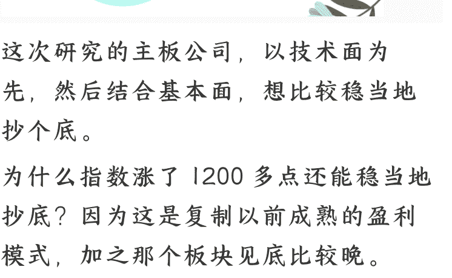
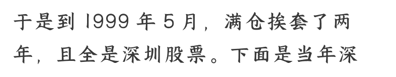
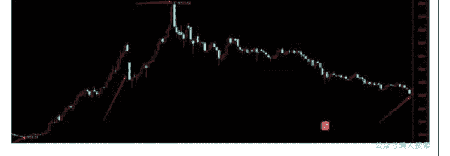
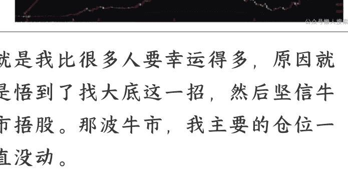
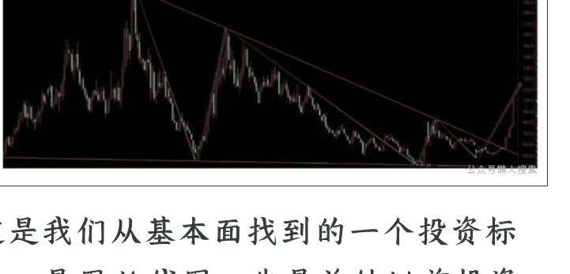
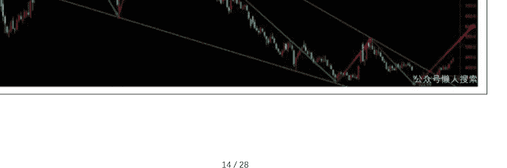
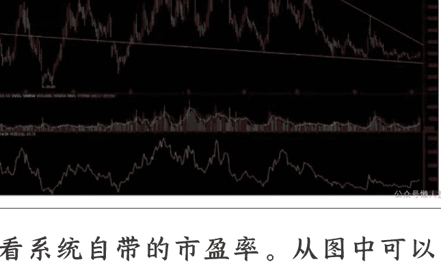
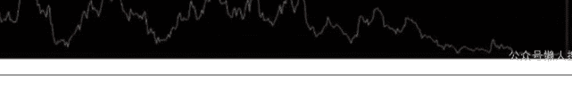
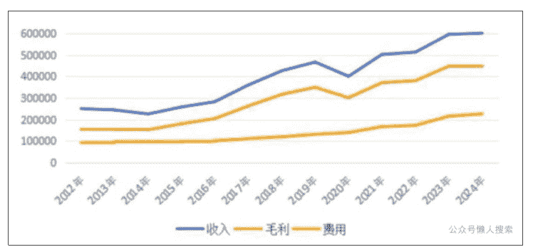
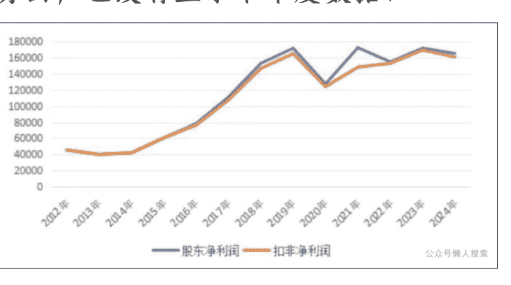

# 技术派 1：复制成熟的盈利模式，抄底

### 250912 安民 Anmin0001 深度分析

### 整理：公众号懒人搜索，懒人专属群独享

### 懒人微信：lazyhelper

这次研究的主板公司，以技术面为先，然后结合基本面，想比较稳当地抄个底。

为什么指数涨了 1200 多点还能稳当地抄底？因为这是复制以前成熟的盈利模式，加之那个板块见底比较晚。

在写这家公司之前，我们先讲个故事。大家不要只听故事，最好边听故事边理清清楚故事深处的逻辑链条。

老读者都知道，我靠做万科起家，挖到人生的第一桶金，这是选股先选行业的胜利。而真正让我抄准底部的，则靠的是技术活儿。换句话讲，真正改变我投资生涯的技术活儿就是找底和抄底。

此前是 1997 年 5 月 12 日，在 1510 点的大顶，深成指是 6103 点。当天券商营业部散户大厅的电视里播放着中央严厉打击股市的新闻，跟这两年大不一样。诸如印花税从千分之三加到千分之五，证监会还发布了《关于严禁国有企业和上市公司炒作股票的规定》。

我们也很清楚地知道是在大顶，因为 1996 年 12 月 11 日晚中央颁布过严厉打击炒垃圾股的有关精神，导致垃圾股普遍五到六个跌停板。涨跌停板制度就是那时推出的，此前 A 股是没有涨跌幅限制的，跟国际上一样。

那波炒垃圾股，000585 东北电曾经在一天内从头天收盘的 7.18 元，炒到当天最高 17.01 元，收盘 14.99 元，股民都传是从 8 块炒到 16 块翻番。

国家为此打击了又打击，市场一直不听，于是就推出了涨跌停板制度，股民说是下了十二道金牌。后来垃圾股就是 5 到 6 个跌停。

所以，1997 年 5 月 12 日中午，当看到电视里相关新闻时，我们很明确地知道是顶部。只是那年月我们也不太懂股票，但坚信当年市场上流传的巴菲特长期持股的说法，于是决定持有不动，一股不卖。下图是东北电一天翻番。

于是到 1999 年 5 月，满仓挨套了两年，且全是深圳股票。下面是当年深成指周 K 线图：

左下角第一个红箭头，是 1996 年 1 月深成指的点位，924.33 点。左边第二个红箭头，是中央打击垃圾股炒作时留下的下跌，垃圾股普遍 5 到 6 个跌停板，深成指那波从 4522.39 点跌到 2792.71 点，跌幅 38.25%。最上面的那个箭头是 1997 年 5 月 12 日深成指的最高点，6103.62 点。

那一波牛市，深成指涨了 660.33%，是大牛市。上证指数涨幅要小得多。

右下角的那个箭头，是 1999 年 5 月 17 日深成指的最低点，2521.08 点，两年中下跌了 58.70%。

后面就是著名的五一九行情。

那两年，满仓挨套的滋味真的不好受。但好在那个时候钱不多，所以尽管难受，但不至于睡不着觉。

于是我反思了两年。

1996 年是第二次进入股市，第一次进入股市只买了 200 股深宝安，因此根本就没有体会。第二次入市后，咱就到星火文具店买了坐标纸，手绘周 K 线图和成交量，盯 100 只个股和上证指数、深成指和深综指，用红蓝圆珠笔一周绘一根，这样就不是特别累。
到五一九行情前，很明确地知道是底部。我书房的柜门上，贴上了手绘的周 K 线图，每天晚上要看半个小时到一小时，寻找那种顶底的感觉。然后我看企业财报，是从 1996 年开始看，到 1998 年，花了两年时间才能看明白。

那两年，我手中有 5 万元，一直放在旁边没有动。满仓套牢后，长期反思的结果是，知道自己错在哪里。

既然选择长期持股，买的地方一定要是大底才成；长期持股而不是大底，那可不是挨套吗？就是我找到了自己炒股亏钱的症结，并找到了解决方案，找大底。只要找到了大底，那是挣多挣少的问题，而不是套牢的问题，找不到大底而长期持有，那一定套牢。希望大家记住这句话，并且融进自己终生的炒股实践中。

> （免责声明：本文只是技术分析和基本分析，只为开拓视野、引导思路，并非择时，亦非荐股。股市有风险，入市需谨慎。本文不构成投资建议或意见，我们无力为大家的投资负责，请大家注意投资风险。）

## 一、找底

于是就怀揣着那 5 万块钱，一直在找底。最后找到了万科 A 的大底。那波下跌，万科从 23.23 元一路跌到 7.4 元，我在 8 元的平台一次性全仓买入 5 万元，然后持有到 2007 年 10 月和 11 月卖了。命运由此改变。中间看好盐湖钾肥但在 2001 年顶部卖了，把仓位留给了万科，然后错过了盐湖钾肥后面的大涨行情。

2005 年到 2007 年，还做过云南铜业，用后复权，它从 5.47 元一路涨到了 298.28 元，54.53 倍。只是当时持仓不多。看看那一波云南铜业波澜壮阔的上涨。只用了 114 周，两年多点的时间。

就是我比很多人要幸运得多，原因就是悟到了找大底这一招，然后坚信牛市捂股。那波牛市，我主要的仓位一直没动。

所以我始终坚信投资可以改变命运。
而且复盘 1996 年到 1997 年的牛市，
我当初炒过的很多股票，在那波牛市中都是十几二十几倍的涨幅。换句话说，如果 1996 年到 1997 年我有成熟的抄底逃顶技术，那早就提前 10 年改变命运了。比如深振业、深宝恒 000031、深达声、深能源等。

然后每波牛市来了之后，作为老投资人，我们会经常碰到读者或者身边的朋友问，您可不可以介绍一只股票，我打算持有它 5 年 10 年，长期持有不动的那种。然后我会回复，没有这样的股票。

为什么我会这么讲呢？因为他们明明是凑热闹来的对吧。他们是真的凑热闹来的吗？是的。

那为什么咱敢肯定他们是凑热闹来的呢？因为在 2024 年 1 月份、2 月份，他们从来没有问我该买什么股，该选出一只什么样的股票长期持有对吧。还有去年 9 月份的时候，他们也没有这样讲过。哪怕那个时候他们天天碰到我，也没有开过口。

但大家知道我们团队对大底的判断能力对吧，去年 2 月 5 日的大底，我们找得非常精准。我们 2 月 1 日的文章是《砸锅卖铁买股票》，讲得多明白？然后时间和点位都给了。那篇文章当时只有 400 多人认真看了，现在也才 900 多。我们 2024 年 1 月份的文章标题是《投资大时代，不要放过那种改变您一生命运的大机会》，明确告诉大家了，是大机会，是改变大家一生命运的机会。这还不明白吗？

2024 年 9 月的文章，干脆叫做《9 月抄大底》，里面明确地告诉大家是 9 月 13 日和 18 日。

换句话讲，如果您要投资的话，那么，那两个点是非常好的底部投资时间，在那两个点您是可以找得到大底的。随便找，一抓一大把的那种对吧。就是在那附近，您真的可以找得到买入后持有几年不动的股票的。

我的亲戚朋友同学，有几个我们都是去年 1 月底告诉他们抄大底，还提前几个月告诉他们 9 月 18 日是第二个大底，但他们都根本不会动手的，可到了 3800 点以后，再来跟我讲找只股票拿几年，您再来跟我说投资，我会相信吗？您当我傻瓜呢是吧？

以前历史上，2003 年到 2005 年，我所有的同事当时问我买什么股票。我都说万科。

他们说万科盘子太大了，能不能换一只？云南铜业。

他们说还是大盘股，还有没有？

我们就给了深振业和盐湖钾肥。然后他们没有任何一个人买，直到涨了几倍以后，他们来问，万科还能不能追，然后我再也不敢回复。

他们就说，你就一个人挣钱，也不带着点我们。

呵呵，都是这样，这都是人性。我们在股市摸爬滚打几十年，这样的事例经见得多了。

所以，不要以您普通散户的眼光和经验来看股市。那都是错误的。这里就是黄教主的那句话，我不要你觉得，我要我觉得。

其实，我要我觉得，并不真的是我觉得，而是市场觉得。这句话的准确意思是，我不要你觉得，也不要我觉得，我要市场告诉我的那个我觉得。只有市场告诉了我的那个我觉得，才是真的觉得。这句话您仔细体会去，就是这么一回事。

我们的观点，是随着市场走的，我们没有主观的观点。而跟风进来的人，一肚子的自己的想法。我们对这个没有兴趣，也没有那时间听您怎么想，因为那一点都不重要。我们只关注市场能告诉我们什么，市场一旦走到了它的那个点，我们就会有结论。那个时候才是我觉得。

现在都 3800 多点了，已经涨过 1200 点了，然后您问我，您想找只股票长期持有，这样的事情，很不好做。说句不客气的话，您这是为难我。

我们的观点是什么呢？就是现在找能持有几年的股票，可能很难，但找涨 50% 或者翻倍的股票，还是找得到的。

2019 年到 2021 年，上证指数从 2440 点涨到 3731 点，一波牛市只涨了 1291 点，其后跌了 3 年整，有的股票跌到去年 9 月份，跌了 3 年 7 个月，光伏设备跌到今年 4 月 9 日。然后 8 月 26 日最高 3888.60 点，此时涨了 1253.51 点，然后您说您想选只股票长期持有改变命运？这不是凑热闹是干吗？您玩儿我呢对吧。

如果这波是小牛市呢？如果只涨个 1200 点，然后再跌个 3 年呢？如果这个判断成为现实呢？对吧。那您岂不是为难我？这样的事情前面也不是没有过？

如果真的是小牛市，见顶了再跌个 3 年，到时您岂不会骂死我，说你他娘的什么水平，在高位要老子投资，长期持股。您嘴里马上是另一套说辞对吧。您不会说是您自己要投资的，只会说我要您投资的，而且我的文章还在那里，天天说投资改变命运对吧？那这些人是什么性质？他们是被股市大涨吸引过来的，是怕失去了挣大钱的机会，真正的想法是进来捞一把就走，就是一定挣大钱，还一定不能套牢。他们不是真正想投资而是投机。只是可惜的是，他们已经失去了抄大底的最佳时机，然后还想去抄那种持有几年不动的大底对吧。

这相当于什么情况？相当于他人已经置身于青藏高原，然后他还想在青藏高原上找到海拔 0 米或 10 米的地方。或者他已经坐上了飞机，飞机已经飞到了哈萨克斯坦领空，他们这趟航班飞往伦敦，然后他对空乘说，我现在就要回北京去天安门。我问您，可能吗？

空乘会讲，哪边凉快您哪边呆着去。换句话讲，当指数已经过了 3800 点，有人大概率已经失去了抄到这波牛市能涨 20 倍、10 倍以上股票的底部。能抄到涨 3 倍的股票的底，那就是非常幸运的，而且这种可能性，多数人都已经没有了。这种节奏感我们一定要有的。牛市已经运行一年半了，有的非常好的大机会已经没有了。剩下的机会，肯定不再是原来的那种大机会了，肯定要小一些，甚至小得多。时间是有成本的，也是有代价的。

我们在去年 2 月 5 日、9 月 13 日和 18 日，还有今年 4 月份都找到了底。前两个底是能够长期持有的底。后一个底，持有到这轮牛市结束没有多大的问题。这些是大概率。

小概率是什么？是有些漏掉了的底，现在还在。

这是我们要讲的第一层意思：找底，找那种漏掉的底。

## 二、顺势而为 + 盈利模式重复

第二呢，就是生活中我们会碰到很多人，很固执，特别喜欢坚持自己的观点。这个特点在其他地方可能是优点，但在资本市场可能是很大的缺陷。因为我们都该知道顺势而为。

这句话是什么意思呢？就是我们小时候在农村走路，前面是座山，您得翻过去；前面是条河，您得过去；前面是座桥，您从桥上过；前面是个水库，您走水库埂子；前面是个坑，您得避开；前面有堆牛粪，您得跨过去。也即是，我们就得要顺势，不是大势按我们的来，是我们按大势的来，不是股票按我们的来，是我们按股票自身的走势来操作。

关于大势，关于股票的长线或短线走势，我们散户啥也不是，什么也影响不了。您钱再多，做微盘股，可能会影响三两分钱，做大盘股，您一分钱都影响不了，一秒钟都影响不了。所以，您只能顺其自然。就是放弃主观，放弃自我，选择客观，这样的自我，才能够迎接新生。否则您炒股只能凭运气。

而老股民都知道，凭运气挣到的钱，都会凭实力输掉。

所以，这里我们要有一个核心思想，就是放弃自我的主观臆想，迎接股市的客观趋势。当您想明白了这个问题，您炒股就入门了。

前面以黄教主口吻讲的那一段，就是这个意思。然后呢？

第二步就是找底和抄底。找到底部，持有到一定的高度出局。那个高度是什么高度，是投资收益您自己比较满足的高度，或者大势或者标的个股见顶了的高度。然后再不断地去复制您的成功投资。

去年底今年初，我跟一同学交流的时候，他讲了很多，包括各种战法，然后我只跟他讲了一句话，就是复制成功的盈利模式。

这句话，他听懂了吗？没有。他后来跟我说，他听了很迷茫，然后他跟我说，复制盈利模式是什么意思？他问我，我的盈利模式是什么？我说，您的盈利模式是您的资金规模对吧，您现在资金规模 20 万，那您的盈利模式就是赚个 10 万，那就算成功了；您资金规模 100 万，那您的盈利模式是赚个 50 万，那就算成功了。您不要想赚个 800 万，那样是超出您的盈利模式了。

他说，那如果我的盈利模式是赚个 20%，那您能告诉我我该怎么去操作股票吗？

我说，很简单，我教你啊，首先找底。

然后，抄起底。

然后，等待它涨到 20% 或者您觉得比较满足了。

然后，卖出股票，实现盈利。

这就是盈利模式。复制这种模式，就是不断去复制成功的经验。

这很简单，对吧？

那为什么很多人不愿意复制这种成功的盈利模式呢？

因为他们想复制别人的经验，而不是自己的经验。他们想复制别人的成功经验，但是又不知道别人的经验是什么。其实，别人的经验就是别人的盈利模式，就是别人怎么赚钱的。

所以，复制盈利模式，就是不断去重复成功的经验，复制成功的操作手法。

换句话讲，就是不断去重复赚钱的操作手法。

那为什么很多人不愿意这样做呢？

因为人性中有一个特点，就是不愿意承认自己的错误。一旦自己承认错误，那么自己的面子就挂不住了。

在股市中，承认自己的错误是极其痛苦的。

一旦承认自己的错误，那么自己的自信心就受到很大的打击。

所以，很多人不愿意承认自己的错误，他们总是固执地坚持自己的观点，坚持自己的操作手法。

但是，在股市中，坚持自己的观点，往往会导致错误的操作。

所以，承认自己的错误，是极其重要的。

只有承认自己的错误，才能不断去改进自己的操作手法，才能不断去复制成功的经验。

那为什么很多人不愿意承认自己的错误呢？

因为他们害怕失去面子，害怕失去自信心。

但是，在股市中，面子并不是最重要的。

最重要的是您的钱包。

所以，承认自己的错误，是极其重要的。

只有承认自己的错误，才能不断去改进自己的操作手法，才能不断去复制成功的经验。

那为什么很多人不愿意承认自己的错误呢？

因为他们害怕失去面子，害怕失去自信心。

但是，在股市中，面子并不是最重要的。

最重要的是您的钱包。

所以，承认自己的错误，是极其重要的。

只有承认自己的错误，才能不断去改进自己的操作手法，才能不断去复制成功的经验。

## 三、形态复制 + 基本面可行

第三步就是找股票。

如何找股票？

找基本面可行，找形态复制。

找形态复制是什么意思呢？

就是找那种跟过去某个大牛股形态相似的个股。

例如，过去某个大牛股是从 10 元涨到 20 元，然后再从 20 元涨到 40 元。

现在有个股从 10 元涨到 20 元，形态非常相似。

那么这个个股可能也会从 20 元涨到 40 元。

所以，找形态复制，就是找那种跟过去某个大牛股形态相似的个股。

那为什么很多人不愿意找形态复制呢？

因为他们不愿意找那种跟过去某个大牛股形态相似的个股。

但是，在股市中，找形态复制是极其重要的。

只有找形态复制，才能不断去复制成功的经验，才能不断去复制成功的操作手法。

所以，找形态复制，是极其重要的。

只有找形态复制，才能不断去复制成功的经验，才能不断去复制成功的操作手法。

那为什么很多人不愿意找形态复制呢？

因为他们不愿意找那种跟过去某个大牛股形态相似的个股。

但是，在股市中，找形态复制是极其重要的。

只有找形态复制，才能不断去复制成功的经验，才能不断去复制成功的操作手法。

最后一步就是找基本面可行。

如何找基本面可行呢？

找那种业绩增长稳定，财务状况良好，行业前景好的个股。

只有找基本面可行，才能不断去复制成功的经验，才能不断去复制成功的操作手法。

所以，找基本面可行，是极其重要的。

只有找基本面可行，才能不断去复制成功的经验，才能不断去复制成功的操作手法。

那为什么很多人不愿意找基本面可行呢？

因为他们不愿意找那种业绩增长稳定，财务状况良好，行业前景好的个股。

但是，在股市中，找基本面可行是极其重要的。

只有找基本面可行，才能不断去复制成功的经验，才能不断去复制成功的操作手法。

所以，找基本面可行，是极其重要的。

## 2025 年财务数据表

| |年份|收入|成本|毛利|费用|股东净利润|扣非净利润|
| :---:|:---:|:---:|:---:|:---:|:---:|:---:|:---:|
| |2012 年 |135642.83|97893.77|37749.06|23982.61|15800.44|12822.98|
| |2013 年 |216010.35|123776.01|92234.34|16241.04|72068.20|50593.75|
| |2014 年 |202089.71|111448.24|90641.47|24066.50|62629.99|39635.35|
| |2015 年 |263421.79|142413.69|121008.10|40526.41|77102.40|60558.14|
| |2016 年 |218982.42|107776.27|111206.15|17789.54|91215.53|61198.84|
| |2017 年 |278871.80|157170.71|121701.09|26890.95|91050.21|77160.26|
| |2018 年 |344506.92|179476.10|165030.82|30523.22|130138.68|122528.08|
| |2019 年 |472049.41|243297.09|228752.32|46255.55|177516.85|149013.21|
| |2020 年 |648278.14|299473.19|348804.95|62724.41|265707.49|219513.22|
| |2021 年 |797598.51|353243.19|444355.32|78148.05|365235.70|329101.03|
| |2022 年 |1558290.00|892117.30|666172.70|133106.80|508542.80|458496.60|
| |2023 年 |1909994.80|1058520.55|851474.25|169566.75|680717.25|607942.70|
| |2024 年 |1489853.40|897772.75|592080.65|187238.15|441753.30|416769.25|
| |2025Q2|5704654.42|3604650.63|2100003.79|175534.44|69820.65|69820.65|

## 三、603589 和前期光伏设备公司底部的差别

先看系统自带的市盈率。从图中可以看出，公司当前的市盈率是自 2017 年秋天以来比较低的位置（单位，倍）。

即市盈率具有相对优势，处于比较低的位置。再看市净率。（单位，倍）：

市净率指标是很低的，为历史低位。
1.99 倍，历史上位于 2017 年秋天以来

4.77% 的位置。也就是前 8 年中，95.23% 的时间高于这个定位。

该公司是白酒公司，即 603589，口子窖。整个行业目前都处于低位。

还有，根据楔形的技术测算，它还是有上涨空间的。当然，要突破楔形的上轨压力线。

公司的估值。前 4 年中股东净利润低的是 15.5 亿，高 17.27 亿，因此公司未来股东净利润应该在 15 亿到 18 亿。公司总股本是 6 亿，目前市值 208.08 亿，相当于市盈率的 11.56 倍到 13.87 倍，不算贵，但也不算便宜。考虑这里难以大跌，主要在于形态限制住了，加上市净率很低，而现在是牛市，因此这里有一定的操盘价值，盈利相对容易一些，亏损相对有难度。

### 三、603589 和前期光伏设备公司底部的差别

二者都是大型三角形。但光伏设备公司的底部有两个优势，一是估值更低，便宜。二是光伏设备公司增长速度不错，因此动力也不错，故而启动在前。只是行业基本面不好，光伏行业的基本面差于白酒。然后有政策反内卷做支撑。

本公司的市盈率要高一些，尽管市净率不高，不到两倍，但增长情况要差一些，毕竟是业绩下滑。故而它什么时候启动，存在不确定性。但 10 月底前肯定启动。估计需要行业的带动力。即当行业某公司大涨以后，带动它们上涨。

第一，总体上是上升的。

第二，2020 年有 1 年下滑。

第三，2024 年基本上是停滞，略有增长。

第四，今年前两个季度下滑，但没有全年数据，因此图上没有显现。
再看股东净利润和扣非净利润长期走势图，也没有显示半年度数据：

股东净利润和扣非净利润，从 2019 年以来，就是高位盘整。股东净利润五年间有波动，扣非净利润在股东净利润第二个下滑的年份，它是上升的，但 2024 年二者同向，小幅下滑。今年前两个季度下滑还是比较多的。股东净利润下滑 24.63%，扣非净利润下滑 24.90%。

然后看看它的毛利率、费用率、股东净利率和扣非净利率几个指标：

| | 毛利率% | 费用率% | 股东净利率% | 扣非净利率% |
|---|---|---|---|---|
| 2012 年 | 61.72 | 37.09 | 18.19 | 18.04 |
| 2013 年 | 62.93 | 39.78 | 16.27 | 16.31 |
| 2014 年 | 67.59 | 43.05 | 18.69 | 18.50 |
| 2015 年 | 67.86 | 44.46 | 20.99 | 21.05 |
| 2016 年 | 66.57 | 45.01 | 17.16 | 17.44 |
| 2017 年 | 67.18 | 47.10 | 16.82 | 16.90 |
| 2018 年 | 66.66 | 43.63 | 18.86 | 19.08 |
| 2019 年 | 64.38 | 43.39 | 18.53 | 18.60 |
| 2020 年 | 62.96 | 43.44 | 19.86 | 19.97 |
| 2021 年 | 67.33 | 48.67 | 20.07 | 20.15 |
| 2022 年 | 66.38 | 46.43 | 18.45 | 18.49 |
| 2023 年 | 66.41 | 47.67 | 17.06 | 17.07 |
| 2024 年 | 65.98 | 45.44 | 18.31 | 18.19 |
| 2025Q1 | 68.25 | 43.22 | 19.78 | 19.80 |
| 2025Q2 | 73.07 | 36.53 | 28.25 | 27.59 |

注意 2025Q1、2025Q2 数据是预测值，仅供参考。

### 四、三条线的压力位和支撑位

| 时间 | 支撑线 2 月 4 日 | 支撑线 3 月 2 日 | 压力线 1 月 3 日 | 压力线 2 月 1 日 | 压力线 3 月 1 日 |
|---|---|---|---|---|---|
| 8 月 29 日 | 30.91 | 33.98 | 53.73 | | |
| 9 月 29 日 | 32.75 | 35.83 | 55.57 | | |
| 10 月 14 日 | 34.36 | 37.45 | 57.18 | | |
| 10 月 29 日 | 35.51 | 38.58 | 58.33 | | |
| 11 月 5 日 | 35.92 | 38.99 | 58.74 | | |
| 11 月 7 日 | 30.59 | | 52.30 | | |
| 11 月 14 日 | 34.55 | | | 55.07 | 64.28 |
| 11 月 20 日 | | | 54.35 | 60.78 | 58.38 |
| 11 月 27 日 | | | 53.75 | 57.18 | |
| 11 月 30 日 | | | 53.24 | 57.88 | 57.13 |
| 12 月 6 日 | 34.63 | | 54.30 | 58.93 | 57.20 |
| 12 月 11 日 | 35.18 | | 54.68 | 59.08 | 58.79 |

### 那么，选择这个标的的理由是什么呢？

1. **长期走势稳定**
   - 公司长期走势稳定，市盈率不高，市净率偏低。
   - 属于低估值区域。

2. **形态支撑**
   - 公司目前处于一个大三角形形态，且位于上升通道。
   - 形态上有一定的底部支撑。

3. **行业对比**
   - 与光伏设备公司相比，虽然估值稍高，但行业基本面（白酒行业）更强。
   - 行业有政策（反内卷）支撑。

4. **技术面测算**
   - 技术面上有上涨空间，需突破楔形上轨压力线。
   - 2024 年 Q2 预测有大幅改善（预测数据）。

### 风险提示

- **行业风险**：白酒行业受宏观经济影响。
- **政策风险**：政策变化可能影响行业。
- **业绩波动**：公司业绩下滑，需关注未来财报。
- **市场风险**：大盘波动影响个股。

> **免责声明**：本分析仅供参考，不构成投资建议。

---

**关注我们获取更多信息**

**公众号：[公众号名称]**
**公众号链接：**

> [https://t.zsxq.com/12345](https://t.zsxq.com/12345)
>
> **视频号：** [视频号名称]
> **视频号链接：**
> [https://v.douyin.com/12345](https://v.douyin.com/12345)
>
> **B 站：** [B 站名称]
> **B 站链接：**
> [https://space.bilibili.com/12345](https://space.bilibili.com/12345)
>
> **小红书：** [小红书名称]
> **小红书链接：**
> [https://www.xiaohongshu.com/user/profile/12345](https://www.xiaohongshu.com/user/profile/12345)

**欢迎转发！**

**👀 扫码关注，获取最新资讯！**

**🕵️‍♂️ 关注我们，投资路上不迷路！**

