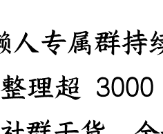
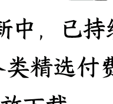

# 从中央到地方高度一致，赛事经济和体育消费迎来爆发
250915 《政经参考》节选

整理：公众号懒人搜索，懒人专属群独享

懒人微信：lazyhelper

如果要问今年最火的经济形势是什么？我估计你的答案中大概率有一项，是赛事经济。

今年继“苏超”火爆出圈之后，各个地方纷纷推出了自己的文体赛事，比如河南的“豫超”，广东的“粤超”，四川的“川超”，江西的“赣超”，浙江的“浙BA”等等，一时间大江南北都掀起了一场“赛事热潮”。

而国家也及时送上了政策暖风，9月4日，国务院办公厅发布《关于释放体育消费潜力进一步推进体育产业高质量发展的意见》，其中明确提到要“鼓励举办区域性体育赛事活动。支持新兴体育项目赛事活动健康规范开展”。

我先给出判断，从民间到地方政府到中央政府，正在形成一个巨大的新共识，而文旅体育，也会成为中国发展服务消费的重要抓手。

## 突然爆发的赛事经济

我们先来看看各地赛事经济的火爆程度。

就拿上海、广州这两座一线城市来说，上海今年计划举办国际赛事 67 项，全国赛事 111 项，每一项都是高对抗、高水平的体育赛事。广州今年预计将举办超过 500 场赛事活动，广东省委主管、主办的《羊城晚报》，甚至还喊出“办赛事就是办城市”的口号。

放大到省域来看，山东省今年上半年，共举办受众 500 人以上的体育赛事近 700 项；河北省今年上半年，更是举办了 5500 多场各类比赛。

为什么各地疯狂举办本地赛事？因为这些有影响力的比赛，往往能成为一座城市的“流量密码”，带来可观的经济收益。

苏超开赛以来，单场上座超过了 6 万人，带动江苏全域多场景消费 380 亿元；河北省举办的 5500 多场赛事，也带动了直接消费 269 亿元。

杭州世预赛，超 7 万人从全国各地汇聚而来；武汉马拉松期间，7.1 万游客涌入，外地游客因参赛产生的直接消费总额 1.17 亿元。

今年上半年，文化产业成为消费增长的亮点，规模以上，简单理解，就是规模大一点的文化企业增速 7.4%，文化服务业营业收入同比增速更是高达 10.7%，居文化产业细分首位；而体育娱乐用品的零售额，更是大涨了 22.2%，成为真正的“消费新秀”。

赛事经济的爆火，不是偶然，背后也有国家政策的推手。早在《“十四五”体育发展规划》中就提出，“体育产业总规模到2025年要达到5万亿元……居民体育消费总规模超过2.8万亿元，从业人员超过800万人。”并提出了70条涵盖方方面面的推进措施。

而在今年中央印发的《提振消费专项行动方案》中，更直接点名要“扩大文体旅游消费”，还要“支持各地增加优质运动项目和特色体育赛事供给。优化营业性演出、体育赛事和各类大型群众性活动审批流程”。这一条很关键，我理解等于是为各地的赛事经济打开了“方便之门”，让各地可以形成“文体旅大融合”，赛事经济终于等到了爆发的时候。

而地方层面，一个最新的注脚是，9月9日，浙江省体育局印发了《浙江省赛事经济促消费激励举措》，明确要通过精准激励，支持各地引进举办高规格体育赛事，聚焦人流推动赛事经济发展，进一步激发消费活力。地方的摩拳擦掌，可见一斑。

# 赛事经济的“乘数效应”

那么，为什么各个城市突然间这么看重赛事经济呢？

我分析本质是因为赛事经济的巨大杠杆，这里面有强大的产业乘数效应，赛事的核心盈利模式，早已超越传统的门票收入，赛事带来的流量以及背后的本地生态消费，才是真正的“金矿”。

传统产业模式往往是“链条式组织”，上游对接中游，中游面向下游，而赛事经济会让众多的产业“黏”在一起。这里我展开谈谈：

第一，赛事经济不再只是体育竞技，而是一种复合型、体验式的消费包。一场顶级赛事，如同一块磁石，能高效吸附跨区域的人流、资金流与信息流，这些流量从场馆内，向外溢出到酒店、餐饮、交通、零售、文旅景点等等，形成强大的经济拉动。而且，赛事 IP 本身也是一座待挖掘的富矿，从媒体版权、商业赞助，到衍生品开发、教育培训，赛事构成了一个层次丰富、可持续的商业模式。

第二，赛事经济因为它的“流量属性”，也是数字技术应用的绝佳场域。从票务系统的云端处理、现场 5G+8K 超高清转播、AR/VR 沉浸式观赛，到基于大数据的运动员表现分析、粉丝社群的数字化运营，赛事经济为云计算、人工智能、虚拟现实等技术，提供了丰富的应用场景和商业化出口。

第三，这会极大重塑一个城市的软实力和对外品牌。过去，城市竞争多集中在基础设施、优惠政策、土地成本等“硬要素”层面；而赛事经济的兴起背后，也是城市竞争愈发转向文化活力、城市品牌、市民认同、生活品质等“软实力”，而这一切背后，是要打造大家对一个城市的好感和信任。

这一点现在越来越重要，还记得我在第 160 节课程提到，内容生产力对中国城市的推动吗？最典型的是杭州和成都，这两座网红之城，成功给自己加上了内容能量，让“创新”“年轻”“活力”“幸福”“有未来”等词语，成为自己的城市标签，进而可能成为大家尤其是年轻人的共识。他们通过增加大家对这个城市的“好感度”，变成这个城市的“总体加分项”，吸引更多的年轻人。这个逻辑，现在正被越来越多的城市效仿。

这里我特别说一下，经过这几年的沉浮，网红城市的打造，越来越考验配套和产业实力。不能让粉丝们持续参与的“网红城市”，很容易昙花一现。通过短视频引流的美食经济，包括淄博烧烤和天水麻辣烫，更容易因为没有成熟的产业化链条、连锁化品牌以及可持续的体验供给，难以保持热度；而主推冰雪经济的哈尔滨，则依托场馆、赛事、旅游线路与产业招商等，形成了完整链条，能够更长久。而赛事经济，和冰雪经济的逻辑更类似，这也是很多城市的一个考量维度。

# 体育消费正在成为大趋势

所以我的判断是，赛事经济的发展趋势已经越来越确定，它的产业地位在今年也大幅上升。我在第 161 讲课程中提到过一个核心趋势，就是国家要从生产型社会转向消费型社会，要从聚焦“商品消费”转向聚焦“服务消费”，而赛事经济，恰恰是服务消费中非常有活力的一环。

国务院办公厅 9 月初刚发布的《关于释放体育消费潜力进一步推进体育产业高质量发展的意见》（以下简称《意见》），就是一个例证。《意见》提出，到 2030 年，体育产业发展水平大幅跃升，总规模超过 7 万亿元。

接下来，我就展开谈谈这份文件的核心要点：

首先，在我看来，这份文件的亮点之一，是把“赛事经济”提到了前所未有的战略高度。

以往类似的政策，更侧重于体育产业本身；而这份《意见》则是将“赛事”视为一个可以拉动巨大消费流量的经济形态，明确提出要“出台赛事经济发展专项政策”，这是国家级文件中对“赛事经济”这一概念的极高肯定和战略部署，我查了一下以往的文件，这应该还是头一次。

具体来讲，国家不仅鼓励举办区域性体育赛事活动，比如“苏超”；支持新兴体育项目赛事活动健康规范开展，还要“推动道路、水域等公共资源进一步向体育赛事活动开放，优化审批流程，提高审批效率”；以及通过科学核定赛场安全流量，来提高可售票数量等。说白了，我理解这些举措，就是在全面放松地方赛事经济的约束和门槛，让地方能放开手脚去做，办得成、办得好、能赚钱。

其次，在赛事经济之外，文件提出要挖掘更多的服务消费。

《意见》没有局限于传统体育项目，而是大力鼓励和发展一切能促进服务消费的产业化方式，这些也都是新的产业机会：

- 比如要大力发展户外运动产业。要制定新一轮户外运动产业发展规划，差异化发展山地户外、水上、汽车摩托车、航空等户外运动项目，还要推出一批户外运动精品线路。另外，在确保安全的前提下，开展低空运动、航空模型运动、模拟飞行等低空赛事活动，促进低空体育消费。
- 比如要培育壮大冰雪经济。要支持将符合条件的冰雪设备，纳入大规模设备更新支持范围，就是国家要给国补。要深入实施冰雪运动“南展西扩东进”战略，就是以后不仅北方，东南西北都要有冰雪运动，还要巩固和扩大“带动三亿人参与冰雪运动”的成果，这个消费人群就很大了。
- 再比如，要推动体育用品升级。要开发更多满足群众个性化需求的体育用品，打造国货“潮牌”“潮品”。

而除了扩大产业，也要扩大消费需求。

- 比如，要拓展体育消费场景。鼓励利用工业厂房、商业用房、仓储用房等，打造体育运动空间。还要引导商业综合体、景区、商圈、街区等引入体育健身、赛事活动等业态。甚至还要“打造老年体育赛事消费场景，促进体育产业和老龄产业融合发展”。
- 另外还要举办体育消费活动。要持续打造“跟着赛事去旅行”、“体育赛事进景区、进街区、进商圈”，鼓励各地举办体育消费季、消费月、消费周等促消费活动。就是要让大家有更多场景，可以释放在体育上的消费潜力。
- 同时，还要扩大体育消费群体。要引导更多群众参加体育运动。以足球、篮球、排球、乒乓球、羽毛球、田径、游泳、武术等公益性青少年赛事为重点，推动青少年掌握体育技能。

这里插播个有意思的信号，今年各地也在强力推动中小学生“每天一节体育课”，这背后自然有对学生的健康考量，但这对于培养中小学生对体育赛事的兴趣，和促进体育培训产业繁荣本身，也必然是个基础促进。

另外，就是要大力支持体育类企业，鼓励民营企业进军体育产业链，鼓励体育装备类企业、体育场馆运营企业，体育科技企业等。

总之，我认为赛事经济和背后体育消费的浪潮趋势，已经非常明显，政策之门已经打开，预期轨道已经铺好。但这幅蓝图，最终如何落地成景，考验的就是各地的真功夫了。

最后，欢迎你**把**《政经参考》转发推荐给更多人，让我们一起聚焦政经，举重若轻。我是马江博，下期见。

# 延伸学习：
- 1、国务院办公厅关于释放体育消费潜力 进一步推进体育产业高质量发展的意见
- 2、“十四五” 体育发展规划
- 3、浙江省体育局关于印发《浙江省赛事经济促消费激励举措》的通知

# 最后，安利小懒的付费群:

## 懒人专属群（介绍）

微信：lazyhelper

📖 懒人专属群持续更新中，已持续运营 6 年，整理超 3000 份各类精选付费文章 & 年费社群干货，全部开放下载。

本资料为付费群内部分享，仅供真实有需要的朋友查阅 🤫

## 懒人专属群更新记录:
https://lazy2025.top/blog/record2

## 懒人专属群更新记录（需梯子，备用）:
https://lazybook.fun/blog/record2