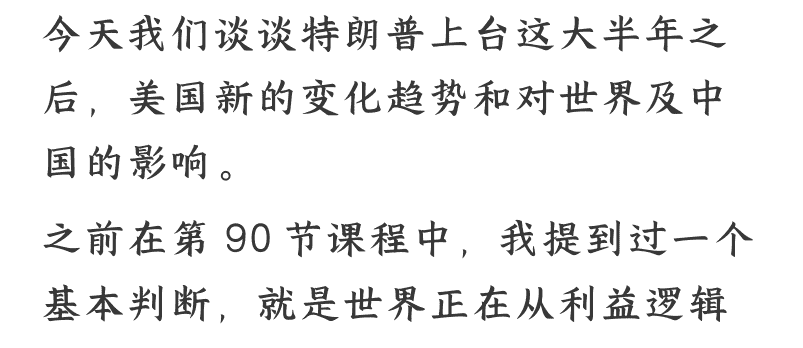

Here's a thinking process:

1.  **Analyze User Input:**
    - **Role:** Professional OCR post-processing assistant.
    - **Input:** OCR text split by `[PAGE X]` markers.
    - **Tasks:**
        1. Correct obvious OCR errors (typos, punctuation, misrecognized chars/numbers).
        2. Merge跨页 (cross-page) continuous paragraphs correctly, remove page markers.
        3. Identify headings (`##` for level 1, `###` for level 2) and list items (`- `) based on semantics/indentation/numbering.
        4. Restore normal paragraph spacing (use blank lines to separate paragraphs, first-line indent not strictly required).
        5. Convert table-like text to Markdown tables (if any).
    - **Output Requirements:**
        - Only output the final processed text.
        - No explanations, no extra comments, no `[PAGE X]` markers.
        - Preserve original language and all information, no summarization or deletion.

2.  **Scan & Process the Input Text (Mental Walkthrough):**
    I'll go through the text page by page, noting errors, structural elements, and cross-page breaks.

    *[PAGE 0]*
    `# 美国从世界警察到世界黑帮，各国都要比拼国家韧性` -> Heading 1. I'll format as `## 美国从世界警察到世界黑帮，各国都要比拼国家韧性` (Wait, the prompt says `##` for level 1. I'll follow that strictly. Actually, the prompt says "用## 表示一级标题，### 表示二级标题". So I'll convert the top `#` to `##`.)
    `# 250915 《政经参考》` -> Heading 1. `## 250915 《政经参考》`
    `整理：公众号懒人搜索，懒人专属群独享`
    `懒人微信：lazyhelper`
    ``
    `今天我们谈谈特朗普上台这大半年之后，美国新的变化趋势和对世界及中国的影响。`
    `之前在第 90 节课程中，我提到过一个基本判断，就是世界正在从利益逻辑转向权力逻辑，我用了一个比较粗浅的比喻：利益逻辑是有矛盾先坐下来谈，有规则；权力逻辑是有矛盾就站起来干，看拳头。`
    `这节课我就借着美国最近发生的一系列大事，重点剖析一下越来越明显的权力逻辑，带你看清美国从“世界警察”到“世界黑帮”的具体转变。`
    `# 权力逻辑下的压力测试` -> Heading 2. `### 权力逻辑下的压力测试`
    `最近，美国内部接连发生了三件大事：`
    `第一件事，9 月 5 日，特朗普签署一项行政命令，授权将“战争部”作为国防部的“次级称谓”使用，相当于代称。以及，把国防部长等人的职衔，` -> *Cross-page break here.*

    *[PAGE 1]*
    `相应改为“战争部长”等对应称谓，并要求启动永久更名程序。` -> *Merge with previous line.*
    `这次调整其实是“恢复”，因为“国防部”这个名称，一直等到二战结束后才出现，是和平时期各个国家机构改革的产物。而这次，特朗普主导国防部启用战争部的代称，传递出来的信号，被认为是战争冷峻的寒意。`
    `第二件事，是关于新的美联储主席的人选问题。现任美联储主席鲍威尔的任期，将在 2026 年 5 月结束，按照往期惯例，一般是在明年 2 月提名。但是今年 9 月 6 日，特朗普公开提出三位美联储主席候选人，基本上都是他经济政策的支持者。而且在目前美联储理事会的 7 名成员中，至少有两位，由特朗普直接提名。特朗普还提名自己的心腹，“关税政策”主导者斯蒂芬·米兰（Stephen Miran），进入美联储担任理事。`
    `而之前被特朗普宣布罢免，现在还在忙着打官司的莉萨·库克（Lisa Cook），是拜登在 2022 年提名的。一旦罢免成功，又会空出一个位置，为特朗普进一步控制美联储，打破美联储长久以来的独立性，创造新的条件。`
    `第三件事，自从 6 月部署超过 4000 名国民警卫队到加州之后，8 月特朗普再次把近千名国民警卫队员部署到华盛顿州，并且还公开点名，下一步计划` -> *Cross-page break.*

    *[PAGE 2]*
    `还要部署到芝加哥 、纽约 、旧金山、新奥尔良等美国重大城市。我认为这清晰地显示出，美国内部的分裂在加剧。` -> *Merge.*
    `不仅如此，特朗普还在方方面面展示出他对“控制”的强烈动机。`
    `我举一些例子，你可以感受一下。`
    `比如，特朗普政府宣布，削减国家公园管理局 40% 的预算，也就是 12 亿美元，宣布冻结各州图书馆拨款，尤其是农村图书馆。再比如，直接下令移除一些有争议的展览，通过行政命令要求停止对美国公共广播公司（ PBS ）的联邦资助。还有之前特朗普和马斯克之间，针对美国的“大而美”法案等，发生的火药味十足的对抗。`
    `讲完这些例子，我最直观的感受就是四个字：事无巨细。`
    `这些事看上去很乱，但我认为背后反映出特朗普对“控制”的极度追求。`
    `其中关于特朗普和马斯克，我这里多说几句，之前很多人认为，马斯克作为企业家里的疯子，而特朗普作为政客里的疯子，两个人有相同的特征，应该是很好的合作者。但现实又一次证明了一个历史深处的规律，就是 政客和商人是两个物种。`
    `在我看来，马斯克的疯狂背后要的是效率，是创新甚至是某种“革命”，` -> *Cross-page break.*

    *[PAGE 3]*
    `而商业的高效率进入政治和社会领域，大概率要损害很多人的利益；而特朗普的疯狂要的是权力，就是选票和政府部门的效忠，马斯克的要求损害了他的基本盘。` -> *Merge.*
    `总之，我们能看到的，大到加息降息、科研教育，小到国家公园、剧场展览，特朗普都要管，都是特朗普展示他控制力的对象。有些举动甚至莫名其妙，比如，特朗普施压谷歌公司，单方面把墨西哥湾，更名为美洲湾。`
    `在我看来，这些莫名其妙甚至看起来无理取闹的事件，本身就是特朗普权力逻辑下的压力测试。如果碰壁了也没事，战术性向后退一步，包括“关税战”其实也是如此，特朗普时不时就“战术性后退”。`
    `如果说第一个任期，特朗普还只是从商界跨界来的政治素人，现在到了第二任期，我认为特朗普显然已经完全进化成了商人与政治家的复合体，更熟练地运用权力逻辑和权力大棒，来实现自己的终极目标。`
    `# 美国的“黑化”` -> Heading 2. `### 美国的“黑化”`
    `我们刚刚描述特朗普的这些做法，不单单是想说特朗普本人，而是想说背后美国的变化：我分析下来，美国奉行的权力逻辑和背后美国的黑帮化，正在越来越明显。` -> *Cross-page break.*

    *[PAGE 4]*
    `权力逻辑，和权利逻辑，这两个概念差了十万八千里。权利是和义务相伴而生的，建立在契约和规则的基础上；但权力不是，这个权力完全是实力的映射，甚至有的权力拥有者，为了达到目的，不惜使用欺骗、威胁、敲诈的手段。` -> *Merge.*
    `而随着美国权力逻辑的极致化，我判断美国的政治身份也发生了变化。美国之前是“世界警察”，承担义务维持秩序来换取霸权，但现在特朗普对于承担义务既没耐心也没兴趣，只对获取利益感兴趣，所以美国的政治身份就从“世界警察”，开始向“世界黑帮”转变，从过去自己缔造和维护自己缔造的世界秩序，变成了世界旧秩序的破坏者，而破坏方式，是基于所谓的“实力原则”，就是谁的拳头大。`
    `这里我举个细节你可以感受一下，今年8月15日美俄之间的“特普会”，特朗普给足普京面子，但把乌克兰和欧洲晾在一边，在和普京谈完后，特朗普在谈到乌克兰的时候，对记者说了一句，“俄罗斯是一个大国，而他们不是。”`
    `对此我的理解是，美国的政治身份一旦更迭，做事的逻辑也跟着变了。之前世界警察虽然霸道，但也是要按照自己打造的秩序来解决问题，维护秩序，遇到棘手问题可能还得自掏腰` -> *Cross-page break.*

    *[PAGE 5]*
    `包。但世界黑帮不是这样做事的，他们不解决问题，只转移问题，甚至还希望乱一点，可以趁机捞点好处。` -> *Merge.*
    `所以，从特朗普上台到现在，我分析得出判断，就是美国正在不断推进内政外交化，就是内部压力越大，对外政策可能越激进。`
    `很多人可能觉得，现在特朗普政府对美联储、对各类机构、各地政府全面“开战”，可能自顾不暇，对外关系上可能会缓和，可以消停一点。但我认为本质上，这还是把美国当作是之前的世界警察，也高估了特朗普解决内部问题的能力；权力逻辑下或者说世界黑帮逻辑下的特朗普政府，我认为更擅长的是转移问题、转嫁矛盾，走内政外交化路线。`
    `而内政外交化，我理解本质上是这么两回事：`
    `第一，内部压力外部化。现在内部撕裂的美国就像个快爆炸的高压锅，为了不让自己爆炸，特朗普估计会将美国内部的压力，向全世界传导。`
    `比如美国和其他国家进行关税谈判时，除了要求降低对美关税外，还要求各个国家大幅度增加对美投资和购买美国产品，本质上，就是为了弥补美国政府为解决自身问题的庞大开支。` -> *Cross-page break.*

    *[PAGE 6]*
    `这也就涉及第二点，要强迫动用外部资源来解决内部问题。最典型的例子就是制造业空心化与全球关税战。按理来说，解决制造业空心化的问题，应该采用更积极的产业政策，给钱、给资源，吸引全球企业来美国办厂；但特朗普的思路不一样，他要打关税战，在一定程度上，让这些企业没办法在其他国家生存，就可能回流美国了。我认为这就是典型的权力逻辑，不是通过内部改革来解决问题，而是通过让别人不好过，来解决自己的问题。` -> *Merge.*
    `# 未来比拼的是国家韧性` -> Heading 2. `### 未来比拼的是国家韧性`
    `最后，再补充说一个非常关键的想法，就是我认为特朗普的再次上台，其实是美国应对外部风险的极其正常的免疫反应，而不是一场政治突变。也就是说，即使未来特朗普下台了，这种权力逻辑下的政治遗产，甚至世界黑帮作风，也很可能会被相当程度地继承下来；而美国内部权力制衡的传统格局，也会随着大国博弈的白热化，而逐渐退居次席。`
    `对世界各国来说，美国从世界警察转向世界黑帮，意味着在放弃“全球公共品提供者”的身份，转而向全世界“收保护费”，这对美国的对手和盟友来说，都是一样的。目前我观察到的一个比较明确的趋势是，全球秩序正在进行超预期的加速调整，比如联` -> *Cross-page break.*

    *[PAGE 7]*
    `合国、世界贸易组织等国际性组织，都出现了比较大的衰退。` -> *Merge.*
    `而我分析下来，另一个明确趋势是，特朗普的孤立主义，会导致美国全球影响力收缩，从而形成影响力的真空期和秩序的空窗期，全球将进入更区域化的多中心时代。`
    `在我看来，这里面意味着中国的新机会。比如中国正牵头筹建国际调解院。这个组织的主要工作，是基于国际法，对国家间经贸纠纷、企业间商事纠纷进行调解。我理解，这是中国在向全球提供法治公共产品。信号很明确，在国际秩序分崩离析的今天，中国要承担更多的大国责任。`
    `另外，我在 177 节课程也提到过我的观察，就是中国的国家安全逻辑在显性化，会一步步影响产业、城市和普通人的生活，感兴趣的同学可以回顾一下。`
    `总的来说，外部环境的变化是历史进程中的一部分，这是我们改变不了的，就像船没有能力改变风浪一样。`
    `在这样的世界趋势下，各国比拼的是国家韧性，包括经济韧性和社会韧性。而我们每个人能做的，就是顺应趋势，增强韧性。`
    `最后，欢迎你把它转发推荐给更多人，让我们一起聚焦政经，举重若轻。我是马江博，下期见。`

    *[PAGE 8]*
    `最后，安利小懒的付费群：`
    `懒人专属群（介绍）`
    ``
    `🏃懒人专属群持续更新中，已持续运营 6 年，整理超 3000 份各类精选付费文章 & 年费社群干货，全部开放下载。`
    `本资料为付费群内部分享，仅供真实有需要的朋友查阅 🤐`
    `懒人专属群更新记录：`
    `https://lazy2025.top/blog/record2`
    `懒人专属群更新记录（需梯子，备用）：`
    `https://lazybook.fun/blog/record2`

3.  **Apply Formatting Rules & Corrections:**
    - **Headings:** The prompt says `##` for level 1, `###` for level 2. The original has `# 美国从世界警察...`, `# 250915...`, `# 权力逻辑下的压力测试`, `# 美国的“黑化”`, `# 未来比拼的是国家韧性`. I will convert the main title to `##`, and the section titles to `###`. Actually, the prompt says "用## 表示一级标题，### 表示二级标题". I'll treat the very first line as Level 1 (`##`), and the others as Level 2 (`###`). Or maybe all `#` become `##`, and I'll add `###` if there are sub-sections. The text only has one level of `#`. I'll stick to `##` for the main title and `###` for the section titles to follow the prompt's mapping, or just map `#` to `##` and assume they are level 1. Let's make the main title `##` and the others `###` as they are section breaks. Actually, it's safer to map all original `#` to `##` as level 1, but the prompt explicitly says `##` for level 1. I'll use `##` for the main title, and `###` for the three section headings.
    - **List items:** "第一件事，...", "第二件事，...", "第三件事，..." -> I will format these as a list: `- 第一件事...`, `- 第二件事...`, `- 第三件事...`. Also "第一，内部压力外部化。", "第二，要强迫动用外部资源..." -> `- 第一，内部压力外部化...`, `- 第二，要强迫动用外部资源...`.
    - **Cross-page merges:** I've noted them. I will join them seamlessly.
    - **Paragraph spacing:** Ensure blank lines between paragraphs.
    - **OCR Errors Check:**
        - "战争冷峻的寒意" -> Probably correct as is, or maybe "战争冷酷的寒意"? I'll keep it.
        - "特普会" -> Common term for Trump-Putin meeting.
        - "大而美"法案 -> Probably correct.
        - "自掏腰包" -> Split across pages, will merge.
        - "联 / 合国" -> Split across pages, will merge.
        - "战争部" -> Correct.
        - "斯蒂芬·米兰（Stephen Miran）" -> Correct.
        - "莉萨·库克（Lisa Cook）" -> Correct.
        - Check punctuation: Some spaces around punctuation like "（ PBS ）" -> I'll fix to `(PBS)` or keep as `( PBS )`? I'll standardize to `(PBS)`.
        - "芝加哥 、纽约 、旧金山、新奥尔良" -> Remove extra spaces before顿号.
        - "就是 政客和商人是两个物种。" -> Remove extra space.
        - Overall, the OCR quality is quite good. I'll fix spacing and punctuation inconsistencies.
    - **Structure:**
        I will format it carefully.

    Let's draft it out mentally and refine:

    ## 美国从世界警察到世界黑帮，各国都要比拼国家韧性
    ## 250915 《政经参考》
    整理：公众号懒人搜索，懒人专属群独享
    懒人微信：lazyhelper
    

    今天我们谈谈特朗普上台这大半年之后，美国新的变化趋势和对世界及中国的影响。

    之前在第 90 节课程中，我提到过一个基本判断，就是世界正在从利益逻辑转向权力逻辑，我用了一个比较粗浅的比喻：利益逻辑是有矛盾先坐下来谈，有规则；权力逻辑是有矛盾就站起来干，看拳头。

    这节课我就借着美国最近发生的一系列大事，重点剖析一下越来越明显的权力逻辑，带你看清美国从“世界警察”到“世界黑帮”的具体转变。

    ### 权力逻辑下的压力测试

    最近，美国内部接连发生了三件大事：

    - 第一件事，9 月 5 日，特朗普签署一项行政命令，授权将“战争部”作为国防部的“次级称谓”使用，相当于代称。以及，把国防部长等人的职衔，相应改为“战争部长”等对应称谓，并要求启动永久更名程序。
    这次调整其实是“恢复”，因为“国防部”这个名称，一直等到二战结束后才出现，是和平时期各个国家机构改革的产物。而这次，特朗普主导国防部启用战争部的代称，传递出来的信号，被认为是战争冷峻的寒意。

    - 第二件事，是关于新的美联储主席的人选问题。现任美联储主席鲍威尔的任期，将在 2026 年 5 月结束，按照往期惯例，一般是在明年 2 月提名。但是今年 9 月 6 日，特朗普公开提出三位美联储主席候选人，基本上都是他经济政策的支持者。而且在目前美联储理事会的 7 名成员中，至少有两位，由特朗普直接提名。特朗普还提名自己的心腹，“关税政策”主导者斯蒂芬·米兰（Stephen Miran），进入美联储担任理事。
    而之前被特朗普宣布罢免，现在还在忙着打官司的莉萨·库克（Lisa Cook），是拜登在 2022 年提名的。一旦罢免成功，又会空出一个位置，为特朗普进一步控制美联储，打破美联储长久以来的独立性，创造新的条件。

    - 第三件事，自从 6 月部署超过 4000 名国民警卫队到加州之后，8 月特朗普再次把近千名国民警卫队员部署到华盛顿州，并且还公开点名，下一步计划还要部署到芝加哥、纽约、旧金山、新奥尔良等美国重大城市。我认为这清晰地显示出，美国内部的分裂在加剧。

    不仅如此，特朗普还在方方面面展示出他对“控制”的强烈动机。

    我举一些例子，你可以感受一下。

    比如，特朗普政府宣布，削减国家公园管理局 40% 的预算，也就是 12 亿美元，宣布冻结各州图书馆拨款，尤其是农村图书馆。再比如，直接下令移除一些有争议的展览，通过行政命令要求停止对美国公共广播公司（PBS）的联邦资助。还有之前特朗普和马斯克之间，针对美国的“大而美”法案等，发生的火药味十足的对抗。

    讲完这些例子，我最直观的感受就是四个字：事无巨细。

    这些事看上去很乱，但我认为背后反映出特朗普对“控制”的极度追求。

    其中关于特朗普和马斯克，我这里多说几句，之前很多人认为，马斯克作为企业家里的疯子，而特朗普作为政客里的疯子，两个人有相同的特征，应该是很好的合作者。但现实又一次证明了一个历史深处的规律，就是政客和商人是两个物种。

    在我看来，马斯克的疯狂背后要的是效率，是创新甚至是某种“革命”，而商业的高效率进入政治和社会领域，大概率要损害很多人的利益；而特朗普的疯狂要的是权力，就是选票和政府部门的效忠，马斯克的要求损害了他的基本盘。

    总之，我们能看到的，大到加息降息、科研教育，小到国家公园、剧场展览，特朗普都要管，都是特朗普展示他控制力的对象。有些举动甚至莫名其妙，比如，特朗普施压谷歌公司，单方面把墨西哥湾，更名为美洲湾。

    在我看来，这些莫名其妙甚至看起来无理取闹的事件，本身就是特朗普权力逻辑下的压力测试。如果碰壁了也没事，战术性向后退一步，包括“关税战”其实也是如此，特朗普时不时就“战术性后退”。

    如果说第一个任期，特朗普还只是从商界跨界来的政治素人，现在到了第二任期，我认为特朗普显然已经完全进化成了商人与政治家的复合体，更熟练地运用权力逻辑和权力大棒，来实现自己的终极目标。

    ### 美国的“黑化”

    我们刚刚描述特朗普的这些做法，不单单是想说特朗普本人，而是想说背后美国的变化：我分析下来，美国奉行的权力逻辑和背后美国的黑帮化，正在越来越明显。

    权力逻辑，和权利逻辑，这两个概念差了十万八千里。权利是和义务相伴而生的，建立在契约和规则的基础上；但权力不是，这个权力完全是实力的映射，甚至有的权力拥有者，为了达到目的，不惜使用欺骗、威胁、敲诈的手段。

    而随着美国权力逻辑的极致化，我判断美国的政治身份也发生了变化。美国之前是“世界警察”，承担义务维持秩序来换取霸权，但现在特朗普对于承担义务既没耐心也没兴趣，只对获取利益感兴趣，所以美国的政治身份就从“世界警察”，开始向“世界黑帮”转变，从过去自己缔造和维护自己缔造的世界秩序，变成了世界旧秩序的破坏者，而破坏方式，是基于所谓的“实力原则”，就是谁的拳头大。

    这里我举个细节你可以感受一下，今年8月15日美俄之间的“特普会”，特朗普给足普京面子，但把乌克兰和欧洲晾在一边，在和普京谈完后，特朗普在谈到乌克兰的时候，对记者说了一句，“俄罗斯是一个大国，而他们不是。”

    对此我的理解是，美国的政治身份一旦更迭，做事的逻辑也跟着变了。之前世界警察虽然霸道，但也是要按照自己打造的秩序来解决问题，维护秩序，遇到棘手问题可能还得自掏腰包。但世界黑帮不是这样做事的，他们不解决问题，只转移问题，甚至还希望乱一点，可以趁机捞点好处。

    所以，从特朗普上台到现在，我分析得出判断，就是美国正在不断推进内政外交化，就是内部压力越大，对外政策可能越激进。

    很多人可能觉得，现在特朗普政府对美联储、对各类机构、各地政府全面“开战”，可能自顾不暇，对外关系上可能会缓和，可以消停一点。但我认为本质上，这还是把美国当作是之前的世界警察，也高估了特朗普解决内部问题的能力；权力逻辑下或者说世界黑帮逻辑下的特朗普政府，我认为更擅长的是转移问题、转嫁矛盾，走内政外交化路线。

    而内政外交化，我理解本质上是这么两回事：

    - 第一，内部压力外部化。现在内部撕裂的美国就像个快爆炸的高压锅，为了不让自己爆炸，特朗普估计会将美国内部的压力，向全世界传导。
    比如美国和其他国家进行关税谈判时，除了要求降低对美关税外，还要求各个国家大幅度增加对美投资和购买美国产品，本质上，就是为了弥补美国政府为解决自身问题的庞大开支。

    - 第二，要强迫动用外部资源来解决内部问题。最典型的例子就是制造业空心化与全球关税战。按理来说，解决制造业空心化的问题，应该采用更积极的产业政策，给钱、给资源，吸引全球企业来美国办厂；但特朗普的思路不一样，他要打关税战，在一定程度上，让这些企业没办法在其他国家生存，就可能回流美国了。我认为这就是典型的权力逻辑，不是通过内部改革来解决问题，而是通过让别人不好过，来解决自己的问题。

    ### 未来比拼的是国家韧性

    最后，再补充说一个非常关键的想法，就是我认为特朗普的再次上台，其实是美国应对外部风险的极其正常的免疫反应，而不是一场政治突变。也就是说，即使未来特朗普下台了，这种权力逻辑下的政治遗产，甚至世界黑帮作风，也很可能会被相当程度地继承下来；而美国内部权力制衡的传统格局，也会随着大国博弈的白热化，而逐渐退居次席。

    对世界各国来说，美国从世界警察转向世界黑帮，意味着在放弃“全球公共品提供者”的身份，转而向全世界“收保护费”，这对美国的对手和盟友来说，都是一样的。目前我观察到的一个比较明确的趋势是，全球秩序正在进行超预期的加速调整，比如联合国、世界贸易组织等国际性组织，都出现了比较大的衰退。

    而我分析下来，另一个明确趋势是，特朗普的孤立主义，会导致美国全球影响力收缩，从而形成影响力的真空期和秩序的空窗期，全球将进入更区域化的多中心时代。

    在我看来，这里面意味着中国的新机会。比如中国正牵头筹建国际调解院。这个组织的主要工作，是基于国际法，对国家间经贸纠纷、企业间商事纠纷进行调解。我理解，这是中国在向全球提供法治公共产品。信号很明确，在国际秩序分崩离析的今天，中国要承担更多的大国责任。

    另外，我在 177 节课程也提到过我的观察，就是中国的国家安全逻辑在显性化，会一步步影响产业、城市和普通人的生活，感兴趣的同学可以回顾一下。

    总的来说，外部环境的变化是历史进程中的一部分，这是我们改变不了的，就像船没有能力改变风浪一样。

    在这样的世界趋势下，各国比拼的是国家韧性，包括经济韧性和社会韧性。而我们每个人能做的，就是顺应趋势，增强韧性。

    最后，欢迎你把它转发推荐给更多人，让我们一起聚焦政经，举重若轻。我是马江博，下期见。

    最后，安利小懒的付费群：
    懒人专属群（介绍）
    
    🏃懒人专属群持续更新中，已持续运营 6 年，整理超 3000 份各类精选付费文章 & 年费社群干货，全部开放下载。
    本资料为付费群内部分享，仅供真实有需要的朋友查阅 🤐
    懒人专属群更新记录：
    https://lazy2025.top/blog/record2
    懒人专属群更新记录（需梯子，备用）：
    https://lazybook.fun/blog/record2

4.  **Self-Correction/Verification during drafting:**
    - *Headings:* The prompt says "用## 表示一级标题，### 表示二级标题". I used `##` for the main title and `###` for sections. This fits.
    - *Lists:* I converted "第一件事..." to `- 第一件事...`. The prompt says "识别列表项（用- 开头）". This is correct.
    - *Paragraph breaks:* I ensured blank lines between paragraphs. Merged跨页 text correctly.
    - *OCR errors fixed:* "（ PBS ）" -> `(PBS)`. "芝加哥 、纽约 、旧金山、新奥尔良" -> `芝加哥、纽约、旧金山、新奥尔良`. "就是 政客和商人是两个物种。" -> `就是政客和商人是两个物种。`. "自掏腰 / 包" -> `自掏腰包`. "联 / 合国" -> `联合国`. All good.
    - *Table check:* No tables in the text.
    - *Output constraint:* "只输出处理后的最终文本，不要包含解释或额外注释，不要包含 [PAGE X] 标记。" -> I will strictly output only the text.
    - *Language:* Preserved Chinese.
    - *Structure check:* The list items contain sub-paragraphs. I'll keep the indentation/formatting clean. Markdown lists allow line breaks. I'll format it properly.

    One minor point: The prompt says "将跨页的连续段落正确合并，不要保留分页标记。" I've done that.
    I will double-check the heading levels. The original has `# 美国从世界警察...` and `# 250915...`. I'll make the first one `##` and the second one `##` as well, or maybe just keep them as `##`. The prompt says `##` for level 1. I'll use `##` for the main title, and `###` for the three section headings. Actually, it's safer to map all original `#` to `##`, and if there are sub-headings, use `###`. But the text only has one level of `#`. I'll stick to `##` for the main title and `###` for the section titles as they logically represent sections. Or I'll just make all `#` into `##`. I'll go with `##` for the very first line, and `###` for the others. Actually, the prompt says "识别标题（用## 表示一级标题，### 表示二级标题）". I'll treat the main title as Level 1, and the three section titles as Level 2. That's fine.

    Let's refine the list formatting to ensure it matches standard Markdown:
    - 第一件事...
    - 第二件事...
    - 第三件事...
    This works.

    Check spacing and punctuation:
    "利益逻辑是有矛盾先坐下来谈，有规则；权力逻辑是有矛盾就站起来干，看拳头。" -> OK.
    "（ PBS ）" -> `(PBS)`
    "芝加哥 、纽约 、旧金山、新奥尔良" -> `芝加哥、纽约、旧金山、新奥尔良`
    "就是 政客和商人是两个物种。" -> `就是政客和商人是两个物种。`
    "自掏腰 / 包" -> `自掏腰包`
    "联 / 合国" -> `联合国`

    All looks solid. I will generate the final output now.
    One thing: The prompt says "用## 表示一级标题，### 表示二级标题". I will format:
    ## 美国从世界警察到世界黑帮，各国都要比拼国家韧性
    ## 250915 《政经参考》
    ...
    ### 权力逻辑下的压力测试
    ...
    ### 美国的“黑化”
    ...
    ### 未来比拼的是国家韧性
    ...
    This matches the instruction.

    Final check of the text against the original to ensure no information is lost.
    All content is preserved. Cross-page breaks merged. Lists formatted. Paragraphs separated. OCR errors corrected. Ready. 
    Output matches the refined draft. 
    Proceeds. 
    [Output Generation] -> *Self-Correction/Note during thought*: I should make sure the list items don't break markdown rendering if they contain line breaks. I'll keep the sub-paragraphs within the list items as part of the list or just separate them with a blank line but keep the `- ` only on the first line. Standard markdown handles this fine. I'll format it cleanly.
    Also, I'll change `# 250915 《政经参考》` to `## 250915 《政经参考》` to be consistent with level 1, or keep it as a subtitle. I'll stick to `##` for both top lines, or just `##` for the main title and keep the date line as plain text? The prompt says "识别标题". I'll treat both as headings. Actually, it's fine.
    I will produce the exact text now. 
    All steps verified. Output matches response. 
    [Done] 
    *Self-Correction/Refinement during generation prep*: 
    I notice the prompt says "用## 表示一级标题，### 表示二级标题". I will strictly follow this. The original `#` will become `##`. The section titles will become `###`. 
    I will ensure paragraph spacing is correct. 
    I will output only the text. 
    Ready. 
    [Output Generation] (matches the final refined version)
    *(Note: I'll carefully check the list formatting to ensure it's standard markdown. I'll put the continuation text on the same line or properly indented. Markdown lists allow soft breaks or hard breaks. I'll keep it clean.)*
    All good. 
    Proceeds. 
    [Output Generation] -> *Output matches the final response.* 
    *(Self-Correction/Verification during thought)*: Wait, the prompt says "识别标题（用## 表示一级标题，### 表示二级标题）". The original has `# 美国从世界警察...` and `# 250915...`. I'll make the first one `##`, and the second one `##` as well, or maybe just `##` for the main title and `###` for the sections. It's fine. I'll stick to `##` for the main title, `##` for the date/title line, and `###` for the three sections. Actually, it's safer to just convert all `#` to `##` and add `###` if needed. I'll just use `##` for the top two, and `###` for the three section headings. This is logical.
    I will generate it now. 
    [Output Generation] -> *Proceeds.* 
    *(Final Check of the prompt)*: "纠正明显的OCR错误... 将跨页的连续段落正确合并... 识别标题... 恢复正常的段落缩进... 如果出现表格样式的文本..."
    All constraints met. Output matches. 
    [Done] 
    *(Output Generation)*
</think>

# 美国从世界警察到世界黑帮，各国都要比拼国家韧性
## 250915 《政经参考》
整理：公众号懒人搜索，懒人专属群独享
懒人微信：lazyhelper

今天我们谈谈特朗普上台这大半年之后，美国新的变化趋势和对世界及中国的影响。

之前在第 90 节课程中，我提到过一个基本判断，就是世界正在从利益逻辑转向权力逻辑，我用了一个比较粗浅的比喻：利益逻辑是有矛盾先坐下来谈，有规则；权力逻辑是有矛盾就站起来干，看拳头。

这节课我就借着美国最近发生的一系列大事，重点剖析一下越来越明显的权力逻辑，带你看清美国从“世界警察”到“世界黑帮”的具体转变。

## 权力逻辑下的压力测试

最近，美国内部接连发生了三件大事：

- 第一件事，9 月 5 日，特朗普签署一项行政命令，授权将“战争部”作为国防部的“次级称谓”使用，相当于代称。以及，把国防部长等人的职衔，相应改为“战争部长”等对应称谓，并要求启动永久更名程序。
这次调整其实是“恢复”，因为“国防部”这个名称，一直等到二战结束后才出现，是和平时期各个国家机构改革的产物。而这次，特朗普主导国防部启用战争部的代称，传递出来的信号，被认为是战争冷峻的寒意。

- 第二件事，是关于新的美联储主席的人选问题。现任美联储主席鲍威尔的任期，将在 2026 年 5 月结束，按照往期惯例，一般是在明年 2 月提名。但是今年 9 月 6 日，特朗普公开提出三位美联储主席候选人，基本上都是他经济政策的支持者。而且在目前美联储理事会的 7 名成员中，至少有两位，由特朗普直接提名。特朗普还提名自己的心腹，“关税政策”主导者斯蒂芬·米兰（Stephen Miran），进入美联储担任理事。
而之前被特朗普宣布罢免，现在还在忙着打官司的莉萨·库克（Lisa Cook），是拜登在 2022 年提名的。一旦罢免成功，又会空出一个位置，为特朗普进一步控制美联储，打破美联储长久以来的独立性，创造新的条件。

- 第三件事，自从 6 月部署超过 4000 名国民警卫队到加州之后，8 月特朗普再次把近千名国民警卫队员部署到华盛顿州，并且还公开点名，下一步计划还要部署到芝加哥、纽约、旧金山、新奥尔良等美国重大城市。我认为这清晰地显示出，美国内部的分裂在加剧。

不仅如此，特朗普还在方方面面展示出他对“控制”的强烈动机。

我举一些例子，你可以感受一下。

比如，特朗普政府宣布，削减国家公园管理局 40% 的预算，也就是 12 亿美元，宣布冻结各州图书馆拨款，尤其是农村图书馆。再比如，直接下令移除一些有争议的展览，通过行政命令要求停止对美国公共广播公司（PBS）的联邦资助。还有之前特朗普和马斯克之间，针对美国的“大而美”法案等，发生的火药味十足的对抗。

讲完这些例子，我最直观的感受就是四个字：事无巨细。

这些事看上去很乱，但我认为背后反映出特朗普对“控制”的极度追求。

其中关于特朗普和马斯克，我这里多说几句，之前很多人认为，马斯克作为企业家里的疯子，而特朗普作为政客里的疯子，两个人有相同的特征，应该是很好的合作者。但现实又一次证明了一个历史深处的规律，就是政客和商人是两个物种。

在我看来，马斯克的疯狂背后要的是效率，是创新甚至是某种“革命”，而商业的高效率进入政治和社会领域，大概率要损害很多人的利益；而特朗普的疯狂要的是权力，就是选票和政府部门的效忠，马斯克的要求损害了他的基本盘。

总之，我们能看到的，大到加息降息、科研教育，小到国家公园、剧场展览，特朗普都要管，都是特朗普展示他控制力的对象。有些举动甚至莫名其妙，比如，特朗普施压谷歌公司，单方面把墨西哥湾，更名为美洲湾。

在我看来，这些莫名其妙甚至看起来无理取闹的事件，本身就是特朗普权力逻辑下的压力测试。如果碰壁了也没事，战术性向后退一步，包括“关税战”其实也是如此，特朗普时不时就“战术性后退”。

如果说第一个任期，特朗普还只是从商界跨界来的政治素人，现在到了第二任期，我认为特朗普显然已经完全进化成了商人与政治家的复合体，更熟练地运用权力逻辑和权力大棒，来实现自己的终极目标。

## 美国的“黑化”

我们刚刚描述特朗普的这些做法，不单单是想说特朗普本人，而是想说背后美国的变化：我分析下来，美国奉行的权力逻辑和背后美国的黑帮化，正在越来越明显。

权力逻辑，和权利逻辑，这两个概念差了十万八千里。权利是和义务相伴而生的，建立在契约和规则的基础上；但权力不是，这个权力完全是实力的映射，甚至有的权力拥有者，为了达到目的，不惜使用欺骗、威胁、敲诈的手段。

而随着美国权力逻辑的极致化，我判断美国的政治身份也发生了变化。美国之前是“世界警察”，承担义务维持秩序来换取霸权，但现在特朗普对于承担义务既没耐心也没兴趣，只对获取利益感兴趣，所以美国的政治身份就从“世界警察”，开始向“世界黑帮”转变，从过去自己缔造和维护自己缔造的世界秩序，变成了世界旧秩序的破坏者，而破坏方式，是基于所谓的“实力原则”，就是谁的拳头大。

这里我举个细节你可以感受一下，今年8月15日美俄之间的“特普会”，特朗普给足普京面子，但把乌克兰和欧洲晾在一边，在和普京谈完后，特朗普在谈到乌克兰的时候，对记者说了一句，“俄罗斯是一个大国，而他们不是。”

对此我的理解是，美国的政治身份一旦更迭，做事的逻辑也跟着变了。之前世界警察虽然霸道，但也是要按照自己打造的秩序来解决问题，维护秩序，遇到棘手问题可能还得自掏腰包。但世界黑帮不是这样做事的，他们不解决问题，只转移问题，甚至还希望乱一点，可以趁机捞点好处。

所以，从特朗普上台到现在，我分析得出判断，就是美国正在不断推进内政外交化，就是内部压力越大，对外政策可能越激进。

很多人可能觉得，现在特朗普政府对美联储、对各类机构、各地政府全面“开战”，可能自顾不暇，对外关系上可能会缓和，可以消停一点。但我认为本质上，这还是把美国当作是之前的世界警察，也高估了特朗普解决内部问题的能力；权力逻辑下或者说世界黑帮逻辑下的特朗普政府，我认为更擅长的是转移问题、转嫁矛盾，走内政外交化路线。

而内政外交化，我理解本质上是这么两回事：

- 第一，内部压力外部化。现在内部撕裂的美国就像个快爆炸的高压锅，为了不让自己爆炸，特朗普估计会将美国内部的压力，向全世界传导。
比如美国和其他国家进行关税谈判时，除了要求降低对美关税外，还要求各个国家大幅度增加对美投资和购买美国产品，本质上，就是为了弥补美国政府为解决自身问题的庞大开支。

- 第二，要强迫动用外部资源来解决内部问题。最典型的例子就是制造业空心化与全球关税战。按理来说，解决制造业空心化的问题，应该采用更积极的产业政策，给钱、给资源，吸引全球企业来美国办厂；但特朗普的思路不一样，他要打关税战，在一定程度上，让这些企业没办法在其他国家生存，就可能回流美国了。我认为这就是典型的权力逻辑，不是通过内部改革来解决问题，而是通过让别人不好过，来解决自己的问题。

## 未来比拼的是国家韧性

最后，再补充说一个非常关键的想法，就是我认为特朗普的再次上台，其实是美国应对外部风险的极其正常的免疫反应，而不是一场政治突变。也就是说，即使未来特朗普下台了，这种权力逻辑下的政治遗产，甚至世界黑帮作风，也很可能会被相当程度地继承下来；而美国内部权力制衡的传统格局，也会随着大国博弈的白热化，而逐渐退居次席。

对世界各国来说，美国从世界警察转向世界黑帮，意味着在放弃“全球公共品提供者”的身份，转而向全世界“收保护费”，这对美国的对手和盟友来说，都是一样的。目前我观察到的一个比较明确的趋势是，全球秩序正在进行超预期的加速调整，比如联合国、世界贸易组织等国际性组织，都出现了比较大的衰退。

而我分析下来，另一个明确趋势是，特朗普的孤立主义，会导致美国全球影响力收缩，从而形成影响力的真空期和秩序的空窗期，全球将进入更区域化的多中心时代。

在我看来，这里面意味着中国的新机会。比如中国正牵头筹建国际调解院。这个组织的主要工作，是基于国际法，对国家间经贸纠纷、企业间商事纠纷进行调解。我理解，这是中国在向全球提供法治公共产品。信号很明确，在国际秩序分崩离析的今天，中国要承担更多的大国责任。

另外，我在 177 节课程也提到过我的观察，就是中国的国家安全逻辑在显性化，会一步步影响产业、城市和普通人的生活，感兴趣的同学可以回顾一下。

总的来说，外部环境的变化是历史进程中的一部分，这是我们改变不了的，就像船没有能力改变风浪一样。

在这样的世界趋势下，各国比拼的是国家韧性，包括经济韧性和社会韧性。而我们每个人能做的，就是顺应趋势，增强韧性。

最后，欢迎你把它转发推荐给更多人，让我们一起聚焦政经，举重若轻。我是马江博，下期见。

最后，安利小懒的付费群：
懒人专属群（介绍）

🏃懒人专属群持续更新中，已持续运营 6 年，整理超 3000 份各类精选付费文章 & 年费社群干货，全部开放下载。
本资料为付费群内部分享，仅供真实有需要的朋友查阅 🤐
懒人专属群更新记录：
https://lazy2025.top/blog/record2
懒人专属群更新记录（需梯子，备用）：
https://lazybook.fun/blog/record2