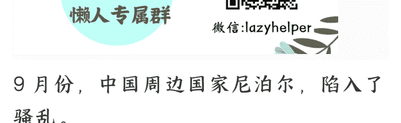
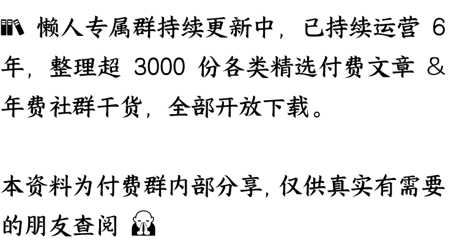

# 中国周边又一个国家陷入骚乱，尼泊尔怎么？

250915 文/卢克文工作室嘉宾 星海舰长

整理：公众号懒人搜索，懒人专属群独享

懒人微信：lazyhelper

9 月份，中国周边国家尼泊尔，陷入了骚乱。

截至目前，骚乱已经造成 20 多人死亡，总理奥利宣布辞职，整个国家陷入无政府状态。

考虑到奥利刚刚在中国参加完阅兵回去，再联系印尼那边的骚乱，很多人都怀疑，这不会是印度或者美国故意搞出来给中国上眼药的吧？

那么，这次骚乱到底是怎么回事呢？

事情，还要从 2024 年尼泊尔的《[社交] [媒体管理法案]》草案说起。

这份草案要求，在尼泊尔开展社交网络运营的企业、个人和组织，都要向管理机构提出运营申请，完成相关程序后再进行注册，之后才能运营。

到今年，法案有了新要求：第一，所有在尼运营的社交媒体公司，必须在尼泊尔设立实体办事处；第二，必须将尼泊尔用户的数据存储在尼泊尔境内。

说起来，尼泊尔这个做法没啥问题，毕竟随着全球“数字主权”概念的流行，各国政府都认识到了，不能将信息数据拱手让与别人。

但问题在于，国际科技巨头就会听么？

所以，折腾了一年多，除了 TikTok 以及其他 4 个社交媒体老老实实登记注册了之外，其他巨头都没有注册。结果，今年 9 月初，尼泊尔政府总算失去了耐心，下令封禁了 26 个社交媒体，其中也包括中国的微信和 soul。

看起来，这就是个数字主权之争的问题，那为啥会引发大规模的骚乱呢？其实吧，事情没有那么简单。

我们思考一个问题，尼泊尔真的是因为数字主权而封禁境外社交媒体吗？未必。

就在封禁社交媒体之前，尼泊尔网上出现过一个非常大的 Nepo Baby 运动。

Nepo kids 是英语“nepotism”（裙带关系）的衍生词，你可以简单将其理解为富二代、官二代、星二代等等。

几个尼泊尔的富二代和官二代，喜欢在网上晒豪门生活，今天马尔代夫明天迪拜，那叫一个挥金如土，奢侈无度。总之，他们肆无忌惮地展示奢华生活，这不招人恨么？

尼泊尔是个很穷的国家，2024 年 GDP 为 429 亿美元，人均 GDP 约 1517 美元，相当于中国的九分之一，国家维持全靠手工业、旅游业和侨汇撑着，因为没啥工业，所以青年失业率高达 28%。

很多年轻人哪怕念了大学，也没什么好工作可以找，比较好的出路也就是办个护照，去中东或者东南亚去打工，甚至跑到俄罗斯当雇佣兵，挣点血汗钱来养活家人。

生活如此艰难，本来想刷手机逃避一下现实，结果满屏幕都是富二代们的炫富行为，你看了气不气？

于是，各种各样的恶评充斥了这些富二代、官二代的社交媒体账号，还有各种恶搞 Nepo kids 的视频，动辄都是百万播放，TikTok 上还专门有了一个讽刺尼泊尔高官子女奢侈生活的词条#PoliticiansNepoBabyNepal,nepokids 这个标签成了过街老鼠，人人喊打。

但是别忘了，NepoBaby 们的爹妈可都是权贵阶层，要么有权，要么有钱，这么多恶评和恶搞，他们的爹妈肯定是不乐意看到的。

所以，你说尼泊尔封禁社交媒体，是为了数字主权吧？的确可能有这个因素。但恐怕动力更大的，是为了压住这一波 Nepo Baby 风潮吧。

这不是此地无银三百两么？这么一搞，谁能服气？

更关键的在于，社交媒体一封禁，还砸了许多人的饭碗。

尼泊尔的失业率很高，很多年轻人只能去做自媒体、当网红来挣点零花钱，再不济，刷刷短视频也能当个奶头乐，逃避一下残酷的现实。

现在好嘛，一声令下全给禁了，那就业问题，政府能给解决么？

除此之外，还有很多尼泊尔年轻人迫于生计只能外出打工，但在国外想念家人咋办？只能通过社交媒体联系家人，比打国际长途便宜多了。现在社交媒体一封禁，你让这些人怎么联系家里人？

所以，封禁社交媒体直接点燃了全国人民的怒火，抗议行动迅速发酵，抗议者和警方爆发了激烈冲突，警方使用橡皮子弹、水炮及警棍强行驱散人群，造成至少 19 人死亡，多地医院报告数百人受伤。

本来大家就是想发泄一下不满，结果成了你死我活的斗争。

于是，骚乱在 9 日迅速升级，抗议者闯入议会放火焚烧，财政部长被抗议者殴打后跳河逃跑，前总理卡纳尔住宅遭纵火妻子被烧死，前总理德乌帕的家被闯入，其本人及其担任外交部长的妻子被殴打。

替代方案，结果把所有人都得罪了，搞得矛盾激化。

但如果仔细琢磨一下就会发现，事情可能没那么简单。一开始，很多人都猜测，没准这次骚乱是印度人搞出来的，以报复尼泊尔总理来中国看阅兵。

这个猜测乍一看倒是挺有道理，其实说不通。

尼泊尔政坛是三足鼎立，尼联共（毛主义）和尼共（联合马列）以及尼泊尔大会党。

本来吧，尼共（联合马列）的奥利和尼联共（毛主义）的普拉昌达有过约定，5 年总统任期，俩人各坐一半。但二人因为理念不合，开始明争暗斗。然后在去年，尼共（联合马列）和大会党结盟，直接导致尼共左翼联盟彻底分裂，普昌拉达被赶下台，奥利上台。

按照尼共（联合马列）和大会党的协议，奥利也将和亲印派——大会党领导人德乌帕轮流执政，一直到 2027 年尼泊尔再次举行大选。

也就是说，现在的尼泊尔政府，本质上还算是一个相对亲印的政府（比如这次被打的财政部长就是亲印派），而且，大会党马上就要轮换上台了，按道理来说，印度没有必要在这个时候去搞奥利。

相反，印度国内这会也很紧张，生怕尼泊尔的骚乱，会重演孟加拉国的“哈希娜事件”，导致印度的海外布局毁于一旦。所以，你要说印度浑水摸鱼推亲印派上台有可能，但要说印度主动推翻奥利政府，可能性不大。

那么，不是印度，会是谁呢？美国么？

我们很反对一有事情，就说是美国搞的鬼，这实在有点夸大了美国的能力。

但问题在于，这次的尼泊尔骚乱，似乎真的有美国影子。

整个抗议活动的组织者，是一个叫“我们尼泊尔”NGO 组织发起，首脑是 36 岁的苏丹·古隆，巧了，根据“我们尼泊尔”的官网介绍，该组织注册于美国，连大部分资金，也从美国 NED 获得，甚至还有藏独组织的资助。

整个抗议活动中，都是 Hami Nepal 等 NGO 组织在社交媒体和短视频平台上发布行动动员活动信息，要求年轻人穿校服、拿着书本和书包以显示“和平抗议”形象。

受到警察镇压后，马上画风一转，开始教授如何制作燃烧瓶，如何攻击警察，如何躲避追捕等等。

游行过程中，示威横幅上面还有一个握起来的拳头，名为"Otpor"（抵抗），这个标志曾在南联盟解体的抗议活动中出现。

在阿拉伯之春期间，也有过这个标志，现在又出现在了尼泊尔。

还有骚乱发生后，美国、英国、法国等十国，还第一时间签署声明称“坚决支持尼和平集会与言论自由权”。

如果把这些线索穿起来，就会呈现一种典型的颜色革命特征——

NGO 组织——境外资金——公益活动

——积蓄力量——制造议题——煽动游行

——技术指导——大国介入。

看似他们在反映人民诉求，但执行的，却是一套精准的颜色革命流水线作业。

不得不说，随着局势的发展，美国的颜色革命也在进化，现在已经进化到了 3.0 时代。

初代的颜色革命，主要是以“民主”为标签，由政坛内的反对派通过“民主”议题来颠覆政权。

2.0 时代的颜色革命，主要是以经济诉求为标签，通过煽动底层不满来颠覆政权。

3.0 时代的颜色革命呢？和 2.0 时代有点像，但更聚焦 95 年后出生的 Z 时代。

在一些发展中国家，社会上升渠道被既得利益阶层把控，Z 时代看不到出路，积蓄了大量愤怒，同时他们又毫无障碍地使用着 X、Facebook、油管、ins，接收到的信息完全跟着美国平台的算法和推荐走。

这样一来，只要美国需要，在网上煽动点事情简直太容易了。

看看孟加拉国的“大学生革命”，印尼的“海盗旗革命”，都符合这样的特征。

一方面，社交媒体对情绪的煽动能力极强，一两天的时间都可能闹出大动静（想象近年来的几次大规模舆情事件吧），另一方面，社交媒体主要由美国掌控，所在国家无法删除、无法辟谣，社交媒体只会成为颜色革命的帮凶，而不会成为政府平息事件的助手。

要知道，不是哪个国家都像中国这样拥有微博、微信、抖音、小红书等替代品的。绝大部分国家，对西方国家的 APP 毫无抵抗力，真到了关键时刻，美国略微出手，恐怕这些国家的政府，连个发声渠道都没有了。

这一点，值得所有发展中国家警惕。

当然，除了美国，这次骚乱背后，还有一支看不见的手——尼泊尔军方。纵观尼泊尔骚乱过程，奥利为啥会选择辞职？很大一部分原因，就是军方的倒戈。

在奥利下达平息事态命令后，军方不仅没有服从命令，反而倒戈了，呼吁警方不要镇压民众，好像自己真的站在人民一边一样。但有趣的是，奥利辞职后，军方马上出手，对加德满都实施宵禁，雷厉风行地平息了事态。

为啥会如此？军方的目的显然不单纯。

尼泊尔军队前身，是尼泊尔皇家军队，属于保皇一党。但是呢？2006 年的时候，面对如星火燎原的农村革命，尼泊尔皇家军队被尼共（毛）普拉昌达的农民军，打的溃不成军，只控制着全国 20% 的地盘。

万万没想到的是，都临门一脚了，普拉昌达却突然放弃了武装斗争，开始走议会路线，虽然换来了尼泊尔王室下台，却失去了军权，导致尼泊尔军队，还是那一支前皇家军队。

这样一支没有经过改造的旧军队，你要说他们对共和制度有多忠诚，还真谈不上。这次军方的诡异表现，不排除军方也想介入乱局而借此次牟利了。

这不，尼泊尔陆军参谋长阿肖克·拉吉·西格德尔已经反客为主，开始与 Hami Nepal 谈判了。尼泊尔局势虽然已经看似平息了，但在印度、美国和尼泊尔军方几方博弈之下，最后的胜利者，一时半会还难以见分晓。

所以，尼泊尔政坛的乱局，恐怕还要持续下去。

## 最后，安利小懒的付费群：

### 懒人专属群 ([介绍](img/f18d5a1d9016f20852ee779b63ba8e42_10_0.png))

**📖**懒人专属群持续更新中，已持续运营 6 年，整理超 3000 份各类精选付费文章&年费社群干货，全部开放下载。

本资料为付费群内部分享，仅供真实有需要的朋友查阅 🐵

懒人专属群更新记录：

[https://lazy2025.top/blog/record2](https://lazy2025.top/blog/record2)

懒人专属群更新记录（需梯子，备用）:

[https://lazybook.fun/blog/record2](https://lazybook.fun/blog/record2)