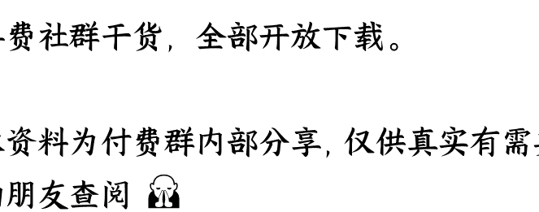

# 特朗普盟友被枪杀，标志着美国政斗的新阶段？

250915 文/卢克文工作室嘉宾 星海舰长
整理：公众号 [懒人搜索]，[懒人专属群] 独享
懒人微信：lazyhelper

9 月 10 日，美国犹他谷大学内一声枪响，著名的红脖子代言人查理·柯克，真的成了“红脖子”。

枪击发生后，全美震惊，特朗普不仅下令全国降半旗致哀，还专门派了副总统专机“空军二号”送柯克的灵柩回家，甚至连万斯这个级别的人，都要给柯克抬棺材。

很多人都纳闷了，柯克无官无职，为什么他的死有这么大动静？

其实，如果单纯论职务的话，查理·柯克在美国还真的不入流，他没有任何职务，只是一个 NGO“美国转折点”的联合创始人而已。

但是要论政治影响力特别是在青年群体的影响力，那柯克在美国可以说是王炸级别的存在，没有人能和他比肩。

查理·柯克出生于伊利诺伊州，在芝加哥郊区长大，保守派家庭出身，在他 18 岁上大学之前，唯一参加的政治活动，也仅仅是当了个参议员竞选的志愿者而已。

但是呢？不得不说，政治这玩意是讲天赋的。

柯克一上大学，就感觉美国高校这气氛不对！各种极左和政治正确的荒唐事情层出不穷，那帮大学生还拼命为其摇旗呐喊视其为真理。

于是柯克就觉得，上大学救不了美国人，退学了。

退学后，柯克创办了一个 NGO“美国转折点”，致力于在美国高校推广保守派观点，来打破左派在高校里面的意识形态垄断。

你还别说，虽然美国大学校园里面左翼占优势，但还是有不少保守主义分子的，所以“美国转折点”在美国高校中迅速扩张，现在已经在全美有了 3000 多个分支机构。

而柯克，毫无疑问就是这个组织的核心。

为什么说柯克是个搞政治的天才？因为他虽然大学都没上完，但在意识形态工作上却超乎常人。

柯克专门办了一个栏目“证明我错了”（Prove Me Wrong），每次邀请左翼大学生当面和自己辩论，而柯克虽然积累不够，但往往能通过预设辩题，然后利用诡辩话术把话题引到已主场，然后抓住对方语言破绽反杀，经常搞得左派对手破大防。

更关键的在于，柯克本身就是 94 年出生的，基本算是 Z 世代，非常擅长用社交媒体来宣传自己的观点，他经常把自己的现场辩论进行直播，然后挑选其中的金句或者暴论剪辑成短视频，在 TikTok、X、YouTube 进行传播，也因此真的把很多美国年轻人从左翼拉到了右翼。

因为它的视频充满激昂的情绪和激进的语言，煽动力远超中国键政家们，所以有非常多受众，他每日三小时的《查理·柯克秀》每天都有几十万观看，在苹果播客新闻类排名第四。

直到他被枪击，柯克在 TikTok 上有超过 730 万粉丝，Instagram 上有 700 万，X 上有 500 万，YouTube 上有 350 万。这在美国，已经算是顶级的键政大 V 了。

就这样，柯克通过自己在线上和线下的影响力，成功把民主党在大学校园里牢固的思想防线凿开了一个缺口，帮助共和党实现了对青年群体的广泛争取，对共和党意义重大。

这么说吧，柯克以一己之力，撑起了民主党的青年工作，说他是共和党的青年部长，一点也不夸张。

而且，柯克虽然年纪不大，但资历绝对老。

## 柯克创办“美国转折点”是啥时候？

2012 年，那时候左翼思潮占绝对优势，任何一个社会名流面对政治正确都不敢乱说话，就连特朗普还没崛起呢，所以那个时候柯克就打出了“回归保守主义”的大旗，才显得愈发宝贵和难得。

所以早在 2016 年特朗普竞选的时候，柯克就成为共和党全国代表大会上最年轻的发言人上台发言了。那个时候，万斯还不知道在哪里混呢。

有人甚至认为，以如此坚定的意志、如此大的影响力、如此卓越的辩才，假以时日，柯克绝对有可能成为下一代的共和党代表人物，赢得总统宝座。

但万万没想到，这样一个前途无量的人物，竟然被一枪打死了！

## 为啥柯克被枪杀震惊全美？

一方面，是柯克死的太有冲击力了。

要说政治刺杀，其实并不新鲜，前有肯尼迪，后有安倍。

但是呢？肯尼迪是在飞快驶过的车上被枪击的，观众其实并没有看清。而安倍呢？两声枪响之后，安倍马上就被围起来了，外面的人更是连血都没看见，所以视觉冲击力要小得多。

而柯克呢？是在 3000 多人的围观之下，被一枪命中了脖子，鲜血如喷射状喷了出来，这太惨了，哪怕我们通过录像来看，也能感觉到惊心动魄。

如果说美国人普遍对枪击其实是有心理准备的话，那死这么惨烈，绝大多数人是不愿意看到的，所以这件事的影响力才这么大。

另一方面，柯克的死和他正在干的事情，对比太强烈了。

柯克被枪击的时候，正在和台下辩论什么话题？拥枪权。

当时台下问他知不知道美国每年有多少人死于枪击（这显然是民主党的议题，因为民主党主张控枪），而柯克则反驳说，算不算黑人帮派？算不算变性人枪手？言下之意就是枪击案都是黑人和变性人枪手搞出来的，不能以此为由禁枪。

然后，自己就被一枪打死了。

不得不说，这一枪打得太黑色幽默了。

为啥？因为柯克一直是个坚定的持枪派，每当美国爆发枪击案有人呼吁禁枪的时候，柯克都要跳出来释放暴论：

> ——为了拥有第二修正案，每年付出一些枪支死亡的代价也是值得的。
>
> ——以枪击受害者立场出发的情绪化反应是不能被允许的。
>
> ——不要让情绪主宰了枪支政策，暴君尤其喜欢利用一个邪恶的悲剧作为借口去剥夺你们的枪支并限制你的自保能力。

好嘛，柯克一直主张社会可以承担持枪的“代价”，现在，他自己成了那个“代价”。

这样一来，以后所有持枪支持者都会面临一个提问了：

当一个人，用你们支持的持枪权，来打你们的时候，你们还支不支持持枪权？

你们一直嚷着“枪支拯救生命（Guns save lives）”，那么当你们被打死时，枪支是在拯救生命，还是毁灭生命？

联系到柯克头顶遮阳棚上那个“证明我错了”（Prove Me Wrong）的字样，似乎枪手是在用枪击的方式，来证明柯克错了。

毕竟，批判的武器，代替不了武器的批判嘛。

所以柯克的枪击场面，注定会像特朗普被枪击那样载入美国枪击史，成为标志性事件。而支持拥枪却被枪打死的柯克，完全可以说是以身证道了。

## 2

那么问题来了，到底是谁干了这么一件艺术的刺杀？

按照常规思路来看，考虑到柯克本身就是个政治键盘侠，所以政治刺杀的可能性大。

而且早在上个月，美国网上就流传出一首歌《查理·柯克 31 岁去世》，巧了，这首歌的作者斯凯·瓦拉德兹，就在犹他州，而且是左派出身。

所以，很快共和党就把这件事归结为左派对右派的政治暗杀，特朗普专门发表电视讲话，把矛头对准了“激进左翼人士”：

> “激进左派曾将查理这样优秀的美国人比作纳粹和世界上最凶残的杀手罪犯，这种言论直接导致了今天我们国家看到的恐怖主义行为，必须立即停止。我的政府将追查所有参与这起暴行及其他政治暴力事件的肇事者，包括资助支持他们的组织，以及那些迫害我国法官、执法人员和所有维护社会秩序者的势力。”

特朗普这话的意思很明显，他准备借柯克的死，要对左翼进行一次大清洗了，甚至还有把火烧到民主党的意图。

从某种程度上来看，特朗普认为这事是左派干的，的确是有充分理由的。

因为柯克是左派的最大仇人，他最喜欢找白左占优的大学校园贴脸开大，用自己的辩论技巧碾压不谙世事的左派青年，然后发上网博流量。

有时候这些左派青年的窘况被柯克发上网后，还会被柯克的粉丝开盒网暴，制造二次伤害。你要是这些左派青年，你想不想干掉柯克？

之前很多人都说红脖子武德充沛，但事实上红脖子在使用暴力时反而非常谨慎，而恰恰相反，一直标榜平等自由的左派，在选择将对手肉体消灭的时候，那可是一点心理负担都没有，颇有一点替天行道、为信念而杀人的自豪感。

特朗普甚至觉得，没准这起刺杀并不是孤狼式刺杀，而是受民主党指使的，只是伪装成了孤狼而已。

为啥？因为民主党是柯克之死的最大受益者啊！

青年群体是两党的未来，在对年轻人洗脑方面，共和党的保守派理论先天比不上民主党的白左理论，所以战力强大的柯克对共和党至关重要，现在柯克一死，共和党这边，连一个能顶上来的都没有！

所以，民主党先找到一个被柯克羞辱过的白左青年，灌输一些思想洗脑，然后鼓动他拿枪杀人，实在是太简单了。

但是呢？特朗普高兴的太早了，9 月 12 日，枪击柯克的凶手被自己的父亲举报后被抓，一调查，竟然是个右翼！

凶手名叫泰勒·罗宾逊，只有 22 岁，在迪克西技术学院电气专业上大三，他不是共和党也不是民主党，但他的父母都是共和党人。

那他为啥要刺杀柯克呢？

一系列迹象表明，泰勒·罗宾逊是极右翼组织 Groyper 的成员，这个组织极右翼 + 反 LGB + 反犹 + 反法西斯，也符合他在弹壳上刻下的字迹。

而这个组织，和柯克有旧怨，一直认为柯克的辩论行为太软弱，是个“假 MAGA"，自己才是真"MAGA"，之前还派人去柯克的辩论活动中砸过场子。你可以简单理解为《三体》里面的降临派和拯救派的路线之争，典型的“异端比异教徒更可恨”了。

所以，这次罗宾逊枪杀柯克，无非也就是一个右翼看不惯另一个右翼，开枪把他打死了。

这个结果，让民主党那边很高兴，死了个大敌，而且还是对方内讧，特朗普想借题发挥都没法弄！而共和党这边则陷入了一片混乱，现在暂时还没有新的统一口径出来，眼看着特朗普的借题发挥要不了了之了。

不过，抛开左右之争，我们倒是发现了这件事反映的另一个问题。

枪杀柯克的罗宾逊，22 岁。枪击特朗普的克鲁克斯，21 岁。枪杀医保高管的路易吉，26 岁。他们三个算是一代人，也都不是专业枪手，但都干出了惊天动地的大事情。

美国这一代人有什么特点呢？他们从小就在反恐战争的环境中成长，充满了不安全感。长到青春期的时候又赶上金融危机，在价值观形成的时候又受到了占领华尔街运动的影响，好不容易上了大学，又赶上疫情，再加上移动互联网的崛起，这一代人接触信息、社交、恋爱甚至工作，都是在虚拟空间里。

这就导致他们对世界的看法和上一代完全不同，既早熟又不客观，既清醒又焦虑，既懦弱但有时候又超有行动力。一旦一件事引起他们的愤怒，靠辩论和网络发声又解决不了问题的时候，他们二话不说就敢拿起枪来进行“物理说服”。

那么问题来了，如果这个群体的这种特质被利用（无论是民主党还是共和党），那么会不会带来一个结果——

通过正规选举途径无法达到目的的时候，便煽动这些群体用肉体消灭的方式去解决问题？

毕竟这种“孤狼式”袭击太适合政治暗杀了，难以防范，成本极低，就算是被抓，煽动者也非常容易撇清关系。

所以，柯克之死，并不是终点。

而很可能标志着，美国政治斗争，进入了一个物理意义上的你死我活的全新阶段了。

最后，安利小懒的付费群：
懒人专属群（介绍）

📚 懒人专属群持续更新中，已持续运营 6 年，整理超 3000 份各类精选付费文章&年费社群干货，全部开放下载。

本资料为付费群内分享，仅供真实有需要的朋友查阅🤐

懒人专属群更新记录：
https://lazy2025.top/blog/record2

懒人专属群更新记录（需梯子，备用）：
https://lazybook.fun/blog/record2