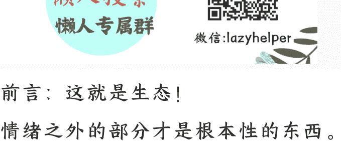

## 预制菜!

250915 守人忌令

整理: 公众号懒人搜索, 懒人专属群

懒人微信: lazyhelper

前言: 这就是生态!

情绪之外的部分才是根本性的东西。

正文:

当理想主义者的理想破碎之后, 往往会变得非常没有底线。罗永浩在做锤子手机的时候, 罗永浩是有理想有情怀的, 当罗永浩做失败之后, 尤其是还欠了6个亿的债之后, 罗永浩彻底的心态崩了。你会发现罗永浩后面的诸多行为, 不再相信美好, 这是一种什么样的心理呢? 简单来说就是: 我如此的追求极端美好善良, 你们这些人群都不配合。那就一切, 开始利用你们人性中的那些劣根性来玩弄你们! 如果你仔细的观察, 就会发现, 罗永浩后来的所有行为都是基于这一出发点。从董宇辉事件, 到字节事件, 罗永浩非常清楚乌合之众的情绪在哪里...罗永浩甚至走路到女性观众占7成的脱口秀里面去迎合情绪, 你不得不承认玩弄乌合之众的情绪罗永浩是成功的, 但你从此以后再

也见不到那个试图做一个企业的理想主义者的影子。当年的汪兆铭也在狱中写道:“引刀成一块, 不负少年头”的诗句, 而且汪兆铭不是说谎而已, 汪兆铭真的亲自去刺杀庞钦。对方帮助汪兆铭脱, 汪兆铭还主动撬开逃, 那个时候的汪兆铭是一个理想主义者, 但是这种理想主义者往往对自己和外界都存在着过高的期待。说得更白一点就是韧性不够, 本身是脆弱的, 这种脆弱就如同一个无比精美的装置, 因为任何一个微小的地方出现问题而彻底崩溃, 崩溃后就会走向反面, 汪兆铭如此, 罗永浩也不例外! 汪兆铭内心深处的崩溃源于连续的打击和持续的失败, 这种失败既包括自身斗争中的失利, 也包括外部环境的持续不如预期。有首1938年武汉沦陷时的诗很表现那种绝望的心境, 这绝不是汪兆铭一个人这样, 而是那一代社会精英和知识分子都这样。然而, 理想主义者很难自我反省, 因为过于追求完美的人本身是不允许瑕疵存在的, 也就是说汪兆铭首先认定自己无比完美, 所以要求外部世界也预期那样完美。如果承认自己不完美, 那对自身而言是灭顶之毁灭, 所以他们会习惯于把自己的不如意怪罪于外部, 并因为失望

而滋生出外部的恨意, 甚至渴望让自己不如意的外部对象彻底毁灭。

汪兆铭不是因为汪兆铭成了大汉奸这样, 而是因为汪兆铭这样才成了大汉奸, 而且汪兆铭不是一个人, 还代表着一群人, 这种心态和这种状态在任何时代都广泛存在。

所以说, 对于那些把千秋万代挂在嘴边不屑于谈利益, 追求纯粹和完美的文艺青年, 要充满警惕, 因为追求纯粹和完美的文艺青年的完美良和崩溃恶毒的切换就在一瞬间!

许多自带千般的恨国者, 最初的诱因可能都是因为对自己、对于单位、对于同事、对于家人、对于身边的一切充满期待, 但这种期待在现实的打击下持续的失望。这种失望积压的太多就成了绝望和抑郁, 这种失望就像一面镜子在不断的啊希望那个想象中无比完美的自己, 这样人受不了了这个想象中的啊希望, 最终就会走向反面。

就像许多女生年纪大了之后变得面可怜唯利是图的时候, 总是说自己曾经是恋爱脑, 却没有得到想要的结果, 然后就试图用这种唯利是图和面可怜来补偿自己, 让自己不输。事实上, 这样的人其实并没有付出的能力, 而是因为自身的各种缺陷, 对外界的期待很多, 当期待都落空之后, 就会滋生出一种崩

## 报复心理, 当然了, 这种心理
和接下来的行为并不会让唯利是图的大

龄剁令得偿所愿。

这就如同社会许多失望者认为自己
的各种失败就是因为道德准则太高不
够坏, 事实上坏也没用, 因为一个酒
店的服务员再坏, 也只能偷偷的把
毛巾拿回家, 放下道德并不会产生很
好的结果。

事实上, 一个人能产生什么样的效
果, 取决于处于什么样的位置, 而不
是有什么样的道德。越是存在于诸多
缺陷的人, 才会对自己和外部产
生出人际的各种期待, 对自己和外部的
一切都会想象的过于美好, 当现实的
反馈戳破这个自我想象的泡泡之后,
就浑然不知所措的绝望了。这种绝望
产生的压抑和痛苦, 会把对自己各种
美好的想象撕得粉碎, 但是精神结构
的自我保护机制, 不能承认是因为自
己无能和菜, 只能异化成别的原因,
然后滋生出报复心理。

言归正传, 预制菜这个事情其实很烫
巴, 预制菜像是普通人的生存状态。
在连锁餐饮大行其道之前, 只存
在于高档酒楼和路边小店, 高等酒楼
不抢餐, 不追求价格的实惠。因为
高档酒楼的饭是预定的, 厨师有充
足的时间去准备, 因为高档酒楼的饭
很贵, 酒店有足够的利润去支撑食材
的新鲜和做工的地道。除了高端酒

楼, 就是路边小店, 像江西小庙的那种路边小店, 连菜单都没有, 所有的食材都摆在明面上, 老板今天准备了什么食材人就吃什么, 客人看着食材点菜, 老板就现场做出来, 几乎所有的苍蝇馆子都是这种模式, 苍蝇馆子服务于普罗大众, 不追求什么口味和服务体验, 但量环保经济实惠。你会发现高等酒楼和苍蝇馆子中间, 并没有一种既标榜高质量体验又标榜低价格的连锁品牌的餐饮模式, 因为那个时候社会没有太多中间群体。要是千体力消费路边小店, 要是商务群体消费高档酒楼, 中间层的群体不存在, 大家都在家里自己做饭。

随着社会的经济发展, 中间层的群体大量出现, 这个群体一直很拧巴: 有见识, 但没钱, 需求很多, 但能支付的成本很少, 这种充满悖论的要求被满足就只能骗! 所以, 不管是连锁餐饮还是外卖发展到最后都会采用骗的方式来满足: 10分钟出餐嫌太慢, 但是要保证保量, 既要口味好, 又要价格便宜, 中间层的最拧巴就是因为既要又要, 这种既要又要却不顾现实条件的制约, 源自于自身的脆弱性。

这种脆弱性在别的地方也会呈现出来: 比如说, 希望老师认真负责能给孩子提供 360 度全方位的照顾和教

育, 让自己的孩子能够遥遥领先, 同时, 最好不要掏钱! 前面的那种需求不能满足呢? 能够, 昂贵的私立学校! 但是私立学校贵, 出不起钱! 当自身的需求大于自身的支付能力之后, 就只能对别人进行道德指责, 强迫别人满足自己的需求买单, 然而, 别人也不是要做慈善的, 即便社会上那些做慈善的也存在各种利益诉, 这种情况下就只能骗了。为什么有些女生经常被别人骗呢? 因为这些女生的内心诉求和自身状况是极度不匹配的, 只有骗子才能满足。

中间群体无论是生活还是工作都缺乏自主权, 时间有限, 能付的钱也有限, 但诉求很高, 提前预定付很贵的钱是不可能的、排队几个小时等把菜做好也不能忍。因为既没有钱也没有时间, 所以就会滋生这样的诉求: 到了就能吃, 马上出餐, 环境要好, 食材新鲜, 口味地道, 价格烂便宜, 这些诉求都没有问题, 但加在一起就有问题! 但是当事人会以自己为标尺, 觉得自己的诉求没有问题, 肯定是有服务方有问题, 服务方要解决这个问题就只能糊弄与欺骗。

外卖行业为什么预制菜越来越多的呢? 因为这个生意的利润由单位时间的出货量来决定, 而主要消费群体没有时间等待。最好点了, 马上就送到, 所以, 对于配送和出餐要求都非常高的

快, 这种情况, 认真炒菜的商家肯定不用预制菜策略, 商家的效率太低, 你炒完一份, 人家都出了10份了, 这样下去你肯定会被人闲置。唯一不想被淘汰就只能提高效率, 提高效率的方式就是和别人采取一样的预制菜策略, 甚至门店的成本都可以省下来。

不是需求驱逐良品, 而是需求导向满足方式。

这就如同婚恋市场, 越来越多的人开始选择短择而不是长情, 因为需求方追求鱼塘, 需求导致任何长情的行为都会成为冗余, 成本太高, 不划算, 只有短择才最经济实惠。在这种情况下, 越是短择越有优势, 损失越少, 获得越多, 久而久之男女关系的短择就会成为一种新常态。

越来越多的女生抱怨生态都变成这样没有责任心的时候, 女生们不会承认这一切的源头是怎么开始的..人类很多事情在不同的领域, 不同的方向上, 往往会呈现出不约而同的特征, 这种不约而同的特征, 恰恰是某一个群体集中涌现的结果, 这个群体本身就是拧巴的, 诉求也必然是充满悖论的, 最终导致的结果也必然是充满骗欺和破坏性的, 这就是生态!

最后, 安利小懒的付费群:

## 懒人专属群 (介绍)

📖 懒人专属群持续更新中, 已持续运营6年, 整理超3000份各类精选付费文章 & 年费社群干货, 全部开放下载。

本资料为付费群内部分享, 仅供真实有need的朋友查阅 📖

## 懒人专属群更新记录:

[https://lazy2025.top/blog/record2](https://lazy2025.top/blog/record2)

## 懒人专属群更新记录 (需梯子, 备用):

[https://lazybook.fun/blog/record2](https://lazybook.fun/blog/record2)