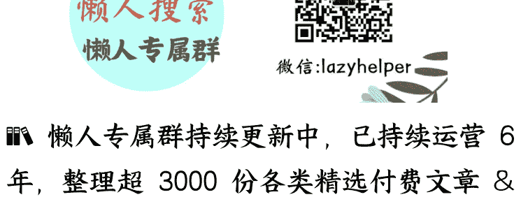

# 深切的承认：爱情如何化解孤独？

250915

人心易变，难免趋于平淡，时间久了，人在身边却无话可说，甚至分手破裂，最后反而让你更加孤独。

第二种是“亲友替代论”。比起恋人，家人和朋友提供的支持更加稳定，他们不离不弃，更值得依赖。

第三是“事业成就论”。孤独最好的解药不是爱情，而是追求事业的成功。只要忙碌到没有时间孤独，自然也就不会感到孤独。

第四种说法，就更有哲学意味，那就是“独自承受论”。它是说，无论是否恋爱，孤独是人根本的存在境遇。没有什么能拯救的孤独，只能靠自己独自面对，承认孤独，接受孤独，最终学会享受孤独。

这些观点听起来都有道理，然而，如果仅仅停留在这些表面逻辑，可能会忽略一个更深层次的探索：为什么人会感到孤独？

所以，我们首先要理解，孤独究竟是什么？才能去讨论爱情是否可能，以及如何可能以独特的方式慰藉孤独。

## 现代人为什么孤独

首先我们要明确，孤独不只是“一个人待着”的独处状态。你可以在拥挤的地铁里感到格外孤独，也可以在人烟稀少的山谷中感到充盈。所以，孤独的本质在于个体与世界的连接被切断了。

在传统社会，人与世界的纽带关系，是由宗族、宗教、礼仪和熟人社群来提供，即使独处仍然会有“归属感”。但进入现代之后，传统的纽带被侵蚀和消解，巨大的流动性造就了现代的“陌生人社会”，让越来越多的人变成了“漂浮的个体”，陷入了普遍和深重的孤独感。

现代人的这种孤独感，很大程度上与缺乏“承认”有关。

哲学家阿伦特认为，人类的尊严和价值需要被识别和肯认，这是人类基本的精神需求。如果这种需求长期得不到满足，就会滋生孤独感。

当代哲学家塞蒂亚（Kieran Setiya）在《生活艰难》一书中指出，人类的核心需求之一就是被爱与被承认。一旦这种需求无法得到满足，孤独便会腐蚀人的精神，即使身边围绕着无数朋友、家人，甚至崇拜者，也会感到孤独。

那么，我们如何才能重建与世界的深刻连接呢？

少数圣人、哲人和修行得道之人，他们能从万事万物、一草一木中都感受与世界共在，从而超越孤独的困境。但对于大多数平凡之人来说，摆脱孤独最主要的方式，是获得社会的承认。在我看来，其中有两个层面格外重要，用通俗的话来说，就是“被看见”和“被懂得”。

## 我们不仅需要“被看见”，而且渴望“被懂得”

造成孤独的一个原因是，感到自己没有“被看见”。这一点很好理解。一个人如果觉得自己都没有被其他人看见，当然就觉得自己没有被承认，进而感到孤独。但是，只有被看见就够了吗？就能让我们获得承认、摆脱孤独吗？

很多人都有这样的体验：自己朋友众多，社交广泛，朋友圈一发，立即获得几十个、上百个点赞，感觉自己已经被看见了，而且很受欢迎，却依然感到孤独，这是为什么呢？在许多传记、电影和文学作品中，我们会发现，甚至有一些社会名流，他们被众人簇拥、受万人注目，但是内心深处也可能极度孤独。这又是为什么呢？这是因为，“被看见”只是缓解孤独的基本条件，却不足以让我们摆脱孤独。仅仅“被看见”是不够的，我们还渴望“被懂得”。

这两者的区别是什么？实际上，这是两种不同层次的承认。

所谓“被看见”，是在一般意义上对人的“基本承认”，意味着承认你是一个独立的人，具有人的普遍价值与尊严。而所谓“被懂得”则更进一步，是对一个人的个体化的“深切承认”，意味着关注你的个体特质，理解你的独特经历，感知你复杂和微妙的内心世界。

我们渴望被承认的，不止于对我们作为人的一般基本价值，而是“我”作为特定个体的特殊价值。

## 为什么呢？

想象一下，你在朋友圈发了一篇文章，收获了上百个点赞，但其中没有任何人真正谈论文章的思想，你会觉得满足吗？你晒出了一张旅行照，大家称赞“好美”，但没人关心你为什么去了那里、当时的心情如何，这种赞美能鼓舞你吗？

当然，你被看见了，这总比无人理会的“小透明”要令人安慰。但这类笼统的、一般化的赞美，是一种“非个人化”（impersonal）的承认，是一种通用的好评标签，几乎可以分发给任何一个人，所以你并没有作为一个独特的个体被识别和被承认。

小结一下，“被看见”是“被懂得”的前提，但并不必然导致“被懂得”。我们在社会中，通常很容易“被看见”，却不容易“被懂得”。

## 深切的承认是怎样的？

## 那么，“被懂得”究竟是什么样的呢？

它是一种深切的承认，简单地说，就是细致入微的理解和关怀。

做个类比，认真对待美食的方式不会只说“好吃”，而是会细细品味其中的层次、调料的搭配、烹饪的技法，说出它的特色。对人更是如此。比如，有人夸你聪明或善良，但这太笼统了，你还期望听到更加具体的表达。

我记得在上世纪 90 年代的一部美剧中，男主是这样称赞一位女生的。他先讲述了自己很久之前的一次旅行，走过千山万水，终于到达山顶，看到一片湖水，宁静温柔、闪烁着碧绿的波光，让他久久难以忘怀，许多年过去了，他再也没有看到如此美好的景色，然后他对那位女生说，“直到现在，我在你的眼睛里又看到了那片湖水”。

你看，这种称赞，要比简单地说“你好漂亮”要细致深入得多。你甚至很难分辨这是赞美她的容颜，还是她的性情，或是灵魂的光泽。

这种具体而微的对独特性的承认，才会让人感到“被懂得”。

不仅如此，深切的承认还包括许多方面。包括对你想法的来龙去脉有深入理解，对你的情感起伏有细致关怀，以及你作为一个必定会有的脆弱、局限和困扰，甚至看似不可理喻之处，有体谅与接纳。

想象一下，假如一个人身患疾病，处于沮丧、焦虑或恐惧之中，但他仍然可以期待来自爱人的耐心安慰与细心关怀。关怀的缺失，会缓慢地导致一种隐秘的孤独感。

在这种境遇中，几乎只有爱情的伴侣才能持续地懂得你，理解你的过往与变化，及时适应和接纳变化中你“新的自我”，从而驱散这种孤独。

这就是为什么真正相爱的人，无论是新近的恋人，还是相爱多年的伴侣，都会反复地彼此讲述自己的来龙去脉。这种“彼此懂得”是一个生生不息的过程，这是融合共生关系的内在属性，也是爱情的本质特征。

## 总结与思考

总结一下，孤独的本质不是独处，而是与世界失去连接。化解孤独的关键不在于广泛的社交，而在于建立一种深度的连接和紧密的纽带。

但是，高度流动和变化的现代社会，这种连接和纽带，几乎只有在爱情的承认中才能获得，因为它超越了一般性的“被看见”，赋予我们“被懂得”的独特体验，给予我们被珍视的价值感和被关怀的和归属感。

当然，爱情虽然无法彻底消除孤独，但让我们能充分见证彼此的存在，感受生命的饱满的丰盛，从而化解现代人的孤独。

但是，依赖爱情来抵御孤独也是一种冒险，一旦失去爱情，也容易跌入孤独的深渊。那么，如何持续给予彼此深切的承认，让爱情不断成长呢？这就是下一讲的主题。

### 最后，留一道思考题：

如果你想让爱人感受到“被懂得”，而不仅仅是“被看见”，你会从哪些具体的方面作出改变？欢迎在留言区交流。

我是刘擎，我们下节课再见。

## 最后，安利小懒的付费群：

### 懒人专属群（介绍）

懒人专属群持续更新中，已持续运营 6 年，整理超 3000 份各类精选付费文章 & 年费社群干货，全部开放下载。

> 本资料为付费群内分享，仅供真实有需要的朋友查阅 🤫

### 懒人专属群更新记录:

[https://lazy2025.top/blog/record2](https://lazy2025.top/blog/record2)

### 懒人专属群更新记录（需梯子，备用）:

[https://lazybook.fun/blog/record2](https://lazybook.fun/blog/record2)