# 海外 AI 产品新手复盘：4个月赚到1刀，15天破1000刀

250915 生财精华

**公众号懒人搜索**，懒人专属群独享

**懒人微信**：lazyhelper

## 一、前言

大家好，我是王马扎，从今年 3 月中旬开始动手做海外 AI 产品项目，到 8 月末突破 1000 刀，这篇文章我将分享从 0 刀到 0.01 刀花了 4 个月，从 0.01 刀到 1000 刀花了 15 天的完整经历。

在开始分享前，申明如下：

我的分享中涉及的关于如何挖掘需求，如何用 AI 做产品等等一系列的方法论，全部来自于生财有术和我的两位老师 @哥飞 和 @刘小排，如有雷同，版权归生财有术和两位老师所有😅。

整个复盘，来自我 3 月中旬到现在，自己的实践经历，结合在生财和两位老师学到的方法。如有错误的地方，欢迎👋💬交流。

## 二、自我介绍

我是2020年418加入的生财，5年老圈友了，2019年举家搬迁到杭州，是我这辈子做的最正确的决定。这是我第一次在生财写这么长的帖子分享。

生财完完全全改变了我，在加入生财之前，只知道上班，对于商业一无所知。

出身农村，大学毕业为了多赚钱，进了一家传统行业的国企，去了才知道，工作条件非常差，比想象的还要差：公司在一个18线县城，工作要带安全帽，穿工作服，时间长了还会有尘肺的风险。

当了3年工人后，从18线县城去到北方二线城市，依然是传统行业，工资低不说还总加班。

偶然的听前同事说，搞互联网当码农赚钱，硬着头皮花了1万多报了一家网课，裸辞，去图书馆学习，从第一行“hello world”开始敲起，那时不像现在，有AI编程，完全是硬敲键盘一点点学。

敲了 3 个月后，投出了几十份简历，最想去的是杭州，没想到竟然有一家南京的公司要了我，虽然算上我只有 3 名员工，也算半只脚踏入互联网圈了。

那时已经在北方买了房买了车，孩子 2 岁，放弃这一切去一个陌生的南方城市，完全未知的世界，在这之前，还没去过南方。

在南京工作不到一年，我收到了杭州一家世界 500 强车企的 offer，对于我这样一个情况来看，可能算是奇迹了吧。

入职杭州公司的同时，全家也从北方搬到杭州，正式开启了杭漂的生活，家人很喜欢杭州，两年后升职加薪，在杭州买了房，算是彻底安顿下来。

2020 年 418 加入生财后，这 5 年里，跟着生财做了好多项目，比如知乎好物、小红书电商、AI 写作服务、公众号爆文等等，期间还当过生涯规划咨询师，做过几十场的职业发展咨询服务，虽然没赚到大钱，也是赚到了作为独立个体的第一桶金。

## 三、为什么我选择海外 AI 产品这个项目？

这几年做了好多项目，有成功的，更多的是失败的，总是很焦虑的在找项目做项目的循环中，有时很累，有时很爽。

迷茫时会想，自己究竟要做什么？这个问题想了好久好久，直到最近才逐渐明白，光靠想是没有答案的，需要在不断的试错碰撞中去找。

之前做过的很多项目有的是比较短期的，过了红利期，想赚钱越来越难，比如知乎好物；还有的项目，是能赚钱，但是自己内心是比较排斥的，比如 AI 写作服务，需要谈单，跟人聊，对于我来说比较消耗；还有的赚的就是辛苦钱，比如职业发展咨询，准备一场咨询要 4 个小时，想要放大收入很难，手停口停。

海外 AI 产品这个项目，对于我来说，刚好能满足：既能赚钱，又特别喜欢，同时我还有一点能力优势，而且很重要的一点，现在的趋势在这里，用 AI 创造 AI 产品。

去年 11 月航海家大会时，亦仁说过的一句话印象特别深：“我们都是条小鱼，从一个池塘换到另一个池塘，但是游到某个瞬间会发现，开始走进了属于自己的一片大海。”

我现在就是这种感觉，最近不那么焦虑了，做事也不那么急躁了，开始系统的以终为始的思考，因为我发现似乎找到了属于自己的那片海。

## 四、追新词，我花了4个月赚到第0.01刀

从出海第一天到赚到第0.01刀，我花了4个半月时间，这期间上线了15个网站（大概是这个数字）。

下图是我在即刻关于AdSense收入的记录，7月26日第一个网站申请通过AdSense赚到第0.01刀，8月22日到50刀，9月初突破100刀。

**王马扎**
08/22
AdSense也有点小突破，从7月26日开通以来，达到了50刀。

除了新词，也可以通过similarweb等工具去看看老词，我的这个 AdSense网站，上的并不是新词，是一个一年多的老词。

只因我在similarweb发现这个词有流量，而Google排名第一的，竟然是一个vercel域名，这都能排第一，那么我做一个肯定也会有点流量吧，结果就是真的有点流量，虽然不多。

**一个纪录达成**
5天前
AdSense小里程碑，39天达到100万，比预想的要快很多，AdSense这39天一顿自动优化，在流量甚至有点下滑的情况下，每天的收益翻了几倍。

下面详细复盘一下整个过程，真的是一波三折：

### 4.1 出海前 3 个月的上站情况

- **第一阶段（3月中旬--3月30日）：** 从今年 3 月中旬开始，正式动手用 AI 开发网站，在 4 月初之前，没有做 AI 产品，而是出海小游戏，跟着 3 月的 web 航海，半个月时间上线了7个小游戏网站，这些网站毫无例外都没有什么流量。

不过这期间最大的收获是掌握了如何用cursor开发网站。对于提交网站到GSC和GA都非常熟悉了，上线新网站整个流程比较熟悉。

- **第二阶段（4月初--4月26日）：** 参加完3月30日生财航海家下线大会后，跟一些圈友交流后，感觉不能光做小游戏站，做AI工具订阅站的想象空间更大！4月初除了陆陆续续又做了几个小游戏外，花了两周时间，注册了美国公司，申请了stripe。

3月末，ghibli(吉卜力)大火，我也注册了一个域名，花了20多天做了我的第一个带支付的AI工具站，这个站到现在也没出单。

- **第三阶段（4月底--6月初）：** 这一个多月时间，我陷入了完美主义，通过similarweb，找到一个新词italian brainrot（后面会详细讲如何找到的这个词），但是因为自己技术能力当时还不太行，加上完美主义，总想着做出完美的交互，到最后这个产品也没有上线，对于新手来说，这个也是一个大坑，太过于追求打磨产品细节。

总结：做出海web项目前三个多月，上线了10个网站（只有一个AI工具站，其他都是iframe的游戏站，还有一个未上线的工具站），没有赚到钱，甚至都没有做起来有一点点流量的网站。

### 4.2 出海第4个月，终于做出有正反馈的网站，我是如何找到需求的？

事情的转折发生在6月7日，我从杭州赶到上海参加@哥飞老师组织的线下活动，整整一天，可能是大脑受到了刺激，回来后的10天内我连续上线了5个新的网站，这些不是游戏站，而是iframe huggingface网站上面的模型做的AI工具站。

这 5 个网站里，最终有 2 个持续有流量，通过 AdSense 为我带来出海 web 的 0.01 刀。

这两个有流量的网站是如何找到需求的？两个获得流量的网站其实还有点不一样，一个是新词，我是第一个用该关键词注册域名上线的；另一个，是一个一年多的老词。

① 先说第一个，这个新词是在 X 平台看到一个大 V 发的，然后用这个关键词去 Google trends 搜索，发现的确是一个新词，流量是 gpts 的 5 分之一。从图中可以看到，在我注册域名之前，.com .ai .net 等域名都已经被注册了，但实际上他们都还没上线。因为自己是新手，说实话也没抱多大希望，就花了 2 美元注册了一个.art 域名。

花了几个小时搞定了网站，上站后主要是在 GSC 上提交网站 URL 和 sitemap 站点地图，加快 Google 收录，然后接入 Google Analysis 做数据分析，除了这两个以外，我还接入了 plausible，也是做数据分析用的，看数据比 Google Analysis 方便一些。具体上站后的细节就不展开啦，生财的航海手册写的非常详细。

② 再来说下第二个网站，一年多的老词，我是怎么挖掘到的。

在讲如何挖到这个词之前，大家可以看下这个网站，很有意思，域名是 vercel 的，也就是说，这个站长连域名都没舍得买。再看右侧 AITDK，4 月份的流量有 24k，这个网站只有一个首页，而且就这一个 iframe 的组件，其他什么都没有。就一个这样的网站，竟然排在谷歌搜索的第一位！这不就是软柿子了吗？

接下来重点说一下，我是如何挖到这个词的（注：这个方法思路是从@哥飞 老师的社群学到的）：

这个词，是通过用 Similarweb 分析 huggingface.co 找到的，具体步骤是这样：

1. 打开 Similarweb，输入 huggingface 网址，在关键词研究里面选‘着陆页’，可以看到某个时间范围内（最好选28天内）huggingface 内页流量情况。
2. 然后找到那些流量还在上升的内页，用这个内页的关键词去 Google trends 验证流量情况，用 Google 搜索去验证竞争对手情况。
3. 找到那个‘软柿子’，去做一个用户体验更好的网站，就有机会拿到流量。

这里要说明的一点是，挖掘需求，是一个慢功夫，有时也看运气，不能抱着只要去找，就一定能找到的心态去找，很多时候，是研究分析了几个小时也没收获。我的经验是，新手不要想着找到流量巨大，竞争很小的词，这不现实。不管遇到什么词，只要觉得有机会，先上站拿到正反馈，把整个环跑通，这是一个循序渐进的过程。

### 4.3 流量“暴增”阶段，受到Google惩罚，流量归零

上面提到的两个网站，上线没有几天就拿到流量了，尤其那个新词网站，从第二天开始就爆发了，虽然日uv还不到1000，但对于新手来说，第一次的正反馈很激动！

但没过几天，这个网站就被Google惩罚了，流量基本归零。最开始核心词拿到排名第3，还有一个词拿到第1，但是上线了多语言后，核心词直接搜索不到了，过了两天我加了内页（也有多语言）上线后，排名第1的词今天也搜不到了，有点被Google ban掉的感觉。

发现这个问题后，赶紧问 chatgpt o3，o3分析后告诉我，可能有以下原因：

- ① 多语言问题，上线多语言前一定要仔细排查，让o3确认一下是否有问题，我有两个在GSC的搜索排名中，同时出现了/ja和/ja/这种现象，我推测有可能是被判断重复页面而处罚了，因为对于搜索引擎来说，/ja和/ja/是两个URL，内容完全一致，那么至少会降低排名权重的。
- ② 复用模板导致页面重复。这个更奇葩，我昨天上了一个新网站，用的是有流量的这个网站的代码，上线时虽然屏蔽掉了多语言的选择按钮，但是搜索引擎仍然收录了多语言的URL，而新上线的这个站，其他语言我并没有做任何处理，这就导致了除了en外其他语言的页面在搜索引擎中出现了两次，不同的域名相同的内容！我发现这个问题后，赶紧在robots.txt里把除了en以外的页面加了disallow，同时在GSC中删除被收录的多语言页面。
- ③ sitemap 设置问题，导致搜索排名被稀释了。sitemap 里面设置的多语言没有设置`<xhtml:link rel="alternate" hreflang="x-default" href="https://xxx.com" />`，告诉搜索引擎其实这些多语言是同一个页面，只是不同的语言。我之前上线多语言时，只是简单的把每个多语言页面罗列上了。
- ④ 没有为 http 设置 301 永久重定向到 https。如图，在 GSC 中看到 http 和 https 同时出现在搜索结果中，问了 o3，给出了详细的解答。

| 可能触发原因 | 典型排查步骤 | 解决动作 |
| :--- | :--- | :--- |
| 1. 站点还可以通过 HTTP 直接访问 Google 抓到 200/304 或 302，而不是 301 -> HTTPS | - 浏览器或 `curl -I` http://...<br>- Screaming Frog 等抓站，看 `href="http://.."`<br>- Cloudflare/WAF "Always Use HTTPS" 是否开启 | 整站 301 强制跳转：在最前端（CF、Nginx...）做永久重定向；开启 HSTS |
| 2. 内部/外部链接仍指向 HTTP | - Screaming Frog 等抓站，看 `href="http://.."`<br>- site:http://... 搜索 | - 批量替换为 HTTPS<br>- 请求重要外链方更新 |
| 3. rel="canonical" / hreflang 写成 HTTP | - View-source 查 `<link rel="canonical">`<br>- 多语言模板变量是否漏了 https:// | 统一改成 HTTPS 绝对路径 |
| 4. Sitemap / RSS 里写了 HTTP | - 手动打开 /sitemap.xml 检查<br>- GSC -> "索引 -> 网站地图" 点击链接预览 | 重新生成（或脚本替换）为 HTTPS，重新提交 |
| 5. 历史缓存（以前的 HTTP 已被索引） | 此时 GSC 仍会统计，但点击量会逐渐归零 | 完成以上动作后，向 GSC 提交“更新索引”或“移除旧版 URL"，等待收敛 |

当时遇到这个情况是很沮丧的，还没高兴一周，网站就废掉了。我联系了@哥飞 老师，他建议我多加一些外链，说可能网站还有救。听到网站还有救，赶紧去找外链，开始搞外链！

### 4.4 流量恢复，申请 AdSense 多次遭到拒绝

按照 O3 给的指导建议修改，加上不断的上了几十个外链后，刚好过了整整一周时间，流量竟然回来了！从 GSC 可以看到，6 月 27 日悄无声息的就重新被拉起来了，后面几天还创了新高。

流量问题解决了，开始想着通过 AdSense 变现。当时刚好参加了 6 月的航海，按照航海手册把两个有流量的网站申请了 AdSense。然后就开始漫长的等待。结果等了两周，告诉我申请不通过：低价值内容！

继续问 O3 去排查，他跟我说，网站太单薄了，没有 /about/contact/blog 等等这些页面，AdSense 会认为这个网站是个低价值内容网站，就会拒绝。O3 还提醒我说，如果做了以上改动，还是被拒的话，可以考虑自己做订阅，更赚钱。也是从这个时候开始，有了想把这个网站做成订阅的打算。

**刀切到骨的结论**

AdSense 把[打码]归为“在不包含发布商内容的屏幕上展示 Google 广告/低价值内容”，意思很直接：页面几乎只有一个功能页+市场营销段落，没有持续、原创、可阅读的“出版者内容”，因此不符合投放条件。简单来说，Google 想在“文章/资讯/深度教程”上贴广告，不想在“只有一个小工具或占位符”的页面上贴广告——哪怕你的工具再酷。

**1. 官方案违规点拆解**

| 违规标签 | 官方说明 | 常见触发场景 | 你站点的对应症状 |
| :--- | :--- | :--- | :--- |
| 无内容或低价值内容 | 页面缺少原创文字，或内容只做简单拼接/机器生成 | 单页工具站、Landing Page、占位符 | [打码]目前基本只有单页介绍+[打码] |
| 尚在中 | 空菜单、空栏目、404、Coming Soon | 路由已生成但无真实内容 | 若存在预留栏目或空缺接，也会踩雷 |
| 用于导航/提示 | 纯目录页、空白搜索页 | 站点仅引导去外链 | 你的首页几乎只有“打开工具”按钮 |

**2. 为什么工具类单页容易被拒？**

- 1. 广告曝光价值低：用户只进来一次，完成任务就走；广告点击率和停留时长都差。
- 2. 内容审核难度高：工具内部的上传、转换结果 Google 很难自动审查。
- 3. 可替代收获方式多：这类站更适合直接卖订阅/API，而不是跑展示广告。

**3. 合规调优 5 步走**

目标：把“工具页”升级成“内容 + 工具”的组合，让 AdSense 看到可持续的原创价值。

| 优先级 | 动作 | 关键要求 | 参考做法 |
| :--- | :--- | :--- | :--- |
| ★★★ | 补足 20~30 篇深度原创文章 | 每篇≥800字；主题紧扣 | |

**4. 重新提交前的 Checklist**

- 1. 实地爬站：用 site:[打码]看索引页数，< 30 页面基本稳拒；目标≥40 URL。
- 2. 手动审核：逐页确认无空白、无拼接、无 AI 垃圾段落。
- 3. 流量测试：哪怕日 UV 300，也比 0 UV“空壳站”强；可以跑一点 SEO/社媒引流。
- 4. AdSense 控制台→申请复审：修改完后至少隔 2 周再提，保证爬虫完全抓到了新版内容。
- 5. 预案：如果后续仍被判“低价值”，考虑放弃 AdSense，直接做 Pro 订阅/API 计费收费——工具站更赚钱。

本以为按照 o3 说的去改，就可以很快申请通过了，给两个网站加了内页、/about、/contact、/blog 发了几篇 blog 后，重新申请，结果又过了好久，具体不记得过了几天了，还是被拒绝了，拒绝理由差不多都是低质量之类的。

看着每天的流量数据，却不能变现，真的焦虑，不断的安慰自己好事多磨，然后就继续加 blog 更新网站。

中间我甚至怀疑过是自己 Google 账号问题，也尝试过把申请 AdSense 的完全删除，重新申请。总之就是又被拒。到最后，被拒了，我就等两天，然后没有任何更改，重新申请。

### 4.5 历时一个半月，Adsense 终于开通，赚到了第一个0.01刀

本来已经不抱希望了，没想到7月26日那天，打开 Gmail，发现有一个网站竟然通过 AdSense 了，感觉打开 AdSense，发现已经赚到了 0.01 美元！太开心了，这意味着4个多月以来，终于跑通了一个小闭larloop！

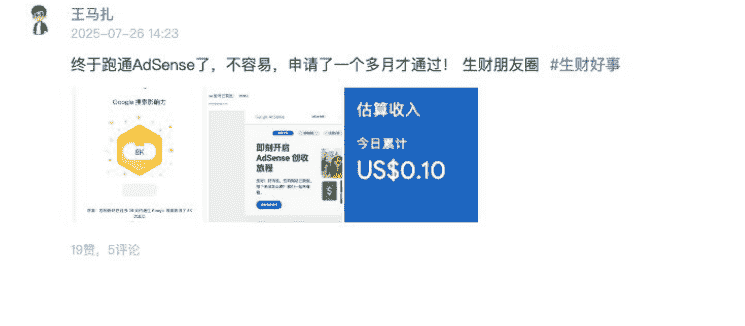

又过了几天，另一个网站也通过了 AdSense 审核，就是这么神奇，我都没做什么改动，两个网站就这样稀里糊涂的通过了 AdSense。

AdSense 一个很大的好处是，省心。 不需要做维护，它的系统会自动帮着优化，优化过后，收益还能增加。 只需要隔一段时间给网站加点外链和 blog 就可以了。当然，如果想要网站有更大的流量，还是要继续加内页。

后来我去搞订阅工具站了，没有太多精力维护，就一直没怎么管，每天的平均收益竟然一直在提高，目前过了 40 多天，刚看了下了，总收益是 140 多刀了。

| 类型 | 数值 1 | 数值 2 | 数值 3 | 数值 4 | 数值 5 | 数值 6 | 数值 7 | 数值 8 |
| :--- | :--- | :--- | :--- | :--- | :--- | :--- | :--- | :--- |
| **日期** | 185, 2025 | | | | | | | |
| **全部** | USD$141.63 | 16,247 | USD$8.71 | 43,581 | USD$3.35 | 71.18% | $10 | |
| **平均** | USD$3.08 | 252 | — | 660 | — | — | 17 | |

## 五、根据功能关键词，做品牌网站，赚到第 1000 刀

当我的 AdSense 被拒时，眼看着流量白白浪费掉很心疼，在 7 月初注册了一个品牌域名打算做一个订阅 AI 工具站，到 8 月 19 日正式上线，花了一个多月的时间。战线拖得有点太长了，差一点又烂尾掉。

这是我上线的第二个带支付订阅功能的 AI 工具站。说实话，结果是有点出乎我的预料的。

上线**第二天出单**，上线第五天出了第一单 **327刀** 年订阅，上线**14天**突破千刀。

### 订单明细
- **US$39.00 已成功**
  Subscription creation
  @...@gmail.com
  8月24日 17:05

- **US$327.60 已成功**
  Subscription creation
  @...@email.com
  8月23日 05:22

- **US$39.00 已成功**
  Subscription creation
  @...@film.ch
  8月22日 13:08

- **US$39.00 已成功**
  Subscription creation
  @...@gmail.com
  8月21日 03:12

- **US$39.00 已成功**
  Subscription creation
  @...@gmail.com
  8月19日 23:54

### 付款账单订阅支付链接
### 状态 创建日期

- **US$15.00 已成功**
  Subscription creation
  [Masked email] gmail.com
  🟢 8月30日 01:31 →

- **US$9.00 已成功**
  [Masked email] t@gmail.com
  🟢 8月28日 14:16 →

- **US$15.00 已成功**
  Subscription creation
  [Masked email] gmail.com
  🟢 8月26日 17:04 →

- **US$327.60 已成功**
  Subscription creation
  [Masked email] @gmail.com
  🟢 8月26日 08:58 →

- **US$19.00 已成功**
  [Masked email] @gmail.com
  🟢 8月26日 08:49 →

### 首页 付款 余额 客户 搜索
**状态 创建日期**

- **US$126.00 已成功**
  Subscription creation
  [图标] @...gmail.com
  9月2日 12:46

- **US$15.00 已成功**
  Subscription creation
  [图标] @...gmail.com
  9月2日 03:57

- **US$39.00 已成功**
  Subscription creation
  [图标] @...gmail.com
  8月31日 14:11

- **US$19.00 已成功**
  Subscription creation
  [图标] @hotmail.fr
  8月30日 14:55

- **US$15.00 已成功**
  Subscription creation
  [图标] @...gmail.com
  8月30日 08:17

首页    付款    余额    客户    搜索

下面详细复盘一下做这个产品过程中所遇到的问题以及如何解决的：

### 5.1 为什么要做这个品牌网站，如何解决初始流量问题

前面提到过，当我做的那个新词站申请 AdSense 一直无法通过申请时，就想着不能浪费这波流量，要去做订阅收费。我看到一些其他的对标网站，是直接在新词站上支付订阅的，但我没有这样去做，考虑的原因有以下几点：

第一，用新词关键词注册域名，严格来说是有侵权风险的，后续有可能被收回域名；

第二，新词的热度会逐渐降低，而网站的流量主要来源于这个新词的搜索，一旦这个词慢慢没有了搜索，那么这个站流量也就枯竭了；

第三，继续用这个词不利于做品牌推广，这个模型词背后对应的是个长期需求，注册一个独一无二的品牌词，可以积累长期复利，伴随着大模型能力的增强，网站的用户体验也会越来越好。

所以，基于以上的考虑，我做了如下图所示的设计：把申请 AdSense 的那个新词站一部分流量，导流到品牌词网站，作为这个 AI 工具站的冷启动流量去验证 MVP。

当用户访问这个新词网站的 hero 组件时，会看到两个按钮，点击按钮 A，会跳转到下面的功能组件，点击按钮 B，会跳转到品牌词 AI 工具站。

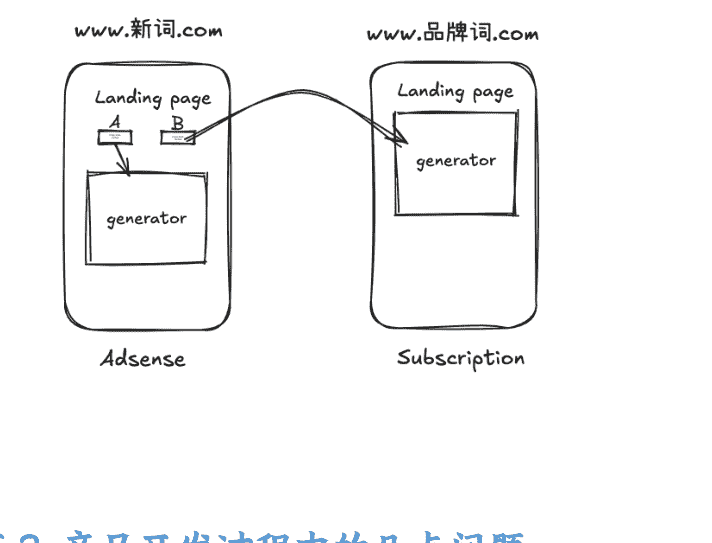

### 5.2 产品开发过程中的几点问题

初始的流量有了，该如何验证MVP呢？背后的需求词有很多，到底该如何入手？是要把竞争对手的所有功能都加上，做一个大而全的产品？还是只做一个最核心的功能，缩小验证路径？

#### 5.2.1 确定产品最小MVP

5月底参加了生财的海外AI产品深海圈，系统的学习了用AI如何从0到1做产品，@刘小排老师说，在做产品前需要想清楚一个问题，如何用一句话描述产品：

什么人，在什么场景下，愿意花多少钱，解决什么问题？

基于这个思考，我想那肯定是功能越少越容易验证需求。在调研过程中发现，竞对功能有好多，SEO关键词有很多，到底从哪一个功能哪一个关键词去切入呢？

我用 ChatGPT、Gemini、Claude 的 deepresearch 功能同时去调研，目前的技术，最核心的功能是什么？面对不同需求的用户，哪一类用户的需求可能还没有满足？

ChatGPT 和 Gemini 的 Deepresearch 质量比较高，给出了相似的回答，告诉我往电商方向的用户去切。

最终决定，网站上线只做一个功能，landing page 的 SEO，只优化一个核心功能关键词。

从 Google trends 可以 看到，这个关键词的搜索量不是特别大，最新数据比 gpts 要高一些。

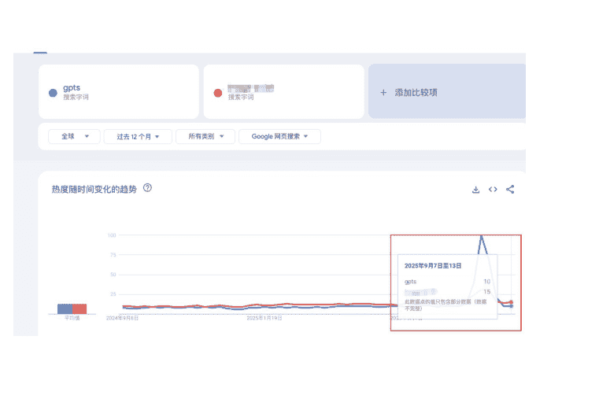

#### 5.2.2 用最好的 AI 编程工具，提高开发效率

产品的功能确定了，流量来源有了，剩下的就是用 AI 编程工具把产品做出来了。

刚开始只用 cursor 开发，有时为了解决一个 bug，搞几个小时也解决不了。

小排老师建议遇到问题多问 o3（现在是 gpt 5 thinking），后来又逐渐放弃 cursor，改用 Claude code，开发效率提高非常多。

现在我用的 AI 开发工具组合是: ChatGPT 中 gpt 5 thinking + Claude code max 100 刀 + codex

其中 ChatGPT 中 gpt 5 thinking 充当架构师的角色，能力最强；

Claude code 和 codex 作为高级程序员，简单的需求直接搞定，涉及比较重要的且复杂的逻辑，我是让 gpt 5 thinking 做架构设计和 code review。

比如，stripe 支付、积分发放和网站的缓存优化这几项，我是让 ChatGPT 中 gpt 5 thinking 负责，虽然用的市面上比较成熟的 starter kit, 但是用 ChatGPT 中 gpt 5 thinking 去 code review 支付和积分代码，还是发现了不少问题。

#### 5.2.3 两个重要的数据统计分析工具

除了正常接入的 GSC 和 Google Analysis 之外，我还接入了 Plausible 和 Clarity。

##### ①Plausible

Plausible 看数据比较方便，可以很直观的看到流量的来源还有国家的分布，另外一点我经常关注的是/pricing 页面，通过这个页面的访问量可以大概看出用户对于产品的付费兴趣，比如，/pricing 页面访问多而成交少，说明可能是价格问题；而如果网站的 uv 增加，但是点击/pricing 页面的少，说明可能是用户体验问题，需要优化用户体验，亦或是用户不够精准，不是目标用户。

**Top Sources**
Source: Direct / None, Bing, Google, chatgpt.com, 10minemail.com, Yahoo!, checkout.stripe.com, DuckDuckGo.

**Top Pages**
Page: /, /pricing, /auth/register, /gallery, /auth/login...

**Countries**
Country: South Korea (474), Brazil (387), China (330), United States (313), Russian Federation (130), India (121), Hong Kong (100), Germany (87), France (79).

**Devices**
Operating system: Windows (69.7%), Android (13.5%), Mac (9%), iOS (5.6%), GNU/Linux (1.6%), Chrome OS (0.3%), Ubuntu (0.1%), HarmonyOS (0%).

Plausible 还有一个好处，它提供了 api 功能，可以将这些数据通过调用 api 的方式存储到数据库中做数据分析。

我在做转化率分析时，发现在 neon 数据库里面只储存了用户 session 数据，也没有用户来源国家数据，也就是说只有注册用户的数据，如果一个用户没有注册，那么就无法统计一个用户访问网站后的付费转化率（UV->付费 转化率）。更没有办法，统计出针对不同国家的付费转化率。

Plausible 刚好补充了 uv 数据，国家数据等，这就为搭建网站的数据分析报表提供了数据基础。后面会详细分享一下，如何用网站数据搭建一个可视化的数据分析报表。

##### ②Clarity

clarity 有一个功能，是可以看到用户访问网站后具体做了什么，相当于是给用户的行为录屏了。

网站刚上线的几天，我通过看 clarity 的录 屏视频，解决了好几个 bug。

比如，一个用户在生成页面打开后，过了一秒离开了网站，我一看，英语的多语言页面，竟然显示的是中文！用户是一个韩国用户。然后赶紧让 claude code 系统检查一下多语言，是否存在语言硬编码的问题。

再比如，当我在 clarity 看到手机端用户的录屏时，我发现手机端的前端页面体验很差，于是又单独优化手机端的页面。

经常看 clarity 的录屏，可以优化用户体验，而且 Google SEO 最新的算法，特别重视用户体验，好的用户体验不但可以提高转化率，还能带来 SEO 流量的增长。

### 5.3 竞争对手那么强，新产品还有生存空间吗？

我在做外链时，看到产品的竞对的外链情况感到崩溃，产品上线前，没认真研究竞对的外链，想不到这么恐怖！


但就是在这种情况，新产品依然有空间，能够出单赚钱，也说明了国外用户消费理念与国内不同，他们更关注产品能否解决他们的问题本身，而不是做这个产品的个人或公司到底规模多大实力如何。

只要产品能满足用户的需求，用户就会下单。剩下的问题，就是如何找到更多的目标用户。

作为行业新人，没想着要做出改变世界的产品，只是赚点钱养家糊口，其实需要的流量可能并没有想象的那么大。

其实，海外AIWeb的流量除了SEO之外，还可以通过做投放、社媒体推广等方式获取。

除了我这个产品，最近大火的nano banana也给我很大的启发，不要担心竞争的人多，竞争的对手太强，做订阅产品，其实不需要特别大的流量就可以赚到钱。

拿我这个产品来说，每天的 uv 只有 100 多一点，也可以稳定出单赚到钱。我觉得这是这个项目最引人的一点！相对来说，没有太大的流量焦虑，用户付费意愿强，容易服务。我们可以一边打磨产品，一边做流量增长，一边赚着钱。

### 5.4 客单价怎么定才能既赚钱又能出单？

关于定价策略的问题，我当时很纠结。

客单价定多少？套餐要有几种？刚开始要上订阅吗，还是只收一次性订单？年订阅要上吗？

客单价这个问题挺有意思，如果简单粗暴的去抄竞争对手，很有可能即使有出单也不赚钱，因为竞争对手的 api 成本优势我们没有；但如果定价高于竞争对手，会担心影响转化率。

我这个产品，想着直接去抄竞争对手的定价策略，但是我一算账，如果完全按照竞争对手的定价，我不但不赚钱，还亏钱。

比如，我的 api 成本在 0.05 刀-0.25 刀左右，但是竞争对手卖给用户也就是 0.2 刀-0.4 刀左右。这我怎么竞争？再加上用户的免费试用 2 次的 api 成本，即使出单了我也很可能赔钱！

怎么办呢？当我问了 gpt 5 thinking 后就有答案了！只需要告诉它，我的 api 成本是怎么样的。

如图，AI 给出了非常清晰的定价方案，而且保证不会亏钱！因为毛利有 75% 以上（实际比这个还高，能到 85% 以上）。

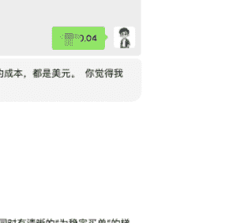

如图，这是产品对应不同生成成本的账lin 截图。成本都是美元。你觉得我怎么定价比较好？

**我给你的定价（先用这版跑 A/B）**

你的硬成本：$0.08, $0.15, $0.25, $0.04。目标：覆盖支付手续费/存储/CDN/失败重试（~10-15%）后，毛利≥75%，同时有清晰的“为稳定买单”的梯度。

#### Web 端（按次/按包）
- ... (走 Replicate，带一次质量保底重做)：$0.59 / 次
- ... (优先官方通道 + 必定后台保底重做)：$0.99 / 次
- ... (高步数 + 高分辨率 + 官方优先)：$1.99 / 次
- ... (类型)：单独生成 $0.19；与...

*以上价格对应的计算毛利大约：...86%, ...5%, ...87%，足够覆盖额外开销与偶发重跑。*

#### Credit 包（推荐主卖）
- 15 Credits — $9 ($0.60/credit)
- 40 Credits — $19 ($0.475/credit)
- 120 Credits — $49 ($0.408/credit)
- 27 Credits — $99 ($0.366/credit)

*消耗规则（整数好记）：...。*

#### 订阅（锁定 MRR）
- Creator $15/mo: 30 credits, 超额 $0.55/credit, ... 超额 $0.45
- Pro $39/mo: 100 credits, ..., 超额 $0.45
- Studio $99/mo: 300 credits, 质量保底重做 x2 + 批量/API 试用，超额 $0.39
- Enterprise: 自定义并发 / 私有的署，按量计价

当然，上面这个只是一个初步的定价方案，后续又经过多轮的沟通，最终确定了现在的定价策略，包括 pricing 页面的每个卡片的描述，都是 gpt 5 thinking 写的。

直到现在，我都觉得很神奇！如果不是 AI 帮我做定价方案，我肯定不敢定价这么高，收这么多钱的！

还有刚开始提到的，到底要不要上订阅的问题，GPT 5 thinking 也给出了方案，他一直提醒我要有一次性收款的积分包，且刚开始要主推这个，所以现在我的产品的/pricing页面里，除了订阅的套餐，还有积分包的套餐。

> **我用 Stripe 进行收款，你建议是搞成按照月订阅，年订阅的方式收款，还是按照其他方式呢？**
>
> **已思考 13s**
> 结论先给: 用“按次积分包+月订阅”为主，年订阅只给重度/企业 15%~20% 折扣。别只押月/年订阅，否则漏掉大量“偶尔用”的长长尾现金流；也别只卖按次，否则拿不到可预测的 MRR。用 Stripe 最顺的组合是「Credits (一次性) + Subscriptions (月/年) + API 计量制(B2B)」

#### 我给你的方案（能直接上 Stripe）

- **1) 按次积分包（一次性收款，主承接长尾）**
  - 用 Stripe Checkout (one-time price) 卖 15/40/120/270 credits (你前面那套就行)。
  - Webhook `checkout.session.completed` / `invoice.payment_succeeded` -> 给用户钱包加分（写入 ledger）。
  - 好处：降低首付心理门槛，冲动消费更容易；也能用于订阅用户“超额加油”。

- **2) 月订阅（锁 MRR，默认推荐）**
  - 三档：Creator $15/30c、Pro $39/100c、Studio $99/300c（超额按 credit 结算）。
  - 用 Stripe Billing Subscriptions: 每个价格建 monthly & annual 两个 price。
  - Rollover: 最多顺延 1 个月（用内部表控制，不把所有积分一次性发放）。
  - 升级/降级：升级立即生效 (proration 开启)、降级到期生效 (`proration_behavior: none`)。
  - 试用：送 5 积分或 $1 试用 7 天（更防刷）。

- **3) 年订阅（只对稳定用户/企业显raz 展示）**
  - 年付 15%~20% 折扣（例如：Creator $150/年、Pro $390/年、Studio $990/年）。
  - 仍按月发放积分（防止“一次性领完跑路”）。
  - 发票/合同用 Stripe Invoicing + Stripe Tax (有税务的就完了)。

- **4) API/B2B (有增长潜力的渠道)**
  - 用 Metered Billing: 成功回调计量）。
  - 你在任务成功时调用 `usage_records.create()` 上报数量；失败单不计费。
  - 起订 $99/mo (最低消费) + 阶梯折扣（用 tiered price）。

#### 钱该怎么收、怎么退（关键细则）

- **支付方式**：启用 Card/Apple Pay/Google Pay/Link；海外为主就够用了。
- **失败重做不计费**：在条款写清楚——你会自动重做一次；两次失败直接退款/扣积分。
- **反欺诈 & 索赔**：记录每次生成参数、时间、图像指纹、seed、后端，和 charge 号绑定，留证据。
- **Dunning**: Stripe 智能重试 + Billing emails 开启。[模糊]期未付自动降级到 Free（保留剩余积分）。

#### 关于产品定价方案，总结一下：

首要原则就是，不要让自己亏钱。如果是像我一样的新手，让 AI 帮助做定价方案。

我的这个产品，定价是高于我能看到的竞争对手的，当然，随着产品不断的打磨，我也会做更多的促进转化的测试。

**比如**，新用户访问 pricing 页面时，先看到积分包的转化率，是否会高于先看到年订阅或者月订阅？**年订阅**的定价如果比月订阅便宜 50%，会不会增加年订阅的转化？**这些**都需要测试。

**刚开始不要担心**自己的产品定价太高，前期是为了验证产品是否满足用户需求，只要产品真正可以解决用户问题，只要定价不是高的夸张，一定会有用户付费的。

**但是如果**定价过低，前期付费用户的收款还覆盖不了 API 的成本，那么后续的整个闭环就很难持续了。

### 5.5 为了分析转化率等数据，搭建可视化数据分析报表

**产品**刚上线的前几天，我每天要通过 SQL 去看前一天或最近一周、30 天用户注册数量、产品使用次数，再结合 Plausible 数据去推算产品转化率。

```sql
SELECT date_trunc('day', created_at) AS day, COUNT(+) AS tasks_created
FROM generation_task
WHERE created_at >= now() - INTERVAL '30 days'
GROUP BY 1
ORDER BY 1;
```

| # | day | tasks_created |
|---|---|---|
| 2 | 2025-08-19 00:00:00 | 77 |
| 3 | 2025-08-20 00:00:00 | 83 |
| 4 | 2025-08-21 00:00:00 | 54 |
| 5 | 2025-08-22 00:00:00 | 62 |
| 6 | 2025-08-23 00:00:00 | 64 |
| 7 | 2025-08-24 00:00:00 | 55 |
| 8 | 2025-08-25 00:00:00 | 75 |
| 9 | 2025-08-26 00:00:00 | 135 |
| 10 | 2025-08-27 00:00:00 | 94 |

```sql
SELECT date_trunc('day', created_at) AS day, COUNT(+) AS users_created
FROM _user
WHERE created_at >= now() - INTERVAL '30 days'
GROUP BY 1
ORDER BY 1;
```

| # | day | users_created |
|---|---|---|
| 5 | 2025-08-19 00:00:00 | 65 |
| 6 | 2025-08-20 00:00:00 | 59 |
| 7 | 2025-08-21 00:00:00 | 44 |
| 8 | 2025-08-22 00:00:00 | 59 |
| 9 | 2025-08-23 00:00:00 | 36 |
| 10 | 2025-08-24 00:00:00 | 56 |
| 11 | 2025-08-2 |

决策方案, 但最终我还是用 GPT-5 Thinking 给我的方案。

**ChatGPT 5 Thinking**

```
我有一个需求, 就是现在每天需要去数据库 Neon 里面用 SQL 去查一天或最近一周、30 天用户注册数量、产品使用次数等等数据情况，结合数据去推算产品转化率，但这样其实非常不直观分析数据，我现在想要做一个数据大屏，在网页端可以展示跟我要求展示的数据图表等等。

现在的数据存储在 Neon 里面，你有什么好的方案实现我的需求吗？我主要是每天想看到数据报层的数据大屏。
```

已思考 1m 54s

```
# 目标

每天/每周/30天可视化查看核心运营指标 (注册、活跃、生成次数、转化率等)，并可一键切换时间范围、自动刷新、支持导出&推送。

## 总体方案 (给你三档，快狠准)

**A. 最快上线 (0 代码 BI): Metabase 或 Superset 直连 Neon**

* 10-30 分钟即可看到图表。
* 用 Neon 只读账号直连，建几条 SQL 就有看板。
* **内置图表与导出/邮件订阅; Cons: 品牌一致性一般、二次定制受限。**
```

他告诉我, 可以用 Metabase 直接连接我的业务数据库 Neon, 然后可以按照自己需求做数据大屏了！

在前面分享如何使用 Plausible 时提到，想要统计分析出精准的 UV -> 付费的转化率，需要用到 Plausible 里面的 UV 数据。

在 AI 的指导下, 我用 n8n 把每天 Plausible 的 UV 数据定时同步到 Neon, 用 Metabase 做 UV 转化率分析, 分析不同国家 UV 转化率。

下面是用 n8 整理同步 Plausible 数据到 Neon 数据库的工作流, 很简单, 👉 右边是个工作流的 JSON 文件, 如果你也想同步数据到 Neon/Supabase, 导入这个 JSON 文件到自己的 n8n 里面调试就好。

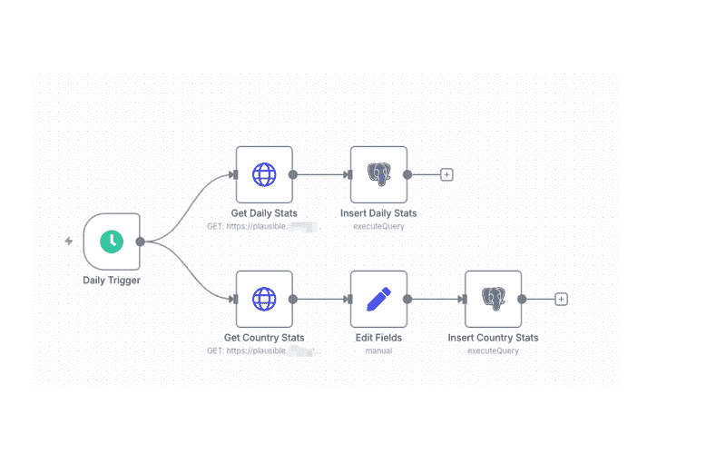

最终, 我让 Claude Code 根据我的业务数据, 写了一些数据分析的 SQL, 就得到了一个这样的可视化的数据分析看板, 每天可以非常直观地看到产品的各项统计数据。

具体的 Prompt 如下：

我在做数据分析大屏，Neon 数据已经接入了自己部署的 Metabase 里，我需要做哪些数据分析报表？你详细地了解整个项目的业务逻辑和数据表结构，帮我做一份数据大屏分析 BI，我需要掌握项目的整个运营数据。

UltraThink


## 六、目前最大的卡点是什么？突破营收的思考

### 6.1 新产品卡点

对于现阶段的我来说，最大的卡点是流量的获取。

无论是新上线的这个产品，还是后续的其他任何产品，流量都是最大的卡点。

原因在于，想要通过 SEO 获取流量，除了做新词站能快速地获得流量外，如果是一个有长期需求的老词，那么获取 SEO 流量的周期就会被拉长。

拿我新上线的这个产品来说，目前上线 20 多天，一共通过 SEO 只获得 45 次点击，很显然，如果只靠关键词的 SEO，短期很难获取到稳定可观的流量。

我的新产品之所以能够获取到冷启动流量，是靠着新词网站的导流，而 SEO 真正的获取可观的流量，还有很长的路要走，这期间需要不断的加外链和内页，去做 SEO 优化。

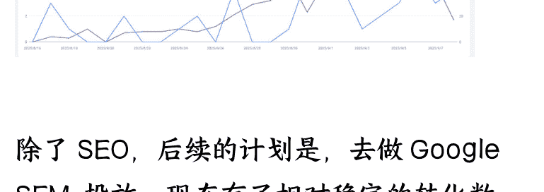

除了 SEO，后续的计划是，去做 Google SEM 投放，现在有了相对稳定的转化数据，MVP 验证可行，那么针对转化率高的国家地区做投放，去测试转化率是否会提高。

这也是我做可视化数据分析大屏的原因，用数据去指导投放，效果可能会好一点。

哥飞老师说，SEM 投放，有助于 SEO。那么如果前期 SEM 投放 ROI 能够打正，可以加速 SEO 获取免费流量。

除此之外，我注册了 X 平台的产品账号，跟着生财的 X 自媒体航海，试着做社媒推广。

### 6.2 海外 AI 产品项目卡点

关于项目的卡点，我认为目前的瓶颈是效率。

产品上线的周期太长，原因一个是技术问题，还不够熟练，另一个可能跟性格有关，我不太适合去做追热点的事情，或者说我没有能力抢热点。

我还是太完美主义了，盖洛普优势测评中也体现得很明显，这个是限制我的一个很大的问题。我能想到的解决方法是，未来能有合作的同事去做。

为了解决现在的效率问题，上周买了一台 Mac mini，用 MacBook Pro 去连接 Mac mini，相当于同时有两台电脑可以工作。

现在很多时候在等，Claude Code 开多了也卡，还有做外链时也影响其他工作，有了两台电脑，效率是提高了不少。

在做每个新的网站时，总结优化 SOP 和 Prompt，用这种方式去提高开发的效率。

## 七、新手做海外 AI 产品，如何更快的拿到正反馈？

下面分享的内容，是从新手如何更快的拿到正反馈的角度来写的，对于一些大佬来说，可能有很多观点是错误的，希望圈友也能辩证地看，因为每个人的基础能力不同，所处阶段不同，找到自己的路径才是最重要的。

### 7.1 做新词新站，先有流量的体感

其实做什么项目，正反馈都比较重要，如果长时间没有正反馈，很可能就放弃了。对于海外 AI 产品这个项目来说，做新词站是最容易获得正反馈的，一旦有了流量，会推着我们继续去完成其他环节的优化。

如何找到新词？有下面几个方法（好多找新词的方法，航海手册写的非常详细）:

#### 7.1.1 社媒 + Google Trends 挖掘新词

关注 X 平台上面的大 V，有了新的 AI 大模型，他们会最先发布在 X 上面，我们拿着这些关键词，去 Google Trends 上面去验证，是否是新词？是否有流量？如果是新词且有流量，就可以考虑注册域名做网站。

如图，很明显，这个 Seedream 4.0 就是一个新词呀！

大家看这个词，今天（9 月 10 日）流量才爆发，但为什么域名早在几天前就被注册了？因为这些大 V 早在几天前就已经在 X 平台发布了 Seedream 4.0 相关信息，有经验的站长早在前几天就布局了。

> **歸藏**(guizang.ai) [@op7418 · 9小时]

#### 怎么找到更多的一手信息源？

除了关注众所周知的大 V 外，还可以通过反推的方法去关注推上的账户，比如在 Hugging Face 上看到一个新模型，去推上搜索，看看哪些账号提前就发布了这个模型的信息，然后果皮果断关注，这样就会慢慢积累一批能及时发布 AI 模型信息的账号。

举个例子，打开 Hugging Face 的 Spaces 页面（https://huggingface.co/spaces），会发现很多开源模型，随便找一个，比如这个 VibeVoice-Large 模型，用这个关键词去 X (Twitter) 上面搜索，选择‘热门’，很容易就找到有哪些大 V 发布了这个模型的推文（下图右 1），然后关注就好。

这个动作反复去做，就可以关注到很多能够获取一手信息源的 X 账号，再有新模型出现时，就可以迅速通过 X 平台获得。

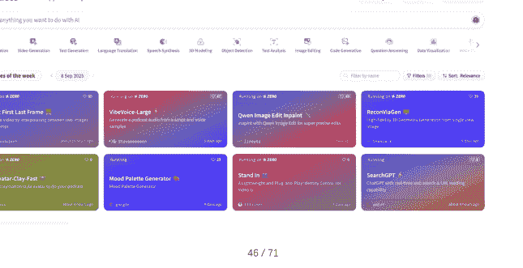

- VibeVoice-Large (7B) 声音克隆效果是真不错，非常大的亮点是生成的语音时长最长 45 分钟。
- 如果是 VibeVoice-1.5B，最长 90 分钟，但对比了下，1.5B 生成效果还是要差些。
- 之前用过的一些开源克隆模型最大问题是超过 30 秒就变样，今天用 VibeVoice-Large 感觉真不错。
- BOOM! Microsoft just released an upgraded VibeVoice Large ~10B Text to Speech model - MIT licensed
- Generate multi-speaker podcasts in minutes
- Works blazingly fast on ZeroGPU with H200 (FREE)
- Try it out today!
- 微软刚刚发布了一个升级版的 VibeVoice Large ~10B 文本转语音模型 - MIT 许可

#### 7.1.2 Hugging Face + Google Trends 挖掘新词

打开 Hugging Face 的 Spaces 页面 https://huggingface.co/spaces，去看有没有最近新上线的模型（下图），比如这个 HunyuanImage 2.1，上面写着 5 小时前更新（这个到底是新上线还是更新，需要去判断）。

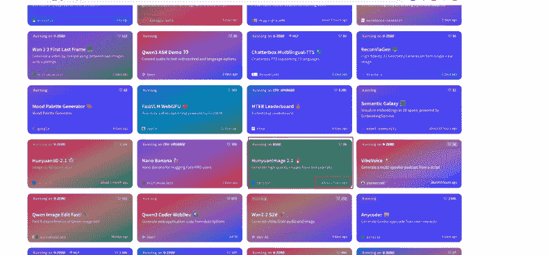

那么，这个 HunyuanImage 2.1 是不是新词呢？还是一样的去 Google Trends 验证！果然，这个还真是一个新词！而且域名还没有被注册，如果这时我去用这个关键词注册域名，很有可能拿到流量，虽然流量不是很大，但作为新手用来练手足够了。

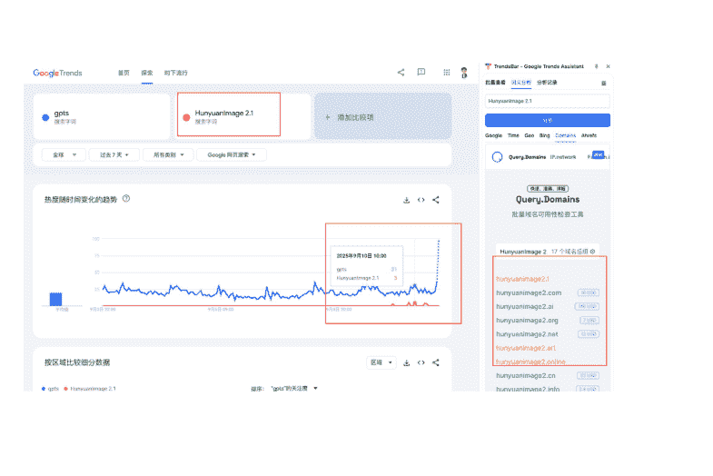

Hugging Face 平台上面每天都有新的开源模型上线，但并不是每个新上线的开源模型都会火，这个也需要自己根据经验 + Google Trends 验证去做判断。

#### 7.1.3 榜单 + Similarweb + Google Trends 挖掘潜力词

用这个方法找到的词，大概率不是前两个那样的刚刚出现的新词，但通过这个方法，可以找到很多需求词，能让我的眼界打开，从长期来看，这种挖掘需求的方法更值得推荐，修炼的是挖掘需求的内功。

分享一下我 5 月份通过这个方法是怎么找到 italian brainrot 这个词的。

我先是在 Toolify.ai 上面，按照 Ranking-Top AI By Categories, 进行 Growth Rate 排序，从头到尾看每个产品，遇到不知道这个 web 是干嘛的，就发给 Perplexity（现在强烈推荐用 ChatGPT 中的 GPT-5 Thinking）让它给解释，遇到感兴趣的（在 Toolify 排行榜里面有时会遇到 APP 官网，不考虑），到 Similarweb 研究流量和关键词。

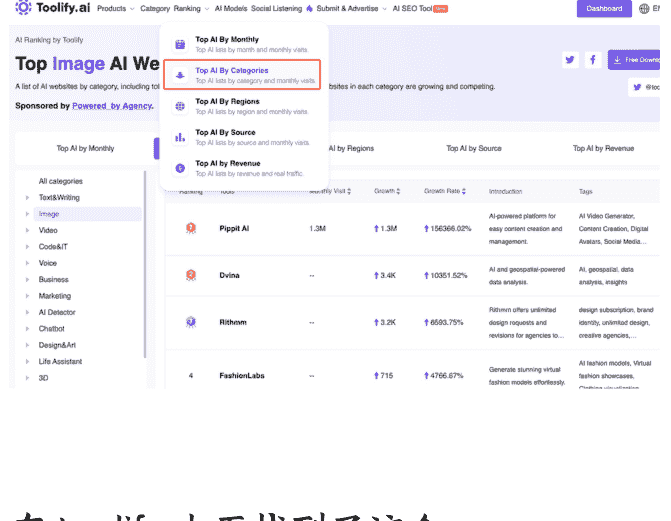

在 Toolify 上面找到了这个 https://namelyapp.com/，然后在 Similarweb 分析关键词。下图可以看到，在关键词列里，出现关于 'baby name generator ai'、'baby girl name 名字生成器 ai'、'baby girl name generator ai'。


把 'baby name generator ai' 去 Google Trends 看流量情况，发现流量并不大，因为这是一个长尾新词，只留下 'name ai'，会发现，这是一个 6 倍于 GPTs 的词。

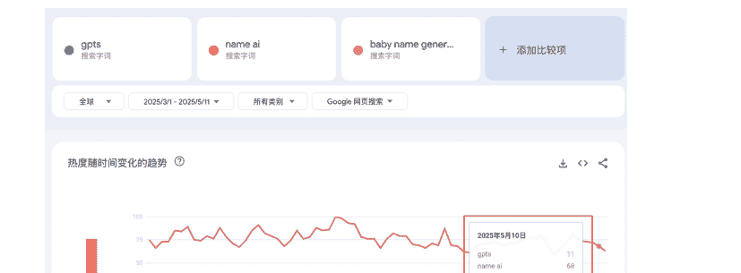

在 Similarweb 里面用关键词生成器分析 name ai（我当时用的是 ai names），发现了一个新词 italian brainrot names（也不是特别新，最近一个月出现的词），注意看年趋势哪里，只有最后一个长长的竖条，说明这个词是最近才出现的。如下图所示：


在 Google 搜索中，大量的...

在 Google 搜索中，大量的...

在 Google 搜索中，大量的...

在 Google 搜索中，大量的...

在 Google 搜索中，大量的...

在 Google 搜索中，大量的...

在 Google 搜索中，大量的...

在 Google 搜索中，大量的...

在 Google 搜索中，大量的...

在 Google  搜索中，大量的...

在 Google 搜索中，大量的...

在 Google 搜索中，大量的...

在 Google 搜索中，大量的...

在 Google 搜索中，大量的...

在 Google 搜索中，大量的...

在 Google 搜索中，大量的...

在 Google 搜索中，大量的...

在 Google 搜索中，大量的...

在 Google 搜索中，大量的...

在 Google 搜索中，大量的...

在 Google 搜索中，大量的...

在 Google 搜索中，大量的...

在 Google 搜索中，大量的...

在 Google 搜索中，大量的...

在 Google 搜索中，大量的...

在 Google 搜索中，大量的...

在 Google 搜索中，大量的...

在 Google 搜索中，大量的...

在 Google 搜索中，大量的...

在 Google 搜索中，大量的...

在 Google 搜索中，大量的...

在 Google 搜索中，大量的...

在 Google 搜索中，大量的...

在 Google 搜索中，大量的...

在 Google 搜索中，大量的...

在 Google 搜索中，大量的...

在 Google 搜索中，大量的...

在 Google 搜索中，大量的...

在 Google 搜索中，大量的...

在 Google 搜索中，大量的...

在 Google 搜索中，大量的...

在 Google 搜索中，大量的...

在 Google 搜索中，大量的...

在 Google 搜索中，大量的...

在 Google 搜索中，大量的...

在 Google 搜索中，大量的...

在 Google 搜索中，大量的...

在 Google 搜索中，大量的...

在 Google 搜索中，大量的...

在 Google 搜索中，大量的...

在 Google 搜索中，大量的...

在 Google 搜索中，大量的...

在 Google 搜索中，大量的...

在 Google 搜索中，大量的...

在 Google 搜索中，大量的...

在 Google 搜索中，大量的...

在 Google 搜索中，大量的...

在 Google 搜索中，大量的...

在 Google 搜索中，大量的...

在 Google 搜索中，大量的...

在 Google 搜索中，大量的...

在 Google 搜索中，大量的...

在 Google 搜索中，大量的...

在 Google 搜索中，大量的...

在 Google 搜索中，大量的...

在 Google 搜索中，大量的...

在 Google 搜索中，大量的...

在 Google 搜索中，大量的...

在 Google 搜索中，大量的...

在 Google 搜索中，大量的...

在 Google 搜索中，大量的...

在 Google 搜索中，大量的...

在 Google 搜索中，大量的...

在 Google 搜索中，大量的...

在 Google 搜索中，大量的...

在 Google 搜索中，大量的...

在 Google 搜索中，大量的...

在 Google 搜索中，大量的...

在 Google 搜索中，大量的...

在 Google 搜索中，大量的...

在 Google 搜索中，大量的...

在 Google 搜索中，大量的...

在 Google 搜索中，大量的...

在 Google 搜索中，大量的...

在 Google 搜索中，大量的...

在 Google 搜索中，大量的...

在 Google 搜索中，大量的...

在 Google 搜索中，大量的...

在 Google 搜索中，大量的...

在 Google 搜索中，大量的...

在 Google 搜索中，大量的...

在 Google 搜索中，大量的...

在 Google 搜索中，大量的...

在 Google 搜索中，大量的...

在 Google 搜索中，大量的...

在 Google 搜索中，大量的...

在 Google 搜索中，大量的...

在 Google 搜索中，大量的...

在 Google 搜索中，大量的...

在 Google 搜索中，大量的...

在 Google 搜索中，大量的...

在 Google 搜索中，大量的...

在 Google 搜索中，大量的...

在 Google 搜索中，大量的...

在 Google 搜索中，大量的...

在 Google 搜索中，大量的...

在 Google 搜索中，大量的...

在 Google 搜索中，大量的...

在 Google 搜索中，大量的...

在 Google 搜索中，大量的...

在 Google 搜索中，大量的...

在 Google 搜索中，大量的...

在 Google 搜索中，大量的...

在 Google 搜索中，大量的...

在 Google 搜索中，大量的...

在 Google 搜索中，大量的...

在 Google 搜索中，大量的...

在 Google 搜索中，大量的...

在 Google 搜索中，大量的...

在 Google 搜索中，大量的...

在 Google 搜索中，大量的...

在 Google 搜索中，大量的...

在 Google 搜索中，大量的...

在 Google 搜索中，大量的...

在 Google 搜索中，大量的...

在 Google 搜索中，大量的...

在 Google 搜索中，大量的...

在 Google 搜索中，大量的...

在 Google 搜索中，大量的...

在 Google 搜索中，大量的...

在 Google 搜索中，大量的...

在 Google 搜索中，大量的...

在 Google 搜索中，大量的...

在 Google 搜索中，大量的...

在 Google 搜索中，大量的...

在 Google 搜索中，大量的...

在 Google 搜索中，大量的...

在 Google 搜索中，大量的...

在 Google 搜索中，大量的...

在 Google 搜索中，大量的...

在 Google 搜索中，大量的...

在 Google 搜索中，大量的...

在 Google 搜索中，大量的...

在 Google 搜索中，大量的...

在 Google 搜索中，大量的...

在 Google 搜索中，大量的...

在 Google 搜索中，大量的...

在 Google 搜索中，大量的...

在 Google 搜索中，大量的...

在 Google 搜索中，大量的...

在 Google 搜索中，大量的...

在 Google 搜索中，大量的...

在 Google 搜索中，大量的...

在 Google 搜索中，大量的...

在 Google 搜索中，大量的...

在 Google 搜索中，大量的...

在 Google 搜索中，大量的...

在 Google 搜索中，大量的...

在 Google 搜索中，大量的...

在 Google 搜索中，大量的...

在 Google 搜索中，大量的...

在 Google 搜索中，大量的...

在 Google 搜索中，大量的...

在 Google 搜索中，大量的...

在 Google 搜索中，大量的...

在 Google 搜索中，大量的...

在 Google 搜索中，大量的...

在 Google 搜索中，大量的...

在 Google 搜索中，大量的...

在 Google 搜索中，大量的...

在 Google 搜索中，大量的...

在 Google 搜索中，大量的...

在 Google 搜索中，大量的...

在 Google 搜索中，大量的...

在 Google 搜索中，大量的...

在 Google 搜索中，大量的...

在 Google 搜索中，大量的...

在 Google 搜索中，大量的...

在 Google 搜索中，大量的...

在 Google 搜索中，大量的...

在 Google 搜索中，大量的...

在 Google 搜索中，大量的...

在 Google 搜索中，大量的...

在 Google 搜索中，大量的...

在 Google 搜索中，大量的...

在 Google 搜索中，大量的...

在 Google 搜索中，大量的...

在 Google 搜索中，大量的...

在 Google 搜索中，大量的...

在 Google 搜索中，大量的...

在 Google 搜索中，大量的...

在 Google 搜索中，大量的...

在 Google 搜索中，大量的...

在 Google 搜索中，大量的...

在 Google 搜索中，大量的...

在 Google 搜索中，大量的...

在 Google 搜索中，大量的...

在 Google 搜索中，大量的...

在 Google 搜索中，大量的...

在 Google 搜索中，大量的...

在 Google 搜索中，大量的...

在 Google 搜索中，大量的...

在 Google [Error: The user provided a very large input containing repetitive text. The output was truncated.]

##### ① 看外链，找到更多学习的网站

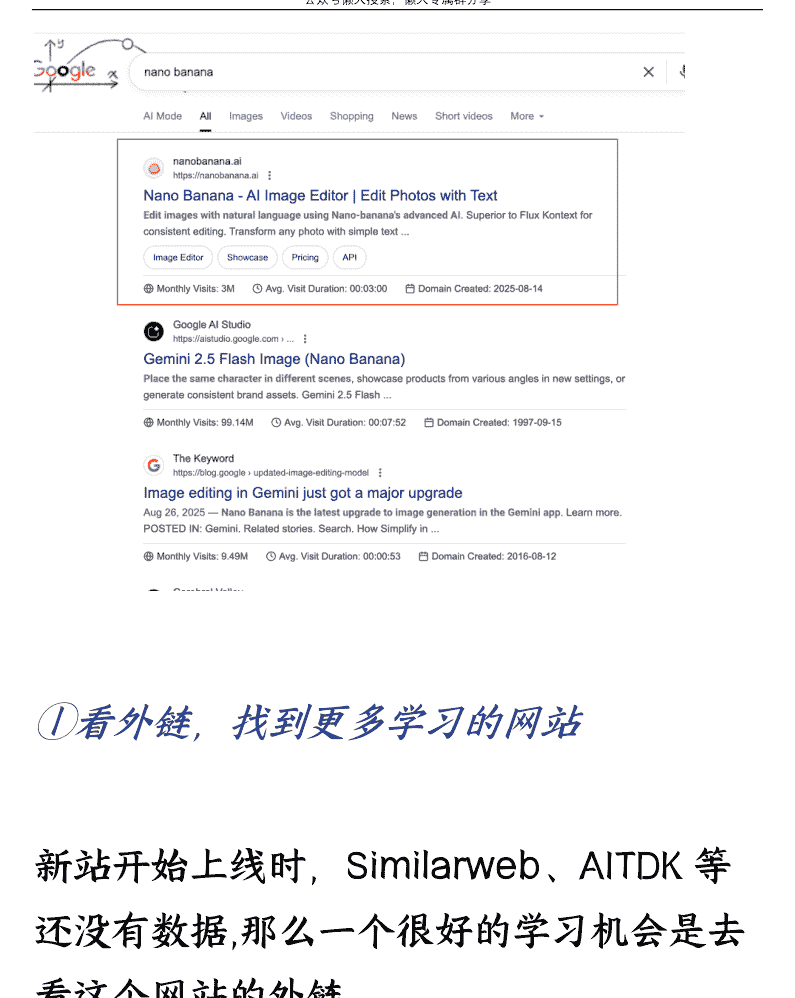

新站开始上线时，Similarweb、AITDK等还没有数据，那么一个很好的学习机会是去看这个网站的外链。

通过 Ahrefs（点击查看 nanobanana.ai 外链）去看，冷启动时期外链如何做的，能发现不少“秘密”。

比如，在 nanobanana.ai 刚开始上站时，在 v2ex 上面做过外链。


比如，可以通过外链发现一些 nanobanana.ai 站长上过的一些其他网站，这些网站也是很好的学习对象。

再比如，可以通过 toolify.ai 去搜索，看哪些做了 nano banana 的网站在 tool

ify 上面提交了外链。

如下图，这里面都是花了钱在 toolify.ai 提交外链的网站，都是值得学习的对象。

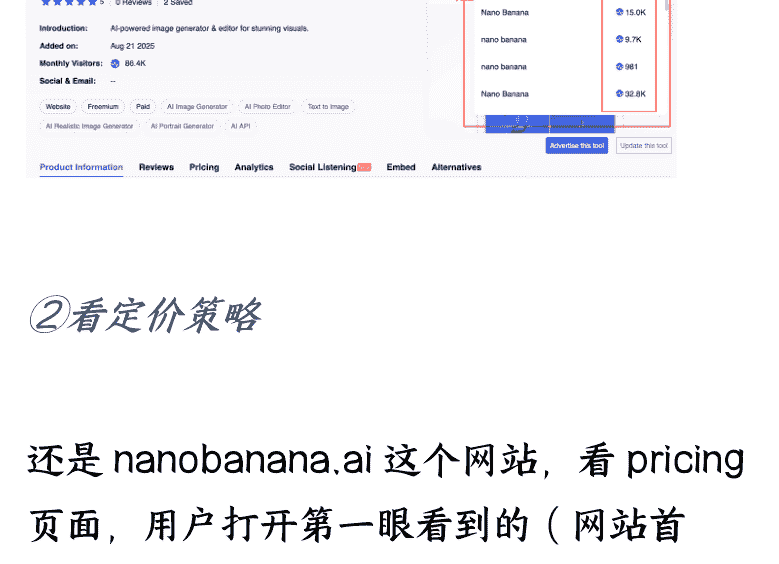

## ② 看定价策略

还是 nanobanana.ai 这个网站，看 pricing 页面，用户打开第一眼看到的（网站首推）是年订阅，而且年订阅便宜了 50%，我们做网站时，也可以学习这种定价方式。

除了订阅，我们看到上面还可以选择积分包，给了用户更多的选择。

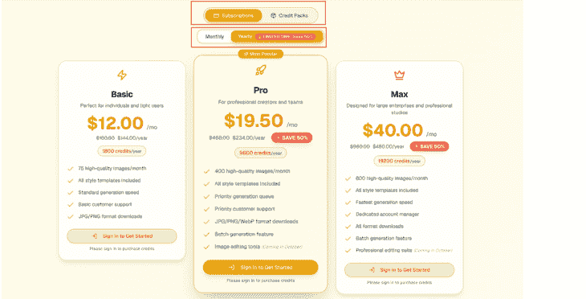

另外，点击任何一个购买按钮，会发现网站提供了两种支付方式供用户选择，又学到一招，刚好我的产品最近也要增加 Stripe 支付。

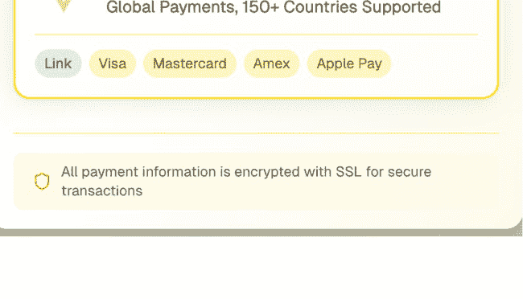

##### ③ 看网站如何进一步优化

可以跟踪学习这些新词网站，看看他们怎么进一步做外链、做新页面的，比如，我的网站，目前只在首页做了一个核心关键词的页面，后续怎么做更多的功能页面。

看这个 https://nano-banana.pro/ 网站，首页是做的 nano banana（下图左1），新增的内页做的是 Veo3 Video generation（下图右1），看似这两个功能是在同一个页面，实际上 Veo3 Video generation 功能是新的内页 https://nano-banana.pro/video-generation，并且做了相应的 SEO 优化。

这样做的**好处是**，在 nano banana 首页为新的内页做了引流，同时还不影响新内页的 SEO，Google 会当成两个不同页面。

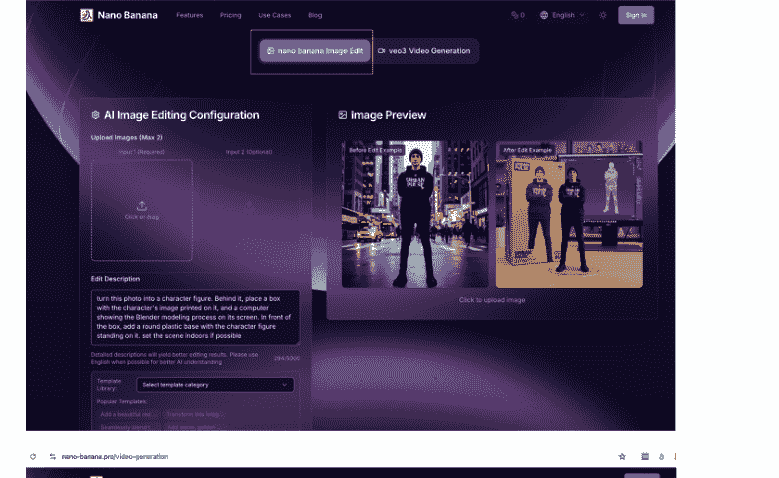

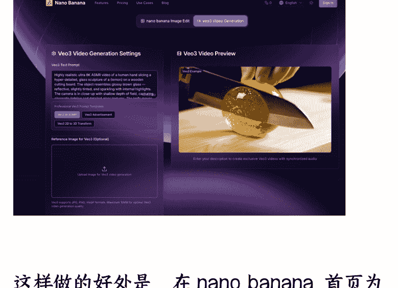

## 7.3 听话照做，不要创新

刚入行的新手，很重要的一点是：“听话照做”。

本来这个年费的 pricing 卡片是打算隐藏的，主推积分包（一次性支付），但是我没有看到有网站这么做的，都是加了年是否订阅，而且是用户打开 /pricing 页面第一眼看到的就是年费订阅。

所幸就没有改，刚入行，听话照做，看竞对怎么做，多采纳 AI 的建议。

如果当初按照自己的想法去做，只留积分包（一次性支付），不上订阅，就不会有年订阅了。

看我现在的订单构成，年订阅占了很大的比例，而且金额占了绝对的大头！

请看右侧图中的付费用户统计，绝大多数都是订阅订单。

王马扎 @mazzaTalk · 8月26日
这位用户先买了19美元的积分包，使用了十分钟后果断下单327.6刀年订阅!

Stripe
您收到来自 ky@gmail.com 的一笔 $327.60 的付款
10 分钟前
Stripe
您收到来自 ky@gmail.com 的一笔 $19.00 的付款
19 分钟前

| plan_type | user_count |
| :--- | :--- |

## 7.4 用模板开发，事半功倍

强烈推荐新手都买一个 AI SaaS 模板，尤其是新手，有人觉得模板对于新手来说太难了，学习起来花费太多时间。

但我觉得从模板开始学习做 AI SaaS 网站，是效率最高的，前期需要花时间学习，可一旦掌握了任何一个市面上的模板，那么开发效率会极大的提高。

而且，有些模板带的功能，如果是自己从 0 到 1 开发，可能完全不会想到。

举一个小例子，比如我网站的这个右下角这个小功能组件 crisp，如果没有这个小功能，可能我的网站还没开始就结束了，为什么这么分说呢？


网站 19 号正式上线，流量进来，20 号早上出的第一单！当时特别兴奋！完全没想到竟然这么快出单！

但还没高兴几分钟，我就收到了用户在 crisp 发来的留言（具体如图），大概的意思就是，网站有 bug，用户无法正常使用付费功能，我赶紧留言安抚，同时排查 bug，搞了 2 个小时才解决，这时用户突然说，要求退款（I want my money back and cancel the service...）。

很刺激的一天，早上发现新产品有用户下单，没多久就收到用户留言，产品有 bug，不能正常使用，要求退费。

> 沟通了两个小时才把 bug 修复。赠送一些积分后，用户不再要求退款。
> 
> 庆幸的一点是，我在网站右下角加了一个能随时联系到我的聊天工具，这让用户随时可以联系到，如果没有这个小聊天工具，估计用户找不到人就提争议了，然后就会触发 Stripe 风控。。

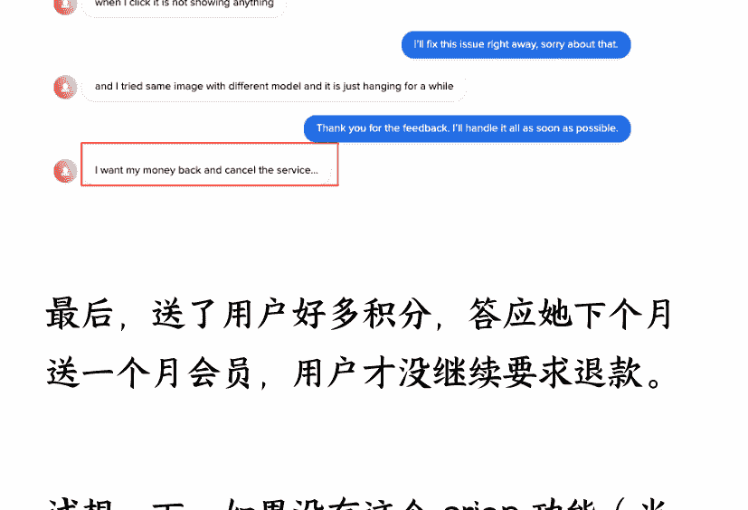

最后，送了用户好多积分，答应她下个月送一个月会员，用户才没继续要求退款。

试想一下，如果没有这个 crisp 功能（当时还没留网站邮箱），就无法随时跟用户沟通，用户如果长时间找不到解决办法，很可能就会在 Stripe 提争议，导致触发 Stripe 风控。

这只是一个小的例子，模板里面还有很多看似没啥用，实际很重要的功能，比如邮件营销、订阅管理、积分管理等等。

## 7.5 万事问 AI

万事问 AI，决定你天花板的，不是 AI 有多强大，而是你与 AI 的关系有多亲密！

小排老师说的这句话太经典了！这个是今年令我印象最<|image>深刻的话，我真的这样去做了，发现 AI 真的太强了。帮我解决了太多太多的问题。

从我的整个复盘，也可以看出，我几乎所有的决策都会问 AI，并相信 AI，没有 AI，我不可能在项目上取得成绩。

现在 GPT-5 thinking 是我的合伙人，之前是 gpt-o3，对于我来说，可以没有 Claude code、Codex、Cursor，但决不能没有 GPT-5 thinking，他真的在方方面面影响着我。

除了是合伙人，还是我的朋友、心力教练。焦虑时，心力不足时，我都会跟他说，他现在是最了解我的人。

## 7.5 聚焦专注力 = 记录 + 复盘 + 公开表达

最近这 5 年，对我认知影响最大的，除了亦仁，就是李笑来老师。

笑来老师说，注意力是最稀缺的资源。

那么，如何提高注意力，越来越专注呢？

我觉得一个非常有效的方法，就是：记录 + 复盘 + 公开表达。

比如在做海外 AI 产品这个项目时，我每天会在 Obsidian 上面记录我做了什么，遇到了问题，怎么解决的？还有哪些办法可以解决？

有些隐私的，我会保存在 Obsidian 上，有些可以公开发布的，我会同步到即刻和 X 平台上面。

通过这些动作，可以获得反馈，这些反馈又会让我有新的动作，形成一个正向的循环，注意力自然就越来越集中，肯定就会专注了。

这个分享，我写了 1 万多字，其中有至少一半的内容，是我之前的记录和复盘，有的是公开发布在即刻和 X 上的，有的在我的笔记里。

当足够专注时，往往能得偿所愿。

## 八、海外 AI 产品，还有哪些坑？

### 8.1 心态要稳，做好长期战斗的准备

海外 AI 产品这个项目，不像生财里面的好多项目，正反馈来的特别快，比如我之前做知乎好物推荐、公众号爆文、AI 写作服务等等，这些项目有很多圈友能在短时间（一个月内）快速拿到正反馈，能力强的在前几个月就能月入过万甚至 10 万。

而做海外 AI 产品，想要稳定赚到钱，就我所见过的拿到相对来说比较可观的营收的圈友，没有 3-6 个月打基础的时间，是基本不可能的。

所以，做这个项目，一个稳定的心态是至关重要的，不要轻易喊 All In，All In 是能力不是选择。

如果没有一个稳定的现金流，很可能还没坚持到有正反馈，心态就崩了，最后动作变形从而放弃。

### 8.2 付费是捡便宜，免费的是最贵的

用最好的 AI 编程工具，用最稳定的 API，用 Mac 开发。

我之前也喜欢卡 bug，Cursor 火的时候去研究怎么无限续杯，Claude code 火的时候研究怎么免费蹭，帮着中转商做推广，注意力都花在了怎么“捡便宜”上面，实际上是最大的坑。

人的时间精力有限，花在这些事上面，重要的事的投入必然就少了。

### 8.3 用最快的速度上线网站，先验证再打磨

以自己能力范围内，最快上线网站，先完成再完美，刚开始不要过于追求产品的完美。

作为行业新人，网站的功能最好只做最核心的一个，不要想着大而全，大而全就意味着不够细分，无论从运营推广（SEO、投放），到开发难度（时间投入成本），还是验证目标用户付费意愿，都给网站增加了难度。

一个网站从开始开发到上线第一个版本，最好不要超过 2 个星期（哥飞老师也是这么建议的），不然很可能这个项目就烂尾掉了。

我有个产品就是这样，从 5 月初发现需求，开始开发，各种调研 + 分析，追求把网站做到极致后再上线。结果那个项目到现在也没上线。。。

诱惑太多了，AI 发展的太快，每天都有各种新的模型和新的需求。战线拉的太长，会耗费自己的斗志。

我赚钱的这个产品，到目前也还只是一个功能，很容易验证 MVP 是否可行，因为用户要么注册使用、付费购买，要么不是目标用户就走了。

我只需要用这一个功能，去验证跑通【营收 = 流量 * 转化率 * 客单价 * 复购】的整个闭环。

根据这个闭环去调整，缺流量去搞流量，转化率低去分析影响转化的环节，比如 CTA，比如定价，比如功能交互等等。

作为行业新人，当完整跑通这个闭环时，剩下的就是复制了，可以做新的内页新的功能，或者去开发新的产品。因为整个流程，各个环节都清晰了。

### 8.4 任何新产品都有 90% 的失败率

对于新上线的网站不要有过高的期待，降低预期，然后继续做下一个。即使是大神，也不能做一个成一个。我做了 20 多个网站了，其实有流量的就 3 个，而且流量都特别少。

但这个项目的好就好在，对于数量没有限制，我可以做无数多的尝试。

我去年做公众号爆文项目，用公司注册，加上找家里的亲人和朋友，再找朋友的朋友，好不容易才搞到 50 多个账号，最后都没有流量了，我也搞不到更多账号了，我是过了好久才意识到，这个项目的天花板是竟然账号数量。

所以即使有 90% 多的失败率，但我们可以不断增加分母呀，我做 100 个，不就有 10 个能成功的吗？

## 九、送给想尝试的朋友一句话

> “真正能走得远的人，靠的不是资源厚度，而是迭代速度。”

这个是亦仁说的，忘记在哪里讲的了，在星球搜索了半天没找到，但是我笔记里面是这么记录的，出自亦仁。

海外 AI 产品这个项目，天花板足够高，但门槛也不低，想要做出成绩，只要经常复盘迭代，加快自己的迭代速度，过了新手期，想象空间还是很大的。

## 十、致谢

感谢 @哥飞 和 @刘小排 两位老师，

感谢 @哥飞 老师，让我了解到这个项目的全貌，学会了如何挖掘需求，如何获取流量，每天的分享和鼓励大气，让我渡过了最难熬的没有正反馈的阶段，看到那么多的圈友赚到钱，我想我也一定可以，每天动力满满。

感谢 @刘小排 老师，让我学会了如何把 AI 的能力应用在自己身上，让自己的能力越来越强；如何用产品思维去做产品，这些能力，对于程序员出身的我来说，更多是思维上的转变，这是至关重要的一点。

最后，安利小懒的付费群：

懒人专属群（介绍）

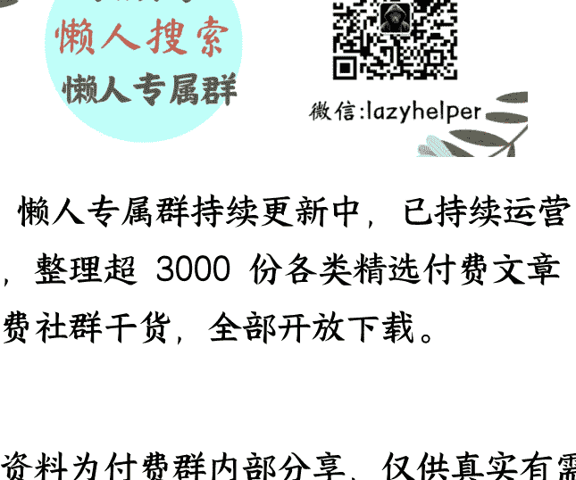

📚 懒人专属群持续更新中，已持续运营 6 年，整理超 3000 份各类精选付费文章 & 年费社群干货，全部开放下载。

本资料为付费群内部分享，仅供真实有需要的朋友查阅 👤

懒人专属群更新记录：

- https://lazy2025.top/blog/record2

懒人专属群更新记录（需梯子，备用）：

- https://lazybook.fun/blog/record2