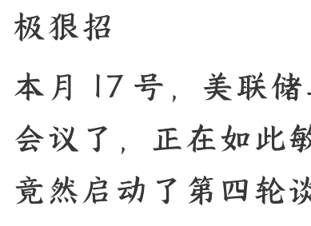
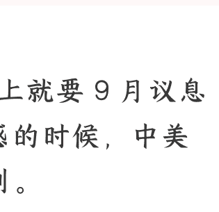

# 当中美谈判，遇到美联储降息，有什么隐情？

250916 A 视野
整理：公众号懒人搜索，
懒人专属群独享
懒人微信：lazyhelper

## 极狠招

本月 17 号，美联储马上就要 9 月议息会议了，正在如此敏感的时候，中美竟然启动了第四轮谈判。

关键是，这次谈判时间是从 9 月 14 日到 17 日。

两个如此重大的风险事件，竟然放在一起“玩”，此中微妙，不言而喻。

很巧的是，2024 年 9 月 19 日，美联储突然宣布降息，当天拜登就有一个使团专门来中国这里谈判。

一直谈到当时的 9 月 22 日，然后，9 月 24 日，中国就宣布一大波全面救市。

这次，川普比去年的拜登更“急”，选择降息之前，要跟中国先谈判，这到底是为什么？

这次如果美联储真的恢复降息，还会有 2025 年版本的“924 行情”吗？这些问题将直接影响我们接下去的投资回报率，更是属于市场重大拐点。

***

以下内容为付费阅读，各位多多支持！

美联储虽然一直说自己的降息，都是以国内经济的情况为锚。实际上，当然不会如此。

美联储从来都是按照全球形势，来判断自己的降息决策。

那么，我们快速回顾一下，去年美联储降息的时候，为何要同一天派团队来中国谈判？

很简单，美联储放水，是需要全球最大的贸易强国去配合的。

如果没有最大的贸易强国配合，大量的放水，就会滞留美国本土。

其直接的结果，就是美国本土物价涨翻天，可是，却无法去收割其它国家的红利。最为致命的是，美元潮涨潮汐的功能就废了。

正常的美元收割套路是，一波强美元，虹吸全球流动性，直接拉爆其它国家的资产和产能；再一波弱美元放水，大量美元从美国本土流出，去用白菜价抄底其它国家的核心资产和产能。如此往复，这才是美元霸权的核心收割路子。

尤其是弱美元周期，最完美的闭环是，美国放水流入最强制造业和贸易经济体，后者再用这些美元回流美债市场，美国人就可以坐享其成。

可是，在本轮中美金融战中，中国处处提防、步步为营。

强美元没能收割中国成功，美国也没有什么白菜价收割中国核心资产和产能的机会。

与此同时，一旦弱美元了，中国拿到流入的美元，也无法确保中国愿意去买美国的国债。

因此，这里是两个“缺口”，美元霸权不再具有霸权，也就无法享受全球红利好处。

那么，2024 年美联储宣布降息后，拜登的人来华，就是想要交换条件，确保中国拿到美元后，愿意买入美国的国债。

有了这样的定心丸，中国央妈不再担心大量资金外流和人民币回流承压，这才马上宣布“924 行情”。

也就是说，拜登做出了巨大的妥协：一方面，同意美元流入中国市场；一方面，也鼓励中国购买美债。但是，此后川普 2.0 后，这货上来牛逼到爆。

那么，2024 年拜登承诺的东西，等于全部作废。

所以，我们看到，2024 年中国央妈承诺的降息，至今没有落地。

因为，我们的央妈又开始担心资金外流和汇率承压，又开始以博弈的姿态处理问题。其实，现如今，川普兜兜转转，又遇到了当初拜登的同样困惑。

只有中国配合，美联储才可以安心放水，而不至于产生极为严重的后遗症。

然而，经历了前面三次中美贸易会谈，没有一次可以好好谈。川普心里不踏实啊，自然要抢在美联储降息前夜，先跟中国的团队谈一把。

既要中国购买更多的美国商品，还要中国买美债，他们也会适度同意美元回流中国市场。这就等于直接印证了有形之手一直说的话：和则两利。

但是，事情并没有这么简单。

今天的中国也要价极高，凭什么就这么容易妥协呢？！

其实，对于中国央妈而言，现在放水的时间节点，有点鸡肋。因为，整个体制，都在做十四五规划的收尾和 KPI 考核。

新的 5 年规划还没有出来，到底后面这跟活怎么干，内部都还不清楚。

这天然注定，中美之间的任何“谈妥”，不过是临时的，不确定性的，充满风险的。

况且，在 Deepseek 出现、9.3 大秀肌肉、稀土卡脖子成功等一大堆交锋中，中国已经具有了跟美国分庭抗礼的能力。

既然大家都是从实力地位出发，那么，中国央妈何时刺激、是否要买美债，那就不会像 2024 年那样容易谈成了。

况且，现在就算内需是承压，可是，出口还在很稳健的状态。

按照全年 5% 的 GDP 目标，下半年只要达成 4.7% 的增长即可，不要很激进。在此背景下，A 森预计：9 月份美联储如果真的降息，中国跟进的力度会非常弱，起码明显弱于 2024 年的“924 行情”。

对于美联储而言，今年余下来的时间，不会像 2024 年 9.19 降息后那样疯狂降低基准利率。对于中国而言，还不如等 10 月底附近的十五五规划明朗了，再渐进式的放大招。

所以，两边今年余下来的时间，都不会很激进，反而很有默契的都是温和。

那么，这个情况就跟 2024 年的剧本，完完全全不同了。

***

其实，从川普的角度，现在到底能谈成什么样，他是两手准备的。如果可以跟中国谈的不错，那是最好。

如果不能跟中国谈得很好，那么，就把跟中国的关键谈判放在明年上半年再说。之所以如此，那是因为，明年 11 月份中期选举。

跟中国的任何谈判合作的红利，最好是贴着中期选举的窗口期呈现出来。这次，MAGA 青年总指挥查理柯克挂了。

可以这么说，对于川普明年的中期选举，是极为沉重的打击。

一下子，MAGA 明年在国会两院抢多数席位，变得扑朔迷离了。

既然如此，那把政策红利聚集在明年中期选举前体现出来，也是为数不多的好办法了。这也提示我们，明年全年，美联储的降息会非常激进。

此外，明年中美更容易有机会达成一些大买卖。

正所谓“攘外必先安内”{[2](F2_endnote)}, 逻辑就是这么简单粗暴。

**所以**，本次美联储如果 9 月份真的降息，我们对这个外部红利的预期，不要太高。反而，要适度降低预期。

“此外，我们村里的“配合度”也不会高，它更愿意放在十五五规划后再说。”

***

于是，大 A 近期或许继续震荡往上，
可是，也依旧是温和，很难出现“924 行情”那种躁动了。

从这次已经披露的中美第四次贸易谈判的一些内容来看，我们已经可以归纳出来主旋律了：谈而不妥反正，双方都是很“认真”的谈，但是，很难有实质性的突破。

两边在自己的内部，都有极为严峻的挑战，根本没有多少余地可以退让。

同样，两边都拿不出多少筹码可以去交换，都已经到了彼此的红线了。

这种谈判，更像是一种“避免冲突升级”的演戏。

只是对内有有个交代，也是对大资本的一种安抚，仅此而已。实质性的内容，不会有，也很难有。

毕竟，当中国都开始放弃韬光养晦，也就说明两边的关系再也回不去了。

其实，就我们在做调研的时候，会有一些发现。

就是不少外资是愿意进入中国市场的，而且欲望很强最高的性价比、被严重低估的汇率、全球最牛的产能，完全符合外国大资本的关键诉求。眼下，不少华尔街一直尝试说服白宫给自己绿灯。

另外，今年上半年，外资购买我们的内债，规模已经减少了 3000 多亿人民币。大部分的这些资金，都去了我们的股市，大 A 和大 H 皆有。

可是，他们的心态，是很纠结的：此前，担心我们这里出事，现在已经论证了中国经济的韧性十足。

然后，又担心我们没有足够的军武自保，9.3 之后也没有这个担心了。

接着，他们想要做空我们来抄底，又被 8 月底至今的主力表现破功了。

不过，这里需要指出，这次就算有一些美元资金流入，主要是两部分力量。

- 我们自己的外汇外挂，回流。
- 做全球资产风险对冲的大资金进入，而不是完全看好我们。这方面，我们还要感谢川普。

近期，他竟然允许以色列就这么莫名其妙空袭 1000 公里外的卡塔尔。

卡塔尔有美军基地，有爱国者导弹，是美国在中东的重要盟友。

连这些 buff 叠加，还要莫名其妙被狂轰滥炸。

要增量资金，依旧是来自内部，跟外资的关联度不高。

此外，主力也不希望现在大 A 过热。
他们希望，大 A 在慢牛和长牛的轨道，继续慢慢来，这就可以了。

一直拖，拖到本轮金融博弈关系中，中国不许有担心资金外流和人民币承压，再画上句号。

这天然意味着，我们的震荡行情，仍要延续一段时间，难以避免了。

不过，这里，A 森有一个担忧。

美联储是在近乎被刀架住脖子的前提下，才愿意降息，背后是两党恶斗，这后面的后遗症很疯狂的。

试想，这么一个处境。

对外割不到钱，对内抽不到水，还要天天担惊受怕中缠斗。如果是你，你会怎么干？很明显，“赢学”开道，实际摆烂，不管身后事，但求大权不旁落。

中国处处顶着，民主党也是处处顶着，川普实际可以回旋的余地，已经不多。此时逼美联储放水，不过是，用货币幻觉，去掩盖所有的不堪。

真的降息开始，大量资金从美国本土流出，如何做到美债融资没有问题的同时，美股还是稳稳的？

很难不保美债，国家根基出事。

不保美股，大量既得利益跟你搏命。

但是，钱又要流出去，却无法确保回流的资金会支持美债和美股。

一个不再闭环的美元体系，就成了最为危险的、带着缺口的“堰塞湖”。

这个堰塞湖的容量，将是有最短板决定，随时有可能出现海量资金流出，去袭击全球。在保美债、保美股、降低融资成本的三角关系中，美联储已经很难兼顾。

另外，美国人还有一个担心。

当海量美元流入全球各地，中国很容易利用手里掌握的全球贸易体系各种管道，就快速拿到大量美元流动性。

那，中国会如何利用这些美元？

如果中国人不去买美债和美股，反而是拿着海量美元，疯狂抢夺其它国家的核心资源，美国后面还如何升级制造业？还如何收割全球？

真到了这一步，就变成美国坑害了美国自己。

一个不能将自己与全球核心资产深度捆绑的美元体系，也就不再是霸权。

其直接的结果是，后续美国的收入会断崖式发展，进而让美国的长期债务负担保持在高位运行。

反观中国，则不断的在海外收割各国核心资产，倒是更加容易做大做强。这是目前美国人最为忧虑的事情，可是，时间方面，已经拖不得。

再延迟降息，怕是美元体系会因为过高的融资成本直接出问题了。对于中国，现在就是等，静静的等。

可以说，这就是阳谋！

真正的顶级高手之间，从来都是阳谋，没有那么多阴谋。我们熬都熬到这跟份上了。

只要美国人被逼大规模放水，我们这里就拼命盛水。

然后，人民币回流开始升值，人民币核心资产开始涨价，偏通缩幻觉逐步走出，国民经济的良性循环就回来了。

目前来看，这个启动节点，极有可能是今年年底到明年上旬的这个窗口期。因此，现在不要随意出售自己的核心资产，不要倒在黎明前而在此之前，国内核心城市的楼市，还有一波往下俯冲，然后，才有机会逐步完成筑底。

***

最后，安利小懒的付费群：

懒人专属群 <u style='text-decoration-color: blue;'>（介绍）</u>

📚 懒人专属群持续更新中，已持续运营 6 年，整理超 3000 份各类精选付费文章 & 年费社群干货，全部开放下载。

本资料为付费群内部分享，仅供真实有需要的朋友查阅 🗝️

懒人专属群更新记录：
https://lazy2025.top/blog/record2

懒人专属群更新记录（需梯子，备用）：
https://lazybook.fun/blog/record2