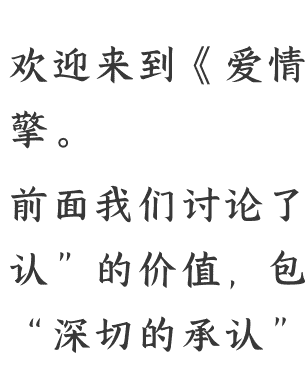
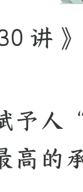
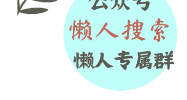

# 12 自我超越：为什么说爱情像“最小型的共产主义”？

250916

公众号懒人搜索，懒人专属群独享

懒人微信：lazyhelper

微信:lazyhelper

欢迎来到《爱情哲学30讲》，我是刘擎。

前面我们讨论了爱情赋予人“被承认”的价值，包括“最高的承认”与“深切的承认”。

这一讲，我们来探讨爱情的另一层价值，就是人们常说的“爱情让人成长，成为更好的自己”。这种观点可以被称为“爱情成长论”，听上去鼓舞人心，也挺有吸引力，但仔细想想又觉得像心灵鸡汤。爱情如何让人成长呢？难道爱情像一个学校或健身房，我们经过学习和训练就能变得更聪明、更健硕了吗？

对“爱情成长论”可能有许多不同的理解，这一讲，我想和你分享一种特别的阐释：爱情让人成长的最高境界是自我超越。

## 被遗忘的超越性价值

生命实践的“超越性”，是爱情的一种重要而独特的价值，而在当今流行的文化中，它却被淹没和遗忘了。为什么这么说呢？

我们先来听几种流行的爱情格言：
- 比如，人首先要自爱，你只有成为足够优秀的人，才会吸引到优秀的伴侣；
- 或者，选择比努力更重要，爱情的秘诀是找到那个“对的人”，否则一切都是徒劳；
- 还有，只有通过不断的利益博弈，才能维持爱情。

类似的说辞还有很多，比如“不要期望改变对方”“要取悦自己，不要在爱情中迎合对方”等等。

这类说辞貌似有用，但根本上是误导性的，因为它们的前提都包含着错误的认知——既误解了自我，也误解了爱情。

首先是误解了什么是自我。

这套说辞错误地将自我当作一个本质不变的实体，就是把人当成了“物”。但人的生命不是物，而是一种“时间性的存在”或者“过程性存在”。我们的渴望和目标，都不是预先确立的，也不是被决定的，而是在关系和经历中一次次被塑造和重构，是不断发展的。因此，“存在就是成为”，每个人都是如此。

其次，这套说辞也误解了什么是爱情。

它不仅将爱情的本质，误以为是两个各自完整的个体在做取舍选择之后的结合，还将爱情关系简化为你和我的二元对立关系。但我们前面讲过，爱情的本质特征是共同创生与生长，双方会在“你、我和我们”三元关系中，再次面对“我是谁”以及“我想成为谁”的问题，并在爱情实践中不断回应这个问题。

因此，“爱情让人成长”最深层的意思，并不是说爱情是自我发展的工具，而是相爱的两个人创生的一个微小而独有的伦理世界，并在其中一起走向成长的最高境界——“自我超越”。而这个伦理世界，可以被比作“最小的共产主义”。

## 什么是“小型共产主义”

“最小的共产主义”，这个精彩的比喻，来自当代法国哲学家巴迪欧，他有一本专门探讨爱的对话录，叫做《爱的多重奏》。在巴迪欧看来，爱情是两个个体相遇，共同创造出一种新主体的“我们”。更重要的是，这个“我们”不只是我与你之间的外在关系，而是内在于两个个体的自我理解，也就是说“我们”就是自己的一部分，对双方都是如此。还记得第二讲我们对“爱情的定义”吗？这与巴迪欧的看法完全一致。

巴迪欧用“小型共产主义”这一类比，深刻把握了爱情中最奇妙和动人的特征，那就是他所说的：“爱，是一种超越，超越那看似不可能的事物。某种貌似没有理由存在、并且没有任何出现可能性的东西，竟然存在。”

这句话是什么意思？这种“超越性”具体体现在哪里？我将按照自己的理解，从两个层面做出进一步阐释。

## 首先是个体关系的超越性。

爱情突破了个体的边界，创造了一个融合共生的“我们”，这不仅仅是一种关系，而且是一个新的共同世界。相爱的双方，作为具有差异的个体并不会消失，但在爱情中，他们超越了原本独立的存在，进入了“我们”的世界。

主导这个世界的伦理原则，是平等的尊重、关怀与奉献，也就是爱。从微不足道的小事，比如旅途中谦让最后一点饮用水；到人生大事，比如异地恋伴侣为了生活在一起，自愿调动工作，放弃了个人可能更有前景的职业生涯。这些行动，已经超越了个人立场的“需求与满足”，也就是超越了利益交换的功利原则。

但这并不是说，在爱情的世界里就不再会有个人的利益计算，而是说，所有这些权衡计算，都会在“我们”的视角中被重新认识、评估和安置。在这个新的视角中，权衡和决策所依据的规范原则，不再是个体追求自身利益的最大化，而是服从于近似共产主义的爱的伦理原则。

这就是爱情的“超越性”在个体关系上的体现。

## 第二是自我成长的超越性。

在理想的爱情中，自我能够超越狭隘的自利，在互助与利他的行动中，达到无私奉献和牺牲的境界。这种利他实践，在利益计算的框架中当然是付出或损失，但在爱的伦理框架里，却可以是收获，收获了“我们”的幸福。

同时，这也是真正自爱的方式。为什么呢？因为它成就了一个更好的自我，一个在爱情之外“不可能存在的自己”，这是对自我的超越。在马斯洛的“需求层次理论”中最高层次的需求原本是“自我实现”，但他在晚年修改了自己的理论，认为自我超越是在“自我实现”之上的最高境界。它不只是说一个人实现了预定的渴望、目标、能力和境界，更是一种成长的进程、一种“不断的自我更新”。这是一个开放的、无尽的生命历程，是真正意义上的生生不息！

## 实例与分析

听到这里，你可能觉得这些论述有点太抽象、也太过理想化了。它们在现实的爱情中，具体表现为什么呢？我来讲个故事给你解释。

有一对生活贫寒的年轻夫妇，想要在圣诞节悄悄给对方赠送礼物。丈夫有一块祖传的金表，这是他仅有的值钱之物，他把金表变卖了，为妻子买了一套精美的梳子作为礼物。妻子有一头瀑布般美丽的长发，她把头发剪了，换来了一条漂亮的表链当作给丈夫的礼物。当夫妇两人在圣诞夜打开礼物的时候发现，梳子没有了适配的长发，而表链没有了适配的金表。他们都舍弃了自己的心爱之物，换来的两份礼物却失去了功用价值。

这是两人遗憾的损失吗？

从现实利益计算的角度说，是的。但为什么人们会为这个故事感动？因为他们的行动体现了爱的伦理，平等的尊重，深切的关怀与奉献。

你当然知道，这个故事出自美国作家欧·亨利的短篇小说《麦琪的礼物》。有人会说，这毕竟是小说，现实中哪有这么浪漫？

其实也有，讲一个有点类似的例子。一对异地恋的伴侣，在情人节都想给对方一个惊喜，结果他们几乎同时到达对方所在的城市，去和恋人团聚，结果双方“完美错过”。这个故事后来被男生分享在社交媒体上，引发了许多网友的感慨，有人调侃说：“这对情侣到底是太过心有灵犀，还是不够心有灵犀啊？”更多的人赞叹“这是爱情最美的样子。”

这样的付出似乎也没有什么了不起，还有一些奉献故事更难能可贵。

- 新闻报道说，2019年，有一对夫妻中的丈夫，为治疗妻子的肾病，做肾移植手术，捐出了自己的一个肾脏。
- 2021年，另有一对夫妻，是妻子捐出了一部分肝脏给丈夫，为他治疗肝硬化做移植手术。

我们都会为这些美好的事迹感动，同时也需要思考，这种“小型共产主义”对我们有什么启发？

我认为，巴迪欧的论述中，蕴含着一些他自己还没有充分阐明的洞见。因此，我想进一步澄清和解释“爱情超越性”，这到底是什么意思呢？

从表面上很容易理解：爱情的世界超越了功利目标和工具理性的计算，寻求平等的尊重、关怀与奉献的伦理；而爱情中的个人超越了狭隘的自利目标，放弃追求自我利益的最大化，更具有无私和利他的高尚品格。

但在我看来，“超越性”更深层的含义在于，爱情是一种奇妙的实践。

比如，作为个体的“自我”，与作为共同体的“我们”之间，不再可能维持一个清晰的边界——你中有我和“我们”，我中也有你和“我们”。那什么是我的利益、你的利益，和我们的利益？什么是我的愿望、需求和满足？这些都无法被清晰明确地定义了。

想想看，当自我利益都无法清晰确定的时候，又怎么确定什么是“自私”、什么是“利他”呢？

举个例子。有心理学研究报告显示，许多相爱的伴侣都有这样的体验：在性亲密的过程中，关心对方的快乐、让对方获得满足，能让自己收获巨大的满足，这种满足甚至超过了自己身体的愉悦。这似乎是“利他”的体现，但又何尝不是某种“利己”呢？因此，爱情实践的奇妙性在于，它辩证性地超越了“自私利己”与“无私利他”的二元对立。

## 总结

好了，总结一下。

我们可以说，爱情像是一种“小型共产主义”，它超越了利益交换和工具理性主导的系统，让这个系统的许多概念与逻辑几乎失效。在爱情里，“奉献同时也是收益”“爱你就是一种自爱”，而“我的最大愿望”就是实现你的愿望，也是我们共同的愿望……

到这里，我们明白了巴迪欧的那句话，爱情使得“没有理由存在，并且没有任何出现可能性的东西，竟然存在。”这也是爱情最为奇妙和动人的意义。

## 思考题

今天的思考题是：

你是否有过这样的经历：将“我们”的共同利益置于个人利益之上来决策，结果获得了更大满足？在你看来，需要什么条件才能长期保持这种体验？

欢迎在留言区分享你的看法。

下节课，我们将讨论：爱情的意义在于过程而不是结果吗？

我是刘擎，我们下节课再见。

最后，安利小懒的付费群：

懒人专属群（介绍）

微信:lazyhelper

懒人专属群持续更新中，已持续运营 6年，整理超 3000 份各类精选付费文章 & 年费社群干货，全部开放下载。

本资料为付费群内部分享，仅供真实有需要的朋友查阅

## 懒人专属群更新记录：
https://lazy2025.top/blog/record2

## 懒人专属群更新记录（需梯子，备用）：
https://lazybook.fun/blog/record2