# 从理发店学徒到 YouTube 赚美金，我的两年破圈之路

<content>
# 从理发店学徒到 YouTube 赚美金，我的两年破圈之路

###250916  生财精华

公众号懒人搜索，<u>懒人专属群</u>独享

懒人微信：lazyhelper

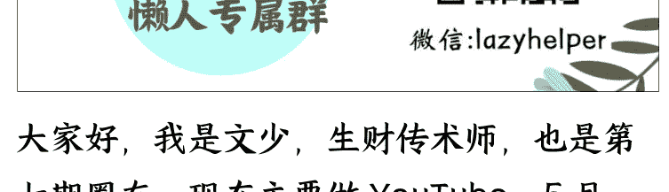

大家好，我是文少，生财传术师，也是第七期圈友，现在主要做 YouTube，5 月 YouTube 航海结束后加入了 YouTube 深海圈。

目前有 4 个账号，高级 YPP 一个，其余 3 个还在开通 YPP 的路上。

加入生财两年，也终于有了两篇精华帖，也体验了志愿者、领队、教练。

可以说，这两年算是我成长速度最快的两年。

不过今天不是聊项目复盘的，而是和大家聊聊我自己。

起因是看到曹教练和张望教练的分享经历，看的我深有感触。

作为 YouTube 深海圈的一员，让我也忍不住来分享一下。

+   如果用三句话来概括我的成长经历：
- 低学历从理发店打工做起；
- 跨行到互联网运营下班做公众号，坚持 2 年终出成绩；
- 辞职自由职业出海赚美金

所以这篇文章，我会尽量回到当时的视角，聊聊自己过去的一些选择与努力，顺带做一个复盘，它不会给你一夜暴富的捷径，只想坦诚分享我这几年踩坑、转型、慢慢找到节奏的过程。

如果你也曾觉得自己学历不够、起点太低、努力了却看不到结果——也许我的经历能给你一份「他行，那我也可以」的底气。

内容有些部分可能有点流水账，但都是真诚分享。希望能给正在经历相似阶段的你，带来一点点微小的帮助。

## 一、从月薪 1600 的理发学徒，到跨行互联网：我如何用先干起来破局

从上学的时候我的成绩就一直不好，高中读的职高，学的美发专业，毕业后就进入社会上班了。

是的，是高中毕业，我没有像其他孩子一样正常的走这一路程：读完高中→进入大学→步入社会。

甚至我连人生最重要的一场考试——高考都没有体验。可以说，我的学生时代是不完整的。

2017 年毕业后在学校分配的理发店实习做学徒，每天从早上 9 点到晚 21 点，工作 12 个小时，但一个月只能拿 1600 左右的工资，好点可以到 2000，而且节假日和周末还不能休（节假日是理发店最忙的时候）。

很难想象对吧？那时候已经是 2017 年了，最扎心的是法定节日上班还没三倍工资。

据我当时所知，国内理发店都是这种情况，但还是好是包吃包住，倒不用我花钱去租房，再加上还可以学「技术」，所以就坚持干了半年。

每天的工作就是帮顾客洗头，洗一个 5 块钱，指定客户 8 块（就是指定要你洗的顾客）。

这还是比较偏中大型的理发店，小店的提成更少，洗一个 3 块钱的都有。

基本每天都是洗 10 个顾客左右，多的时候要洗 20 个。

由于每天都在频繁碰洗发水，一到冬天，我们的手都很干（洗发水里面含有碱性），然后就会慢慢变成下面这种：

### 理发店学徒的手

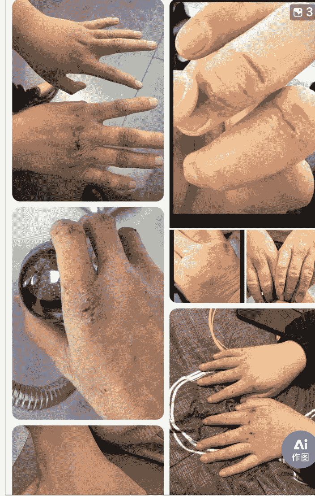

### 为什么会选择这个专业？

也是被逼无奈，因为没有考上好的高中，去读一个垃圾学校，不如去职业学校学一门技术，至少还能混口饭吃，学得好好还可以开一家理发店当「老板」，这是我爸当时为我规划的路线。

### **可以给大家看看我 2017 年还在理发店上班时的照片。**

后面因为身体原因，不得不从理发店辞职，然后去了医院，头部做了手术，住院了将近 4 个月，在 2017 年 12 月份出院，这期间人生仿佛被按下了暂停键。

由于在医院躺了几个月，出院后身体感觉快废了，为了可以早点去上班，我开始锻炼健身，在家休养了几个月。

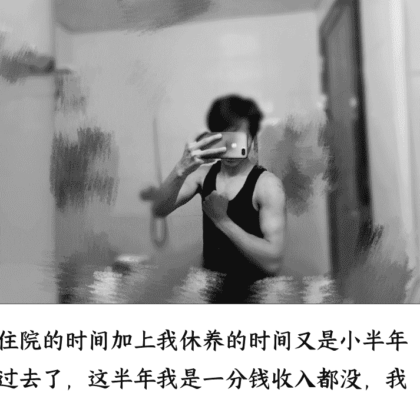

住院的时间加上我休养的时间又是小半年过去了，这半年我是一分钱收入都没，我开始有点急了，我不想再伸手找父母要钱了。

那种没有钱、赚不到钱的日子真难受。

我开始思考是继续重操旧业，还是找其它工作？可找其它工作我又能干什么呢？什么都不会。

那年刚好是抖音爆发的一年，可我当时哪懂这些呀，只把抖音当做娱乐软件，完全没有想到用它来赚钱。

这时候就只有这几条路摆在我面前：

- 要么进厂打螺丝
- 要么去餐馆做服务员
- 要么去做房产销售
- 要么继续去理发店学技术

“打螺丝？不存在的，那还不如去做房产销售。”

“做房产销售？算了，我丢不下这个脸，还不如做服务员。”

“做服务员？唉还是算了，还不如继续去理发店，至少还可以学技术。”

思想前后，我还是继续选择了去理发店。

于是我又再次踏上了我爸之前为我规划的那条路，在离家近的地方找了一个小店上班。

因为小店比较容易学到剪头发的技术，大店至少要两三年才会让你学剪头发。

可又在干了几个月后，已经 2019 年了，我还是没有学会剪头发，跟我同期的那个同事已经可以接待理发的顾客了。

我发现我在这方面是真的没有天赋，心也累了，不想再学了。

于是某天晚上我跟我爸说我不想干这行了。

我爸也看出来了，确实这行不适合我，也没有说太多，让我自己想清楚接下来要做什么。

然后我又再次想到了之前那几条路，这次我狠下心决定选择房产销售试试，在当地入职了一个房产公司的销售岗位。

每天工作就是去做地推，发传单，拉客户去看房。

也是人生第一次体验做销售，一开始站在路边发传单，手都是抖的，声音也发虚，连跟路人对视都有点害怕。

那时候正赶上重庆的六七月份，空气弥漫着让人窒息的炎热气息，太阳晒得人皮肤发烫。一天下来，衣服湿了又干，干了又湿.....

从那时候起，我就特别羡慕每天坐办公室里吹空调对着电脑工作的人。

虽然苦，但也练出了胆子，后面只要看到有点意向的客户，我就凑上去大胆说两句加微信。

可惜干了三个月，我的业绩还是太差，最终被公司劝退了。

那时我才明白：打工，永远翻不了身；没方向的努力，只会像「老鼠赛跑」一样无限循环。

人永远无法靠重复不喜欢的事情脱胎换骨。与其硬扛，不如早点打破重组。

## 二、疫情之下注册公众号，我如何用下班两小时死磕自媒体

时间到了 2020 年初，在没被辞退多久后疫情就来了，大街小巷开始封锁，所有人都停工待在家。

那段时间我经常看一个公众号的文章补充心力，也了解到了自由职业、自媒体这些东西，博主还推荐了一本书叫《认知红利》让我去看，在这本书里我第一次了解到“注意力”是可以赚钱的。（15 年才知道这个博主也是生财圈友）。

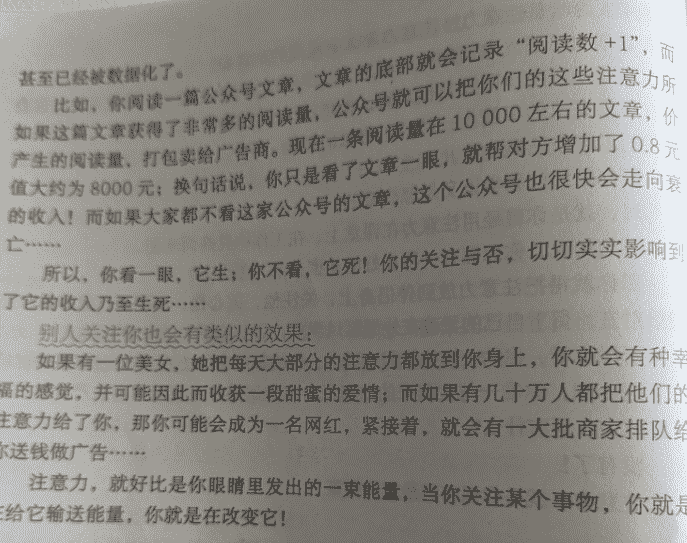

加上自己平时也有在看知乎这些平台，还写过一些回答，有几百粉丝，虽然不算多，却让我对内容创作有了最初的触碰。

### **如何看待此次新型冠状病毒肺炎事件？**

希望接下来听到的都是好消息！听说这次的原因是因为武汉一家海鲜市场非法售卖野生动物造成的。这种类似的事情发生已经不是第一次了，不过我觉得背...

12 赞同 · 5 喜欢 · 4 年前

### **23 岁中专学历只想读书提升自己，没有想过具体提升那一方面，该看什么书？**

谢邀，你目前有这个想法是非常好的，但是 高手从来都是三思而后行的! 首先小编认为你思考问题的方式错了，你只知道用读书来提升自己，但是却没想清...

10 赞同 · 7 喜欢 · 3 评论 · 4 年前

### **书读的越多越好吗？**

谢邀~本人也是第一次参与回答，希望我的回答能对你有所帮助。下面我就称呼为小编吧（虽然我并不是一个）那么首先先回答你的问题。 答案是：YES！曾...

44 赞同 · 15 喜欢 · 13 评论 · 3 年前

于是，在 2020 年 3 月 14 日，我照着网上的教程，懵懵懂懂的注册了自己的公众号——那个梦开始的地方。

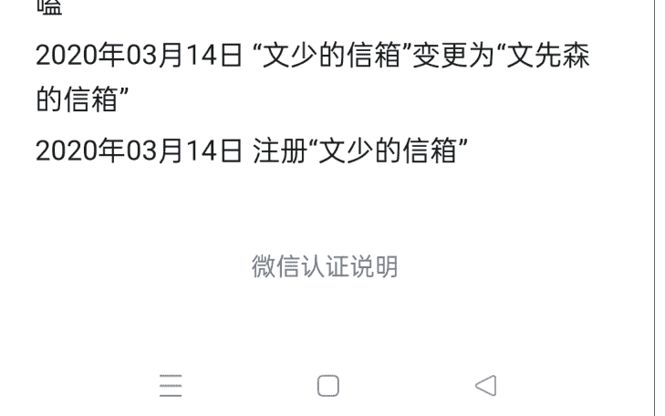

在注册公众号后，我好像找到了某种方向，我知道只要我把粉丝量涨起来，阅读量上去了，我就可以接广告赚钱了。

可这个时候问题来了：怎么涨粉？怎么运营？

那时候的公众号还是封闭的，不像现在有了「公域」推荐的流量，涨粉基本全靠外部平台引流。

所以，我开始全网搜教程，知乎、百度、头条、简书、微博……几乎所有平台上关于公众号运营的文章都被我翻了个遍。

看了好几天的文章后才渐渐弄明白：原来公众号的定位、头像、简介、自动回复、菜单栏设计，甚至人设搭建，都有这么多门道。

也是那时我才知道，除了接广告，还有流量主这种变现方式。

可是另个问题又来了：内容该怎么写？

总不能让粉丝来了看一个空白吧。

我一个连 800 字作文都很难憋出来的人，更别说让我去写一两千字的文章了。

没办法，那时候 AI 还没出来，只能靠自己手搓。

要想持续输出，就必须先有大量输入。于是我开始逼自己看书，一字一句地读，一本一本地啃，不知不觉，我的书已经有这么多了。

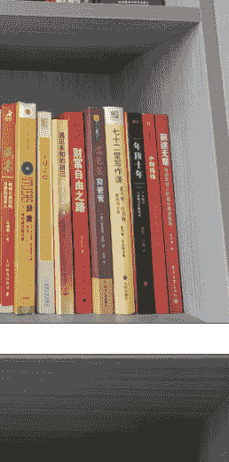

要知道，我从学校出来后，基本就没在认真看过书了，让我重新静下心来阅读，真的很痛苦。

但现在回想也真的很值得。

可以给大家看看我当时写的文章，现在看真的跟💩一样：

### 已删除（94）

2020 年 04 月

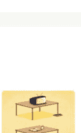

### 为什么你要多读书

未开启

### 书读的越多越好吗

![img/0c5e300fc803998354ffe2da54dbe3c1_14_0.png]

### 文少唠嗑

| 消息 | 服务 | 2020 年 4 月 27 日 |
|---|---|---|
| **人是怎么废掉的？** 阅读 79 |
| **分享几本对我影响很大的书籍** 阅读 138 |
| **合群的你也许正在走向平庸** 阅读 64 |
| **抖音真的让你难以自拔吗？** 阅读 131 赞 1 |

2020 年 4 月 13 日

### 大学暑假，怎样才能不被荒废？

阅读 712 赞 32

也不怕大家笑话，我吭哧吭哧运营了一个多月，没有一分钱进账，甚至连流量主都还没开通。

心里越来越急，觉得这样单打独斗不行，我必须得有圈子。于是我开始在网上四处搜索，最终通过一个公众号留言小程序和 1 元的公开课，摸进了几个用户交流群。

终于，我也算是半只脚有了圈子的人。也正是因为这个圈子，我遇到了后来的贵人——理白。

后面混群才了解到原来可以通过刷粉快速开通流量主。没多想，花了几十块钱试了一下。

当我第一次看到后台出现收益的那一刻，又惊喜又激动。

### 指标数据明细

| 日期       | 曝光量 | 收入   | eCPM  |
|------------|-----|-------|--------|
| 2023-05-09 | 4   | 0.02  | 5.00   |
| 2023-05-08 | 3   | 0.00  | 0.00   |
| 2023-05-07 | 3   | 0.01  | 3.33   |
| 2023-05-05 | 3   | 0.02  | 6.67   |
| 2023-05-03 | 1   | 0.00  | 0.00   |
| 2023-05-02 | 2   | 0.02  | 10.00  |
| 2023-05-01 | 2   | 0.00  | 0.00   |
| 2023-04-28 | 4   | 0.02  | 5.00   |
| 2023-04-27 | 2   | 0.02  | 10.00  |
| 2023-04-26 | 3   | 0.03  | 10.00  |
| 2023-04-24 | 2   | 0.00  | 0.00   |
| 2023-04-23 | 4   | 0.01  | 2.50   |
| 2023-04-21 | 1   | 0.05  | 50.00  |
| 2023-04-20 | 6   | 2.73  | 455.00 |
| 2023-04-19 | 3   | 0.00  | 0.00   |

就为了每天都能有点收益，我开始咬牙日更。第一个月，流量主一共带来 163 块钱。

钱不多，但到账那一刻的开心，至今还记得。

就这样坚持了小半年，我终于接到了第一条广告——某公司的播音课程，报价 300 元。

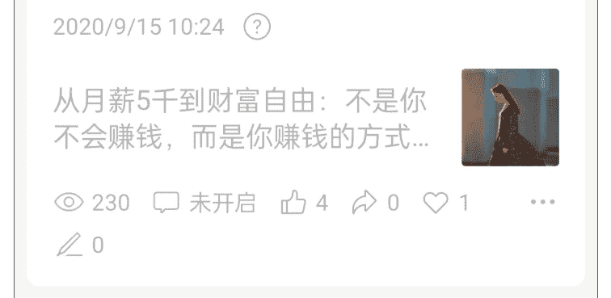

虽然这笔收入还远不能支撑生活，但却像一束微光，让我真正看见：这条路，或许真的能走下去。

期间也是一边是做体力活赚辛苦钱，一边是晚上死磕内容。

我没有选择等到有空再做，而是没时间就挤时间，不懂就硬学。

普通人做副业最大的障碍，不是没时间，而是总想准备好了再开始。

## 三、找工作学历受阻、公众号寒冬：我如何应对不断推倒重来

在坚持运营了将近一年左右，我的公众号阅读量逐渐能稳定在 500~1000 左右，广告报价也涨到了 500 一条。

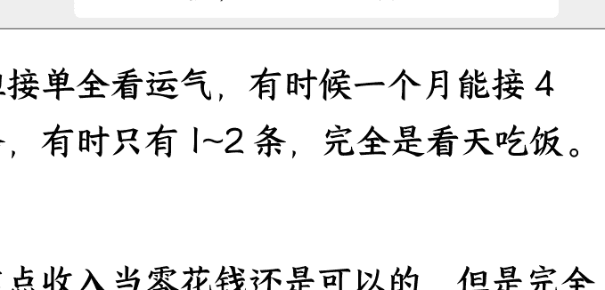

但接单全看运气，有时候一个月能接 4 条，有时只有 1~2 条，完全是看天吃饭。

这点收入当零花钱还是可以的，但是完全养不活自己呀。

那时候已经陆续复工，我重新开始找工作。心想，再怎么说我也自己运营公众号这么久，找个新媒体运营岗位总有机会吧？我把目光投向了曾经羡慕的坐办公室的工作。

可现实又啪啪打了我一巴掌，我投了很多家公司，结果却一次次受挫。

有的卡学历，说我高中学历不够（至少得要大专）；有的工资实在太低，我不愿意去；还有的觉得我经验太浅，让我等通知。

然后就没有然后了......

那时候我才真正意识到，学历是我的硬伤，也是在那一年，我去报了成人自考，拿了一个大专学历。

反复面试没结果，我也渐渐放弃了上班的念头。

干脆横下心：既然别人不给机会，我就自己把公众号做好。

那段时间，为了赚点零花钱，我继续做着各种兼职：发传单、地推、甚至当群演......什么都试过。

不过好在皇天不负有心人，那段时间我的公众号粉丝量和阅读量都迎来了上涨期，通过知乎、企鹅号、抖音等外部平台引流，一个月就涨了 8000 粉，尤其是企鹅号这两篇文章应该都帮助我涨了三四千粉。

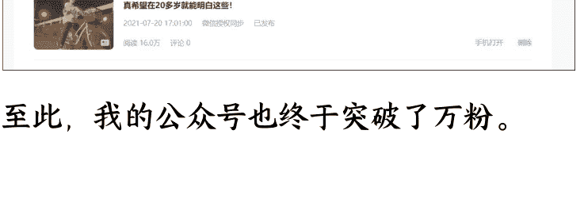

至此，我的公众号也终于突破了万粉。

除了公众号在上升，我的知乎也没落下，当时也在同步我公众号的文章，也涨到了 2000 粉丝，在 21 年的端午，第一次收到知乎送的端午礼盒。

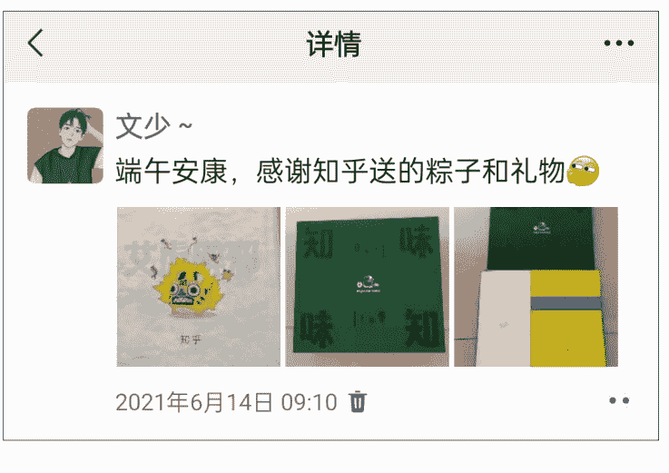

从那以后，我的公众号每个月都能稳定接到 4 条广告，每条价格至少 500，甚至价格稍微低一点的我都拒绝了。

这种硬气的感觉真爽！

公众号的运营好不容易稳定了下来，但却在 2022 年 4 月开始逐渐进入「寒冬期」。

原因是平台的推荐机制迎来了大调整，算法规则逐渐向公域倾斜。几乎一夜之间，大部分公众号的流量大幅下滑。再加上双减政策，很多教育培训类公司大幅缩减广告预算，接单变得越来越难（当时公众号主要是课程类广告为主）。

整个圈子好像一下子冷了下来。很多号主已经开始在卖号了，我还记得当时发了一条朋友圈分析了一下公众号的算法改变。

最近看好多小伙伴都在吐槽微信的推送算法，昨天突然发现确实很迷，感觉现在公众号变成了私域流量的「公域流量」

改版之前是根据发文时间推送的，谁后发谁就会被顶在前面，但改版之后就好像变成了公域平台的「推荐」一样，即使是先发的推文，也有可能被其它后发的号顶下去（见图 1）

也就是说如果粉丝不是「常读用户」或者点到公众号主页的情况下就被顶下去了，那他是根本不可能知道你更新了

所以我才说像是私域里的「公域」，兼具私域的封闭和公域的不确定。

既然微信是基于推送，那么一定会优先推送你感兴趣的，我昨天观察了一下，系统对于常读公众号未读的文章好像会重新推送一次，也就是说如果这个公众号是你的常读，他新推送的一篇文章你没有点进去，那么系统可能过一会儿就会帮你顶在前面，这也是我猜测为什么有的号才发的文章会被好几个小时前的文章顶下去

至于隔多久重新推送一次目前还没看出来，可能是几个小时后，也有可能是随机....

另外，微信对于常读公众号的推送规则好像没有改变（指常读公众号的头像，见图 2），如果这个公众号是你的常读，那么他更新了，头像就会被顶在前面（一个微信用户最多只能显示 12 个常读公众号）

我没有选择卖号，但也不敢再 all in 公众号了。

是时候再出去找份工作了。

想着自己已经运营了两年公众号，这一次，找一份运营相关的工作应该不难吧？

所幸，这一次比较顺利。六月份，我成功入职了一家 MCN 机构，担任运营岗位。

主要工作内容就是找抖音达人进行签约和商单合作。（更像是媒介和 BD）

在上班那段日子里，依然是坚持白天上班、晚上写公众号和知乎。

说不累是假的，有时候还要加班，晚上 22 点多才到家，选题、素材什么都是现找的，写好一篇文章后基本就到 12 点了。

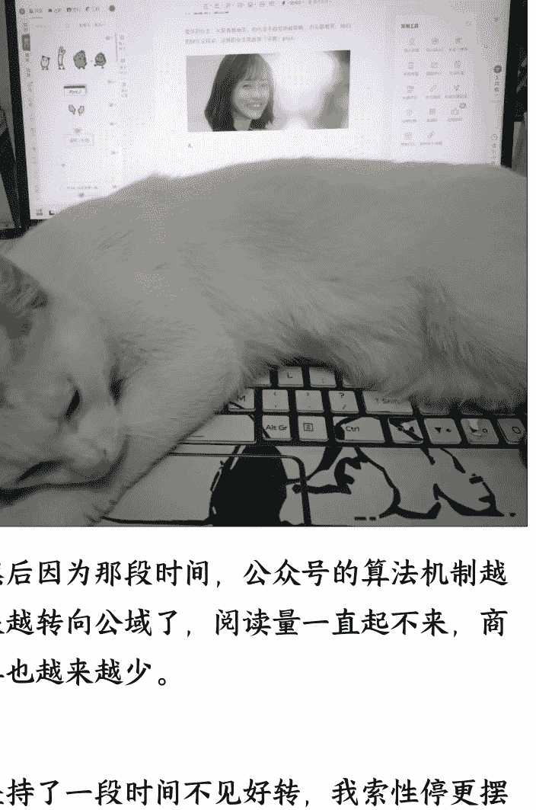

然后因为那段时间，公众号的算法机制越来越转向公域了，阅读量一直起不来，商单也越来越少。

坚持了一段时间不见好转，我索性停更摆烂了几个月，决定先把主业做好。

### 文少唠嗑

### 时隔 6 年，公众号终于再次开放了留言功能

阅读 146 赞 5

### 520 晚上，我被一男的给拦下来了

阅读 168 赞 9

### 我要吹爆支付宝这个功能!

阅读 619 赞 10

### “如果没人看抖音了，你出头可能只会更难吧”

阅读 391 赞 10

### 大学暑假，怎样才能不被荒废?

阅读 712 赞 32

虽然公众号停更了几个月，但我也从未停止找路。

这个世界从不拒绝愿意尝试的人，你推倒墙，就成了门；你退一步，就可能永远困在原地。
</content>

## 四、进入生财、视频号爆发：正反馈是喂出来的

主业求生存，副业谋发展。

可能由于做公众号的原因，我一直就不安于上班，看着公众号和知乎都没有起色，我必须得找点其它路子了。

说来也是缘分吧，那时候刚好遇上生财第七年 418 活动，我的好朋友理白也在帮忙拉新。其实早在 2021 年的时候我就在一些号主群里听人提起过生财，但当时并不清楚它具体是做什么的。

后面在朋友圈观望了几天，加上当时价格才 1965，我决定加入试一试。

之前我也报名过一些知识付费课程，像知乎、新媒体写作课之类的，价格基本都在 1000~1600 左右。相比之下，生财当时的价格，真的让我觉得，这么便宜，必须试试！

虽然不贵，但我当时工资还没发，手头有点紧，最后还是通过花呗套现买的（心里有底，下月工资发了能还上）。

就这样，我也成了生财的圈友。

作为一个刚进来的小白，加入生财后真的被震撼到了。那种感觉就跟之前下面这位新加入的圈友一样，说不出的震撼：

### 范承博 的主题

2025/4/24 09:06

有 10 位朋友发表了观点和态度

> 生财笔记第一条，记录我的感受。翻公众号文章，再到星球里找到具体文章，去读。在精华帖挨个读，在文中文穿梭。不知不觉看了 2 小时，唯一让我感受到的就是，震撼，nb，太 nb 了，我表达不出来我的震撼，我只能把我看到的文章去分享给我的朋友，去跟他们说，nb，太牛逼了。来到生财是我今年最对的决策，期待航海！！！

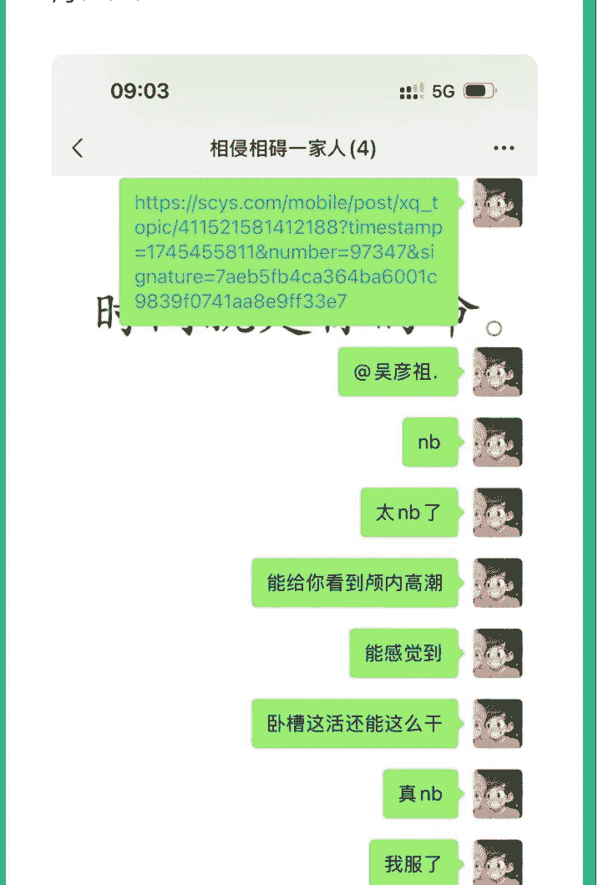

也是从那时候我才知道，原来还有这么多的赚钱路子，居然还有这么多人愿意分享自己的赚钱方法，这真的不可思议！

为此，在新手村的时候，我还立了一个 flag，我说希望明年也有机会分享自己的赚钱方法（这个 flag 终于在今年完成了）。

### 你好，我是文少。

刚加入生财的一位小白。

坦白说，在加入以后看到星球里这么多信息，感觉还有点信息焦虑，生怕错过很多重要的消息。

不过好在靠谱跟我说你只需要去获取你想要的知识点就行了，其它对你来说不重要的信息直接过滤掉就行了。

在这里非常感谢靠谱和理白还有醒醒，如果不是他们这次组织拉新，我可能都不知道生财有术是干什么的，也不可能加入。

在加入后我才发现，原来真的会有人愿意毫无保留地分享他赚钱的方法，在看到大佬们的分享之后，我才突然发现：

> “原来还有这种方式啊！”
> “原来钱是这么赚的啊！”
> “我去，居然还有这种操作啊！”

一度处于惊讶中，我曾在朋友圈帮理白发过一次拉新介绍时说：

> 我们努力有两个重要目的，一是让自己容易被人选择，二是让自己拥有选择的资格。

那么希望明年的时候，我也能成为分享赚钱方法的那个人，成为被人选择的那个人！

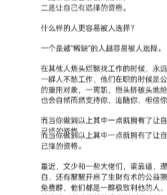

### 详情

文少

精华

2025/6/14 11:14 重庆

#### 手把手带你实操如何用黛玉怼人做视频号分成计划

大家好~我是文少，生财第七期圈友，做过多次志愿者和领队。

这次 6 月航海有幸成为视频号分成计划航海的教练。

不过这次不是对从志愿者到领队再到教练的复盘，后面有空在写一篇哈哈~

前年刚加入生财在新手村的时候，我立过一个 flag，我说希望明年也有机会分享自己赚钱的经验。

如今一年时间也过去了，虽迟但到。

既然如此，那就始于生财，献于生财。

详情可点击飞书链接，建议电脑端观看体验更佳：

看了这么多，可能你有想法~

当然，刚加入生财时的前几个月也是非常焦虑的，很多项目看得眼花缭乱，不知道该从哪个开始。

后面跟着航海、做志愿者才慢慢找到节奏，认知也有了一定的提升，知道光想光看没用，必须下场实操，把手弄脏。

我第一个做的项目是抖音养生带货，当时跟着一篇精华帖操作，花了两个小时才做出第一条视频。

后面做了一个月左右才出了几单，那几十块佣金因为没缴押金到现在还在抖音钱包里提不了现......

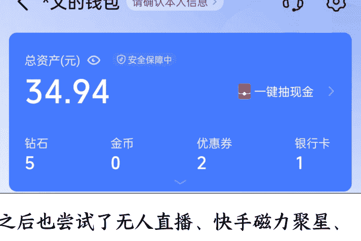

之后也尝试了无人直播、快手磁力聚星、得物等等，但基本都没拿到太大的结果。

无人直播不是违规就是没人看；快手磁力聚星视频经常被限流，很难出单；得物稍微好点，靠流量分成+优惠券差不多变现了 1000 多。

但因为当时做的是搬运，觉得对自己能力提升不大，所以做了一段时间就没做了。

时间来到了 8 月航海，我报名了视频号带货，才开船第二天发的视频就爆了，我毫不犹豫地开启了人生中第一场露脸直播，

播了一个多小时，GMV128，佣金 80 块左右。那一晚，我兴奋得几乎没睡着。

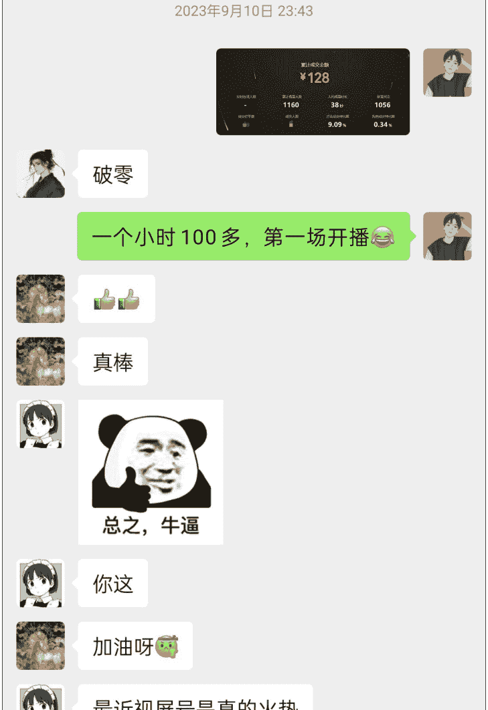

那一刻我突然觉得，视频号，好像也没那么难嘛！

这份实实在在的正反馈，给了我巨大的信心。我决定认真把视频号做下去。

但是因为当时做的是曾仕强混剪相关的，视频大爆之后就会触发人脸验证，结果航海期间只变现了 2000 左右，账号就废了。

没办法，迫于视频号的规则，我只有换赛道。

后面刚好赶上了视频号分成计划的航海，因为有了一点带货经验（当时已经开通过分成计划），觉得难度不大，就又报名试试。

这一次，航海期间我就变现了 1000 多，又一次拿到了正反馈。航海结束后我也坚持每天更新，前后大概也爆了至少 10 条 100w 播放以上的视频，有时候一条视频收益就有 500 多。

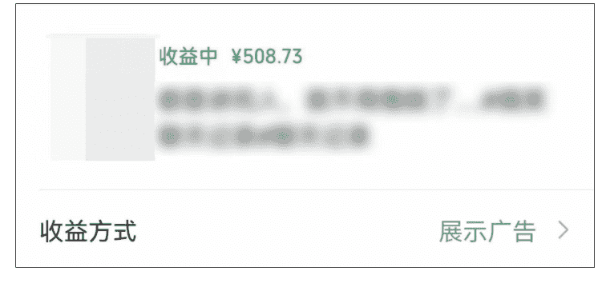

就这样，我坚持更新了半年。

在 2024 年 6 月份左右，我终于迎来了一条爆款中的爆款：单条视频播放量破 3000w，收益超过 4000 元。

### 文少 ~

不知不觉这条视频的收益破 3000 了😆

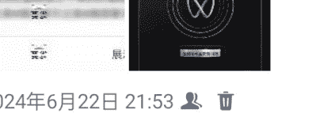

2024 年 6 月 22 日

### 作品获赞突破 10 万

2024 年 06 月 22 日

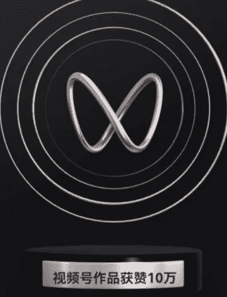

视频号作品获赞 10 万

> 期待你持续创作，
> 带来更多优质作品！

**视频号团队**

扫码查看作品

### 设置广告类型

| 项目 | 详情 |
|---|---|
| 收益 | 收益中，¥3706.66 |
| 收益方式 | 展示广告 > |

### 数据分析

*   更多数据

### 播放和收入数据

*   昨日视频创作分成收益增加 0.07 元
*   播放量：36914379 高（超过 99.94% 的同类视频）
*   完播率：36.55% 低（超过 41.13% 的同类视频）
*   平均播放时长：57.92 秒 高（超过 99.97% 的同类视频）
*   3s 以上播放率：67.99% 低（超过 31.48% 的同类视频）
*   创作分成收益 > ¥4432.22
    *   昨日新增 ¥0.07

> 视频的完播率、3s 以上播放率排名暂时低于同类视频，仍有提升空间
> 去创作学院获取更多指导

### 互动数据

*   139024 人❤️了你的视频，推荐给了 2901471 个朋友
*   139024 / 39722 评论
*   10312 新增关注

我想，要不是我一直坚持在发，我也不会等到条千万播放；

我想，要不是我没下牌桌，我也不会有勇气辞职做自由职业；

我想，要不是我一直不安于现状，我也不会走到这一步。

所以，你尽管去撞击这个世界，成败皆是反馈。只要没下牌桌，就还有翻盘的可能。

## 五、一条超级标埋下的种子

2024 年年底，亦仁老大发了一条 YouTube shorts 的超级标，正是因为这条超级标，悄悄在我心里种下了一颗种子（毕竟赚的是美金，还是非常诱惑人的）。

### #超级标# 02

来了，今天发布第二条超级标，请坐稳扶牢，发车！

本次超级标是：通过 AI 生成的各种视频，上传到 Youtube 和 shorts，获取广告分成，空间无限大，以下我来说明理由：

*   1/ 这是一个超级巨大的市场和空间。12 年我作为第一批在 Youtube 上开始赚钱的人，那个时候就已经感受到巨大的流量价值不对等，同样的播放，在国内视频平台可能一文不值，在 YouTube 上可能有几千美金的收益。
*   2/ 背后是 Google 广告平台的巨大商家量，以及 Google 为了自己的内容生态，把广告收益的一部分分给了内容制作者。
*   3/ 各种 AI 工具的出现，让咱们生财有术的圈友可以实现快速制作视频的能力之前的尝试过不少项目，也慢慢积累了一些网感。看了几个 YouTube 的对标视频，感觉好像......也不难？

说干就干，花了几个小时，做了一条动物融合的视频，但是视频发出去后一晚上才几十播放量。

我以为是我内容问题，觉得 YouTube 太难了，加上当时还在做视频号，就放弃了。

直到今年 4 月，看到很多人都在 YouTube 拿到了结果，开通了 YPP，说不馋是假的，那时我视频号的流量也开始下滑，那颗埋藏已久的种子，突然又开始发芽。

### 直接开干！

虽然当时航海已经结束了，但我还是照着航海手册自己摸索实操，花了几个小时做了一条婴儿救援的视频，就这样发了两个月还没开通 YPP。

直到 5 月航海开船那天才知道这个赛道已经不能做了，根本过不了 YPP。

没办法，只有把视频全部隐藏重新开始。

后面的故事很多圈友也都知道了：航海期间就成功开通了初级 YPP，一周后开通了高级 YPP，成功赚到第一块美刀，在 5 月航海结束后加入了 YouTube 深海圈，也有了一篇 YouTube 的精华帖：https://scys.com/articleDetail/xq_topic/1524188151855412

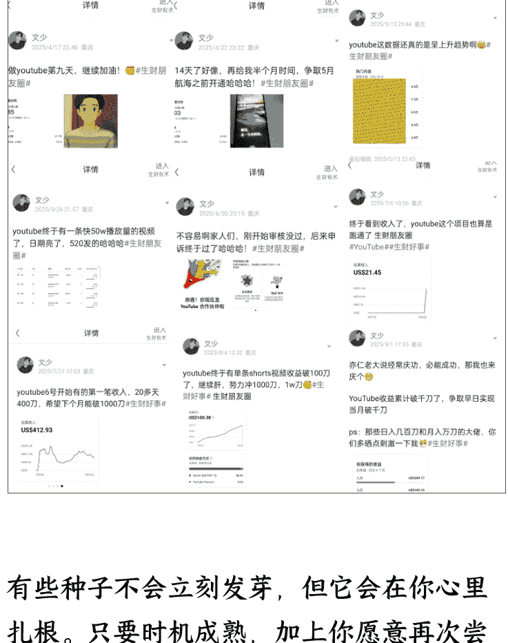

> 有些种子不会立刻发芽，但它会在你心里扎根。只要时机成熟，加上你愿意再次尝试，它就会破土而出。

## 六、如果你想行动，却迟迟没开始：我的 4 点建议

*   - 不要等准备好。

    我注册公众号时连写作都不会，全靠努力涨，后面才有了自己的风格，做视频号时连剪辑都是从零开始学的，第一个视频剪了 4 个小时才剪完。

    但我明白一个道理：你永远不可能真正准备好。唯一的方法就是先下场实操，把手弄脏。

    写着写着，你就懂了写作；剪着剪着，你就熟悉了流程。站在原地等待完美时机，不如先发出第一篇文章、第一条视频、第一个朋友圈.....

    行动本身的反馈，才是最好的老师。

*   2. 打工和副业，是两套逻辑。

    打工求稳定，副业求突破。如果现阶段不能 all in，就用下班时间试错最小闭环。

    从生财找一些感兴趣的项目凹凸性尝试：发第一条视频、写第一篇文章、做第一个引流动作.....

    不必一步到位，小步快跑、持续迭代，每天进步一点点。

*   3. 学会主动筛选信息，而不只是被动接收

    生财里每天都有大量信息和项目涌现，一开始我也焦虑，什么都想跟。后来才发现，比看到多少更重要的，是筛选出与你匹配的。

    不必追逐每一个热点，而是静下心找到那些符合你当前能力、资源、时间投入的机会。

    真正的圈内优势，不在于你加了多少群、看了多少帖，而在于你能否从噪音中找到属于自己的灯塔。

*   4. 你可以接受失败，但不能接受放弃。

    我也做过很多失败项目：抖音养生带货没人看、无人直播被违规、快手磁力聚星限流……

    但它们给了我网感、经验和能力。没有白走的路，每一步都算数。

    失败只是过程，放弃才是终点，普通人的路，是用尝试铺出来的。

    只要你开始，就不会永远普通。

## 七、写在最后

回顾这几年，真的犹如过山车，起起落落，所幸每个阶段都有收获，走的每一步，都算数。

### 也感谢在每个阶段帮助过我的贵人：

2025/4/17 17:44 重庆

文少

作业
大家好，我是文少。生财第七期圈友，加入生财两年，最近刚好拥有了一颗龙珠，我终于也有资格写这个作业了。

在搞钱路上狂奔的我们，心里都藏着一份柔软的江湖气。那些关键时刻的指引、低谷时的托举，甚至一句醍醐灌顶的话，就像大海里一盏明亮的灯塔照亮着我们前进的道路。

都说贵人相助是成年人的玄学，但在生财我发现：真正的玄机，在于把感恩变成一场能量流动。

⭐为此，借着这次作业我想把我的第一颗 贵人碎片送给@理白先生。

从 2021 年 6 月相识至今，@理白先生 理白老师是我做自媒体以来认识最久的好朋友之一，同时也是带我加入生财的人，这一路上对我的帮助都非常大。

在我印象里，理白老师一直是一个卷王，时间管理的神。在主业是医生的情况下还把副业干到了千万。翻到微信里那个快四年的好友标识才惊觉：有些人早成了你人生系统的「默认配置」。希望下一个四年，继续和你一起手可摘星辰！

🌙我的第二颗贵人碎片送给@梁靠谱。

23 年 418 拉新因为理白老师认识了靠谱老师，后面加入生财多亏靠谱老师帮我改稿，不然我生财第一篇帖子都不敢发哈哈。

之后还教我谈单，我过生还给我送了礼物。都说做靠谱的人，谱姐是我见过情绪最稳定，最不内耗的人，靠近她都能让我能量满满，⋯心力提升 buff 加满。

也感谢航海期间对我帮助的所有教练、领队、志愿者，还有深海圈的曹教练、波妮教练、我的咨询教练——@李香君教练。

最后也感谢生财所有嘉宾、亦仁老大和工作人员，也感谢能彼此遇见不断航行的我们自己。

我在生财最大的感触是：生财提供的不是一张藏宝图，而是一张航海地图。

藏宝图是告诉你一个确定的地点，而航海地图告诉你洋流、风向和绘制新航线的方法。我分享的成果，只是我根据地图探索到的第一个小岛。前面还有无数岛屿等待发现。

所以，我想对还没开始的人；快放弃的人；怕失败的人，说：不要羡慕任何人的岛屿，去绘制你自己的航线。生财这座宝库，你挖的越深，收获越丰。

还记得我刚进生财时的那种震撼吗？震撼于信息差，震撼于利他之心。

那时我是因为看见，所以相信。我看见了大佬的成果，才相信这条路可行。

而今天，我想告诉大家的是，我走完了下一个阶段：因为相信，所以看见。

我相信先把手弄脏，才能看见结果；

我相信坚持很酷，才能看见转机；

我相信试错成本很低，才能看见成功的偶然变成必然。

更重要的是，我看见了那个因为相信而变得更好的自己。

这个循环在生财无处不在。

希望我的故事，能成为你相信的起点。

最后，安利小懒的付费群：

懒人专属群（介绍）

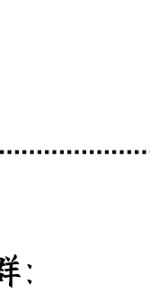

📚懒人专属群持续更新中，已持续运营 6 年，整理超 3000 份各类精选付费文章&年费社群干货，全部开放下载。

本资料为付费群内部分享，仅供真实有需要的朋友查阅🙇‍♂️

懒人专属群更新记录：

https://lazy2025.top/blog/record2

懒人专属群更新记录（需梯子，备用）：

https://lazybook.fun/blog/record2