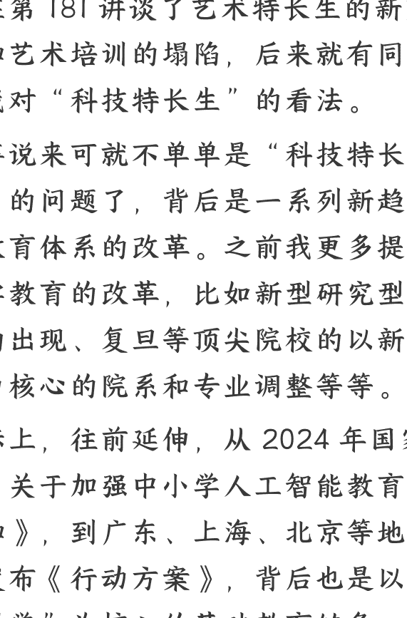

# 基础教育加大科技权重，普通家庭怎么应对？

250917《政经参考》节选

**整理**：公众号懒人搜索，[**懒人专属群独享**](lozhanger)

懒人微信：lazyhelper

我在第 181 讲谈了艺术特长生的新变化和艺术培训的塌陷，后来就有同学问我对“科技特长生”的看法。

这事说来可就不单单是“科技特长生”的问题了，背后是一系列新趋势和教育体系的改革。之前我更多提到大学教育的改革，比如新型研究型大学的出现、复旦等顶尖院校的以新工科为核心的院系和专业调整等等。

实际上，往前延伸，从 2024 年国家发布《关于加强中小学人工智能教育的通知》，到广东、上海、北京等地先后发布《行动方案》，背后也是以“科学”为核心的基础教育链条，正在发生巨大改变。

今天我们就好好讲讲这个问题，带你看下未来的人才选拔和孩子的培养路径。

## 基础教育加速“科技化”

2025 年 1 月，中央发布的《教育强国建设规划纲要（2024 - 2035 年）》提到，要“面向数字经济和未来产业发展，加强课程体系改革，优化学科专业设置”。这句话很重要，是核心导向。而这背后的一个延伸趋势，是基础教育正在不断增加科技或者说科学的权重。

据我观察，大致可以分为三个大动作：

第一，是成体系地增加人工智能等科技类课程。

国家对这件事的布局，其实很深远。早在 2017 年，国务院发布的《新一代人工智能发展规划》就提出，“在中小学阶段设置人工智能相关课程”。

而 2024 年，教育部发布的《关于加强中小学人工智能教育的通知》，明确要“进一步完善相关课程中人工智能教育要求”。比如，小学低年级的侧重点是感知和体验人工智能技术；小学高年级和初中阶段的侧重点是理解和应用人工智能技术；而到了高中阶段，则侧重实现项目创作和前沿应用，背后是一个体系化设计。我认为这不只是“增加课程”那么简单，而是涉及整个基础教育的战略性转向，和我在课程开头和之前第 126、60 讲提到的大学改革形成呼应。对于这次战略转向，地方层面正在快速跟进。

其中，广东的动作比较快，2024 年 9 月，广东省就发布《人工智能赋能基础教育行动方案 (2024-2027)》，提出“实施人工智能教育课程建设”等一系列行动。

上海、北京也紧跟其后。2024 年 10 月，上海市发布的《推进实施人工智能赋能基础教育高质量发展的行动方案 (2024-2026 年)》也提出，“实施中小学人工智能教育课程建设行动”。今年 3 月，北京市发布的《推进中小学人工智能教育工作方案 (2025-2027 年)》提出，“构建多层次人工智能教育课程体系”。

类似政策还有很多，虽然政策细节有差异，但政策导向高度一致，我研究发现就是要形成以人工智能等科技课程为核心的新支柱，和语文、数学等传统学科，德育、体育、美育等综合素养一起，加速重构整个基础教育的课程体系。

课程体系改革之外，就是选拔机制的改革。所以，第二个大动作，是“科技特长生”正在越来越成为新趋势。“科技特长生”，一般指的是在“科技创新实践活动方面有一定特长”的优秀初中生，比如“机器人科技特长生”“信息技术科技特长生”等等。
但不仅仅是科技特长生，针对高中阶段有科技兴趣的学生，各个地方还在构建全新的培养模式。所以，第三个动作，是兴建科技中学和科学中学。比如，2024 年，上海市教委、同济大学、黄浦区人民政府共同签署框架协议，合作共建同济大学科技中学。再比如，2024 年 9 月正式交付的北京中学科技分校，由北京市朝阳区，和北京化工大学等五所高校联合打造。

而由北京市朝阳区教委与北京市十一学校合作共建的北京科学高中，预计在 2026 年 9 月正式开学。这所高中规划建设独立科学创新中心、化学实验室、人工智能无人驾驶实验室等特色科研平台。我说完你就知道了，对于具有理工科特长的学生的科研能力培养，正在从大学向大城市的特色高中延伸。

除了新建一批科技中学、科学高中之外，一批老牌科技中学，已经开始推动“联盟化”。2025 年 5 月，全国第一所科学高中深圳科学高中，携手北京、上海、重庆等省市的 18 所科学特色高中，正式成立全国首个“科学高中联盟”。而这场“强强联合”背后，是一场探索科学教育的大型试验，为之后培养顶尖科技人才做更多准备。

从课程改革、到选拔机制，再到科技中学和科学高中的兴建，我判断未来的趋势很明确，基础教育的科技权重，正在不断提高。

## 科技人才的识别和选拔越来越前置化

而科技权重的提高，既是国家对科技人才的提前识别选拔，也是应对技术冲击的政策托底。我认为这背后的政策意图，至少可以分为两个方面：

第一，修复之前大规模应试教育带来的弊病，对科技人才进行提前选拔，为科技创新、产业升级，建立“人才储备库”。

大规模应试教育的好处，是尽可能标准化地衡量能力水平，但是因为过于标准化，所以存在两个问题：一是，标准化培养导致对科技人才识别不足；二是，标准化教育的内卷，导致过多资源投入到 standardized 应试中。中考、高考，都有类似情况。

所以，大学招生有诸如“强基计划”等选拔机制，而高中招生中也有“科技特长生”等选拔机制，并且现在在大力配置科技中学等新型高中，将更多天赋型科学苗子放在一起培养。

而最新的趋势是，对科技人才的识别培养，在继续延伸前置。今年 3 月，广东发布《中小学科技特长生认证管理办法》，涵盖人工智能、机器人、编程、航空航天等多个方向，把“科技特长生”资格认定，前置到小学阶段。虽然还没和招生政策挂钩，但信号意义很强烈，体现出地方高度重视对学生早期科技素养的培养。

但客观说，真正能成为优质科技人才的，毕竟是少数人。所以，国家加大基础教育的科技含量，我认为还有第二个意图，就是应对技术冲击的托底行动。让大多数孩子能感知和适应未来的科技社会，掌握一些基本的科技技能，避免成为时代浪潮的弱势一方。

## 三条建议

趋势很明确了，但是对于更多家庭来说，越是大转向的改革，越容易有教育焦虑，所以我这里提供三条建议，供你参考：

第一条建议，避免过度投机心态。虽然我反复谈了“科技特长”这件事，但是我建议很多家长理性评估自家孩子的能力和兴趣，不要抱着太多的投机心态，去赌“科技特长”这条路。道理很简单，和过去的艺术、体育相比，“科技特长”的挑选要求其实更高，可以类比的是对理工科天赋型学生的相关招生计划中，对应的大学也水平更高和更少，它本身就是在理工科学习能力比较强的学生中，选拔出对科技有兴趣的“特长生”，而理工科学习这件事真是要看天赋和兴趣的，而且科技是个无时无刻不在追逐“最新”的领域，很多事情一旦要不断“创新”，对孩子和家长，包括资源的要求就会更高。

第二，虽然我不太建议下大本钱赌“科技特长”这件事，但是一定要让自己的孩子有更多的基础科技感知和科技思维。未来没有纯粹意义上的文科生甚至艺术生、体育生了，类似人工智能这样的技能，未来可能是所有学科和工作的基础。

比如最近重磅的《国务院关于深入实施“人工智能+"行动的意见》中，很明确未来要用 AI 重塑中国的科研范式，不仅仅是理工科这样的自然科学，社会科学也是一样。而且以后的工作中，无论是搞艺术还是搞体育，科技含量都是未来的增量。甚至未来的管理技能和管理模式都要科技化，比如文件提出，要探索人机协同的新型组织架构和管理模式。

第三条建议，越是更多人涌向科技能力的时候，或许越是要补强“非科技基础能力”，比如跨学科思维和团队协作等。今年 8 月《哈佛商业评论》的一篇文章提到，阅读理解、基础数学能力及团队协作能力等基础能力更强的人，在整个职业生涯中更可能获得更高薪资、晋升到更高职位、更快掌握专业技能，并且对行业变革具有更强的适应能力。如果一个人没有“科技特长”，可以考虑提升科技之外的基于人的“不可替代能力”。

最后，欢迎你《政经参考》转发推荐给更多人，让我们一起聚焦政经，举重若轻。我是马江博，下期见。

## 延伸学习：

*   1、中共中央 国务院印发《教育强国建设规划纲要（2024-2035 年）》
*   2、教育部部署加强中小学人工智能教育
*   3、北京市教育委员会关于印发《北京市推进中小学人工智能教育工作方案（2025—2027 年）》的通知
*   4、上海市教育委员会关于印发《上海市推进实施人工智能赋能基础教育高质量发展的行动方案（2024-2026 年）》的通知
*   5、新质生产力人才培养“福州模式”呼之欲出
*   6、广东中小学科技特长生认证管理办法

最后，安利小懒的付费群：

懒人专属群（介绍）

微信:lazyhelper

### 懒人专属群持续更新中，已持续运营 6 年，整理超 3000 份各类精选付费文章 & 年费社群干货，全部开放下载。

本资料为付费群内分享，仅供真实有需要的朋友查阅 🙈

### 懒人专属群更新记录：

*   https://lazy2025.top/blog/record2

### 懒人专属群更新记录（需梯子，备用）：

*   https://lazybook.fun/blog/record2