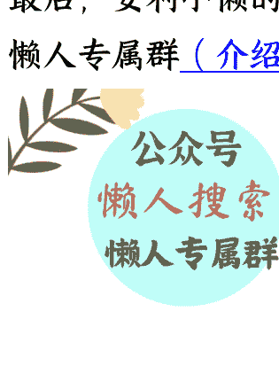

# 国家释放信号，新一轮公立医院改革开启

250918《政经参考》节选
整理：公众号懒人搜索，**懒人专属群**独享
懒人微信：lazyhelper

在第 184 讲课程里，咱们谈到了一些医院亏损、降薪的现状，以及二级医院的窘境和背后的医院的大分化。后来有同学提问说，9 月 11 日的国新办新闻发布会上，国家卫健委主任提到，国务院成立了“深化公立医院改革协调机制”，并召开了第一次全体会议。这位同学很敏锐啊，这确实是一个很大的信号，我综合判断，这意味着新一轮公立医院改革的开启。

国家卫健委主任在国新办新闻发布会上，有一个定调很关键，他说要“因地制宜推广福建三明医改经验，国务院成立了深化公立医院改革协调机制，就在上一周，国务院深化公立医院改革协调机制召开第一次全体会议，我们将在今后工作中进一步推广好福建三明医改经验，坚持公益性导向，使公立医院在服务群众过程中发挥更加积极良好的作用” 。

实际上，谈到中国的公立医院改革甚至整个的中国大医改，那就一定绕不开“三明医改”。而我分析前面表态，显示出的明确信号就是，未来中国的公立医院改革，会在“三明医改”的大框架下持续前进。

而搞懂了“三明医改”，也就看清了未来中国公立医院甚至中国大医改的方向。所以，我打算花两节课的时间，来好好给你讲讲医改的话题，以及它对你我这样的普通人，会有什么影响。而且通过这个拆解过程，我也想让你知道，一个政策体系是如何一步步改革出来，并推广全国的。

## “三明医改”的开启

我估计很多同学可能听说过“三明医改”，还有一些同学对此比较陌生，因此这节课，我会带你详细回顾“三明医改”的举措，帮你搞清楚它解决的重要问题。

这里我先说明下，“三明医改”这个专题的相关资料，主要来自《三明日报》刊登的北京大学健康发展研究中心主任李玲教授主持撰写的《探索中国式医疗保障制度  ——三明医改实践》，《三明日报》专题报道《三明医改十二年 璀璨星火燎原》，《中国医院院长》杂志对三明医改的报道，以及《中国新闻周刊》杂志对詹积富的专访等权威资料，并向他们致谢。接下来的文章中，我就不再一一列举资料来源了。

## 第一阶段，打破旧模式

说到“三明医改”，谁也不会想到，2012 年福建省三明市这个 200 多万人口的地级市的一场自救式的改革，竟然会成为中国医改进程上最耀眼的一颗明星，并在现在上升到了中央大力推行的国家战略层面。

在 2012 年之前，三明这座山地小城正面临医疗系统“穿底”的风险：患者方面，看病贵、药价高、报销比例低，大病返贫现象时有发生；而医生和医务人员方面，收入比较低，因此“灰色收入”现象屡禁不止；还有医院方面，为增加收入，不得不在药品和器械耗材上大幅加价。

根据《中国医院院长》杂志的报道，2012 年医改前，三明全市 22 家公立医院，每年收入中 60% 以上是药品（含耗材）收入，20% 以上是检查化验收入。而医保基金更是不堪重负，《三明日报》的报道说，2010 年，三明市职工医保统筹基金亏空达 1.43 亿元，2011 年亏空扩大到 2.08 亿元，可以说，各方都是“输家”，而且几乎已经到了难以为继的地步。

在这样四面维艰的困境下，从福建省食品药品监督管理局副局长任上调任三明市政府副市长的詹积富走马上任。这里我插一句，詹积富后来成为了福建省医疗保障局局长，三明开始了一系列大刀阔斧的改革，改革触及利益，更触及灵魂。一场长达十余年、彻底影响了中国医疗行业的“三明医改”，就此拉开了历史大幕。

而第一件事，就是解决组织统筹的问题。在 2012 年之前，三明的医疗管理架构是“九龙治水”，医疗、医保、医药分属不同的副市长管辖。为了统一协调推进改革，三明市成立了“深化医药卫生体制改革领导小组”（以下简称医改小组），詹积富出任组长，把卫生、药监、财政、发改等多个部门，强力统筹到一起，并建立了一套严格的激励、问责和容错机制。

### 第一阶段，打破旧模式

随后，三明市开始了大刀阔斧的医改。我总结下来，改革包括两个阶段。

第一阶段，是公立医院经营模式的改革，就是让公立医院回归公益属性，核心是保本、微利、让利于民。

2012 年开始，三明市内 22 家公立医院，由政府来承担医院的院区建设、大型设备采购等，医院不需要再为了这些大型支出，而进行短期逐利。同时，医改小组设立了针对医院的“公益性考核指标”，总计 7 大类 40 多项，避免医院在药品、器械上大幅加价，确保公立医院能回归“公益性”。

然后就是对药品体系开始真正动手了。在此之前，当地公立医院的药品往往存在药价虚高、多级代理层层加价、恶意炒作药价等问题，天价药现象层出不穷，患者实在吃不起。

而三明医改小组，开创了一系列石破天惊的改革，这里我提炼出了三个要点：

- 第一，推行“两票制”。

当时的药品销售主要是“代理模式”，一种药品从厂家生产出来到进入医院，往往要经过多达七八个甚至十几个中间商环节，包括全国总代理、省代理、市代理、医药代表、挂靠的医药公司等等，每一个环节都要加一次价，且充斥着恶意炒作药价的行为。光靠严查、强压显然并不能从根本上消除这些问题，要通过制度方式来解决。

于是，三明医改小组推出了“两票制”：只允许药企到药品物流企业开一次增值税发票，药品物流企业到医院开一次票，一共两次票。除此之外的中间商，一律都无法开票，通过中国的税制结构，巧妙地把冗余的中间商、药贩子全部排除在合法流程之外，从而压缩了中间环节的盘剥。

- 第二，推行“带量集中采购”和“一品两规”。

这个“带量集中采购”，是要求三明市的所有公立医院，不再单独向药企采购，而是由市级平台统一和药企谈判定价，通过政府出面、集中采购的方式，降低药企虚高的报价，以量换价；同时，“一品两规”规定，每个医院同一剂型的药品最多保留 2 种规格，把需求集中在一起，这也为药品集采的谈判议价，提供了更大的话语权。

- 第三，推行药品耗材零加成政策。

所有进入医院的药品、耗材、器械等，医院一律不得加价，必须按成本价向患者进行销售，终结“以药养医”，就是用药品的高利润拉动医院收益的长期乱象，同时对高单价、疗效不确切、价格不透明的重点药品进行监控，严防“上有政策、下有对策”。

根据我的观察和研究，三明的这些改革也成为了过去十年中国医疗改革的核心，之后我们陆续在全国推开两票制、零加成政策、带量集中采购，这些深刻改变了中国的医院和医保，也造福了民众。

## 第二阶段，解决医疗行业问题

接下来，三明医改的第二阶段，则是从制度层面入手，重点破除“以药养医”、医保亏空等核心问题，重新校准“医生、患者、医保”三方的关系。

先说破除“以药养医”的问题，之前很多医院的医生收入中，很大一部分其实是“开单提成”。医院根据医生开药的金额，给予一定提成，于是医生为了增加收入，往往选择多开药、开贵药，在这种环境下，医生更像是“销售员”，而不是“治病者”。同时，有很多的药企、药代为了让这些医生多开自己的药，也会选择进行商业贿赂，从而滋生医疗腐败。

三明医改则是全面进行了公立医院的薪酬制度改革：对于公立医院的院长，实行年薪制，由财政来支付院长薪酬，与医院收入彻底脱钩；对于医生，实施目标年薪制，收入不再挂钩科室收入、药品销售量等指标，而是转为挂钩工作量、服务质量等。这样一来，医生不用再为了增收而销售药品，回归看病角色，而不是销售角色。后来进一步实行“全员目标年薪制”。

同时，虽然药品不额外收费了，但医生给患者提供的服务可以适度涨价，医生可以通过提供更好的医疗技术来增收，医院的利润也从药品利润，逐步转变为医生服务收入，这其实就是在鼓励医生和医院去精进医疗技术、改善医疗服务，而不是一门心思想着怎么“卖药”。数据显示，三明市先后 11 次调整医疗服务收费标准 10379 项。

再说医保基金的改革。我们在前面说过，在 2012 年之前，三明市的医保基金亏的很厉害，甚至有穿底风险。但医保也没有办法，因为虽然医保是付费方，但无法对医院和药企形成有效约束，医院开什么药、做什么检查，医保只能被动付费，没法干预，虽然病人可能根本不需要那么多的药品和检查，但医院为了多拿医保资金，就是会出现过度医疗，导致医保基金亏空严重。

所以，三明医改小组为了解决这一危机，做出了两个核心的改革：

- 第一，三保合一。医改小组把城镇职工医保、城镇居民医保、新型农村合作医疗“三保合一”，统一为三明市医保基金管理中心，打破原本的多头管理、制度分割的现状。合并后，全市的医保资金形成了一个统一庞大的资金池，成为全市药品、耗材、器械和医疗服务的统一大买家。

于是，一个统一的医保中心，可以制定统一的支付标准、临床路径和考核指标，还能定期进行飞行检查。如果有的医院不按规矩办事，或者通过过度医疗来套取医保资金，医保就可以拒绝支付或处罚，从而倒逼医院改变行为模式。

这一模式后来一步步变为中央政策，2018 年中央成立国家医保局，全国医保事项，统一由医保局进行管理监督。

- 第二，是 C-DRG 改革，简单说，就是按疾病分组付费。

传统模式下，以前是医院开多少药、做多少检查，医保就付多少钱，但 C-DRG 改革后，三明市的医保只会给一个“套餐价”。比如患者得的是肺炎，假设医保对肺炎类疾病的套餐价是 8000 元，那么不管医院怎么治，医保就只给 8000 元，超出部分就由医院自负盈亏。这样一来，因为能拿到钱总是固定的，医院多开药多做检查还要亏损，所以也就没有了过度医疗的冲动，医保也就能省下来不少钱，从而避免过度亏空状况的出现。

这项改革后来也被国家卫健委、国家医保局采用，在全国进行试点，先后经历了多个版本的迭代，最终在 2021 年敲定了 DRG/DIP 模式，这就是疾病诊断相关分组和病种分值付费改革。从过去的传统医保按照项目结算，改为按病种付费，疾病分组定价，并开始在全国进行铺开。所以你看，中国这么多年的大医改，其实从三明医改里面，借鉴的非常多。

明天我们继续说三明医改在新阶段的试验，以及中国新一轮医改接下来可能的重点和影响是什么。

### 公众号懒人搜索、懒人专属群分享

### 延伸学习:

- 1、国务院新闻办公室举行【高质量完成“十四五”规划系列主题新闻发布会】

介绍“十四五”时期卫生健康工作发展有关情况
- 2、李玲：探索中国式医疗保障制度——三明医改实践（上）
- 3、李玲：探索中国式医疗保障制度——三明医改实践（下）
- 4、《三明日报》：三明医改十二年璀璨星火燎原
- 5、《中国医院院长》：三明医改十年：一座小城的宏大叙事
- 6、《中国新闻周刊》詹积富采访
- 7、国家医疗保障局关于印发 DRG/DIP 支付方式改革三年行动计划的通知

最后，安利小懒的付费群：

懒人专属群 (介绍)

懒人专属群持续更新中，已持续运营 6 年，整理超 3000 份各类精选付费文章 & 年费社群干货，全部开放下载。

本资料为付费群内部分享，仅供真实有需要的朋友查阅 🙍

懒人专属群更新记录：
https://lazy2025.top/blog/record2

懒人专属群更新记录（需梯子，备用）:
https://lazybook.fun/blog/record2