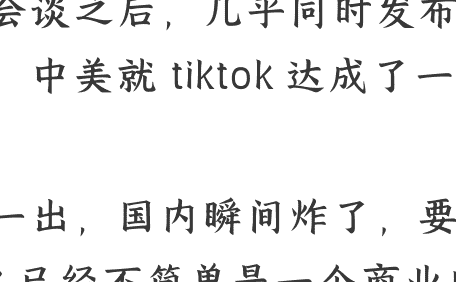

# 250918 文/卢克文工作室嘉宾 星海舰长

**整理：** 公众号懒人搜索，懒人专属群独享
**懒人微信：** lazyhelper

9 月 15 日，中美双方在西班牙马德里举行会谈之后，几乎同时发布了一个消息，中美就 TikTok 达成了一致框架。

消息一出，国内瞬间炸了，要知道，TikTok 已经不简单是一个商业问题了，而是一面代表中国反抗美国压迫的旗帜，其政治意义要远远大于其经济意义。

那么，TikTok 真的要卖了吗？

很多人可能奇怪，这次中美两国都派出了顶级团队兴师动众，难道不应该谈最关键的关税问题吗？怎么谈的是 TikTok 问题？

原因很简单，关税问题可以拖，但 TikTok 拖不了了。

而 TikTok 的禁令延长，是在 6 月 19 日发布的，期限 90 天，9 月 17 日到期。

也就是说，到了 9 月 17 日，如果 TikTok 谈判还没有进展的话，那就只能禁了。

这样一来，特朗普就陷入了两难。禁吧？美国民意反弹实在是太大了。要知道，TikTok 在美国有 1.7 亿用户，占美国一半，而且大部分是年轻群体也是重要票仓，一旦禁了，这帮人肯定要造反。

不禁吧？TikTok 禁令已经延期三次了，如果再延期第四次的话，特朗普会被嘲笑 TACO，所以，就强行加入了 TikTok 议题。果然，在会谈结束后，特朗普马上透露，自己会再次推迟 TikTok 禁令。

那么，中美关于 TikTok 达成了一个新的框架呢？目前，官方一共有三种说法，但各自表述重点有所不同。

特朗普的说法最早，在美国东部时间 9 月 15 日一大早就发出来了：美中双方还就一家“特定”公司达成了协议，而这家公司正是我们国家年轻人梦寐以求的。他们会非常高兴！

主导谈判的贝森特是咋说的呢？他倒是直接点明了 TikTok，他说中美已经就美国获得 TikTok 控制权达成了框架协议，TikTok 的问题“非常接近于”解决，不过具体还要等元首通话才能确认，而且自己不会透露“商业细节”。

## 中美就 TikTok 达成的框架

### 关于股权构成

相比来说，中方的信息量就多了。

中方谈判代表李成钢的说法是，中国政府充分尊重企业意愿，支持企业在符合市场原则基础上，开展平等商业谈判。

而中国国家互联网信息办公室副主任王京涛的说法是，中美双方通过 TikTok 美国用户数据和内容安全业务委托运营、算法等知识产权使用权授权等方式解决 TikTok 问题，达成了基本共识。

通过这三个方面的表态，已经大概能拼凑出这个关于 TikTok 框架协议的全貌了。

首先，特朗普此前“字节跳动需要在 90 日内剥离在 TikTok 的所有权益和资产”的行政令基本上算是破产了。但字节跳动的确会出售部分股份给美国企业，让美国股份拿到 TikTok 内部多数的股权。

#### 股权细节表

| 股东名称 | 持股比例 |
| :--- | :--- |
| 字节跳动 | 39.1% |
| 红杉资本 | 12.8% |
| 软银集团 | 9.8% |
| 大西洋投资公司 | 9.1% |
| 凯雷 | 4.7% |
| 高瓴 | 4.3% |
| 信桥资本 | 2.9% |
| 泰格投资 | 2.5% |
| 春华资本 | 2.4% |

目前，TikTok 股权构成中，字节跳动持股 39.1%，红杉资本是 TikTok 的第二大股东，持有 12.8% 的股份。软银集团是 TikTok 的第三大股东，持有 9.8% 的股份。剩下的是大西洋投资公司持股 9.1%，凯雷持股 4.7%，高瓴持股 4.3%，信桥资本 2.9%，泰格投资 2.5%，春华资本 2.4%。

也就是说，如果美股股东意见一致的话，已经占到了 40.7% 的股权，压住了字节跳动的 39.1%。但美国方面仍然不满足，非要字节跳动再吐出 39.1% 的股份，把股权剥离才行。

中国显然不能答应，卖股份可以，但不能把字节跳动踢出 TikTok 运营。

现在美国方面传出的消息是，由甲骨文公司、黑石集团和亚马逊共同组成 TIKTOK 收购委员会，出资 1000 亿美元，溢价收购 TikTok 的一部分股份（不仅仅收购字节跳动的），最后甲骨文和沃尔玛拿到 40%（甲骨文负责数据存储，亚马逊负责通讯加密安全，以及和社交电商流量打通），黑石集团等私募基金拿到 30%（现在知道黑石集团董事长苏世民为什么访华了吧），现有国际投资者 (如泛大西洋投资) 保留 10.1%。

而字节跳动仍然能保持 19.9% 的股权，并拥有在 TikTok 美国公司独立董事会中任命一名董事的权力。

你可以理解为，中国是用出售 TikTok 的一部分股权，换得了字节跳动没有被从 TikTok 中“剥离”。

首先，关于 TikTok 股份出售的细节，也并不是一卖了之。

请大家注意网信办副主任王京涛的话中两个关键词：**TikTok 美国用户数据和内容安全业务委托运营**、**算法等知识产权使用权授权**。

### 数据托管与算法控制

啥叫美国用户数据和内容安全业务委托运营？

无非就是针对美国人的疑心病嘛，美国人总觉得 TikTok 的用户数据会被中国拿走，有损美国国家安全。但美国用户的数据都存储在美国境内，根本不会传到中国。就这美国人还不放心，非要数据管理权不可。

所以这次的“委托托管”，大概率就是把美国用户数据存储托管给一家美国公司（根据此前的传言，大概率是参考“云上贵州”的模式，由甲骨文公司托管，存储于得克萨斯州的服务器集群），搞个“云上德州”。

那么，是不是字节跳动就失去了这些数据的访问权了？并没有，中国绝对不会让字节跳动放弃这些数据的审计权力。当然，为了进一步打消美国顾虑，中美可以联合建立一个“数据安全联合监督委员会”，由双方技术专家和法律代表组成，每季度审查数据流动日志。

这样一来，美国人总没法再说中国人偷数据了吧？

那么，啥叫“算法等知识产权使用权授权”呢？

简单来说就是，美国可以用字节跳动的算法，但只有使用权，没有所有权。

我们回想一下，2020 年的时候美国要强买 TikTok，当时字节跳动没见过这阵势，差一点就卖了，而中国是怎么叫停这一笔交易的？就是修订了《中华人民共和国出口管制法》，把源代码和算法等将列入管制物项。然后又修改了《中国禁止出口限制出口技术目录》，新增了“基于数据分析的个性化信息推送服务技术”。

这个逻辑很简单，你把 TikTok 卖给了美国，那美国不就拥有你的内容推荐算法了吗？这不就违法了吗？所以字节跳动才老老实实硬起来，坚决不卖了。

现在为了避免核心算法落到美国人手里，中国必须把住这个关口，算法你可以用，但技术的拥有、研发、升级、推送都在我这里，继续卡你的脖子，你想遮掩什么丑闻，最后还是要来求我。

那么，中国为什么选择用控制权的让步，来保证自己的算法所有权呢？

答案很简单，中国要用面子换里子。

在现在这个社交媒体时代，算法能大量推送令人上瘾的内容，形成了所谓的“刷屏效应”，进而潜移默化地影响人的政治倾向，简直是选举的大杀器。

但是看看美国这几个社交媒体呢？

Facebook 的扎克伯格就是个二五仔，ins 更是和民主党关系密切），好不容易特朗普有了 X，现在又和马斯克闹翻了。

特朗普急切需要一个听命于自己的、已经有巨大用户基础的社交平台，这么一来，也只有 TikTok 合适了。

但是呢？TikTok 的控制权对中国来说，其实并没有那么重要，TikTok 又不在国内运营，中国看重 TikTok 无非是因为 TikTok 是个比较好的外宣平台，不会像其他社交媒体一样选择性地黑中国而已，可以展示一个真实的中国。

那么这个“公正客观展示中国”谁说了算？控制权说了不算，算法说了算！

所以，中国哪怕放弃所谓的“控制权”，满足一下特朗普的“赢学”心理，也要把实实在在的“里子”算法控制在手中。

只要算法在手里，还怕美国人翻天么？

### 谈判结果与核心利益

当然，现在我们获得的信息还比较少，有三个关键问题还有待进一步确认。

第一，美国获得控制权的，到底是整个 TikTok，还是美国 TikTok？美国以外的运营权归谁？谁说了算？数据存在哪里？

第二，字节跳动在决策领域还有没有什么特殊待遇？比如说，字节跳动作为创始人、重要股东、算法提供者，总要有点特权吧？

第三，贝森特拒绝透露的“商业细节”到底是什么？居然那么重要，需要两国元首在周五直接谈？

所以，这次的消息，并不是 TikTok 交易的结束，而只是 TikTok 交易的开始，后续扯皮的事情还多着呢。

那么，我们如何看中美这次谈判结果呢？

### 谈判分析

首先，我们可以明确一点，虽然美国看似拿到了心心念念的 TikTok 的控制权，中国也的确让步了，但真的没让多少。

为什么？因为美国拿到的，是一个在美国运营，针对美国人采用独立的内容推送算法（这样特朗普就能在里面做手脚，推送有利于 MAGA 的内容了），只面向美国用户的特供版 TikTok，类似于中国的抖音。

消息放出后，美国那边的反应并不是很多人想象中的弹冠相庆，反而是一连串指责。

很多美国人抱怨，美国用户将不得不使用一款看起来与 TikTok 完全相同，但完全是美国算法、与全球版 TikTok 推送算法完全隔离的“独立 TikTok”。

这是美国一开始想要的么？这是普通美国人愿意要的么？这能算是美国赢了么？

所以现在很多人又都开始骂了，骂特朗普 TACO，不中用，太软弱。

那么依照特朗普的性格，必然要在周五的元首通话中，狮子开大口，索求更多。

这个时候，中方当然要坚定不移维护自身正当权益，但在策略上，也需要有所调整。

那就是，中国要搞清楚，在中美谈判中最想要得到什么？

说实话，中国想要的非常多，比如取消单边加征关税，放宽科技出口管制，维护中国企业合法权益，优化经贸合作机制特别是取消投资障碍，取消限制出口乙烷、大飞机发动机等重型设备，取消对留学生的限制，以及不再支持台独等等等等。

但我们想一想，这些目标都能达到么？显然是不可能的，双方的立场差距太大了。

如果所有都想要，坚持到最后丝毫不妥协，最终的结果一定是谈崩、脱钩。到时候美国那边要受到阵痛，恐怕中国这边也不好受。

中国的目标一直是双赢，而不是双输。所以中国就需要理清楚，中国这些想要的东西里面，哪些是核心利益，哪些是可以用来交换的筹码？

从现在开始来看，中国核心利益是三个：

- 第一是关税。
- 第二是高科技出口。
- 第三是台湾问题。

关税牵扯数千万人的就业和整个社会的稳定，高科技出口关系中美科技竞争的未来，台湾问题更是能决定中美战与和的关键。

说实话，TikTok 虽然对中国很重要，但在优先级上，还比不上这三样。

所以，一个不在中国运营的 TikTok 其实并不算核心利益，如果能换来足够的东西，并不是不能让步的。毕竟谈判本身就是妥协的艺术，不可能一点都不妥协。

考虑到美国是个有什么好消息都嚷嚷出来、对坏消息缄默不语的赢学政府，而中国又是个习惯于“闷声发大财”的嘴严型政府，结果就是谈判一结束，世人皆知中国做出了让步，但中国在谈判中得到了什么，没人知道。

如果中国真的换来了美国在关税、高科技出口甚至台湾上的让步，那么 TikTok 的让步，不仅不算吃亏，反而算是赚了。

所以，我们没必要一听卖股份就义愤填膺地嚷嚷中国跪了跪了，放宽心，中美贸易战打到现在这一步，中国已经完全打出经验来了，强硬但不失灵活，最大程度维护国家利益，才是对付特朗普的最佳方案。

不出意外的是，下一步的谈判中，中美会进入长期性的黑箱时间，外界只能看到结果，但看不透双方处理根本问题的动因和诉求。

所以，中美博弈是长期的，短时间必然看不到结果，暂时妥协和交易，也不影响长期的趋势。我们需要正确看待这次 TikTok，既不能如释重负，也不能如丧考妣。

对我们普通人来说，坚定对美斗争必胜的信心，坚信国家一定会捍卫中华民族的利益，为国家的发展贡献力量，才是一个成熟的大国国民，应该保持的心态。

最后，安利小懒的付费群：

懒人专属群 (介绍)

胆小者才看这张推文

🎲 懒人专属群持续更新中，已持续运营 6 年，整理超 3000 份各类精选付费文章&年费社群干货，全部开放下载。

本资料为付费群内部分享，仅供真实有需要的朋友查阅🙏

懒人专属群更新记录：
https://lazy2025.top/blog/record2

懒人专属群更新记录（需梯子，备用）：
https://lazybook.fun/blog/record2