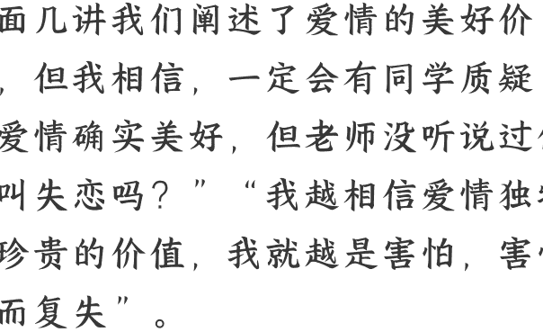

# 13 只愿曾经拥有：爱情的意义在于过程吗？

250918

整理：公众号懒人搜索，懒人专属群独享

懒人微信：lazyhelper

欢迎来到《爱情哲学 30 讲》，我是刘擎。

前面几讲我们阐述了爱情的美好价值，但我相信，一定会有同学质疑：“爱情确实美好，但老师没听说过什么叫失恋吗？”“我越相信爱情独特而珍贵的价值，我就越是害怕，害怕得而复失”。

的确，任何赞美爱情价值的论述，都无法回避一个现实，那就是，一段爱情可能到最后没有结果。就像歌里唱的那样，“爱有多销魂，就有多伤人”。多少热烈而深沉的爱，曾经海誓山盟要到“天荒地老”，最后都发现“说过的话不可能会实现”。

如果认真爱过，分手或失恋都会有伤痛。有些人回看逝去的恋情，仍然会发现和确信其中的积极意义。但也有不少人相信，未能兑现承诺的爱情，就是一次没有结果的失败。那么，这种爱情到底有没有价值？

我必须承认，这是一个非常困难的问题，没有人能给出确切的答案，更无法提供通用的解决方案。但目前在社交媒体上流传着的很多似是而非的观点，在我看来是非常肤浅和片面的。所以，我会用两讲课程来澄清这些谬误，并和你探讨：如何分析和评价那些“没有结果的爱”。

## 如何面对没有结果的爱情

让我们从现实的情景开始。假如你在一场认真的恋情中，投入了大量的时间、精力和情感，但后来还是分手了。然后，一种深重的挫败感淹没了你，你可能感到被人辜负了。那么接下来，你会不知道怎么面对爱情？

当然，爱情的故事千差万别，分手的缘由多种多样，失恋的感受和应对方式，也必定因人而异。如果用简单化的分类，我们可以归纳为下面五种类型。

- 1. 怀疑派：他们从此对爱情心生疑虑，时常陷入迷茫和摇摆，但仍然保持谨慎开放和探索的心态。
- 2. 乐观派：他们康复能力较强，相信每一次爱情都会有所不同，不会因为一次挫败就放弃寻求爱情的期待和努力。有些非常积极的乐观派，甚至会屡败屡战。
- 3. 解脱派：他们经历一两次恋情就好像谈过了全世界的恋爱，断定“爱情根本就是幻觉”。认为放弃寻求爱情是一种解脱，从此着眼于全心全意“爱自己”，或投身于事业发展和其他人际交往。
- 4. 洒脱派：他们仍然向往爱情，但开始转向注重爱情的过程，而不再执着于结果。相信自己只要更洒脱地投入当下，不期望未来，不做任何承诺，也就不会陷入失望和伤痛。
- 5. 务实派：与洒脱派相反，务实派认为没有结果的爱情是得不偿失的，也不值得去探索。他们倾向于寻求更为安全可靠的恋情，能够兑现对未来的承诺。

这五种类型，当然没有穷尽所有的现实选择，而且在实际生活中，一个人面对不同的机遇和情景，很有可能改变自己的倾向类型。但是，就认知意义而言，“洒脱派”的观点，也就是认为爱情的意义在于过程，貌似蕴含着对爱情深刻的看法，比较容易引起大家的共鸣。

这节课，我们就将对此展开分析。

### 反思“过程价值论”

“一段没有结果的恋情是浪费生命，最好不要发生”，这种悲观的态度是可取的吗？

> 洒脱派提出了批判性的回应：曾经“爱过”的经历和体验本身就有意义，如同鲜花的价值在于曾经绽放，而不是最终的凋谢。所以，爱情的价值在于其过程，而不是结果。那么，对待爱情正确的态度是“不求天长地久，只要曾经拥有”。

这种强调过程价值的观点，我们把它叫做“过程价值论”。它听上去很有吸引力，而且可以进行类比论证。想象一下，我们外出旅行，结束后还是回到了家，返回了原地，谁会说这是一次没有结果的失败旅行呢？大概不会。说得更大一些，我们整个人生也是如此。每个人都是“来自尘土、归于尘土”，但这并不意味着人生就是一场毫无结果的徒劳历程。谁会说“早知生命最终消逝，还不如从未降临人间呢？”

你听，这些类比论述似乎很有说服力，但深究起来，它更像是心灵鸡汤，难以应对更深刻的悲观主义质疑。

确实有不少分手的恋人坦言，如果时光能倒流，他们宁愿当初没有相遇。如果用旅行作对比，一次体验极差、远远低于期待的旅行，真的会让许多人后悔，感叹还不如“待在家里”。那么人生呢？也确实有人相信，对人类来说，最好的事情就是“不要出生”，而一旦出生，最好的情况就是“快快死掉”。

这并非庸常之见，而是尼采在《悲剧的诞生》一书中引述的观点，出自智慧的精灵塞勒努斯（Silenus），他是古希腊的酒神——狄奥尼索斯的老师和同伴。同样的，如果这是所谓的无稽之谈，那么加缪也不会《西西弗神话》的开篇，就将“自杀称为唯一严肃的哲学问题”。

那么，终将逝去的爱情究竟有什么意义？如果借用塞勒努斯的见解来看爱情，大概最好的情况就是“不要相爱”，次好的就是“尽快分手”。人最好不要出生，智者最好不进入爱河。这种悲观虚无的观点并不太好反驳，甚至不可能被驳倒。

你看，这就是刚才说的，“过程价值论”没有办法回应悲观主义的质疑，因此，我们就有必要对认识深刻的“过程价值论”，进行反思性的分析。

在我看来，这是一种有益却很片面的观点，优点在于，它不是简单地用“投入与回报”的计算逻辑来衡量爱情，也不只是用最终结果来判断爱情的价值，这意味着它有助于我们超越功利主义的价值观。但是，信奉“爱情的价值在于过程，而不是结果”，并不是化解爱情痛苦的良药。

首先，爱情的过程是千差万别的。

有人说，“你要求我不谈结果、我要结果，我相信了，可问题是，我爱的过程也很痛苦啊！”面对这种情况下，“过程价值论”很难回应，因为它在逻辑上并不能论证每一段爱情都值得投入，许多爱情悲剧恰恰在于过程本身令人痛苦。

当然，许多痛苦体验本身是有价值的，但是，并非所有痛苦都有积极的价值。如果痛苦是由于暴力、虐待、欺骗、操纵和利用所导致，那么这种过程很难具有价值。

这意味着，即便我们在一般意义上信奉“爱情的过程本身就具有价值”，也应该分辨这个价值的优劣，推断有些爱情并不值得投入，甚至不应该开始。

其次，“过程价值论”在理论上将过程与结果做了绝对二分，但两者并不是截然对立的。在一定程度上，它们是相互依存、相互界定的。

比如，分手后又复合的爱情故事并不罕见，一次分手可以是一段关系的结果，也可能是这段关系过程中的一部分。对一段特定的恋情而言，只有在彻底终结的时候，才能相对明确地区分过程与结果。

既然过程与结果并不是截然二分的，于是一个很自然的问题就出现了：如果爱情正处在展开的过程之中，结果尚不明确，那么就不必注重结果吗？并不是。

虽然“作为事实的结果”还未出现，但“作为期待的结果”始终存在于过程之中，并引导着过程的方向。

举个例子：

如果两个人开始了亲密关系，彼此都相信“不要去问将来如何，现在彼此喜欢，开心就好，快乐就好”。这似乎完全没问题。但是，这里的彼此“喜欢”以及“快乐”，究竟是什么意思呢？只是身体的亲密愉悦吗？身体的亲密会有情感和精神的后果吗？如果在这个过程中产生了心理上的依恋、关怀和想念，是需要克制还是任其自然发展？自己快乐的同时，要顾及对方的快乐吗？要在多大程度上重视对方的感受？在这种“只要开心就好”的关系中，真的可以不关心彼此的内心世界和情感状态吗？

实证的社会学调查发现，大部分自诩新颖而轻松的“情景关系”，很难只维持暧昧模糊的状态，要么很快就会露出追求纯粹性关系的动机底色，要么会遇到至少来自一方的疑问：“我们现在到底算什么关系？”这种澄清的要求表明，如果缺乏相对明确的承诺，连过程本身可能都无法维系自身。

在这个意义上，宣扬投身爱情应当“不问结果、只看过程”，可能是一种认知错误，它消解了目标的意义，让感情过程中的承诺、忠诚和未来愿景等，都变得不可理喻了。

人类活动的“当下时光”，总是内在地受到“未来预期”的塑造。实际上，“作为期待的结果”为亲密关系的过程确立了方向性，直接影响着过程本身。以“一夜情”“情景关系”为期待结果的过程，与那些承诺了“天长地久”的情感经历，会有非常不同的当下体验和价值。

同时，最后那个“作为事实的结果”，无论是相守还是分离，都在回顾性的个人史叙事中，构成了对感情过程的价值评估要素。

### 总结

总结一下：

真正的爱情大多都期待天长地久，正如父母都希望自己生养的孩子能够长大成人。但“人有悲欢离合，月有阴晴圆缺，此事古难全”。现代社会更是如此，天长地久的爱情是可遇、可求但十分难得的。如果承诺未能兑现，整个爱情的经历就没有意义了吗？

对于这个问题，如果仅仅关注过程，而无视结果的意义，这在认识上是片面的，也无法真正抚慰爱情的伤痛。但更恰当的主张是：爱情的过程具有重要价值，但过程的意义离不开对未来的期待。对未来的承诺是爱情意义的重要来源，但如果最终未能实现期待的结果，爱情可能仍然具有重要的价值。为什么呢？我们下一讲继续探讨。

### 思考题

最后，让我们做个思想实验，想象一下：为了拯救爱情苦短的悲痛，有一个天使大发慈悲，发明了一个魔法，能让爱侣永不分手。你愿意接受这个魔法吗？你会犹豫吗？为什么？
欢迎在留言区讨论。

我是刘擎，我们下节课再见。

最后，安利小懒的付费群：

懒人专属群（介绍）

懒人专属群持续更新中，已持续运营 6 年，整理超 3000 份各类精选付费文章 & 年费社群干货，全部开放下载。

！**本资料为付费群内分享，仅供真实有需要的朋友查阅** 👻

### 懒人专属群更新记录：

https://lazy2025.top/blog/record2

### 懒人专属群更新记录（需梯子，备用）:

https://lazybook.fun/blog/record2