# 26 岁裸辞回乡 All In AI 一年多，我后悔了吗？

250918 生财精华

公众号懒人搜索，懒人专属群独享

懒人微信：lazyhelper

假装 😎

公众号：懒人搜索 懒人专属群

微信：lazyhelper

大家好，我是袋鼠帝。

一个从云南昭通小县城走出来的人，

一个深漂了 5 年的程序员。

2023 年底，我做了一个决定，一个至今想起来都觉得无比正确的决定：裸辞，离开深圳，回昆明，All In AI。

为什么要走？

一是因为工作压力巨大，年终奖像天边的饼，永远也吃不到嘴里；

二是我厌倦了那种一眼就能望到头的工作、生活状态，感觉再待下去，整个人都会生锈。

在大城市狭小的钢筋水泥窝里，我已经很久没有感受到任何真正的快乐了，只剩焦虑和疲惫，总之，心很累。

我想自救，我觉得跑起来，总归是有风的。

时间拉回到现在，据说第一批做 AI 的人回去打工了。

但今天想给大家聊一聊，26 岁从深圳公司裸辞 All In AI 的一年多，我是怎么坚持下来，又是怎么活到现在的（后悔是不可能后悔的，我觉得超爽）。

目前我主要在做 AI 领域的公众号，从 24 年 4 月到现在分享了 211 篇原创内容，总阅读量 330 万左右，不过，可能还没大 V 一篇爆款文章的阅读量高吧。

袋鼠帝 AI 客栈

持续分享 AI 实践干货，走超级个体崛起之路

211 篇原创内容

3064 个朋友关注

视频号：AI 袋鼠帝

[已关注]  [发消息]

#微信接入 AI #dify #agent #知识库

#n8n #ragflow #coze #fastgpt

#AI 编程

但在 AI 赛道，却让我多次进入个人 AI 公众号排行榜前十。

## AIGCRank AI 公众号排行榜

### 自媒体

2025 年 3 月
数据支持：新榜

| 排名 | 公众号 | 发布 | 总阅读 | 平均阅读 | 总点赞数 | 新榜指数 |
| :--- | :--- | :--- | :--- | :--- | :--- | :--- |
| 1 | 数字生命卡兹克 Rockhazix | 24/25 | 83 万+ | 33148 | 26268 | 823.2 |
| 2 | 赛博禅心 BinaryBodhi | 24/24 | 37 万+ | 15216 | 10420 | 774.7 |
| 3 | 袋鼠帝 AI 客栈 masterlhm | 18/18 | 14 万+ | 7907 | 1826 | 714.3 |
| 4 | 探索 AGI gh_1417326d90b8 | 27/30 | 15 万+ | 4847 | 1270 | 708.2 |
| 5 | 沃垠 AI WoYin-AI | 23/24 | 14 万+ | 5805 | 1794 | 708.1 |
| 6 | 胡说成理 hushuochengli | 5/5 | 26 万+ | 52180 | 3235 | 702.1 |
| 7 | AGI Hunt AGIHunt | 86/88 | 15 万+ | 1711 | 1683 | 698.1 |
| 8 | 归藏的 AI 工具箱 op7418ux | 26/26 | 11 万+ | 4266 | 3498 | 696.6 |
| 9 | 快刀青衣 kuaidaqingyi520 | 5/5 | 6 万+ | 12712 | 753 | 690.4 |
| 10 | 花叔 WatsonBM | 16/16 | 9 万+ | 5744 | 1543 | 689.1 |
| 11 | AI 修猫 Prompt aixiumaoprompt | 19/19 | 9 万+ | 4729 | 1227 | 688.0 |

## AIGCRank AI 公众号排行榜

### 自媒体

2025 年 4 月
数据支持：新榜

| 排名 | 公众号 | 发布 | 总阅读 | 平均阅读 | 总点赞数 | 新榜指数 |
| :--- | :--- | :--- | :--- | :--- | :--- | :--- |
| 1 | 数字生命卡兹克 Rockhazix | 18/19 | 80.1 万+ | 42177 | 22724 | 823.2 |
| 2 | AGI Hunt AGIHunt | 58/64 | 20.2 万+ | 3152 | 1675 | 726.2 |
| 3 | 网罗灯下黑 wldxx8 | 10/19 | 17.4 万+ | 9137 | 1405 | 721.5 |
| 4 | 赛博禅心 BinaryBodhi | 29/31 | 17.5 万+ | 5660 | 2937 | 717.4 |
| 5 | Genji 是真想教你会 Genji-PS | 1/1 | 8.5 万+ | 85385 | 588 | 712.2 |
| 6 | 归藏的 AI 工具箱 op7418ux | 28/30 | 13.3 万+ | 4442 | 3741 | 702.9 |
| 7 | 沃垠 AI WoYin-AI | 22/23 | 12.6 万+ | 5472 | 1599 | 702.3 |
| 8 | 郭震 AI alg-channel | 9/11 | 10.6 万+ | 9634 | 2182 | 701.6 |
| 9 | 胡说成理 hushuochengli | 8/8 | 29.5 万+ | 36841 | 931 | 700.0 |
| 10 | 袋鼠帝 AI 客栈 masterlhm | 17/17 | 10.8 万+ | 6362 | 1678 | 695.2 |
| 11 | 卡尔的 AI 沃茨 LearnPrompt4Free | 20/20 | 10.4 万+ | 5209 | 2087 | 693.6 |

### 推荐文章 | 今日待办

#### xm

9-24.28
2024/2/5

--
1. **饿了么**：午餐优惠来一波
   - 📚 推荐书籍：《六人晚餐》
   - 📖 链接：[推荐链接](https://tuku.m.taobao.com/list/node/387029353)

2. **美团**：外卖新人的福利
   - 📚 推荐书籍：《美食家的餐桌》
   - 📖 链接：[推荐链接](https://tuku.m.taobao.com/list/node/387029354)

3. **盒马**：生鲜超市的新品推荐
   - 📚 推荐书籍：《吃货的修养》
   - 📖 链接：[推荐链接](https://tuku.m.taobao.com/list/node/387029355)

4. **盒马**：水果的挑选技巧
   - 📚 推荐书籍：《水果的奥秘》
   - 📖 链接：[推荐链接](https://tuku.m.taobao.com/list/node/387029356)

> 一份也不缺
> 点赞 + 在看，让你的朋友圈里多一份‘内卷’感


```
1
```

## AI 公众号排行榜
**AIGCRank®**  **2025 年 7 月 自媒体榜单**

| 排名 | 公众号 | 发布数 | 总阅读数 | 平均阅读 | 总分享数 | 总在看数 | 新榜指数 |
| :--- | :--- | :--- | :--- | :--- | :--- | :--- | :--- |
| 1 | 数字生命卡兹克 | 26/26 | 107 万+ | 41042 | 55742 | 7608 | 836.5 |
| 2 | AGI Hunt | 85/86 | 37 万+ | 4261 | 22016 | 1405 | 752.5 |
| 3 | 网罗灯下黑 | 10/19 | 20 万+ | 10333 | 4126 | 318 | 734.3 |
| 4 | 快刀青衣 | 7/7 | 11 万+ | 15949 | 9357 | 1910 | 729.5 |
| 5 | AI 故事计划 | 7/7 | 15 万+ | 20868 | 5176 | 512 | 724.1 |
| 6 | 十字路口 Crossing | 17/17 | 16 万+ | 9692 | 15572 | 5807 | 722.8 |
| 7 | 归藏的 AI 工具箱 | 41/41 | 18 万+ | 4493 | 12606 | 1400 | 719.1 |
| 8 | 袋鼠帝 AI 客栈 | 15/15 | 13 万+ | 8648 | 12800 | 1110 | 711.2 |
| 9 | JackCui | 15/15 | 14 万+ | 9016 | 6565 | 583 | 707.3 |
| 10 | 卡尔的 AI 茨茨 | 23/23 | 12 万+ | 5197 | 11344 | 2473 | 702.0 |
| 11 | 沃眼 AI | 19/20 | 12 万+ | 6042 | 5077 | 623 | 699.0 |
| 12 | 哥飞 | 26/26 | 12 万+ | 4665 | 4310 | 285 | 695.2 |
| 13 | AI 信息 Gap | 28/28 | 11 万+ | 3842 | 3938 | 239 | 691.4 |
| 14 | 刘小排 r | 10/10 | 9 万+ | 8812 | 8686 | 631 | 691.3 |
| 15 | 赛博禅心 | 15/15 | 9 万+ | 6052 | 6197 | 590 | 685.0 |

那么做这样一个 AI 领域的公众号收入怎么样呢？

坦白说，24 年一整年，靠公众号的收入，不到一万。

而今年到现在为止，我靠公众号的收入翻了至少 10 倍。

虽然不多，但我觉得也算成功了，成功实现了我短期的目标。

这篇文章经过我的反复打磨，有点长，但绝对值得一读。

如果你也对做公众号起号，或者对“一个普通人怎么 0 成本创业”这件事感兴趣，这篇文章，绝对能让你少走 90% 的弯路。

有一些小成绩后，时不时会有朋友来问我，做 AI 自媒体 (或者说公众号) 真的赚钱吗，普通人现在入场还有没有机会？面对这些问题，我真的...一两句话很难说清。

正好前几天，生财有术的朋友找到我，想邀请我去星球里，分享一下我做 AI 自媒体的经历。

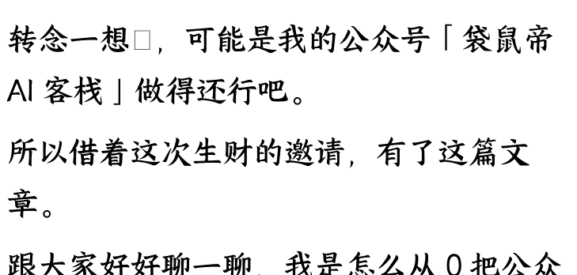

说实话，我有点受宠若惊。转念一想，可能是我的公众号「袋鼠帝 AI 客栈」做得还行吧。所以借着这次生财的邀请，有了这篇文章。跟大家好好聊一聊，我是怎么从 0 把公众号做起来的，以及我是怎么通过公众号赚到钱的。先给大家看个东西。

| 日期 | 收入 (元) |
| :--- | :--- |
| 2024-02-20 | 1,869.28 |
| 2024-03-19 | 2,066.42 |
| 2024-03-18 | 1,670.71 |
| 2024-03-17 | 1,745.09 |
| 2024-03-16 | 2,052.77 |
| 2024-03-15 | 1,467.27 |
| 2024-03-14 | 806.89 |

| 日期 | 总收入 (元) |
| :--- | :--- |
| 2024-03-19 | 2,155.64 |
| 2024-03-18 | 1,990.94 |
| 2024-03-17 | 1,627.60 |
| 2024-03-16 | 1,951.16 |
| 2024-03-15 | 2,106.17 |
| 2024-03-14 | 1,351.31 |
| 2024-03-13 | 869.79 |

上面这个是某个公众号流量主的收益截图
（当然，不是我的）

这个收入，我相信对于大多数朋友来说都算得上可观吧。

而且如果你运营了 10 个，甚至 100 个这样的号呢？

算一算，很心动吧？！我当时看到，感觉醍醐灌顶，鸡皮疙瘩立马就起来了。

24 年最开始的三个月，我主攻抖音和 B 站，每天吭哧吭哧地研究选题、学习剪辑，也搞了点流量，但一分钱没赚到。

那段时间很迷茫，就像独自一人在没有路标的旷野上开车，不知道方向在哪。

直到去年的 4 月份，我被上面那组数据影响，从抖音转战到了公众号。

大家不妨先猜一下，一篇 200 多万阅读量的公众号文章，（还是开启了文中广告的情况），流量主的收益有多少呢？

说道这个，我不得不泼一盆冷水

我替大家试过了，一篇 200 多万阅读的公众号文章只有 7000 多的收益...

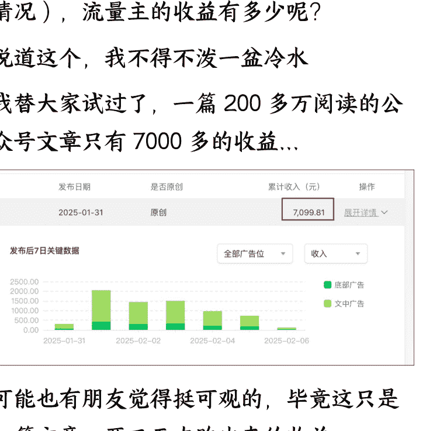

可能也有朋友觉得挺可观的，毕竟这只是一篇文章，两三天内跑出来的收益。

但是你不知道一篇 200 万 + 阅读量的文章有多难。

其实，今天，我想跟大家聊的，不是怎么靠公众号流量主赚钱。
毕竟我从做公众号到现在，流量主加起来的收益也就才下面这点：

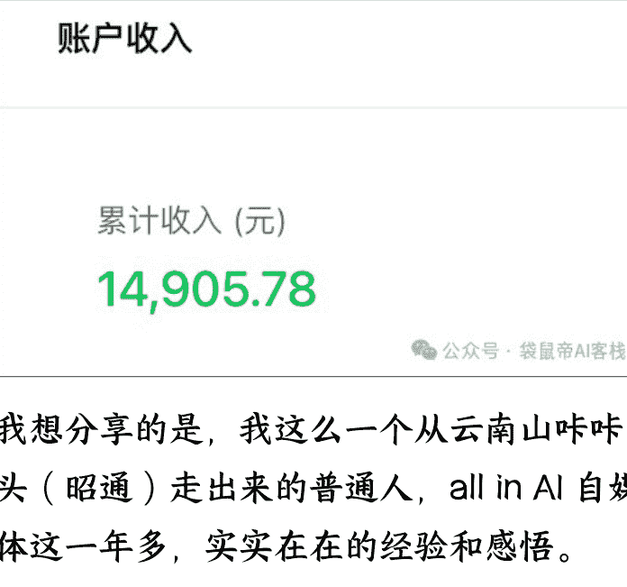

我想分享的是，我这么一个从云南山咔咔头（昭通）走出来的普通人，all in AI 自媒体这一年多，实实在在经验和感悟。
这里面没有一夜暴富的神话，只有一些个踩坑、爬坑的故事。
如果你是一个想靠投机取巧赚快钱的人，
可以先关掉这篇文章了。

但是，如果你也对做公众号起号，或者对
“一个普通人怎么 0 成本创业”这件事兴
趣，这篇文章，绝对能让你少走 90% 的
弯路。

可能也有朋友会问：公众号都存在那么多
年了，还有搞头吗？？
其实我刚开始也有这种疑问，误打误撞，
慢慢做到现在。


直到现在我还是觉得公众号非常值得做，
我也庆幸当时发展了公众号，有几点优
势：

1. 公众号现在是公域流量，背靠庞大的微信用户；

2. 公众号文章靠着朋友圈，社群传播起来也非常方便；

3. 公众号的读者大部分都是高质量人群，老板，高管，创业者很多；

4. 公众号很开放，限制相对来说是最宽松的，可以随便放二维码，链接等等。

所以，公众号的一篇文章，价值还是很高的。

我认为公众号上面 1 个阅读，至少抵得上抖音的 10 个播放。

而且公众号对新号的流量扶持一直都很不错，新手友好。

如果你还想听一听我的故事，就请继续吧

## 从县城到深圳，再回昆明

我的故事，得从我这个人说起。

我是一个在云南昭通长大的娃，一个真正意义上，大山里的小县城。

父母从小就告诉我教育，靠人靠天不如靠自己。

小时候我有点调皮，学习一般。

不过，最终还是考上了一个普通的一本。

我还清楚地记得，在大学拍完毕业照的第二天，我把所有行李打包寄回家，就买了一张飞往深圳的单程机票。

当时的我，有种迟来的觉醒，觉得大学四年没学到太多真本事，必须去一线城市，边打拼边积累经验。

因为早年父母还未结婚前曾一起在深圳打拼过，所以我也想到我诞生的城市看看。结局就是找不到工作，最终只能选择贷款 2 万多，参加了一个为期半年的程序员培训班。

那段日子，应该是我 最苦，也是最拼的阶段之一。

住在 8 人间的宿舍，上下床，环境很差，床板上甚至还会长臭虫，半夜睡着睡着，感觉有东西在身上爬，一巴掌拍死，满手的血。

不过那样的环境里，我的学习欲望却被激发到了极致。

我每天几乎第一个到教室。半年的培训，我走神的时间加起来可能都不到 5 个小时，经常为一个 bug 熬到凌晨两三点。

但那种解决问题后的成就感，是我以前很少体验到的。

随后的五年，我先后在四家公司就职，做 Java 开发。

第一家公司是一个只有十几个人的境外电商公司，天天疯狂加班。


作为团队最年轻的牛马，经常通宵是我的常态。

半年后，公司因为疫情倒了。

之后在一家汽车行业的公司干了一年多，
因为不涨薪资，跳槽到了编程猫，以为能
稳定下来，结果半年不到，遇上 K12 政策
落地，公司裁员一半，我"幸运"的出现
了名单里。

最后，我去了一家证券公司，工作了两年多。

后来就是大家熟悉的剧情了，疫情结束后
股市一蹶不振，入职前说的年终奖像个永
远吃不到的大饼，工作压力却与日俱增，
那种一眼望到头的工作生活状态，让我彻
底厌倦了。

23 年底，我做了一个重要的决定，裸辞，
离开深圳，回到昆明。

我的前半段职场生涯，充满了奔波和不确定性。

没有光鲜的履历，没有大厂的背景，没有🐮 的 title，也从来赶不上好事儿（95 后真的太惨了），没什么人脉，更难受的是没啥钱。

这，就是我 all in AI 之前的全部家底。

讲这些，我只是想告诉大家，我就是一个普普通通的人，我可以做的事情，相信你们更可以。

> / 当自由的风，撞上现实的墙

回到昆明后，我成为了一个数字游民，我也给自己定了一个很轻松的目标，24 年，平均每个月能赚到 2000 块，就算成功。

离职之前我就计划做 AI 自媒体了

首先，我认为自媒体是最适合普通人，0 成本创业的最好途径，自媒体的杠杆也是非常高的。其次我认为 AI 是未来 10 年的巨大风口，所以我选择做 AI 自媒体。

我快速梳理了以下几个问题的答案，就开始了

+ 1. 我是谁？（精准人设）
2. 我为谁服务？（目标受众画像 - 越细越好）
3. 我能提供什么价值？（价值主张）
4. 我的目标是什么？（短期＆长期）

最开始的三个月，我主攻抖音、B 站这些视频平台。

剪辑手法捞的不谈...

剪辑其实是锦上添花，前期要多花时间在选题，和视频节奏上（也就是怎么留住观众，增加完播率）。

用最小可执行原则去做，避免前期把时间精力花在不重要的地方。

那 3 个多月还是搞了一些流量，积累了一些粉丝，但是一分钱没赚到。

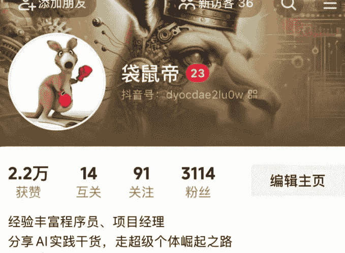

当时某个 AI 群里有个大佬，发了几张公众号流量主收益的截图（就是文章开头的截图）

他的目的是想在群里找能做 AI 洗稿的人合作

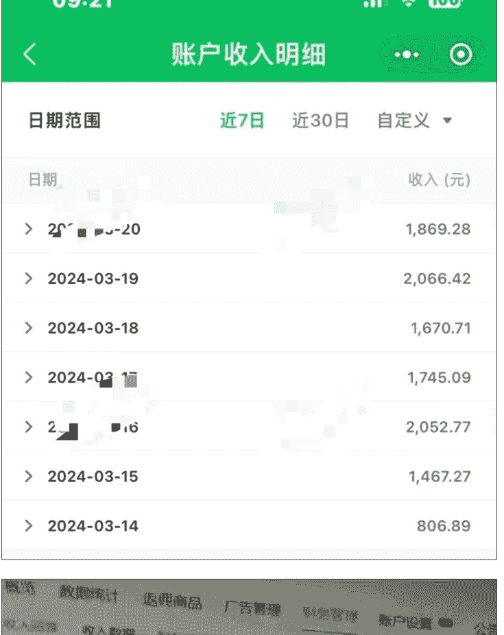

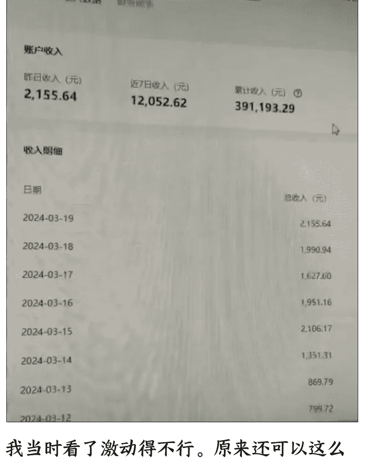

我当时看了激动得不行。原来还可以这么玩，我搞个全自动的不得起飞了？

感觉自己马上就要 rich 了。

爆肝两天，通过 ChatGPT 开发了一个
Python 写的 AI 洗稿工具，可以通过 AI 批
量洗稿，然后把文章直接存到公众号的草
稿箱。

就这样，我开始了我公众号洗稿之路。
同时我也免费给那位大佬的团队使用，顺
便收集反馈。

我最开始的 10 几篇文章，基本都是这么来
的。

我当时天真的以为，只要像那位大佬说的
一样，连续发文半个月，就能进流量池，
然后就可以疯狂堆量，搞矩阵号，从此走
上人生巅峰。

我坚持每天更新，坚持了快一个月。

结果，被现实打脸了。

那段时间，我的文章阅读量，一直都只有
可怜的几十，几百。

我每天早上起来都会先打开流量主，看一
看收益我丢，这点阅读量产生的收益连瓶可乐都买不起...

| 发布日期 | 是否原创 | 累计收入（元） | 操作 |
| :--- | :--- | :--- | :--- |
| 2024-04-09 | 原创 | 0.03 | 展开详情 ▼ |
| 2024-04-09 | 原创 | 0.61 | 展开详情 ▼ |
| 2024-04-10 | 原创 | 0.18 | 展开详情 ▼ |
| 2024-04-10 | 原创 | 0.04 | 展开详情 ▼ |
| 2024-04-11 | 原创 | 1.03 | 展开详情 ▼ |
| 2024-04-11 | 非原创 | 0.09 | 展开详情 ▼ |
| 2024-04-13 | 原创 | 0.22 | 展开详情 ▼ |
| 2024-04-13 | 原创 | 0.28 | 展开详情 ▼ |
| 2024-04-14 | 原创 | 0.51 | 展开详情 ▼ |
| 2024-04-14 | 原创 | 0.02 | 展开详情 ▼ |

后面从那位大佬那儿了解到，貌似公众号对 AI 洗稿文章开始严打了，不会给推荐流量。

他那些用 AI 洗稿的同行流量也不行了。

所以，我发现流量主这个项目，对我来说并不是长久之计，平台机制一直在变，可能短期赚一笔还行，并不能当做一个长期项目来做。

PS：后面那位大佬也退出了这个赛道，因为公众号推荐流真的无法预测其机制。算法也一直在改进，和变化...

不过，我发现公众号非常开放，可以随便贴链接，二维码，而且是最方便引流到微信的平台（不像抖音和小红书，特别是小红书，跟做贼一样）。

去年 3 月份，我的小红书 3000 多粉账号莫名其妙被永封，我只是在上面发了一些 AI 相关的内容而已

于是，我开始尝试着自己手写文章。

手写了篇几篇之后，竟然就爆了一篇 10 万 + 阅读的文章。

### 第一篇 10 万 +，被世界看到的感觉原来是这样


我到现在还记得当时的心情。

我隔一会儿就忍不住打开手机看一眼，阅读量跨跨上涨，一小时几千的涨。那种感觉，真的太爽了，是一种被世界看到，被无数陌生人认可的满足感、和成就感。

这也给了我极大的动力

我立马复盘，为什么这篇文章能爆？

我找到了一个简单的爆款公式：当前热点 AI 工具 + 国民级应用场景 + 喂饭级的实操教程。

当时的热点 AI 是 Kimi 和 Coze。

最近的热点是 NanoBanana 和 seedream4.0（不过没那时候的它们火），我也知道，我现在写一篇 seedream4.0 接入微信，大概率也会爆，但是我并不想一辈子写这玩意。

我在 2022 年也写过一段时间的技术文章，之前有个误区，就是总想写深度技术文，拆源码，讲底层，觉得这样才🐮🍺，结果没人看。

因为太深了，大部分人不爱看，也看不懂。

所以，我给自己的内容定了调，不写纯技术，而是找场景：找有趣的，实用的，甚至有点黑科技的场景。然后把这些场景，和当前最火的 AI 工具结合起来，用最简单直接的方式，写成大多数人都能上手的教程。

一个很重要的心态是：千万不要妄自菲薄。

不要觉得某个东西自己知道了，就觉得全天下都知道了，写出来没有价值。

信息茧房，比我们想象的要坚固得多。你认为的"大家都知道了"，在很多人那里，可能就是信息差。

只要你花了心思，你写的内容，大概率就是有价值的。

当然即便是在初期，还是要保证一定的内容质量的。

自从我手写之后，我的一篇内容，从找选题，到写完，定标题发布，至少也要花 3-4 个小时。

现在更是要花 1-2 天，我真的狠用心在做。

公众号一篇文章能不能爆：选题占 50%，标题占 30%，内容占 20%。

选题和标题决定了这篇文章的流量下限，内容决定了上限。

毕竟内容如果足够优秀，点赞、转发、在看、完读率等数据才会高，从而更容易被系统推荐。

不过，选题和标题对味儿了，内容就算一般，流量也不会差。

注意：不要标题党（也就是标题和内容完全对不上）

但是呢，我们还是要不断优化、打磨内容，提高质量，这有助于后续打造个人 IP，留住更多的读者，账号也才能得以长久发展。

对于大部分普通人来说，做自媒体初期，我建议先注重搞流量，也就是注重选题和标题。

毕竟没有流量，内容写的再好也很难传播出去，而一篇精心打磨的文章发出去之后石沉大海，是非常打击积极性的一件事。

所以先搞流量，有助于保持你长期做这件事情的积极性，也是坚持做下去的重要动力之一。

这跟创业做产品是很像，先做 MVP 产品去试错，而不是一上来先自嗨式的花很多时间去做一个自认为很牛逼的产品。

那么初期怎么找选题呢？

有一个小技巧，是去一些数据平台，比如「次幂数据」，找那些粉丝不多，但文章阅读量很高的低粉爆款文章。

所谓他山之石，可以攻玉

别人已经验证过的爆款选题，你用自己的风格和理解重新创作，大概率也会爆。

甚至同一个爆款标题，连续用，也能爆...

起号初期，很多时候也需要找对标账号"抄"。

当然，不是原封不动地抄袭，而是抄选题，抄思路，借鉴优点，然后融入自己的东西（也算是一个学习的过程）。

所以我在 24 年写的一些内容，虽然很少有 10 万 +，但好些文章流量都还不错。

## 吊打 Kimi Copilot? 豆包的海外胞弟：Cici, 墙裂推荐的神级浏...

## 哇塞！Kimi 还能一键绘制思维导图

## 超万人使用！Kimi Copilot

## Ollama 一键部署! 开源部署神器：docker-desktop, 小白也能...

## 独家！Kimi 接入个人微信（三）部署篇


## 独家！Kimi 接入个人微信（二）chatgpt-on-wechat

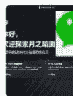

## 独家！Kimi 接入个人微信（一）Kimi API

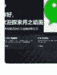

## 最强 AI PPT 制作，你不用动，它全自动

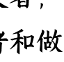

慢慢地，我的账号吸引了一批开发者，动手能力强的小白，还有很多创业者和做私域的朋友。

友情提示：前期也不用花太多心思在排版上，只要让人看着赶紧舒服即可。

至于文章封面，我现在会用 seedream4.0 来生成。

做得多了，网感就慢慢培养起来了。

有时候一个选题，一个标题，看一眼，大概就能知道它会不会爆。

当然，也有翻车的时候，这时候就要去复盘，去分析。

在 24 年底，公众号也帮我小小的回顾了一下我一整年的成绩。

## 你的内容被看过

68 万次

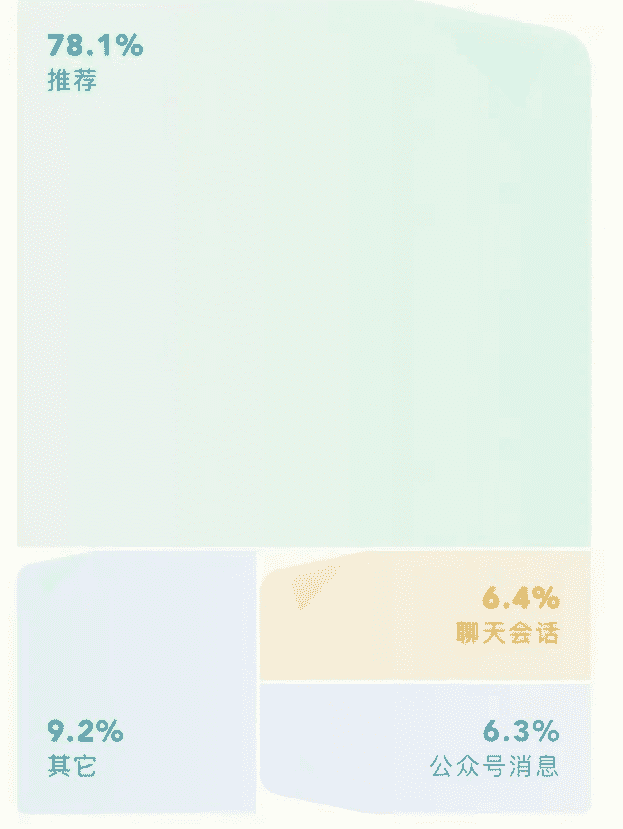

整个 24 年，我其实过得挺随性的，没时间就不更新，8 月份还自驾游，断更了一个月。

24 年会在私域卖点小产品（AI 辅助写的小产品，比如 AI 配音工具）、接一些 AI 定制开发的单子，还会偶尔接一些图文、视频（当然，广子也不是乱接，要筛选，真的有价值，有亮点的那种才接）。

这一切都是建立在流量的基础上。

24 年赚的真的不多，但也超额完成了月均 2000 的目标。

24 年底我的微信 AI 助理桌面版项目（耗时一个多月开发）逐渐烂尾，我也逐渐把重心转移到公众号上。

## >/ 等风来，做风口的猪

这个决定，让我在过年那段时间，结结实实吃到了一波时代红利。

今年春节，DeepSeek 突然爆火。我当时看 DeepSeek 的微信指数涨疯了，立马就意识到，这是千载难逢的流量红利期。

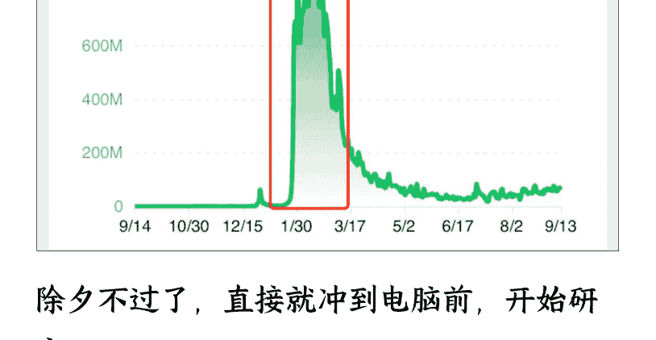

除夕不过了，直接就冲到电脑前，开始研究。

### 几个月的阅读量突然上涨

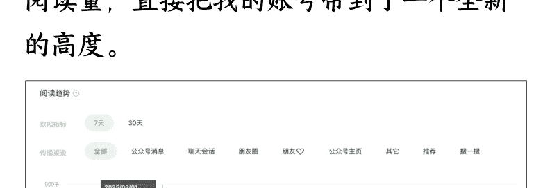

灵感很简单，我看到 B 站上，有个粉丝很少的账号发了一条 DeepSeek 接入微信的视频，直接 100 万播放量！

我马上就想到，我之前写微信接入 AI 就很火，加上 DeepSeek 绝对是一篇 10 万+

我有预感会爆，但是没想到会这么爆..

除夕夜发布后，几天时间，涨了 200 多万阅读量，直接把我的账号带到了一个全新的高度。

那个阅读量，几分钟没看，就又涨好几万。虽然涨的不是余额，但是也是巨爽的一种体验～

我 24 年一整年的总阅读量才 60 多万。

这一篇文章，抵我正常情况下干 3 年多。

持续的普通的日更，远不如一篇精心策划的爆款。

## 爆款，才是账号增长的核心。

而爆款，往往需要时机。纵观 AI 高速发展这两年多，真正出圈的流量红利期其实就那么几次：

23 年初的 ChatGPT

24 年初的 OpenAI Sora

25 年初的 DeepSeek

还有 25 年 3 月的 manus，也算一个小红利期。

我的经验是，你要保持一直在牌桌上，才能在机会出现时，第一时间抓住它。（一直在，等风来）

我当时就只发了公众号，视频没跟上，现在想起来还有点可惜。

下面是公众号那段时间前后的常读用户变化情况，可以看到二月份增长了几乎 10 倍。

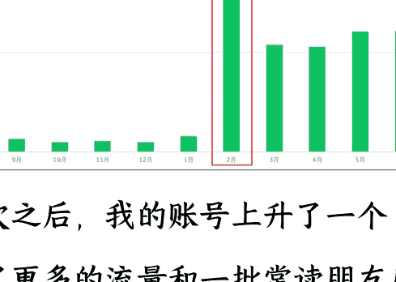

那次之后，我的账号上升了一个 level

有了更多的流量和一批常读朋友后，我开始转变思路。

不能再把重心放在追求流量上，我要进一步优化内容质量，把重心放在打造个人 IP（Personal Intellectual Property）上。

我逐渐砍掉了之前那些定制业务，因为我发现一个人从需求对齐，到验收，售后，整个交付流程太长，也比较繁琐。开始真正 all in 公众号，想看看专注做一件事到底能走多远。

这个过程中，受邀参加了一些大厂的线下活动，也认识了很多圈内的大佬，面基了

很多原来的网友（我之前基本上是没有啥圈子的，自己一个人埋头做）。

## 新的焦虑和困境

我这两天刷抖音，看到一个观点，我觉得很有意思，也有一定道理，他说：这个世界上最 TM 恶心的一句话就是，把自己的兴趣找到，然后把它变成自己的事业。

我现在就很有感触，因为其实 24 年我在做公众号的时候，更多的是一种探索未知，然后时不时会有一些正反馈（可能是流量，可能是来自大家的认可），所以我创作起来非常有激情，有很多灵感爆发的瞬间，分享欲爆棚，创作效率也非常高。

但是当你正式 All in 公众号的时候，你就会开始以结果为导向，那么你的所有动作都是要得到一个结果的，比如涨粉，流量，影响力，money 等等。

这个时候整个性质就开始变化了。

所以，当我 All in 公众号几个月之后，随之而来的是新的焦虑，导致我基本上失去了创作激情，我开始变得被动，明明有很多事情等着我去做，可是我就是懒得去做，我会开始拖延，变得懈怠。

PS：但我的文章质量其实更高了，每一篇内容，都是我花了大量时间、心思创作出来的，真是燃尽了。

有流量焦虑，害怕阅读量下跌。

一片几万阅读的文章，在过去能让我开心一整天，现在却没什么感觉，甚至有点失落。

从数据上来看，我从 DeepSeek 那波过后，貌似没有太大的进步。

但其实是有一些进步的，后面几个月，公众号在 AI 板块基本上没啥流量倾斜了，而我却能够做到保持，也让更多人知道了袋鼠帝这个 IP。

然后，感觉圈子里的人一个比一个卷，半夜三点都有人还在追热点。


我甚至开始有了能力焦虑，接触的大佬越多，越觉得自己普通，有点自惭形秽。

我也一直在调整心态，最近好一些了。

我想把我的几点思考，分享给可能正处于同样困境，或者将来会进入这种困境的你。

第一，人生在于体验，而不是竞赛

### 第二，压力的来源是恐惧。恐惧流量下跌，害怕不被认可。而我对抗这种恐惧办法，就是保持一种无所谓的心态。

我经常告诉自己，大不了，就回去继续找个班上，又饿不死。

出来的人，又怎么可能再回去上班呢，不可能的，哈哈哈。我只能不断给自己一些心理暗示。

当你不再害怕失去的时候，才能真正地轻装上阵，而轻松上阵之后，相比压力重重的人做一件事，更能事半功倍。

### 第三，找到你的动力来源。

我能坚持下来，不是因为我本身多自律，多有毅力，也不是靠梦想，而是因为我在分享 - 反馈 - 成长这个循环里，找到了巨大的乐趣和成就感。

突然做什么事都有了动力
整个人突然之间就强大了起来

这种主动的，发自内心的热爱，以及源源不断的正反馈，才能让我心甘情愿的废寝忘食，并且乐在其中。

大家在做任何事情的时候（包括学习），一定要找到这种源动力，让自己主动去做，而不是被动做事，被动永远是反人类的，是会产生抵触心理的。

铁子们，你们的三连就是我最大的动力～

但以上三点，对于最近的我来说，不过是心理暗示罢了，貌似也没有起到多大作用...

直到这周末，我刷了影视飓风在 19 年的一条爆款视频（Tim 讲了他过去 5 年做自媒体的收入，经历）

https://www.bilibili.com/video/BV13t41IIt7/P6/?spm_id_from=333.1387.search.video_card.click

我从来没有因为一条视频而泪流满面，这几乎是不可思议的事情，但是在看这条视频的时候，我完全没法抑制情感、眼泪。被狠狠的共鸣了。

Tim 在 19 年遇到了跟我现在差不多的困境，变得懒，没有了创作激情，而 Tim 的经验是撕掉身上积累起来的标签，做自己。

这里的标签，我理解是大家给我的定义，对我的期待，我被这些东西给框住了。就像亚细亚旷世奇才歌词里面写的，杀死人的从来不是挫折而是期待（不管是别人的期待，还是我对自己的期待）。

接下来我想大胆的回归自我，跳出标签的条条框框，因为我也从来没有觉得单纯写教程是我这辈子想做的事。

我想要做更多我喜欢，能够点燃我激情的内容创作。

同时我也决定去看看 19 年的 Tim 提到的帮助他走出困境的两位创作者的内容，Dan Mace 和 Yes Theory（虽然现在还没看）。

相信我应该能很快走出困境，如果我成功了，我再给大家分享《下》。

本期内容也是我的一个新的尝试，希望分享一些不一样的内容，也希望大家能在评论区给我一点反馈（那对我非常重要，感谢🙏）。

不知不觉，写了快一万字，这应该是我公众号 200 多篇内容里面最长的一篇，如果你能读到这里，我相信你一定是我的铁粉，非常感谢你的支持～

另外，现在我也还在个人 IP 的探索、学习中，所以这篇文章没法分享太多 IP 的经验，不过推荐大家去看一本书《1000 个铁粉》

可以下电子书来看，喜欢读纸质书的朋友也可以买纸质版（当然我也会获得一份佣金）。

现在我的主要变现来源相对单一，因为 All in 公众号了，所以主要靠公众号接商单（我的商业化，其实做得很一般）。

不过，我总结下来，公众号赚钱的路子无非就几种：

1. 靠流量主，搞爆文 + 矩阵号赚钱（个人觉得不太稳定，去年那位大佬也早早退出了）；
2. 做产品，通过公众号引流变现；
3. 做 IP，通过公众号流量，接商单，或者也可以推荐自己的产品。

如果大家还有别的公众号商业化途径，也希望能在评论区教教我。

最后，再给大家分享一个公众号的邪修玩法，就是写什么流量高，就一直围绕那块内容写，这样流量会好的非常稳定。

可以参考「刘小排」，和「郭震 AI」

刘小排主攻 Claude Code，郭震 AI 主攻 DeepSeek+ 知识库。

当你刚开始做自媒体的时候，不建议 All in 公众号，那样会承受更大的压力，重点是找到做公众号的激情和乐趣所在，找到持续输出的动力，并坚持下去。

其次就是要把更多的精力花在做爆款内容上，一个爆款，可能抵得上你几年的努力。

## 「写在最后」

我的起点，可能比现在看文章的大部分人都要低。

一没背景，二没有人脉，是个 1 人，也不善言辞。

我能走到今天，靠的，无非就是那份体验世间未知的好奇心、终身学习的习惯，和在一次次遇到困难后，愿意再试一次的笨拙（有时候一篇内容要打磨好几天，比如这篇内容）。

AI 这个时代，最大的魅力，就在于它让普通人也能参与洗牌，把大多数人拉到了同一起跑线，是相对公平的（因为每天都有新东西出现）。

它不看你的出身，不看你的学历，它只看你的想法，你的创造力，你的执行力。

我这一路走来，所有的转折和收获，几乎都是这股 AI 浪潮给我的。

而现在，这股浪潮，其实也才刚刚开始，还在初期。

最后，大家有在做自媒体（或者创业）路上的一些困扰和阻碍吗，可以评论区一起交流交流。也希望大家能在评论区给我一些做内容、或者商业化的建议，感激不尽 谢谢你耐心看完我的文章~

最后，安利小懒的付费群：

懒人专属群（介绍）

懒人专属群持续更新中，已持续运营 6 年，整理超 3000 份各类精选付费文章&年费社群干货，全部开放下载。

本资料为付费群内部分享，仅供真实有需要的朋友查阅

懒人专属群更新记录：

[https://lazy2025.top/blog/record2]

懒人专属群更新记录（需梯子，备用）：

[https://lazybook.fun/blog/record2]