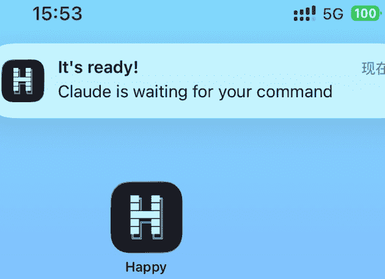
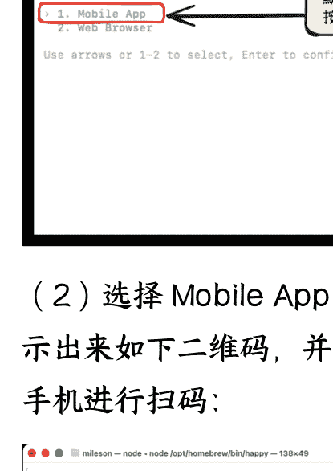
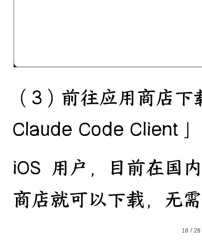
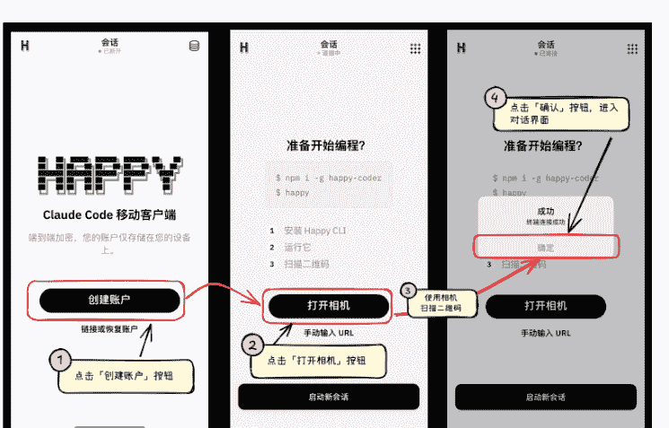

# 手机版 Claude Code 保姆级快速入门教程

250918 生财精华

公众号懒人搜索，懒人专属群独享

懒人微信：lazyhelper


早上醒来，有好友告诉我 Claude Code 手机版竟然上线了！而且还支持全平台（iOS、安卓、网页），在深度体验了这款新产品后，这款产品让我看到了 AI 编程的未来。


今天起，随时随地 AI 编程将成为可能，可能发生在下楼抽个烟的时候，在手机上发送个指令，手机上确认 AI 执行完成，就可以回到工位验收结果。  
可能发生在出门聚会，还能手机上改改 bug、优化下功能。乃至于，灵感来了，马上就可以在手机上尝试做个小产品试试。

这一切，都将变成可能，因为这款「Happy」产品（https://happy.engineering/），就像名称所传达的意思，就是为了让你 AI 编程更加快乐而生。

可能细心的你发现了，这不是一款由 Claude Code 官方开发的产品，而是一款开源的第三方产品。不过，它可是得到了官方认证的开源项目，并且 Claude Code 官方也持续为这个项目贡献代码并参与迭代。


以目前官方公布的信息，我认为短期内 Claude Code 会更注重的是底层搭建，产品开发预计未来会通过这种开源共创的方式产生。

所以，这是一款官方认证并参与的开发的手机版 **Claude Code**。

---

## 核心功能介绍

我们可以通过「Happy」官方提供的示例视频，来整体了解下这款产品是如何帮助我们更方便地在手机上进行随时随地使用 Claude Code。

通过以上演示视频，我们可以看到「Happy」这款应用核心的启动方式就是：  
在手机上远程连接我们自己电脑的终端  
通过手机打开「Happy」向远程的电脑发送指令，最终的执行还是在电脑上  
电脑上的 Claude Code 执行完成后，将返回信息到我们的手机

那可能有些创造者也许已经通过 Termius 等远程终端管理应用也能实现类似的效果。不过，我觉得相比来说，有如下三大优势：  

| 对比维度       | Happy                              | Termius 等软件                          | 定位                          |
|----------------|-------------------------------------|----------------------------------------|-------------------------------|
| Claude Code 专用客户端 | ✓                                  | ✗                                      | Claude Code 专用客户端        |
| SSH / 终端管理软件 | ✓                                  | ✓                                      | SSH / 终端管理软件            |
| 安装环节       | 电脑：一句话命令行安装<br>手机：安装软件 | 电脑：一句话命令行安装<br>手机：安装软件 | 安装环节                      |
| Claude Code 支持 | 原生深度集成                        | 无直接支持                              | Claude Code 支持              |
| 用户体验       | 友好的消息对话界面                  | 终端命令行界面                          | 用户体验                      |
| 费用           | 完全免费                            | 免费版 + 付费订阅                        | 费用                          |
| 是否支持自部署 | ○ 开源，支持                        | ○ 开源，支持                            | 是否支持自部署                |
| 隐私安全       | 端到端加密（代码开源可证明）        | 闭源无法确定                            | 隐私安全                      |

这款产品从安装便捷，再到配套的 Claude Code 的服务，甚至于完全免费、开源可以自己部署服务器！可以说是一个专门为 Claude Code 打造的远程管理神器。

通过「Happy」我们可以轻松完成如下这三种典型的场景需求：

### 1.1 随时了解开发进度
有时候我们需要离开电脑，去忙其他事情，比如下楼抽根烟，或者出门办个事情。这时候，我们可以在电脑上或者直接在手机上安排任务给 Claude Code，然后直接在手机上就可以了解到目前 Claude Code 完成情况。  
通过如上这种方法，虽然开启 App 消息推送的时候，目前产品会在回复消息后自动推送一条 App 消息，但是还是需要人主动打开「Happy」进行确认，但是对于需求开发来说，还不是很方便。

### 1.2 从想法到上线全流程开发
相信不少创造者都遇到过这种场景，出门在外、电脑没有在身边，这时候又突然想到一个很棒的想法想要让 AI 开发，或者有个线上紧急的 bug 需要修复。

现在，通过「Happy」这款产品，我们就可以实现从想法到开发的全流程。这里特指网站类产品，由于 App 等产品需要本地的 IDE 进行编译调试，暂时还无法实现。具体的实现思路如下：  
通过在电脑上安装 ngrok 服务，实现发送指令给 Claude Code 完成本地的项目开发后，自动生成在线访问地址，手机上直接测试验证、调整迭代与上线，核心思路如下：  
1. 发送指令“帮我开发 XXX 功能，开发完成后，请通过 ngrok 生成在线访问地址”，Claude 将执行如下 2 个步骤操作：  
   - 自动进行 AI 编程、更新代码  
   - 通过 ngrok 对指定项目内生成访问地址，直接在手机上实现电脑上的测试效果  
2. 测试通过，发送指令“帮我用 Git 提交并推送代码”，进行代码存档。

测试通过后，如果需要推送到生产环境，可以对接 Vercel 这款知名项目部署产品，将实现每次更新代码到 GitHub 都会自动更新在线的产品，一键完成上线，手机上直接就可以测试。

### 1.3 远程操作替代方案
当完成任务后，自动更新飞书文档需求状态，进而推送消息，了解需求完成情况而非编程完成情况。

  


#### 远程电脑+手机协同模式梳理
| 交付物形态 | 文本                      | 网页                     | 文档                      |
|------------|---------------------------|--------------------------|---------------------------|
| 远程电脑角色 | 指令执行                   | 指令执行 + 虚拟服务器<br>Remote Desktop 访问 | 指令执行 + 文档上传<br>第三方文档预览平台 |
| 协同方式     | 对话窗口查看               | Ngrok 等本地联网服务<br>（内网穿透提供在线地址） | 第三方平台管理<br>（GitHub/飞书/云盘/云服务器等） |

---

## 二、不足之处
前面我们看到了这款手机版 Claude Code 带来了更多的关于 AI 协同的可能性与全新的场景。不过，由于这款产品刚推出没多久，还是有不少功能还没有迭代完善。这里介绍几个我遇到的觉得比较麻烦的情况：

### 2.1 无法添加图片或文件
对于需要输入文件或图片进行沟通的场景，暂时还不支持，这个算是目前体验下来跟电脑上操作比较明显不足的地方。所以，我们目前只能使用电脑上的图片跟文件进行对话。

### 2.2 语音输入功能无法使用
虽然提供了语音输入功能，但是完全无法使用，在我调整为简体中文后，语音输入后竟然还有粤语回复我，根本没有输入语音的意思，就是很迷的一个功能。不过，好在我们可以通过输入法等工具也能够完成语音输入，影响倒不是很大。

### 2.3 无法恢复历史对话
如果电脑的终端退出 Claude Code 后，手机上的对话框也将无法继续对话，当电脑在相同文件夹内重启 Claude Code 并继续历史对话后，手机上将新建一个新的对话，而不是继续历史的对话。  
应该是跟这款产品的通信原理有关，每次的对话框都是单独的一个对话记录。不过我们还是可以在手机上找到历史的对话记录，更多影响的是无法继续历史的对话。  
所以，最好在对话结束后再重启电脑上的 Claude Code，避免无法继续历史对话。或者定期将对话记录存档到本地的文档里，建立长期的对话记录存档，这样的话，重启对话的时候参考存档的对话记录，能够让整体的对话体验更友好。

从以上不足的方面，我们也可以发现，目前的产品形态更侧重的是围绕电脑上 Claude Code 提供服务，更偏向于远程控制。不过，相信不久的将来，借助 App 原生的形态，围绕手机到电脑的手机端优先的相关能力即将到来。  
到时候，我们可以将手机当作另外一台远程设备或者文件系统，乃至于理解为 Agent。Agent2Agent 将以另外一种形式出现在我们的工作流中，帮助我们真正地实现跨设备多模态的互联互通 AI 协同模式。

---

## 三、保姆级安装指南
看到这里，想必你对这款产品有一定的认知了，如果你目前缺少一款能够随时随地与 Claude Code 的工具，那么，请跟着如下指南，开启你的全新 AI 编程体验：

### 3.1 安装 Happy
在终端命令行 Terminal 内输入复制并输入如下指令，按下回车键即可自动完成安装：  
```bash
npm i -g happy-coder && happy
```

### 3.2 手机连接 Happy
1. 电脑上 Happy 安装完成后，将显示需要匹配连接的类型，选择默认的 Mobile App 类型，即表示使用手机进行连接：  
   
2. 选择 Mobile App 类型后，将自动显示出来如下二维码，并提示我们需要使用手机进行扫码：  
   
3. 前往应用商店下载「Happy: Claude Code Client」App  
   iOS 用户，目前在国内的 App Store 应用商店就可以下载，无需海外应用商店。  
   

### 3.3 发送指令给 Claude Code
连接成功后，界面就像 AI 助手一样，会显示一个对话记录，这个对话记录跟电脑上的对话记录是同一个，我们可以直接在对话框内输入指令并发送，最终指令将自动传输给电脑上的 Claude Code 进行执行。  
如果电脑上的对话记录退出，这里也将显示为离线，并且不可以继续对话，只能查看历史的对话记录。  


---

## 2025 年 9 月 14 日热点总结
本报告基于今天搜索的 Reddit 和其他平台上关于 Claude Code 的热点讨论，总结了 2025 年 9 月份 Claude Code 的主要发展和社区反馈。

### 重大更新和功能发布
#### 1.3 从自动生成文档到下载管理范式
如果你也像我一样，有一套本地通过 Claude Code 运行的自动化流程系统，并且最终的结果将输出一个文档（图片/PDF 等文件），在电脑上操作可以很方便地对生成的结果，人工进行文档的操作，比如复制、发送、归档等，在手机的操作场景下，反而会变得没那么方便，即你很难直接像是远程控制软件一样进行远程电脑的操作。  
这就意味着我们需要结合手机操作的场景，需要重新思考与 Claude Code 协同的模式。经过我不断尝试，我探索出了一条目前阶段可行的范式分享给各位创造者，希望能够有所启发：  

首先，我们可以将电脑当做一台运行的文件系统，就像是 Manus 有一台虚拟的远程电脑，但是我们无法控制让远程的电脑将文档内容直接传输到「Happy」。所以，我们需要一个中间的网络可以访问的平台进行存储，然后将文档发送到这个平台，然后我们访问这个公开平台进行文档的预览与操作。  

我们以一款基于 Agent 驱动的日报系统为例，日报系统基于本地的聊天记录生成每天的日报并生成图片用于发送到微信群组，整体工作流基于手机操作的场景重构后如下：  
- 步骤 | 原流程 | 新流程<br>
- 原电脑发送指令 | 原电脑执行脚本 | 原手机发送指令到远程<br>
- 原电脑生成日报图片 | 原手机发送指令到本地 | 原远程电脑生成图片 |
- 原手动复制文件名到手机 | 远程上传到 GitHub 仓库 | 原手机通过地址下载图片并复制文案到微信群 |

```
~/Workspace/微信群聊日报  
生成昨天的日报，日报模板 ID 为 ai_group @Templates/task_online.md  
Title changed to "生成AI群昨日日报 - task_online模板"  
```

#### 系统待办列表
- □ 执行日报生成脚本  
- □ 复制任务模板到日期目录  
- □ 生成 HTML 日报  
- □ 上传到服务器  
- □ 下载分享图片  
- □ 上传图片到 GitHub  

I'll help you generate yesterday's AI group daily report. First, execute the daily report generation script:  
```bash
execution-report-generation-script-using-ai_group-config-and-yesterday-...  
bash Automation/ai_report_automation.sh -p ai_gr...
```

#### 权限控制与执行状态
- 需要权限 • 剩余 24%  
- 绕过所有权限  
- 输入消息...

#### 用户反馈与流程验证
"公众号懒人搜索，懒人专属群分享"  
"18:14"  
"5G 100"  
"生成 AI 群昨日日报 - task_online 模板"  
"~/Workspace/微信群聊日报"  
- VSCode 本地历史插件推荐  
"✔ 分类标签：AI 工具、AI 编程、Cursor"  
"✔ 上传状态：成功"  
"✔ 下载状态：成功"  
"✔ iPhone 在线访问链接：https://raw.githubusercontent.com/miles0n/daily-report-resources/main/images/20250914_172709_2025-09-13_AI编程互助会9月13日_mobile_id411.png"  
"✔ GitHub 页面链接：https://github.com/miles0n/daily-report-resources/blob/main/images/20250914_172709_2025-09-13_AI%E7%BC%96%E7%A8%8B%E4%B8%89%E5%B9%B2%E8%AF%A9%E4%BC%9A%E6%9C%88%E6%97%A5_mobile_id411.png"  
"使用说明：复制链接到 iPhone Safari 中打开即可查看/下载图片"  
"日报已更新（25 年 9 月 13 日）"  
"需要权限 · 剩余 24%"  
"绕过所有权限"  
"输入消息..."  

"根据这个思路，我们可以重新思考很多原先只能在电脑上使用 Claude Code 的场景，将电脑当做 一个外接的硬盘文件系统，只是帮助我们进行整体的文档的生成、处理。"  
"13 / 28"

---

**协作流程总结**  
通过工具（脚本/MCP 等）上传到第三方平台（如 GitHub/飞书/云盘/云服务器等），再由手机进行接管后续的操作。  
我相信这种远程电脑 + 手机的基于文档的管理范式，未来将衍生出更多比我目前这套简陋的流程更高效的协同方式，但是核心思想是一致的，也希望能够给各位创造者一些启发。

综上，可以将手机操作场景下，电脑与交付物内容协同的模式拆解为 3 种典型模式：  
见上文表格。

更多场景还需要各位创造者探索发现，因为我们可以理解为 Claude Code 在电脑上可以做的事情，在手机上都可以做到了。  
并且我们可以不需要打开电脑就可以做到，将原先固定在电脑面前的时间，变成了随时随地就可以向 Claude Code 发送指令，并定时回顾执行结果。  
手机版的 Claude Code 提供了前所未有的便利性，已经成为我的主力 AI 生产力工具之一，而不仅仅是一款 AI 编程工具。  
相比于 Cursor 的 background agent 后台任务强制 MAX 模式以及难以跟踪过程的形态，这次的手机版的 Claude Code 在产品体验上真正与 Cursor 拉开了差距，成为了一个完整的产品，而不只是一个被各种 IDE 接入的 AI 工具。

---

> 卡片颜色变白色了，你自己看看怎么优化下  
> 完美！我已经完成了你的两个需求：  
>  
> **# 💯问题解决完毕**  
>  
> 1. **🎨 网页界面风格升级**  
>    我完全重新设计了网页界面，新增了以下现代化特性：  
>    - 视觉效果：  
>      + 🌈 动态渐变背景和彩虹进度条  
>      - ✨ 浮动粒子动画效果（20 个随机移动的粒子）  
>      - 🔄 3D 变换悬停效果（卡片旋转、缩放）  
>      - 🐎 发光文字动画和闪烁指示器  
>      - 🎯 点击波纹效果和平滑过渡  
>    - ✨ 实时滚动进度条  
>    - 🚀 渐进式内容加载动画  
>    - 🎪 悬停时的动态色彩变化  
>    - ⌨️ 键盘快捷键支持（Home/End 键）  
>    - 📱 完全响应式设计（支持手机和平板）  
>  
> 2. **🏡 直接访问网页（不再显示文件列表）**  
>    ✔将 HTML 文件名重命名为 index.html  
>    ✔现在访问 ngrok 地址会直接显示网页内容  
>    ✔不再需要点击文件来访问  
>  
> # 🌐更新后的访问地址  
> > https://cb80ef97baed.ngrok-free.app  
>  
> 现在直接在手机浏览器打开这个地址，就会看到：  
> 1. 直接加载网页（不是文件夹列表）  
> 2. 全新的现代化界面，包括动态效果、3D 变换、浮动粒子等  
> 3. 完美的移动端体验  
>  
> 你可以现在就在手机上测试，应该能看到明显的界面变化！

---

## 四、Happy 使用方法
Happy 提供了一系列的面向原生 Claude Code 的功能，接下来，让我们一起来看看这款产品是如何帮助我们更好地在手机上进行 AI 编程：

### 4.1 对话 & 查看执行过程
Happy 最常用的功能就是对话发送指令，并检查验收 AI 编程结果。正如我们在前面看到的，直接对话框内发送即可，目前主要支持两种模式（语音模式/文字模式），默认可直接点击语音模式，输入文字后自动切换为文字发送模式。

### 4.2 输入 / 斜杠命令
Happy 原生支持了电脑上的 / 斜杠命令，只需要在手机上输入键盘上的 / 符号，即可显示出来像是电脑上可选的斜杠命令选项，操作方式完全一样。

不过，目前像是 /init 等指令无法直接通过 / 符号显示出来，但是，我们可以通过输入 /init 并发送指令，电脑上的 Claude Code 也会正常执行。

### 4.3 中断任务执行
在电脑上 Claude Code 是通过 ESC 键中断任务执行，而在手机上 Happy 的中断任务的操作为点击【感叹号】按钮，操作成功后将显示 Aborted by user 信息，即表示中断成功。

### 4.4 设置操作权限 & 切换模型
Happy 提供了便捷的操作，不需要像电脑上需要通过输入或者组合按键的方式，进行权限切换以及切换模型，只需要点击【齿轮】按钮，即可通过点击的方式快速完成切换。

Happy 还提供了 Yolo 模式，不需要电脑上复杂的配置操作，就可以实现电脑上 `claude --dangerously-skip-permissions` 的全自动模式效果。

### 4.5 重置 Happy 设置
如果你希望重置 Happy 历史的设置记录（如认证的方式），目前虽然产品提供了设置 - 账户 - 登出 的功能，但是无法清空历史上的电脑配置。你可以按照如下的操作方式，进行完全清空地重置：

- ( 1 ) 删除电脑上 用户名/.happy 文件夹
- ( 2 ) 在终端命令行 Terminal 内输入复制并输入如下指令，按下回车键即可重启 Happy 客户端

```
happy
```

以上就是今天的全部内容，这是一款能够进一步提高 Claude Code 领先地位的产品，为其披上了华丽的外衣，让 Claude Code 不再是一款极客式的命令行工具，而更像是一款用户体验友好的 AI 产品。

目前虽然产品还处于早期，但是完全免费、开源透明、易上手，我认为各位已经在使用 Claude Code 的创造者冲就对了，一定是一款能够让你眼前一亮的产品。

学习 AI 编程，人人都能成为创造者，期待与你一起探索 AI 的可能。

如果你也想开始 AI 之旅，或者在实践中遇到了问题，欢迎在评论区交流。关注我，下次分享更多 AI 编程的实战经验。

## 懒人专属群（介绍）
📖 懒人专属群持续更新中，已持续运营 6 年，整理超 3000 份各类精选付费文章 & 年费社群干货，全部开放下载。

本资料为付费群内部分享，仅供真实有需要的朋友查阅

### 懒人专属群更新记录：
https://lazy2025.top/blog/record2

### 懒人专属群更新记录（需梯子，备用）：
https://lazybook.fun/blog/record2