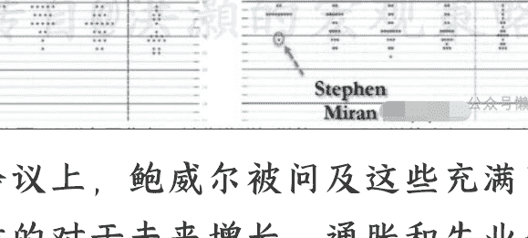
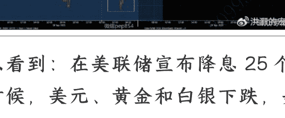
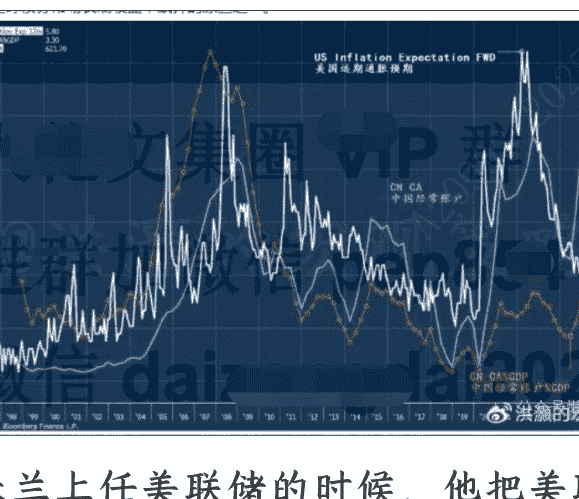

# 美联储宽松吹起泡沫

250919 洪灏的宏观策略
整理：公众号懒人搜索，懒人专属群独享
懒人微信：lardhelper

昨夜，美联储如期降息 25 个基点。这是今年以来美联储第一次降息，也是近 30 年以来美联储第一次在核心通胀依然维持在 2.9% 的情况下降息，也是我记忆中近 30 年来美联储第一次在美股依然在历史高位附近的情况下降息。

简单地说，这是一次分裂巨大同时又充满了矛盾的预期。在这次议息会议上，美联储调高了通胀预期和增长预期，但在调低了失业率预期的同时又讨论了就业的下行风险。同时，上次会议只有 6 位委员支持降息，但是本次会议支持降息的委员上升到了九位。

点状图的中间值认为，今年余下的时间里，美联储还将降息 50 个基点，而特朗普“及时”任命的新委员米兰（Miran）认为本次会议应该降息 50 个基点，并认为未来两次议息会议美联储还要继续降息五次。这个美联储货币政策委员真是为了特朗普的目标鞠躬尽瘁。

在会议上，鲍威尔被问及这些充满了矛盾的对于未来增长、通胀和失业率的预测时说道，“现在并没有很多人支持降息 50 个基点，你们应该把这次降息看作是一次风险管理型降息”。从增长和通胀预测来看，这次降息的确是矛盾重重的。美国的服务业 ISM 指数里的价格指数依然在上升，而就业指数却在下降，一幅滞胀的画面。如是，在增长即将放缓但是通胀压力犹存的情况下降息，也让市场昨夜盘中的走势出现戏剧性的反复。

可以看到：在美联储宣布降息 25 个点的时候，美元、黄金和白银下跌，美元的抛压尤其严重。在降息决议的影响下，美债收益率也出现暂时的暴跌。但是这些资产价格的盘中走势很快就出现了修复（金银）甚至是逆转（美元、美债）。只有中国相关的资产，比如纳斯达克的中概股指数和恒指夜期表现一致。

如果我们再看看主要资产类别，如纳指和黄金，出现的一些长周期走势的历史性盘面和极小概率的价格表现，那么昨夜美联储的降息以及资本市场的反映对于下一步我们的投资布局的意义便跃然纸上。

以下内容仅 V+ 会员可见

经历了四月“解放日”的历史性暴跌和修复之后，美股的主要指数再次逼近历史新高。如果看纳指的表现，我们看到纳指在过去的四个月里有 93% 的时间段停留在超买的区间。同时，历史上出现这样的超买盘面的概率，大约是 10,000 个交易日里出现 4 天，或者说，大约是每十年出现一次。这是一个极小概率的事件。

当然，熟读我的研究报告的读者，都知道我最近对于中国市场的预测，就是市场很可能可以“牛市里，我们可以用超买化解超买”（overbought begets overbought）。

这个七月份做出对于中国市场的预测，也在最近的三地读者见面会上与现场读者充分地交流过了。而最近市场的走势与这个预测基本一致。

我们再同时观察一下黄金的历史性盘面。

黄金最近历史性的走势已经超过了最近几年的移动平均价格约五、六个方差，同时进入历史性的超买状态。黄金的盘面比纳指的走势更加引人注目，因为六倍方差出现的概率大约是十亿分之二。也就是说，在地球存在的数十亿年的历史上，这样的盘面只出现过几次。

实际历史上，在布雷顿森林体系瓦解之后，黄金出现如此历史性地偏离移动平均价格同时超买的情况，只出现过四次：1980、2008、2011 和 2020。”每一次出现类似的现象，黄金都会出现加速赶顶的情况。当然，这次黄金偏离近几年移动平均价格的程度，远远超过了前面四次。如果我们以前面四次的历史经验来交易黄金，那么我们会在 2400 左右就离场了，在交易台上留下了 1300 美元的利润。

因此，有理由相信，黄金现在的历史性盘面，是布雷顿森林体系瓦解之后的一次历史性的模式转换。在我上周题为《洪灏：以金银重构全球货币体系》的公开报告中，我讨论了这样的模式转换的历史性背景和意义，一个新的、以金银和加密货币为基础的货币系统正在快速地形成。当然，即便如此，我们还是需要时间，以“超买化解超买”。这也很好地解释了金银近日的大幅波动。

从中美贸易对于美国远期通胀的影响来看，我们认为美国的远期通胀预期将居高不下。这个观点，我们在读者见面会里，已经与现场读者反复讨论了，也与美联储对于未来的通胀预测一致。我们相信，这是最近几个月全球债券市场长端收益率飙升的原因之一

在米兰上任美联储的时候，他把美联储的货币政策纲领进一步地扩大了。美联储本来的货币政策目标，是要维持价格的稳定（通胀）和增长。但米兰认为，美联储的工作还需要更进一步：控制美债长端收益率，引导其下行。换言之，米兰认为美联储要下场操纵市场价格，干预美债长端收益率的上行。然而，我们都知道，美联储只能控制美债的短端，而长端则是由市场交易来决定的。

当然，美联储并非第一个央行这样做。去年，中国央行就下场借券做空国债，以图减缓长期通缩预期。而日本央行买长端也买了好多年了。这些主要央行在长端的操作告诉我们，长端的价格将不再完全反映经济里的长期通胀预期。虽然美联储或能减缓长端收益率上升的速度，但是其总体趋势大概率还将上行。

如是，当下对于资产配置的意义，就一目了然了。既然长端收益率易涨难跌，或者说，之前以美债为标的为投资者提供的长端回报开始下降了，投资者需要一个长久期的资产来替代长久期的美债。而高市盈率的成长股，甚至是那些无法计算市盈率的股票，以及像黄金、白银这样的无法计算估值的资产类别，在投资者的投资组合里比重应该逐步增加。这个逻辑，很好的解释了黄金历史性的盘面和纳指最近几个月的强势，以及中国市场里科技创新板块的行情。

历史不会简单重复，但往往会押韵。

## 懒人专属群（介绍）

懒人专属群持续更新中，已持续运营 6 年，整理超 3000 份各类精选付费文章 & 年费社群干货，全部开放下载。

本资料为付费群内分享，仅供真实有需要的朋友查阅

## 懒人专属群更新记录：

[https://lazy2025.top/blog/record2](https://lazy2025.top/blog/record2)

### 懒人专属群更新记录（需梯子，备用）:

[https://lazybook.fun/blog/record2](https://lazybook.fun/blog/record2)