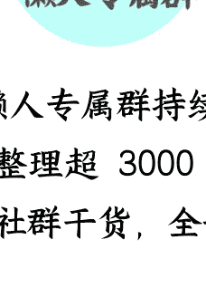

# 塔利班内讧升级

250919 猫哥
整理：公众号懒人搜索，懒人专属群独享
懒人微信：lazyhelper

近期，塔利班一号人物阿洪扎达下令，分阶段关闭国内的互联网服务，并宣称网络是“万恶之源”。

看起来，阿洪扎达的举动，就是一个老顽固在试图抵制现代社会，让人嗤之以鼻。然而，事情并没有那么简单，阿洪扎达的举动，反映的是塔利班的内部矛盾。

作为一号人物的阿洪扎达，和二号人物西拉杰丁•哈卡尼之间，关系日益微妙。西拉杰丁•哈卡尼，是武装组织“哈卡尼网络”的老大。

论规模，“哈卡尼网络”巅峰期也不过三五千人，远不及塔利班，但“哈卡尼网络”的战斗力十分强劲，因为它的成员全部是极端宗教强硬派，个个悍不畏死。

在“哈卡尼网络”面前，塔利班都算是软弱派。

为了统战“哈卡尼网络”，一致对美，塔利班在 2020 年邀请西拉杰丁•哈卡尼出任塔利班二号人物，和塔利班合作夺得江山后，“哈卡尼网络”也收获颇丰。

西拉杰丁·哈卡尼出任阿富汗临时政府内政部长，掌握安全部队；

*   哈利勒·哈卡尼（西拉杰丁·哈卡尼的叔叔）出任阿富汗临时政府难民事务部长；
*   纳吉布拉·哈卡尼出任阿富汗临时政府通信部部长；
*   阿卜杜勒·巴奇·哈卡尼出任阿富汗临时政府高等教育部长。

并且，“哈卡尼网络”还不用解散，等于他们可以用塔利班的资源和平台，壮大自己。好比一边在我这领工资，一边在外面办公司。

正常情况下，老板是绝不会允许的。

可以说，为拉拢“哈卡尼网络”的掌舵者哈卡尼家族，阿洪扎达诚意十足。

但打天下和坐天下，是不同的。

打天下时，塔利班可以开出高价钱，等到坐天下，阿洪扎达和哈卡尼家族的矛盾，就很难再掩盖。任谁做首领，都不希望组织内部有一个日益膨胀的小团体。

双方的矛盾，在今年 7 月正式公开化。

当时，阿洪扎达要求内政部裁员 20%，理由是经济困难，财政紧张，外界对此的看法普遍是，阿洪扎达想借裁员，把西拉杰丁·哈卡尼在内政部的亲信给裁掉。

西拉杰丁·哈卡尼也不是傻子，他公开抵制这一命令，至今没有裁员。

其实，阿洪扎达很多“老顽固式”的政策，本意都是为了打击哈卡尼家族。

比如，下令分阶段关闭互联网，谁在管辖互联网？无疑是纳吉布拉·哈卡尼掌管的通信部，把互联网关了，通信部不就被削弱了？

一旦关闭互联网，通信部职能减少，便可名正言顺地减少给通信部的财政拨款。

又比如限制教育，特别是限制女性接受教育，就可以砍掉一大批教育基础设施和资金支出，那样的话，不就能减少给高等教育部的财政拨款了？

阿洪扎达的出招直逼要害，哈卡尼家族不好还手。限制教育、限制互联网，是不是符合伊斯兰价值观？你们“哈卡尼网络”可是极端宗教强硬派，你好意思反对？

当然，阿洪扎达和哈卡尼家族的矛盾，只是一层，更深层次的问题，在于阿富汗的形势严峻。

从 2021 年 8 月上台算起，至今已执政超过四年，在这四年里，阿富汗的社会经济形势，并没有根本性改善。根据联合国的统计，阿富汗仍有 1600 万人，面临粮食短缺。

至于医疗、教育等，就更谈不上了。

阿富汗是一个内陆国，我们知道，在这个时代，内陆本就不好发展经济，阿富汗也不例外。

虽然阿富汗临时政府相当努力，修路、开矿、吸引投资等各种手段应有尽有，但成效不大，根据世界银行的报告，从 2021 年到 2023 年，阿富汗的实际 GDP，下降了约五分之一。

主要问题，就是阿富汗在外交上，没有得到足够多数量国家的承认，尤其是和周边国家关系不好，和伊朗、巴基斯坦、乌兹别克、土库曼四国的关系，常年处于紧张状态。

阿富汗和上述四国，已因“边境划界”等问题，爆发多次冲突，导致了不少伤亡，再加上这些国家担心，塔利班会向本国境内输出极端意识形态，因而纷纷拒绝承认。

这就导致，阿富汗和周边国家的贸易，受到了很大阻碍。

即便有产品，也卖不出，需要的产品运不进来，阿富汗的经济形势持续恶化，蛋糕缩水，但哈卡尼家族，属于极端宗教强硬派。你让他们停止意识形态输出，大概率不乐意。

巧了，塔利班的边防部队，就是归内政部管辖的。

这一系列边境冲突背后，有没有哈卡尼家族的推波助澜，显而易见。哈卡尼家族这么干，阿洪扎达未必乐意，毕竟经济形势恶化下去，一号人物就要背锅。

而哈卡尼家族的人，明面上并不主管经济事务，就算经济恶化，也没有责任。

所以，双方很难不爆发矛盾。

另一个迹象，也能说明塔利班内部博弈之激烈。

2021 年 8 月，塔利班上台时成立的政府，名叫“阿富汗临时政府”，其部长职位都属于代理。既然是临时政府，那总得有转成永久的一天。

但四年过去了，“临时”二字仍未摘掉，各个内阁部长也依然是“代理”。哪有代理四年的呀，这显然不正常，没有哪个代理者，不想转为正职的。

只能说，塔利班内部博弈十分激烈，导致内阁席位难以再次进行分配，从阿洪扎达的角度，再分配一次，内政部长这么重要的职位，还会给哈卡尼家族？

从哈卡尼家族的角度，再分配一次的话，自己可能占不到便宜，那么干脆维持现状。

偏向宗教的“哈卡尼网络”，意识形态本就与塔利班不同（塔利班更偏向普什图民族主义），各自有一批铁粉，继续这样下去，阿富汗可能再次爆发内战。

想避免内战，塔利班就得通过发展经济把蛋糕做大，而发展经济的关键，还是得打开外交局面。目前，已有了一些改善的迹象。

比如，俄罗斯在今年 8 月，事实承认了塔利班，兴许能为阿富汗经济发展带来一些助力。

只不过，仅仅俄罗斯承认是不够的，其他周边国家，尤其是中国不承认的话，阿富汗经济的“任督二脉”，就依然不能被打通。

中国对塔利班的担忧，其实就两点：一是塔利班和某恐怖组织的关系不清不楚，二是塔利班和巴塔的关系，过于密切，巴塔曾多次在巴基斯坦袭击中国人。

塔利班不和这两个恐怖组织做出明确的切割，我们就不会承认塔利班。

# 最后，安利小懒的付费群：

## 懒人专属群（介绍）

微信：lazyhelper

📓 懒人专属群持续更新中，已持续运营 6 年，整理超 3000 份各类精选付费文章 & 年费社群干货，全部开放下载。

本资料为付费群内分享，仅供真实有需求的朋友查阅 👮

## 懒人专属群更新记录：

https://lazy2025.top/blog/record2

## 懒人专属群更新记录（需梯子，备用）：

https://lazybook.fun/blog/record2