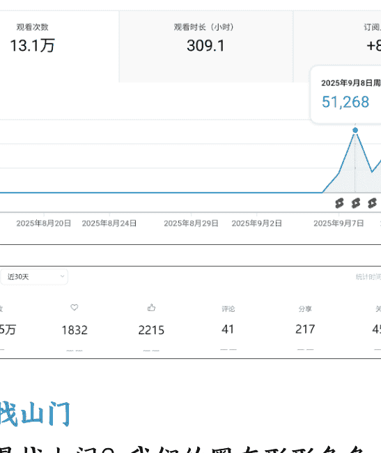
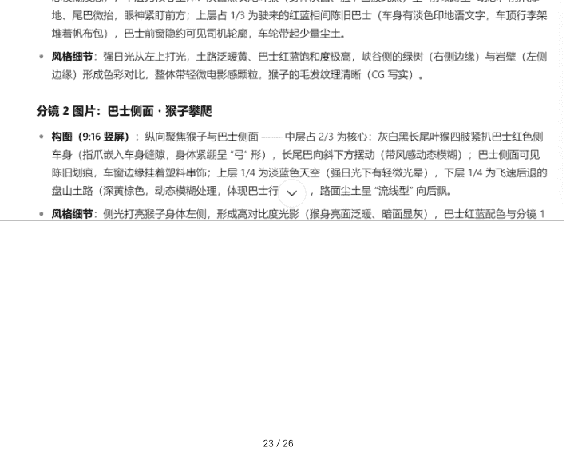
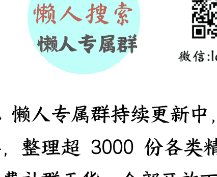

# 40+ 零互联网经验的新手成长复盘帖
## 250919 生财精华
公众号懒人搜索，懒人专属群独享

懒人微信：lazyhelper

大家好！我是 Aries，6 月加入生财，9 月参加首次航海，上了 YouTubeAI 视频和 AI 视频制作两艘船，3 号开船，7 号发布第 1 条视频，截止 12 号 6 条视频，YouTube13 万播放量；98 订阅；视频号 120 万播放，5 条视频开通创作者分成（视频号纯属意外）；

非常意外收到领队大魔王的邀请，同时志愿者 Leo 站在鸡蛋一边也邀请我来分享，我和他们说按照生财的标准不是要变现拿到结果了才分享吗？我离变现还非常漫长，他们说很多圈友都是零基础，第一步都非常困难直接放弃了，不是拿到很大结果的才能分享，我的分享对和我一样第一次参加航海的圈友会很有启发和鼓舞。

接下来的内容就是和我一样纯新手的朋友唠嗑唠嗑下我这几天的经历，也算作小的复盘！

大家来对号入座，有没有和我一样情况的新人？

-   1、没有任何技能能迁移到这航海里;
-   2、平常不常刷短视频，不用 AI，不要说出海，怎么上船都不知道；
-   3、没有自己个人的变现模式，之前是传统行业和职业的；
-   4、没有接触过互联网、新媒体项目的；
-   5、最后一点 - 40 岁以上，以为人生就这样的伙伴；

如果你和我一样，那下面我的分享可能对你有用；

## 一、找山门

为啥是找上门？我们的圈友形形色色，卧虎藏龙，也有像我一样普通人，但是绝大多数圈友加入生财的目的就是想赚钱，想赚钱是一回事，做什么赚钱，赚到钱又是另外一回事了，生财的帖子这么多，航海这么多，自己要做什么赚钱？这就是找山门。

先说我进生财到航海到现在的整体思路和想法给我的整体想法，如果按道法术器来归纳的话

**道法：**从外界不确定性中找确定性；
**术：**找筛信息、确认类比、亲自实测；
**器：**用自己顺手的兵器，这里就是方法和工具；

### 1、初入生财

进入生财是 6 月份，之前还不知道这样的社群，当时关注的一个公众号的博主再说生财，微信视频号就推荐了生财的视频，这个视频亦仁在介绍生财是什么，视频号的第二条。

当时的感觉这不是得到 + 知识付费吗？

得到的内容换成了项目，外面大多数知识付费都在说给我带，跟我走，我这项目有多好，你肯定能赚到钱，把钱给我吧。而生财说的是我这有很多人拿到结果的项目，这里可以链接资源，有人陪伴，你要不要进来玩，只要一张门票，而且可以先体验，你不开心我门票退给你，原来还有这么靠谱的社区，于是我就进来了。

进来之后我发现这里不是赚钱项目多，而是这些赚钱的项目离我太遥远了，太复杂了，大多数我都看不懂，不要说一堆专业的名词，那怎么办了，从不确定性中找确定性。看了 N 篇帖子之后，我知道了这里最确定的是航海，从 0 到 1 开始做，哪怕没有任何基础的人，我翻了大多数航海手册，很全很细，但是不会，那时 6 月航海已过，那段时间我偶尔登陆生财看看，坐等新的航海，打算进来跟着学。

### 2、我是如何选择航海

8 月底 19 个航海开始，这么多怎么选择？从不确定性中找确定性。

先定位自己，任何个航海对我这普通人来说都是从 0 开始，没有任何技能或者资源可以迁移的，上任何搜航海船对我来说都是学习提高新的知识、认知和学习一种新的变现模式，这是确定性的。

再来把航海项目分为两类：1、赚钱项目；2、学习技能项目；

接下来，我的最终目的是赚钱，赚钱这是一种商业行为，既然是商业行为就是价值交换，价值交换的前提我要有对方需要且没有的价值，那就是我的技能，持续价值交换，那就是我的能力护城河；

所以学习技能+X 赚钱项目，这是确定的，技能优先，项目其次。

按在这个思路继续往下分析。

商业的本质是价值交换，大家都懂这个道理，那促使价值交换能赚到钱的核心之一又是什么呢？

**低买高卖！**

作为普通人低买的是什么？- 找到确定性 第一个确定性维度 - 时间

我们的时间是不可逆的；

李笑来的《通往财富自由之路》中说到个人把时间作为商品有三种：第一种是同一时间段销售一次；第二种同一段时间销售多次；第三种购买别人的时间；这里考虑的是怎么把我个人时间变得更有价值。

#### 第二个确定性维度 - 宣传成本

任何赚钱的项目都需要宣传，互联网上的宣传指的是流量；

刘小排说过一句话具体是什么忘了，大概意思在互联网中低买高卖的核心就是流量，在不用额外付费的情况下，流量越大我成本越低。

我现在一个人刚起步，哪些是只需要流量的项目又能把个人的时间价值提高呢？用排除法，排除我需要额外构建商业模式的项目，所有的电商项目，个人自媒体项目，关键词 SEO 项目。排除这些最重要的原因是 - 我没有产品做承接；

根据以上结论接着分析确定性。

#### 第三个确定性维度 - 趋势

最好的时间是十年前 其次是现在，十年前往事如风就让它过去吧，我现在的时间成本是面向未来的。很多航海的提高技能的项目我该怎么选？

那未来的最确定的趋势是什么呢？

**AI 视频、自动化、出海；**

这三个怎么选？

**自动化**

拿生财很多大神说的最小闭环，再加上李笑来书中说的最小必要知识点，两个结合起来会得出一个结果。

**自动化的前提是手动跑通整个流程，知道里面有多少环节，多少坑，怎么解决；**

#### AI 视频

这里是 AI 加视频，优质视频内容才是核心，AI 是起到了降本增效的作用。

#### 出海

有了前两个，这一步其实就非常聚焦。我的时间价值的最大化，最简单的计算题，汇率！

最后我找到上门：AI 视频制作 + YouTube AI 视频

靠 AI 降低视频制作的难度，创作出优质的视频内容，靠着 YouTube 流量的低买高卖，赚广告主的钱。

## 二、入山门

从这里开始为了方面大家阅读，我会按照时间段的顺序来撰写，展示每个阶段我会遇到形形色色不同的卡点和我的解决方法，还有普及一点我认为对纯新手有用的知识点。

我再次确认以下内容不适合： “我看你天赋异禀、骨骼惊奇，想来是百年难得一见的练武奇才” 的人阅读；

解决方法的核心是之前说

**术：**找筛信息、确认类比、亲自实测；
**器：**用自己顺手的兵器，这里就是方法和工具；

### 1、准备 - 开船前四天

确定了航海项目，接下来就是准备工作，对于纯新手从 0 开始，总要有个抓手，从什么地方开始？从我要在哪里赚钱开始，先把 AI 放一边。

不怕大家笑话，我虽然选好了项目，但是 YouTube 是什么，我一无所知，只是知道它是一个全球最大的视频平台。

这四天我阅读了生财里 2 千多篇的关于 YouTube 的帖子，结果大多数和看天书一样，什么赛道、提示词、住宅 IP、指纹浏览器、ADS、频道、工具合集等等；就好比眼前全是武功秘籍，但我不知道怎么用，本着现阶段我能理解的收藏了几十篇帖子，结果后面实践中很多已经不能用。

这四天我做了四件事 -

#### 第一件事 - 出门

距离开船时间越来越近，还不知道怎么入手的时候，拆分整个流程，第一步到底要干嘛？答案是我要知道 YouTube 长什么样。

这个前提大家都懂的，我问了周边一圈的人都不知道，最后还是在 一篇知识付费课程稿件里发现了一种方法，但是实在贵，而且也不知道靠不靠谱，想着做出去再说。因为出去之后生财有一篇帖子里有一点相关介绍，最后我出去之后我找到更基础的教程。

以下链接想了解的朋友可以观看，起码有个最基础的概念

https://www.youtube.com/watch?v=XKZM_AjCUr0&list=PLqybz7NWybwUgR-S6m78tfd-IV4sBvGFG

这内容我看了几遍，终于看懂了，因为我用类比的方法，下面我基于我的理解也用类比的方法和大家分享下，不足的地方专业的大神们请指教。

说这个之前有个我认为非常重要的概念 - IP 我们都听过个人 IP，赛道 IP，网络 IP 等等 IP 概念，这些其实指的是同一个概念 - IP

##### 1. 什么是 IP

一种身份，我的个人 IP 就是我的身份，同样的网络 IP 就是你这个网络的身份，这个身份是相对唯一的。

##### 2. 正常上网

我们想在互联网上浏览一个信息，信息及数据。

-   连接网络 IP→传输数据→网关解析→达到目标→目标发送数据→解析返回个人；
（大概未具体）；

##### 3. 类比上网

把这个数据比作个人，我们要去国外定居，而且要返回国内，需要干嘛？要有效认可的签证。

如果我们去这个国家有特殊规定，比方说只有这个国家有亲戚，亲戚为我证明，帮我办理签证，我才能去，正常情况下不让去，我该怎么办？

有没有一种可能是假设我那里有亲戚。

个人→去哪个国家请求→有亲戚在证明签证→国际机场且有航道/航班→亲戚家→送机场→回自己家。

我们要解决的是去哪国国家亲戚家和这个飞机场有没有航道和航班能去！

住宅 IP 和公司 IP 就是住亲戚家还是去亲戚公司。当然住亲戚家更好。

很多人突然不能用也就是这个机场没有亲戚家的航道了，需要换个航道，航班就是速度快不快。

不行的时候换一下就解决了，再往后推一步很多 AI 不能用，就是你没有这个国家的签证，换个国家。

所谓的 IP 污染指的就是你的网络身份太杂了，对面识别不出你是谁！

指纹浏览器：就是你有很多独立的网络 IP，它会帮我分割单独处理，每个网络 IP 在这个浏览器上是独立存在的。

大家明白什么意思吗？更具体的我就不知道了，现在我是 1 个号，还没用到住宅 IP。

#### 第二件事 - 注册 YouTube

这里的重点是找到目前能注册的最好办法，而不是注册有几种办法。

航海手册和高手领航里面有说，我分享一个我自己的方法

##### 第一步

打开手机 QQ 邮箱（PC 端没有谷歌选项）→选择 Gmail(谷歌）邮箱→创建账号；

创建账号：姓名、出生年月、性别（不愿意）；

##### 第二步

创建谷歌账号→设置密码→输入手机号码 →接收验证码；这一步核心是收验证码，
这个电话号码是用来验证用，而不是实名制，这个号码出问题，号码下的所有账号
都会出问题。

辅助邮箱→下一步阅读条款→继续（授权）都打钩→继续→进入邮箱
辅助邮箱：小号可以直接跳过，以后再填。

##### 第三步-PC 端

输入 YouTube 网址→点击登录→账号密码
→二次认证（新号登录都会出现）→输入
手机号（不需要收验证码）→设置住址

（先跳过）→登陆成功

整个下来仅有第一步的手机号是用于收验证码。

##### 第四步 - 高级认证

请移步航海手册

##### 第五步 - 语言设置

1、谷歌账号设置成中文

具体操作步骤：

网页右上账号名称→管理谷歌账号→个人信息→密码右边→网页版常规设置语言

第二种方法在 YouTube 里也能设置

### 2、YouTube 账号中文

右上头像点击→找到语言设置中文

### 第三件事 - 华为手机下载 YouTube

电脑不方便使用的时候用手机，我自己是
华为手机所以亲测有效，其他安卓系统我就不知道了。

以下步骤是完成第一件之后全程需要打开操作。

### 第一步 - 准备工作

- 1.之前有安装过不能使用的，通过文档找到先删除，以免报错。
- 2.设置锁屏密码（之后步骤中会用到）- 关闭微信双开 - 关闭隐私空间 - 关闭悬浮导航 - 关闭增强防护

### 第二步 - 下载谷歌框架包

打开浏览器：
https://www.mediafire.com/file/5tIImfylfaflk9f/mobile6.zip/file

下载 moblie6 谷歌框架 - 中间那个蓝色的
下载包（打开科学上网下载非常快）；

### 第三步 - 安装谷歌服务助手

具体操作：

手机打开文件管理（刚下好就在最近里面）→浏览→内部存储→用搜索找到
moblie6 压缩包→长按选定右下角选择更多→解压当前位置→跳出查看点进下一步
（找到安装路径）→到华为文件夹→复制→其他位置（内部存储）→应用到全部

(如果出现替换就选全部替换)→桌面设置→更改日期和时间→先关掉自动设置→日期设置到 2029 年 (月日忽略)→系统和更新备份和恢复→外部存储→全部选允许→返回看备份更多是否只有三个有的话→返回重新进去备份页面出现从内部存储恢复按钮点击→应用及数据点击恢复→输入密码 (是下面那个密码不是自己的密码);

安装完成，返回桌面出现谷歌服务助手！！！接下来点进去→点击激活 (打钩)→激活谷歌助手，激活权限会有 7 个，少于 7 个就是安装处问题，重新来一遍。

### 第四步 - 安装谷歌框架

设置→系统和更新→日期和时间→打开自动设置！

打开文件管理→搜索 GMS 文件夹→按照文件名的顺序安装

设置→应用和服务→应用管理右上角四个点→显示系统程序→搜索 mic→找到 micG 服务→权限和其他权限都打开→通知→允许通知→提醒方式打开;

另外一个 micro 打开通知下面横幅都打开。

搜索 Google 商店/通讯录→权限打开/通知横幅打开

搜索 micro→右上设置→自我检查 (全部打钩)→登陆谷歌账号 (是可以登陆多个账号，时隔几个月，不要改变下面的设置)→登陆
完毕，返回谷歌 Pay 商店（如果提醒报错，重启就就行）直接可以安装。
多个账号就点击立即同步即可。
在谷歌商店就可以下载想要下载的软件

### ## 第四件事 - 理解 YouTube

这时航海已有试看版，我看了半天再去看之前的航海一知半解的，这个理解过程有点长，我直接说重要的。我最后理解 YouTube 是看了几遍我之前收藏的其中一篇帖子，钱塘江鲤的这篇
我看的不是怎么用自动化来找对标账号，我的关注点是#这个是什么？这个我哪里见过，这是视频号的话题标签。看图懂了评论区这个我直接看懂了整个 YouTube 的专业名词，因为我打开了视频号和下载了抖音一个个去对。

| channel_id | channel_tag | canonical_url | profile_url | avatar_url | description | country | subscriber_count | view_count |
|---|---|---|---|---|---|---|---|---|
| UCH_eu1N | NoMulify | http://www.youtube.com/@NoMulify | https://://yT3 | Youtube | Gmail: qyuc | Indonesia | 1.33M subscribers | 287,212,60 |
| UC5qqWFEv | Whoan Kel | http://www_youtube.com/@whoanakeli | https://yT3 | https://yT3_i | Thank| you! | 1.51M subscribers | 526,178,83 |
| UC Na-426L | Sold | http://www_youtube.com/@soldofficialy7 | https://yT3 | https://yT3 | ALL SOCIAL | United States | 110K subscribers | 70,682,070 |
| JCLE_Vrhum | Ross Draws | http://www_youtube.com/@RossDraws | https://yT3 | https://yT3: | For logosmes | Unitie States | 1.47M subscribers | 86,777,740 |
| UC_j0 g5SrZ | ccarretti | http://www_youtube.com/@ccarrett | https://yT3 | https://yT3 | animation, | United State | 34.6K subscribers | 8,468,529 |
| UCEjspuK2 | John Caster | http://www_youtube.com/@h111 | https://yT3 | https://yT3 | chase your | United States | 6.12M subscribers | 4,568,58 |
| UCfO Bm0n | Jim Burly | http://www_youtube.com/@JimBurl | https://yT3 | https://yT3 | Smile | 5.21K subscribers | 4,261,49 |
| UCM559ojb | vijyaura | http://www_youtube.catn/yiyaura | https://yT3 | https://yT3 | business inc | Canada | 352K subscribers | 42,186,49 |
| UClaqutewb | Yosai | http://www_youtube.com/@Yosal- | https://yT3 | https://yT3 | Goal: 5k subscribers | 4.56K subscribers | 1,142,450 |
| UCr, 75029F | Anthony Wr | http://www_youtube.com/@AntihonyWrey | https://yT3 | https://yT3 | I tell you th | United States | 6.2M subscribers | 6,430,922 |
| UChgThTisi | Gosur Arts | http://www.youtubey.com/@gasursal3802 | https://yT3 | https://yT3 | 3 I Draw Anime | 170K subscribers | 43,085,00 |
| UC415bOP) | Cleo Abram | http://www_youtube.com/@CleoJbram | https//yT3 | https://yT3 | Cleo Abram is a video | 142M subscribers | 820,875,80 |
| UCJ9kE-pjy | Abraham C2 | http://www_youtube.com/@Caster art | https//yT3.x | https://yT3 | I Mo Caster I | Nigeria | 4.97K subscribers | 1,535,544 |
| UCycGV6fAI | Till Musshof | http://www_youtube.com/tailmissboff | https//yT3.x | https://yT3 | Twitter: https://twitter.o | 49.2K subscribers | 3.170,933 |
| UCdmbp0ld | karenxchen | http://www_youtubeanetokarenxenchen | https://yT3 | https://yT3 | follow me on instagram: | 1.04M subscribers | 554,575,32 |
| UCZOPPOQof | KhaiSaja | http://www_youtube.com/@KhaiSaja | https//yT3 | https://yT3 | | United States | 1.03M subscribers | 252,733,30 |
| UCrUWAHw | Zelov | http://www_youtube.com/@Zelvo | https//yT3t | https://yT3 | EMail | Malaysia | 8 Malaysia | 656K subscribers | 77,772,63 |
| UCpPxopeE | AI Art Dream | http://www_youtube.com/AI ArtDream | https//yT3 | https://yT3 | Enjoy United States | 84 subscribers | 29,274 views |
| UC.2XD3qN | Umar Naqvi | http://www_youtube.com/@umarnaq | https//yT3.x | https://yT3 | Follow me | Malaysia | 150K subscribers | 36,76 |
| UCgHiWaPD | Creative Cove | http://www_youtube.com/@Creativecoven7 | https://yT3 | https://yT3 | "Welcome to Cre tic C | | 2,849 views |

| 账号名称 | 主页地址 | 主页简介 | 粉丝量 | 发布视频数 | 注册时间 |
| :--- | :--- | :--- | :--- | :--- | :--- |
| AI Sendel | http://www.youtube.com/@AISenseLY | tions am | 75.9K | 227 | 3/28/2024 12:00:00 上午 |
| Bernard Marr | http://www.youtube.com/@BernardMarr | and advice | 605K | 1,071 | 6/2/2010 12:00:00 上午 |
| Mots Animations | http://www.youtube.com/Moszaniations | ions - E | 25.7K | 108 | 7/3/2024 12:00:00 上午 |
| Man Mau Shorts | http://www.youtube.com/@manmau_shorts | ourage the | 51.3K | 21 | 4/29/2024 12:00:00 上午 |
| mlives cartoons | http://www.youtube.com/@jnelivescartoons | lives cart | 44.9K | 115 | 4/5/2024 12:00:00 上午 |
| movie scan | http://www.youtube.com/@Moviescanee | purposes si | 25K | 59 | 8/16/2024 12:00:00 上午 |
| Maawchannel | http://www.youtube.com/@Mawchannel_102 | e daily i | 25.1K | 171 | 7/3/2024 12:00:00 上午 |
| No one but AI | http://www.youtube.com/@No_one_but_Ai | dy AI gene | 34.8K | 188 | 2/28/2024 12:00:00 上午 |
| Jussy | http://www.youtube.com/@janny-cat | ing ab | 85.6K | 124 | 8/4/2024 12:00:00 下午 |
| DC VS MARVEL | http://www.youtube.com/@DCEVS.MARVEL | ROOT 3 TO | 91.8K | 48 | 4/17/2024 12:00:00 上午 |
| AIGOhythm | http://www.youtube.com/@airhythm | bat will s | 77.5K | 14 | 8/22/2024 12:00:00 上午 |
| tammycat | http://www.youtube.com/@tammycat029 | like and co | 55.2K | 152 | 4/9/2024 12:00:00 上午 |
| maginAI stories | http://www.youtube.com/@MagicAIStories | 500 subs | 37.9K | 113 | 1/30/2024 12:00:00 上午 |
| AI Our Tv | http://www.youtube.com/@AtFunTY99 | pl please | 51K | 112 | 5/10/2024 12:00:00 上午 |
| Morph | http://www.youtube.com/@Vorph | catures An | 39.1K | 45 | 4/21/2024 12:00:00 上午 |
| Md Sharfraz | http://www.youtube.com/@MdSharfraz-ex2yx | 4m25 | 61.8K | 153 | 4/3/2024 12:00:00 上午 |
| QuirkyWhatIfts | http://www.youtube.com/@QuireyWhatDfs | larious ° | 36.3K | 28 | 9/5/2024 12:00:00 上午 |
| Hamzankids | http://www.youtube.com/@Hamzankidacartoon | ciples of | 55.8K | 30 | 4/15/2024 12:00:00 上午 |
| Att Meats Meow | http://www.youtube.com/@AtleerMeow | ween hunan | 71K | 26 | 3/8/2024 12:00:00 上午 |
| RANAsVFX | http://www.youtube.com/@RANAsVFX | apesics, 2D | 101K | 319 | 7/30/2012 12:00:00 上午 |
| Kelsey Rodriguez | http://www.youtube.com/@KelseyRodriguez | king about | 255K | 203 | 10/22/2010 12:00:00 上午 |
| Fun with AI | http://www.youtube.com/@fun-wit-h-i | O We maks | 34.8K | 41 | 2/28/2024 12:00:00 上午 |
| mai Vlogs Edit | http://www.youtube.com/@GnuVlogs06 | e Like 2 | 61.7K | 6 | 2/15/2024 12:00:00 上午 |
| 8700X SHORTS 2D | http://www.youtube.com/@Wdftoo040 | y vide up | 24.1K | 150 | 7/9/2024 12:00:00 上午 |
| | | | 25.8K | 209 | 3/6/2024 12:00:00 上午 |

Channel: 频道=个人账号；short=短视频；video=视频；subscriber count=订阅数=粉丝量；Short5 Feef=短视频的自然流；#=短视频的话题；Tag 页=话题页

到了再往前推一步换成视频号，发布一条视频的流程是什么？
+ 上传视频→填写标题→填写主题内容→填#话题词→勾选必要设置→发布（定时/立即）
再往前推一步如果我是一个新手创作者，整个流程是什么？
+ 注册账号→账号四件套（头像、昵称、背景图、个人简介）→寻找对标→模仿对标→选题→拍摄→剪辑→发布→运营；

类比视频号/抖音，我就知道了国内平台发布的最小必要知识，只是把它换成国外 YouTube，区别在于它有点向国内的短视频平台 + 爱奇艺等平台；至于怎么找对标账号

用#来搜、用视频的音乐来搜，刷着刷着算法自动给我推荐一堆类似的视频。
### 2、开船 - 发布第一条视频之前

航海之前起码有最基础的认知，不懂不要浪费时间，很多问题航海中就会有答案！

#### 1、几点分享建议

1. 合理安排时间，我参加了两个航海项目，但是高手领航都是同一天同一时间，我只能选择一个，另外个第二天看直播。
2. 很多听不懂没关系，抓住我们想要的，也就是这一步我到底要什么？我什么不知道，先把当下的卡点解决了，继续往下走，高手领航是有回放的。
3. 这里有教练、志愿者为我解惑，有高手领航，很多小问题只要在群里问，不止一个教练为我们解答。
4. 多翻翻群，你会发现有你不知道你不知，没错，就是你会看到，你不知道你不知道的问题，这是重点！
5. 你确定会的，同样也可以帮助圈友，他们也会为我解答让我获益良多。

接下来我以高手领航为锚点，结合我的问题，并且说明我是怎么解决的。70% 的内容我没听懂，但是不影响我做事。

# #### 第一次的高手领航
> *YouTube* - Gary 曹淦教练

1. 我理解了什么是赛道
赛道定位背后是商业模式定位，我赚谁的钱，我靠什么赚钱；

账号定位：我是谁（我有什么），我有什么优势（对比同行），何以见得；

而我们在 YouTube 的商业模式：我赚广告主的钱，我靠视频流量赚钱；

账号定位：视频题材内容和表现形式；我的视频给谁看？做什么内容？用什么表现方式呈现？

视频内容和表现形式分为两类：形式类和故事类；
- 形式类：跳舞、搞笑、恶搞、宝宝走秀、音乐类、动物变身等等，用某一种形式吸引观众的，这种一般都很短，拉完播率；
- 故事类：起承转合这是最基本的，通俗点就是有情节的，其实知识博主、影视解说也可以算故事类；

之前我非常迷茫，不知道自己喜欢什么，要做什么，天天在找对标，找赛道，完全不知道我要做什么，根据以上教练的内容，明确了我一开始要做非洲版的动物救援/警示赛道，结果做了 1 条发 YouTube，想想顺手发个视频号，没想到第二条在视频号上爆了 100 万，让我感觉我不是非洲版的动物救援，而是动物和人类互助的赛道，为什么之前是非洲版，因为非洲用户多，但是我这个题材是全世界人们的共识，这个很大，现在就做这个题材的内容。

# **AI 视频制作 - 明月教练**

# **1、我理解了什么是 AI 制作视频**
是 AI 制作视频，而不是 AI 视频，在这高手领航中我知道了啥是首尾帧，首尾帧就是在同一个镜头内，给与 AI 指令，让这镜头内的图片发生运动轨迹。

瞬间领悟什么是图生视频，我们在反推一步。

一条视频由什么构成？
无数个视频片段构成，视频片段的顺序是开头到结尾，这个就是一个分镜头。

一个分镜头是开头到结尾都在一个画面中，请记住这句话。

接下来 AI 制作视频的流程是什么？这里指的是复刻对标账号
分镜头提炼→分镜头内容生成图片→图片生成视频→剪辑
这就是我从不知道啥是 AI 制作视频到知道了什么是 AI 制作视频的流程。
## 三、登山

# #### 1、实践测试

了解了 YouTube 基础、AI 制作视频的流程，这是最小必要知识点，那剩下的唯有实践和测试。

这里先展示下这两个平台的 6 条视频各自的数据，再和大家分享下我是怎么做的。
### YouTube

| 短视频 | 公开范围 | 限制 | 日期 ↓ | 观看次数 |
| --- | :--- | :--- | :--- | :--- |
| "#rescueefforts #cowWhen everyone on the..." | 公开 | 无 | 2025 年 9 月 12 日 发布日期 | 30,863 |
| "Animals save the day from deadly forest ... Animals save the day from deadly forest disaster! #rescue #animals #wildlife..." | 公开 | 无 | 2025 年 9 月 11 日 发布日期 | 12,892 |
| "In the forest, a man rescued a deer being... In the forest, a man rescued a deer being hunted and nursed it back to health!.." | 公开 | 无 | 2025 年 9 月 11 日 发布日期 | 5,249 |
| "They sent a Hanuman Langur to stop the... #monkey #indianmythol #comedy in a sprawling metropolis, an unlikely hero rises..." | 公开 | 无 | 2025 年 9 月 9 日 发布日期 | 44,772 |
| "Shiva's Mount 'Nandi' Appears? A Sacre..." | 公开 | 无 | 2025 年 9 月 9 日 发布日期 | 41,068 |
| "Gophers Help Ambulance Get Through A... गोफरों ने एकबाँड़े को भुखंतान से बचाने में मदद की!Gophers Help Ambulance Get Through ..." | 公开 | 无 | 2025 年 9 月 8 日 发布日期 | 37,825 |

视频号：视频号切记一定要声明原创和第一时间写评论，不然是没有广告的；
这里有个验证我们的视频到底内容怎么样，不要闭门造车，可以多个平台尝试，刚学这块不要给自己这么大压力，抖音，小红书我压根没有接触过，我相对熟悉的是微信，8 号早上突然间想到为什么不发视频号试试。

- **河狸从森林中的自然环境中帮助我们！** #动物#
2025 年 09 月 12 日 10:00
已声明原创
3.8 万 👍 170 💬 3 ↪️ 32 👍 164
- **在森林中男人救了猎人追捕的鹿，并将其护理**
2025 年 09 月 11 日 13:50
已声明原创
12.8 万 👍 587 💬 41 ↪️ 22 👍 602
- **这是一只印度哈努曼 - 叶猴挺声而出的故事#佛**
2025 年 09 月 11 日 08:59
已声明原创
8781 👍 29 💬 0 ↪️ 1 👍 28
- **在印度文化中，牛本身是神圣、温顺、慈悲的**
2025 年 09 月 09 日 18:53
已声明原创
1.2 万 👍 42 💬 0 ↪️ 6 👍 29
- **地鼠帮助救护车穿越滑坡！** #动物 #救援 #野生动
2025 年 09 月 08 日 15:07
102.4 万 👍 1282 💬 18 ↪️ 158 👍 14
- **牛场着火了，救援的竟然是它！** #动物#救援
2025 年 09 月 08 日 09:09
1.8 万 👍 87 💬 0 ↪️ 22 👍 66

### 现在分享下我的制作流程:

第 1 条我花了 8 个小时，第 2 条 5 个小时，第 3 条 3 个小时，第 4 条 7 个小时，
第 5-6 条 1.5-2 个小时；

为什么差距这么大？其实我的过程和教练们说的都不一样，有点像明明我想练九阳神功，结果我自己琢磨出了半步九阴真经。

# **2、第 1 条的制作**
AI 制作视频通俗点就是怎么和 AI 对话，专业点就是怎么写各种提示词，我不会，但是之前收藏的帖子里有人给到。

一卒的 - 这也是教练们推荐的
刚开始我把整个制作过程按照自己的想法梳理了一遍，叫做 1.0。

对标视频→谷歌 studio 直接用一卒的提示词生成分镜头图片提示词→studio 直接改角色→豆包每个分镜头出图→即梦生成视频→剪映剪辑→发布；

原来以为非常顺利，结果各种报错，图片不一致，图生视频 AI 不理解，啥问题都有，但是终于整出了第 1 条。
做完第 1 条我就在想能不能再快点，整个流程最耗时的就是修改提示词。

# **3、第 2 条视频制作**
后来重新回到生财去搜帖子，发现了大臣教练的。

我拿这两份提示词用第一条视频做了一个测试。
我建了个 Word 写上遇到的问题：测试大臣和一卒的视频提取动物类分镜头的提示词，哪个提示词导入批量生成工具展示出的画面会更符合要求。

+ 1, 1

- **测试大**
臣和一卒的视频提取动物类分镜头的提示
词，哪个提示词导入批量生成工具展示出
的画面会更符合要求。

+ 1, 2

- **测试批量生成工具 - 香蕉 - 使用 apicore**
（圈友的）
提取一个分镜头对应的英文翻译，一个 4
个版本进行出图测试

一卒提示词中的角色替换成大臣中的角色
第一次尝试
全部生成失败 - 是否是模型或者人数太多导致的？
使用同样的模型 Sora 尝试
全部失败!换个模型，判断是否是网络问题还是模型问题？换了几个节点还是全部失败
apicore 收费：2 分一张图；
换成云雾 API 进行尝试

- **云雾 API - 香蕉失败，Sora 成功 - 证明不是
我本身网络问题。**

第二次尝试
云雾收费：4 分 5 一张图。

# ### 第三次尝试

同样的提示词给到国内其他模型尝试
- **豆包：** 大臣提示词没问题，也是能理解的，为什么能理解？
区别表达方式人物动作：
一卒：一只灰色长尾叶猴从远处跑向一个着火的棚屋。
大臣：能看到一只灰色长尾叶猴的背影，它正跑向远处的牛棚。
我直接用了大臣的提示词，4 小时整出来了 1 条视频，时间还是太久了。
为什么一卒的提示词会报错这么多，我重新看了他的视频，发现这套提示词的主要目的是用在 sora 批量出图上面，而且是需要有自己的人物形象，意味着这套提示词可能不适合我这个无法固定形象的动物救援视频上。
这一段是我当时的判断！
# ### 四、第 3 条视频制作

这条视频开始我要回到之前我说到的从不确定中找确定性。
什么是不确定的？各种指令提示词报错，我不知道问题出在哪？
什么是确定的？我会和 AI 简单的沟通，我有两大指令，要不我问问 AI？
[PAGE 21] (Removed)
我直接问 AI:
#### 问题 1
我现在要用 AI 来协助我制作视频，具体步骤是我上传一段视频链接，它来帮我做分镜头文生图和图生视频的提示词，下面有两段提示词，你帮我判断哪一段提示词最符合。
AI 真的会帮我分析，但是它的结果是一卒的提示词最符合，并说明了两段提示词的优劣势以及原因，大家自己可以尝试下，这段我找不到了。
#### 问题 2
这一段我觉得很奇怪，经常会出错，AI 不理解，那结合你的经验把这两段提示词的优势相结合，给我一个全新的提示词指令
> 结果是：我用了它给我的提示词，这条视频用时 3 小时，报错率很低，有些直接不要改。
大家都知道不懂就问，但是为什么不问 AI 呢？
#### 5、第 4 条视频制作
#### 第二次高手领航 - YouTube - AS 教练
这是极其重要的里程碑，我知道了啥是复刻爆款短视频，原来我在原创，仰天长叹！
复刻是在对标视频内容不变的情况下，替换场景中的元素，人也好，背景也好，是替换的二创。

AI 视频完整的整个流程是什么，
谷歌 studio 分析视频给出分镜头和提示词 → 老马工具分割视频生成图片→用豆包/智普等生成图片→替换原视频图片（图片提示词）→图生视频→剪辑；

我已经我终于走上了正轨，可是这条视频又用了 7 小时，为啥，老马图片分割器我不知道那张图才是我要替换的，我用剪映分割、老马分割和 AI 分镜头三者完全是不一致的图片。从晚上 10 点一直制作到凌晨 3 点才制作完成。
第二天我决定还是用之前的那条指令，原创就原创吧，起码时间不用这么多，先有再优，回头再来研究这是为什么。
但是 AS 教练有一个动作非常启发我，导致后面的时候直接提效。

##### 6、第 5-6 条视频
我直接给大家上图，大家感受下我再说什么！

- 1、6 个分镜头组成的是是一条视频，所有分镜头的元素要保持连贯性和一致性；如分镜 1 的车和车顶的人和分镜 2 车顶就要有人，符合视觉逻辑和现实逻辑，依次类推。
- 2、遵循现实中的场景描绘，不要让人产生不真实感；（如猴子大车子小）；依次类推。请开始生成图片

我将按照你的要求生成 6 个分镜头图片，保持角色、场景和道具的连贯性与一致性，比例为 9:16。

分镜 1：低角度镜头，崎岖盘山土路上，灰白黑毛色的长尾叶猴正从高速奔跑紧急减速、四肢着地准备坐下，身体前倾注视前方驶来的红蓝相间陈旧印度巴士，地面带起少量灰尘。电影感，动态模糊，顶级 CG 渲染，8K。

分镜 2：侧面中景特写，长尾叶猴爬在行驶中的巴士侧面，四肢紧抓手，身体紧绷，背景是飞速后退的山路和扬起的尘土。超写实照片，动态模糊，电影级光效。

有看懂吗？用谷歌 studio 分析视频给出分镜头提示词全部丢给豆包，豆包会自己重新整理，直接给它说生成分镜头图片，它会自己生成，出错率是 30%，而且最重要的是再往前走一步，直接把它生成的图片在这个对话框生成视频，成功几率非常大。为什么？因为 AI 有记忆！！！

这是 AI 教练高手领航里面的动作，虽然他讲的是山海经的制作流程，但是我们要知道自己卡在哪里，带着问题来找解决方案。

非常爆！感谢教练，感谢航海，感谢组织。

后面的几条视频只要是分镜头里的动作不太复杂，基本我都是用豆包一条龙服务。
切记：是分镜头里的动作不太复杂，我这里做的是动物救援类视频，其他类型我没测试过。

### 7、继续登山

以上是我这段时间的体验和收获，这是一个没有任何经验的新手怎么用 AI 来制作视频的分享，一家之言。

和航海里的高手们不能比，只希望和我一样情况的新手们有点收获，足矣!

登山路还很长，数据分析，爆款分析、基本操作很多我还不会，要探索的东西非常多，一切皆是选择，我要知道我要干嘛，这件事怎么干，之后我才知道怎么选择。再回头看很多东西我都听懂了，不像之前跟听天书一样。

## 四、山顶

按照这艘船的目标是开通 YPP 开始变现，或者以 YouTube 找到自己的商业变现模式。

但这几天我的感受不要特意在意终点在哪里，沿途的风景其实很漂亮。

通过这航海我收获了什么才是最重要的，我收获了如何出门、YouTube 是什么，怎么和 AI 对话、AI 制作视频的全流程、视频号开通广告分成、视频播放量破百万的喜悦，有一群负责的教练、领队、志愿者无私的帮助，有一群一起航海的伙伴。

最后，安利小懒的付费群：

**懒人专属群（[介绍](#)）**

✏️ 懒人专属群持续更新中，已持续运营 6 年，整理超 3000 份各类精选付费文章&年费社群干货，全部开放下载。

本资料为付费群内分享，仅供真实有需要的朋友查阅 🗝️

懒人专属群更新记录：

**[https://lazy2025.top/blog/record2](https://lazy2025.top/blog/record2)**

懒人专属群更新记录（需梯子，备用）：

**[https://lazybook.fun/blog/record2](https://lazybook.fun/blog/record2)**