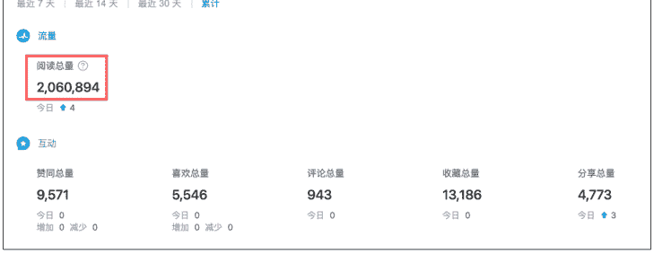
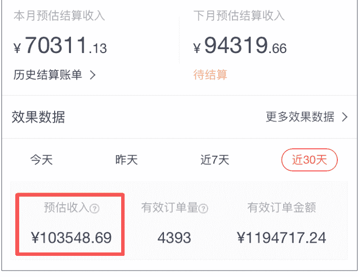
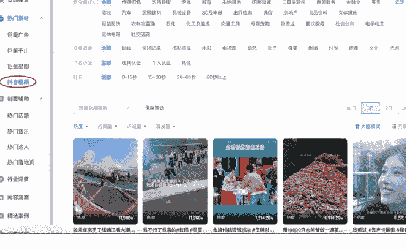

# 热点思维实战攻略：我是如何靠“追热点”快速变现的

250919生财精华

公众号：懒人搜索，懒人专属群独享
微信：lazyhelper

公众号：懒人搜索，懒人专属群，微信：lazyhelper

## 一、前言

大家好，我是余一叼，坐标广州。

我是今年7月份才正式加入的新圈友，可以说，「加入」生财改变了我的个人轨迹：从投资失败负债十几万，到后来赚到人生第一个100万，生财一路陪伴了我的成长和蜕变。

可以说，没有生财有术，就没有我的今天。

这几年我深受生财的滋养，如今终于正式补上门票，也想把自己一路走来做项目的经验心得分享出来，回馈给大家。

2020年以前，我和先生因为“热爱和情怀”在云南大理开了一家摄影工作室。那几年，市场竞争还不算激烈，仅靠微博发作品、朋友圈转介绍，就能接到不少单子，在风花雪月的大理过着算是体面的日子。

2019年上半年更是接了很多高客单价的婚纱照订单，导致那时我们觉得形势一片大好，于是盲目扩大投入，买器材、盘院子、开民宿……

可好景不长，随着外地的摄影机构纷纷涌入，并开启自然流矩阵+付费投流的方式抢夺客资，大理摄影市场也逐渐从蓝海变成红海。

那时候我们没有互联网思维，完全依赖转介绍生存，完全被降维打击。到2019年下半年，微信私域的存量消耗殆尽，转介绍几乎断流，从单量不断变成门可罗雀。

本想靠民宿支撑生计，偏偏2020年初疫情突如其来，旅游业急速下滑，我们的事业一夜崩塌。

背上十几万债务，我们决定离开大理，搬到南京重新开始。

为了添补家用，我决定先去上班。

可现实狠狠给了我当头一棒：因为工作强度太大，一个月内进了两次医院，最严重的一次，上班时突发急性肠胃炎，被同事送到私立医院急诊，光医药费就花掉了我2000多，相当于半个月试用期工资。

那一刻我彻底意识到，上班不仅解决不了问题，还可能把身体搭进去。

老张看在眼里，心疼地说：“别上班了，我们一起做自由职业吧。生财那么多项目，我不信我们做不成。”

## 二、我是如何运用热点思维做项目的

就这样，我开启了在生财做项目之旅。

这5年里，我陆续做过知乎好物带货、抖音表情包、AI修图、小红书虚拟资料（目前还在做）等项目，基本都能在短期内跑通0-1快速变现，还赚到了人生第一个一百万。

今天要分享的，就是我在多个项目中反复验证过的一套核心心法——热点思维。它帮助我在不同赛道里都拿到过结果，希望能给圈友们一些启发和帮助。

### 如果你是：
- 刚加入生财，不知道该从哪里下手的新圈友
- 做了一段时间项目，却暂时还没拿到结果的朋友

那这篇文章或许会对你有些许帮助。

本文约9000字，预计阅读时间8分钟。

### 2.1 运用热点思维，在电商（内容带货）项目中选品

#### 2.1.1 知乎好物：单品佣金过百万

2020年7月底辞职后，我就开始在生财选项目。

那时候，知乎好物是生财最火的项目之一。知乎刚开启商业化，释放了巨大的平台红利，很多圈友都拿到了结果，所以我决定拿这个项目试水。

选什么品，是我面临的第一道难题。

实不相瞒，连「选品」这个概念，我都是第一次接触，可见当时的我有多小白。

那时候大佬们都在卷高佣金的家电类目（如按摩椅、净水器等），竞争很激烈。作为一个入局晚了些的新手，我意识到：如果只盯着这些超高佣金的品，选择性少、竞争又大，跟高手硬碰硬，我根本没赢面。

那我该怎样才能突出重围？我绞尽脑汁想啊想。

苦思冥想之下，我突然想到了自己在大理做旅拍时的经历：旅拍有非常明显的淡旺季，每到暑假和节假日，来旅游的人多，旅拍的需求就会暴涨。

这个联想让我灵光一闪：有没有什么商品，也有淡旺季，会在特定时间点出现类似的需求高峰？

刚好那时正值7、8月暑假，各大学陆续发放录取通知书，这是一个备受关注的季节性热点。而即将到来的开学季就意味着一个巨大的消费场景即将到来，学生和家长为了开学做准备，对数码产品和生活用品的需求必然会猛增，这正是利用热点进行选品的好机会，也让我一下子找到了选品的方向。

结合自己上大学的经历，我迅速列了一份开学必需品清单，并从中逐一筛选出「佣金不低」+「竞争小」的品。

最后，我锁定了⼀个品——行李箱，这个品完美符合我设定的标准：
- 佣金不低，卖⼀个能赚到⼏⼗甚⾄上百
- 竞争不算激烈，只有几⼈发布相关内容
- 热门文章/回答下的评论新增速度⾮常快，意味着⽤户需求明显

于是我迅速搜集资料，写了一篇行李箱的选购干货⽂章，还回答了相关热门问题。

没想到正反馈来得非常⻓！第⼆天就出了好多单，佣金⾜⾜有500多，这给我带来了巨⼤的⻉信。

由于搜索「行李箱」的流量巨⼤，加上我⽹写的内容非常⽤⼼，⽂章和回答的「赞、评、藏」数据增长迅速，随着数据不断走高，我的内容在搜索结果里长期占据前排，吃掉了「行李箱」这个词的大部分流量，收入也水涨船高，最高的时候每天收入都有 5~6k 。

虽然行李箱的需求有季节性爆发，但平时需求量也不小（轮子容易坏，是耗损品），所以哪怕过了开学季和旅游季，这个品依旧持续出单，每一个小假期的到来，都会把这个品的销量推上高点。

累积下来，单单这一个品就为我赚了 7 位数的佣金。

除了行李箱，我还利用同样的选品思路，在特定的时间点写了防晒衣、羽绒服、旅游旺季酒店、空调、取暖器等带货文章。

这些品，与行李箱类似，需求会在特定时间点集中爆发，但因为大多数人只盯着全年畅销的大品类，所以关注它们的人反而较少，竞争也相对更小。

这里我追的就是「周期性热点」，它可能不会出现在热榜话题里，但在特定的时间里，用户需求会集中爆发，所以着眼于“时间节点+实际场景+用户刚需”，永远不缺好品。

#### 2.1.2 小红书虚拟资料：两篇笔记收入5000+

小红书虚拟资料项目，正如当年的知乎好物，很多圈友都取得了很好的成绩，我也从他们的分享中收获很多，今天在这里我分享一个不一样的玩法。

除了常规的小红书站内和各大电商平台（如淘宝、闲鱼、拼多多）选品，我还采用了「热点内容选品法」：在抖音、B 站的爆款视频里挖掘用户需求，再反向推导出可变现的产品（资料/服务）。

拿抖音来说，每个人的账号都是一个信息茧房，推荐的视频都是根据个人喜好推送的，所以光靠自己刷，很难发现算法以外的热点。为了避免这种局限，我习惯用工具（比如巨量创意）去看全局，把各个类目下的爆款视频都过一遍。而且边看边思考：这个视频背后可能隐藏着怎样的需求？我是否能利用这个需求去变现？

公众号：懒人搜索，懒人专属群分享

以我6月份做过的一个品，一部美漫《血十字》为例。

《血十字》漫画这个品，就是我从抖音漫画解说的爆款视频里发现的。视频评论区里有很多人在问“这漫画在哪儿看”、甚至出现了截流评论“0.5元小偿出汉化资源”……

同样的，b站里相关解说视频的评论区也是各种求资源。

直觉告诉我，这背后有强需求，所以马上用工具去验证这个需求：
- 巨量算数、小红书聚光平台：相关关键词搜索量在暴涨
- 闲鱼、淘宝、小红书店铺：已经有人在卖这个资源，而且销量都还不错

做完这一通数据调查后，我当机立断直接上架了商品。

但接下来一个关键问题是：商品笔记怎么做？

我先研究了卖得好的同行，发现他们的笔记内容平平无奇：封面和标题就简单写着「血十字漫画」，即便这样都能卖得不错。

当然，如果直接模仿他们做类似的内容应该也能卖，只是销量可能不咋地，因为同质化的内容很难获得平台和用户的青睐，流量自然难以保证，更别提转化了。

所以，如果想从众多笔记中脱颖而出，那笔记就得有亮点，做笔记时就得比同行多想一步，多花点心思做差异化。

大家都知道，小红书想做出爆款，最重要的两个指标就是「封面」和「标题」；而内容想要火，要么有趣，要么有用。

对于商品笔记来说，“有用”更重要，因为它能解决用户的痛点，从而建立信任并促使用户下单。

这就涉及到选题的切入。我一般会在关键词搜索栏下拉词里找灵感，这里面都是用户高频搜索词，很有参考价值。

比如《血十字》的下拉词里，有一个词条是「血十字观看顺序」，说明用户存在不知道观看顺序的痛点。进一步搜索后，我发现相关笔记中只有一篇爆款，这意味着这个选题既能解决用户痛点，竞争又小。

于是我判断，只要我抄这个爆款选题，那我的笔记就有机会爆！

果然不出所料，两篇商品笔记都有点小爆，7天左右，4.99的售价卖出1000+份，两篇笔记就带来5000+的收入，正反馈来得非常快。

P.S. 这个品虽然是弱版权，但由于漫画内容涉及血腥暴力，没过几天就被平台删除下架了，所以大家选品时还是要注意，不要选这种有擦边风险的。

通过这个品的挖需变现路径，我想分享的是，不管在什么平台刷到热点内容，都多思考一步，看看背后有没有变现的可能，如果答案是有，就可以马上行动。

### 2.2 运用热点思维，找项目/赛道

**AI 修图赛道（3 个月 10 万+）**

去年，我和先生一起做了一个 AI 龙年孕妇照/宝宝照定制项目，他在生财写过一篇精华帖，感兴趣的可以看 https://scys.com/articleDetail/xq_topic/2852188814854441

我们找到这个赛道的过程，也是利用了热点思维。

2024 年是龙年，龙在我们中国传统生肖文化中具备非常显著的热点属性，由于龙带有「望子成龙」的寓意，所以每逢龙年，怀孕生子的人数就会暴涨，很多家庭在拍摄孕妇照、宝宝照时，都希望融入龙的元素来寄托美好寓意。

另外，去年也是 AI 绘画技术飞速发展的一年，ComfyUI 和 Flux 把照片的质量推向了新的高度，技术的落地性也大大增加。

于是我们把这两个热点结合起来，在小红书上推出了龙年孕妇照和龙年宝宝照的 AI 修图服务。

这个项目完美踩中了“生肖热点”和“技术热点”的叠加效应，三个月内变现超 10 万。

可惜的是由于上半年忙于跨省搬家和探索其他项目，等我们关注这一热点时已是下半年最后几个月了（追热点追晚了），错过了最佳窗口期。如果能更早布局，拿到的结果会更大。

所以在找项目时，把握当下流行的趋势（比如文化符号和技术革新），是很好的切入点。但同时也需要注意，热点是有窗口期的，能否及时跟上，往往决定了项目的上限。

### 2.3 运用热点思维，做内容创作

**抖音表情包单账号原创视频播放量超2亿，单视频收益过万**

如果说，知乎好物、小红书虚拟资料是运用热点思维来选品，AI龙年孕妇照/宝宝照是运用热点思维找赛道，那么抖音表情包，就是运用热点思维来做内容。

2022年，知乎好物项目稳定运营时，我还做过一次新的项目探索：抖音表情包。

抖音表情包这个项目，简言之，就是在抖音上制作爆款表情包短视频，利用人们对优质表情包的取图需求来变现。

变现方式有很多：卖粉、9.9付费会员群、引流私域淘客变现、收徒等……这些我都有尝试，但收入大头主要来自小程序取图的广告分成，这个方式路径短，变现快。

在这个项目上，我做出过多个原创爆款，单号累积播放量超2亿，单个视频播放量过千万，单条视频取图收益过万。

我们都知道，做爆款的底层逻辑，就是「抄爆款」。

因为爆款是被大量用户验证过的选题，会反复成为爆款。

而在抖音上，这个逻辑就更加明显：

平台会鼓励制造和放大热点：一旦某个文案、某个 bgm 火了，短时间内就会大量涌现相关的跟拍视频，形成热点效应。

基于这一点，我做表情包内容时，总结了一套自己的打法：

**第一步，确定内容受众群体**
表情包有很多细分方向：有年轻人斗图的、中老年早安问候的、男性酒桌文化的，还有一些低俗擦边的……

综合对比之后，我选择聚焦 30 岁以下的女性用户，因为这一群体不仅使用表情包的频率高，更愿意互动、取图和转发。

**第二步，做差异化突破**
当年同行用最多的画面素材当属「猫和老鼠」，以及「丸子妹、瑶一瑶」等萌娃。

作为新手，如果我也用同样的素材，就会同质化严重，而且因为账号权重低，平台是不会给太多流量的。

于是我另辟蹊径，选择【天线宝宝】和【熊二】作为主素材，这两个 IP 既符合年轻女性的喜好，在素材上又能与同行拉开差异。

**第三步，借热点进行创作**
我每天都会往巨量创意里，搜索并筛选近 3 天符合内容定位的爆款视频，重点关注热门 BGM、流行梗等热点元素。

然后再往天线宝宝或熊二的素材去［演绎］这些热点内容，这样一来，既蹭到了热点，又保持了相对原创，不容易被平台判定为同质化。

依靠这套打法，我很快做出了多个爆款视频。

当然，流量只是过程，变现才是关键。我们做表情包视频，目的还是为了变现，一个爆款视频是否能赚到钱，一方面取决于「流量」，另一方面取决于「取图率」。

为了提高转化率，我的做法是在视频里设置「引导」——在每一个视频里都加入「聊天截图」这样的应用场景，让用户看完视频后产生取图、转发的欲望。

比如下面这个视频，就是蹭了梗和 bgm 的热点：由于把画面剪辑得卡点精准，视觉效果挺抓人，这个视频直接就爆了，最终播放量冲到了 1366 万，被别人搬运到各个平台也火了，取图率非常高。

这个看起来「无厘头」的视频，帮我赚了 1w+。

再比如这个视频就是蹭了“节日热点”：七夕孤寡青蛙，取图率也非常高

P.S. 当时的用户习惯是：在抖音下载表情包，再导入微信聊天使用，所以取图率很高。但从 23 年开始，用户的使用场景发生了变化，更多人习惯在抖音直接转发视频聊天，导致取图率逐渐下降。

不过，像壁纸、头像这类取图需求依旧存在，现在有了AI绘画技术的加持，素材来源比以往更丰富，创作的效率和可玩性也大大提高。

只要抓住热点并切中用户需求，就仍然能源源不断地做出新的爆款，进行变现。

比如现在流行的一种玩法——用ai将热门视频转成动画，再发布到视频号赚取广告分成，本质上也是利用「热点+二创」来吃流量红利。

总的来说，凡是依靠爆款来赚取流量收益的项目，都可以沿用“热点二创”的思路，不断延伸和迭代内容。

## 三、方法论总结：热点思维的核心逻辑与落地方法

前面复盘了四个项目，可以发现一个共性：热点思维对新手破局是很有价值的。

接下来，我将系统性地梳理“热点思维”的核心逻辑与落地方法，希望能给在看的你带来一些启发。

### 3.1 为什么说用热点思维是新手破局的捷径

#### 3.1.1 新手面临最大的难题，是缺乏及时的正反馈

我们都是普通人，而普通人最需要的就是被正反馈推着走。

对于没怎么做过项目的新手来说，建立「我也能赚到钱」的信心，比什么都重要。

我在摄影、民宿行业的挫败，一度让我丧失了心气和心力。

尤其像我这种高敏感的性格不会怪外在环境，只会怀疑自己的能力。

直到加入生财，在知乎好物这个项目里拿到了正反馈，我才重新相信自己可以有能力赚到钱，也才有动力继续探索不同的项目。

可见，正反馈有多重要。

但问题是，很多常规项目反馈周期比较长，需要靠数量和时间的积累，才能看到结果。

作为新手，如果做了一个项目，坚持了一个月还没赚到钱，最可怕的不是项目不行，而是开始怀疑自己。

所以，对于新手来说，先积累小的成功，远比空谈宏大的战略更重要，尤其是赚到第一块钱，这一块钱的意义不在于金额大小，而在于它能验证项目可行，让你相信这条路真的能走得通。

#### 3.1.2 热点思维能帮新手快速获取正反馈，跑通闭环

热点思维的优势就在于，它能缩短反馈周期，帮新手尽快赚到第一块钱。

本质上，热点就是注意力的集中，涛哥常说：“注意力在哪里，钱就在哪里。”

如果你细心观察，就会发现，很多热点的背后，几乎都有人在借机变现。

大的热点事件就不讲了，离我们有点远，就讲讲身边的小事：

ChatGPT大火的时候，注册需要国外号码，对很多人来说是个门槛。当时生财里有圈友分享了保姆级注册流程，于是我就顺势利用这个信息差，在闲鱼上架注册服务，两天的时间也赚了1k......像这类依托热点带来的变现机会真的很多很多，只要留心，我们都能借此赚到第一块钱，跑通信心闭环。

更重要的是，热点流量大到溢出，不存在赢家通吃。

当一个热点出现时，流量爆发就像山洪一样，没有哪个人或哪个机构，能吃掉全部流量，这也是热点对新手最公平的地方。

当热点突然来临时，即便是经验丰富的老手也需要时间反应。这就意味着，在流量爆发的窗口期，新手和老手几乎站在同一起跑线上，普通人同样有机会再分一杯羹。

所以追热点，就是新手最快获得正反馈、跑通“流量—转化—收入”闭环的方式之一。

### 3.2 新手如何靠热点思维快速破局？

新手做项目，最常见的难题是方向感缺失：不知道该做什么赛道，不知道卖什么产品，也不知道如何通过内容拿到流量。

而热点思维恰好能很好地解决这些问题，因为它提供了一套从方向到落地再到流量获取的完整路径。

接下来，我会从选赛道、选品以及内容创作三个方面，具体拆解新手该如何借助热点思维，一步步实现快速破局。

### 3.2.1 跟热点定方向，选项目和赛道

老实讲，对于缺乏经验的新手来说，最难的往往不是执行，而是选对方向。很多人一开始就纠结“我该做什么项目”，结果迟迟下不了手。

热点思维能提供一个捷径：先去跟热点，选择那些正在爆发的赛道。

涛神说过“没有慧根就要「会跟」”，这句话对新手尤其适用。

所以新手阶段，最稳妥的方法就是跟着生财航海或超级标，去做那些处在流量红利期的热门项目，比如小红书电商、公众号垂直小号等。

而且每个热门项目官方都有相应的航海带着大家实操，还有很多优秀圈友分享最新打法，所以跟着大部队走，能让我们少走很多弯路。

除此之外，我们还要多关注像 AI 这样主流的叙事级趋势，因为在这种全新的赛道里，大家几乎都站在同一起跑线上，新人入局也有很大机会能拿到结果。

### 3.2.2 用热点找需求，去选品/选题

方向定下来之后，接下来的问题就是：卖什么产品？做什么内容？

这一步就需要热点思维来帮我们找到更明确的用户需求，从而选出好的品和好的选题。

如果一开始毫无头绪，不妨先从那些可预测的周期性热点入手。

周期性热点就是，每年在固定时间都会出现的需求高峰。

气候变化、节假日、学业关键节点等特定时机，都会集中引发消费需求。就像夏天离不开防晒用品，情人节绕不开礼物，开学季少不了必备用品等等……这样的需求每年都会爆发。

相比突发热点，周期性热点最大的优势在于可预测，我们可以根据历史数据来推测需求高峰，然后提前布局，提前规划选品和准备内容，等到时间点一到，就能顺势而上，接住流量红利。

除了周期性热点，我们还可以多关注各类圈层的热点，小圈子的热点虽然覆盖人群有限，但因为人群更垂直、需求更明确，反而可能比全民性热点更有价值，也更容易变现。

就像我当时通过爆款视频挖掘到的《血十字》漫画这个品，就是踩中了二次元圈子里的一个热点。也正是切中了这一群体的需求，才找到了变现的机会。

像二次元圈子、宠物圈子、AI 圈子……每个圈子都有自己圈子的热点，只要抓住热点，切中该圈层人群的需求，就能挖掘出很多可变现的机会。

### 3.2.3 用热点做爆款内容，获取流量并转化

有了方向和产品，接下来最关键的一步，就是靠内容来获取流量，否则一切都是空谈。

热点思维在这里同样能发挥巨大作用：借助热点去创作爆款内容。

那么，热点思维到底该怎么落地，才能做出爆款内容？

- **第一步：先判断要不要跟热点**
  不是所有热点都值得追。看到一个热点时，先问自己两个问题：这个热点和我做的事有关吗？它能帮我赚钱吗？如果答案是否定的，就一定不要硬凑热点，没法帮助变现的热点通通不要。

- **第二步：找到对标爆款**
  如果决定要蹭这个热点做内容，第一件事就是找到对标爆款。
  
  | 分类 | 内容 |
  |---|---|
  | **搜索词** | 西贝 |
  | **筛选条件** | 排序（综合/最新/最热）、类型（文章/视频）、时间（最近一天/七天/半年）、范围（已关注/朋友赞过等）、位置距离（同城/附近） |
  | **已选条件** | 最热、文章、最近一天 |
  | **搜索结果1** | 西贝 xibei：西贝致歉信。尊敬的西... |
  | **搜索结果2** | 政事儿：探访风波后的西贝门店，“影响不小”（阅读 10万+） |
  | **搜索结果3** | 澎湃新闻：刚刚西贝道歉！罗永浩赢了，我头皮麻了...（阅读 10万+） |
  | **搜索结果4** | 脆皮先生：刚刚，西贝致歉：尽可能把中央厨房前置加工工艺调整到门店现场加工，改用非转基因大豆油...（阅读 9.9万） |
  | **其他笔记** | 一个西贝倒下了 但是千千万万个饭馆起来了 #西贝... / 西贝你欠全国宝妈一个道歉，态度如此嚣张 我们... |

- **第三步：拆解爆款，看它是怎么“蹭”上热点的**
  - 标题：热点词是怎么埋进标题的，制造了怎样的吸引力？
  - 角度：是解决问题还是引发共鸣？
  - 关键词：除了用主热词外，还用了哪些长尾词或话题标签？
  - 视听元素：封面用了什么画面？视频前 2 秒做了怎样的呈现？背景音乐选的是什么？
  拆得越细，就越能看清爆款的底层逻辑，也就越容易把它的“公式”学到手。

- **第四步：80%像素级模仿 + 20%差异化去创作**
  爆款已经被市场验证过，说明它的选题、结构、呈现方式都踩中了平台和用户的偏好。对于新手来说，最稳妥的办法就是先进行“像素级模仿”：尽量还原爆款的核心元素，比如标题、结构、封面、BGM等，确保方向不会跑偏。但完全照搬会有同质化的风险，而且难以脱颖而出，所以在模仿的基础上，再加一点小小的差异化：换一个案例、改一个表达角度或者加入一点个人经验。这样既能保证内容逻辑和调性与爆款一致，又能在细节上保持原创感，提升账号的可持续性。

- **第五步：承接变现**
  内容火了只是开始，能不能变现才是终点。所以内容必须要和你的目标挂钩：如果你想引流到私域，就要在内容里埋下引导；如果你是想带货，就要自然地植入商品；如果你是想卖服务或课程，就要在内容结尾留下转化动作。只有这样，热点带来的注意力，才能顺利转化变现。

所以，新手想要快速破局，可以把热点思维当作一条完整路径：先跟热点定方向，找到合适的赛道；再用热点发现需求，选对产品或选题；最后借助热点做爆款内容，把流量转化为结果。

## 四、写在最后

热点思维不是盲目跟风，而是抓住注意力爆发时的需求，把流量转化为结果。它能帮新手快速破局赚到第一块钱，建立信心；也能帮老手在恰当时机放大结果，牢牢把握住红利。

但这不意味着要漫无目的地追逐热点，如果每天换平台、不断重复0到1，结果只会耗散精力，难以积累真正的势能。

热点思维的核心，是把热点当作撬动业务的杠杆，服务于自己的长期赛道——先利用热点获取流量和正反馈，再把这套方法论迁移到你长期想深耕的方向。只有这样，才能在不断借势的过程中，逐步建立起自己的核心优势和护城河。

希望大家都能用热点思维武装自己，找到并走通属于你的变现之路。

最后，安利小懒的付费群：
- [懒人专属群（介绍）](https://mp.weixin.qq.com/s/xxxxx)

懒人专属群持续更新中，已持续运营6年，整理超3000份各类精选付费文章&年费社群干货，全部开放下载。本资料为付费群内部分享，仅供真实有需要的朋友查阅 👨‍💻

懒人专属群更新记录：
- [https://lazy2025.top/blog/record2](https://lazy2025.top/blog/record2)
懒人专属群更新记录（需梯子，备用）：
- [https://lazybook.fun/blog/record2](https://lazybook.fun/blog/record2)