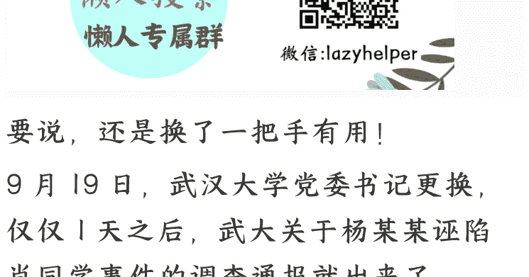
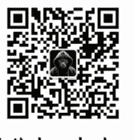

## 武汉大学通报调查结果，背后有什么内幕？

250922 文/卢克文工作室嘉宾 星海舰长
整理：公众号懒人搜索，懒人专属群独享
懒人微信：lazyhelper

要说，还是换了一把手有用！

9 月 19 日，武汉大学党委书记更换，仅仅 1 天之后，武大关于杨某某诬陷肖同学事件的调查通报就出来了。

通报结果如何呢？肖同学处分撤销，杨某某保留学位。

那么，这个结果是否符合实情？

先来看看通报里写了些啥。

第一部分，写了学校组织了多少人，通过多少种方式进行了查证。

然后话锋一转，说法院驳回了杨某某的上诉，所以学校“本着充分尊重司法判决的原则，结合调查复核情况，决定撤销肖某瑶记过处分。”

第二部分，先说了杨某某论文都是按流程审核的，又说组织人手对论文进行了复核，结论是未发现学术不端行为，决定维持其学位。

第三部分，对相关责任人员进行了问责，但多集中在批评教育和党内处分领域。

那么，我们如何评价这份通报呢？

答案很简单，避重就轻。

光从学校通报的字里行间中，就能发现很多有意思的东西。

比如第一部分，学校用了很大篇幅，说自己是如何组织人查看“图书馆性骚扰”事件的原始资料的。

那么，结论是什么呢？肖同学到底性骚扰了没有？

如果认定他性骚扰了，自己的处分是没错的，那就应该公正公开写出来，至于法院怎么判，那是法院的事情。

如果认定他没性骚扰，又何必等法院判决，直接取消处分不就得了？

现在学校不认定是不是性骚扰，那你前面用了那么大篇幅，说自己用了多少人调阅了多少档案，又有什么意义呢？

最搞笑的还是后面一句“本着充分尊重司法判决的原则，结合调查复核情况，决定撤销肖某瑶记过处分。”

这话的话里话外，怎么听着这么委屈呢？感觉是学校并不想撤销处分，但法院判了，学校没办法才撤销的呢？

从表述来看，通报这句话有个悖论。

司法判决和学校处分其实是两码事，二者并没有因果联系。

请大家注意，杨某某起诉肖同学，是指控他在公共场所违背女方意志持续摩擦下体，应被认定为性骚扰。7月25日，一审宣判。法院审理认为，不能认定男生肖某某针对特定对象实施了性骚扰，驳回女生杨某的指控。

也就是说，法院的意见是“不能认定男生肖某某针对特定对象实施了性骚扰”，而不是“肖某某没有性骚扰”，所以法院的判决其实是个“在现有证据条件下不确定是不是性骚扰”的状态，可能是，也可能不是。这个时候，学校的意见，就很关键了。

理论上，如果学校坚持认定自己围绕“性骚扰”做出的处分决定是正确的，那学校完全可以不撤销处分。

那这个时候，你咋不说“尊重司法判决”了？

反过来说，如果学校认定不是性骚扰，直接撤销处分就完事了，何必等二审？

所以，所谓“尊重司法判决”，完全就是学校给自己扯的虎皮，撤不撤销处分，完全就在学校的一念之间。

再看第二部分，洋洋洒洒写了一堆，其中不乏很专业的词汇，但我们省流来看，其实就是为了论证一个结论：

杨某某的论文，不属于“学术不端”。

为啥武大的通报要把关注点集中在“学术不端”上呢？很简单，只有“学术不端”才能撤销学位。

但学术不端并不是个宽泛概念，而是有比较清晰的标准的。

根据通行的标准，捏造数据、篡改数据和剽窃三种行为，就属于学术不端，有时候主观造假、编造结论也会被列为学术不端。

所以武大通报才会特别点明：“论文总文字复制比为 1.9%，符合所在学院要求”，这样一来，所谓“剽窃”就不成立了。

然后呢？在学校复核中，认为杨某某的数据没太大问题，个别图表的复现结果虽然有差异但不影响论文主要结论。这样一来，“捏造数据”和“篡改数据”也不成立了。

至于主观造假、编造结论，更是被专家组给否了。

杨某就算论文中有 100 多处表述不规范、引用不规范、格式不规范、翻译不准确、分析不准确等问题，但并不算“学术不端”，顶多算“论文瑕疵”。

武大的逻辑就在于，学术不端有规定可以吊销学位，但论文瑕疵没规定吊销学位。

看似说辞严谨，但说得过去吗？

杨某某论文中虚构中国不存在的《离婚法》，论文第四页出现“全国总人口从 1049 年之前的 5.42 亿”，这么低级的错误，已到了导师看一眼就会打回去的程度，能说明杨某对这个论文是认真的么？

但凡对学术有哪怕一丁点的敬畏之心，也不会犯这种错误，绝不是用“瑕疵”二字就能糊弄过去的。

可现在呢？武大对杨某某的学术态度视而不见，对问题论文是如何轻松越过中期、盲审、答辩、上传知网等多个关口的检验麻木不仁，却专门围绕“学术不端”来抠字眼给杨某某找借口，这不是避重就轻是什么？

第三部分，问责处理，更是避重就轻。

从通报来看，一共给了三个人党纪处分，按照冤有头债有主的追责原则，这三个人很可能就是给肖同学处分的关键人物。

武大党委学生工作部时任部长李某排第一个，那么极大可能对肖同学做出处分决定的，就是他牵头。那么事后追责他肯定是第一责任人，怎么也跑不掉。

从“时任”二字来看，李某现在已经调离工作岗位了，不排除是受此事影响，连官都丢了。

而后面的处分，更有意思了。

按理来说，杨某某是加害方，肖同学是受害方，但是在事后的追责中，无论是肖同学所在的外国语言文学学院的党委副书记刘某，还是杨某某所在的经济与管理学院的党委副书记谢某维，都给处分了。

从这一点我们有理由猜测，之所以给肖同学处分，是杨某某学院的领导，被杨某媛制造的舆论声势所裹挟，按闹分配，为了息事宁人要求处分，而肖同学学院的领导没有坚持真相，也没有尽到保护自己学院学生的义务，选择了顺水推舟，牺牲肖同学来平息事态，匆忙间对肖某瑶做出了非常不公平的记过处分。

从这一点来看，这俩人对肖同学的被诬告、被伤害、被网暴没有半点同情之心，对真相也并不在乎，对他们来说，平息事态捂住盖子，比什么都重要。一个孩子的清白，成了他们可以随意交易和处置的筹码。

而这，才是这个处理决定中暴露出的最可悲的事情。

至于学术问题的处理，相比来说就轻松多了，对于杨某某学院的副院长刘某青予以诫勉，学位评定分委员会书面检查并切实整改，基本上算是罚酒三杯了。

但问题在于，网友是想看他们被处理的吗？不是啊。

事情是谁挑起的？杨某某。 写小作文、裹挟舆论是谁干的？杨某某。 明明败诉还要上网挑衅民意惹出滔天舆情是谁干的？杨某某！

但现在，杨某某惹出这么大事情，一个副部级的领导都换了，跟着她被处理了一堆的人，怎么她自己安然无事呢？就算杨某某已经毕业，也撤销不了她的学位，武大已经失去了对她的管辖权，那武大难道就不能表明个态度吗？

哪怕只有一句“学校谴责杨某某的诬告行为，敦促其向肖同学道歉”，也行啊。

没有，什么都没有，武大和稀泥的行为，令人寒心。

## 2 那么，武大这一纸通报，反映了什么问题呢？

很显然，武大内部斗争之激烈，可能比我们观察的要严重。

很多人把这次通报，视为新书记上任后的处置，第一天上任，第二天通报就出来了。

但问题在于，这么个处理方式，大概率不是新书记的手笔。

稍微熟悉党纪处分程序的人都知道，党纪处分不是那么简单的，要纪委提出意见，党委多次研究，还要通报本人，处分决定还必须由受处分人签署意见，而这些流程，绝对不可能在一天之内完成。

所以，现在的这个处理意见，99%是上一任书记提的，这就很有意思了。因为武大换书记，并没有我们看到的那么简单。

一般来说，党委书记要满一届（5年）才会调任或者退休，而黄书记是63年的，还没到退休年龄，突然被换，足以说明上级已经不太信任这个黄书记了。

但是呢？黄书记在武大经营40多年，关系盘根错节，根深蒂固，想解决武大的问题，没有那么简单。我们再回想一下武大校长那句“等上级意见”，或许并不是推卸责任，而是有实实在在的难处？

校长一个空降派，面对一个根深蒂固的本土派，理论上这个本土派还要领导自己，他能怎么样？他又能干什么？就算他想第一时间撤销肖同学的处分，面对一群持不同意见的班子成员，他又能怎么样？

他能做的，恐怕也就是把问题捅给上级，让上级来压一下这个本土派了吧？

如果这还不能说明问题的话，可以看看新书记朱孔军，他原来是中山大学党委书记，2024 年才上任，结果 2025 年就被拽过来了，而且他还是个意识形态工作专家，让他来干啥，不言而喻了吧？

武大的书记和校长都是空降派，这种反常规的做法，难道还不能说明问题？但本土派会坐以待毙么？

显然不会。

副部级的人事调整他们干涉不了，但私下能干的事情，太多了。

比如，提前让纪委把处理意见提了，通知相关人员，让相关人员在处分决定上签署意见，甚至连党委会都开了，党委决议也作出了，全程合法合规。

然后新书记上任后，这个决议摆在新书记面前，你认还是不认？

不认，你作为一个新书记，还能把整个党委的决议都推翻了么？那你这个书记是不是太一言堂了？这不符合党委议事规则啊。

认了，那就相当于给这份处理结果做了背书，就算网友骂人也会带上你。而且一旦公布就意味着事情办结，你就算想以这件事为切入点开展工作，也没有抓手了。

你要是新书记，你怎么办？

面对根深蒂固的本土派，掀桌子是不可能的，只能徐徐图之。

毕竟新书记的任务，并不是来惩治杨某某的，而是肃清校内意识形态流毒的。只能先认下，再找机会慢慢来。而这，可能也是上任第二天就急匆匆发布通报的原因，这样一来，只要明眼人，都能看出新书记的难处了。

很多人可能会说，杨某媛作为诬告者、网暴者，难道就没有损失、没有惩罚，甚至连道歉都不用吗？掀起这么大风浪，引发这么大舆情，最后还能全身而退逍遥法外吗？

别着急，现在这个结果，绝对不算完。

一方面，这个通报并不会平息舆论，因为和公众朴素认知相差太大，其实是“反舆情处置规律”的，所以很大概率会起到一个火上浇油的作用，并出现更大的衍生影响。

而这些衍生影响越大，新书记开展工作，狠刹武大内意识形态的歪风，就越有抓手。

另一方面，本土派这种做法，看似精明，赢了一局，但犯了大忌讳。

上级把新书记派到这里是干嘛来了？心里不清楚么？仍然搞这种软对抗，上级怎么想？真把自己当藩镇节度使了？

很多时候，越是表现得针插不入，水泼不进，才越会引发上级的警惕，后面的事情，不言而喻了吧？

大家想一想《人民的名义》里面，自从沙瑞金空降汉东，很多事情其实已经注定了，不是么？

所以，不要急于一时得失，毕竟，武大需要惩处的不是一个杨某某，而是若干个杨某某，别着急，慢慢来。

最后，安利小懒的付费群：

懒人专属群（介绍）

微信:lazyhelper

懒人专属群持续更新中，已持续运营 6 年，整理超 3000 份各类精选付费文章 & 年费社群干货，全部开放下载。

本资料为付费群内部分享，仅供真实有需要的朋友查阅

懒人专属群更新记录：
https://lazy2025.top/blog/record2

懒人专属群更新记录（需梯子，备用）：
https://lazybook.fun/blog/record2