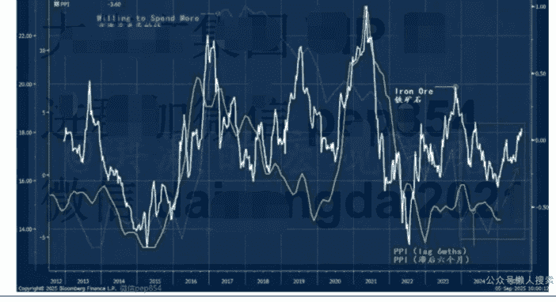
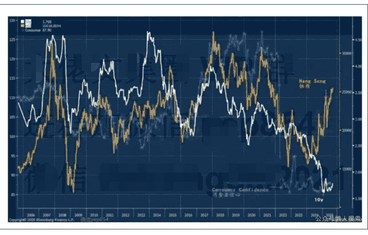
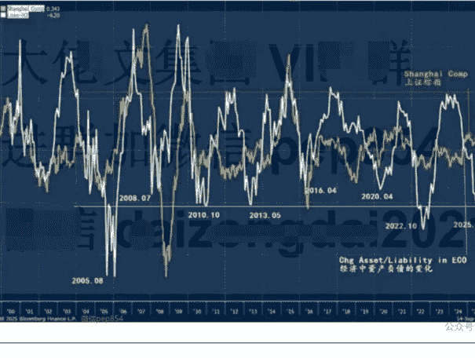

# 中国资产负债周期看多股市(单篇付费)

250922 洪灝 付费

整理：公众号懒人搜索，懒人专属群独享

懒人微信：lazyhelper

微信:lazyhelper

## 前言

这个鲜为人知的周期看多中国市场。

过去两周，我们深入中国腹地开展实地调研，并与国内投资者进行了广泛交流。这段行程收获颇丰，我们亲身感受到近期股市上涨对消费与市场情绪的提振作用：餐厅客流明显回升，但北京社零同比仍下降近9%。越来越多投资者开始讨论股票，由于我十六年前从华尔街归国后在中国市场积累的研判经验和历史成绩，也有越来越多的投资者向我咨询建议。市场上关于即将出台的利好方案的小作文也不绝于耳。

与此同时，经济数据与股市表现仍形成鲜明反差。民间借贷增速出现近年来罕见的收缩，若不是官方融资活动支撑，八月社会融资总量恐现负增长。多数城市房地产销量和价格持续下行，房地产投资亦同步走弱。部分重点二线城市房价同比腰斩，我们在广东某些边缘地区目睹二手房价砍价八成却仍无人问津的境况。

这些房产的持有者中弥漫着悲观的情绪——他们可能仅在数年前为投资或家庭储蓄配置而购入这些资产。如今这些房产年租金收益仅约万元。尽管股市近期大涨，但这类不动产储蓄难以迅速转化为股票投资。

随着经济数据放缓趋势日益明显，市场共识普遍将其解读为经济刺激的前兆。正如我们此前报告所述，有关部门的工作重心已从风险管理转向推动刺激，从容忍通缩转向经济再通胀。七月公布的雅鲁藏布江超级工程明确释放了政策转向信号（参见我们于七月二十六日发表的报告《洪灏：雅鲁藏布江》和九月一日发布的报告《洪灏：政策的拐点——牛市还能跑多远》）。若没有这种有关部门方向的转变，疲弱数据的本身仅能反映现状，而不能自动转化为经济刺激依据——这正是我们的预判与市场共识的分歧所在（图表一）。

值得注意的是，八月 M2 与 M0 增速差进一步扩大。虽然二者皆属流动性指标，但中长期与短期货币度量之间不断扩大的裂差暗示风险偏好正在回归。如我们此前所述，中国消费者信心始终徘徊于疫情以来的最低水平。这种疤痕效应表明中国市场动物精神已蛰伏多时，若没有政策引导难以自发复苏（图表二）。

虽然 M2 与 M0 增速差一直是中国经济的领先指标，但需注意这两项指标实则衡量银行负债端，反映的是银行体系内存款水平及其增长。鉴于中国正推进债务去杠杆，仅分析银行负债端意义有限。我们更应审视银行资产端与负债端的比率，又或者是信贷与负债比率。

当我们用银行信贷资产调整其负债端数据后，一个有趣现象浮现（图表三）：中国银行业资产—负债比率每次降至历史区间低点时，都标志着重要市场底部来临。此时，中国市场往往出现强势反弹。这一周期的低谷与中国历次重大市场底部基本吻合。

这是一个逆向的经济与市场的前瞻性指标。若信贷资产收缩速度远快于负债或货币供应增长，表明经济风险偏好极度低迷。在债务沉重的社会体系中，货币供应增加意味着债务扩张而非资产投资加速。当投资过分依赖债务驱动时，经济需要越来越多债务来支撑资产与整体增长。

尽管房地产投资较 2021 年峰值下降 30%，但全社会固定资产投资仍展现韧性。这种债务驱动型投资很可能已经转向制造业等领域，以弥补房地产投资缺口，这也解释了为何中国制造业正面临严重产能过剩的挑战。

资产—负债周期探底的可喜之处在于：经济周期已经运行到必须停止低效的债务驱动型的资产积累、开始削减非生产性投资的转折点。这一流动性周期为当前的政策转向提供了坚实数据支持，证实我们早前关于有关部门工作重心从通缩容忍转向经济再通胀的判断符合历史周期规律——这绝非空穴来风。

## 结论

我们独家构建的资产—负债周期模型已触及底部水平，这往往预示着中国市场将进一步走强。这个周期模型揭示了债务驱动型投资已难以有效形成资产积累，反而加剧产能过剩，亟待结构性调整。这一机制恰恰解释了为何政策重心正转向经济再通胀。

尽管经济数据面临挑战，但我们独有的模型和数据证实我们此前观点：决策者的政策转向旨在实现经济再通胀。若没有这种政策转向，疲弱数据就仅仅是疲弱的数据，如是而已，是不会自动转化为政策刺激的。我们预期未来数月将会有更多支持性政策将陆续出台。

最后，安利小懒的付费群：

懒人专属群（介绍）

📖 懒人专属群持续更新中，已持续运营 6 年，整理超 3000 份各类精选付费文章 & 年费社群干货，全部开放下载。

本资料为付费群内部分享，仅供真实有需要的朋友查阅 🤫

懒人专属群更新记录：
https://lazy2025.top/blog/record2

懒人专属群更新记录（需梯子，备用）：
https://lazybook.fun/blog/record2