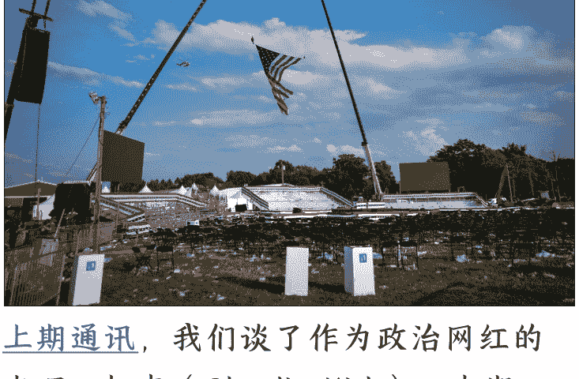
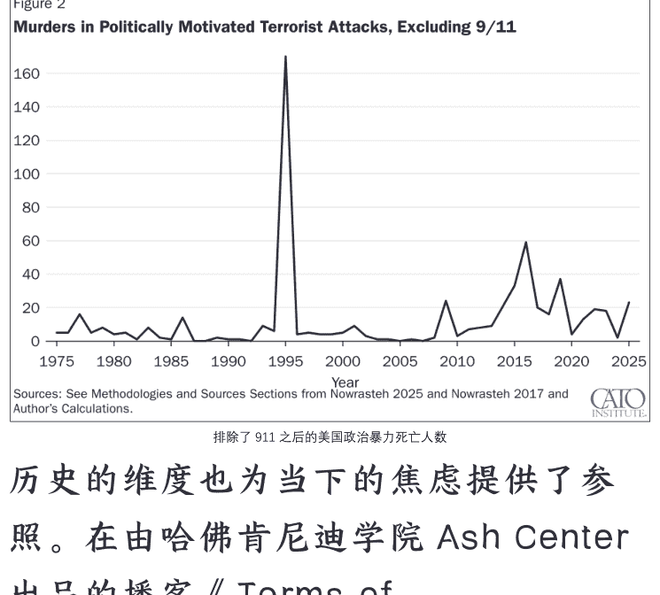

250925 新闻实验室

整理：公众号懒人搜索，懒人专属群独享
懒人微信：lazyhelper

> 当精英阶层为失去他们当中的一员而悲痛，并呼吁团结时，对于那些早已习惯被暴力对待的群体而言，这些呼吁只会显得空洞和刺耳。

上期通讯，我们谈了作为政治网红的查理·柯克(Charlie Kirk)。本期，我们从他被枪杀的事件延伸开去，谈谈美国的“政治暴力”(political violence)。

一种日益增长的威胁，还是一种历史常态？

每当发生高调的政治暴力事件时，公众的恐慌情绪便会急剧上升。民调公司 YouGov 在查理·柯克遇刺后（9月10-12日）进行的民意调查显示，高达87%的美国人认为政治暴力是一个问题，其中近六成（59%）的人称之为“一个非常大的问题”，而认为其“不是大问题”和“不是问题”的比例加起来仅有6%。

对于“美国的政治暴力是否正不断上升”这件事情，不同意识形态倾向的智库可能会给出不同的答案。

偏向自由派的智库布鲁金斯学会（Brookings Institution）就认为，来自不同政治派别的官员、法官和议员都正面临日益加剧的政治暴力威胁。关注美国政治新闻的朋友可能会记得，2025年迄今为止已经发生的极端暴力事件就包括：

- 明尼苏达州民主党州议员 Melissa Hortman 及其丈夫遭枪击身亡；
- 宾夕法尼亚州州长、民主党成员 Josh Shapiro 官邸遭纵火袭击；
- 一名移民与海关执法局官员在得克萨斯州拘留中心外遭枪击受伤；
- 新墨西哥州共和党总部遭纵火焚烧；
- 有枪手袭击了疾病控制与预防中心总部。

而去年，更曾发生针对川普的暗杀未遂事件。

因此，布鲁金斯学会在年度报告《民主行动指南2025》中强调，必须迅速且坚决反对一切形式的政治暴力或骚扰行为。

不过，保守派智库卡托研究所（Cato Institute）的一篇报告通过详尽的数据分析指出，从统计学上看，出于政治动机的谋杀（通常被归为最广泛定义的恐怖主义）在美国极其罕见。该报告统计，从1975年1月1日到2025年9月10日，在长达五十年的时间里，共有 3599 人在此类袭击中丧生，但这些死亡人数仅占同期全美所有谋杀案的约 0.35%。即便是将范围缩小到 2020 年之后，政治暴力导致的 81 人死亡也仅占同期凶杀案总数的万分之七。

报告强调，“3599 人”这个数字被 911 恐怖袭击事件这一极端个案严重扭曲，该事件的遇难者占了总数的 83%。如果排除 911，政治暴力导致的死亡人数曲线并未呈现出明显的近期高峰，1995 年（俄克拉荷马城爆炸案）和 2016 年（奥兰多夜店枪击案）的峰值反而更为突出。

历史的维度也为当下的焦虑提供了参照。在由哈佛肯尼迪学院 Ash Center 出品的播客《Terms of Engagement》最新一期节目中，哈佛大学历史学家 Alexander Keyssar 对“政治暴力正在上升”的说法持谨慎态度。

不过，他的观点和卡托研究所正相反——美国的政治暴力不是一直罕见，而是一直常见。他指出，美国本就是一个有着悠久暴力历史的国家（他的原话是“we are a violent country with a history of violence”）。他举例说，超过10%的美国总统都曾成为暗杀（包括未遂）的目标。Keyssar教授认为，虽然他可以为了论证需要而“切割数据”来得出不同结论，但他并不认为存在一个明确的、正在急剧恶化的政治暴力“比率”。

因此，问题的关键或许不在于死亡人数的绝对增长，而在于政治氛围的质变。Keyssar教授指出，当前公共话语中的敌意程度、公众对抗的激烈程度，甚至是来自政府本身的愤怒言论，都是“相对不寻常的”。换言之，虽然致命的暴力行为在统计上依然是小概率事件，但弥漫在社会中的敌对情绪、暴力威胁感以及将政治分歧视为你死我活斗争的氛围，已经达到了令人忧虑的新高度。

## 撕裂社会与双重标准

近年来的政治暴力事件，与社会的敌对情绪之间，互为因果、互相促进。暴力事件非但没能像911或波士顿马拉松爆炸案那样凝聚社会，反而往往成为进一步加剧两极分化的催化剂。查理·柯克遇刺后，犹他州州长Spencer Cox发表了一场充满反思的演讲。他没有将矛头指向外部，而是悲伤地承认凶手是“我们中的一员”，并呼吁社会保持道德清晰，强调“语言不是暴力，暴力才是暴力”，每个人都有责任选择不同的行为方式。他为凶手来自犹他本地而感到心痛，认为这本应是一个团结反思的契机。

与此形成鲜明对比的是，川普的前顾问 Stephen Miller 在福克斯新闻上立即将悲剧武器化。他将柯克的死归咎于“激进左翼”的“国内恐怖主义运动”，并誓言将在特朗普的领导下，动用包括《反勒索及受贿组织法》（RICO）在内的国家权力，“瓦解”那些煽动暴力的组织。这种迅速将悲剧转化为党派斗争弹药的做法，反映了美国政治生态的严峻现实，也无视左派人士同样是政治暴力受害者（例如明尼苏达州众议员 Melissa Hortman）的事实。

这种分裂并非仅限于政治精英。

YouGov 的民调数据清晰地勾勒出了普通民众中深刻的认知鸿沟。当被问及左翼和右翼暴力哪个问题更大时，自由派和保守派的看法呈现出完全相反的镜像：75%的自由派认为右翼暴力是更大的问题，而 73%的保守派则认为左翼暴力问题更严重。

民调还发现，民众对政治暴力的担忧程度，很大程度上取决于受害者与自己政治立场是否一致。例如，在柯克（右翼人士）遇刺后，共和党人比民主党人更可能认为政治暴力是“非常大的问题”（67%对58%）；而在此前民主党政治人物遇袭后，情况则恰好相反。

更有评论尖锐地指出，主流社会对“政治暴力”的讨论本身就充满了虚伪和双重标准。记者 Taylor Lorenz 在《美国真正的“政治暴力”》这则视频中指出，当权者和主流媒体在谴责针对精英的暴力时义愤填膺，却对早已成为贫困、移民、黑人、残疾人和性少数社群日常生活一部分的暴力视而不见。她质问：当警察在“黑人的命也是命”抗议中对青少年使用催泪瓦斯、联邦探员在波特兰向医护人员发射胡椒球弹、军队化的警察在北达科他州立岩（Standing Rock）用高压水枪和恶犬攻击原住民护水者，为何这些行为从未被主流话语定义为需要全国哀悼的“政治暴力”？

她的评论进一步将“暴力”的定义扩展到系统性层面。她认为，在新冠疫情期间强迫有色人种和穷人进入缺乏防护的致命工作场所，在过度拥挤的监狱中对病毒传播坐视不管，同样是暴力。移民与海关执法局（ICE）的突袭行动和拘留所内每年数十人的死亡，以及每年超过一千人被警察无辜枪杀（其中绝大多数是有色人种），这些被她称为“国家认可的暴力”。她指出，这些暴力在精英阶层的讨论中完全是隐形的。

柯克遇刺后，CNN评论员 Abby Phillips在X上表示，平台算法推送枪击视频“令人极度不安”。Taylor Lorenz对此的反应是：“你都去哪儿了？……难道过去两年里，你没有在每一个社交媒体上目睹被直播的种族灭绝吗？”她认为，这暴露了精英阶层生活在自己的信息回音室里面，与普通民众，尤其是边缘化社群所目睹和经历的日常暴力完全脱节。正是社交媒体让这种虚伪和双重标准清晰地暴露在美国公众面前。

因此，当精英阶层为失去他们当中的一员而悲痛，并呼吁团结时，对于那些早已习惯被暴力对待的群体而言，这些呼吁只会显得空洞和刺耳。

## 煽动性言论的代价

在探讨暴力的根源时，煽动性言论的角色成为无法回避的焦点。政治学者提出了“随机恐怖主义”（stochastic terrorism）的概念，意指虽然煽动性言论没有直接下达暴力指令，但它通过不断地妖魔化特定群体或个人，提高了某些心怀不满或精神不稳定的个体采取暴力行动的概率。布鲁金斯学会的文章也明确指出，领导人及其支持者的煽动性言论和政策，加上网络虚假信息的传播，是导致政治暴力威胁上升的关键因素。

颇具讽刺意味的是，查理·柯克本人也曾发表过极具争议的言论，他声称“为了保护第二修正案，每年付出一些枪支死亡的代价是值得的”。这一言论在他自己成为枪支暴力的受害者后，引发了激烈的社会辩论。YouGov的民调显示，美国民众对此观点分歧严重：47%的人认为每年付出一些枪支死亡的代价是不值得的，但也有30%的人认为值得。而且，这种分歧严格地沿着党派划分——76%的民主党人说“不”，而54%的共和党人说“是”。

那么，前方的道路在哪里？布鲁金斯学会呼吁，各级领导人必须始终如一地、跨越党派地谴责暴力，执行相关法律，并倡导非暴力的冲突解决方式。明尼苏达州遇刺事件的幸存者、州参议员 John Hoffman 则发出了“以治理取代积怨（governance over grievance），以服务取代自私（service over self），以行动取代愤怒（action over anger）”的恳切呼吁。而卡托研究所的分析者则从另一个角度发出警告：最大的危险可能来自对威胁的过度反应。他们担心政府会借此发起新的政治迫害或无限扩张权力，重蹈 911 后反恐战争侵犯公民自由的覆辙。

《美国真正的‘政治暴力’》的作者 Taylor Lorenz 则提出了更具颠覆性的观点。她认为，当国家本身在国内外持续实施暴力，并视无数人的生命为“可消耗品”时，民众会开始反问：“如果国家可以杀死无辜的人，那我们为什么不能杀死那些真正在造成伤害的人？”她认为，解决问题的关键不是简单地谴责暴力，而是要承认并拆除那些制造不公和痛苦的系统性暴力。否则，对“文明”和“民主”的呼吁，在许多人看来只是“为冷酷暴力系统打掩护的陈词滥调”；

历史学家 Alexander Keyssar 悲观地认为，被释放出来的敌意怪物已经从瓶子里出来了，社会普遍缺乏降低政治温度的共识。悲剧发生后，许多人似乎更感兴趣的是利用它来继续潜藏已久的争吵。

这表明，美国面临的挑战不仅是阻止孤立的暴力行为，更是如何治愈一个已经深度撕裂的政治文化——在这种文化中，暴力正被一些人视为一种可以想象的选项，而每一场悲剧，都可能在瞬间被转变为党同伐异的武器。

## 最后，安利小懒的付费群：

### 懒人专属群（介绍）

📚 懒人专属群持续更新中，已持续运营 6 年，整理超 3000 份各类精选付费文章 & 年费社群干货，全部开放下载。

本资料为付费群内部分享，仅供真实有需要的朋友查阅 🤫

懒人专属群更新记录：
https://lazy2025.top/blog/record2

懒人专属群更新记录（需梯子，备用）：
https://lazybook.fun/blog/record2