# 沉思的普京

250926 青云读书会

整理：公众号懒人搜索，懒人专属群独享
懒人微信：lazyhelper

## 序：飞越国际日期变更线

当银灰色的伊尔—96—300PU 飞机像一只雄鹰掠过白令海峡上空，穿过国际日期变更线的瞬间，时间随之倒流，飞机上的座钟钟摆从今天被拨回到昨天。

变更线西侧的俄罗斯远东时间是 8 月 16 日凌晨 4 点。

变更线东侧的美国阿拉斯加时间是 8 月 15 日上午 9 点。

此时此刻，北京时间是 8 月 16 日凌晨 1 点。

根据 Flightradar 数据，12882 人在线实时追更这架飞机的动态。

> 没错，这只雄鹰的主人不是别人，正是俄罗斯总统普京。

The second of three Russian government IL-96s inbound to Anchorage is about to land. flightradar24.com/RSD171/3bbb0877

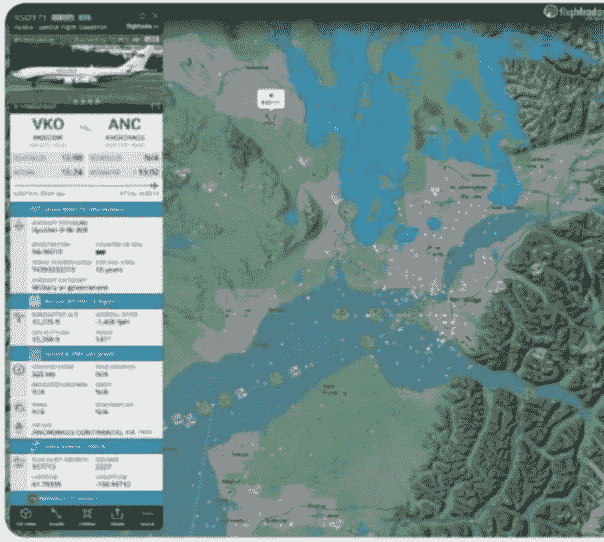

6:49 · 15 Aug 25 · 172K Views

2 个小时前，普京刚结束对远东马加丹州的视察，一上专机，他像往常一样先通过运动醒醒神，在专机的迷你健身房里简单进行了无氧锻炼，之后在淋浴间冲了个热水澡。

每天花 2 个小时左右的时间锻炼，这是普京多年的习惯了。

要是平时在总统官邸，普京还会游上个把小时，游泳有助于他的思考。

但专机条件毕竟有限，跟沙特皇室的专机比还是差了点“排面”，后者是四层的大别墅，自带游泳池和音乐厅。

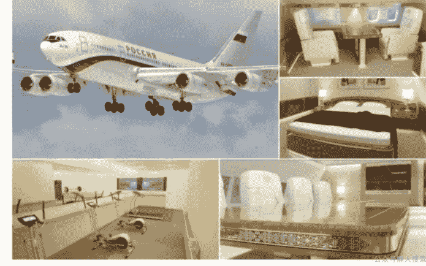

但普京的专机，也算是“豪华大平层”，这款俄罗斯版的“空军一号”，被称为“空中的克里姆林宫”。

专机的装修风格同克里姆林宫的新古典主义风格相似。

墙面上挂着巴甫洛夫斯基波萨德纺织厂（俄罗斯最著名的纺织厂，具有200多年历史）的毛毯，内饰使用卡累利阿共和国的桦树木进行贴面，配备有会议厅、总统休息室、健身房，淋浴间、酒吧和厨房。

洗去了一天的疲惫，普京一如既往地坐在专机舷窗旁，看着下方蓝色的白令海峡陷入沉思。

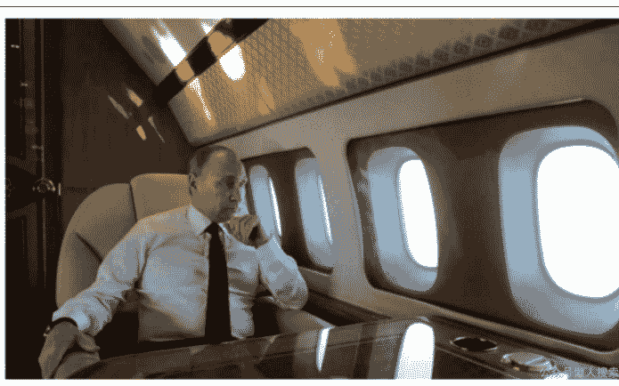

美国和俄罗斯之间最近的距离不到4公里，俄罗斯实际上是美国唯一一个欧洲邻国，普京喃喃自语，俄罗斯周围有14个邻国，唯独美国这个邻国，这么近那么远。“你好，我的邻居”，普京想好了同特朗普说的第一句话。此番去阿拉斯加，普京将成为第一位踏上阿拉斯加历史领土的俄罗斯领导人。1867年，俄罗斯沙皇亚历山大二世以720万美元的价格将阿拉斯加卖给了美国，一个半世纪过去了，再无俄罗斯领导人踏上这片故土。

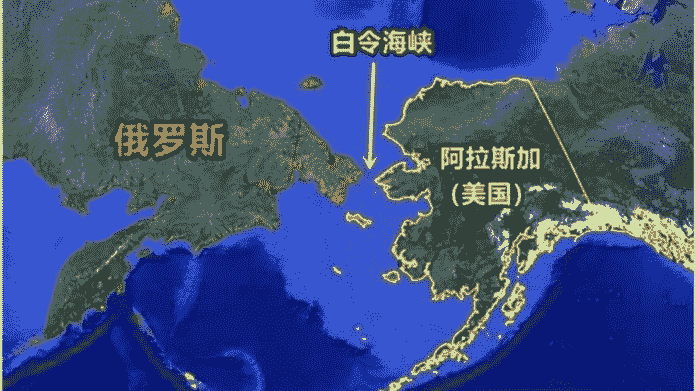

再过2个小时，阿拉斯加当地时间11点，他将抵达阿拉斯加州安克雷奇市的埃尔多夫—理查森军事基地，出席全球瞩目的俄美阿拉斯加峰会。

这是一场并不轻松的鸿门宴，他看到了特朗普关于此次会晤的评论，赌注极高、事关重大（highstakes）。

确实事关重大，普京还读到了美国外交事务杂志的评论，称这场会晤或将同1945年雅尔塔会议后的雅尔塔体系一样，推动国际格局迎来阿拉斯加体系。

自 1999 年执政以来，普京先后和克林顿、小布什、奥巴马、拜登和特朗普这 5 位美国总统打过交道，流水的美国总统，铁打的俄罗斯普京。

凭借多年和美国打交道的经验，普京深知，阿拉斯加峰会的每一处安排都充满不确定性，他在前往阿拉斯加的每一步都暗藏玄机。

正琢磨着，休息室的门被推开。78 岁的外事助理乌沙科夫走了进来。

他担任外事助理已经 13 年了，稳健温和，善于沟通，与强硬的外长拉夫罗夫形成默契的“红白脸”。

普京长年习惯了乌沙科夫呆在身边，舍不得老伙计，愣是一年又一年地延长乌沙科夫的退休年龄。

这次普京带了五名官员，是俄罗斯响当当的五虎将，除乌沙科夫外，还有外长拉夫罗夫、防长别洛乌索夫、财长西卢阿诺夫、直接投资总裁德米特里耶夫。

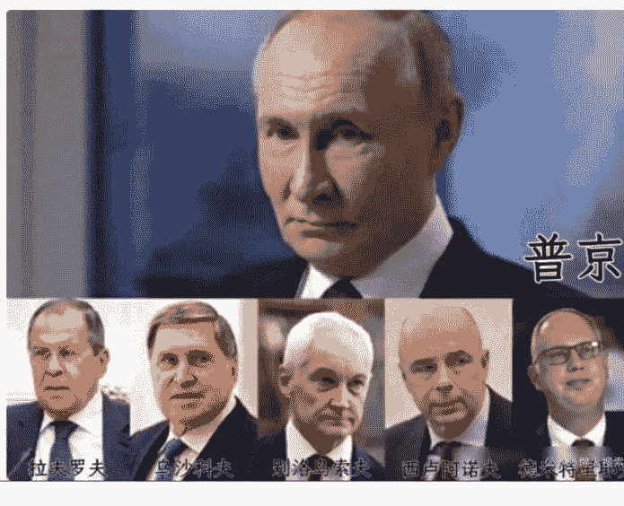

乌沙科夫呈上了筛选过的五份简报，里面全是围绕峰会的各种分析和预案。

普京理了理思绪，在万米的高空开始了高强度的工作。

## 一、安保简报

首先映入眼帘的是联邦警卫局及其下属总统安全局呈上来的安保方案，方案扉页上写着，“请总统先生审阅”。

落款是科奇涅夫。

联邦警卫局是一个涵盖情报、通信、作战支援在内的复合型安保天团，实际上是普京的“御林军”。

根据俄罗斯前总统叶利钦的保镖回忆，超过 5 万人参与普京的安保工作，堪称“地表最强安保配置”。

科奇涅夫大将则是普京多年的心腹，2016 年以来便担任警卫局局长，风格上属于“低调到没存在，强硬到没对手”，一手打造了这个世界上最具现代化的“御林军”，是普京 360 度无死角、24 小时无时差的“安全管家”。

俄罗斯的国家安保体系主要包括三个要害部门，构成“三层防护网”：联邦警卫局管“最核心的人”，除了普京，其他高层政要的安全也归他们管，相当于“VIP 专属保镖”。

内务部管“最多数的人”，日常治安、街头巡逻全靠它，跟咱们的公安部差不多，是“全民安全守门员”。

国民近卫军更狠，管“最危险的事”。

这支部队2016年从内务部独立出来，专门处置大规模骚乱、高强度反恐，而且不受司法体系约束，简单说就是“内务部搞不定的事，我来!”，活脱脱现代版“锦衣卫”，气场直接拉满。

不过就算有这么硬核的安保，普京现在也很少“出国旅游”了。

确保自己的至高、绝对安全是普京出访的头等大事。

为确保安全，普京近年来已大幅减少海外出访频率。

俄乌开战以来，普京受到美西方集体制裁，还被所谓的国际刑事法院列入通缉黑名单。

这些举措实际意义不大，但侮辱性极强。

更麻烦的是美欧对俄关闭领空，普京的专机得绕着走，飞行安全受到诸多限制。

去年在南非举办的金砖峰会，在巴西举办的G20峰会，全是外长拉夫罗夫“代班出差”。

普京自己只是去白俄罗斯、中亚这些“邻居家”串串门，要么来中国——

毕竟中国主场安全又靠谱，还能顺便会会新老朋友。

大佬总喜欢把重要的饭局安排在自己熟悉的餐厅。

今年5月，普京在乘坐直升机视察库尔斯克时，遭到46架无人机袭击，这令科奇涅夫着实捏了一把冷汗。

联邦警卫局此次更是不敢大意，“过筛子”似的排除安全风险，一点都不敢马虎。

### 爆料：普京视察时遭遇大规模袭击

原创 孔尔军 环球时报 2025年05月26日15:47
北京2102人

据今日俄罗斯电视台(RT)等俄媒25日报道,俄罗斯军方披露,俄总统普京在5月20日乘坐直升机视察库尔斯克州期间,当地俄军防空部队正在拦截大规模无人机袭击。按照俄军某防空师指挥官达什金的说法,普京乘坐的直升机当时处在乌克兰无人机袭击的“中心”。

就拿这次俄美元首会晤的地点来说,双方光是磋商就磨了好几轮。

科奇涅夫对美国人打趣说,这比“约会选餐厅”还要纠结。

欧洲密集劝说美国在瑞士或奥地利举行峰会,但俄罗斯表示反对。

瑞士、奥地利追随美国对俄制裁,冻结俄海外资产,早已失去了所谓的中立国地位。

俄美此前在沙特进行了 3 轮高级别会谈，也曾考虑在沙特、阿联酋等中东国家举办峰会，利雅得、迪拜早已取代日内瓦、维也纳成为大国谈判的新中立区。

但中东局势不稳，普京的专机需要过境多国，安保是个大问题。

几经波折，双方安保团队最后选定在阿拉斯加州安克雷奇市的埃尔门多夫—理查森军事基地。

从安全角度看，普京飞往阿拉斯加不需经过任何国家的领空，美国军事基地也可最大程度确保俄美元首的安全。

普京出发那天，俄罗斯联邦警卫局上演了“真假专机”大戏。

除了普京乘坐的专机，另外 2 架一模一样的伊尔—96 专机同时从俄罗斯飞往美国，在北极上空疯狂划出令人眼花缭乱的航迹，估计雷达都得看懵。

这是俄方常用的“障眼法”，双机飞行或者三机飞行，最大程度确保国家元首的安全。

除了“多机迷惑战术”，俄罗斯安保部门还上了好几道保险。

苏—57 隐身战机全程护航，米格—31 战机不间断巡逻白令海峡，太平洋舰队进入战斗执勤状态，海陆空全方位保障最高统帅安全。

与此同时，负责后勤运输的伊尔—76专机已提前抵达阿拉斯加机场，普京的2辆专车“奥鲁斯”（其中1辆备用）已在机场等候普京。0902BH977俄罗斯代表团官员，安保人员以及随行记者团，也都已先期抵达安克雷奇。

一般来说，元首出访都需要先遣队打头阵，后勤安保到位了，普京才能动身。

普京乘坐的专机伊尔—96—300PU，是苏联时代研发的最大型客机，由著名的沃罗涅日飞机制造厂制造，配备俄军指挥系统、专用通信系统以及防空系统和干扰雷达，当然还有核发射系统。

这架专机拥有4台发动机，即使2台发动机失效，飞机仍可安全操控着陆。

但伊尔—96毕竟是苏联时代的产物，现役不过20多架，性能一般，非常耗油，每小时耗油10—15吨，返程时需要大量加油。

问题来了，俄罗斯受到美西方制裁，无法使用swift系统结算。

美国人不惯着俄罗斯，被制裁的飞机可以进来，被制裁的官员可以进来，就是不给予俄罗斯金融上的临时豁免，就是在经济上给俄罗斯套上紧箍咒。

于是，如何支付专机返程加油费用便成为联邦警卫局比较头疼的问题，科奇涅夫不得不为此请示普京。

普京大笔一挥作出指示，现金买油。

美国国务卿鲁比奥后来也证实了这一点，俄罗斯代表团的确使用了现金支付。

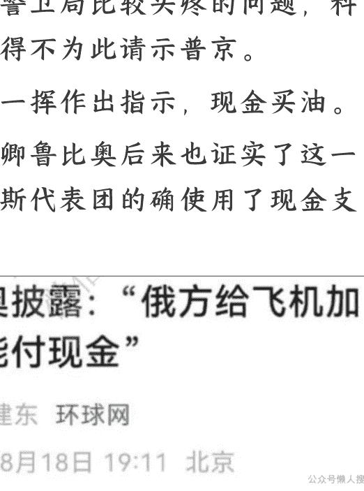

普京采用了“最原始的方式”破解了美西方的把戏，俄罗斯也通过以货易货的方式规避了一些西方制裁，但这些都不是长远之计。

打仗打的是钱，俄罗斯经济到底怎么样呢？

## 二、经济简报

摆在普京面前的第二份报告来自总理府。

这是一份“从经济形势论俄美谈判方针”的报告，落款是米舒斯京。

普京乘专机飞往美国之前，他还是不放心，多年的克格勃经验告诉他，凡事要做最坏打算，凡事得留最后一手，莫斯科必须有人坐镇。

于是他紧急召回出访的米舒斯京，担任临时一把手。

接到普京总统的指示时，总理米舒斯京正在吉尔吉斯斯坦开会，这是欧亚经济联盟年度的总理会，大家正在热情讨论。

但米舒斯京深知事关重大，一刻也不敢耽搁，立马起身对与会者说道：
“抱歉，我必须返回莫斯科。

大家知道，俄美峰会今天将在阿拉斯加举行。”米舒斯京担任总理已经5年，普京打心底里满意这个“二当家”。

要知道，普京在2020年任命米舒斯京担任总理时，维基百科上还没有他的英文词条。

归根结底，米舒斯京在经济管理领域业务精湛，既务实也创新，带领俄罗斯挺过了疫情危机和西方大规模制裁危机，普京对他能力的认可逐渐转化为深厚的信任。

米舒斯京出生于普通的莫斯科公务员家庭，通过自身努力成长为一位职业技术官僚，担任总理之前是俄联邦税务局局长，很少在公众面前亮相。

俄罗斯媒体赞誉他打造了“世界上最好的税收系统”，英国《金融时报》称其为“来自未来的税收员”。

更有意思的是米舒斯京的“偶像清单”：排第一的自然是普京，第二是俄罗斯航天大佬科罗廖夫，第三居然是美国苹果公司创始人乔布斯。

这一点和他的前任梅德韦杰夫很像，两人都很喜欢苹果，梅德韦杰夫是知名的“果粉”， iPad 不离手，曾在开会间隙用 iPad 看世界杯。

米舒斯京在上世纪 90 年代初曾与乔布斯结识，他从后者那里学到，重要的是利用生活中所出现的偶然性来达成重大目标。

米舒斯京做到了，当普京 2020 年修改宪法撤换内阁时，他抓住了机遇，把偶然性变为了必然性，从“税务局长”一跃成“内阁总理”。

如今，米舒斯京已经是俄罗斯现代历史上在职时间第二长的总理（ 5 年 8 个月），仅次于前总理梅德韦杰夫（ 7 年 8 个月）。

米舒斯京的任期持续到 2030 年，不出意外，他将超过后者。

米舒斯京总是带着一副大框近视镜，不苟言笑，表情严肃得像“教导主任”，但生活中为人随和，多才多艺，弹得一手好钢琴，不仅在音乐上如此，在工作上也是如此，方方面面都能兼顾到。

俄乌打仗以来，美西方对俄罗斯实施近 3 万项制裁，米舒斯京协调央行、财政部、经济发展部等十多个部委，快准狠出台了系列反危机反制裁措施，制定了“战争经济学”发展策略，结果俄罗斯越打越有钱，经济实现止跌回升，2023年、2024年分别增长4.1%、4.3%，这令美西方所谓的“制裁核弹”哑了火。

### 【俄罗斯已遭近2.9万项制裁】

卫星通讯社根据独立分析机构Castellum的数据和公开信息计算，自2014年以来对俄罗斯实施的制裁数量已达到近2.9万项，其中美国、加拿大和瑞士实施的限制措施最多。

截至2025年4月底，外国对俄罗斯实施了约28937项非贸易制裁。其中，92%是自2022年2月底以来实施的制裁。

美国实施的限制措施最多，占各国实施制裁总数的25.5%，达7384项。排在前三位的还有加拿大，占12.6%(3639项)，瑞士占11.3%(3266项)。

接下来是挪威，对俄实施了约2678项限制措施(占9.3%)；正在制定第17轮对俄制裁的欧盟和与欧方制裁相同的冰岛各实施了2482项限制措施(占8.6%)；英国实施了2078项制裁(占7.2%)。

| 国家/地区 | 制裁数量 | 占比 |
|---|---|---|
| 美国 | 7384项 | 25.5% |
| 加拿大 | 3639项 | 12.6% |
| 瑞士 | 3266项 | 11.3% |
| 挪威 | 约2678项 | 9.3% |
| 欧盟 | 2482项 | 8.6% |
| 冰岛 | 2482项 | 8.6% |
| 英国 | 2078项 | 7.2% |

但米舒斯京心里门儿清：“战争经济学”再牛，也拗不过经济规律。

俄罗斯版的“军事凯恩斯主义”以国家安全需求为导向，短期内可通过大规模军事开支带动军工企业，刺激总需求，促进就业和经济增长，但管得了一时管不了一世。

长期下来，资源全往军工倾斜，科技、民生、基建的钱就少了，经济转型根本没动力。

这就是经济学上著名的“吸尘器效应”。

最直观的就是老百姓和企业的日子:

俄罗斯央行实施“高利率，稳汇率，保民生”政策，严格控制通胀水平，将银行基准利率维持在 20%左右，目前调低至 17%，但在新兴市场里仍是高得吓人的“天花板”。2024 年，外国直接对俄投资降至 33 亿美元，为2001 年以来最低。

而国内银行贷款优先给军工企业，老百姓贷款买房难，民企融资更是“求爷爷告奶奶”，俄罗斯的经济如今很不景气。

俄罗斯有个超接地气的经济衡量指标——红菜汤指数。

这红菜汤上世纪随着俄罗斯侨民传到上海叫做罗宋汤(“罗宋”是俄语“俄罗斯”的音译)，传到哈尔滨叫做苏泊汤(“苏泊”是俄语“汤”的音译)，配料有牛肉、土豆、红菜、胡萝卜、卷心菜等这些家常菜。

所谓“红菜汤指数”，就是看煮一碗汤的成本涨了多少，这要比 GDP 数据还实在。

一碗小小的红菜汤，实际上是俄罗斯经济的晴雨表。

今年以来，这指数简直一路飙升：土豆价格涨了 90%，卷心菜涨了 31%，甜菜涨 27%，黄油涨 31%。

对应地，俄罗斯年通胀率 8.2%，远高于央行设定的 4%目标。

土豆是俄罗斯人的“第二面包”，如今的俄罗斯深陷“土豆危机”，以前论袋买，现在论个挑。

退休老太太现在煮个红菜汤，放土豆都得掂量好几次。

为了缓解“土豆荒”，俄罗斯不得不把目光投向中国。2025年1—5月，俄罗斯阿穆尔州进口中国土豆3.2万吨，而去年同期为823吨，暴增40倍。

以至于白俄罗斯卢卡申科也要向普京送土豆。

卢卡申科今年访问北京时开展了一波“土味外交”，向与会的各国领导人送了白俄罗斯土豆。

当被问道有没有向普京赠送土豆的问题时，卢卡申科打趣道，普京当然问我要土豆了，前不久还向我抱怨俄罗斯市场上短缺白俄罗斯土豆。

更麻烦的是“入不敷出”。

军费一路飙升，一年将近花费1200亿美元，占财政支出比例从战前的15%涨到30%以上，占GDP比重约为7%。

可石油天然气收入下降了15%，“俄油”公司的利润大幅缩水60%，相当于“赚钱的路变窄，花钱的坑变大”。

为了填财政窟窿，俄罗斯只能动“压箱底”的存款——国家福利基金。

这个基金是俄罗斯应对油价波动、弥补财政亏空的一个缓冲器。

当油价高于财政预算设定的基准油价（今年设定的是 60 美元）时，额外收入便存入到这个基金当中；当油价低于基准油价时，就可以使用基金的钱填补财政亏空、兜底民生。

可是，战争打了三年，俄罗斯财政赤字连年扩大，国家福利基金的可流动资金仅剩不到 500 亿美元，据俄罗斯塔斯社报道，或于 2026 年耗尽。

国际油价下跌，军费支出高企，西方制裁收紧，军工经济反噬，种种原因促使俄罗斯经济形势急转直下，2025 年第二季度实际 GDP 同比仅增长 1.1%，低于第一季度的 1.4%，不足去年同期的四分之一，经济明显失速。

因此说，俄罗斯所谓的过热经济和超低失业率只是表象，背后隐藏着巨大的危机。

米舒斯京显然看到了这一点。

于是，米舒斯京根据国内经济形势，对俄美和谈谨慎地汇报了自己的看法，“战时经济”的正向拉动作用呈现边际递减效应，在可预见的未来要平衡好“大炮与黄油”的关系。

普京一下子读出了米舒斯京的潜台词，打仗快没钱了，特别军事行动要想办法体面结束。

米舒斯京同样给出了他的建议：俗话说，见面三分情。

争取让美国松点制裁，哪怕不松绑，也别添加新制裁；让财长西卢阿诺夫、直接投资总裁德米特里耶夫跟美国财长贝森特、商务部长卢特尼克先搭上线，搞好关系。

普京看到这里，同样点了点头，这次随团他带了五名干将，其中 2 名都是经济官员，西卢阿诺夫和德米特里耶夫。

西卢阿诺夫在财政部干了 30 多年，是跟随普京多年的老臣了，被称为普京的“首席财经顾问”。

德米特里耶夫则是普京新提拔的金融翘楚，前不久刚刚被擢升为总统特别代表，负责国际投资合作。

德米特里耶夫毕业于美国斯坦福大学和哈佛商学院，同美国总统中东问题特使维特科夫私交不错，过去几个月一直担任俄美关系中间人。

实际上，德米特里耶夫是小女儿吉洪诺娃推荐的人选。

德米特里耶夫的妻子波波娃与吉洪诺娃是好闺蜜，同学加同事。

而德米特里耶夫曾与吉洪诺娃前夫沙玛洛夫同任西布尔公司董事会成员。

眼下，德米特里耶夫已逐渐跻身普京家族的侧近圈，被视为普京经济外交的重要助手。“笨蛋，问题是经济。”

普京想起了美国总统克林顿的经典名言。

在今年的圣彼得堡国际经济论坛，普京反复被问及俄罗斯经济的负面问题，他微微一笑，幽默地援引美国作家马克·吐温的名言，“关于我死亡的报道被过分夸大了”。

马克·吐温是普京最喜欢的作家之一。

普京又何尝不知道“大炮与黄油”的关系，巧妇难为无米之炊，这也是他任命经济学家别洛乌索夫担任国防部长的原因。

普京曾在别洛乌索夫的任职会上说道，“枪炮”与“黄油”之间的这种关系必须有机地融入俄罗斯国家的总体发展战略。

希望安德烈·雷莫维奇（别洛乌索夫的名字）能够以最佳方式完成这项任务。”想到这儿，普京指尖划过简报，缓缓翻开了别洛乌索夫呈上的文件。

## 三、战场简报

这份普京的第三份报告来自国防部，标题为“从战场形势论俄美谈判方针”，落款是防长别洛乌索夫。

别洛乌索夫也是陪同普京访美的五虎将之一，他在报告中详细汇报了乌克基于战场现地形势，包括普京每天都要看的每日战况。

别洛乌索夫一开篇就给普京吃了颗“定心丸”：“俄军保持战略主动，在各个方向都在进攻。”紧接着，他直接把特别军事行动抬到“第三次伟大的卫国战争”的高度，特意用排比的句式把气势拉满：1812年，第一次卫国战争，俄罗斯帝国元帅库图佐夫采用焦土战术，一把火烧了莫斯科，不留给法国人任何物资，历时160天，最终打败了拿破仑。1941-1945年，第二次卫国战争，苏联军民秉持着“一切为了前线，一切为了胜利”的精神，历时1418天，最终战胜了希特勒。

截至2025年8月15日，俄乌战争已经打了1269天，俄罗斯实际上在同整个北约及乌克兰作战，这是我们第三次伟大的卫国战争。

别洛乌索夫坦诚地指出，作为经济学家，我知道，俄罗斯经济眼下存在困难。

但作为国防部长，我认为，我们的经济熬过了2022年的“至暗时刻”，接下来再咬一咬牙，什么困难也都能挺过去，时间在俄罗斯一边。

俄罗斯民族作为胜利者的后代，终将赢得第三次卫国战争的胜利。

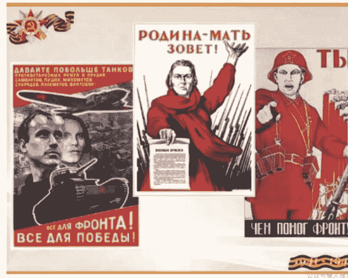

别洛乌索夫在报告中详细说明了战地情况。3年以来，俄军已经拿下11万平方公里土地，约占乌克兰约20%的土地面积，包括99%的卢甘斯克地区，70%以上的顿涅茨克、赫尔松和扎波罗热地区。

尤其是2025年以来的夏季攻势，俄军已接近突破顿巴斯的最后一道堡垒防线。

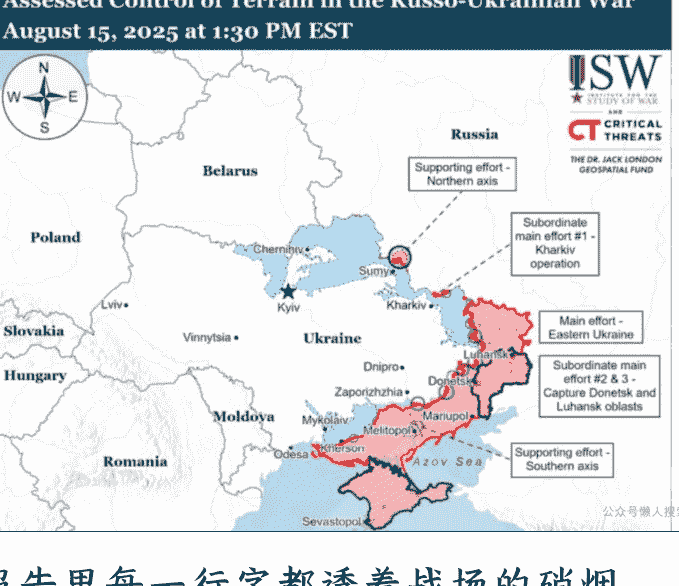

报告里每一行字都透着战场的硝烟味，别洛乌索夫的雄心溢于言表。

在战场形势有利于俄的基础上，别洛乌索夫大胆给出关于俄美谈判的建议。

首先是谈什么的问题，是谈停火协议还是和平协议。

特朗普放风称，俄美峰会的第一要务是停火，第二要务是和平协议，即所谓“先停火后和谈”。

别洛乌索夫认为，美方的提议于俄是吃亏的，俄罗斯绝不能停火，停火只会给予北约武装乌克兰的喘息之机。事实证明，普京采纳了别洛乌索夫的建议。

在同特朗普的会晤中，始终坚持不停火的底线，强调愿一步到位谈成和平协议。

后来的故事大家知道了，特朗普不仅接受了这一点，还允诺推动乌克兰和欧洲同意这一方案。

接着是怎么谈的问题。

和平协议涉及两个关键问题，领土和安全保障。

特朗普、鲁比奥多次接受采访时表示，俄乌冲突将以领土交换以及对乌克兰提供某种形式的安全保障结束。

一些欧洲国家已经同意为乌克兰提供“不是北约成员，类似北约成员”的安保措施。

针对美方的这个问题，别洛乌索夫直接给普京支了“分而治之”的招：领土问题跟乌克兰谈，谈不拢就用军事解决，核心是已经加入俄罗斯版图的领土不能让；安全问题跟美国谈，抓住美国这个“牛鼻子”，就能带动欧洲和乌克兰，核心是乌克兰绝不能加北约，北约军队也别想进乌克兰。

后来路透社曝光的俄方条件，完全是按这个思路来的：乌克兰从俄方还未解放的顿巴斯地区完全撤兵，这部分土地面积达6600平方公里，同时要求乌克兰不能加入北约，不能允许西方国家在乌克兰境内部署地面维和部队。

作为交换，俄将归还俄方控制的苏梅州和哈尔科夫州的零星土地，面积仅400多平方公里，同时愿冻结扎波罗热和赫尔松的战线。

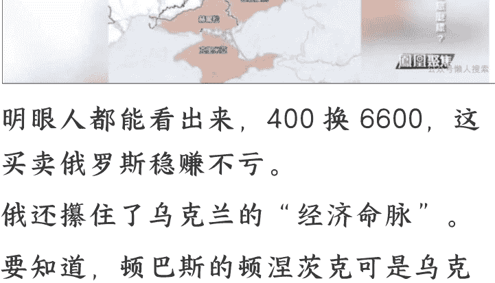

明眼人都能看出来，400换6600，这买卖俄罗斯稳赚不亏。

俄还攥住了乌克兰的“经济命脉”。

要知道，顿巴斯的顿涅茨克可是乌克兰重工业和矿业的支柱。

对于俄方的提议，美国会不会同意暂且不说，乌克兰第一个站出来反对。

泽连斯基后来在美国白宫极力劝说特朗普相信乌克兰的战斗力，强调乌克兰不会作出领土让步，美国要对乌克兰有信心，普京要拿下顿巴斯剩余地区至少还得4年！

但是，乌克兰的抗议就像“小石子投进大湖”。

在大国的大博弈、大交易面前，谁又会在乎一个小国的呐喊和悲剧呢？

战争打了3年，乌克兰发现自己连棋子都不是，而是任人宰割的棋盘。

后来普京9月3日在北京进一步向乌克兰发出了强硬信号，如果与乌克兰的谈判没有结果，俄不得不通过军事手段解决问题。

最后，别洛乌索夫斩钉截铁地总结道，战争不能停，和谈可以搞，交易要按俄方的条件来。

别洛乌索夫的建议非常对普京的胃口。

没错，米舒斯京也是对的，经济存在问题，战争不能长期持续。

但是，而且“但是”后面的往往是真理。“战争无非是政治通过另一种手段的继续。”这是《战争论》作者克劳塞维茨的名言。

战争是政治的继续，而不是经济的继续。

一个国家，统筹发展与安全两件大事并不容易。

但对俄罗斯人来说，不安全感根深蒂固是俄罗斯民族的天然基因，安全永远大于发展。

对普京来说，特别军事行动要解决的是俄罗斯未来十年乃至几十年、上百年的安全，要比眼前的短期经济形势重要的多。

明确了谈什么和怎么谈的问题，普京的心情愉快了许多。

他回忆起这些年的大风大浪，1999 年的车臣战争、2008 年的俄罗斯和格鲁吉亚战争、2014 年的克里米亚战争、2015 年叙利亚反恐战争，无一例外，他都胜利了。

这次的特别军事行动也一定要打一场漂亮仗，作为自己可以比肩彼得大帝、叶卡捷琳娜大帝、斯大林元帅的最辉煌的政治遗产。

那么，美国人究竟会不会同意俄罗斯的条件呢？

这就要靠俄罗斯老道深厚的外交手腕了。

普京紧接着翻开了外交部上呈的简报。

## 四、外交简报

摆在普京的第四份报告来自外交部，标题为“从国际形势论俄美谈判方针”，落款是拉夫罗夫。

拉夫罗夫是俄罗斯有名的强硬派，他的意见同别洛乌索夫一致，在报告中开宗明义甩出五句“硬话”，每一句都像敲在钢板上：沙皇亚历山大三世所言，俄罗斯的盟友只有两个，一个是陆军，一个是海军。

普京总统您曾进一步阐释，俄罗斯的盟友只有三个，陆军、海军、空军。我认为，俄罗斯最好的外交官都在前线。

历史告诉我们，战场上拿不到的东西，谈判桌上也别想拿到。

如果想要和平，就必须时刻为战争做好准备，在当前背景就是，继续战争。

普京开怀大笑。

外交事务交给这个“外交老炮”，他完全放心。

拉夫罗夫今年75岁，在外交领域深耕52年，担任外长已21年，经历8届俄罗斯政府，和12位美国国务卿打过交道，是俄罗斯外交响当当的门面和名片。

拉夫罗夫爱好广泛，抽烟喝酒但不烫头。

安南担任联合国秘书长时曾禁止在联合国大楼内部抽烟，拉夫罗夫当时是俄驻联合国代表，立马回怼道，联合国大楼不是安南的，而是各国所有，然后继续我行我素，照抽不误。

再一个是喜欢踢足球，是斯巴达克球队的忠实球迷。

斯巴达克队又叫红白军团（球衣是红白色），今年已经拥有103年的历史，和莫斯科中央陆军队、圣彼得堡泽尼特队是俄罗斯三大劲旅。

更让人意外的是，拉夫罗夫还是个“隐藏的诗人”，写的诗颇有味道。

俄罗斯外交官里出文人不算新鲜事，早有先例：1795年出生的格里鲍耶陀夫，是俄罗斯现实主义剧作家，写过《聪明误》这样的经典剧作，同时也是俄罗斯驻波斯（伊朗）的外交官。

还有1803年出生的丘特切夫，既是俄驻德国 的外交官，也是著名的抒情诗人。

他写过一首关于俄罗斯的诗，至今还被人反复吟诵：“理智无法理解俄罗斯，普通尺度无法衡量俄罗斯。俄罗斯有着独特的性格，对俄罗斯只能信仰。”爱喝酒的拉夫罗夫写过一首关于伏特加的诗，读起来颇有几分沧桑感：“小兵，伏特加，小马驹，酸里裹着甜，甜里掺着苦……我的人生啊，已是残烛将熄，一场永无止境的瞭望期。”

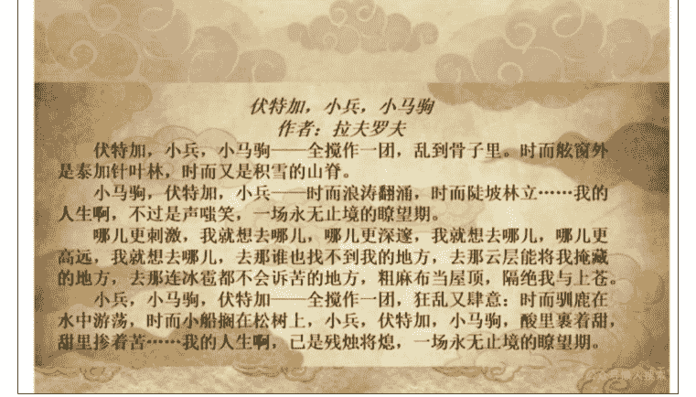

### 伏特加，小兵，小马驹

作者：拉夫罗夫

伏特加，小兵，小马驹——全搅作一团，乱到骨子里。时而舷窗外是泰加针叶林，时而又是积雪的山脊。

小马驹，伏特加，小兵——时而浪涛翻涌，时而陡坡林立……我的人生啊，不过是声嗤笑，一场永无止境的瞭望期。

哪儿更刺激，我就想去哪儿，哪儿更深邃，我就想去哪儿，哪儿更高远，我就想去哪儿，去那谁也找不到我的地方，去那云层能将我掩藏的地方，去那连冰雹都不会诉苦的地方，粗麻布当屋顶，隔绝我与上苍。

小兵，小马驹，伏特加——全搅作一团，狂乱又肆意：时而驯鹿在水中游荡，时而小船搁在松树上，小兵，伏特加，小马驹，酸里裹着甜，甜里掺着苦……我的人生啊，已是残烛将熄，一场永无止境的瞭望期。

拉夫罗夫可不是外交“小兵”，更不是“残烛将熄”，75岁，正是要闯的年纪。

拉夫罗夫为此次俄美峰会制定了周密的谈判策略。

对美国，要开展一波魅力攻势，利用特朗普在乌克兰问题上的积极性，调动俄美关系正常化。

今年是二战胜利80周年，拉夫罗夫巧妙打了一波“回忆杀”。

以俄美二战同盟的共同历史记忆出发，大力渲染阿拉斯加所承载的俄美关系积极面。

二战期间，美国曾通过《租借法案》向苏联援助战机和武器，大批美制战机运往阿拉斯加，接着由在当地培训完毕的苏联飞行员开回苏联，这就是著名的“阿拉斯加——西伯利亚航空走廊”。

会晤前，拉夫罗夫先是请普京在飞往阿拉斯加途中经停马加丹，特地向当地的阿拉斯加—西伯利亚航空走廊飞行员纪念碑献花，为俄美元首会晤衬托氛围。

会晤后，拉夫罗夫再请普京前往阿拉斯加的苏联飞行员墓地献花，为此次访美之行划上温情句号，在大国互动中创造情感共鸣。

对国际社会，拉夫罗夫制定了密集紧凑的公共外交方案，为普京的美国之行造势，争取国际社会理解，团结一切可以团结的力量。

会晤前，普京同印度、南非、巴西等10多个领导人通话，通报俄罗斯立场。

会晤当天的8月15日，俄罗斯国家杜马主席沃洛金正在朝鲜访问，参加朝鲜解放80周年庆祝活动，彰显俄朝“血盟”相互支持的坚定信心。

朝鲜派出3万士兵和1200万枚炮弹援俄作战，为俄增添不少胜利筹码。

会晤后，普京还有一场重头戏，那就是到中国去，参加上海合作组织峰会和九三阅兵，亲自和中方领导人对表，并在那里会见朝鲜、印度、塞尔维亚、古巴等各路朋友。

事实证明，普京的中国访问完全不虚此行。

中俄元首作为世界级政治家的亲密互动接连占据各大媒体头条。

普京和金正恩、普京和莫迪的“后座外交”同样吸引国际舆论眼球，普京施展个人魅力，邀请金正恩、莫迪共同乘坐他的专车“奥鲁斯”。

当然了，拉夫罗夫也为自己设计了富有深意的公关计划，一件惹人遐想的卫衣。

落地阿拉斯加当天，拉夫罗夫身着印有“苏联”字样的卫衣。

国际媒体一下子就炸了锅，纷纷猜测：“拉夫罗夫想重建苏联？”“这是在秀大国强硬？”各种解读满天飞。

美国国务卿鲁比奥当着普京和特朗普的面幽默地表示，拉夫罗夫的卫衣不错，他很喜欢。

普京同样回之以幽默，戏谑拉夫罗夫是一位“帝国主义者”，要求拉夫罗夫给鲁比奥买一件。

后来拉夫罗夫被问及为什么穿这件卫衣？

拉夫罗夫老辣地援引了普京的名言，“俄罗斯总统普京不止一次说过，谁不怀念苏联，谁就没有良心；谁想回到苏联，谁就没有头脑。这是绝对正确的陈述。”老外交家的话术，就是这么滴水不漏。

拉夫罗夫的报告最后还附上了来自俄罗斯驻白俄罗斯大使格雷兹洛夫的加急电报。

格雷兹洛夫曾担任国家杜马主席，相当于正国级职务，由正国级官员担任白俄罗斯大使，足见俄白联盟关系的重要性。

格雷兹洛夫在电报里说，白俄罗斯总统卢卡申科跟他通报了一件事：刚和美国总统特朗普通了电话，特朗普特意问了他对于乌克兰危机的看法。

你没看错，特朗普在从华盛顿飞往阿拉斯加的“空军一号”专机上，主动给卢卡申科打了电话——他的逻辑其实很简单：马上要跟白俄罗斯的“老大哥”俄罗斯打交道，先跟“小兄弟”通个气、取取经，总没错。

卢卡申科和特朗普的这通电话，无疑是美白关系史上的历史性大事件。

这是卢卡申科执政31年以来，首次同美国总统通电话。

看样子，阿拉斯加峰会真是越来越精彩了，主角是普京和特朗普，配角们同样抢着上桌露脸——毕竟，在国际舞台上，没人想成为别人“菜单”上的菜，都想成为能够点菜的人。

除卢卡申科外，德英法意芬、欧盟、北约领导人及乌克兰总统泽连斯基也在着急收拾行李，准备在俄美阿拉斯加峰会后立即前往美国，组团向特朗普问个明白，害怕俄美越顶外交牺牲自身利益。

普京读完手里的电报，心里也忍不住感慨：卢卡申科被欧洲人贬低为“欧洲最后的独裁者”，而在特朗普眼里，却被称赞为“强大的领导人”；自己之前还是拜登口中的“战争犯”，如今却成了特朗普的座上宾。“特朗普真乃神人也！”普京开始期待同他的见面了。

## 五、特朗普性格报告

普京心里还悬着最后一个关键问题：如何跟特朗普进行一场“安全互动”，又该怎么拿捏火候，才能让双方擦出对俄罗斯有利的“化学反应”？

眼前还有最后一份报告，“从特朗普性格论俄美谈判方针”，落款是外事助理乌沙科夫，这是老伙计根据外交部、对外情报局等部门的档案和自己多年的观察连夜整理的。

毕竟，特朗普的脾气谁都摸不准——就像夏天的雷雨，前一秒还晴空万里，下一秒可能就狂风骤雨，说变就变。

今年2月泽连斯基访美时的狼狈表现，就是活生生的“反面教材”，普京可不想重蹈覆辙。

乌沙科夫早早就给出了建议：跟特朗普闭门会谈前的开场白环节，别回答任何记者提问；会谈结束后的记者会，同样不接受任何问题——把“少说不说”贯彻到底。

普京没有犹豫，后来全程照着这个方案来，不给任何节外生枝的机会。

乌沙科夫用了两个形象的比喻，特朗普玩外交就像打扑克，先是虚张声势，提高筹码，摆出孤注一掷的态势，然后突然低价出手或者干脆弃牌。

作为回应，普京要拿出多年练习柔道的强项，使用巧劲，四两拨千斤。

其实普京心里门儿清，特朗普是出了名的“强势派”领导人，跟他打交道，必须得懂点“以柔克刚”。

这次美国之行，他特意放低了姿态：会晤前，主动坐上特朗普那辆大名鼎鼎的“野兽”专车去会场，给足了对方方面子；会晤后，更是对着镜头不吝溢美之词，一讲就是 9 分钟，而特朗普自己只说 3 分钟——这番“捧杀”显然说到了特朗普心坎里，对方听得格外受用。

后来为了彰显自己的强势地位，特朗普会晤后还特意放出一张“双时空对比照”：一张是 1959 年尼克松手指赫鲁晓夫胸膛的“厨房辩论”经典瞬间，另一张则是他自己跟普京会晤时的“同款姿势”，那股子“我不输任何人”的劲儿，全世界都看在眼里。

但是，真正的强势不在谁更盛气凌人，而在于是否捍卫国家利益。

普京在原则问题上可没打算让步，确实也没有让步。

后来的故事大家也都知道，俄美元首会晤“雷声大，雨点小”。

双方临时取消了原定的“1+1”元首会谈（仅有翻译在场）和“6+6”代表团会谈（俄方陪同是五虎将，美方则国务卿、中情局长、商务部长、中东问题特使、防长），最终改为“3+3”会谈。

普京携外长拉夫罗夫、外事助理乌沙科夫，特朗普携国务卿鲁比奥、特使维特科夫，闭门会谈了 2 小时 45 分钟，未达成任何协议，以至于双方取消了工作午餐。

在后来举行的联合记者会上，有记者看到，美国人匆匆撤掉原先准备的文件签字台。

普京在核心利益问题上丝毫不让的原因很简单，一个特朗普难以根本扭转俄美关系的走向，牺牲俄罗斯国家利益也难以换回美西方的平等相待。

二战结束以来 80 年，俄美关系始终对抗多于对话，陷入“重启——改善——恶化——再重启——再改善——再恶化”的无限循环，一直在重启，始终在死机。

就像拉夫罗夫说的，如果反复重启，那么意味着系统故障。

苏联时期如此。

赫鲁晓夫 1959 年访美，提出和平竞赛，随后 1962 年发生古巴导弹危机。

勃列日涅夫 1973 年访美，提出和平共处，但俄美军备竞赛却愈演愈烈。

戈尔巴乔夫 1987 年访美，提出放弃意识形态对抗，仅 2 年后苏联解体。

普京时代也是如此。2000 年，克林顿担任美国总统的最后一年，正是普京担任俄罗斯总统的第一年。

根据普京 2024 年接受美国记者卡尔森的采访，他曾直接询问克林顿，俄罗斯能不能加入北约？

克林顿起初表示，很有趣，我觉得可以。

但在晚宴时候又改口称，我和我的团队谈过了，现阶段不可能。

小布什任内，普京在 911 事件后第一个慰问小布什，两人一起在黑海看日落。

小布什表示，我从普京的眼里看到了他的灵魂。

但北约紧接着完成一次性接纳 7 国的最大规模扩张。2007 年，普京在飞往德国参加慕尼黑安全会议的专机上，临时重写了演讲稿，严厉斥责美国单极霸权和北约东扩，至今还是震惊国际政坛的名场面。

奥巴马任内，俄美高调宣布重启双边关系，美国人还煞有介事地做了一个“重启”按钮，结果把俄语单词“重启”（nepe3arpy3ka)误写成了“超负荷”(neperpy3ka)。

公众号懒人搜索,懒人专属群分享

后来美国史无前例地干涉了俄罗斯 2012 年总统选举,以至于普京在艰难当选后潸然落泪。

俄罗斯归并克里米亚后,奥巴马和普京在 G20 杭州峰会期间上演“死亡凝视”,俩人连个正眼都不愿给对方。

特朗普第一任期,特朗普当选美国总统的消息传来,俄罗斯国家杜马正在开会,议员们纷纷鼓掌,俄美 2018 年举行赫尔辛基峰会。

但特朗通用俄门、俄罗斯干选门导致俄美关系高开低走,正是特朗普首次向乌克兰提供进攻性武器“标枪”反坦克导弹。

这么多前车之鉴摆在眼前,普京看得比谁都透彻:特朗普从来不是一个“可预测的恒量”,而是一个“摸不透的变量”。

他现在或许是俄美关系里的“积极因素”,但保不齐哪天就会顺从美国国内或欧洲的反俄势力,转头变成“消极因素”——这种翻脸比翻书还快的事,特朗普干了很多次。

更何况,美国总统 4 年一届,不可能完全押宝特朗普,也不能指望一两次俄美元首峰会就能融化俄美关系的坚冰。

但不论如何,普京都希望用好俄美关系的特朗普因素,为俄罗斯争取最大的利益。

受到白令海峡的国际日期变更线启发，普京精心设计了一句著名的政治隐喻，作为同特朗普共见记者发言的结尾。

这句话后来火遍全球媒体，成了这次会晤最出圈的“金句”：在俄美边境附近有一条国际日期变更线，从那里可以真正地从昨天走向明天，我希望俄美政治关系也是如此。

## 六、刺猬效应

俄美关系 80 年的兴衰浮沉，放在人类历史长河里不过是短暂一瞬。

当普京的目光越过眼前的纷争，投向更漫长的时间维度，用大历史观重新审视这段关系时，得出了一个看似颠覆常识，却越想越透彻的结论——俄美关系搞不好，从来不是因为差异太大，恰恰是因为太像。“因为相似，所以相斥”，就像电池的正负两极。俄美很像。

无论是地理环境，资源禀赋，还是宗教特点、民族性格，简直是一对“镜像双胞胎”。

地理环境很像。

美国是北美大平原，俄罗斯是东欧大平原，美国是“三洋环绕”（本土是大西洋和太平洋，阿拉斯加飞地紧邻北冰洋），俄罗斯也是“三洋配置”（太平洋和北冰洋，西部波罗的海属于大西洋的边缘海。) 资源禀赋很像。

俄美都拥有丰富的矿产资源。

俄罗斯的石油储量居世界第8，美国第9，俄罗斯的天然气储量居世界第1，美国第4。

从资源决定论看，俄美都是能源出口大户，存在同质竞争一面。

美国鼓动乌克兰危机有两大目标：一是更好遏制俄罗斯，二是更好控制欧洲。

把俄欧关系搅黄了，欧洲没了俄罗斯的便宜天然气，自然得买美国的高价能源。

美国既可以卖武器，还可以卖能源，一举两得。

民族性格很像。

国家是地理的囚徒，孕育了俄美的扩张主义。

大平原无险可守，总让人心里发慌，俄美都拼命往大洋扩张，把海洋当成天然的安全屏障。

正因如此，俄美的历史，几乎就是两部“领土扩张史”：美国刚独立时只有13个州，面积约80万平方公里，后来靠战争抢、条约换、花钱买，一路从大西洋东海岸推到太平洋西海岸，现在领土面积达937万平方公里，是最初的近12倍；俄罗斯公国起步时约280万平方公里，比起美国的“买买买”，俄罗斯更爱“白嫖”，主要靠战争和条约硬拓疆土，从波罗的海一直扩到太平洋东岸，如今坐拥1700多万平方公里的国土，是最初的6倍。

精神文化很像。

俄美同属基督教文化国家。

从宗教历史来看，美国的新教乃是革了罗马天主教的命，俄罗斯则是从罗马天主教分家而成的东正教，两者同样在宗教精神上自我赋予“救世主”的使命，从而延展出了“大国主义”惯性。

俄罗斯自诩为“第三罗马”，东正教的弥赛亚意识催生了俄罗斯特殊论。

美国自诩为山巅之国，新教的天命昭昭催生了美国例外论，双方都有称霸全球、解放全世界的内在冲动。

沙俄曾充当“欧洲宪兵”，美国则提出“门罗主义”。

苏联要搞“世界革命”，美国则自封“世界警察”。

国家是地理的囚徒，应该还要补充一句，大国是地缘的囚徒。

因为，大国的战略边界已超越地理边界。

俄美两国，就像两只特立独行的刺猬：当它们的影响力还局限在各自大陆，势力范围不重叠时，还能惺惺相惜，甚至联手合作；可一旦双方的手都伸到了全世界，势力范围撞在一起，两只刺猬就会竖起尖刺，你扎我一下，我戳你一下，激烈对抗成了常态。

叔本华所说的“刺猬效应”在国际关系中亦可成立。

第二次世界大战，就是俄美两只刺猬关系质变的“临界点”。

二战打垮了欧洲旧列强，催生出俄美两个超级大国，世界地缘政治中心从欧洲彻底转向这两国。

从这时起，它们的地缘利益开始高度重叠，对抗也成了主旋律。

翻开俄美交往史：1689年首次接触，1807年正式建交，算下来已有300多年的交集、200多年的外交史。

如果以二战为界，会发现一条清晰的分界线：二战往前追溯，俄美关系的合作性大于对抗性。

二战往后追溯，俄美关系的对抗性大于合作性。

二战往前追溯，俄美关系存在不少共同的积极的历史记忆。1689年，彼得大帝曾在伦敦会见英国贵族佩恩，佩恩后来建立美国宾夕法尼亚州殖民地，是美国的“精神国父”之一，他在英国监狱狱中完成《没有十字架，就没有冠冕》（No Cross, No Crown）这本书，这是美“山巅之国”的思想源泉。250年前，美国独立战争时期，俄国拒绝英国结盟和求援请求，间接帮了美国一把。160年前，美国南北战争时期，沙皇亚历山大二世致信林肯表示支持，同一时间段，美国废除了黑奴制，俄罗斯废除了农奴制，像是跨洋的“同步动作”。80年前，第二次世界大战时期，俄美军队在欧洲易北河会师，结下了反法西斯联盟的历史情谊。

二战往后追溯，俄美关系，就像前文提及的那样，陷入“重启——改善——恶化——再重启——再改善——再恶化”的怪圈。

冷战结束后，俄罗斯被动或主动地变了，大国沙文主义少了很多但依然存在，一直视欧亚地区为俄罗斯的战略边界。

而美国标榜为冷战胜利者，单边主义、强权政治的派头更足了，通过北约东扩不断染指俄罗斯的势力范围。这是俄美之间的地缘矛盾。

归根结底，俄美对世界、对自己、对彼此的认知都出了问题。

在美国真正放弃霸权念头，在俄罗斯真正放弃护盘冲动，在前苏联国家真正获得战略自主面前，俄美的地缘矛盾都难以调和。

乌克兰危机不会是俄美之间的最后一场危机。

普京对俄美关系的结构性矛盾看得很清楚，不会再像叶利钦时代那样，一味做着“融入西方”的美梦。

普京多次表示，俄罗斯不止一次被西方欺骗、被戏弄，被讹诈。

担任总统20多年最后悔的事，是年轻的时候太过天真，过去轻信所谓的西方伙伴。

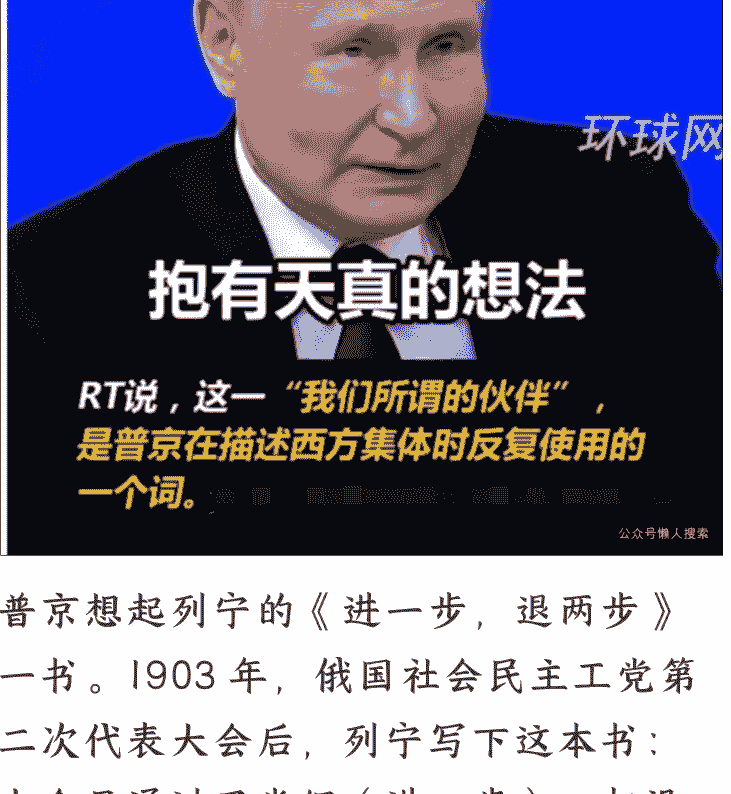

普京想起列宁的《进一步，退两步》一书。1903年，俄国社会民主工党第二次代表大会后，列宁写下这本书：大会虽通过了党纲（进一步），却没解决理念分歧（退两步），最终分成了布尔什维克（多数派）和孟什维克（少数派）。“俄美关系何尝不是如此？”普京不禁感叹。

那些“进一步”的改善，不过是表象，是阶段性的管控矛盾；而“退两步”的恶化，才是实质，是理念分歧的必然结果。

## 七、历史吊诡

读完五份沉甸甸的报告，回顾了俄美关系的历史，普京心中的判断逐渐清晰，紧绷的神经随之放松，思绪不自觉地飘向了历史的更深处。

他手里转动着钢笔，脑子里冒出一句话：这历史，还真是处处藏着让人捉摸不透的吊诡。

他想起黑格尔那句扎心的论断：“人类从历史中学到的唯一教训，就是没有从历史中吸取到任何教训。”又想起马克·吐温的俏皮注解：“历史不会重复，但会押韵。”有些事儿看着换了时空，细品却满是似曾相识。

### 吊诡之处之一：170年前和170年后，俄罗斯再次同全欧洲作战。

克里米亚和顿巴斯地区作为导火索两次点燃俄罗斯和欧洲的战争。1853—1856年的克里米亚战争是俄罗斯历史上的屈辱时刻。

英、法、奥斯曼帝国（土耳其前身）、撒丁王国（意大利前身）组成的联军在克里米亚击败沙俄。

沙俄被迫签署《巴黎和约》，黑海口被夺，海军主力几乎被摧毁殆尽。

战争摧毁了沙皇尼古拉一世的政治权威和精神支柱，1855年，尼古拉一世因过度焦虑和流感肺炎去世，也有说法认为他选择秘密自杀。

因此说，170年前，俄罗斯实际上以一己之力对抗整个欧洲，170年后，俄罗斯同样以一己之力对抗整个北约。

正是出于这个原因，普京在接受采访时把克里米亚战争称作“第零次世界大战”，同时警告当前的俄乌战争可能升级为“第三次世界大战”。

### 吊诡之处之二：在一处历史领土讨论另一处历史领土的归属，在阿拉斯加这片故土再次讨论克里米亚和顿巴斯故土的归属。

克里米亚战败，尼古拉一世去世，沙皇亚历山大二世（1818—1881年）即位，开始了系列改革。

那时的铁血宰相辅是戈尔恰科夫（1798—1883年），他是普希金的同学，普希金曾专门写诗称赞其必成大器。

普希金的预言成真了，那时候的欧洲外交舞台，德国有俾斯麦（1815—1898），俄罗斯则有戈尔恰科夫，两人既合作又较量，共同促成了欧洲大陆联盟体系——三皇（俄国、德意志、奥匈帝国）同盟，一度令英国的大陆均势战略、离岸制衡伎俩无计可施，以至于当时的英国首相本杰明一听到两人会晤便头皮发麻。

上图是1872年，三皇同盟会晤于柏林，前排左起德意志皇帝威廉一世，奥匈帝国皇帝约瑟夫一世，俄国沙皇亚历山大二世。

后排左起三国首相俾斯麦、安德拉什、戈尔恰科夫。戈尔恰科夫钦定了俄罗斯在克里米亚战败后的外交方略，在发给欧洲各国的信函中写道，“俄罗斯没有生气，俄罗斯在积蓄力量。”在此背景下，沙俄开始一定程度的外交收缩，并对阿拉斯加的防守能力产生严重怀疑。

各种顾虑堆在一起，就有了1867年那笔“千古交易”——沙皇亚历山大二世大手一挥，把阿拉斯加卖给了美国。

阿拉斯加和克里米亚的命运紧密联系，他们都是俄罗斯的历史领土，但一个在太平洋彼岸，俄罗斯力有不逮；一个是俄罗斯的地缘心脏，俄罗斯必争必抢。

布热津斯基曾经说过，没有乌克兰，俄罗斯便无法成为一个帝国。

而当俄罗斯攒够了力量，便要拿回自己的历史领土。

实际上，170年前的克里米亚战争只是11次俄土战争的第9次，也是土耳其打赢的唯一一次对俄战争。

要知道，俄土战争共有12次，断断续续持续了232年，是欧洲史上最长战争系列。

后来奥斯曼帝国在一战后解体，俄罗斯再次将克里米亚并入自身版图。

而阿拉斯加，俄罗斯指定是收不回来了。

俄罗斯惯会欺负比他小的国家，但绝不会挑衅比他强的国家。

很多俄罗斯的强硬派炒作卖掉阿拉斯加不合法，闹着要收回阿拉斯加，其实不过是打打嘴炮而已。

### 吊诡之处之三：80年前，美国通过《租借法案》援助苏联；80年后，美国通过新《租借法案》反对俄罗斯。

前文讲到阿拉斯加一西伯利亚航空走廊时已经提到，来自美国民主党的罗斯福曾通过《租借法案》援助俄罗斯武器，这笔贷款，俄罗斯直到2001年才还完。2022年，同样来自民主党的拜登于5月9日，俄罗斯胜利日当天，签署新的《租借法案》，借鉴二战《租借法案》模式向乌克兰提供武器装备。

只不过，俄罗斯还贷用了半个世纪，就像老百姓买房还贷一样。

问题是，借美国的这笔钱，不知道乌克兰什么时候才能还完？

要知道，美乌最近签署的矿产协议，实际上近乎掏空了整个乌克兰的未来。

### 吊诡之处之四：50多年前，美国通过“尼克松战略”联华制俄；50多年后，美国试图通过“反向尼克松战略”联俄制华

特朗普在俄美元首会晤后大放厥词，中俄相互接壤，是天然的敌人，拜登的错误政策让中俄结盟。

显然，特朗普希望上演“联俄制华”的套路，采取鲁比奥所说的“反向尼克松战略”。

但是特朗普不是当年的尼克松，俄罗斯不是当年的苏联，而中国的国家实力和国际地位也早已沧海巨变。

美国似乎还沉浸在冷战思维的旧梦里，但世界变了人间。

更重要的是，中俄并非结盟，中俄只是站在建设多极世界、反对单边霸权的历史正确一边。

回到列宁《进一步，退两步》书中谈到的“多数派”和“少数派”问题。

那么，当今世界，谁是“多数派”，谁是“少数派”？

答案其实很简单：谁拥抱多极世界，就是拥抱大多数，就是多数派。

俄罗斯为此专门想了一个政治术语，世界多数，用来指代全球南方和全球东方国家。

谁拥抱单极世界，就是固守小圈子，就是少数派。

俄罗斯为此也想了一个术语，黄金十亿（西方国家人口），用来指代盘剥其他发展中国家的西方小圈子。

普京对多极化的历史大趋势看得很清楚。

他在北京的记者会上高度评价中方提出的全球治理倡议，强调单极化世界应该退出历史舞台，特权国家没有容身之所，多极化世界是自然而然的客观趋势。

多次指出中俄不是在构建多极世界，而是在加速多极世界的形成。

不幸的是，美国仍在本土主义和全球主义的发展思潮中纠结，在单边独霸和多极共赢的十字路口彷徨，试图不遗余力地挽救衰落的美国霸权。

列宁其实还说过一句名言，只有“下层”不愿照旧生活而“上层”也不能照旧维持下去的时候，革命才能获得胜利。

美国不能，世界不愿，时代要变。

## 尾：抵达阿拉斯加

阿拉斯加时间11点整，普京的专机准时降落在埃尔门多夫—理查森军事基地，舷梯缓缓落下，不久前新任的俄罗斯驻美国大使达尔奇耶夫登上专机迎请普京。“五虎将”——俄外长拉夫罗夫、外事助理乌沙科夫、防长别洛乌索夫、财长西卢阿诺夫、直接投资总裁德米特里耶夫均已在专机舷梯旁等候。

俄罗斯特警们身着西装，佩戴耳机，在美国特勤局监视下，驻守机场四周。

普京的记者团扛着长枪短炮，在和美国记者争抢最佳拍摄位置。

军事基地外围，一些俄罗斯便衣特工混入了周围的咖啡馆和停车场进行场外排查。

美国方面也准备好了，仪仗队已经就绪，红地毯铺设完毕，尽头是特别制作的“阿拉斯加—2025”拍摄台，以便两国元首留下历史性镜头。

拍摄台后方，数架F-22战机虎视眈眈，B-2“幽灵”隐形战略轰炸机与F-35歼击机组成的飞行编队，将从两位总统头顶低空飞过。“红地毯+战机”的欢迎仪式标志着，特朗普也做好了软硬两手准备。

于是，万事俱备，只等普京到来。

普京站起身来，理了理深红色的领带，大步朝门外走去，开启了他的阿拉斯加时刻。

## 最后，安利小懒的付费群：

### 懒人专属群（介绍）

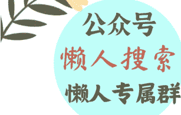

微信:lazyhelper

懒人专属群持续更新中，已持续运营6年，整理超3000份各类精选付费文章 & 年费社群干货，全部开放下载。

本资料为付费群内部分享，仅供真实有需要的朋友查阅

### 懒人专属群更新记录：

- https://lazy2025.top/blog/record2

### 懒人专属群更新记录（需梯子，备用）：

- https://lazybook.fun/blog/record2