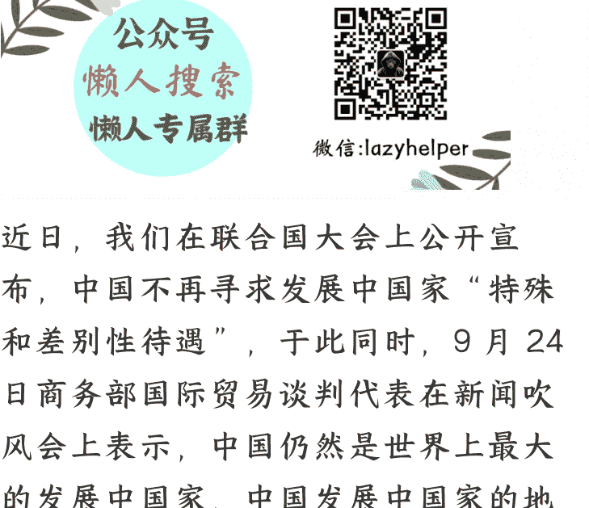

# 中国不再寻求发展中国家“特殊和差别性待遇”的背后
250926猫哥

整理：公众号懒人搜索，懒人专属群独享

懒人微信：lazyhelper

近日，我们在联合国大会上公开宣布，中国不再寻求发展中国家“特殊和差别性待遇”。与此同时，9月24日商务部国际贸易谈判代表在新闻吹风会上表示，中国仍然是世界上最大的发展中国家，中国发展中国家的地位和身份没有改变，“中国始终是全球南方”。

那么中国这一系列表态究竟代表什么意图呢？

首先，我们要搞清楚发展中国家“特殊和差别性待遇”是什么？主要是两个方面：一个是贸易领域，一个是金融领域。

贸易领域是WTO的一项重要条款，旨在支持广大发展中国家，特别是最不发达国家发展的需求。在市场开放方面，WTO发展中国家成员可以承担比发达国家成员开放度较低的义务，如更低的关税减让幅度，在新条款的执行方面可以享有比较长的过渡期安排等。简单的说就是如果是发展中国家，就可以获得发达国家比较高的贸易准入，比较低的关税水平，而自己则可以以保护自身产业为理由，对发达国家的商品设置比较高的关税税率，同时对部分产业设置保护时间，在这个时间周期内是可以不开放的。

一个是金融领域，发展中国家在世界银行与国际货币基金组织可以更低的利率获得贷款。除此之外，还可以获得一些发达国家的技术援助、经济援助等等。

客观地说，这些发展中国家“特殊和差别性待遇”在我们加入WTO前期是发挥了巨大作用的。

但是最近几年情况发生了巨大变化。因为中国商品竞争力越来越强，中国商品横扫全世界，所以现在中国已经有好几年不但没有享受WTO规定的发展中国家市场准入、关税减免的特殊待遇，反而面临发达国家的各种关税壁垒。

其次在金融领域，现在我们自己已经不是21世纪资本短缺的问题，而是资本过剩的问题。我们每年贸易顺差超过1万亿美元，我们累计通过一带一路倡议对外投资已经超过8万亿美元。说实话，这个世界银行与国际货币基金组织优惠利率贷款对我们已经没啥意义。

最后就是发达国家的技术援助、经济援助等等，最近十来年基本都没有了，最多也就是参加了一些培训。

所以，这么七七八八盘点下来，所谓的放弃发展中国家“特殊和差别性待遇”，我们基本没啥损失的。

那么，既然已经放弃了发展中国家“特殊和差别性待遇”，为什么还要强调中国仍然是世界上最大的发展中国家，中国发展中国家的地位和身份没有改变呢？

这就是搞的国家版的“停薪留职”。停薪就是放弃发展中国家“特殊和差别性待遇”，留职就是继续保留中国发展中国家的身份。这样做目的就是可进可退，保持中方在国际事务中的弹性。

当前WTO正面临前所未有的挑战。自2019年起，美国持续阻挠WTO上诉机构大法官的遴选，导致其停摆，严重削弱了WTO的争端解决机制。与此同时，美国还不断施压WTO，试图改变发展中国家地位的认定方式，矛头直指中国。近年来，以美国为首的部分国家不断指责中国“钻空子”，并以此为由破坏多边贸易规则。中国的主动调整，直接抽离了这一指责的根基，在道义和规则上夺回了主动权。

这就是“停薪”的好处：本来就没享受什么实质性好处，反而落人于口实，还不如主动放弃这个“待遇”，让老美等西方国家无话可说。

## 那么为什么要“留职”呢？

中国继续保留发展中国家的身份，这不仅符合客观事实（中国人均指标依然落后，尽管中国经济总量位居世界第二，但人均GDP仅为美国的约六分之一，在世界排名中等偏后），而且这也是赢得广大发展中国家信任的关键。这意味着中国将继续与发展中国家共同应对全球挑战，增强国际合作。共同的身份认同非常有利于中国团结广大发展中国家，进一步推进一带一路倡议，实现国际版的“农村包围城市”的战略目的。

第三，如果放弃发展中国家身份，意味着中国进入发达国家俱乐部，这样意味着中国未来不得不背负发达国家的义务，承担巨大的国际援助责任。而中国保留发展中国家身份，未来即便承担更大的国际义务，也非强制性的（发达国家承担相关义务都有相关国际法的约束），而是带有更多的自愿性质，这样就为自己留下了可进可退的弹性空间。

最后总结一下，中方这一系列的动作就是赢得道义上的优势，实际利益并不吃亏，还堵住老美等西方国家的口，实在是一箭三雕的谋略。

最后，安利小懒的付费群：
懒人专属群（介绍）

📚 懒人专属群持续更新中，已持续运营 6 年，整理超 3000 份各类精选付费文章 & 年费社群干货，全部开放下载。

本资料为付费群内部分享，仅供真实有需要的朋友查阅 🙅‍♂️

懒人专属群更新记录：
https://lazy2025.top/blog/record2

懒人专属群更新记录（需梯子，备用）：
https://lazybook.fun/blog/record2