# 小白也能做出高大上的网站？我用这3个技巧拿下黑客松金奖！

250926生财精华

公众号懒人搜索，懒人专属群独享

懒人微信：lazyhelper


公众号懒人搜索懒人专属群

微信：lazyhelper

加入小排老师深海圈学习已经三个月了。回想当初，我还只是个光有设计经验，没有代码能力的小白，如今不仅能独立做出像样的网站，更有幸在最近的深海圈黑客松中带领团队斩获一等奖！

这一切，离不开我们团队的三位小伙伴，以及支持我们、为我们投票、给予我们帮助的每一位朋友。在此，深深鞠躬感谢！

🙇

这就是我们的获奖网站：

```
https://www.rendaily.com/
```

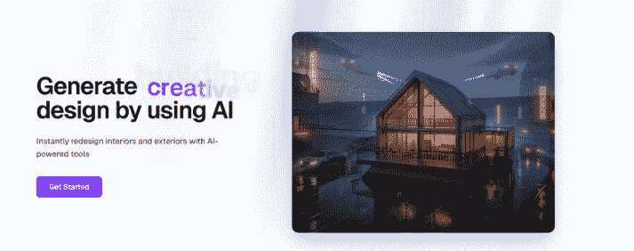

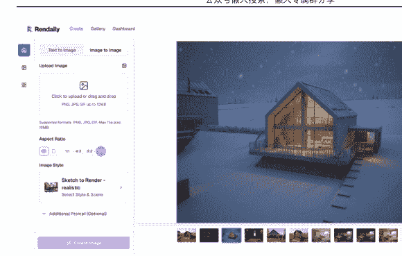

赛后，很多朋友反馈说：“网站的整体设计感很强。” 这恰恰是我想和大家分享的核心——设计感并非玄学，而是有章可循的。

作为一名设计师，我将从色彩、字体、动画这三个关键维度，拆解打造一个“设计感”网站的实用思路，并完整展示我们是如何从0到1落地的。

你将收获什么？

- 学会如何快速挑选配色，让网站氛围更统一
- 掌握字体选择技巧，营造网站的气质和品牌感
- 了解动画组件库，让页面更生动有趣
- 通过黑客松获奖案例，学会拼装落地页的实战方法
- 收藏一批高质量设计资源网站，随时获取灵感

让我们开始吧～

## 1. 色彩选择

为什么你的设计怎么看怎么奇怪？颜色没选对，一切白搭。

怎么在一点都不懂色彩的情况下，选出不错的配色？

### 第一步：确定主题色
不需要五花八门，先确定一个主色，然后再围绕它搭配辅助色。

### 第二步：用工具帮忙
不会配色？没关系，直接用配色网站一键解决。接下来我给大家分享一些好用的配色工具。

### 配色网站
对小白来说最快上手的就是配色网站了，已经帮你配好色卡，直接一键复制给 AI 就能用。分享一些我觉得比较有趣好用的配色网站，给大家做参考。

#### Khroma
亮点： AI 学习你的色彩偏好。先选择 50 个你喜欢的颜色，它会利用小神经网络生成适合你的个性化配色。无需登录，设计感满满！使用 Khroma 也会让你自己对自己的色彩偏好产生了解，之后在定主题色的时候减少犹豫，产生配色肌肉记忆。

网址：https://www.khroma.co/

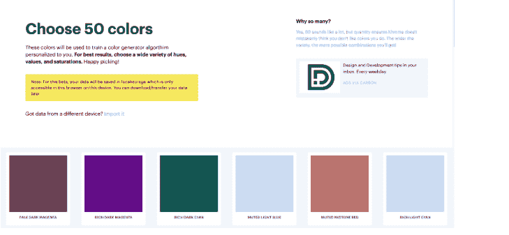

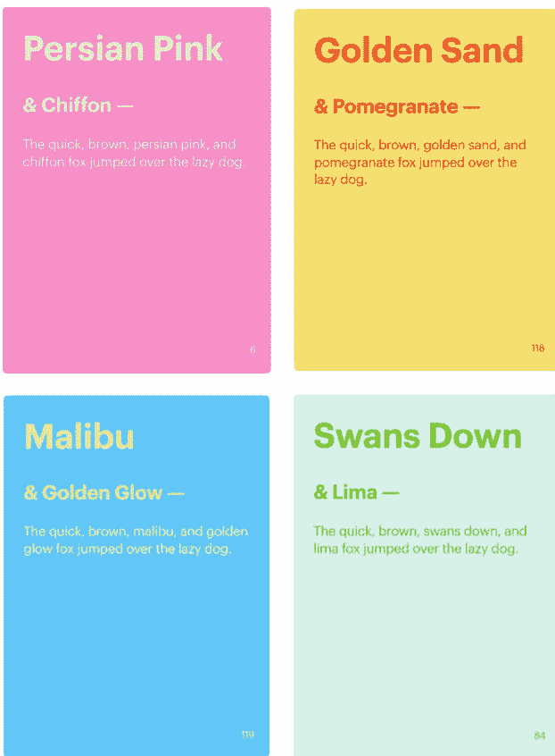

#### Coolors
亮点：按空格键快速生成色板，支持图片取色、对比度检测、实时预览，功能全面，适合快速落地。

它同时支持保存、分享与多种导出，并提供 iOS/Android App 及 Figma/Adobe 插件，适合设计与前端在同一平台协作选色。

网址：https://coolors.co/

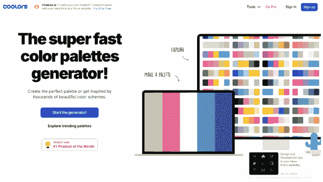

#### Web Gradients
亮点： WebGradients 是一个免费的渐变背景库，收录约 180 组线性渐变，点一下就能复制跨浏览器的 CSS，也可直接下载 PNG；同时提供 Sketch/Photoshop 资源包，拿来做网页背景、按钮、封面等都很方便。

网址：https://webgradients.com/

itmeo
ABOUT SKETCH .PSD
001 Warm Flame 002 Night Fade 003 Spring Warmth
View Fullscreen
#9a3e #160c4 Copy CSS #a18d1 #bc2eb #ba0c4 #15d3ff Crew CSS Design and Developme In your inbox. Every we

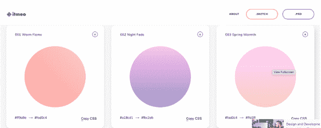

## 2. 字体选择
字体是品牌的声音。对于字体工具，Google Fonts 是免费且最佳的选择。字体主要分为两大类：

- 非衬线体：现代、简洁、友好，适用于大多数数字产品。
- 衬线体：传统、优雅、权威，常用于金融、出版、奢侈品网站。

### Google Fonts
如果想找字体，可以直接在 Google Fonts 上寻找，根据项目需求筛选、预览和下载字体。

网站链接：https://fonts.google.com/

### Feeling
- Business
- Fancy
- Calm
- Playful
- Cute
- Artistic
- Vintage
- Loud
- Sophisticated
- Futuristic
- Active
- Stiff
- Innovative
- Happy
- Childlike
- Rugged
- Awkward
- Excited

### Appearance
- Techno
- Monospaced
- Blobby
- Marker
- Art Deco
- Art Nouveau
- Distressed
- Stencil
- Wood type
- Medieval
- Blackletter
- Pixel
- Not text
- Tuscan
- Wacky
- Shaded
- Inline

### Calligraphy
- All
- Handwritten
- Formal
- Informal
- Upright

### Serif
- All
- Transitional
- Slab
- Old Style
- Modern
- Humanist
- Scotch
- Fatface
- Didone

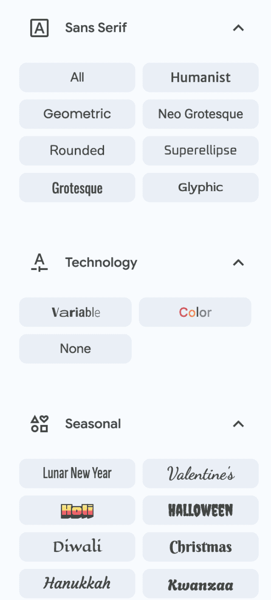

### 非衬线体 Sans Serif
非衬线体的最大特点是字母笔画末端没有任何装饰线，整体造型简洁、直接。非衬线体常用于科技、互联网、时尚、初创企业等领域的网站，传递现代、友好、开放的品牌形象。

#### Inter
专为界面设计而生，灵活多变，适合大多数数字产品。

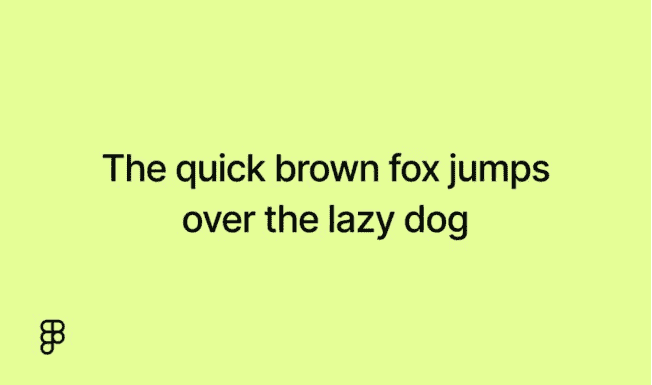

#### Roboto
谷歌设计，风格极简，适合各种场景，广泛用于安卓系统。

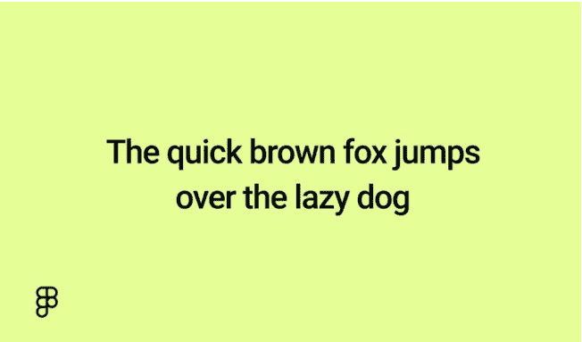

#### Open Sans
友好、易读，支持多语言，适合全球化网站。

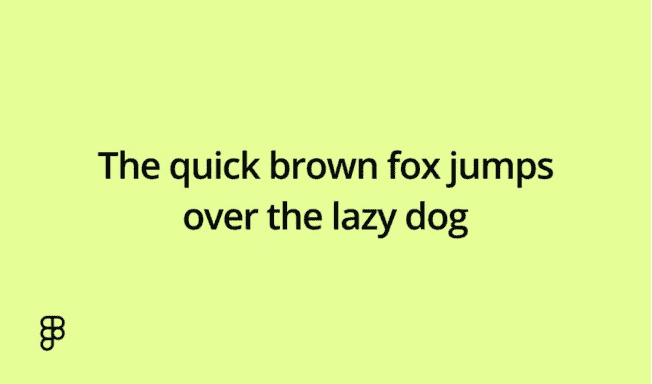

#### Rubik
边角圆润，风格活泼，适合标题和正文。

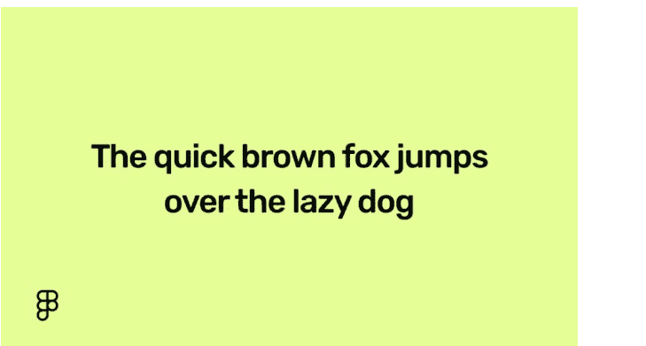

#### Nunito
圆角设计，氛围轻松，适合正文和展示。

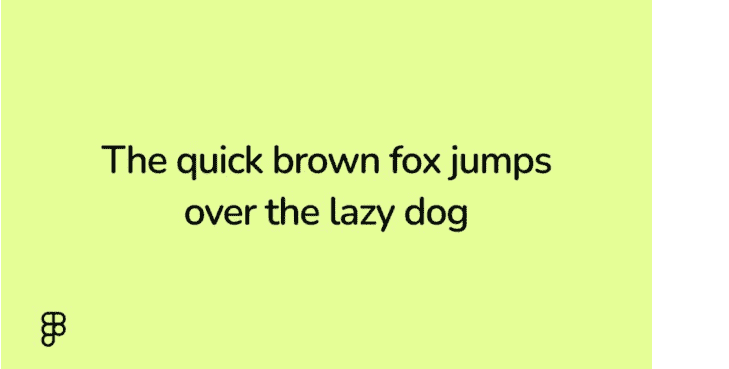

### 衬线体 Serif
衬线体的最大特点是在每个字母的笔画末端有一条小横线或装饰线。这种设计最早源于印刷时代，目的是让文字在纸上更易阅读。衬线体通常给人以正式、传统、权威和优雅的感觉，常见于书籍、报纸、杂志、金融、法律等领域的网站。

#### Playfair Display
受 18 世纪排版风格启发，线条优雅，适合营造奢华和高端感，常用于大标题和品牌展示。

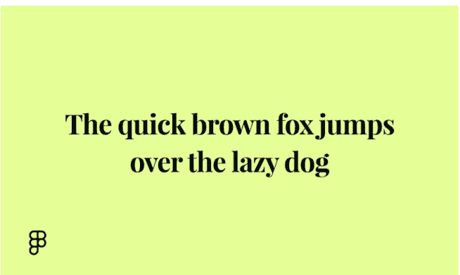

#### Libre Baskerville
以经典 Baskerville 为基础，优化了屏幕阅读体验，适合正文和需要信任感的品牌。

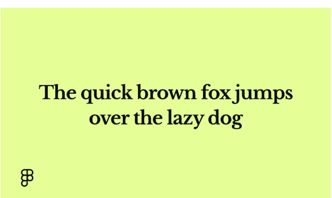

#### Soria
受新艺术运动和 Didot 字体影响，线条时尚，适合 logo、横幅和吸引注意力的设计。

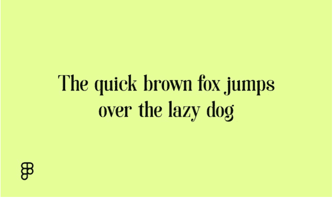

#### Neuton
荷兰风格，几何感强，节省空间，适合标题和正文，现代且简洁。

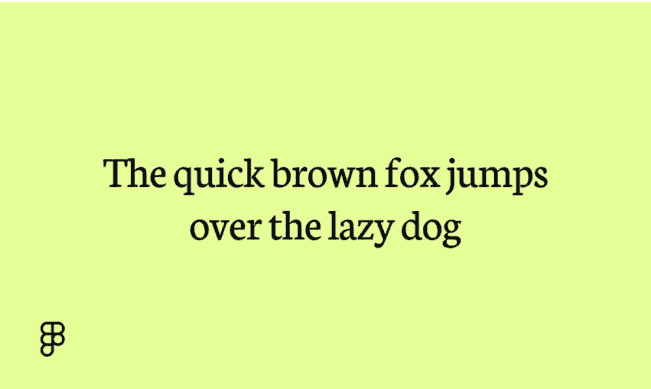

#### Lora
现代衬线体，带有书法风格，曲线优美，适合大标题和正文，兼顾优雅与可读性。

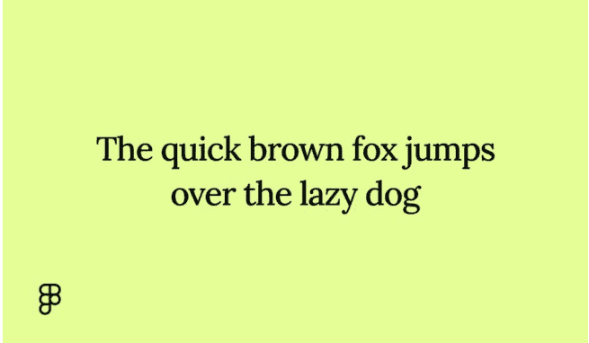

## 3. 动画组件
好的落地页离不开动效设计，所以下面是给大家分享的一些动效黑科技！

### 组件库推荐

#### Aceternity UI
这次深海圈提交作品的 UI 设计用的是 Aceternity UI 的组件。

网址：Aceternity UI

Components 组件是免费的，Templates 是付费模版。

给大家分享几个例子：

##### 3D Card Effect 卡片特效
亮点：3D 悬浮卡片特效，鼠标移动上去卡片会有浮动效果。

组件网址：
https://ui.aceternity.com/components/3d-card-effect

操作技巧：找到 Code，按照网站上写的步骤操作即可。或者直接复制代码给 AI，会自动帮你添加组件。如代码右图，可以根据自己的需求微调组件的变量。

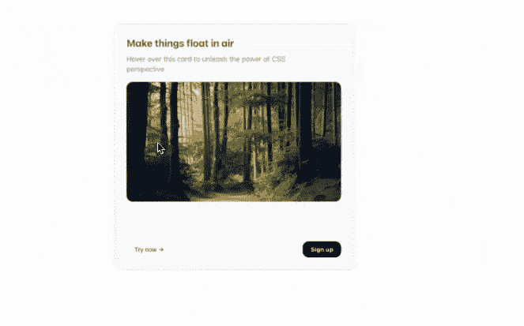
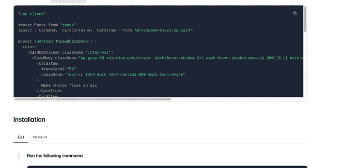


| Prop | Type | Description |
|---|---|---|
| `children` | `React.ReactNode` | The child elements to be rendered within the container. |
| `className` | `string` | The CSS class to be applied to the container. |
| `containerClassName` | `string` | The CSS class to be applied to the outer container. |

| Prop | Type | Description |
|---|---|---|
| `children` | `React.ReactNode` | The child elements to be rendered within the body. |
| `className` | `string` | The CSS class to be applied to the body. |

| Prop | Type | Description |
|---|---|---|
| `as` | `React.ElementType` | The HTML tag to be used for the item. Defaults to "div". |
| `children` | `React.ReactNode` | The child elements to be rendered within the item. |
| `className` | `string` | The CSS class to be applied to the item. |
| `translateX` | `number or string` | The X translation of the item. |
| `translateY` | `number or string` | The Y translation of the item. |

##### Text Effect 字体特效
亮点：网站首页很常用到一些字体动效，我找了一些放在这里。

彩色字体-组件链接：
https://ui.aceternity.com/components/colourful-text

打字特效-组件链接：
https://ui.aceternity.com/components/typewriter-effect

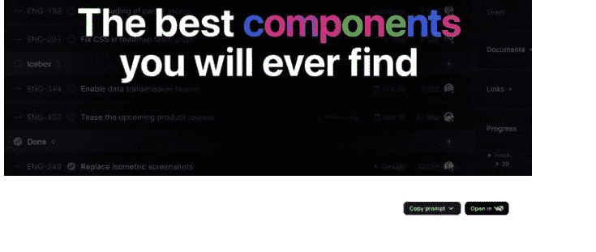
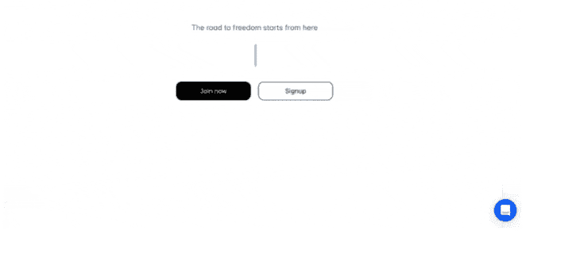

这次黑客松中我们的网站就用了这个翻转文字的组件，并且在这个基础上做出一些简单的参数改动。

翻转文字-组件网址：
```
https://ui.aceternity.com/components/flip-words
```

这个组件可改的变量就会比上面 3D 悬浮卡片的少很多，所以相对更简单。变量有：添加一组词，以及可以改变翻转的时长，还有类名。


在 Aceternity UI 还有很多有趣且常用的文字特效组件，感兴趣可以打开官网一一尝试。

#### Magic UI
Magic UI 官网网址：
```
https://magicui.design/
```

亮点：渐变文字、波纹背景、头像展示等，适合快速搭建酷炫落地页。

#### 用户头像展示
组件网址：
https://magicui.design/docs/components/avatar-circles

如果你不会使用也没关系，你可以直接点击 Open In ChatGPT/Claude，AI 会帮你解释，详细到操作的每一步。

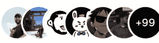
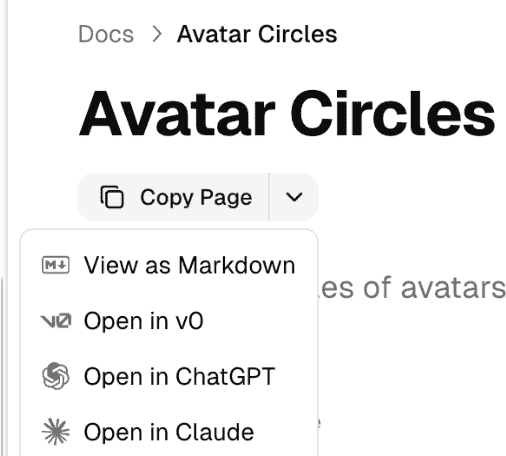

#### 文字组件
渐变文字-组件网址：
https://magicui.design/docs/components/animated-gradient-text

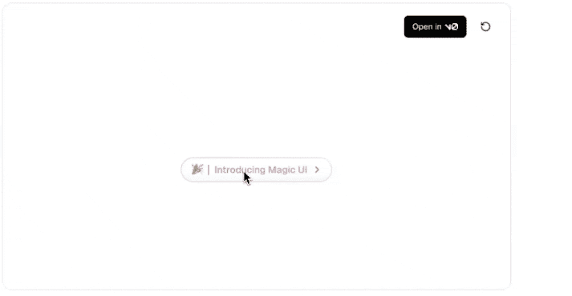

#### 背景组件
Ripple-组件链接：
https://magicui.design/docs/components/ripple

Retro-组件链接：
https://magicui.design/docs/components/retro-grid

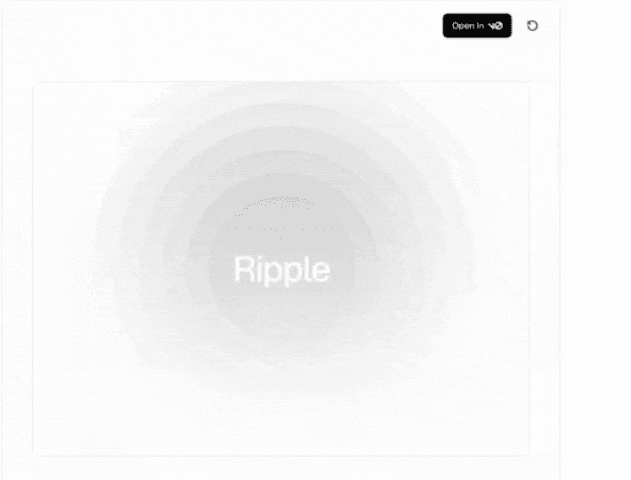
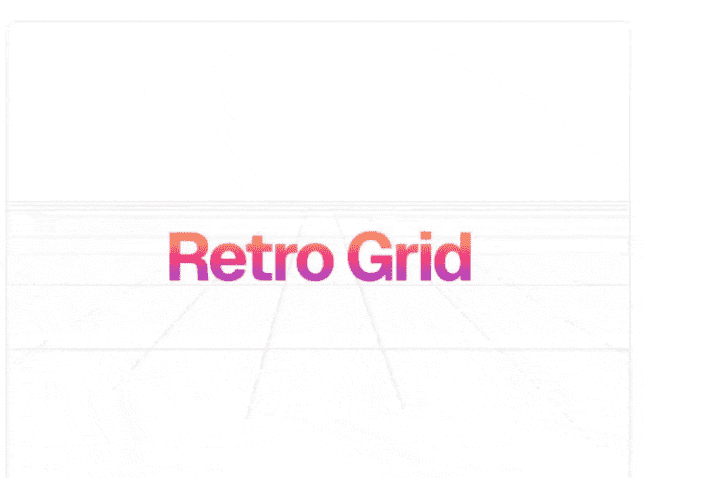

#### Daisy UI
官网网址：https://daisyui.com/

亮点：Tailwind 用户必备，覆盖基础 UI 组件。支持多主题切换、纯 CSS、无 TS 依赖，适用于所有主流前端框架，且高度可定制。

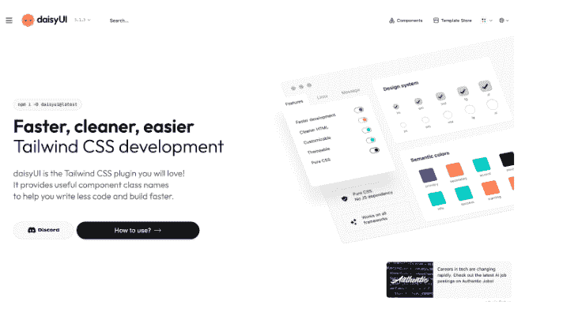

#### UI Verse
官网网址：https://uiverse.io/

亮点：汇聚了全球社区创作者，提供超过 6800 个可直接复制的高质量 UI 元素（如按钮、卡片、加载动画等），支持 HTML/CSS、Tailwind、React 和 Figma，全部免费且可用于个人和商业项目。

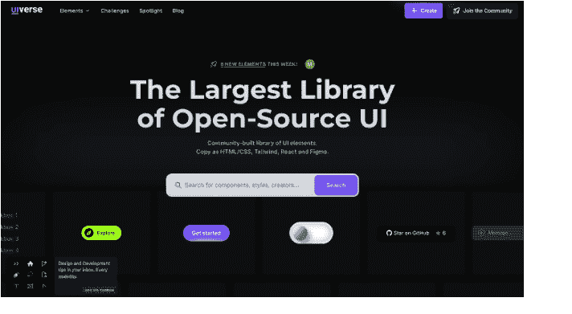

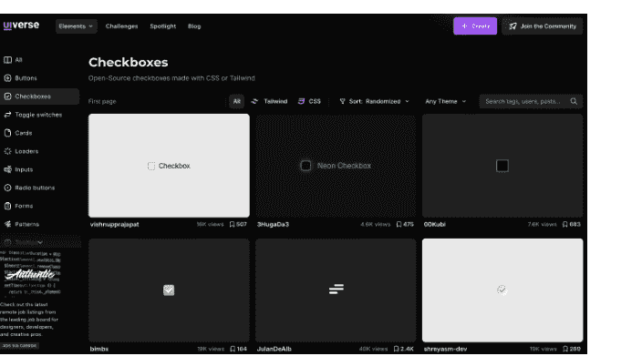

#### Shadcn
官网网址：https://ui.shadcn.com/

亮点：开源的设计系统组件库，主打美观、易用和高度可定制，适合企业和开发者快速搭建和扩展自己的前端界面。

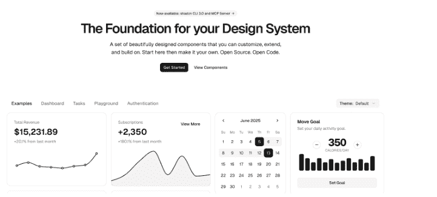

### 动效工具

#### GSAP
GSAP 官网网址：https://gsap.com/

想做的更加艺术，更有设计感，GSAP 是必不可少的。Awwwards 上很多优秀的网站都是用 GSAP 做的。

GSAP 与框架无关，并且具有无限的灵活性 - 使用简单的补间为任何对象的任何属性设置动画。

如果你想具体学习功能，可以在官网上找到教程视频。

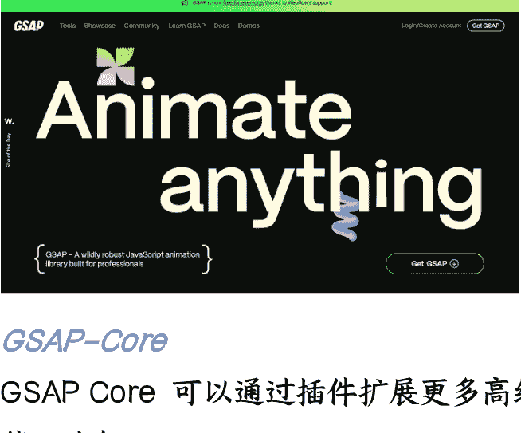

##### GSAP-Core
GSAP Core 可以通过插件扩展更多高级功能，比如：

- Flip：实现元素状态的无缝切换动画。
- ScrollTrigger：让动画和滚动事件联动，做出炫酷的滚动特效。
- MotionPath：让元素沿自定义路径运动。
- Draggable：让页面上的元素可以拖拽、旋转等。
- Observer：监听各种事件，收集变化数据。

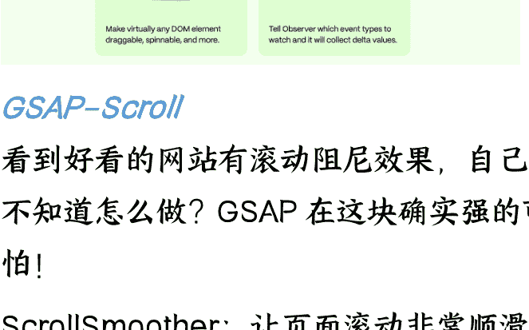

##### GSAP-Scroll
看到好看的网站有滚动阻尼效果，自己却不知道怎么做？GSAP 在这块确实强的可怕！

- ScrollSmoother：让页面滚动非常顺滑，提升用户体验。
- ScrollTrigger：让动画和滚动条联动，滚动时自动触发动画。
- ScrollTo：实现页面平滑跳转到指定位置，常用于导航。
- Observer：监听滚动、触摸等事件，方便做自定义交互。

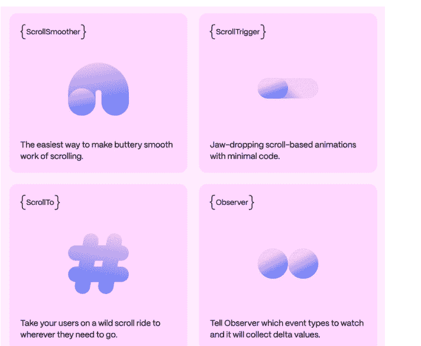

##### GSAP-SVG
- MorphSVG：让 SVG 路径自然变形，比如圆变心形，适合艺术和品牌动画。
- DrawSVG：让路径像被“画”出来一样显示或隐藏，常用于手绘风格和进度条。
- MotionPath：让对象沿自定义路径运动，适合流程演示和数据可视化。
- MotionPathHelper：在浏览器里直接编辑运动路径，提升动画制作效率。
- Draggable+Inertia：让 SVG 元素可拖拽、旋转、甩动，并带有惯性，适合互动和游戏。

##### GSAP-UI

- Flip：让元素在不同状态间平滑过渡，比如卡片翻转、列表重排，适合做界面切换和动态布局。
- SplitText：把一段文字拆分成单独的字或词，方便做逐字动画，常用于标题、广告、艺术展示。
- Observer：监听各种事件（如滚动、点击、滑动），收集变化数据，适合做自定义交互和高级动画控制。
- Draggable+Inertia：让页面元素可以拖拽、旋转、甩动，并带有真实的惯性效果，适合做互动组件、游戏、健康类交互工具。

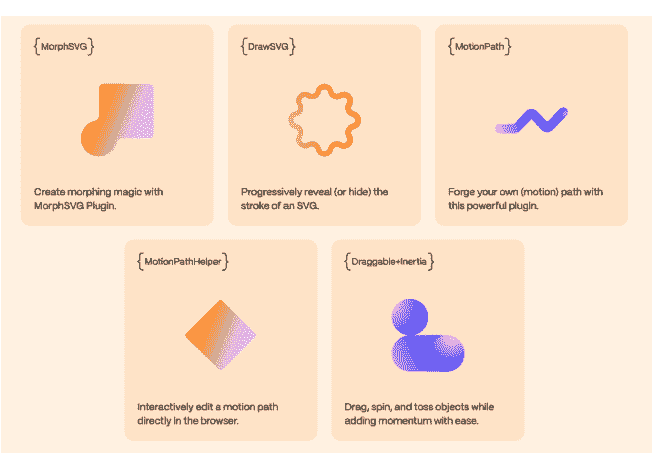

##### GSAP-Text

###### SplitText
- 将文字拆分为字符、单词或行
- 可为每个部分单独添加动画
- 支持嵌套标签和 emoji
- 可自定义分隔符
- 适合做滚动、逐字/逐词动画

###### ScrambleText
- 让文字内容随机打乱
- 可选择打乱字母、数字、大小写
- 适合悬停、加载等动态效果

###### Text
- 逐个字符替换网页上的文字内容
- 常用于打字机、逐步显示文本动画

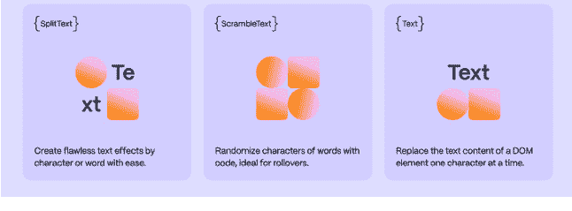

#### Lottie 动画

官网网址：https://lottiefiles.com/

LottieFiles 是一个动画资源网站，专门为设计师和开发者提供各种轻量级动画。里面有非常多免费的动画资源可以下载。它支持很多主流设计工具，比如 Figma、After Effects，也可以供开发者使用。

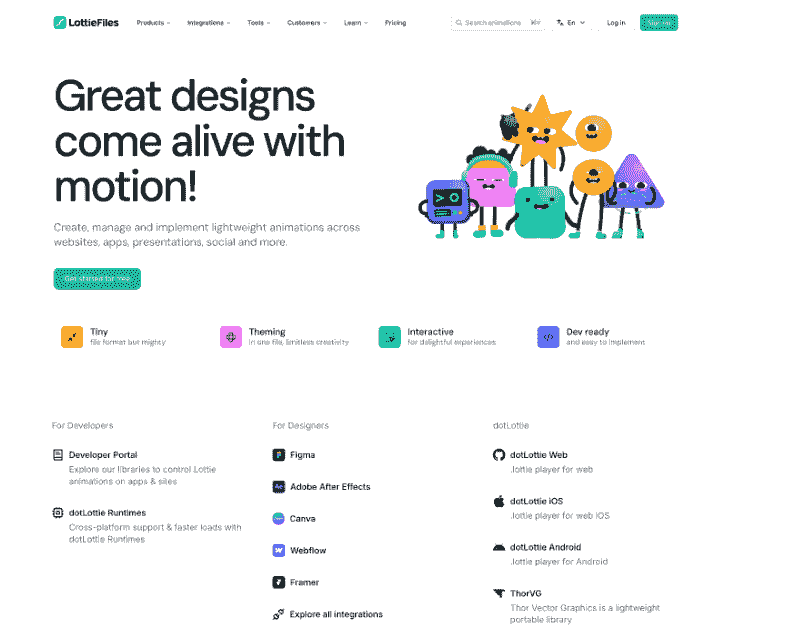

#### Lottie 免费动画：

https://lottiefiles.com/featured-free-animations

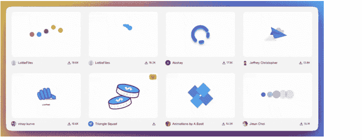

#### Matter.js

官网网址：https://brm.io/matter-js/

Matter.js 是一个开源的 TypeScript 2D 物理引擎，专门为网页开发设计。它可以帮助开发者在网页上实现各种真实的物理效果，比如物体碰撞、重力、摩擦力、弹性等。你可以用它来制作游戏、交互动画、物理模拟实验等。

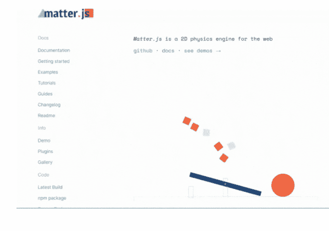

#### Three.js 3D 渲染

官网网址：https://threejs.org/

Three.js 让开发者能够在浏览器中轻松实现复杂的三维动画和交互效果，无需深入掌握底层的 WebGL 技术。它提供了丰富的 API，包括场景、相机、光源、材质、几何体等模块，支持加载各种 3D 模型和纹理。无论是游戏开发、数据可视化还是艺术创作，Three.js 都能帮助你快速构建高质量的 3D 应用。

Three.js 的教程有很多，小破站和油管都有，有做 3D 需求的小伙伴可以自行搜索一下。

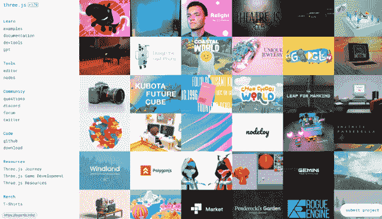

## 4. 通过拆解案例了解如何排版

了解完色彩、字体和动画后，你已经掌握了网页设计的核心要素，但你可能还在想：道理我都懂，可实际操作时该如何把这些元素组合起来？别急，接下来我用我们这次获得第一名的参赛作品为例，手把手展示如何将这些设计要素落地成一个完整的网站。

这次黑客松中我们的产品：

最早的时候我有画过草稿，可以看得出来，我基本按照这个来实现我的落地页的。和组队的小伙伴讨论后，右图是我用Figma 手搓的一个落地页草稿。

但是！这些都可以用 AI 解决！请看下文！

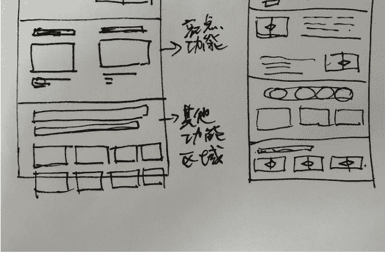

### Render with AI
### Best Function
### Pricing
### Policy


### 积木思维搭建落地页

上面分享了很多组件，我们要做的就是把这些组件和文字像拼图一样的拼到页面上。

一个落地页会包含以下内容：
- 导航栏
- 标题区域
- 产品特色功能介绍
- CTA（行动召唤）
- 用户证言
- 定价方案
- 常见问题
- 底部导航

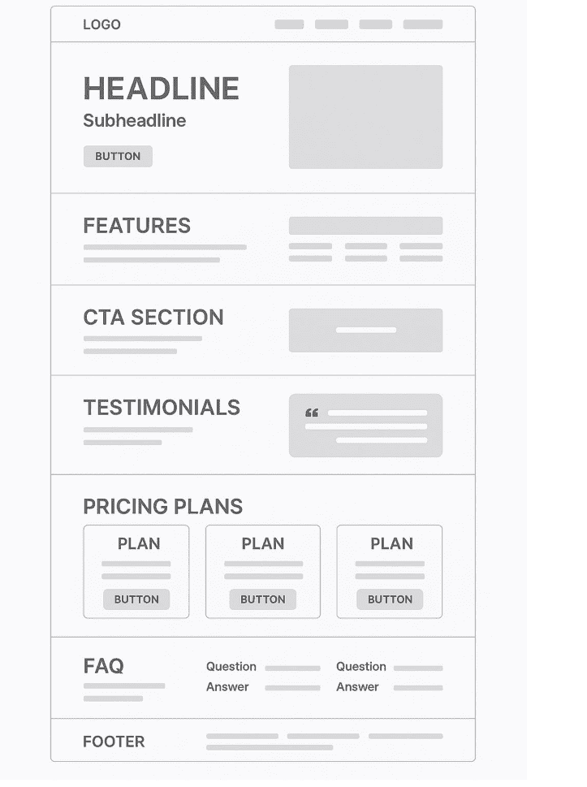

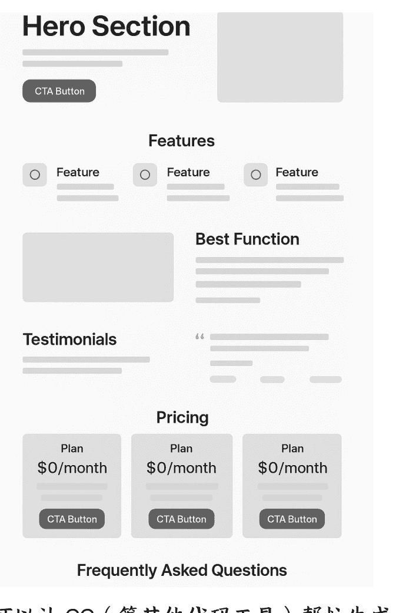

可以让 CC（等其他代码工具）帮忙生成一个设计.md 的文档，把你需要用到的字体色彩，响应式等设计规范放进去。

现在 GPT/Gemini/Claude 生图的落地页我觉得还挺不错的，可以看出来大框架，基本和我上面用 Figma 画的内容很相似。按照对应的区域找到合适的模块拼入就好了！

接下来是找图和放图的过程。按照网站的功能去放合适的图片/视频。做一些点击动画。这一步可能会用到剪辑软件，一些好看的视频站需要拼接视频。

最后把想要的配色 色彩值复制给 AI，让他帮忙统一一下配色，基本就差不多了！

### 使用模板重构项目

当然，简单的方法就是使用专业的 Landing page 模板重构项目。

官网地址：
```
https://www.launchuicomponents.com/
```

Launch UI 提供了免费和付费两种版本。免费版适合刚开始做网站或产品的个人和小团队，永久免费开放，包含一个网站模板、9 个区块和 4 个自定义动画。需要使用高级功能则需要 $99 一次买断。

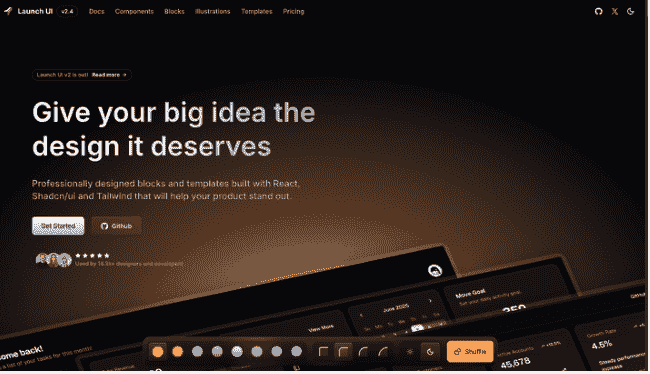

一些 Github 上开源的模板：

网址：
```
https://github.com/cruip/tailwind-landing-page-template
```

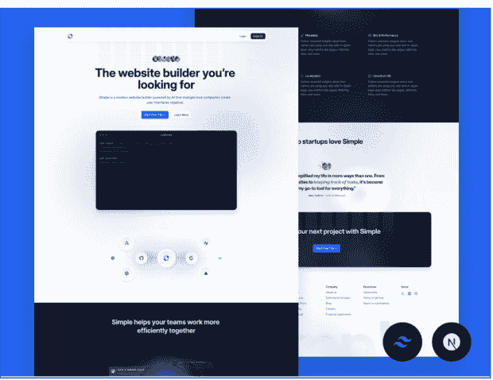

## 5. 设计师常用的网站

在最后给大家分享一些设计师找资源的网站和工具。帮助大家找到自己喜欢的免费素材，提升自己的审美力。

### Pinterest

亮点：需要梯子，但是非常好用！世界最大的视觉书签站；通过瀑布流+强推荐算法快速建立灵感板，覆盖平面、家装、包装等多品类。找图，灵感发散，都很好用！

官网网址：https://www.pinterest.com/

譬如下图我们搜索：Landing page，点击第一张图后会再次给我们推荐更多类似的图片。再点击里面喜欢的图片还能再推荐，无限循环。

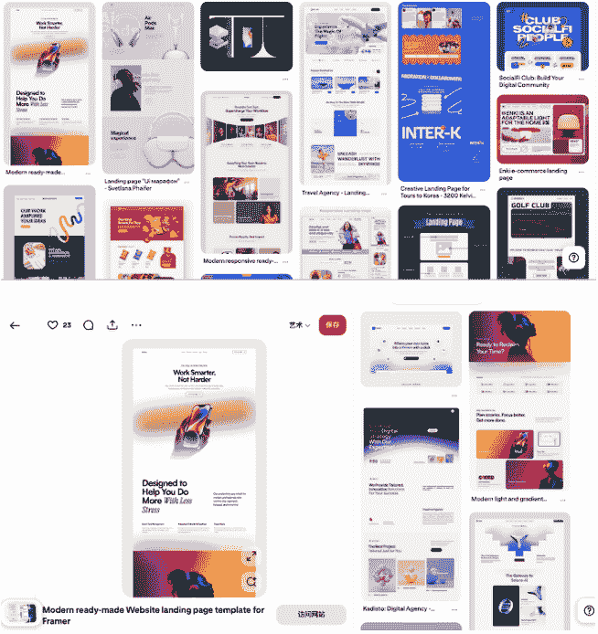

### 站酷

亮点：中国体量最大、内容最全的综合设计社区；作品发布、招聘、比赛、教程一站式。灵感与行业资讯更新速度快，活跃度高。

官网网址：https://www.zcool.com.cn/

可以在站酷上找到想要合作的设计师哦！

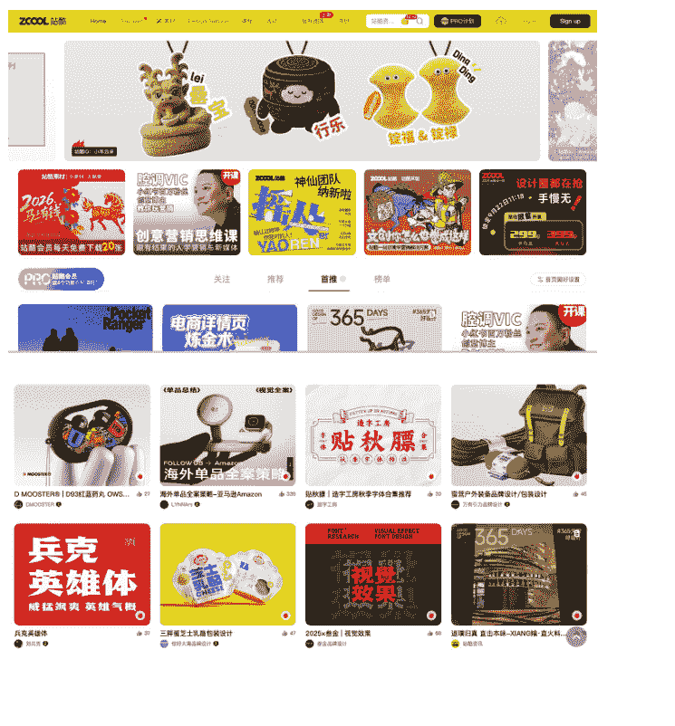

### 花瓣网

亮点：素材网站！类似 Pinterest 的图片采集与灵感收集平台，支持私密板、标签管理，便于做情绪板。胜在不用梯子，国内可以访问！

官网网址：http://huaban.com/

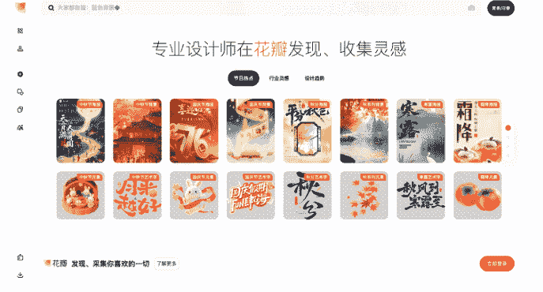

### Noun Project

亮点：Noun Project 是一个拥有超过 800 万免费 SVG 和 PNG 图标、高清照片的资源平台，广泛应用于设计、演示、网站和应用开发。所有资源都可免费下载，支持个人和商业项目，且有清晰的版权许可。平台还通过 API、插件和付费授权等方式实现变现，并支持原创艺术家。

官网网址：https://thenounproject.com/

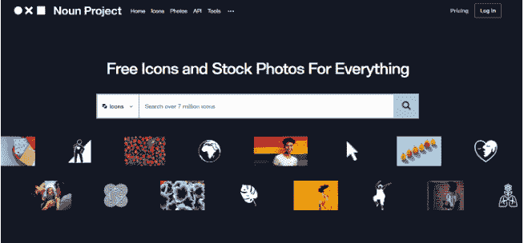

### Lucide icon

亮点：Lucide 是一个开源图标库，提供多种风格和分类的 SVG 图标，支持自定义和商用。

官网网址：https://lucide.dev/icons/

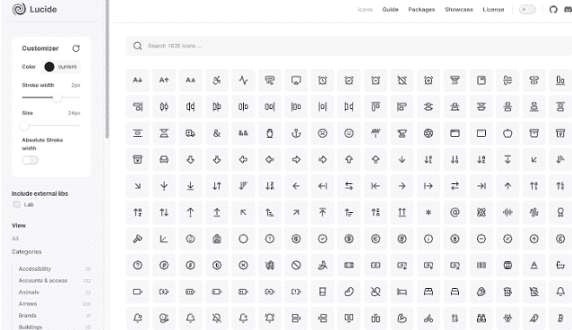

### Figma

亮点：内置的模板 & 插件共享市场；下载 UI Kit、设计系统、白板模板或安装效率插件，全程云端协作。现在 Figma 有 AI 功能，你可以用自然语言描述你的想法，Figma AI 能自动生成界面设计！

官网网址：https://www.figma.com/

模板链接：https://www.figma.com/community 打开社区后搜索你想要的内容！

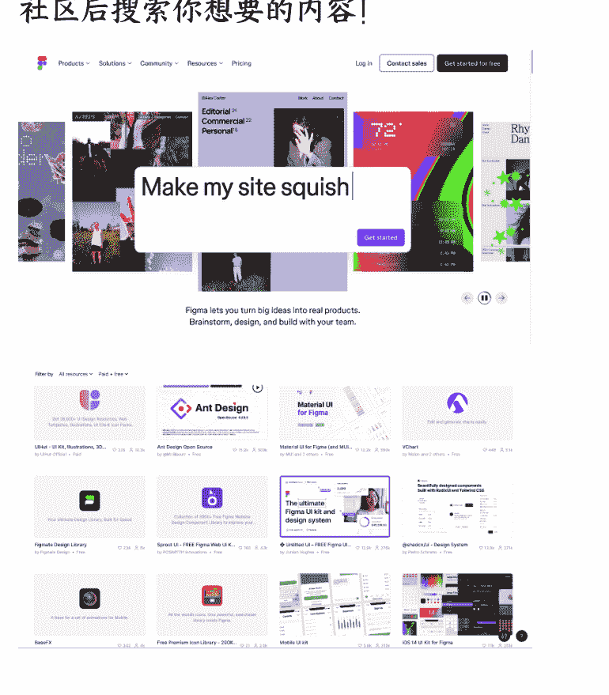

### Awwwards

亮点：专注网页/互动体验的评奖与灵感库，每日 Site of the Day、年度趋势报告都是 Web 设计灵感风向标。里面的网站都非常炫酷！非常适合审美培养，以及了解海外设计趋势。

官网网址：https://www.awwwards.com/

在首页找到 site of the day/month/year

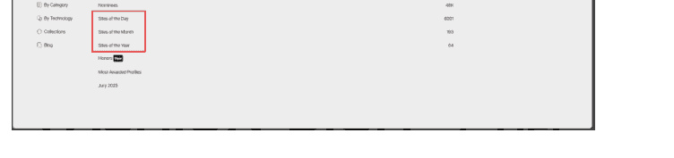

### 根据需求筛选你想要查看的作品

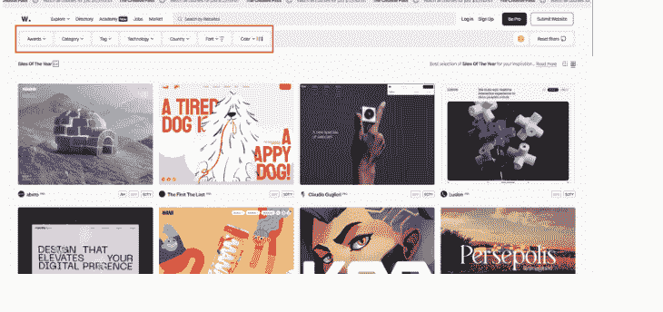

#### Dribbble

亮点：快速发布「一图流」创意的灵感社区；流行趋势更新迅速，适合练习 UI 视觉小稿和找配色 / 动效思路。这也是一个可以寻找设计师合作的平台哦！

官网网址：https://dribbble.com/

没有落地页灵感，看看 Dribbble! 也是非常适合养成审美的网站。

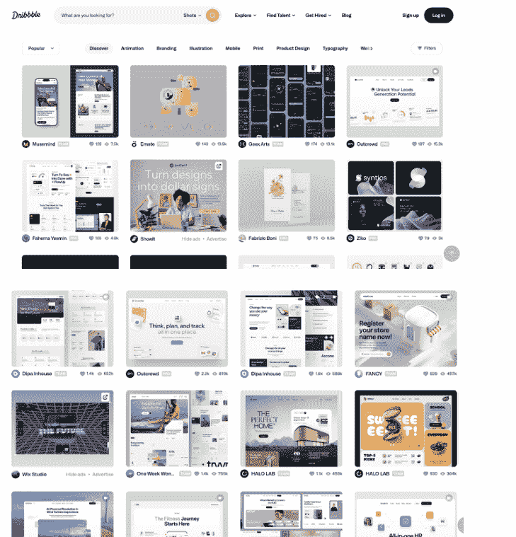

## 6. 总结

阅读完是不是发现，所谓“设计感”，不再是遥不可及的玄学，而是一套有据可循的科学配方串联起来。并且在AI的帮助下，拥有设计感这件事变得更加简单了。

如果对你有启发，记得给我的星球帖点个赞，投锚呀!

最后，安利小懒的付费群:

懒人专属群(介绍)

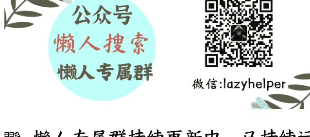

📚 懒人专属群持续更新中,已持续运营6年,整理超3000份各类精选付费文章 & 年费社群干货,全部开放下载。

本资料为付费群内部分享,仅供真实有需要的朋友查阅🤫

懒人专属群更新记录:
https://lazy2025.top/blog/record2

懒人专属群更新记录(需梯子,备用):
https://lazybook.fun/blog/record2