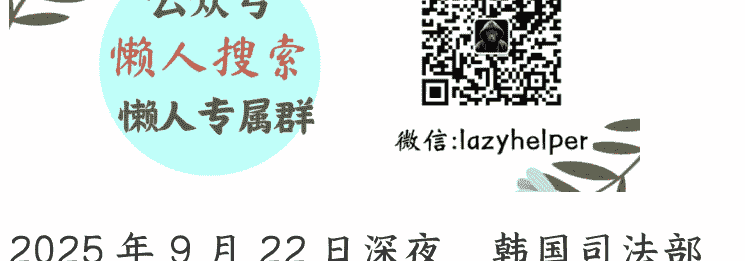

# 韩国邪教教主被捕，李在明在谋划大棋？

250928 文/卢克文工作室嘉宾    低调老弟

整理：公众号懒人搜索，懒人专属群独享

懒人微信：lazyhelper

2025 年 9 月 22 日深夜，韩国司法部门逮捕了统一教的第二代教主韩鹤子，罪名是涉嫌向前第一夫人金建希和国民力量党前临时党首权性东行贿。

统一教可是个狠角色，它和安倍以及一众日韩政坛人物的关系，都不是秘密。

1961 年朴正熙发动军事政变后，创建了韩国中央情报部，也就是韩国版的 CIA。当时还只是个小宗教团体的统一教，因为坚定的反共立场，被发展为中央情报部的白手套。

谁能想到，这个统一教不仅在中央情报部众多的白手套中脱颖而出，后来它的影响力甚至反超了老东家，成为坐拥数十亿美元资产的超大规模组织。

初代教主文鲜明，一度成为全世界最有名的韩国人。

他不仅在克里姆林宫被戈尔巴乔夫以国宾之礼接见，更和朝鲜的金日成拜了把子结为兄弟，震惊世界，还得到了多位美国总统的接见。

文鲜明曾在美国因逃税被判刑、被日本和 14 个欧洲国家禁止入境，在中国大陆更是刚起步就被列为邪教。但除了美国国税局和中国大陆，几乎没有文鲜明摆不平的事儿。

1982年日本政府禁止文鲜明入境以后，他的原话是：“那好啊，除非是天皇出面对我下跪、鞠躬和痛哭，否则我不会去日本。”

结果，自民党副总裁金丸信四方奔走穿针引线，解除了对文鲜明的禁令。

1982年德国政府对统一教采取警戒措施，2002年德国联合 14 个欧洲国家禁止文鲜明入境。但到了2007年，一切禁令都被解除了。

2012年，文鲜明以92岁高龄去世，他的夫人韩鹤子成为第二代教主。现在，创教71年，神通广大的统一教，第一次出现教主被韩国司法部门逮捕的情况，背后有何玄机？

答案是：统一教在韩国政坛内斗、朝韩关系和美韩关系三个方面，都给李在明提供了突破口，堪称一鱼三吃。

## 01 取缔国民力量党的突破口

安倍晋三遇刺之后，岸田文雄展开清党，和统一教有联系的自民党大佬，尤其是安倍派五大佬被整得灰头土脸。统一教日本分支也面临被解散的危机。可三年来，韩国本土的统一教却啥事儿没有。

这首先是因为统一教是韩国右派的柱石。尹锡悦当政这几年，统一教有保护伞。

其次，李在明上台以来，先要忙着韩美关税谈判。

现在，李在明终于腾出工夫，以统一教为突破口，剑指国民力量党。这一招有多厉害呢？国民力量党新任党首张东赫原本气焰嚣张，到处讲要推翻李在明政权。可自从李在明把统一教和国民力量党一勺烩了以后，张东赫的气焰一下子就被打掉了，开始讲软话，谈两党合作了。

原本，李在明的思路是借着尹锡悦的非法戒严案，把国民力量党定性成戒严闹剧的帮凶，但效果非常糟糕，民众反倒觉得李在明在搞株连，搞扩大化。

今年的总统选举，李在明赢得一点也不轻松。

然而，不知道谁给李在明出的主意——国民力量党涉嫌和统一教勾结，违反韩国宪法政教分离的原则。

## 02 朝韩沟通的突破口

李在明上台以来，一再热脸贴朝鲜的冷屁股。他反复强调尊重朝鲜体制，不追求任何形式的吸收统一。而朝鲜方面的态度是，如果美国承认朝鲜拥核那还能谈，对于韩国方面则干脆免谈。

其实，今天的韩国民意，已不再支持朝韩会谈，毕竟努力了多年也没有结果。

但韩国民意更不愿意看到另外两种情况：一是像尹锡悦那样挑衅朝鲜，引爆第二次朝鲜战争；二是朝鲜和美国踢开韩国直接会谈。

这样一来，李在明将成为韩国史上最无能的总统，会被千夫所指。

李在明一再热脸贴冷屁股，是为了避免第一种情况——朝韩擦枪走火。而要阻止第二种情况，正好可以在统一教问题上发力。因为统一教不仅是韩国右翼与朝鲜的纽带，更是朝鲜规避国际制裁的地下网络。

1991年年底，随着苏联的崩塌，朝鲜陷入空前的经济困难。这时统一教教主文鲜明以35亿美元换来了和金日成会见的资格，并在朝鲜住了一年多。此后，统一教与朝鲜的合作包括但不限于：在平壤开办宾馆，进军朝鲜旅游业、与朝鲜政府合资创办朝鲜唯一的汽车厂——平和汽车（山寨中国车型）、通过地下网络帮助朝鲜规避制裁转账，甚至帮助朝鲜购买潜艇和导弹发射器。这说明有美日朝撑腰的统一教早已超出了韩国情报部门的控制，呈尾大不掉之势。要知道上一个这么牛叉的非政府组织，还是英国的东印度公司。

1994 年金日成去世，2011 年金正日去世，统一教都派了代表团前往悼念，简直是国家级待遇。 2012 年文鲜明去世后，将军公开哀悼，称其功绩长存。

现在朝鲜对韩国政府爱答不理的态度，除了依仗俄罗斯援助的原因，还在于朝鲜有统一教这个地下网络。如果李在明能拿捏统一教，对朝鲜的话语权也会加强。

之前的文章分析过，李在明把第一次接待外宾的殊荣留给越南时，我提到李在明需要越南作为中间人缓和朝韩关系，避免韩国被美朝一脚踢开。

越南是朝鲜为数不多的友好国家之一，而统一教和朝鲜政府合资的平和汽车厂正好刚开始在越南拓展业务。等于说，统一教也是李在明推动越南出来当和事佬的一个抓手。

## 03 美韩关系的突破口

李在明先访问日本，和石破茂一块蛐蛐特朗普之后再访美，招来了特朗普的公开羞辱——数百名在美国工厂的韩国打工人，无论合法还是非法移民，一律上手铐脚镣示众。

而统一教和美国共和党之间的渊源，可太深了。

1974 年，统一教通过其主办的《华盛顿时报》和发动教徒上街喊口号等手段，为尼克松辩护，试图帮助尼克松渡过水门事件的难关。

之后统一教出人出钱，支持历届共和党候选人竞选。出钱可能还是小事，难得的是，教徒立场坚定还免费干活，作为竞选工具实在是趁手。

据日媒报道：2016 年 11 月，就连时任日本首相安倍晋三想要第一个和特朗普见面，都得通过统一教教主，也就是最近被逮捕的这位韩鹤子牵线搭桥……特朗普更曾公开赞扬过韩鹤子是一位了不起的人物。

那么问题来了，李在明逮捕韩鹤子，就不怕进一步得罪特朗普吗？

还真不怕。

因为韩鹤子在统一教内最大的竞争对手，“废太子”文亨进，跟特朗普的关系也很好。2021 年，文亨进组织信徒参加了国会山之乱。

而文亨进和他的亲生母亲韩鹤子的关系，简直是水火不容。

文鲜明生前，指定小儿子文亨进为继承人。

然而老爷子死后，老太太按捺不住权力的诱惑，解除了文亨进在统一教内的一切职务，导致母子反目。

- 老太太的子女，分成了两派，一派挺文亨进，反对亲妈；
- 一派挺老太太，反对文亨进。

而文亨进这个“废太子”要上位，最好的机会，当然就是亲妈被捕。更重要的是，文亨进与特朗普的小儿子埃里克，关系密切。

羽翼丰满的特朗普，或许用不着和统一教来往密切，但小儿子将来还是用得着的。

所以，李在明抓了韩鹤子，正好利用韩鹤子、文亨进母子俩的矛盾，诱导他们做特朗普的工作。无论是韩鹤子要搬特朗普救命，还是文亨进要搬特朗普帮他上位，都能让李在明多一个对特朗普谈判的筹码。

## 04 其实，统一教在港台地区也有分支，其台湾分支更是连续23年被台湾当局颁发“绩优宗教团体奖”。如果李在明真能取缔统一教，那我们得拍手叫好。

如果李在明诱导、收编韩鹤子供出国民力量党更多罪名，那么有助于他取缔国民力量党，一统江山。

如果韩鹤子坚决对抗到底，李在明可以联合文亨进取代韩鹤子，与特朗普父子多一条纽带。无论韩鹤子被收编，还是文亨进夺嫡上位，李在明都能插手统一教，这个朝鲜倚重的地下网络。

统一教这么一个邪教组织为什么能在长达七十一年的时间里做大做强，在一众邪教当中脱颖而出？

简单来说，一般的邪教组织头目只是图钱图色，野心大一点的一般都会去冲击政权。而统一教却到处为政权服务……对西方国家，他们充当价格便宜量又足的竞选工具。

对苏联和朝鲜，统一教既经济合作的同时，还积极充当走私白手套。

结果就是，除了中国大陆，他们简直无往而不利。

所以，李在明在面对巨大机遇的同时，也面临着巨大的风险——万一韩鹤子顽抗到底，将导致三个突破口就一个都打不开，还彻底得罪了统一教。

到时，李在明既失去了取缔邪教的道义，也没拿到利用邪教的好处。历史的机遇摆在了李在明面前。

他是否会取缔统一教，将检验他的底色。

他能否拿捏统一教，则将检验他的水平。

最后，安利小懒的付费群：

懒人专属群 <a>（介绍）</a>

微信:lazyhelper

懒人专属群持续更新中，已持续运营 6 年，整理超 3000 份各类精选付费文章 & 年费社群干货，全部开放下载。

本资料为付费群内部分享，仅供真实有需要的朋友查阅

## 懒人专属群更新记录：
https://lazy2025.top/blog/record2

## 懒人专属群更新记录（需梯子，备用）：
https://lazybook.fun/blog/record2