# 3年，天猫白牌店 50w到2344w：洞察、货品、会员、内容运营的完整打法

250928 生财精华

公众号懒人搜索，懒人专属群独享

懒人微信：lazyhelper

## 一、简单自我介绍

简单自我介绍一下，大家可以叫我吴安，从毕业就从事天猫行业，从客服到运营助理到运营专员到运营主管，做过图书类目和美妆类目。我也是吴泽承学长推荐加入的生财，感谢吴学长！

与大多数财友不同的是，我还没有进行过创业，正在努力向圈友学习。我从毕业就扎进了电商运营行业，一步一步积累的些许经验与大家分享，希望给财友们在电商的路上，至少在天猫这个平台有些许参考经验和帮助。

Love And Share

本文会着重阶段来阐述。

## 二、低成本爬坡阶段：从月销 5w-月销 30w

### 2.1 当时品牌背景

22年，刚入职该品牌的时候，整个品牌属于0到1的阶段。整体公司的销售渠道分布为：抖音、天猫、分销。大盘在抖音渠道，月GMV大概在几百万左右（具体数值给忘了），天猫月度5万，单日几千。分销因为整体品牌的知名度不高，所以分销也是几乎没有业绩，难以往下推进下去。

| 日期 | 销售商品数量 | 支付买家数 | 成交金额 | 退款金额 | 实际销售 | 平均商品单价 | 店铺流量(PV) | 访客流量(UV) | 万相台(无界版) | 品销宝 | 直通车 | 引力魔方 | 万相台 | 手淘搜索 |
|---|---|---|---|---|---|---|---|---|---|---|---|---|---|---|
| 1月12日 | 30 | 2000.00 | 800.00 | 1200.00 | 66.67 | 1800 | 450 | 0 | 220 | 0 | 0 |  |  |  |
| 1月13日 | 26 | 1960.97 | 641.15 | 1319.82 | 75.42 | 2082 | 541 | 0 | 209 | 0 | 0 |  |  |  |
| 1月14日 | 22 | 1908.27 | 318.6 | 1589.67 | 90.87 | 2029 | 548 | 0 | 207 | 0 | 0 |  |  |  |
| 1月15日 | 36 | 2765.54 | 0 | 2765.54 | 76.82 | 2404 | 616 | 0 | 215 | 0 | 0 |  |  |  |
| 1月16日 | 18 | 1592 | 234.89 | 1357.11 | 93.66 | 2203 | 567 | 0 | 235 | 0 | 0 |  |  |  |
| 1月17日 | 14 | 1379 | 282 | 1097.00 | 98.50 | 3264 | 1574 | 0 | 194 | 0 | 0 |  |  |  |
| 1月18日 | 20 | 1780 | 247 | 1533.00 | 89.00 | 6433 | 4312 | 0 | 85 | 0 | 0 |  |  |  |
| 1月19日 | 16 | 1613 | 330.14 | 1292.86 | 100.81 | 6854 | 4742 | 0 | 119 | 0 | 0 |  |  |  |
| 1月20日 | 8 | 712 | 178 | 534.00 | 89.00 | 6026 | 3963 | 0 | 130 | 0 | 0 |  |  |  |
| 1月21日 | 16 | 1479.8 | 416.53 | 1063.27 | 98.65 | 1836 | 449 | 0 | 153 | 0 | 0 |  |  |  |
| 1月22日 | 14 | 1148.7 | 286.9 | 861.80 | 95.73 | 1484 | 398 | 0 | 153 | 0 | 0 |  |  |  |
| 1月23日 | 16 | 1424 | 267 | 1157.00 | 94.93 | 1435 | 407 | 0 | 154 | 0 | 0 |  |  |  |
| 1月24日 | 8 | 747 | 158 | 589.00 | 93.38 | 1318 | 354 | 0 | 118 | 0 | 0 |  |  |  |
| 1月25日 | 13 | 1037 | 0 | 1037.00 | 86.42 | 1320 | 367 | 0 | 130 | 0 | 0 |  |  |  |
| 1月26日 | 8 | 632 | 168 | 464.00 | 79.00 | 1091 | 304 | 0 | 114 | 0 | 0 |  |  |  |
| 1月27日 | 10 | 830 | 79 | 751.00 | 83.00 | 865 | 262 | 0 | 109 | 0 | 0 |  |  |  |
| 1月28日 | 9 | 830 | 158 | 672.00 | 92.22 | 1077 | 310 | 0 | 128 | 0 | 0 |  |  |  |
| 1月29日 | 8 | 642 | 218 | 424.00 | 80.25 | 1002 | 271 | 0 | 118 | 0 | 0 |  |  |  |
| 1月30日 | 11 | 869 | 79 | 790.00 | 79.00 | 1201 | 246 | 0 | 23 | 0 | 0 |  |  |  |
| 1月31日 | 11 | 889 | 79 | 810.00 | 80.82 | 635 | 185 | 0 | 0 | 0 | 0 |  |  |  |
| 1月合计 | 699 |  | 57488.06 | 7064.95 | 50423.11 | 88.30 | 111651 | 48688 |  | 0 | 5538 | 0 | 0 |  |

从货品策略来看，类目为美妆护肤品牌，货品有：洗面奶、喷雾、爽肤水、面霜、面膜。公司当时的战略为：大单品策略，单推喷雾一个品（白牌的时候，团队精力有限，all in 一个单品不失为一个好的战略）。因为是确定性的产品，所以本案例不涉及选品问题，有这方面问题可私聊问下。

天猫团队配置：运营+助理。营销策略：公司首先要求是没有大预算，还必须保有利润。我担任的就是其中的运营，负责店铺的整体运营、单品运营+付费推广+天猫达人沟通。

公司给我的第一个考核就是：如何从目前的月 5w 做到 30w？

### 2.2 第一步先洞察和分析（4P：价格、渠道、产品、推广）

- 1. 分析市场
- 2. 分析竞品
- 3. 分析自身

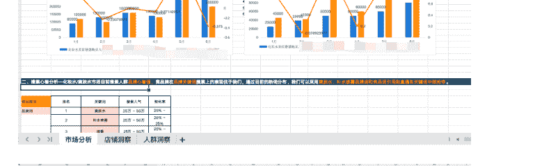
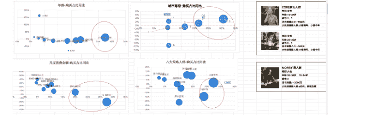
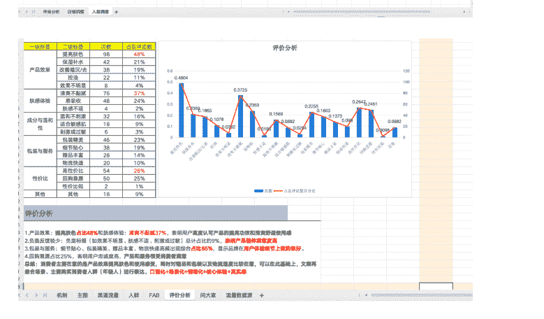

- 评价分析
  1. 产品效果：提亮肤色占比48%和肤感体验：清爽不黏腻37%，表明用户高度认可产品的提亮功效和清爽舒适使用感。
  2. 负面反馈较少：负面标签（如效果不明显、肤感不适、刺激或过敏）总计占比约9%，表明产品整体满意度高。
  3. 包装与服务：细节贴心，包装精美，赠品丰富，物流快递高复购意愿占比65%，显示品牌在用户体验细节上做得很好。
  4. 回购意愿占比25%，表明用户忠诚度高，产品和服务很受消费者满意。
  5. 总结：消费者主要在意的是产品效果（提亮肤色）和使用感受。同时对赠品、包装以及物流速度比较在意，可以在此基础上，文案再结合场景，针对主要购买消费者人群（年轻人）进行表达，采用口播化+场景化+情感化+核心体验+真实感的策略。

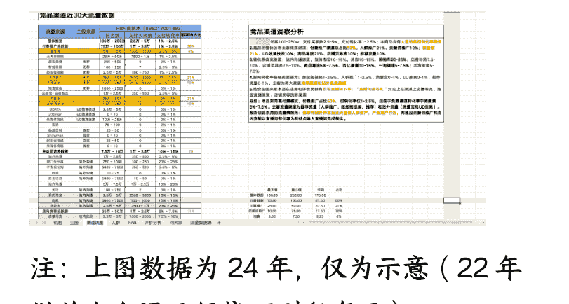

注：上图数据为 24 年，仅为示意（22 年做的太久远已经找不到留存了）。记得当时我们的主链接销售额为月度 500+，竞争 TOP 主链接已经为 1w+了。

从市场分析和竞品分析、人群、价格、机制、销量、渠道、评价来看，我们首先要明白：
- 第一：同样的类目，消费者为什么要买我们的产品？
- 第二：与竞争品牌来讲，我们的优势在哪？价格、功效、赠品？（差异化）
- 第三：竞品有哪些我们值得学习的？渠道？

### 设定猜想和验证执行

分析得知：从评价分析来看，与抖音的销售额来讲，产品是没问题的，是得到了消费者的认可。唯一问题是品牌的声量不够，但是我们是没有预算去做大推广的。品牌上不占优势的，但是价格却跟 TOP 一样的，所以首先调整的就是价格和机制。从人群分析上看，选中其中一个人群相似度比较高的 TOP 品，去瞄着它的价格还有机制打：竞品日常价格 88，我 78，活动 78，我 68。你买一送一，我买一送二。同时增加一个低规格（高利润）的 SKU 引流。

其次优化基本功：主图、详情页、评价、问大家、卖家秀、SKU 图（这些都是基础但是很重要）。

简单讲一个方法论：把你自己当消费者，写一份购买产品的关键行为路径。比如：我要购买一个鞋子，我首先打开的就是淘宝，然后去点击搜索“鞋子”，下滑浏览商品，这时候要记住你被哪张主图吸引，然后浏览主图，查看评论（差评、好评）等等全部流程走完，直到你完成下单。你可以多找几个团队的人，好好回忆哪几个关键步骤是影响你下单的关键因素，着力去优化。

讲一下其中一个细节：问大家和评论要结合竞品的问大家和评价去做？评价的文案和图片、问大家的提问非常重要，建议采用场景化的形式去讲，让消费者能有代入感，去解决和打消消费者的疑问和顾虑。比如：“姐妹们，学生党必买！XXXXXX”“确实比竞品好不少，用的更细腻 XXX”。图片不要一眼假，不要通篇全是五张买家秀，有私域的商家可以每天安排 3-5 单主爆品的评价维护，同时也开启平台的评价有礼功能。

后面就是渠道拓展和优化：竞品跑的达人直播渠道、付费推广渠道、淘客渠道。竞品做了的渠道，我们没有做的，我们也要尝试去做。基于此我们拓展了淘客渠道，开始重视天猫达人的这个渠道。（同样的要想清楚为什么达人要卖你的品？机制还是佣金比别人强）。达人我们也碰到了一些问题，就是 TOP 的主播是不怎么愿意卖我们的产品的。我们在不放弃大主播的同时，把目标转向一些中小主播，因为我们的合作形式为纯佣金或者保量，所以在不求成交的情况下，也要追求通过达人渠道的曝光。

值得一提的是，我们天猫达人打破僵局的是，有一个主播，别人卖喷雾用来喷脸，一瓶几十，她直接对她粉丝讲用喷雾洗脸，客单直接一下从几十变成几百上千。那为什么能卖出去？当方法对了，场景对了，人群对了，信任度够了，会有人为你疯狂下单。

付费渠道（直通车、引力魔方、货品运营工具等）推广工具，涉及的细节（测图、拉标签、测人群）比较多，就不过多赘述，本篇只讲一些大的逻辑。

以上所有动作，做完之后，一定要有复盘和优化的动作，所谓的 AB 测试和 PDCA。同时做好天猫平台的会员运营，首先面临的问题就是小商家，是无法进行 0 元入会的。想入会必须确定收货才可以（0元入会需要达到一定的等级，达到等级条件是月度入会量和会员成交额），那我们想让消费者第一次购买当下就入会，尽快达到0元入会的条件，如何解决呢？

- 1. 通过1元有价券，让消费者购买先付款1元，然后再入会。消费者为什么要先付1元呢？1元可以获得5元的优惠券，而且入会可以获得免费的小样体验装，随单一起发出。
- 2. 通过合作比较好的达人，购买大额订单以此来增加会员成交占比这一个考核项目。
- 3. 包裹卡，增加入会和评价有礼和私域池子。

那为什么从月GMV 5w的时候，我就安排要进行会员运营了呢？因为天猫的搜索和推荐展现的算法，与品牌有用户行为的商品，消费者再去搜索相关类目的时候，会优先展现在前面。

### 2.3 淘宝平台的算法免费流量分配逻辑是什么？

- 1. GSV（成交金额）— 25%
- 2. 商业化（付费推广）— 25%
- 3. 人群资产 — 40%
- 4. 权重运营 — 10%（店铺：体验分、层级 + 单品：9 率 - 点击、转化、加购、复购、差评、纠纷、投诉、介入、退货）

商业化（付费推广）为 GSV 服务，商业化效果越好，GSV 压力越小。
举例子：GSV 涉及平台收取的佣金。同样 1000 个免费流量，一个产品 A 能卖 200w，产品 B 卖 100w，平台分配谁更多的免费流量可想而知？

#### 那是不是只做销售额就好了？

不是的。每个渠道带来的销售额的权重又有不同，会有各自的权重 K 系数。付费渠道和淘客渠道带来的销售额一样的情况下，付费渠道的权重远大于淘客渠道带来的权重。商业化就是店铺的月度推广花费，尤其在现在天猫竞争激烈情况下，付费是不可避免的。

人群资产：以专业名词来讲就是 A（认知人群）、I（兴趣）、P（购买）、L（复购）的总人群总量。人群资产越多，也就是跟品牌产生的行为越多，品牌知名度越高。我们要做的就是不断拓展认知人群，和不断促进人群的流转，从 A—I—P—L。

#### AIPL人群模型

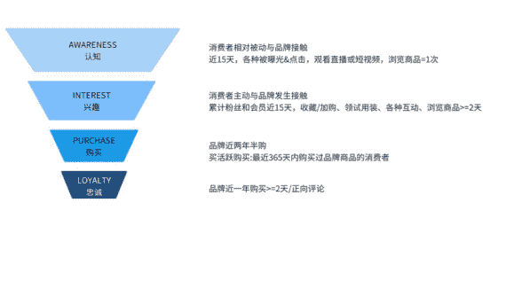

综上，在货品策略（低价引流 SKU、价格策略、赠品策略）、渠道策略（淘客、达人、付费）以及视觉优化之后，三个月店铺销售额从 5w 跃升至 10w，最终达到 30w。

| 日期 | 销售商品数量 | 支付买家数 | 成交金额 | 退款金额 | 实际销售 | 平均商品单价 | 店铺流量(PV) | 访客流量(UV) | 万相台 | 品销宝 | 直通车 | 引力魔方 | 手淘搜索 | 淘宝客 |
|---|---|---|---|---|---|---|---|---|---|---|---|---|---|---|
| 5月29日 | 155 | 7280.06 | 537.94 | 6742.12 | 48.19 | 9206 | 2316 | 318 | 633 | 138 | 254 |  |  |
| 5月30日 | 116 | 5667.16 | 637.19 | 5029.97 | 51.52 | 7951 | 2077 | 264 | 437 | 141 | 216 |  |  |
| 5月31日 | 742 | 34669.02 | 6806.77 | 27862.25 | 51.51 | 19317 | 6204 | 401 | 735 | 175 | 392 |  |  |
| 5月合计 | 4566 | 308839.95 | 39801.71 | 269038.24 | 1950.84 | 246672 | 61303 | 8583 | 17024 | 3764 | 5852 |  |  |

店铺直接往上跃了一个层级，店铺进入了更大的流量池子里，自此之后再也没下过 30 万。

## 三、增长放大阶段：月销 50w-100w

淘宝平台传统货架电商区别于抖音平台以直播卖货为主的兴趣电商。当店铺以货架为主提升销售额时，当销售额达到一定量级之后，除非品牌受到重大事件影响，业绩几乎不会有大幅波动。做到 30w 之后，店铺基本上就稳定到 30w-50w。那我们又如何从 50w 做到月 100w 的呢？

- 前提条件：品还是只有一个，其他的品已经下架不进行售卖。
- 团队配置：天猫运营+助理。
- 这时候已经开始布局一部分内容运营了，但是还不足以单独招聘一个内容运营和剪辑人员，我们会协同抖音部门的剪辑给我们每天出一部分短视频。
- 抖音平台：抖音官旗售卖很好，抖音直播达人、抖音种草博主，自然会给天猫带来一小部分外溢流量（前提当某一平台远大于其中一个平台时）。

品牌声量：搜索指数很低，尝试一段时间小红书种草（22年），短时间内没有见效，公司决定停止该业务。总之，我们此刻当下还是需要向内求，回归到店铺的人群运营和货品运营以及渠道运营上。

### 3.1 货品策略再次调整

上次调整的主链接已经稳步在月度销量5000+的位置，在付费 ROI 的要求下，货品如何再往下提一步呢？不知道怎么办时，让我们看看竞品。

竞品机制

| 品牌 | 产品 | 产品ID |  | 主销规格 | 赠品 | 价格 | 销售买家数占比 | 销量 | 发货策略/定位 |
|---|---|---|---|---|---|---|---|---|---|
|  |  | 11 | 492 | 150ml | 双A醇晚霜5g*2+丝绒袋*1 | 129 | 88% | 50w+ | 拉新锁客，降低购买成本 |
|  |  |  |  | 300ml | 双A醇晚霜5g*4+丝绒袋*1 | 258 | 12% |  | 老客复购，提升客单 |
|  |  |  |  | 10ml | 回购券199-10+晚霜5g | 4.9 |  | 1000+ | 新品试用，试用回购 |
|  |  | 22 |  | 10ml+晚霜5g | 回购券199-10+晚霜5g | 17.9 |  | 5w+ | 水乳小样试用，爆款连带新品 |
|  |  | 64 | 265 | 10ml+A醇精华乳,10ml | 回购券199-10+晚霜5g | 16.9 |  | 5w+ | 水乳小样试用，爆款连带新品 |
|  |  | 16 | 140 | 10ml+精华乳,10ml+晚霜5g | 回购券199-10+晚霜5g | 25.9 |  | 4w+ | 乳是水样试用，旅行装，爆款连带新品 |
|  |  | 9 |  | 10ml+精华乳,10ml+洁面5g | 回购券199-10+晚霜5g | 19.9 |  | 6w+ | 水乳洁面旅行装，爆款带新，小样试用 |

注：上图作参考，非当时分析表格。

我们发现竞品有两个链接的机制我们是没有的：50ml×2、300ml×3。虽然都是喷雾，但是因为规格的大小不同，有的是50的，有的是100的，有的是300的，那也对应着可以有不同的应用场景。50ml×2 竞品打的可带飞机和高铁的场景，300ml×3 打的就是老客和囤货装的场景。不同的场景就对应不同的人群，那这时候要问了：会不会有原来的链接有重叠呀？有，这无可厚非，但我们这时候应该看总量，而且竞品已经在市场验证过的事情，50ml×2 月销量1w+，不要疑虑，往下干！

所以继续之前的单品打爆的流程再走一遍，分析关键词，分析竞品人群，分析竞品评价，做主图、详情页。我们安排私域池子，做销售递增，评价、问大家铺设，买家秀铺设。

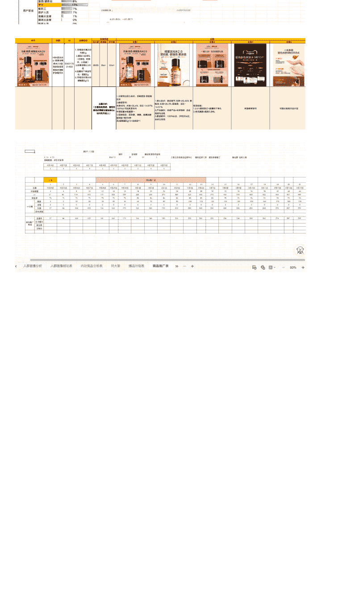

#### 评价

全部 | 买家秀 65 | 图/视频 3000+ | 追评 400+ | 超赞
已购 300ml | 2个月前
这个补水喷雾真的很不错啊！有保湿锁水的和镇静修护的作用，都是我需要的。喷完感觉皮肤水水嫩嫩的。

店铺 | 客服 | 收藏 | 加入购物车 | 立即购买 | 保湿小分子补水喷雾

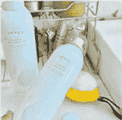
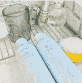
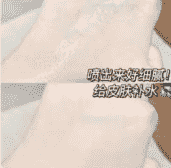

#### 32天后追评

电商人熬夜加班，长期在空调房下皮肤又干又红，还好有这个补水喷雾，它的修护力真的很强，喷完后脸上的干燥和泛红就舒缓了很多，肌肤瞬间水嫩嫩的，巨舒服

全部 3201 大干皮1 真的17 皮肤25 好闻7

问 天热脸太容易干燥泛红了，用这个补水喷雾能不能改善啊
已购 可以试试

问 补水效果怎么样？推荐入手吗？
回头客 补水效果挺好滴 喷上四五泵 脸一天水嫩

问 小红书种草来的这个喷雾细腻吗？
已购 喷嘴比较细腻，目前一直出雾均匀，还可以。
2个买家的回答

问 补水效果怎么样？和颐莲哪个好用啊？
回头客 我感觉这个更好用 补水保湿效果更好一点
4个买家的回答

问 保湿效果好吗，敏感皮肤可以？
买过9次 好
3个买家的回答

玻尿酸补水... 去提问 立即购买

因为当时打单品场景，只有一家品牌在做，再加上我们的价格优惠，很快这个打单品场景的链接拉升了起来。

其中还有一些打单品的小技巧：

当你的客单价在 20 以下的时候，前期为了快速入流量池，和做销量的递增，可以利用“顺手买一件”这个平台工具。

把价格设置为 19.9、9.9，具体根据数据反馈，同时记住不要一直挂着。你要手动控制每天的“顺手买一件”的成交量，因为我们要做递增，要做数据反馈给平台算法。比如计划表里今天 4 单，那就是 4 单，即使能卖更多也要把“顺手买一件”手动取消掉，明天再设置，按照计划明天售卖 8 单，以此类推。

300ml×3 以同样的流程进行了打造，但是区别是，基于当时的购买人群和复购人群不成体量，所以当时只做了基础的铺设，在付费端并没有分配很大的费比，以自然流量来承接老客。在 100w-200w 提升的时候，300ml×3 已经跃升为次爆款链接的地位，因为人群资产已经足够了。

当时最基本的货品布局已经出现：
- 50ml×2：拉新款，便携出差场景，可上飞机高铁，轻费比
- 300ml：主推款，活动款，做市场竞争，重费比
- 300ml×3：利润款，囤货款，老客承接，做利润，提客单，次重费比

### 3.2 渠道策略：达人溯源直播，链接 Top 主播，拓展新渠道
- 溯源直播：
什么是溯源直播呢？就是把达人请到工厂，请到发源地，进行大厂直播，当然这只是个噱头，这个就对应着更比平常直播机制更有力度的活动。

而我们在当时的情况下，基于那位讲用喷雾洗脸的达人日常直播都带来不错的销售额，我们也为了冲刺销售额，做了此次的尝试。

整个过程比较繁杂，要提前预定溯源时间、溯源的机制、溯源的活动、溯源的地点、背书报告资料，要在主播直播间和粉丝群里做预热，主播的机票、住宿和行程安排，当地的人员安排，开播的环境和网络、发货等等。

我们的溯源地在几千米的雪山上，还要背着很重的喷雾上去，累得够呛，但好在结果是好的。

单场直播 44W！我们当时一个月也就四五十万，自此店铺再上一个层级！

#### 链接 TOP 主播：
此时正是天猫主播最火热的时期。

淘系当仁不让的超级头部主播就是李佳琦，我们显然还不够格。

但是随着销售额的不断增加，我们可以联系到一些第二梯队的部分主播，比如蜜蜂惊喜社、蜜蜂心愿社、陈洁 kiki。

但同样的问题，为什么要卖你这个不知名的品牌？

我们当时给出的方案是，更高的佣金。

#### U先派样：
美妆护肤品牌不可避免的就是要做小样派样，以此来形成回购，这个渠道对店铺的人群资产有比较大的帮助，属于品牌拉新。既然是拉新就对应的复购，也就是用户运营。基于当下人员有限，用户运营的复购触达延迟到 100w 到 200w 那个阶段才进行精细化运营。

U先派样大家需要注意的是，白牌的时候，同样是低价的时候，消费者为什么选择你？

#### 那就是权益和视觉
同样的价格情况下，你的赠品。这时候赠品成本不需要很高，因为已经是低客单了，要的是数量的压制。

另外还有个权益就是回购券，虽然实测下来回购流转率不高，但可以算进赠品的一部分。

剩余的就是派样主图的视觉展现，一些商家觉得派样渠道不太重视，但是你做了之后就会跟别人有差异化。

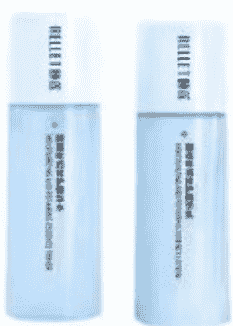

#### 旗舰店 颐莲玻尿酸嘭嘭水乳
回购享优惠券
已试 1 万+
> 一点也不油腻
¥14.9 试用价
领

Biorrier 珀芙研 x 天猫U先

#### 敏肌灭火器 平定泛红不适
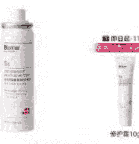
舒缓保湿修护喷雾 50mL
修护霜 10g

#### 旗舰店 珀芙研舒缓保湿喷雾
回购享优惠券
已试 1 万+
> 价格经济实惠
¥14.01 试用价
领

#### 珀芙研
回购券解锁指南
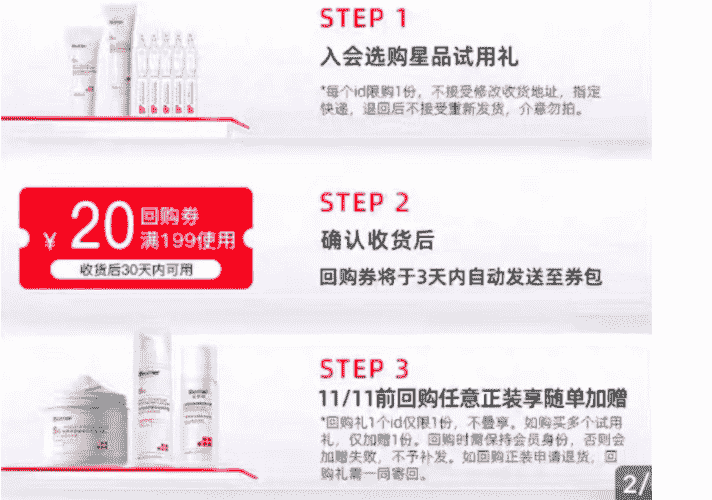

#### 线下校园活动：
基于我们的人群洞察分析，我们的购买人群 17% 左右都是大学生，所以联同市场部，在开学季的时候做了线下快闪活动。本次活动目的：
- 1. 为线上传播提供素材
- 2. 拓展校园学生人群
- 3. 学生入会派样试用

因为做这种活动的成本其实很低的，只需要产品成本的费用和校园场地租赁费、货架费。

给大家提供的参考就是：

想低成本拓展人群的时候，要思考，这群人的聚集地在哪个地方。比如：学生的聚集地在学校，利用人的周边关系网发生裂变，比如一个学生试用了，那最起码一个宿舍的人，就会知道这个产品。

品牌认知度是一个细水长流的事情，除非你有大资金。

### 3.3 平台资源：新锐商家千星计划
随着店铺销售额的不断增加，平台的小二会主动联系到你，因为平台也面临着竞争，平台会对不同的商家进行分层，倾斜不同的资源。

当销售额从年 50w 做到年 380w 时，平台主动找到了我们，建联千星计划小二、行业小二、阿里妈妈小二。

有必要提醒大家的是，无论在哪个平台，一定要注意平台的资源。平台也是要增长的，所以会给一些补贴。商家的层级越高，卖的销售额要高，平台给的补贴资源就越多。这也是为什么 TOP 级别的商家很难超越的原因，因为强者恒强，资源越多。而且做到 TOP 级别，可以给平台要一些资源。

我们入选之后，原来接触不到的佣金膨胀、推广费用对赌返点、TOP 级达人资源、各种会场资源、平台新媒体联合传播资源、超级单品，不断的注入到店铺里，所以为什么这里要着重讲一下平台资源的原因！

我也因此结合了很多品牌商家和达人机构。

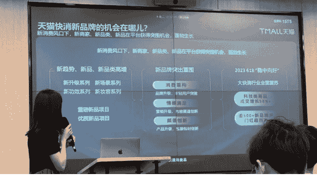
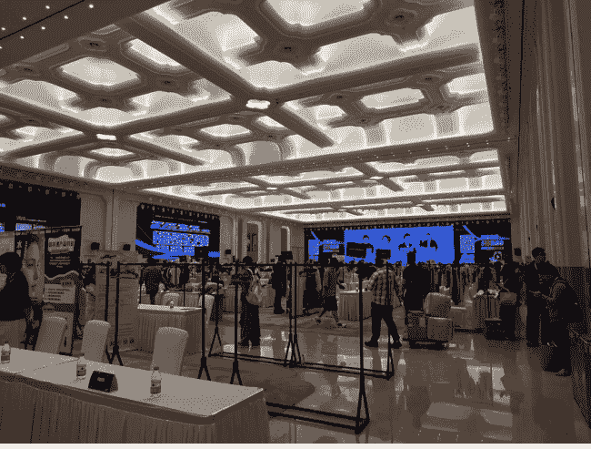

如果你正在做平台、做店铺，请尽快找到你对接行业小二和组织！

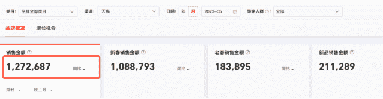

## 四、精细化运营阶段：月销 100w-200w
低成本从 100w 做到 200w 对精细化的要求会更多，在竞争如此强烈的大环境下，我们要保证利润的情况下做增长。

而且随着店铺销售额的不断增长和人群资产的不断上升，不能“只开源不节流”。每天每月有那么多的消费者从新客户变成老客，如果老客流失掉，对店铺是很大的一个损失。一个老客的获客成本远小于新客，此时需要对用户更加精细化运营，由此引入会员运营（需要专门的人进行负责）。

天猫团队配置：运营主管 + 运营专员 + 付费推广 + 会员运营 + 内容运营 + 运营助理。

这个阶段人员职能分配就比较细了，我也升任了主管，整个店铺的运营方向我来把控，每个板块有专门的负责人，助理协助我对接达人商务和日常的店铺运营工作。

### 4.1 会员运营，短信营销以及 RFM 客户模型
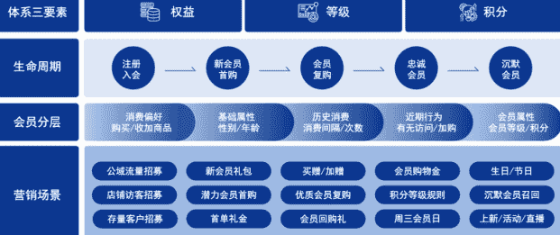

上图会员搭建的框架。

会员的搭建不是一两句就能讲清楚的，会员商城页面的视觉设计、会员等级设置、积分兑换等等。

在这里简单描述一下，我们是会员生命周期大概是怎么做的。

新会员入会和首购：1. 可以通过平台的工具入会立减 2. 主图的展示、详情页的展示 3. 包裹卡 4. 客服的引导 5. 短信触达。

#### KANS 韩束
#### 月满人团圆 美礼焕新颜
品质国货红蛮腰 至高到手20件
敏肌 安心可用
全网累计销售100亿+
中秋献礼，一次带走超9件正装量
赠4件正装+10支亮白棒+红蛮腰洁面60g
会员专属加赠
会员实付满439元加赠
预估到手价 ¥399
下拉入会 解锁会员限时礼遇
宝贝 评价 详情 推荐

#### 加入会员 享限时礼遇
充值购物金限时低至9.3折
会员专享
充值520得 立即充值>
¥ 550

#### 进直播间 享3重专属礼遇
¥666 免单
666全额免单
锦鲤福袋
专属满赠

#### 会员享专属礼遇
6.9元爆款尝鲜
满439元赠
不顶部
距中秋季,新风潮,家装节开始剩1天23小时
领300元

金牌客服|服务水平超99%店铺
2024年11月21日 18:39
ys丰颖福
尊敬的V3会员，欢迎您光临本店
+ ☆韩束官方旗舰店
+ ☆为年轻提供一份底气
+ 自用送礼甄选
+ 重磅新品×肽霜
+ 免费入会享更多
+ 充购物金享87折
1月6日 13:10
yc梁国栋

#### 会员买赠
今晚8点年货节开售,会员买1享n
>充值购物金省更多,囤货超值
>参与会员挑战计划抢499元臻礼
【会员专属加赠】丁禹...
满1件即可获得
1条新消息
【新年礼物】韩束白蛮...
销量10万+
评价客服
自助服务
购物金折上折
美白

10684444170478899367
信息·短信
9月3日 周三 18:22
【歪马送酒】送酒福利!免费领歪马原浆精酿1L,立享i.meituan.com/c/YjgwN2E2Mjkt惊喜,拒收请回复R

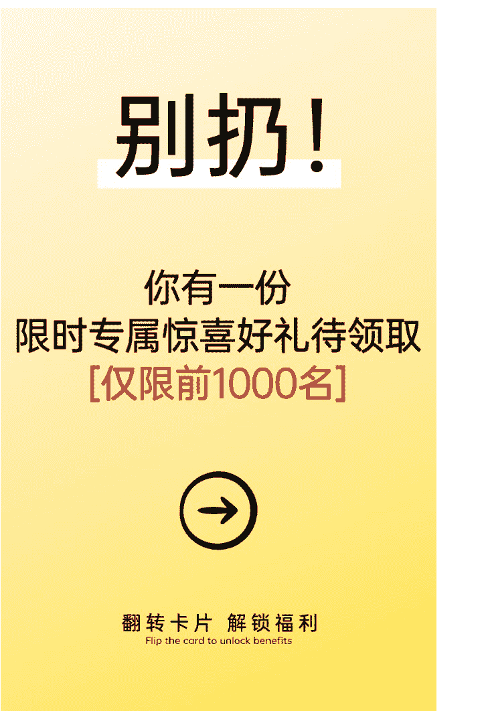

我们测试过：当消费者购买之后，但是没有入会，立刻发送短信引导入会（无需手动插件可以自己实现），流转率很高。“亲，这边看到你下单了某商品，现在点击入会即可 0 元再享受 xx 权益，随单发出哦，点此直达”。

会员的复购和沉默召回：1. 对老客和流失人群触达到 2. 权益足够 3. 行为交互。

#### 1-触达
首先我们利用 CRM 插件对会员的老客人群进行圈选，一般根据复购周期，圈选近 120 天购买过一次的老客、近 30 天已购的用户，利用短信进行精细化触达。

同样付费工具通过达摩盘（平台分析工具）对同样的人群进行触达，这样短信和付费工具都能对老客和沉默客户进行多次触达。

#### 2-权益
我们对老客复购给出的权益为，复购礼金和复购加赠。

对沉默流失的客户我们测试过之后，还是上来直接半折比较有效。

#### 3-行为交互
我们会在会员商城设置会员签到获得积分、抽奖、积分兑换产品、调查问卷类似的与消费者产生交互的玩法，以增加会员活跃度，减少沉默和流失。

#### 小 Tip：
- 1. 如果可以做购物金的，非常建议去做。
- 2. 调查问卷非常实用，它给我们在货品策略调整、赠品上有非常实质性的建议，多跟用户沟通！
- 3. 有些本来就有多会员权益，可以在详情页做个跳转专栏，以“折上折”的文案再次表达出来，这样消费者会有占便宜的心理，增加转化率。

#### 给大家引入一个模型：RFM 客户管理模型
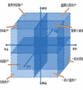

| 人群名字 | 花费 | ROI | CPC |
| :--- | :--- | :--- | :--- |
| 90至180天老客复购超期人群 | 24,840 | 2.64 | 3.85 |
| 30至90天老客复购超期人群 | 19,980 | 2.32 | 3.77 |
| 365至720天老客复购超期人群 | 13,306 | 2.70 | 4.24 |
| 180至365天老客复购超期人群 | 7,464 | 1.76 | 3.22 |
| 30天老客复购超期人群 | 7,116 | 1.91 | 4.22 |

| 分组区分 | 目标客户 | 短信成本 | 成交金额 | ROI |
| :--- | :--- | :--- | :--- | :--- |
| F>2,m>120,90-180天 | 6904 | 207 | 28439 | 173 |
| F>2,M>120,30-90天 | 5435 | 163 | 21350 | 167 |
| 流失客户-F≥2，360-720天aux>25 | 11487 | 345 | 5921 | 20 |
| 15-90天已逛样衣购买人群 | 12191 | 366 | 7956 | 28 |
| F>2,m>50,180-360 | 871 | 26 | 443 | 17 |
| F>2,m>50,360-720 | 5474 | 164 | 3595 | 22 |
| 会员复购人群（付款次数>2） | 17049 | 511 | 4735 | 9 |

当预算有限的时候，我们只能把人群划分得更精准，如上图有些人群的 ROI 能做到 173。

那什么是 RFM 呢？我这边简单说一下，详细的大家可以问下 AI 或者小红书。

- R 是消费者购买的间隔时间
- F 是消费者购买的频次
- M 是消费者购买的金额

以三个维度就可以给用户进行分层，哪些是我们优先要进行触达和留存的客户，我们以哪些权益进行触达。

| 类型 | R (越低越好) | F (越高越好) | M (越大越好) | 特征 |
|---|---|---|---|---|
| 重要价值顾客 | 低 | 高 | 高 | 优质顾客、提高顾客满意度，以便增加留存 |
| 重要保持顾客 | 高 | 高 | 高 | 最近未购买，需要做触达，以防流失 |
| 重要发展顾客 | 低 | 低 | 高 | 需要挖掘顾客特征、提高购买频率 |
| 重要挽留 | 高 | 低 | 高 | 潜在有价值顾客，需要重点挽留 |
| 潜力顾客 | 低 | 高 | 低 | 有潜力发展成优质顾客，消费升级 |
| 新客有推广价值 | 低 | 低 | 低 | 新客有推广价值 |
| 一般维持顾客 | 高 | 高 | 低 | 一般维持、需要深挖特征（品类交叉等） |
| 流失 | 高 | 低 | 低 | 最近无交易、且频率、交易金额较低相当于流失 |

### 4.2 内容营销，站内拓展人群资产的好渠道
2023 年，天猫平台受不了抖音短视频平台的猛攻，也在商家群里开始主推站内的短视频，一个是商家自制短视频，一个是站内平台的逛逛达人种草短视频。

结合上文说的算法，短视频是很容易就跟消费者产生用户行为的，从此给品牌带来人群资产。

内容是用来种草和拓展人群资产的，属于前段链路，后续我们还是要思考如何进行人群的流转的，从 A 人群到 P 人群。

关注 推荐 闪购 外卖 国补 飞猪 百亿加补 穿搭
连帽外套 刚看过 搜索
天猫 这手感真舒服啊~Jelly
¥259 已售3000+

天猫【田栩宁同款】韩束金
抗皱面膜好评榜·第5名
¥73.79 全网热销1万+

天猫 奥康男鞋春夏季英伦时
早秋上新 首单补贴28元
¥234.2 首单价 已售2万+

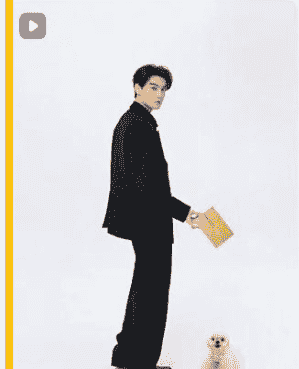

FLLM
YUZI 鱼子百搭显瘦连帽牛
原创新品 秋上新42件
¥228 券后价 上新4天

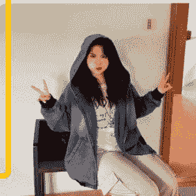

BELLE 早秋上新
88VIP 距中秋季,新风潮,家装节开始剩1天22小时 领300元

视频 消息 购物车 我的淘宝

韩束天猫官方
+关注
具体价格和赠品以直播间展示为准
这个素颜让我亮到反光
> 热评 "姐妹们，用起来油不油呀🥺" 7条回复
天猫 【中秋礼物】 韩束X肽光子精华紧 详情 >
¥ 439 已售3000+
回头客超100万的好店
加入购物车
立即购买

逛黄金

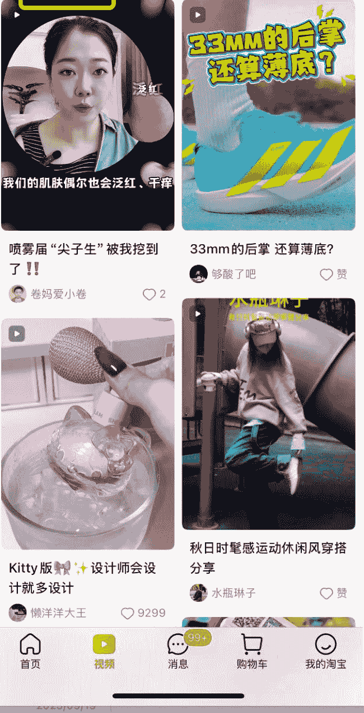

喷雾届“尖子生”被我挖到了!!
33mm的后掌 还算薄底?
Kitty版🎀✨设计师会设计就多设计
秋日时髦感运动休闲风穿搭分享
自制短视频：我们结合AI剪辑+人的形式，以量为主，提升效率

能传达的经验就是：要记住人群，内容，货品的匹配，也就是你要明白你产品的用户是谁，什么样的标签，是学生，是宝妈，还是职场人，她会在出现在哪个场景里，在这场景里会遇到什么问题，产品如何解决问题。

### 4.3 活动营销，促销打折不可避免，做跃层的好机会
一直以来，买卖东西都是跟活动促销离不开的。

从人群的角度给大家说一下，为什么要好好的做活动，尤其是 618 和双 11。我们在做竞店销售额和人群分析的时候发现：

一个好的活动爆发会带来人群资产的波动上升。TOP，抖音的大厂直播也是同样的原理。

人群资产会形成上下波浪，波浪的波峰就是活动爆发的时候，波谷回落的时候会比上一次的波谷高，当然这取决于是否对此次活动带来的人群资产好好运营。

大促活动也是赶超同层竞店的机会，此期间会产生品类和跨品类的拉新、竞品人群的抢夺、老客的唤醒留存。

#### 那么如何做好一次活动营销呢？
- 1. 做好蓄水，尤其是大促，一定要提前蓄水。
- 2. 做好活动玩法策划，尤其是前四小时的爆发，大促的前四小时的权重分配逻辑是赛马制的。
- 3. 做好活动期间的维护，避免出错，造成损失。

做好蓄水：大促活动一般都会提前一个月进行蓄水，这时候要提前做好规划表，对接给各个部门。

需要市场部对接抖音达人、小红书达人多少；需要逛逛达人多少，需要自制短视频多少，平台资源；对老客户的短信触达要定时到什么时候发送。提前沟通达人的排期，这时候达人这边可以沟通给一些秒杀单品，提前做预热。

视觉怎么表达：主图、首页、详情页、会员页。这里有个小技巧：可以按照生意参谋-商品-商品排行，以商品访客数往下排。序，会看到一些访客多但是销售额很少的链接，这些链接虽然不怎么卖货，但是访客很多，不要浪费这些访客，在主图和附图和详情页上都装修上相关的玩法，做好二级页的跳转和商品关联。

#### 活动玩法策划：活动玩法策划的好不好关系到活动期爆发的系数高不高

我们会把产品进行分类，有一些低客单产品我们会做前N小时秒杀，前N小时半价，来做引流，高客单和爆款链接会做前N加赠的形式，这样可以把爆发集中开始的前4小时内。

活动也是一个给店内新产品做连带的好机会，可以做满三免一，类似这样的活动，提高新产品的销售。

当不知道怎么做活动玩法策划时，建议大家多看看大厂，比如瑞幸，蜜雪冰城，美团等等。

#### 给大家分享一个表格：活动收集库，思维枯竭的时候看它！

| 时间 | 节日 | 活动玩法 | 说明 | 规则详情 |
| :--- | :--- | :--- | :--- | :--- |
| 2025/2/12 | 元宵节 | 1. 限定爆品可用，将爆品8折券 2. 10000免单券 | | 若该场次免单库存未抢完，则可拍到免单券1张；若该场次免单券库存抢完，则拍到保底优惠券1张（以活动页面满200可用）。用户每场仅可领取一次奖品，每场奖品库存独立，免单券如当日未发完则清零，不会顺延至下一场。 5. 其他规则： (1) 活动期间，如发现有用用户通过不正当手段（包括但不限于侵犯第三人合法权益、作弊、扰乱系统、实施网络攻击、恶意套现、非法注册、用非法注册激活账号、用机器假借客户骗取参加该活动而有其他用户公平参加本次活动或有违反活动的禁止行为），活动主办方有权取消该用户优惠资格或取消、退回该用户通过参加该活动所获优惠。如该不正当行为给活动主办方造成损失的，活动主办方保留对该用户追究法律责任的权利。 本活动遵循公平公正公开原则。活动期间，任何用户不得使用任何装置、软件或程序干预或试图干预活动主办方的平台... |

#### 活动期间的维护和复盘

活动期间的维护这里要讲一下的原因是，我们当时因为活动开始后，价格检查的不精细，直接一些价格设置错误，造成了损失，虽然不多，但电商运营是需要非常严谨的，总有一堆羊毛党盯着你，只要出现稍微一点错误，立马就会蜂拥而至！

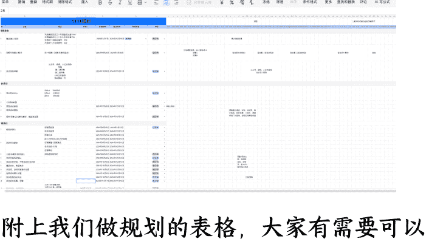

附上我们做规划的表格，大家有需要可以私聊我。

## 4.4 全域推广，小红书，微博，抖音站外推广还是得要

#### 小红书达人种草

今年做淘系和小红书的不知道大家有没有听说过“红万”计划的，简单来讲，就是现在小红书的笔记下挂天猫的商品，可以直接进行跳转了，大大减少了消费者从小红书种草之后，还要再打开天猫搜索的行为链路。

天猫没有抖音自身那么强大的内容种草支撑，就只能把小红书作为种草的后花园，联合破局。

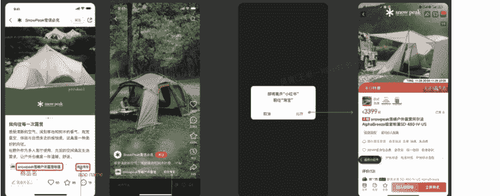

这表明，天猫的做品牌的商家已经不能单单只靠以前那种站内的玩法，现在需要全域联合。

在最初22年的时候，公司做了一段时间的小红书推广，但因为不能立刻带来销售额的成交，所以给暂停了。

但现在这个时候，又再次看到了小红书种草这条路。

因为品牌在小预算的情况下，请不起明星代言，小红书既能种草又能带来销售额，是比较划算的一条路。

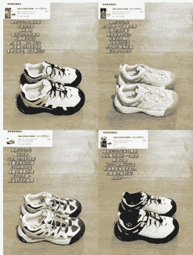

为啥看小红书上的
人对骆驼都
不屑一顾，但是
登山的时候看穿的
都是骆驼

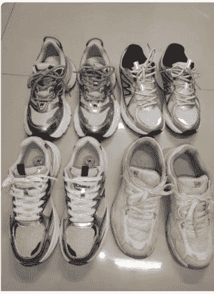

为啥看小红书上的
人对骆驼
都不屑一顾，但是登山的...

饭饱宝
09-03
长期主义 | 🍂秋冬登山鞋分享 国庆出游必备 hello...

158的小朱吖
3天前

骆驼到底有没有好穿的鞋
啊！！！先说一下...

春和（马上回来）
03-24

秋冬运动装备 | 谁说功能与
颜值不能并存？ 颜值性...

月野兔 Yue
4天前

而且小红书种草通过平台淘宝星河的星任务后台是可以看到种草数据的，这样对品牌来讲，就有数据可依，也可以对这部分种草和成交的人进行人群画像分析，针对转化率和种草人群方向进行优化和修正，种草人群数据又可以再通过达摩盘进行二次圈选，在站内的付费工具进行二次触达。

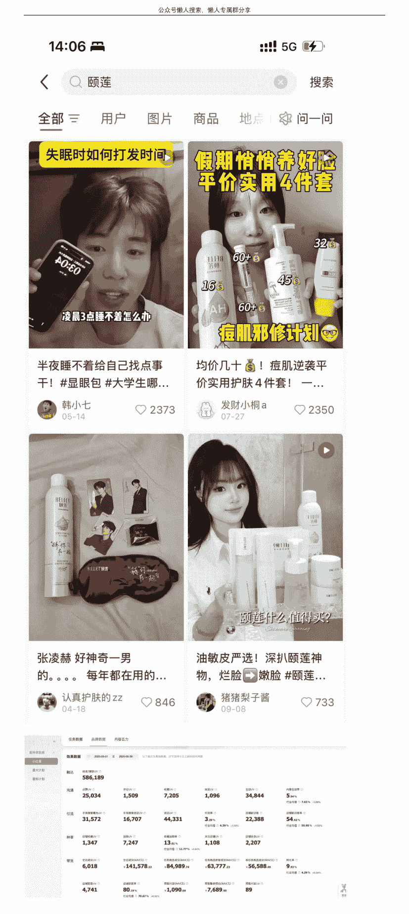

#### 微博达人种草

这个合作形式是：给机构沟通好要达成的保量的销售额，然后在淘宝后台创建任务，然后机构找微博的达人在微博发文+在私域群里进行宣传，完成沟通的销售额。

这个的好处就是，走的是淘宝的后台，所以不用签合同那么麻烦，计算周期是30天的售后销售额，完不成的目标和退款的金额，会按照比例退回店铺账户上，减少资金风险。

4
184
1136
置顶
新微博 2 条
V4 助威
留言
通知
推荐
+ 关注

14:31
鱿鱼 iouu
动态 微博 视频 相册
鱿鱼 iouu
6-6 来自微博 weibo.com

和HBN全品团来啦 备注【鱿鱼】有额外赠品‼️ 旗舰店下单才是最稳妥的! 除了大促价格好, 他家送小样真的非常大方! 适合大家带出门用! 😋

评/👍里两位各送一组中样试试
...全文

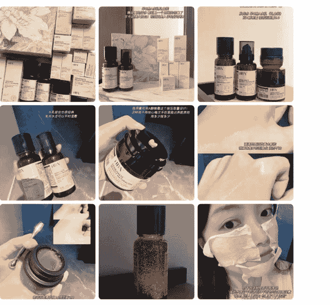

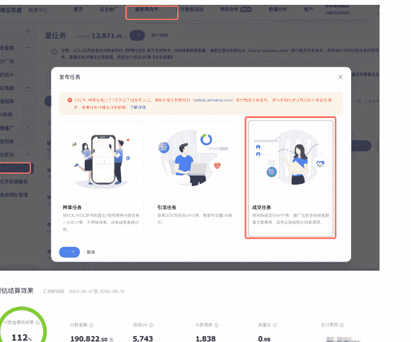

预估结算效果
112%
190,822.50元
5,743
1,838
0.98
2,000.00元
40/45

不过这个以目前合作经验来讲，会有一些黄牛混入进来，但还是真实的销售额，不会过了30天给你退款，加上很多大牌也都在做这个东西，所以大家仁者见仁，根据自己需求进行参考。

我们在100w往200w做增长的时候，小红书达人种草和微博达人种草确实有很大的一部分助力！

## 另小建议

当店铺的销售额达到一定程度的时候，事情比较多的时候，要解放人员的精力，用AI或者影刀工具来代替日常数据的采集，因为运营助理每天要采集各类数据，竞品图，竞品数据，店铺数据，货品数据等等。我们当时就联系一个程序员写了一个影刀小程序，花小钱办大事，节约助理每天至少半个小时的时间。

还有上文提到的AI剪辑，直接可以进行视频脚本的拆解和混剪，可以减少我们剪辑和编导的大量时间，把精力放在质量和创新上。

### 至此我们完成了月 100-200w 的突破！

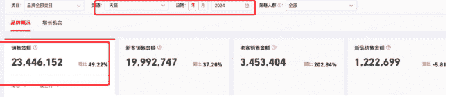

### 年销售额完成从21年的年50w到24年2344w的增长

## 五、总结：底层逻辑复盘

上面就是我从0-1，从50w到2344w的简要历程，一个店铺从几十万到几千万，不是一个人就能完成的，尤其是做品牌的，品牌的定位，产品的定位里面需要市场和团队各个部门人员的配合，里面经历了很多很多，有很多比较细节的东西，不是简单的一篇文章就能描述完的。但是从大的框架来看，就是人货场，货没问题，给有需求的人解决问题，在对应的场域里以正确的视觉和文案表达出来。

下面为大概的品牌发展阶段，大家可做参考，具体可根据自身情况。

### 3.1 品牌发展阶段和策略

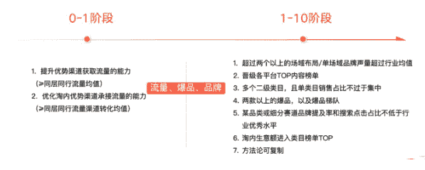

#### 阶段性核心策略

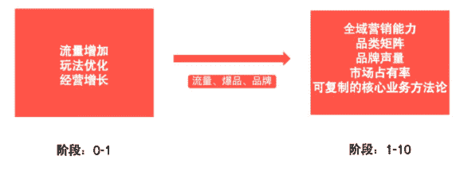

### 3.2 心得一二

- 1. 没有资金或小资金的白牌刚开始起步时，要的是确定性，尽可能的不亏损的情况下，把货先卖出去，这时候不要讲究什么视觉的调性，没有品牌感，先生存，积累已购客户的基本种子池。
- 2. 刚起步没预算做营销的时候，直播卖货达人是个不错的选择，种草+成交，前期找纯佣金和保量主播去合作，不亏的情况下都能做，因为是起步阶段，等发展起来，品牌有声量了之后，再把佣金压下来。然后把重心转到自营上，因为达人不可控，自营才是把命运把握在自己手里。
- 3. 预算有限，人员有限，精力有限，建议采用大单品策略，把一个品打爆再带动其他品动销，比如：东鹏特饮，可口可乐。
- 4. 盯紧你的竞品，每天看竞品在渠道，货品，价格，活动上有没有新动作，及时跟进。
- 5. 除了本类目的TOP品牌，也可以看看其他类目，有时会给你提供别样的思考。
- 6. 在管理团队时候做好梯队培养，不然有人离职，会很浪费时间，梯队培养：把技能和工作流程标准化，建立运营知识库。
- 7. 一个天猫运营团队基本的三架马车：运营+内容+推广。
- 8. 一个好的产品是最基础的，要多做问卷调查给客户沟通，会得到意想不到的反馈。
- 9. 不建议刷单，因为现在平台算法更厉害了，其次刷单的人的账户打上的标签不精准。

### 3.3 问题汇总

这是我第一次做分享，也是受到了生财平台和大家伙的影响，才下定决心，把自己的经验写出来，分享出来。

大家有什么电商相关的问题，可以发出来，我会酌情根据复杂程度，尽量把问题给大家解答一下，因为很复杂的问题不是一两句就能回复的，大家见谅！

最后，安利小懒的付费群：

懒人专属群（介绍）

📚 懒人专属群持续更新中，已持续运营 6 年，整理超 3000 份各类精选付费文章 & 年费社群干货，全部开放下载。

本资料为付费群内部分享，仅供真实有需要的朋友查阅 🤫

懒人专属群更新记录：

https://lazy2025.top/blog/record2

懒人专属群更新记录（需梯子，备用）：

https://lazybook.fun/blog/record2