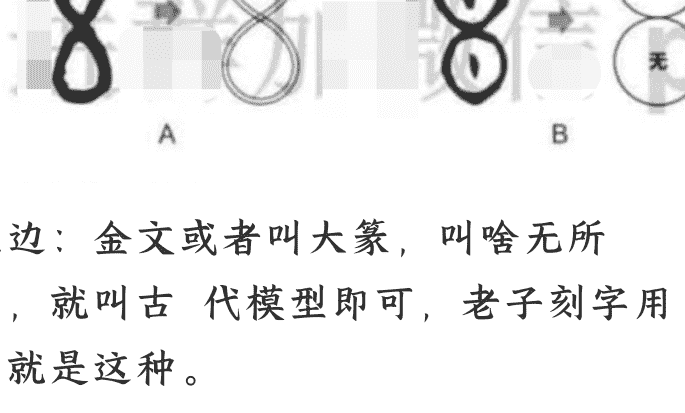
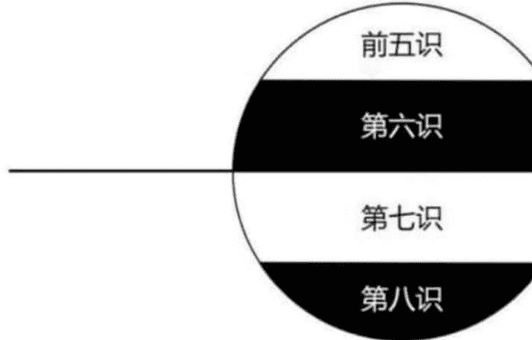
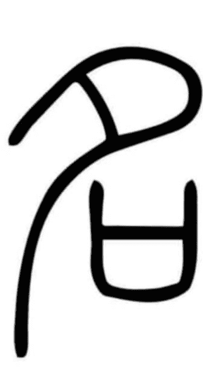
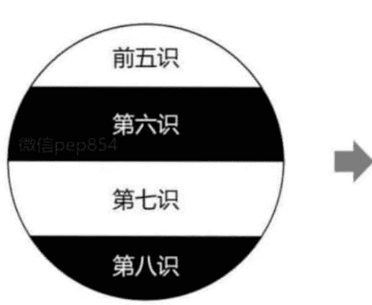
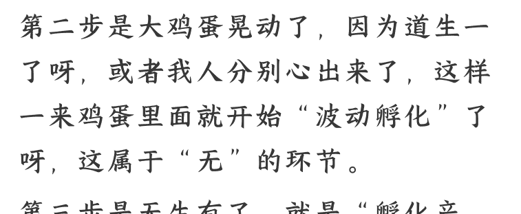

公众号懒人搜索，懒人专属群分享

# 三眼精解：道德经第一章！

250928 第三只眼观

整理：公众号懒人搜索，懒人专属群独享

懒人微信：lazyhelper

敲点市面上看不着的...

什么叫精解？

就是一个字一个字的模型式精解，每一字就像一段小电影，串起来才能看到导演（即老子本义）!

为啥?

老子刻的是大篆，就跟PPT画图或制作短片似的，每个用字都是独立逻辑。

与现代话不一样，道德经作为《经》来说，不能随意加个字、改个字组词大法呀，必定歪曲。 所以与主流解读肯定是不一样的..

例如:

第一句翻译成，可以言说的道，就不是恒常的道了。

这100%是错误的!

当然你非要这么理解，那倒也不耽误啥大事..

谁告诉你“可”要组词“可以”了?
那我说组词“可能”行不行呢?

例如：

万物，这是两个字，不是一个词！ 万=现量的层面；
物=现相的层面。

诸多“有名”之存在，正是“现量”与“现相”所构成。

但随着后世用法，逐渐就变成一个词了，也逐渐不认字了，人们就不知道老子本义了..

老头刻篆是一刀刀的，不是我们键盘随手敲个词成本这么低。

成本越高=刻录小电影越精微！

之前文章中，诸如可、非、常、无、有等中文模型都解读过，铺垫完了该到了串成“大场景”这步了，就会浮现出一个老子思想观的根本框架。

其实就是——玄学。

第一章是最重要的，有了此框架后，再看全经就有“俯瞰视角”了。

总之，会让你重新认识道德经，说明一下：

在第一章中有一段话本篇暂时不解，就是标红字的那段。

> 道可道，非常道。 名可名，非常名。

> 无名，天地之始。有名，万物之母。

> 故常，无欲以观其妙。常，有欲以观其徼。 此两者同出而异名，同谓之玄。

玄之又玄，众妙之门。 为啥？

因为这段属于“内观”修行方式，现在聊这个没啥用。

所谓：理不通，事不通，直接聊事会晕乎、例如：

无欲以观其妙——换成佛家就是中观派修行方式（空派）
有欲以观其徼——换成佛家就是唯识派修行方式（有派）

佛法就是玄学哟，只不过学术上不能这么下定义罢了..

在搞清楚玄思维，再聊万法唯识的时候，才能搞清楚是什么。

先获得老子的整体框架才是要紧事！

为了增加阅读感，将《道德经》和《盘古开天》合在一起聊，这俩一回事，但是后者作为故事更带感..

例如：盘古用“非常”把“可”给劈开了，这不就带感了嘛！

开始正文！ 首先，

问：在第一章中最后落脚点在哪？

答：玄之又玄，或者简单一个字——玄！

不然为何叫玄学？

玄学可不是神叨叨的东西呀，而是一种高级认识论。

啥意思呢？

第一章的逻辑最终落脚在玄上，意味着玄=果！

所以：

## 玄=老子观世界后的完整观察结果，或者叫根本范式!

由此产生出——玄学!

所以先把“玄的愣”和“玄幻”那些破词甩掉，要进入理性认识..

然后:

佛家有个词叫“正果”对吧?

之前文章讲过“正”的模型，正=足=圆，这里不细抠了、

所以:

正果=圆满的、圆融的、思维周全的结果。

那么老子结出“玄”这一正果，是什么范式的呢?

当然就是中文模型——玄。

左边:金文或者叫大篆，叫啥无所谓，就叫古代模型即可，老子刻字用的就是这种。

右边:画成现代模型，分别是宏观理解、中观理解、微观应用。

啥意思呢?

- A 图——此两者同出而异名。（宏观）
- B 图——有无同谓之玄。（中观）
- C 图——玄之又玄，众妙之门。（微观）

通过以上模型，先有个大体思维场景！

那有的人就有疑问了：哎呀这不就是阴阳吗？ 答：阴阳属于思维，有无互玄属于范式！

啥意思呢？

古人讲一阴一阳之谓道，翻译过来就是，阴阳是表达道的最基本思维。

但是你要具体观察事物，不能一直阴阳阴阳这样子呀，仅靠思维不行对吧？

而是要在思维里代入进内容范式，这样才能开始进入现象界！

通俗说，就好比利用思维造个“模子”出来，然后用“模子”去观察世界..

例如：

中医的思维是阴阳的，但范式是木火土金水、风寒暑湿燥火啥的，只有思维变成某种范式了，才能进一步介入现相！

对了，再插一嘴，下面这种图是没什么用的...

## 为啥呢？

无论从天文物理角度讲，还是从观察人事物现相讲，这个图都派不上用场。

它更像是“logo”的作用，主打一个好看、微观（C图）应用举个例子，带带感、

应用=画格子越来越细。

之前在星球聊了一些唯识宗的东西，它就是玄学的一个微观应用，对于了解人性、观察人的起心动念、生命流转等等，是最好的课件，对于人生来说也是非常重中之重的一课。

而八识模型就是玄模型，如下图：

当能够以玄范式去解读，那么《八识》就很好切入理解了，你要是就读经看字，那是很难啃的动的、

当然这只是个基础框架，如果深入进去，此图越来越微观复杂化。

那么好了，通过上面表述，大体对“玄”有个模糊认识了。

问：玄怎么来的？

答：那就得从“道可道”开始说起了，与《盘古开天》一起聊啊..

其中言：

天地浑沌如鸡子，盘古生其中。

万八千岁，天地开辟，阳清为天，阴浊为地。

天日高一丈，地日厚一丈，盘古日长一丈，如此万八千岁、

不要小瞧这些民俗神话，神话就是智者圣人将逻辑形象化表达，这样才能被广泛听懂。

要是把其中的逻辑很高端的哲学化的讲出来，那就是《楞严经》了，所谓自从一读楞严后，不读人间糟粕书。但是楞严给很多人看，就跟看乱码差不多、

回到盘古开天：浑沌=道的逻辑表达；鸡子=道的形象表达。就是大鸡蛋的意思，这样老百姓一听就带感了呀，道就是个大鸡蛋啊原来..

什么浑沌逻辑呢？它已经没法再大了，一切都是它，所以逻辑上它就是它自己。是不是听起来不像人话？

对头！浑沌状态就是用人话说不出来的呀，人话是有天花板的..

问：那老子怎么尽量表达其逻辑呢？

答：道可道，非常道。

错误翻译：应该叫肤浅翻译，能够说出来的道，就不是恒常的道了。当然你非要这么解读也不耽误事，但这没有什么意义呀、

这就好像我们平常讲话没法表达时候，就会说 “太牛逼”了！

问：怎么个牛逼啊？

答：说不出来、

反之，当你能说出来具体怎么牛逼的时候，你就不局限于只会哇哇牛逼乱叫了，没那个闲工夫和情绪化了..

这是感性。

而读老子一定要找到“冰冷理性”的调调才行!

本来我人是道心，是佛性圆明的，是本自具足的，但由于盘古这个“劈匠”生在其中，正如我人的分别心生出，所以就要把“道”给劈开了呀。

问：老子《道德经》是不是也这样劈开？

答：对头..

因为我人只能接受“劈开”的东西，为啥？

因为劈开=人类语言名相的天花板，这个后面聊到“名”就知道咋回事了..

所以老子必然会想办法“如何劈得巧妙”啊，以便对我们言传呀！

啥叫分别心呢？

这个一般理解都是错误的！

心 ≠ 心理，即人的主观意识，佛家唯心 ≠ 西方主观唯心论。

要这么错误理解就完蛋了.. 例如：

一坨屎 VS 一碗饭，你知道哪个能吃VS 哪个不能吃，这不叫分别心，这叫主观区别。

分别是啥？

是你分离出一个“能区别的主观”与“屎饭的客观”出来，只有分别心一动，你与屎饭才能同时存在着，这个过程就叫做“相”呀！

当然，这么简单说肯定是不好理解的，这种认知模式虽然 2500 年前，但放到现在也太超前了，需要回头敲八识法相时候才能深入理解..

这里“粗”着知道这个存在逻辑即可，提升是由粗入“细”的嘛。

所以，佛家说我们为啥不能见道？因为我们分别心太重了，在八识中来讲，即我人第七识+第六识的作用。

所以修行捷径叫：六七因上转，五八果上圆。 总之它给我人造成——业障。

简单理解的话，就是认知上的一种障碍，就跟隔着墨镜看世界，世界就被遮盖了，就呈现出“五蕴”了，谐音梗乌云、

所以，我们就无法如实的看到浑沌是什么，只能以人类思维模式去看！啥意思呢？

就是我们无法看到“道可道”啊，只能看到“非常道”呀。非常=老子把“可”给劈开运行了呀！

或者反过来说：

正是由于我们只能看到分别视角，所以为了见道，我们才要“对立达到统一”呀！

无论是人类，还是人类思想，统一才是终极目的。因为我们共用着同一个道、同一个佛性、同一个阿陀那识呀。

所以叫“同道”嘛，slogan 改一下：同一个大道，同一个梦想..

以上换成道家原装语境： 心就是一！

盘古生其中=老子的道生一。

而这个一运行起来了=盘古“劈”浑沌了。 所以：

当这个一不动的时候，就是——浑沌。（道可道，一回归道）

当这个一扰动的时候，就是——分别。（非常道，一生二了）

人活着就在浑沌与分别之间，所以老子叫——守中抱一！

然后“非常道”的下一步呢？

名可名，非常名。

啥叫名呢？

简单理解的话，就是我人精神活动的意思。

之前也画过这个模型，这里还得抠一下，因为特别重要。

名的模型=两个口：

啥意思呢？

就是当浑沌之圆劈开后，为了再次“统一归圆”就致使：其中一个口寻找另一个口。

干吗？

当然是——搞对接！

然后再结合上面的《八识玄模型》来看：

上面的口=我人的前五识+第六识。下面的口=我人的第七识+第八识。

所以我人的精神活动是啥？

就是不断地利用上半圆“造相”着，即不断“思想”着，以此来探求更深层次的存在，即探求下半圆，这个归圆的运动过程就是精神活动。

中文模型是非常妙的，“名”甩“name”一百条街..

当然，有人就会问，为啥上面的口模型要尾巴朝左下？这是代表阳动定位，这个先不用细抠，先了解大略再研究细节，这些细节捎带手就懂了。

例如：

我人都特喜欢——自由！

这是刻在骨子里的，为啥？

因为自由不是“随便干”的意思，而是在精神思想上不断探求，最后达成上下圆的“统一归圆”之后，就得到了“自由自在”的体证感受！

反之就叫做——空虚迷茫。

所以自由是——归于自体！

这才是真自由，而市面上的自由属于忽悠人的 政治 营销策略..

那么好了，回到“名可名”这句话。啥意思呢？

道本来就是“名可名”的呀！

道是自由自在、无所不在的，一切都是它，无论物质或精神，道都是一体浑沌的呀，所以道当然是“自可”和“自名”着自己呀..

把道人格化描述的话：它有着完全的物质自由和精神自由。

但是对于我们人类呢？

由于我们的“分别心”或者叫“一动”的缘故，即以我人的精神活动特性，当去观察道的时候，自然就会“非常名”了呀！

非常又把可给劈开了，好家伙..

通俗点说，就是我们人的思维去定义道的时候，就会“劈开”来定义了。

所以老子后面紧跟着：

无名，天地之始；有名，万物之母。

这是不是就劈开定义了？

因为不掰开也没法说道啊，因为我们锁在人类的精神活动里了呀！

所以“无和有”都是我人“非常名”出来的呀，这只是人类对道的分类，人家“道”才没有这种分类呢，略略略噗呲、

始和母可不能当做“最初的”和“母亲”来理解呀！

这俩模型先不细抠，本篇暂时不需要这俩的细致逻辑，简单说是啥呢？

始——无之运行的基础原理。

母——有之运行的基础原理。

当然这么说你可能不带感，带感点描述？

始，就是分散着收拢着波动着。

母，就是其内部波动成形了。

额.反正后面就知道了、

劈开而存在。例如：

之前举过的典型例子，水是 H2o 吗？

不是！

H2o 是我人分别心给定义出来的，分别心即使用，即任何使用都是从精神活动来的，科学不是吗？离开数学和哲学会科学吗？

即：先要名它，才能使它！

所以 H2o 是“使用即存在”出来的，

而真正的水是什么？

我们压根就不知道，从来没有搞清楚过，正如我们从未“见道”过..

所以我们一直活在或者说认知在“我们的使用”当中，而“如实存在”到底啥样我们根本就不知道！

这里插一嘴修行：

> 老子：吾所以有大患者，为吾有身，及吾无身，吾有何患。

啥意思呢？

我们复本归圆的修行过程中，自然就会分成：名归+道归。

所谓名归，就是指我人精神活动可以归圆了，这个相对来说比较简单..

注意是相对呀，要是单拿出来的话巨难，万中无一的人才能做到。

相对困难的是道归，即心物上都归于道！啥意思呢？

就是精神思想上通达了，只能算 20% 那块；

真正难的是身体力行上合于道，例如春天要踏青秋天要养膘，这种合于道只是一根毛.

换成佛家语境：人无我+法无我。

法无我就是精神上无我了，这个相对简单..

但是人无我可就太难了，需要去除掉“身见”呀，胳膊啥的都无我掉！

可不是“感觉没有了的”意思呀，那去医院做个全麻就行，或者成本低点来一箱茅台干吹、

总之修行大概这么个意思。

那么好了，盘古劈浑沌完事了，就要进入第二步了吧？

劈开出啥了？

你说当然是阴阳啊..

上面敲过了，阴阳属于思维，严格讲属于物理思维，还是直观层面的，只不过后来应用代入面广了。

在老子这里，辟开的是——有无互玄的范式！

咱们先说——无。

为啥？ 因为：无生有！

什么是无？

无可不是“没有”的意思呀，现在老多专家大师都这么理解，看着可难受了..

没有一词出现于近代，这是个错误词汇，因为它会导致——断灭见！

断灭见啥意思呢？

就是分段思维，当看到这一段，那么其它段就灭了，这是错误知见。

世界上压根就没有“没有”这个存在状态，物质、能量、信息不灭定律啊，真要能找到个“没有”的存在状态，那可就真牛逼坏了..

只不过我们习惯这种断灭语境了，大白话时候不这么讲还不行，就跟到天不仁当做天地没有仁爱的意思，都成为习惯语境了，不这么跟着说反倒不牛逼了。

总之吧，古人可没有“没有”这种断灭见的词汇，古人都是单字的。

例如：庄子：圣人无功。

错解：圣人没有功劳。

正解：圣人的功劳你看不见，道家叫积阴德，在《阴符经》就叫做阴符。

所以无=看不见的运行层面!

看不见可不是啥都没有，是有运行的..

为了贴近现代话带感一点，就以物理视角切入，把这种运行叫做——波动。

然后接上面《盘古开天》的故事：

当盘古劈开浑沌后，我们的“一”就开始波动了呀，动了就是劈开了、

可不是“心理波动”呀，因为这时候的“我们”还没有主观意识呢，或者说还没有“我”出现呢，往后边聊就知道了。

问：怎么波动呢？

答：恒转的、均匀的、无所不在的波动着。模型如下：

## 这个模型不用细抠了吧？

因为直观去看就是上面的定义意思了呀，上半部恒转，下半部波动转化。下面像“几”似的模型，代表——转化。

诸如一、乙、厶、已、几等等，其实都是一的不同波动形态，这个回头再细抠。

## 这里提一嘴要表达啥？

即：无=让浑沌之圆动起来后（一的几波动形态），匀均地在恒转。

所以万物的存在背后，都有“无”在工作着，不然万物就无法“转化而存”了呀。

例如：

你家苹果变质了，这是转化了吧？

如果苹果不能变质，那么苹果就无法存在了，即一切存在都是运动转化着的，所以不变质就不存在了呀。

那么为啥能够变质转化呢？

你说是因为化学作用，再深入就是物理的力作用。

那么力是从哪里来的呢？

没有答案了，因为这压根就不是“描述因”而是“描述果”啊：力是物体之间相互作用产生的。

即：苹果变质因为力，力因为苹果变质而发生、

所以“力”是在解释现相，它并不能找到成因，

等到了相对论时候，力是由于时空扭曲产生的。

那么时空扭曲的成因是什么呢？就这么一直抠根追问..

佛家是“究因”的学问：时间与空间从存在这件事上讲，它们都是幻有的。

幻有不是不存在的意思啊，而是它们没有自性，通俗点说就是，在它们存在之中不包含它们的成因，所以时空无法独立存在着..

所以爱因斯坦说，如果有一个能应如现代科学的，并能与之共存的，那必定是佛教。

结合上面逻辑，无怎么运行？

佛家：分别—分别—分别—分别这样子..

道家：一动——一动——一动——一动这样子..

这样不停波动，就“流动”起来了对吧？

所以道家叫做一气周流嘛！

对于这种流动，为了读者方便理解，就叫它——关系思维。

因为关系就是流动着的，不流动岂能有关系存在？

当然这又扯到“气”是什么，这里不扯远，简单说就是：气是玄范式搞应用代入用的。

就是把“玄”给越来越具体化了，从而进入现象界用于指导实践！

例如：

看到人精神活动上“生气”了，那不能叫“玄生”了呀，那还咋玩？

例如：

看到物理活动上“气味归经”了，那不能叫“玄味”吧？

简单理解：

气=玄应用的中介物。

玄是有无相生、非有非无的，那么气也如此，大概这么个意思。

所以上述简化看来：无=波动运行维度！

也就是道之浑沌波动了，或者大鸡蛋晃动了，下图这样。

在这个维度的运行作用，就叫“无为”！这才是正解！

而不是一会干点啥、不用干点啥、啥都不用干，是不是特搞笑？

死犟死犟的，就把这个“有无”就往“有没有”上面硬套，就陷入到文字相里面了..

所以玄学怎么“玄的愣”起来的？

就是啥学问都不做，然后自己想一出是一出，单凭现代话直译，硬往上套逻辑，最后就云里雾里的啦。

你也硬套，我也硬套，最后给老子套散架了。

所以无为可不是有没有干点啥的意思啊，方便理解的话，就是通过“这个维度”来干！

总之，这个晃动一直都在啊，只不过我们不开“慧眼”的话是很难看见的。

例如：

佛家叫戒定慧，开慧就是秃子们看事物与我们不一样，他们始终处在一个“隔着看”的认识场景之中，隔着“有”看到“无”的维度。

这个维度在佛家咋演绎？叫做——因缘法！

就好比我们看人=人靠衣装马靠鞍，而外科医生看人=行走的骨血肉。

人要提升认知，就是要学会如何隔着看..

然后就要“无生有”了对吧？

怎么生有的呢？

随着无的波动越来越剧烈，波动就要叠合了对吧？

叠合=量，量才能产生有，所以有=量显现出来了。

即为——现量！ 例如：

科学就是研究现量的呀，只不过锁定在“前五识”的现量里，佛道研究范畴要比科学大。

例如： 原子=量子现相。

即，原子是由量子不断震荡叠合，而显现出来的现相。

对于原子量子啥的，我们都无法直接看见，我们是通过理论观测（即计算量）而间接看见的。

因为可见光波的震荡要比原子大，当然“大”这个说法不严谨啊，方便理解了，就好比拿“黄豆”去观察“微尘”有多大一样，那是无法看见的。

而我们能够“看到”原子，是因为它能——现量。

能看到现量凭啥？当然是凭借精神活动啊，数学在那嘟嘟嘟计算呢呀。

对了，上面说佛道研究范畴>科学，有些人就不高兴了，就会认为：佛道比科学牛逼，牛逼你咋不造大飞机？

这种认知就属于弱智层次的。打个比方：

一幢大楼=对世界的整体认知。

当越往下面去，即越在现相层次，那么看街上的花花草草、车来车往就会特别“精密像素”了对吧？

当越往上面去，即通往超越现相的层次，那么再看大街上的一切，是不是“像素”越来越低了？但视线是不是也越通透了？

前者是聚焦于——外求（改造外物）。后者是聚焦于——内求（一切于内）。这俩冲突吗？

为啥非要谁比谁牛逼呢？

缺哪个都不是“一幢大楼”了呀？

你家生命体是“一条腿”走路的？

# 一瘸一拐的不难受？

然后这种“量”的堆叠，就产生了：物质世界+精神世界=有！

啥意思呢？一定要打破“实有”观，现代物理学已经打破了，验证了佛道的理论是正确的。

物质实有观：就是物质是由“一粒粒小实有”所构成的，而其实更深层次去看，所谓粒子就是波动。当然，原来的实有观也不能丢掉，就产生了：波粒二重性。

精神实有观：就是精神能够独立存在，正是这个认知错误导致人们“神叨叨”的啦，例如有灵魂去投胎啥的，有个“我的精神”在投胎。此两者都非实有，都不能独立存在着。但其中——精神要比物质更小！

小是方便理解的表达啊，这个可能不太好理解，其实很简单的逻辑：物质存在是靠精神解剖出来的，解剖刀肯定要比解剖对象“小”呀。科学就是“小”的在前面钻，然后在拿到“大”的物质上面来验证，当“大小对接”成功后就“实证”了，不断搞这个过程就是证伪。

当然，以上只是拿科学类比，玄学不是科学，只不过求证方式一样，通过此类比能更好的理解“无生有”是什么。

上面故意敲“此两者”对吧？为啥不是“此二者”呢？

例如：此两者同出而异名，不能敲作此二者。两=互为依存关系。二=分割而立关系。

物质和精神是不可割裂的，所以叫此两者。所以什么叫实有？就是你会认为物质或精神是“实实在在”存在着的，这种错误认识佛家叫做——幻有。

幻=幻觉的意思，就是不能如实的认识之意。例如：你很容易破掉上面的苹果为实有，因为此苹果必将变质消亡掉。但是换成钻石呢？男女结婚都是一颗恒久远，爱情永流传。其实“永远”就是营销大骗子，因为钻石也必将波动转化掉。

所以无论是物质还是意识，其存在的本质都是波动，宇宙一切都是波动存在。

问：老子讲的那些是不是“实相”的呢？答：也是幻相。

当然这块再往深了抠就太深奥了，佛道都是在寻找一个“如实”的实相，就是100%真的家伙。那为啥叫如实？

公众号懒人搜索，懒人专属群分享

其实这与修行感受有关，那个“真家伙”就在“假相”的反面，它在静坐修道中会有老子所讲“恍惚”的直感体验。

这种体验：它来了嘛？没来。它没来吗？来了呀。所以叫做：如来。

当你用某种名相去定义“真实”的话，它就已经是假的了，所以佛道只能通过极其细微的感受去认识它。当然我这就是敲字啊，实证咱没那水平。

所以佛道不是“传统文化”呀，这个词特讨厌，搞得很落后的感觉，佛道认识论是非常超前的呀。而且佛道不仅有这种认识论，还是成体系、成应用的，即从世界观、认识论到方法论都是全套的，所以不是“简单推理”或者“突发异想”出来的。

就好比为啥很多人觉得老子很肤浅？因为对“有无相生”只认识个浅层次，人家佛经+道经=几亿字，都是在给有无相生填充内容呢，哪那么简单啊！

那么好了，盘古开天辟地之后：天日高一丈，地日厚一丈，盘古日长一丈，如此万八千岁。换成老子逻辑：劈开有无之后，是不是就要“有无相生”生万物了？

要理解有无相生，还是要打破断见！因为断见会分成一段段的，就好比机械线性思维，就会把无 vs 有割裂开来，那就理解不了“相生”了。当把俩东西给割裂了，都无法“相”起来了，那还咋存在？

有的专家特搞笑：说老子认知糊涂，无怎么能生有？从没有当中生出个有来？传统文化就是糟粕，哼！这种专家你看他一眼，都算你输了。啥意思呢？其实无就是有，只不过无=看不见的有！要不然佛家最后为啥要证得——有无不二（空有不二）？怎么能带感点解释呢？这么说：

你看见那个苹果，苹果的本质就是波动对吧？——这是看得见的有。但这只认识到了“一半波动”罢了，因为苹果之所以存在着，是因为它与你之间还有个波动，它的物质波动也依存于这个“之间波动”才能存在，必须要“相”一下子，不然二者就都不存在了。

如同上文所讲：由于盘古“劈”这个动作（分别心），就会分离出一个“能区别的主“观”与“屎饭的客观”出来，只有这个分别心一直波动，你与屎饭才能同时存在着，这个过程就叫做——相！当你的心（就是盘古的劈、道家的一）如果灭了，那么屎尿饭以及你能认出屎尿饭啥的，统统跟着心一起寂灭了。

王阳明后来抄袭过去：吾心与花同归于寂。

当然上面只是“相有产生”的简化版，相是一个复杂过程！对于这个波动，你是看不见的。——这是看不见的有（即无）。所以老子说——有无相生！没有这“相”一下子，就没法“生”了呀。

当然也可以先简单理解：无这一波动是无所不在的，要不然种种有就都不存在了。认知要：先粗，后细，对吧？就跟开篇的3玄图，先A图，再往后逐步复杂化。这玩意得具体聊“法相”的时候才能深入理解，理解人性、物质、精神和生命流转现相啥的。所以为啥叫做“无所不在”啊？

无所=无在所在存在。所=衍生品的意思，无所就是无的衍生品。不在=其实都读错了，应该念bù在才行，三种不的写法呢，之前文章都讲过，总之不在就是万有存在着。当然了，这里咬文嚼字是为了打通逻辑，平时该咋讲话咋讲话。

那么好了，有无相生画出来呢？我们人的思维表达有两种：次第 vs 圆明。

次第就是线性逻辑，就是一步步的机械式表达，或者叫结构思维。那么《盘古开天》就是如下场景：

- 第一步是大鸡蛋，就是浑沌就是道。
- 第二步是大鸡蛋晃动了，因为道生一了呀，或者我人分别心出来了，这样一来鸡蛋里面就开始“波动孵化”了呀，这属于“无”的环节。
- 第三步是无生有了，就是“孵化产生”万物的环节。

但是如上次第敲字的话，那么“相”哪去了？那就要回到圆明法呀，就是要“混一”看，混一就是混成大鸡蛋，但是不能叫混蛋。

那么《盘古开天》就是如下场景：

这就是有无“相”生了呀，其范式是通过有无互玄来的。这种画法是呈现出——动态运行。因为呈现出一个玄的造型，对于有无相生更带感，你相我+我相你=相续相，无限相续又相依相存着。

要是换成另一种呢——静态结构。那就是下面这样子了，会把有无不断填充“格格”了，解构得越来越细，从而介入现相界搞实践。

佛家：往里面填——识。道家：往里面填——气。通过这两个“中介物”来“介入”现象界实践。

所以开篇那个词——万物。万：是波动叠量，属于现量的层次。物：是有无相生，属于现相的层次。所以万物存在=即有量又有相。

如同那个可爱狗狗，它能宏观存在着是因为“相”出来的，而其微观存在都是“量”出来的。上面就是佛道的完整存在论——玄学！这里插一嘴：世界观、认识论、存在论，只有西方才会分割这么多词，因为西方是结构思维呀。而东方把这些都合在一起的，叫什么名无所谓。

世界观——综合观察世界的观念。认识论——精神上的观察所得。存在论——这种所得是为了捕获存在方式。为啥东方特点是合起来看？因为——我！上面三哥们折腾半天，是不都是“我”折腾出来的？所以佛道就抓住这个“我”来研究，相当于“合并处”的意思。所以东方叫——无我内求！

即：把有我看到无我层次了，本就无我呀，这时候一切现象归于“无之内”了，所以叫内求嘛。内求可不是“向内求自己”的意思呀，那不成了自我意淫了。内求=把所有东西都放在“内”来研究。这个内是啥呀？就是上面的图呀。

所以佛道与科学、哲学、唯心、唯物都不冲突的，只不过范畴和范式不一样罢了。为啥？因为大家都是为了归于道，当然西方没有这个名相，因为西方“传统文化”是线性结构思维，例如叫什么终极的、真理的、第一性的、本体性的等等。

# 重点：

道，压根就没有存在一说！为啥？因为：使用即存在。即：所谓存在都是人们使用出来的呀，上文敲过为啥了。那么：道家咋使用道，道就咋存在着；科学咋使用道，道就咋存在着。所以动不动就搞对立的家伙，都是闲的。为啥？因为都不在同一范畴，就好比关公战秦琼似的，纯粹就是戏论，真如实做学问的哪有闲工夫扯这些。

戏论再例如：哎呀我们要唯物，可不要唯心呀。对不起，这句话本身就是唯心的，多傻呀。

所以内求=修行的过程=提升思想认知的过程=破相归圆过程。具体呢？就是如何“有无互玄”在一起，把“玄关”给打通！即：在玄范式的框架上，一步步填充内容，把有无给拧成不二的。啥叫玄关？例如：

研究无之维度的运行，佛家叫——胜义谛。研究有之维度的运行，佛家叫——世俗谛。最终是要二谛圆融，这才是高难度的，等于是彻底打通了的意思。

举个喜闻乐见的小例子：

| 维度 | 概念 | 说明 |
|---|---|---|
| 胜义谛 | 善有善报 | 本质规律 |
| 世俗谛 | 好人好报 | 表象认知 |

但我们总是搞错位，即“玄”错位了，把好人好报=善有善报，其实这是没逻辑的。为啥？因为“好人”可不一定是“善人”啊！逻辑特别简单：每个人都觉得自己是好人，好家伙都“好人善报”的话，六道上面的三善道岂不挤死了。用八识来说：所谓“好人”的定义，只是我人第六识的妄想，谁都会妄想自己是好人别人是坏人，这属于上半圆“相”里面的偏执造作相。而善是什么？是下半圆里第八识中，深深藏着的善性，这个不经过修行是很难觉察到的，一个人善不善其实自己都搞不明白的。所以善 vs 好之间，往往是带着“反差”的。

最后，安利小懒的付费群：懒人专属群（介绍）

# 公众号
懒人搜索
懒人专属群

微信:lazyhelper

懒人专属群持续更新中，已持续运营 6 年，整理超 3000 份各类精选付费文章 & 年费社群干货，全部开放下载。

本资料为付费群内部分享，仅供真实有需要的朋友查阅 🎁

# 懒人专属群更新记录：
https://lazy2025.top/blog/record2

# 懒人专属群更新记录（需梯子，备用）：
https://lazybook.fun/blog/record2