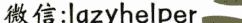

# 250929 新闻实验室

整理：公众号懒人搜索，懒人专属群独享

懒人微信：lazyhelper

> “一系列拥有商业利益需要保护的私营参与者，做出了‘被碾压’的决定。”

最近，美国深夜脱口秀的标志性人物 Jimmy Kimmel 和他的节目《Jimmy Kimmel Live!》（中国观众喜欢称之为“吉米鸡毛秀”），进入了一场席卷全美的政治与言论自由的风暴中心。

事件的导火索看似只是他在 9 月 15 日节目中的一段开场独白，但其背后引爆的连锁反应，揭示了当下美国媒体、政治与商业利益之间错综复杂的关系，更显示出言论自由的脆弱性。

## 「震惊全美的言论审查事件」

事件的背景是我们前几期已经介绍过的事件：年轻的保守派活动家、右翼组织“美国转折点”（Turning Point USA）的创始人 Charlie Kirk 遇刺身亡。许多右翼组织和人物一方面高调纪念他，另一方面则四处打击他们认为的“不敬”言论。自由派的电视台 MSNBC 评论员 Matthew Dowd 因发表评论说“仇恨的思想导致仇恨的言论，进而导致仇恨的行动”而被解雇；美国航空公司也停飞了数名被指庆祝 Kirk 之死的飞行员。正是在这样一种全国情绪紧绷、政治高度敏感的氛围中，Jimmy Kimmel 的言论登场了。

在他的开场独白中，Kimmel 将矛头指向了围绕行刺者 Tyler Robinson 政治立场的讨论。他说道：“上周末我们见证了新的下限，‘MAGA 帮’拼命想把这个谋杀了 Charlie Kirk 的孩子描绘成非他们同类的人，并想尽一切办法从中获取政治得分。”他还尖锐地嘲讽了川普对此事的表态——当记者问及他如何应对 Kirk 的死时，川普回答说“非常好”（very good），并迅速将话题转移到白宫正在新建一个价值 2 亿美元的宴会厅上。Kimmel 评论道：“是的，他正处于悲伤的第四阶段：建设。这不是一个成年人哀悼他称之为朋友的人被谋杀的方式；这是一个四岁孩子哀悼金鱼的方式。”

这段独白在第二天早上迅速引爆了社交媒体。其切片在 X 上被疯传，保守派的网红和媒体人物开始猛烈抨击 Kimmel，指责他歪曲了行刺者的政治倾向。这场网络舆论战在马斯克加入后进一步升级，他称 Kimmel 的言论“令人作呕”（disgusting）。

让事件性质发生根本转变的，是监管机构的直接介入。在美国，联邦通信委员会（FCC）是监管广播电视的机构。9 月 17 日，由川普任命的 FCC 主席 Brendan Carr 在右翼播客主持人 Benny Johnson 的节目中，发出了毫不掩饰的威胁。他公开谴责 Kimmel 的言论“实在病态”，并暗示 FCC 可能会对播出 Kimmel 节目的 ABC 公司采取监管行动。Carr 用一种近乎黑帮电影台词的口吻说道：“我们可以用简单的方式，也可以用困难的方式来解决这件事。”他明确指出，那些持有广播牌照、需要对“公共利益”负责的地方电视台，应该对 ABC 施加压力。

具有讽刺意味的是，这位挥舞审查大棒的 FCC 主席，在过去曾是“言论自由”的坚定捍卫者。他曾在 2023 年发推文称：“言论自由是制衡政府权力的力量……这就是为什么审查是独裁者的梦想。”他甚至在 2022 年为政治讽刺辩护，称其为“最古老、最重要的言论自由形式之一”。这种今昔对比鲜明的立场转变，让外界普遍认为，他如今的行为并非出于对“公共利益”的考量，而是服务于川普政府的政治议程。

FCC 主席发出威胁后，几小时之内，拥有 32 家 ABC 地方附属电视台的广播巨头 Nexstar Media Group 率先响应，宣布将“无限期”停播《Jimmy Kimmel Live!》，理由是 Kimmel 的言论使其节目不再符合“公共利益”。紧接着，另一家拥有众多 ABC 附属台的大型广播集团 Sinclair 也宣布跟进。

此时，ABC 的母公司迪士尼发现自己陷入了一个巨大的困境。据报道，Kimmel 原本计划在周三（9 月 17 日）晚上的节目中就此争议做出回应，他打算说明自己的言论被 MAGA 运动刻意歪曲。但迪士尼的高层（包括娱乐部门联席主席 Dana Walden 和首席执行官 Bob Iger）在与 Kimmel 沟通后，认为他计划中的回应只会进一步激化紧张局势。与此同时，广告商开始表达忧虑，而 Kimmel 节目的员工也开始收到充满恶意的威胁信息，部分个人信息甚至被发布到网上。

在多重压力之下，就在周三晚间节目即将开始录制、观众正排队准备入场之际，迪士尼的领导层做出了最终决定。Walden 和 Iger 决定无限期暂停《Jimmy Kimmel Live!》的制作和播出，并由 Walden 亲自将这个决定告知了 Kimmel。

至此，一段深夜脱口秀的独白，在短短 48 小时内，演变成了一场震惊全美的言论审查事件。川普随即在自己的社交平台 Truth Social 上庆祝，称 Kimmel “被取消”是“美国的好消息”。一个喜剧演员的玩笑，就这样正式升级为一场关乎美国宪法第一修正案、政府权力边界和企业责任的全国性危机，而其背后，是早已埋下伏笔的商业利益与政治压力的深度纠缠。

## 「压力下的媒体：金钱、权力和脆弱的第四权」

Jimmy Kimmel 节目的迅速“下架”，表面看是因为政府施压，但深层原因却指向了更多的因素。

从政治和法律上看，FCC 主席 Brendan Carr 发出的威胁被一些学者认为是违宪的。根据法律学者 Wayne Unger 的分析，尽管美国宪法第一修正案通常不适用于私人雇主（即迪士尼有权解雇 Kimmel），但它明确禁止政府官员通过胁迫手段来压制其不喜欢的言论。最高法院在 2024 年的一项名为 National Rifle Association v. Vullo 的判例中，全体一致地重申了这一原则：政府以法律制裁相威胁来压制异见，是违宪行为。Carr 的言论——“我们可以用简单的方式，也可以用困难的方式”——几乎可以肯定会在法庭上被视为等同于胁迫的政府行为。

政府的威胁虽然看上去是“硬手腕”，但与宪法相悖。让“鸡毛秀”停播的关键因素，其实是媒体巨头自身的商业利益，这是它们不堪一击的软肋。

宣布抵制 Kimmel 的 Nexstar 和 Sinclair 两大广播集团，其动机被广泛质疑。曾在克林顿政府担任 FCC 幕僚长的 Blair Levin 提出问题：

> “这究竟是出于政治认同，还是他们认为从经济角度来看，利用这个时机向川普政府献媚更有利？”

答案似乎在商业版图中清晰可见。

《华尔街日报》的报道指出，Nexstar 当时有一笔价值 62 亿美元、收购另一家大型电视台所有者 Tegna 的交易，正等待 FCC 的批准。这笔交易不仅需要 FCC 的首肯，甚至需要该机构放宽现行的媒体所有权限制规定。与此同时，以保守倾向著称的 Sinclair 集团也在为其广播业务寻求潜在的交易机会。在这种背景下，向 FCC 主席示好，似乎成了一种心照不宣的商业策略。尽管 Nexstar 发言人表示，其决定是单方面做出的，未与任何政府机构沟通，但时间上的“巧合”让这种说法难以令人信服。

这种“顺从”模式并非孤例。近期，CBS 的母公司派拉蒙在与川普的一场诽谤官司中，同意支付 1600 万美元达成和解。而就在和解后不久，FCC 批准了派拉蒙与 Skydance Media 的合并案。更早些时候，CBS 还宣布将在 2026 年停播另一位频繁批评川普的深夜秀主持人 Stephen Colbert（“扣扣熊”）的节目，虽然官方给出的理由是“纯粹的财务决定”，但在川普政府高压的背景下，这些决定都被外界解读为媒体巨头的“屈服”。《华尔街日报》援引媒体律师 Lee Levine 的话说：“每当政府挥舞的财政大棒足够大时，这些电视网迟早会屈服。”

这种局面与几十年前形成了鲜明对比。The Conversation 的一篇文章回顾了尼克松时代的一段往事：当时尼克松总统也曾因脱口秀主持人 Dick Cavett 对其政府的尖锐批评而大为光火，并试图利用政府力量让他闭嘴。然而，尼克松最终失败了。原因在于，当时的媒体环境与现在截然不同。

首先，当时电视的王者地位无可撼动。Dick Cavett 的节目在当时每晚能吸引 500 万观众，而他的竞争对手 Johnny Carson 的节目更是高达 1100 万。庞大的观众基础和社会影响力，是电视网抵御政治压力的坚实后盾。而如今，随着有线电视、互联网和流媒体的崛起，深夜脱口秀的收视率已大幅下滑，Kimmel 的收视人数甚至不到当年 Cavett 的一半。

其次，媒体的所有权结构发生了根本性变化。在 Cavett 的时代，ABC 和 CBS 的掌舵人是 Leonard Goldenson 和 William S. Paley 这样的“广播电视业元老”，他们将媒体的独立性和声誉视为毕生事业的核心。而今天，由于 1996 年《电信法案》后的大规模媒体整合，这些电视网早已被庞大的跨国企业集团所拥有。对于迪士尼或派拉蒙这样的巨头而言，其首要目标是为股东创造利润。当一个深夜秀节目可能危及一笔数十亿美元的并购案时，牺牲这个节目就成了一个理性的商业选择。

因此，当 Brendan Carr 发出威胁时，他面对的不再是一个拥有巨大文化向心力和独立精神的电视帝国，而是一个收视率下滑、被商业利益深度捆绑、且对政府监管高度敏感的媒体联合体。这为川普政府以前所未有的方式成功干预媒体内容，创造了完美的条件。

## 「“鸡毛秀”回归：一场惨胜」

在被停播近一周后，正当外界对 Jimmy Kimmel 的职业生涯和美国言论自由的前景感到悲观时，事件迎来了戏剧性的转折。9 月 22 日，ABC 宣布《Jimmy Kimmel Live!》将于次日回归。

Jimmy Kimmel 的回归独白，也因此成为了一场备受全美瞩目的公开演讲——9 月 23 日晚，Kimmel 重新站上舞台，面对着为他欢呼的观众，发表了一段时而哽咽、时而坚定的独白。他首先就自己的言论引发的争议表达了歉意和反思。他声音沙哑地表示，自己理解为什么关于 Charlie Kirk 案嫌疑人的言论会让人觉得“不合时宜或不清晰，或许两者兼有”，并强调“我的本意绝不是拿一个年轻人的谋杀案开玩笑”。他甚至动情地提到了 Kirk 的遗孀 Erika Kirk 在追悼会上选择原谅凶手的举动，称这“深深地触动了我”。

然而，Kimmel 并没有止步于道歉。他话锋一转，将矛头直指背后的政治压力。他明确表示，自己不同意母公司迪士尼停播其节目的决定，但他同时也感谢这家他工作了 22 年的公司最终捍卫了他的权利。他尖锐地指出：“一个政府威胁要让总统不喜欢的喜剧演员沉默，这是反美国的行为。”他向观众传达了一个核心信息：“这个节目不重要，重要的是我们能生活在一个允许我们有这样一个节目的国家。”

Jimmy Kimmel 的回归独白获得了巨大的成功。它不仅在现场赢得了雷鸣般的掌声，也在舆论场上获得了广泛支持。出人意料的是，一些通常在政治上与他意见相左的共和党人，也在此刻站出来捍卫言论自由的原则。包括参议员 Ted Cruz、Mitch McConnell 和 Rand Paul 在内的共和党官员，都对 FCC 主席 Brendan Carr 的施压行为表示了疑虑。Kimmel 在独白中特别感谢了那些“不支持我的节目和我的信仰，但支持我有权分享这些信仰”的人。

这场回归秀在收视上也取得了惊人的成绩。当晚的观众人数达到了 620 万，几乎是平时收视率的四倍，这还不包括流媒体的观看量。这一数字充分显示了公众对此事件的高度关注。尽管 Nexstar 和 Sinclair 两大广播电视集团又多抵制了几天，但最终还是在 9 月 26 日恢复了节目的播出。

从表面上看，这似乎是言论自由的一次重大胜利。然而，这场风波并未就此画上句号。Kimmel 的回归虽然令人振奋，但事件本身暴露出的深层问题，却让许多媒体观察家和从业者感到寒蝉效应（chilling effect）。当政府官员可以如此轻易地通过威胁商业利益来让一个顶级的电视节目噤声时，其他规模更小、影响力更弱的媒体和个人，在未来发表批评性言论时，无疑会感到更大的压力。正如《华尔街日报》的报道所分析的，这可能会导致媒体机构进行广泛的自我审查，以避免成为下一个目标。ABC 内部节目《The View》在事件发酵期间对此事保持了令人不安的沉默，就是一个微妙的例证。

更深层次的问题在于，正如《哥伦比亚新闻评论》的评论所指出的，这起事件揭示了一个长期被左翼批评家如乔姆斯基所警告的现实：大型的、并购而成的媒体公司极易受到政府压力的影响。媒体公司并非在真空中运作，它们与政府之间存在着复杂的利益关系。当这些公司的生存与发展需要依赖政府机构的批准时，它们所谓的“独立性”就变得岌岌可危。这篇文章表示，我们看到的“不仅仅是一个无情的国家机器在碾压任何反抗，而是一系列拥有商业利益需要保护的私营参与者，做出了‘被碾压’的决定”。

因此，在美国媒体行业的基本商业格局不变的情况下，Jimmy Kimmel 的回归虽然是一场胜利，但它更像是一场惨胜。Kimmel 保住了他的麦克风，但美国媒体的独立性与未来，也在这场风波中被打上了一个巨大的问号。

## 最后，安利小懒的付费群：

### 懒人专属群（介绍）

懒人专属群持续更新中，已持续运营 6 年，整理超 3000 份各类精选付费文章 & 年费社群干货，全部开放下载。

本资料为付费群内部分享，仅供真实有需要的朋友查阅 🙇

懒人专属群更新记录：

https://lazy2025.top/blog/record2

懒人专属群更新记录（需梯子，备用）：

https://lazybook.fun/blog/record2