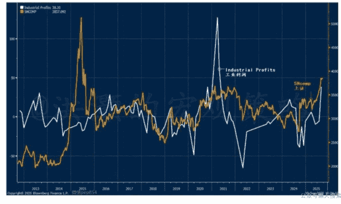
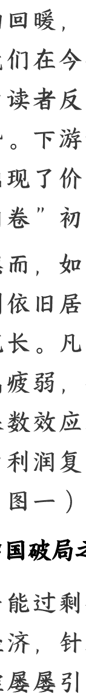
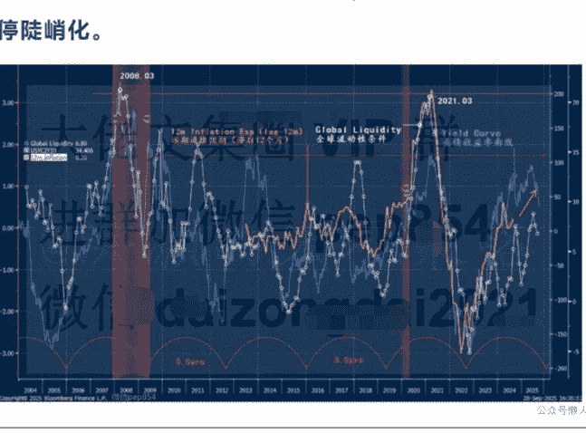
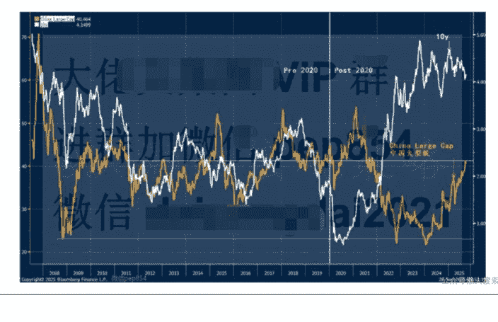
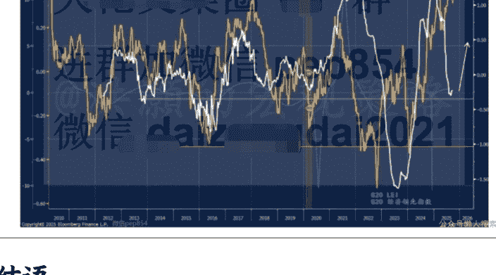

# 秋天的反击

250929 洪灝

整理：公众号懒人搜索，懒人专属群独享

懒人微信：lazyhelper

## 八月工业利润的暴增预示着什么？

### 工业利润乍暖还寒

八月中国规模以上工业企业利润同比骤升 20.4%，与市场预期下跌 1.6%大相径庭。上游行业如原材料、有色金属等领域呈现量价齐升的格局。民营企业利润增速独占鳌头，较股份制企业与国有企业更胜一筹。诸多行业虽受益于销售放量，然成本结构相对稳定。这些行业有望继续从他们的经营杠杆(operating leverage)中受益。

近来，决策的风向已悄然生变，从对价格下行压力的容忍转向推行通货再膨胀（reflation）的新取向，这个决策上的拐点堪称市场与经济未来走向的胜负手。八月数据已经初现端倪，昭示“反内卷”攻坚似乎在一些行业中已初见成效（图一）。

### 图一：工业利润骤增，并与上证比翼齐飞

以下内容仅V+会员可见。

然深究其里，此番利润回升很大程度上以去年同期的低基数效应为主因。去年八月时，利润增速几近折戟沉沙，暴跌18%，终致去年九月末决策者果断出手。那时，虽然各部门的政策频出犹如万箭齐发，但去年九月市场反应也只是昙花一现，“黄金周”后便再度止步不前。

时至今日，市场交投活跃度、券商开户数与两融余额仍不及去年九月的盛况。市场对于进一步的宏观刺激早已心如止水，转而深耕行业与企业层面的盈利增长。此乃今年以来板块表现云泥之别之主因，成长股早已一骑绝尘，而价值股的表现则在后面望尘莫及（图二）。

### 图二：创业板大幅跑赢，中国市场和美债长端收益率分道扬镳

当然，八月的工业利润复苏不过星火之势，且许多行业仍然冷热不均。上游原材料领域得益于大宗商品周期性的回暖，此趋势未来数月仍将延续。我们在今年六月和八月的见面会已经为读者反复预测了这个即将开始的趋势。下游如新能源车、光伏等领域也出现了价升量缩的格局，此恰为“反内卷”初见成效之佐证。

然而，如果剔除价格效应，库存水平则依旧居高不下，应收账款周期仍显冗长。凡此种种，皆暗示终端需求尚属疲弱，振兴消费之路任重道远。低基数效应在未来数月仍将如影随形，为利润复苏与市场回暖创造有利条件（图一）。

## 中国破局之道何在？

产能过剩痼疾经年累月地困扰着中国经济，针对这个问题而进行的产能调控屡屡引发经济周期性的震荡。虽经多年励精图治，工业产能过剩的困局依然有待解决，并有蔓延到下游之势。

国际专家多指摘中国的劳动报酬占GDP比重偏低而导致内需不振。然据国际金融协会马青博士研究，经购买力平价调整后的资金流量数据显示，中国消费占比实与中等收入经济体并驾齐驱，而且更胜新加坡一筹。

毋庸置疑，实体经济领域持续的价格下行压力昭示供给过剩已成心腹之患。很多产能为满足出口外需所建，代价却是国内消费备受压抑。更甚者，大规模制造业投资需以巨额储蓄为基石，因宏观经济里投资和储蓄必然恒等。

这般对外需与产能投资的过度依赖，使中国经济易受海外经济周期波动的影响。鉴于短期供给弹性匮乏，产能过剩周而复始，成为宏观调控的掣肘之处。长期奉行供给端调控的方略，忽略了消费的潜能，令其不得施展。简言之，在经济增长计划中，消费屡成弃子，投资常年鸠占鹊巢。而今改弦更张正当其时。

试看今朝，中国正重振内需旗鼓，削减低效债务驱动型的产能投资。从生育补贴到免费基础教育，再到医改深化，一系列政策如雨后春笋，彰显改革正在如火如荼地展开。

此番政策转向将重燃疫情后久违的动物精神，为经济增长注入新的想象空间。若此，经济中的激励机制将从“为劳作而生”转向张弛有度、工休平衡。未来数月，提振内需的政策脉络应将愈发清晰，此次中国经济向消费驱动的转型应该是胜算在握的。

倘若中国真能破解产能过剩的迷局，经济增长成功地转向内需驱动、供需平衡，哪怕仅是预期渐起，那么市场对美联储降息幅度的定价恐过于鲁莽激进（图三）。中国或将向美国开始输出通胀，至少不再倾泻通缩。简言之，美国的长期通胀预期并未得到有效抑制，依然在上升趋势之中。此乃市场共识尚未察觉定价的宏观巨变，亦可解释央行持续增储黄金的深谋远虑。

### 图三：美国长期通胀预期居高不下，债券收益率曲线将暂停陡峭化。

往昔，中美资产价格的关联性如影随形：美债收益率攀升，则中国市场受挫。若循历史旧例，若美债收益率攀升岂不对我们看多中国的观点构成心腹之患？

然而，疫情以来，中美资产价格的关联度已分道扬镳（图四）。美债收益率攀升不再等同于中国市场走弱，反而，两类资产价格近期的走势甚至背道而驰、分道扬镳。此关联性的逆转暗合国际资本流向的嬗变，资金不再对于美债趋之若鹜，转而竞逐中国资产。

### 图四：中概股早已与十年美债收益率分道扬镳，暗示国际资本流动转向。

作为中国市场领先指标的国际运价指数(领先性长达三月)正欲重振旗鼓。近日，两国致力修复贸易战创伤，已初见进展。运价回暖与中国市场走势琴瑟和鸣，为看多中国的观点再添佐证（图五）。

### 图五：国际运价是中国市场的领先指标，并试图反弹。

# 结语

八月工业利润飙升实为基数效应之故，然而原材料领域量价齐升暗合需求回暖。新能源领域价升量缩恰是“反内卷”初战告捷之征兆。利润复苏未来数月可望延续，为市场注入新的利好因素。

经济调节长期忽略了内需的重要性，为投资产能而牺牲了内需，增长过度倚重于产能扩张。然今，工作重心似乎开始改弦易辙，未来更多的需求侧政策可期。当市场对美联储降息激情定价之际，中国市场早已与美债收益率分道扬镳。国际运价回暖更与中国市场的走势相得益彰，诸多征兆皆指向中国资产价格上升趋势的延续。

最后，安利小懒的付费群：

懒人专属群（介绍）

懒人专属群持续更新中，已持续运营 6 年，整理超 3000 份各类精选付费文章 & 年费社群干货，全部开放下载。

本资料为付费群内部分享，仅供真实有需要的朋友查阅 🤫

懒人专属群更新记录：
https://lazy2025.top/blog/record2

懒人专属群更新记录（需梯子，备用）：
https://lazybook.fun/blog/record2