# AI 赋能公众号 - 用 AI 打造你的公众号品牌（数据分析+AI 工具合集）
## 250929 生财精华
公众号懒人搜索，懒人专属群独享
懒人微信：lazyhelper

我是周知，公众号是我作为 AI 超级个体的第一站。我想把我过去一年常用的 AI 工具和数据分析思路，给到新入局公众号垂直小号的圈友加餐。

在短视频和直播的时代，公众号已经失去了光芒。没错，但持续在看公众号的用户，也给了我们超级个体进一步展示“你最深”、用内容去链接粉丝的新机会。

微信公众号从严格的“订阅化分发”，走向了“算法推荐路线”。过去，你没有粉丝，文章再好也没人看。现在，新号只要内容够硬，系统直接给你推到适合“你最深”的用户脸上。

现在大家都能用 AI 写作，那么，真正的差距在哪里？我觉得是：

> “理解使用工具背后的逻辑，我们才知道为什么用、如何用。看透本质，理解规律，我们就能创造规律。”

今天的分享，分为 6 个部分：

# 第一章：做公众号=做品牌
我会告诉你，为什么“再小的个体，也有自己的品牌”这句话，在 AI 时代更加重要。

# 第二章：IP 爆文的底层逻辑
拆解一篇流量文背后的 7 层结构，让你知道爆文不是运气，而是可以度量拆解。

# 第三章：流量机制的本质
从黑箱到透明。“朋友推荐”的流量贡献，已经从 24.3%上升到 45.9%。我会告诉你算法到底在看什么。

# 第四章：数据分析的价值
微信算法的核心流量参数：在看、完读率、社交连接深度。每个指标背后，都是一次优化机会。

# 第五章：AI 辅助创作
长文、图文、漫画。AI 如何提效创作。

# 第六章：公众号 AI 工具提示词合集
最实用的提示词，让 AI 成为你的得力助手。

我想说下自己的看法：公众号不是内容分发平台，而是小品牌分发平台。

## 做公众号=做品牌

公众号的 Slogan：“再小的个体，也有自己的品牌”。其实公众号这个平台的定位，就是帮助个体（或团体）去打造一个品牌。

我当时就是被这句话种草的。那公众号的个人品牌是什么？看看一个公众号，给用户呈现的是什么？

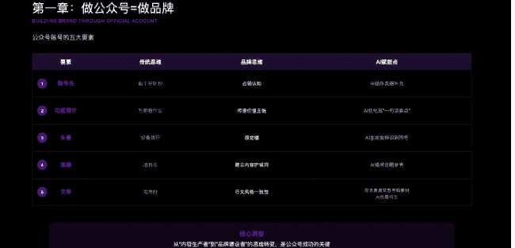

账号名。
传统思维：起个好听的。比如“清风徐来”、“岁月静好”。
品牌思维：占领认知。比如“刘润”，两个字，就是商业顾问的代名词。

功能简介。
传统思维：写明做什么。“分享职场经验和管理知识”。
品牌思维：传递价值主张。“每天5分钟，解决一个管理难题”。

看到区别了吗？前者是“我有什么”，后者是“你能得到什么”。

头像。
很多人用风景照、卡通图。其实，用真人头像的账号，平均打开率高出很多。为什么？因为人类大脑天生对人脸敏感。

选题。
现在推荐算法面前人人平等。但选题，决定了你是随波逐流，还是建立护城河。举个例子，“情感类”选题流量大，但同质化严重，你很难出头；“垂直专业”选题流量小，但用户精准，变现能力强 10 倍。

文章。
你的产品交付。爆款文章的核心与几个因素有关：选题相关度、标题吸引力、内容质量、排版体验。但更重要的是什么？是风格的一致性。读者关注你，不是因为某篇文章，而是因为他知道，每次打开你的文章，都能获得某种确定的价值。这就像星巴克。你去星巴克，不是因为那里的咖啡最好喝，而是因为你知道，无论在北京还是纽约，星巴克的拿铁都是那个味道。

## 做公众号=做品牌 5 个元素拆解
可以总结为下面 5 个元素：账号名称、头像/封面图、账号功能简介、标题风格、文章风格。逻辑关系如下：

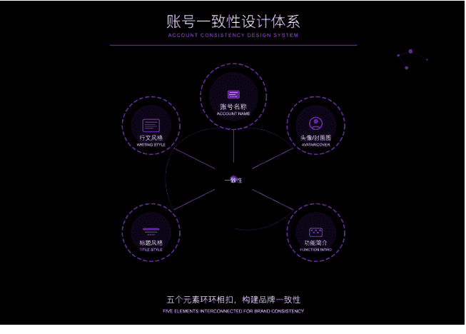

### 1、账号名称
选择一个好的公众号名称和头像，就像给自己的孩⼦取名一样重要。

#### 借热点起名（短周期热点）
每天花点时间刷一刷热点，看看什么热点事件会持续爆，可以提前埋伏话题，这个以流量为主模式。
> “郭有才”刚火的时候，就有人模仿起名“郭有句”。

#### 用人名叫招牌，树立个人 IP
这个多用于 IP 方向，这招其实是在借⼒使⼒。找个领域内的大牛，或者干脆⾃⼰就是那个大牛，⽤真名实姓来吸引眼球。类似“卢克⽂⼯作室”。

注意！可别随便用别人的名字，要么是自己，要么是已经获得授权的，否则吃官司就得不偿失了。名人效应是一把双刃剑，但前提是你的内容要跟这个名人的调性相符，否则就会画虎不成反类犬。

#### 赛道+称呼，精准锁定目标群体
这个可以很快速清晰地划定账号的赛道和定位，可做流量方向，也可以做成 IP 方向。挑个够清晰的领域，比如“职场”、“育儿”、“理财”等，一眼就能看出你是做什么的。称呼要有味道。“赢姐”、“小欣”、“暴姐”这种，听着就让人觉得亲切，还挺有个性。名字要做到三秒记住，三年不忘。太绕口的，那就算了吧。

这类的账号名称更容易让平台、读者打上标签，快速起量（推荐新人选择）。

#### 账号名称避坑
起名之前先在微信搜一下，你名称中的关键词都是做什么类型的内容的账号。有些关键词是被腾讯限流的。举例：比如关键词“大师兄”，这个搜出来都是做股票类被限流的话题，或者卖擦边类产品的，那“大师兄”这个词就会被限流，不建议使用。

公众号懒人搜索，懒人专属群分享

以“大师兄”为例的限流示例：
- 大师兄：专注核心，寻找阻力最小的地方。有龙有马(重庆)影视传媒有限公司
- 最强大师兄：专注核心，寻找阻力最小的地方。有龙有马(重庆)影视传媒有限公司
- 股侠大师兄：股侠大师兄复盘大号。海口龙华股侠网络科技工作室(个体...)
- 大师兄打板：一介散户，记录对市场、对龙头的理解。只做短线，只做龙头，只想站着…个人
- 大师兄统计：大师兄专注概率论与数理统计。个人
- 大师兄苹果：大师兄影视TV版激活码、最新苹果安卓版安装。个人
- 大师兄盘中号：股侠大师兄唯一午盘号，分享盘中机会。

和“主旋律”相关的元素，起名需要提交相关证明材料审核，如：“国*旗”“集结号”等等，尽量规避。和知名品牌同名的也需要提交相关证明材料，如“小米”，带有这个元素就需要提交证明材料。

为帮助大家节约时间，尽可能在起名环节去规避。公众号名称一年就两次改名机会，用之需谨慎啊！

7/55

### 2、头像&封面图
绝对前提：头像与你的账户主题定位、封面的图片绘画风格、色彩色调、内容风格、写作语气相匹配。一致性是建立强大品牌的关键。

#### 2.1、头像
- 尺寸：最好是正方形，640x640 像素，这样看起来最清楚。
- 格式：JPG、GIF、BMP、PNG 这些格式都行。

#### 【真人头像】
如果你用的是人名做账号名称或者是 xx 赛道+xx 角色，那最好就用真人头像。真人头像就像是在跟读者面对面交流，拉近距离，增加信任感。对于想打造个人品牌的创作者来说，这简直是神器。比较适合：各行各业的专家、培训师，还有那些靠个人魅力吃饭的艺术家们。喜欢分享生活点滴的博主，用真人头像能让故事更有代入感。
> 【小建议：挑张清晰、表情自然的照片，最好能体现你的专业性或个性。】

#### 【文字头像】
文字头像的好处：
- 记忆点拉满：简单的文字往往最难忘，让你的公众号名瞬间刻在读者心里。
- 专业感加持：特别是对于一些严肃的话题，文字头像往往更显得靠谱。
如果你的账号名称比较抽象，没有具象化的图片去做头像，可以尝试用文字头像，这种场景比较适合官方品牌。

#### 适合哪些人？
- 企业号、机构号：想要树立专业形象，文字头像绝对是不二之选。
- 新媒体团队：如果你是运营一个团队账号，文字头像可以避免个人色彩过重。

#### 设计头像的建议：
- 字体很关键！选个清晰又有特色的，让人一眼就认出你。
- 来点小创意，加个 logo 或用特别的字体排版，让你的文字头像与众不同。
- 简约才是王道。别把头像搞得花里胡哨的，反而会影响识别度。

#### 头像避坑：
不要使用 AI 生成的人身体+动物头的动画或真人类拟人头像，容易被系统限流。

#### 2.2、封面图

#### 尺寸规范
微信公众号封面有两种类型，分别是 2.35:1 和 1:1。
- 2.35:1：这是头条推文的封面图尺寸，出现在订阅号消息列表、内容推荐和转发链接卡片中。
- 1:1：这是次条推文和转发卡片的封面图尺寸，出现在转发的链接卡片和消息列表、内容推荐中。

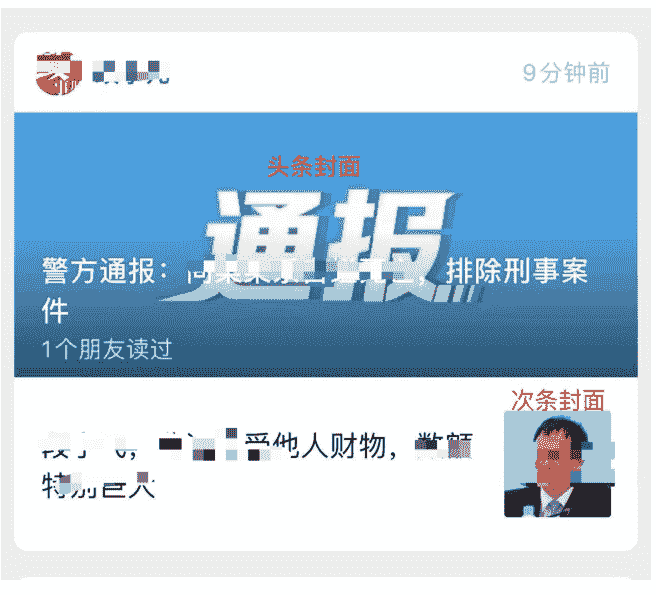

#### 色彩的协调性
注意色彩的协调性。比如，如果我的头像是以蓝色调为主，我会优先考虑使用蓝色调的封面图。这种统一性不仅能让整体视觉效果更加舒服，还能给人一种专业和用心的感觉。

#### 主题与风格的呼应（一致性）
内容的一致性不仅体现在文字上，图片的选择也同样重要。举个例子，当我在写关于古人或历史话题时，我会刻意选择带有“古风”元素的图片。关于苏东坡的文章，封面图我选了一幅工笔画风格的山水画。视觉上的呼应能让读者在还没开始读就已经对内容产生了兴趣。
- 例如：写职场，可呼应办公室场景、身着正装的男女等。
- 备注：如果是写热点资讯等，可以使用新闻实拍图或者大字标题类。

### 3、账号功能简介
公众号简介，它就是你的“微型广告牌”：在短短几秒内，让路人秒懂你是谁？你在做什么？能提供什么？也可以理解为是“账号名称的补充说明”。

一个让人过目不忘的简介，需要具备什么？
- 亮出你的独特身份：别藏着掖着，大胆告诉大家你是谁，为什么值得关注。
- 说明你的号主打什么内容？读者能期待什么？直接了当地说出来。
- 强调读者能得到什么：人们关心的不是你多厉害，而是关注你能给他们带来什么好处。

#### 写简介技巧：
- 短小精悍最有力：尽量 2 个短句，不超过 30 个字（可更短），说清楚要点就够了。除非你是大 V，需要介绍更多背景。
- 用大白话：别整那些高深莫测的术语，让阿猫阿狗都能一目了然。
- 突出价值：不要光说你提供什么，要说清楚读者能得到什么。

#### 看几个案例：
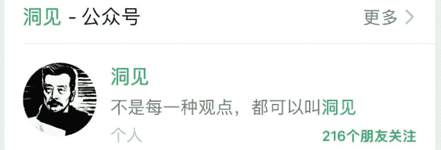
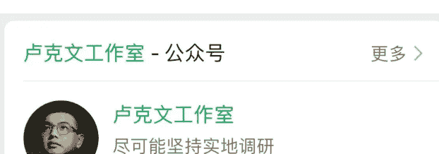

与账号名称呼应，对账号名称的补充说明。说明了账号的价值。

| 属性 | 内容 |
|---|---|
| 名称 | 十点读书 |
| 公司 | 厦门十点文化传播有限公司 |
| 地区 | 福建 |
| 简介 | 深夜十点，陪你读书，美好的生活。好书/故事/美文/电台/美学。 |
| 原创内容 | 7752篇 |

**企业号（采用的是文字头像）**
| 属性 | 内容 |
|---|---|
| 简介 | 说明功能+提供价值 |

#### 简介避坑：
- 避免简介文字过于冗长。
- 避免简介文字过于晦涩，尽可能使用比较容易理解的话，降低理解门槛。

### 4、标题

### 标题很重要！！！
一个好标题至少能决定 60%以上的点击率，甚至更多。我们之前聊的账号功能简介，那是你向读者说明你能做什么、能在你这获得什么？而标题，就是告诉读者你能具体做的事情。

1. 标题与简介的完美配合
如果你的账号功能是“让生活更省钱”，那你的标题就应该是具体的省钱妙招。譬如“超市购物的 7 个省钱秘诀，学会立省三分之一”。看到这样的标题，谁能忍住不点进去看看呢？

2. 风格统一，个性鲜明
你的标题应该像你的个性名片，和你的账号人设要一致。假如你是个辛辣犀利的社会评论家，那你的标题就得够劲儿！得带入你账号人设的语气风格。比如“某某政策的背后：谁在笑，谁在哭？”这种直击痛点的标题，绝对能引起读者的共鸣。

3. 标点符号
最后，关于标点符号，尤其是省略号和冒号，我的建议是：能不用就不用。除非你真的需要进一步解释，否则一个干脆利落的标题往往更有力量。比起“深度解析：某某事件的来龙去脉”，不如直接来个“某某事件背后的某某”，是不是更吸引人？冒号比较适用于解释后罗列清单场景。

你的标题就是你内容的第一印象。它应该像一个精心设计的店面橱窗，吸引路人驻足，然后迫不及待地想要走进来一探究竟。所以，写标题的时候，不妨多花点心思，让它成为你文章的点睛之笔！
注意点：标题中尽可能带有你文章主题的“关键词”。

### 5、文章风格
把公众号比做一个店铺的话，账号、简介、头像、封面、标题就相当于你的门面装修，让人一眼就看清楚你是卖什么的，而且还很容易记住，把顾客吸引进门。那文章风格就是你店里的商品和服务，能不能让顾客有个满意的购物体验，取决于你的文章内容。

文章风格应该是你个人品牌的自然延伸。这里面有几个关键因素：
- 文章的结构
- 作者的文字风格
- 观点的表达
- 排版的格式

## 做公众号=做品牌 案例分析
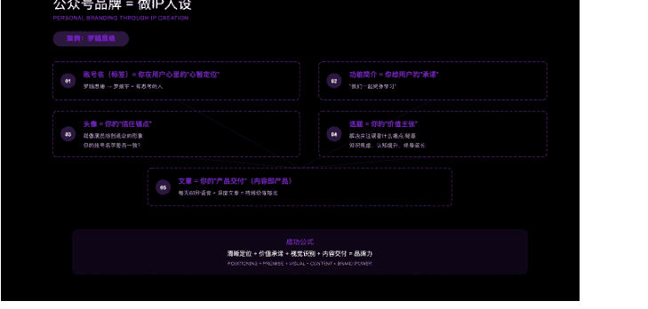

### 一个案例——罗辑思维
你怎么看罗振宇的？

我知道肯定有两种声音：一种觉得他是知识网红、贩卖焦虑；另一种觉得他是终身学习的践行者。但不管你怎么看他，有个数据你必须承认：2017-2019 年，思维造物在三年中实现营收共 19.22 亿。这还只是他的一家公司。

我想问大家一个问题：罗振宇卖的是什么？
知识？不对。知识到处都有，图书馆里免费的知识比他讲的多一万倍。
课程？也不对。大学里的课程比他的专业得多。
他卖的，其实是一个符号——“终身学习者”的符号。他在做“罗振宇”这个 IP。
“得到”估值超过 20 亿。罗振宇这个名字，就值 10 个亿。
品牌的力量。流量会枯竭，但品牌会增值。

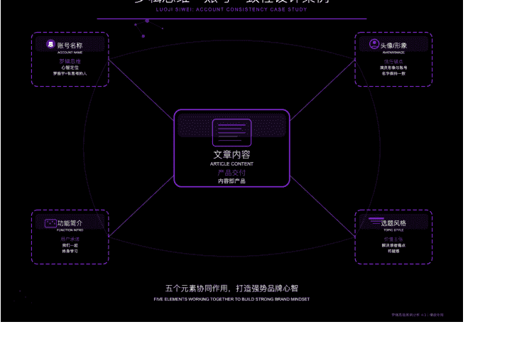

来，我们拆解一下：
第一，账号名就是认知锤子。“罗辑思维”——不是“逻辑”，是“罗辑”。一个字的差别，直接把个人品牌植入了账号名。每次有人说“逻辑思维”，都会被纠正成“罗辑思维”，这就是免费的传播。

第二，功能简介就是价值承诺。“我们一起终身学习”——注意，不是“我教你学习”，是“我们一起”。这个定位太聪明了，他不是老师，是同学，是书童，是陪伴者。

第三，头像就是信任背书。一个戴眼镜的胖子，看起来人畜无害，还有点憨厚。这比西装革履的精英形象更容易让人信任。

第四，选题就是内容护城河。新节目《文明》一共 913 期，每一期聚焦历史上的一年，计划从公元 1000 年开始，一直讲到公元 1912 年。这意味着什么？这个项目要做 20 年！谁能复制？没人能复制。

第五，文章就是产品交付。从 2012 年 12 月 21 日起，每天早上六点半，发一段 60 秒的语音，一秒不多，一秒不少，坚持了十年。这种极致的自律，本身就是品牌。

但最厉害的是什么？是他创造了一个新物种——“知识服务者”。在罗振宇之前，没有人把“贩卖知识”做成一个正经生意。他在公众号证明了一件事：内容可以成为产品，品牌可以成为生意。当我们说起“知识付费”，第一个想到的就是罗振宇。品牌——占领一个品类，成为代名词。

### 再举例：成长赛道和职场赛道

#### 反向的猫
**简介**：
聊聊金钱观，一个敏感又诚恳的话题。

**头像**：

**封面**：
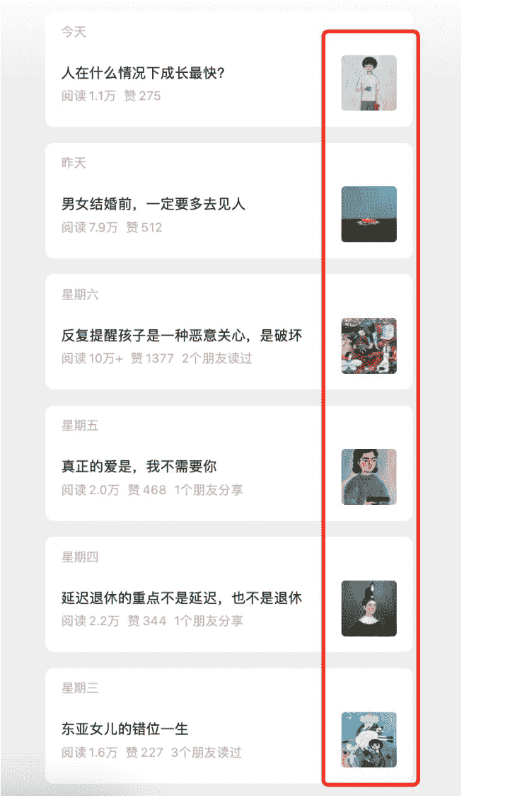

**头像与封面**
- 风格一致性：头像和封面采用统一的视觉风格，建立了强烈的品牌识别度。
- 差异化设计：相比同类公众号，封面设计更具独特性和吸引力。
- 视觉冲击力：整体设计能有效吸引用户注意，提高点击率。

**标题特征**
- 简洁性：采用简短而精炼的标题。
- 反常识元素：常用违反直觉或常规思维的表述。
- 对立感：创造话题性和争议性，激发用户点击欲望。
- 文风特点：略带文艺气息，类似“咪蒙”风格。
- 核心策略：通过“反向思维”吸引读者。

**正文内容**
- 主题聚焦：专注于财富类内容。
- 内容定位：侧重于探讨财富观念和思维方式，而非具体的赚钱技巧。
- 表达方式：直白且以“钱”为核心关键词。
- 内容拓展：结合热点话题，探讨相关社会现象。
- 深度思考：提供对当前社会和经济状况的分析和见解。

**排版风格**：
反复提醒孩子是一种恶意关心。是破坏。
原创 猫猫语语 反向的猫 2024年09月14日 12:15 福建
学会闭嘴是一生的修行。
hi，我是猫。
你有没有真的理解，孩子是你的一面镜子。
如果你认真地跟孩子相处一段时间，并且有带脑子地去观察，你会发现绝大部分孩子的行为模式很大程度上是受环境影响的。
注意，我没有说全部，我很严谨的，我用的是“很大程度”没有说100%。
人的性格顶多三分是靠上天捏的，剩下的七分大概率是靠环境塑造的。没错，这环境可不就是你，就是家庭氛围。
当父母之后就要格外注意，小心自己那些乌七八糟的情绪，或者不知道从哪里受来的气，一旦克制不住，隔一段时间后，孩子就会还给你，这叫做现世报。
这时候说这孩子太难带，太难教是不是有推卸责任之意？别装蒜了，肯定是跟你有关的。

没有采用传统的行文结构。
每一句话都是一个表达、一个观点，几乎每一句话提炼出来都能独立成文，很适合快节奏阅读，适合短平快的网络文化。
并且在行文开头，总有一句总结，然后再打招呼开篇。有点像听电台故事的“引子”，这样子的结果，方便读者用“听”代替看，不会那么累。

**留钩子**：
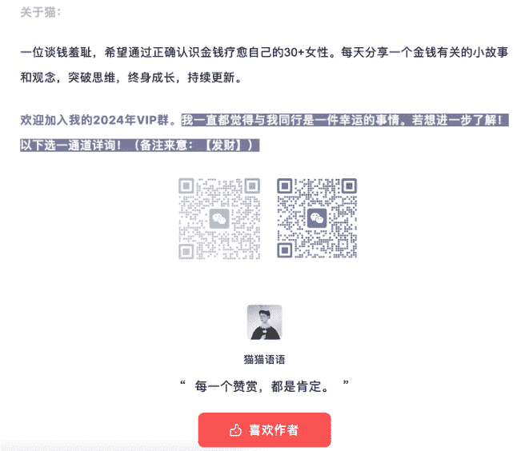

变现方式：除了开通流量主，文末留下联系方式吸引到私域。

#### 职场赢姐
公众号懒人搜索，懒人专属群分享

**职场赢姐**
HR转型互联网，现任某头部咨询公司运营总监。关注我，提升职场认知，持续成长。个人vx：zcyj2023

| 属性 | 内容 |
|---|---|
| 原创内容 | 625篇 |
| 朋友关注 | 6个 |
| 视频号 | 职场赢姐 |

**作者精选**
 在单位，为什么别人一眼就看出你是老实人？1、过于礼貌，没脾气；2、情绪都... 阅读10万+ 赞281
 单位里，领导喜欢用老实人，但是绝对不会提拔老实人，不是因为没有送礼，而... 阅读10万+ 赞349
 当上中层才知道，“城府很深”的领导，都有4个共同特征：1、善于“打太极”；2、... 阅读1.5万 赞68
 单位里，被领导重用的女生往往有这些共性：1、懂得表忠心；2、待人接物很大... 阅读1927 赞21
 单位里，有些人你看一眼就知道他迟早被提拔：1、情绪很稳；2、跟谁都聊得来... 阅读1.9万 赞75
 在单位，没人告诉你的人情世故：1、不要空口道谢；2、不要越级表现；3、不要... 阅读2185 赞31
 无论在哪上班，立好这4个人设，你就稳

**账号名称**
名称：职场赢姐
特点：简洁明了，直接传达账号定位和目标受众。
效果：易记忆，快速建立品牌认知。

**视觉识别**

22 / 55## 标题特征
风格：长文标题
内容结构：职场现象 + 原因解释
效果：提供深度内容预期，吸引目标读者点击

## 正文结构
开篇：抛出问题，激发读者兴趣
主体：分点详细论述
结尾：提供解决方案
整体特点：语句简洁直白，易于理解

## 写作风格
特点：简洁直白
论证方法：通过具体案例佐证观点
效果：增强可信度，提高内容实用性

## 结论
账号的基本设置（名称、头像、简介） ➡️ 体现了你的品牌形象
文章的封面 ➡️ 标题决定了点击率
文章内容决定 ➡️ 点赞、转发，进而决定了是否是爆文
整个账号的一致性决定 ➡️ 入池的概率（一样风格的封面、标题、行文风格）

你的账号要呈现什么领域的内容、传达什么核心理念和价值主张、目标群体又是谁、你的账号稀缺性、独特性如何、传递什么情感价值？

## 逻辑链:
你的品牌一致性决定是否有推荐 1000 浏览
推荐后你品牌是否吸引人，决定是否有人打开。1W 以上
你的内容决定是否能被放大！ 1W 以上

## IP 爆文长什么样子?
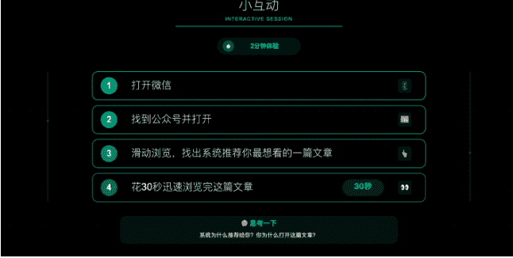

公众号懒人搜索，懒人专属群分享
19:31
公众号常看：智东西、DeepSeek、众所周知101、认知图解、智能
智东西 1小时前：AI手机跑进新纪元，联发科成了端侧AI开门人。1个朋友读过。
关注的视频：发现一条没人的路，产生一个大胆的想法。大疆
关于演讲，先回答一些大家关心的问题，比如，“今... 雷军
A18 p、YC
## 公众号页面：推荐好文章，你的关注，你朋友关注
25/55

## 独家分析 | AI 界面：变迁、失控和聊天框的未来
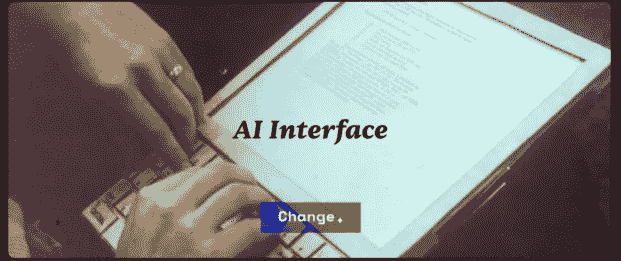

## 为什么有的人一看就感觉他以后能成事儿？

关注的号：俗人进化论

## 用 60天，无成本的启动一人公司：Dan Koe的行动框架
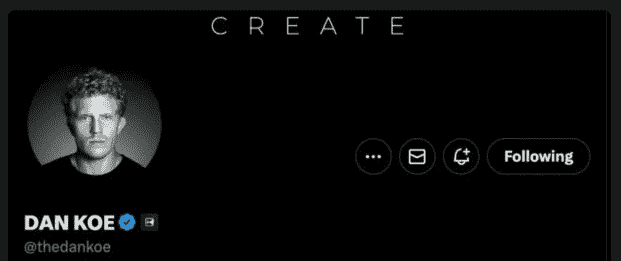
水杯不装水

## 你为什么想点击进去？
爆文的表面特征，人人都能模仿；但爆文的内在逻辑，大家都没看懂。

# 第二章：IP爆文长什么样子？

## 标题
肯定不是"震惊体"，是"钩子+悬念+价值"。
比如这篇《读懂中元，才知人这一生，从何处来，往何处去》
——"读懂中元"是钩子，让你产生好奇；"从何处来，往何处去"是悬念；中间的"才知"，暗示了价值。

## 封面
公众号推荐给你，你第一眼看什么？

## 选题角度
注意，是踩中痛点，不是踩中赛道。什么意思？
它没有讲"中元节的习俗"，中元节是赛道，"从何处来往何处去"是痛点。
理财是赛道，"月薪 8000 背负 80 万房贷如何理财"才是痛点。

## 独特的观点表达
反常识但合逻辑。讲中元节不讲鬼怪，讲对死亡和人生的思考。

## 流畅的行文节奏
2 分钟读完，但记住一辈子。怎么做到的？用故事串联观点，用金句锚定记忆。

## 带入场景的插图
让读者产生联想，干货文插图，增加转发率。

## 特别是观点和选题
比如：
- 常识说"努力就会成功" → 爆文说" 选择对了，努力才值钱 "
- 常识说"要学会坚持" → 爆文说" 聪明人都懂得及时止损 "
- 常识说"多交朋友" → 爆文说" 圈子干净比圈子大重要 "

但注意，反常识不是胡说八道，后面要有逻辑支撑。
爆文的本质，是一次精准的观点和情绪贩卖。
这篇中元节的文章。表面上是科普中元节，实际上呢？
它在中元节这个最近热点节点，贩卖的是现代人对生死的焦虑，对意义的追问。
这就是这篇文章的“核心逻辑”。
同样，当我们用 AI 写作时，先有选题，再找切入的角度就是观点，最后才是文字。

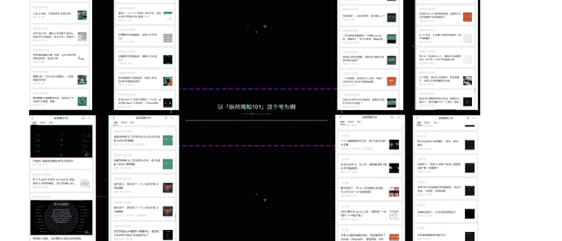

## 我公众号早期内容为例
## 最早开始写 AI 工作流（选题）
## 标题就像让人打开（趁热点，输干货）
## 文章的排版，写作，插图，封面（都用 AI 形成统一风格特调）
## 特别还用写热点总结干货演讲稿的方式
## 用转发撬动文章进入流量池
# 流量机制的本质
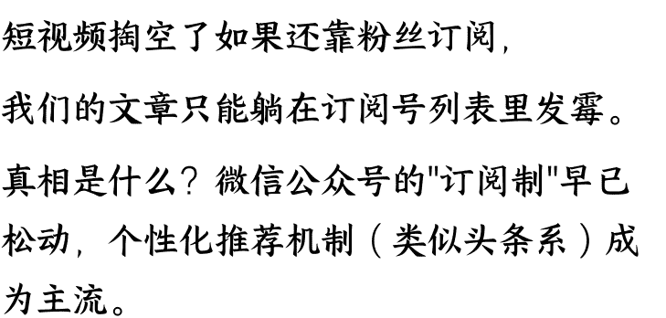

## 公众号的流量是怎么来的？
## 很多人会说："粉丝看的啊。"
## 公众号日活 3 亿看着唬人，但打开率早被短视频掏空了。如果还靠粉丝订阅，我们的文章只能躺在订阅号列表里发霉。
## 真相是什么？微信公众号的"订阅制"早已松动，个性化推荐机制（类似头条系）成为主流。
## 这意味着：内容质量 > 粉丝基数

一个公式，研究了 300 篇爆文后总结出来的：
总流量 = 曝光量 × 打开率 × 完读率 × 分享率 × 点赞率 × 转发率

看起来复杂？我拆开讲：
曝光量 = 选题相关度 × 平台推荐权重
什么意思？比如你写"深圳房价"，系统会自动推给关注房产、关注深圳、关注投资的用户。选题越精准，曝光越大。

打开率 = （标题吸引力 + 封面冲击力） × 信任度
这里有个关键——信任度。为什么同样的标题，有的号打开率 30%，有的只有 3%？因为用户会看账号名。如果你叫"营销小技巧"，用户会觉得你要卖课，关注你的可能是同行；如果你叫"老王聊职场"，用户会觉得你在分享经验。所以账号名字还是重要的。

完读率 = 内容质量 × 排版体验 × 节奏控制
同样 1W 浏览量，有的流量主 10 元，有的几十元。除了广告类型和插入数量，还有因为完读率高！广告分成不是按阅读量算的，是按"有效阅读"算的。什么叫有效阅读？读完 60%以上才算。所以，3000 字的文章，如果只有 30%的人读完，不如写 1500 字让 80%的人读完。

分享率 = 情绪共鸣 × 社交货币价值
什么文章会被分享？两种：
"说出了我想说但说不出的话"——情绪共鸣
"分享出去显得我有品位/有见识"——社交货币
举个例子：《你没穷过，你不懂》这种标题，穷人看了想分享（共鸣），富人看了也想分享（显示同理心）。

# 数据分析的价值
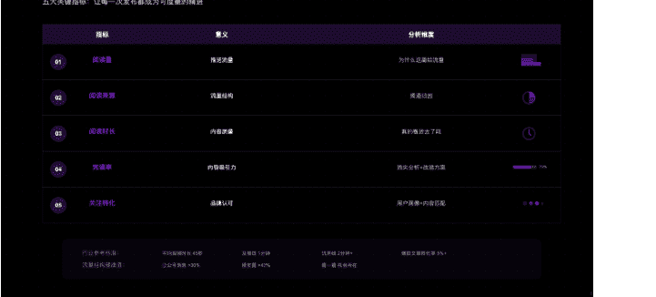
通过 5 个数据分析指标，能清晰度量我们文章的问题会在哪里。

## 第一个指标：阅读量
如果阅读量低于粉丝数的10%，说明什么？说明你的选题，连老粉丝都不感兴趣。这时候，要反思选题策略。

## 第二个指标：阅读来源构成
理想的比例是：公众号消息30%，朋友圈40%，看一看30%。
如果"公众号消息"占比过高（>60%），说明你在吃老本，没有破圈。
如果"朋友圈"占比过低（<20%），说明内容缺乏社交属性。
如果"推荐"是0，说明你还没进入算法推荐池。

## 第三个指标：平均阅读时长
行业平均是45秒，及格线是1分钟，优秀线是2分钟+。如果你的文章3000字，阅读时长只有30秒，说明什么？说明读者看了开头就跑了。问题可能是：
- 开头太无聊
- 排版太密集
- 内容太水

## 第四个指标：完读率
这是最被忽视，但最重要的指标。算法特别看重完读率，因为这代表内容质量。
如何提高完读率？三个技巧：
- 开头设置悬念，"看到最后有彩蛋"
- 中间设置转折，“但是，事情没那么简单”
- 结尾设置回扣，“还记得开头的问题吗？”

## 第五个指标：阅读后关注率
普通文章 0.5%，优质文章 2%，爆款文章 5%+。如果你的文章阅读量很高，但关注转化很低，说明什么？说明你的内容"有流量无价值"。读者看个热闹就走了，不认为你值得长期关注。

## 表面数据 VS 核心数据
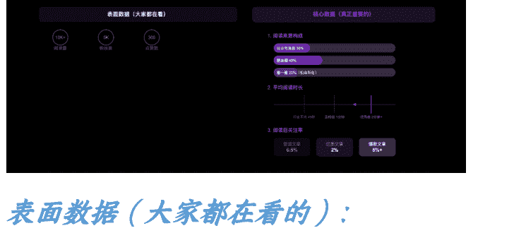
表面数据（大家都在看的）：
- 阅读量
- 粉丝数
- 点赞数
这些数据能满足虚荣心，但解决不了实际问题。

核心数据（真正重要的）：
- 阅读来源构成
我刚才讲了，但这里要补充一个秘密：如果你的"看一看"流量突然增加，说明什么？说明你触发了算法的"优质内容池"。微信有个机制，会把优质内容放进一个池子，优先推荐。一旦进了这个池子，后续文章都会有流量扶持。

## 怎么进池子？
- 完读率>60%
- 分享率>5%
- 收藏率>3%
- 没有违规记录

## 平均阅读时长
刚才说了，2分钟是优秀线。但还有个细节：如果你的文章3000字，平均阅读3分钟，说明什么？说明读得很认真。如果只有30秒呢？说明用户在“扫”，不是在“读”。这个差别，直接影响广告分成。认真读的用户，点广告的概率高3倍。

## 阅读后关注率
这是最被低估的指标。
某新号仅凭3篇行业分析文章，通过算法推荐触达泛兴趣用户，单篇阅读量破10万。
为什么新号也能爆？因为算法会看“阅读后关注率”。新号如果这个指标高，系统会判定为“优质新内容创作者”，给予流量扶持。这就是新手红利期。

## 数据复盘三步：
第一步：找异常。哪个指标明显低于平均值？那就是你的短板。
第二步：找原因。为什么会出现这个异常？是选题问题、标题问题、还是内容问题？
第三步：找对策。针对问题，制定改进方案。下次发文，重点优化这个指标。
比如，你发现完读率只有 20%。你去分析，发现读者在第三段大量流失。你看第三段，发现有个 500 字的大段落。下次，你就知道要拆分段落了。
凭感觉做内容，总是没底的，要让数据告诉我们答案。数据分析的真正价值不是告诉你昨天怎么样，而是告诉你明天该怎么做。

## 数据分析工具：

公众号后台和公众号助手 APP
公众号数据分析平台：
https://www.bijiandata.com/dc/v53e930Y
（免费，PC 端使用）

## 新榜：https://www.newrank.cn/
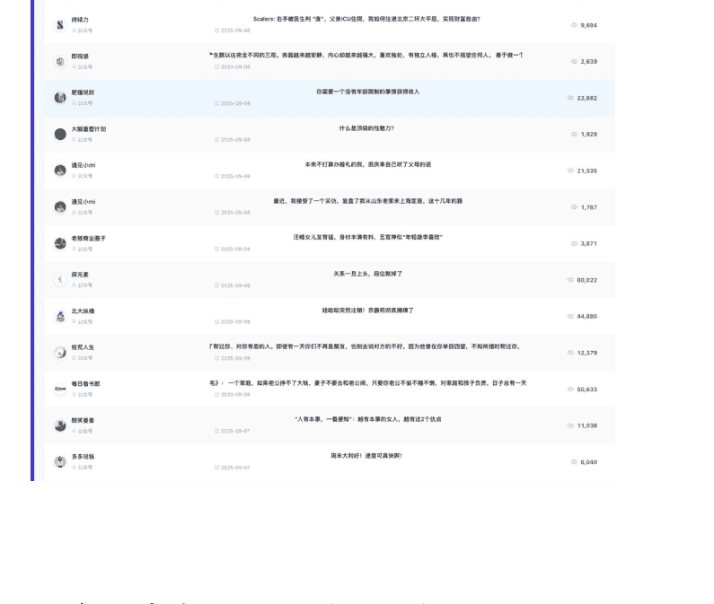

## 公众号内容 - AI 写长文和图文
目前公众号主流的内容类型有：
- 公众号-长文：（2000-5000 字）
- 公众号-图文（图片为主）
- 公众号-漫画（年轻化，有趣）
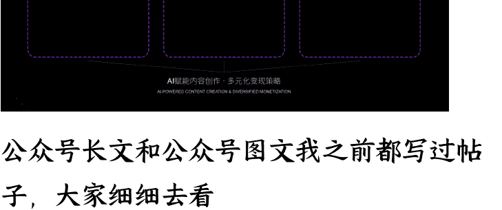
公众号长文和公众号图文我之前都写过帖子，大家细细去看。

## ( AI 写长文 )
## 文档目录：
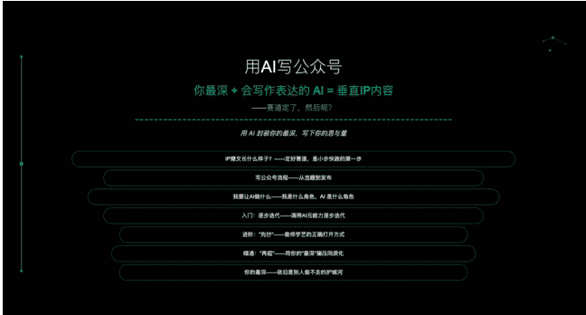
我就重点讲一下如何使用我提供的开源工具。

## 公众号优化工具箱
地址：
https://www.coze.cn/s/ptTWjkbWgvo/
( 移动端，电脑端都支持 )
权限：一天免费 20 次使用
使用方法：

## 笔尖有脑子 字里有想法
AI文案不是取代创作者，而是放大他们的独特性。有思想的你+会写作的智能笔尖=未来的AI作家。
一键直达【AI爆文写作神器】满血版

## 风格解析
解锁写作密码

## 标题优化
让标题自带流量

## 选题探索
探索你的专属选题

## 账号诊断
数据驱动成长

## 文章生成
今天想要创作什么？

## 风格解析：对标文章风格提取

## 智能笔尖-风格解析
### 输入内容
文本内容
请输入需要分析的文章内容 0/10000
------或者------
公众号链接
https://mp.weixin.qq.com/s?__t
🚀 开始解析风格
嘿！我是你的写作风格探索伙伴～
这篇关于"魅力"的文章很有意思，不是单纯讲颜值，而是探讨了更深层次的吸引力。让我带你一起潜入文字背后，看看作者是如何把这个话题讲得如此有说服力又实用的。

### 风格探索日志:
- 【初见印象】读完第一遍，我被作者把"长得一般...
- 【风格直觉】这作者像是个"生活观察家+实用指南...
- 【意外发现】等等，作者在这里用了个小心机，先...
- 【技巧解密】原来开头那句"有些人明明长得一般...
- 【结构拆解】文章架构有点像TED演讲，但又不完...
- 【语言特色】作者喜欢用"比如"、"举个例子"这种...
- 【修辞偏好】发现大量使用"对比"手法，效果是让...
- 【段落节奏】长短句搭配有个规律：提出观点用短...
- 【过渡技巧】段与段之间用数字标题（01、02）和...
- 【隐藏彩蛋】发现一个细节：每个建议点都先点出...
- 【排版观察】Markdown用得简洁直接，没有花里...
- 【风格DNA】如果给这种风格起个名字，我会叫它...
- 【学习笔记】最值得偷师的是"现象-原理-案例-方...

### 输入：
学习的行文风格原文或者对标文章公众号链接。输出

嘿！我是你的写作风格探索伙伴～
这篇关于“魅力”的文章很有意思，不是单纯讲颜值，而是探讨了更深层次的吸引力。让我带你一起潜入文字背后，看看作者是如何把这个话题讲得如此有说服力又实用的。

风格探索日志：
【初见印象】读完第一遍，我被作者把“长得一般但很有吸引力”这种现象讲得特别透彻，瞬间就理解了这个概念。
【风格直觉】这作者是个“生活观察家+实用指南”，不是那种高高在上的理论派，而是能落到实处的“过来人”。
【意外发现】等等，作者在这里用了个小心机，先说“长得一般”，再转折“很有吸引力”，这种反差让人忍不住往下看。
【技巧解密】原来开头那句“有些人明明长得一般，但就是感觉好看”不是废话，是钩子，用来抓住读者好奇心的。
【结构拆解】文章架构有点像TED演讲，但又不完全一样，中间穿插了很多具体的“可操作建议”，不只是讲道理。
【语言特色】作者喜欢用“比如”、“举个例子”这种口语化的连接词，让复杂的概念变得很容易懂，像是在聊天。
【修辞偏好】发现大量使用“对比”手法，效果是让读者更容易理解。比如把“静态美”和“动态吸引力”放在一起比较。
【段落节奏】长短句搭配有个规律：提出观点用短句，解释原理用长句，读起来不累，而且重点突出。
【过渡技巧】段与段之间用数字标题（01、02）和加粗关键词，引导读者视线，让逻辑链条非常清晰。
【隐藏彩蛋】发现一个细节：每个建议点都先点出“原理”，再给“步骤”，这样读者不仅知道怎么做，还知道为什么。
【排版观察】Markdown用得简洁直接，没有花里胡哨的表情包，全靠文字力量，显得很专业、很干货。
【风格DNA】如果给这种风格起个名字，我会叫它“理性感性平衡体”——用理性的结构包装感性的内容。
【学习笔记】最值得偷师的是“现象-原理-案例-方案”这个万能公式，下次写任何话题都可以套用。

智能笔尖写作风格拆解：
【风格画像】
风格命名：生活现象解码体
一句话概括：用科学原理和生活案例解构日常困惑，给出可执行建议。
适用场景：生活指南、个人提升、心理学普及类文章。

【核心解析】
一：反差式开头
拆解：以“明明长得一般，但就是感觉好看”这种反直觉的现象开场。
偷师要点：找出你主题领域中普遍存在的反直觉现象作为切入点。
二：科学+案例双支撑
拆解：每个观点既有《神经美学》这样的科学依据，也有生活案例佐证。
偷师要点：提出观点后，立即跟上“研究表明...”或“比如...”来增强可信度。
三：四段式解释法
拆解：现象描述→原理分析→案例佐证→实际应用。这个结构保证了逻辑的完整性。
偷师要点：解释复杂概念时，遵循“是什么→为什么→例子→怎么做”的路径。
四：口语化专业表达
拆解：将专业概念用日常语言转化，如把“神经美学”转化为“大脑如何产生愉悦感”。
偷师要点：用读者已有的生活经验解释专业概念，降低理解门槛。
五：问题-危害-方案结构
拆解：每个建议点都遵循“指出问题→分析危害→给出方案”的逻辑。
偷师要点：在提出建议前，先让读者意识到问题的重要性，再给方案。
六：对比强化法
拆解：通过“静态美vs动态美”、“颜值红利vs吸引力”的对比，让概念更清晰。
偷师要点：为你的核心概念找一个相反或相关的概念进行对比。
七：亲和力表达
拆解：使用“我们”、“咱们”等包容性代词，创造共同学习的氛围。
偷师要点：在讲解专业内容时，适当加入个人化语气，拉近距离。
八：数字标题系统
拆解：用“01、02”做主标题，“1) 2) 3)”做次级标题，层级分明。
偷师要点：复杂内容用数字分级呈现，帮助读者快速导航。

【写作结构拆解】

## 账号诊断：
输入公众号运营困惑、后台数据截图
输出入门诊断建议：
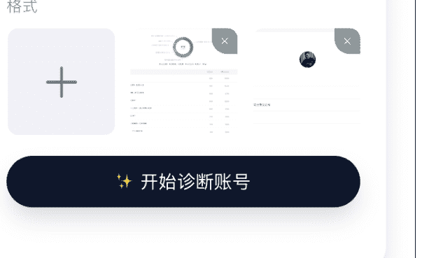
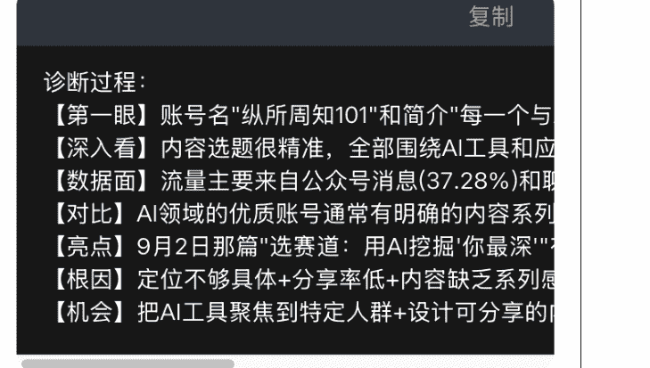
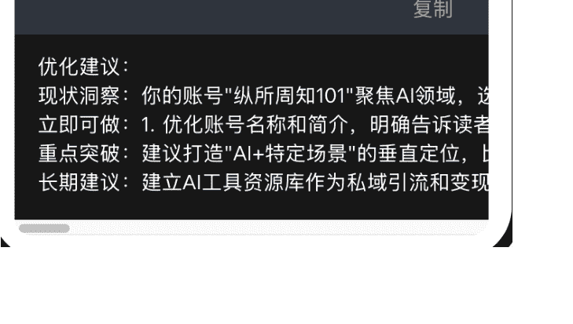

## 账号诊断
文章作业/数据截图/运营困惑/内容...
如何引导加入私域
可以上传相关数据图片
上限 5 张图片，最大 5 MB/个，支持 png、jpg 格式
✨ 开始诊断账号
> 复制
诊断过程：
【第一眼】账号定位是"AI协作方式"，这个领域私
【深入看】数据显示总流量3.7万次，其中公众号
【数据面】爆款文章有4001阅读量，但如果没有引
【对比】同类AI账号都是在干货内容后给出专属资
【亮点】你的文章选题很精准，"AI挖掘你最深"这
【根因】看账号资料页，没有明显的私域入口和引
【机会】最大提升空间在内容结尾引导+公众号菜
> 复制
优化建议：
现状洞察：你的"众所周知101"账号聚焦AI协作领

## 标题优化：
输入原标题，改写或者优化为 IP 文标题

## 标题锻造室：
标题锻造室：
【选题挖掘】
原始选题：传统人际关系智慧/老祖宗忠告
潜在选题库：[人际关系边界-流量A级][传统智慧]
最优选题：社交断舍离（选择理由：结合传统智慧

【观点锐化】
原始观点：老祖宗关于人际交往的忠告很重要（模
观点类型选择：
- ☑ 共鸣式的认同感：说出心里话
- ☑ 反认知的希望感：颠覆常规+新路径
- ☐ 超认知的干货感：新概念+价值感
- ☐ 有争议的讨论感：激发讨论欲

观点升级路径：
模糊观点"老祖宗的忠告别不当回事" → 笃定化"老
最终观点：人际关系的生死线，都在老人言里（10

【精简化表达】
第一稿：老祖宗的人际关系忠告：邻居两不交，亲
第二稿：人际关系生死线：邻居两不交，亲戚三不
第三稿：人际生死线：邻居两不交，亲戚三不走（

【公式验证】
选题（社交断舍离）+ 观点（人际关系有生死线）

【人味检测】
场景感 ✅：立即让人联想到处理麻烦邻居和亲戚的
可信度 ✅："老人言"形式增加真实感和历史验证感
意外感 ✅："生死线"比喻让人意外但又觉得合理
共鸣感 ✅：戳中现代人处理复杂人际关系的痛点
记忆感 ✅："两不交"和"三不走"形成易记的数字对
价值密度 ✅：明确告知具体的社交边界原则
点击冲动 ✅：让人想知道具体是哪两不交和哪三不
笃定感 ✅："生死线"表达100%确定的重要性

【策略分析】
基于4大观点类型，生成10种不同角度的标题...

爆款标题矩阵
| 观点类型 | 优化后标题 |
|---|---|
| 反认知希望 | 越懂拒绝，朋友越多 |
| 共鸣认同 | 你的善良，需要边界 |
| 超认知干货 | 人际生死线：两不交，三不走 |
| 争议讨论 | 亲戚要远，邻居要疏 |
| 数字笃定 | 3种亲戚，必须断联 |
| 场景代入 | 当亲戚越界时，我学会了说不 |

## 选题探索
输入赛道定位 | 对标选题 | 对标文链接
探索新选题

## 智能笔尖选题探索
### 【账号定位分析】
核心赛道：社会观察与个人成长
专业深度：A级（判断依据：能结合社会学理论分析）
独特优势：将社会学理论与生活案例结合，视角独特
目标用户：都市中产阶级及奋斗者，核心诉求是认知共鸣

### 【四要素扫描】
你最深：在社会阶层分析与个人成长路径有深入思考
情绪点：当下用户最焦虑（阶层固化）+ 希望（突破现状）
热点池：[阶层固化-持续型] [消费降级与升级-周期性]
痛点库：[审美焦虑-表层] [向上突破无门-中层] [认知局限-深层]

### 【选题公式应用】
公式验证：你最深（阶层认知）× 情绪（焦虑+希望）× 热点 × 痛点 = 爆款选题
= 爆款选题原型：审美与阶层的关系及突破之道

### 【爆款潜力评估】
独特性 ✅：将审美作为阶层分析切入点，视角新颖
需求度 ✅：精准触达中产阶级的身份焦虑和成长渴望
时效性 ✅：阶层话题长盛不衰，经济环境下更受关注
价值感 ✅：提供了具体的突破方法和认知升级路径
传播力 ✅：案例贴近生活，观点易引发共鸣和讨论

### 【选题策略分析】
基于审美与阶层这一核心，从不同角度延伸出10种爆款选题方向如下：

### 爆款选题矩阵
| 选题方向 |
|---|
| 你觉得什么好看，什么就是你的阶层 |
| 30岁才明白：我们都活在别人定义的"好看"里 |
| "越没Logo越高贵"是最大的阶层谎言 |
| 为什么你月薪3万，审美还停留在月薪5千 |
| 从住500到2000酒店：那次"肉疼体验"如何改变了你的认知 |
| 3个步骤，跳出你阶层的审美牢笼 |
| 5000个家庭审美调查：阶层是如何通过家居暴露的 |
| 从县城到上海：我的审美被按在地上摩擦的5年 |
| 县城vs一线城市：两套房子暴露的审美鸿沟 |

## 文章生成
输入:行文风格+标题
生成文章

## 文章生成（豆包版）
文章标题
人际生死线：两不交，三不走（13/2000）
文章风格
智能笔尖写作风格拆解： 1880/2000

### 人际生死线：两不交，三不走
你有没有发现一个奇怪的现象：有些人明明社交圈很广，知心朋友却没几个；有些人平时不声不响，却总能在关键时刻得到别人的真心相助。

这背后其实藏着一套大多数人都不知道的人际交往“生存法则”。我们今天要聊的“两不交，三不走”，就是这套法则的核心密码。

### 01 这两种人，再热情也别深交

#### 1）情绪吸血鬼——他们会榨干你的能量
不知道你身上有没有这样的人？每次聊天都是吐槽抱怨，把你当情绪垃圾桶；你分享好消息，他总能泼冷水；你遇到困难，他比你还焦虑，最后还得你反过来安慰他。

心理学上把这种人称为“情绪吸血鬼”。他们自己无法处理负面情绪，只能通过消耗别人的积极能量来维持心理平衡。

我一个朋友小张就吃过这个亏。她有个大学同学，每次见面都要吐槽工作、抱怨老板、数落同事。起初小张总是耐心安慰，但半年后发现自己变得越来越消极，甚至开始对生活失去热情。有次她终于忍不住说“我们能不能聊点开心的事”，对方竟然说“你怎么变得这么冷漠”。

**神经科学研究表明：长期被动接收负面情绪，会导致大脑杏仁核过度活跃，皮质醇水平升高，不仅影响情绪，还会损害免疫力。**

识别信号：
- 每次和TA相处后你都感到疲惫
- TA只谈自己的问题，从不关心你的状况

或者可以直接试一试智能笔尖，非免费（圈友可以找我打折）
地址：
https://www.aibijian.com/dc/v53e930y
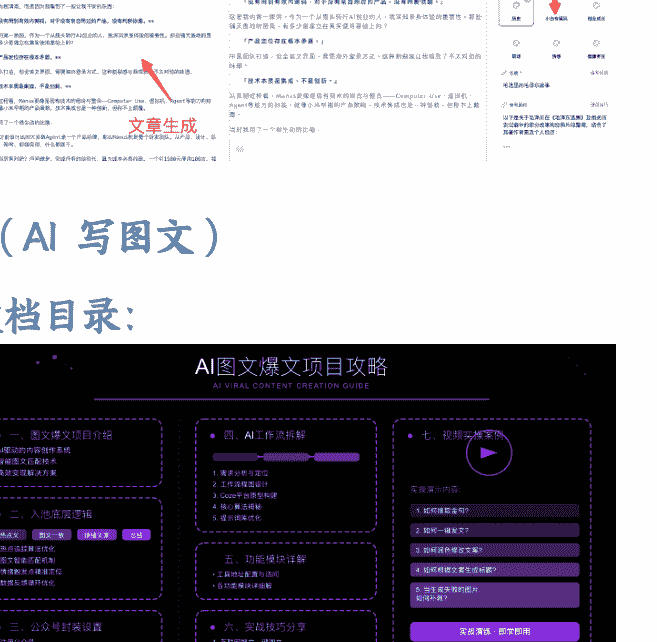

### 文档目录：
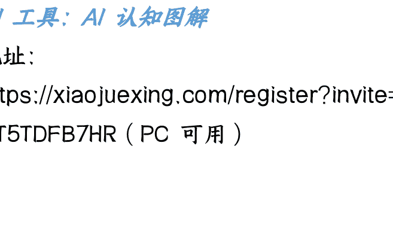
我觉得现在更适合用知识卡片放在小绿书或者放在长文类的图文馆

### AI 工具：AI 认知图解
地址：
https://xiaojuexing.com/register?invite=ST5TDFB7HR（PC 可用）

### 公众号懒人搜索，懒人专属群分享
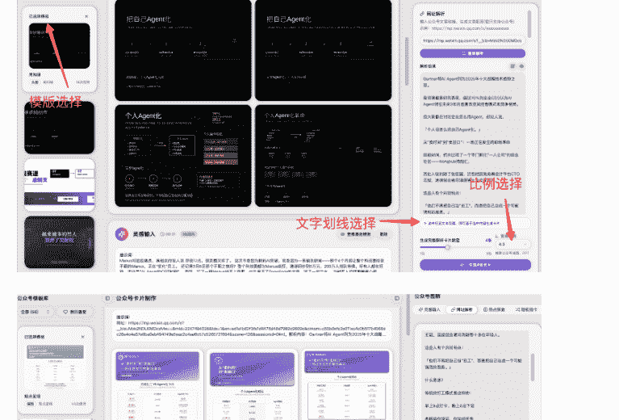
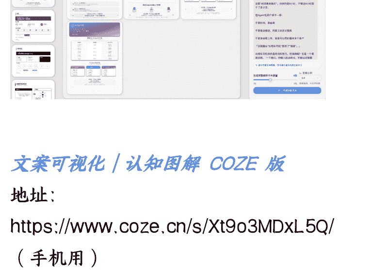

### 文案可视化 | 认知图解 COZE 版
地址：
https://www.coze.cn/s/Xt9o3MDxL5Q/（手机用）

## 脑子乱？图解清！
### 小而美的让思考看得见
> 人知一张图，胜过千万字
一键直达「认知图解满血版」
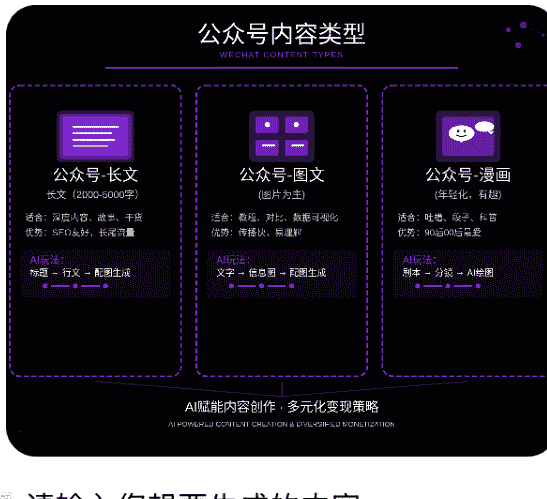
请输入您想要生成的内容：
垂直小号的核心公式是：你最深 × 情绪 × 热点 × 痛点 = 爆款 = 小号大流量。新号只要围绕“专业、深耕、细分领域、价值密度高”来创作，即便暂时不是专家 fake it until you make it 只要敢尝试，也能脱颖而出。
生成同款图片
比例选择
3:4 小红书封面

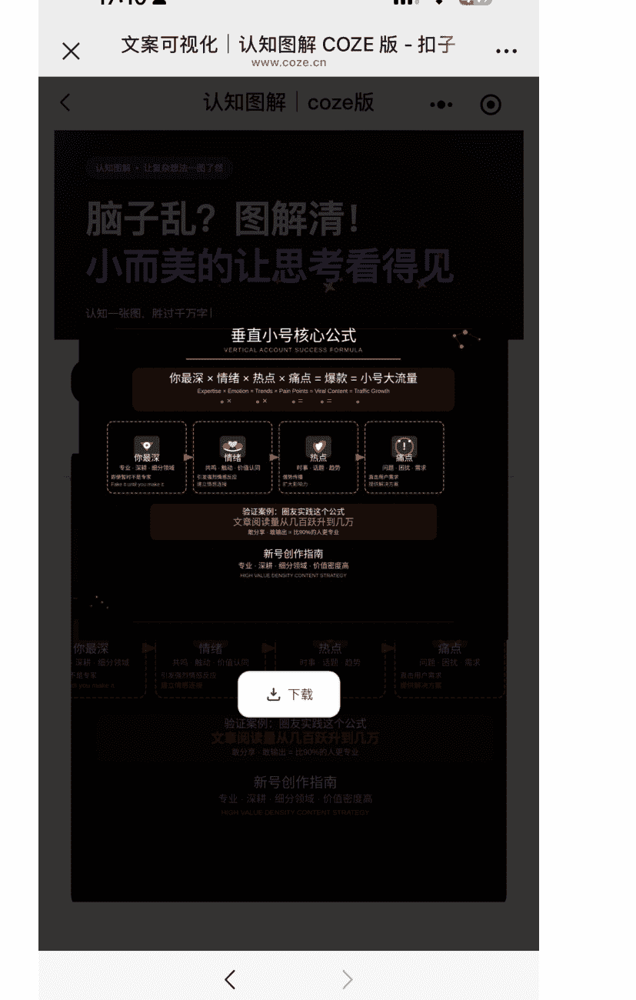
输入文字，即可得出可视化的知识卡片
其实，小红书，公众号配图同理，就是用有价值图文实现转发逻辑，撬动流量池。

### 公众号内容 - AI 写漫画
再聊聊最有趣的——漫画。

你可能觉得，漫画太难了，AI 绘画技术最近有一大波更新和突破，解决人物一致性和不稳定的问题。

### 为什么要做漫画？三个理由：
- 90 后 00 后最爱（目标用户年轻化）
- 传播性极强（一张图就能刷屏）
- 记忆度最高（故事+画面双重刺激）

### 免费漫画开源工具
超级图图地址：
https://www.coze.cn/s/dozwtrTczzA/

### 文档目录：
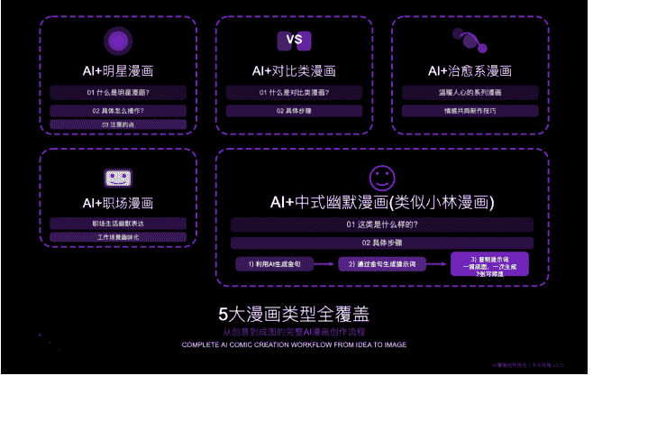

### 公众号提示词和 AI 写作文章合集
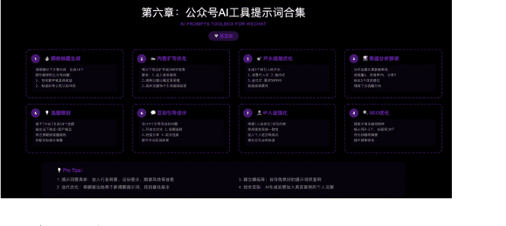
还有几篇关于 AI 写作合集，大家在我的公众号「纵所周知 101」搜索就好

### 公众号懒人搜索，懒人专属群分享

手把手教你写一篇公众号文章，从写作、排版、AI检测到发布 原创
大部分人用Claude写公众号，就像拿着屠龙刀切豆腐
...说： AI写作不是让你变成机器，而...
3,835  98  795  29  15  5  ¥0.00

Claude 3.7 重新定义写作 原创
Claude 3.7 的能力很好去理解想要思想的封装。
...e 3.7 重新定义写作 我真正想表达的是： Claude 3.7 不是在改变写...
11,587  176  1,276  51  16  48  ¥5.00

体制内，我们的AI 写作工作流，能替代“笔杆子”吗？ 原创
会用 AI 的笔杆子 > 纯手工的笔杆子。
...制内的粉丝聊 AI 写作， 他们说，年底...
2,464  46  319  7  3  0  ¥0.00

我用 AI 工作流写了一篇文章，单日收益 4722元，这才是未来写作新范式 原创 已修改
写作是人类突破时空限制、实现思想与知识流动的最佳途径 万年前的石头， 千年前的木简 百年前
...，引导 AI 写作： 生成内容，启发灵感各流程灵感 明确 AI +人的工...
56,884  688  5,968  280  40  22  ¥76.66  1

15 个常用的DeepSeek创意写作提示词，建议收藏！ 原创
公众号点击“登录觉醒星球”免费获取
创意写作类 （15 个） ...
16,832  286  3,187  204  11  57

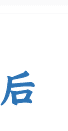
收藏！12 个 AI 写作常用的干货提示词
17,073  215  1,948  114  1  3

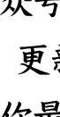
我是如何用AI工作流写作公众号,45天涨粉14000(实操篇) 原创 已修改
"在这个 AI 时代，我们的价值究竟在哪里？"
...觉得人为参与 AI 写作提效比例是 选题阶段：人 80%+AI 提供 20...
15,723  215  2,335  96  12  13  ¥33.88

用AI认知图解给公众号配图太香了，头图，插图，一键搞定 原创
半年前的深夜3点，我第17次按下Ctrl+Z，撤销刚才的操作。
...偏欧美风，不符合中文公众号调性； 每次都要从零开始，没有针对公...
1,719  26  137  5  13  0  ¥0.00

### 最后
公众号成功 = （选题精准度 × 内容质量 × 更新频率） × AI 工具效率 × 认知（你最深）持续积累

> "当所有人都在用同样的 AI 时，真正的竞争力不是 AI 本身，而是你训练 AI 的'独家数据'和'独特视角'"

认知深度，决定你的上限。 执行效率，决定你的速度。 持续积累，决定我们的持续复利。 AI 赋能，是这一切的指数级放大。

技术会变，平台会变，算法会变。 不变的，是人性。 永恒的，是价值。

当我们真正理解用户，真正创造价值，真正建立信任。 无论有没有 AI，你都是赢家。

别被工具绑架，要让工具为我们的思想服务！

周知，记录于台风夜。持续更新，建议收藏。

最后，安利小懒的付费群：

### 懒人专属群（介绍）

📖 懒人专属群持续更新中，已持续运营 6 年，整理超 3000 份各类精选付费文章 & 年费社群干货，全部开放下载。

本资料为付费群内部分享，仅供真实有需要的朋友查阅 🙇‍♂️

懒人专属群更新记录：
https://lazy2025.top/blog/record2

懒人专属群更新记录（需梯子，备用）：
https://lazybook.fun/blog/record2