# 小红书一键批量二创笔记图文保姆级教程！

250929 生财精华

公众号懒人搜索，懒人专属群独享

懒人微信：lazyhelper


大家好，我是甜甜！做过电商的小伙伴都知道，同行是最好的老师适用于任何项目，那么我们在小红书上做 AI 虚拟电商项目也是同样的逻辑，抄爆款就是最快的路径。而小红书笔记分为标题、正文和封面，常规操作我们需要到作图软件作图，AI 去二创笔记，一整套下来十分钟、二十分钟过去了，所以我就想简化一下整个流程，提高效率，而 AI 恰好能做到！

所以这个教程我会教大家如何用飞书的多维表格+Coze 工作流，实现只需要输入小红书链接，就能批量制作小红书爆款图文和封面的教程。非常方便，过程并不复杂，只需要一步步跟着教程来，你也能做到，高效赚钱。可以先看一下视频生成的效果。

全程使用到的工具：飞书多维表格、Coze工作流

## 第一步：建立多维表格

打开飞书：

```
https://jcnql2b38je5.feishu.cn/drive/home/
```

点击飞书主页的新建，下拉菜单中选择点击多维表格。

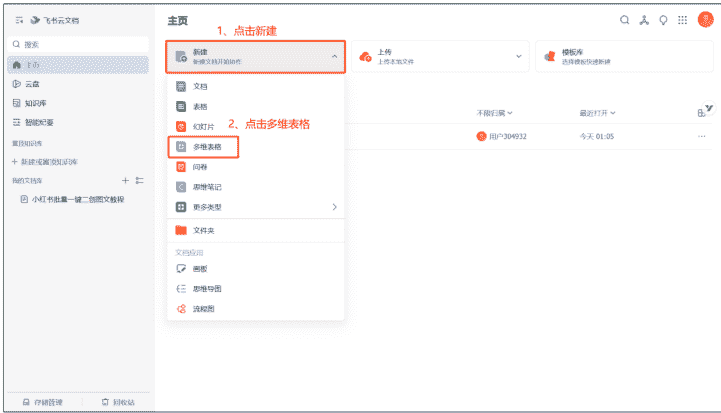

点击新建多维表格。

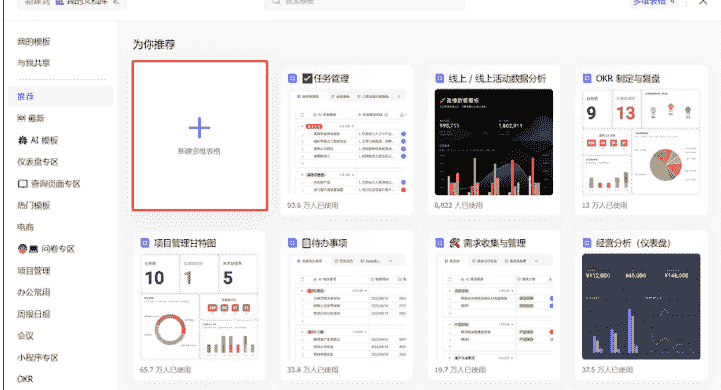

下面就是多维表格的原始页面，我们鼠标放到第一列，点击倒三角，就会出现下拉菜单，选择修改字段/列。

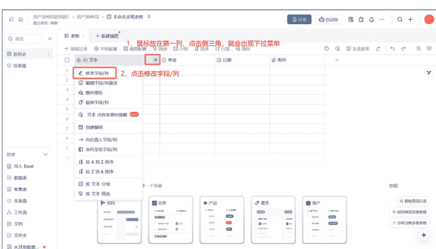

把标题修改成“小红书链接”，修改完成后点击确定即可。这一列目的就是放小红书的链接，实现只需要输入链接，就能实现二创。

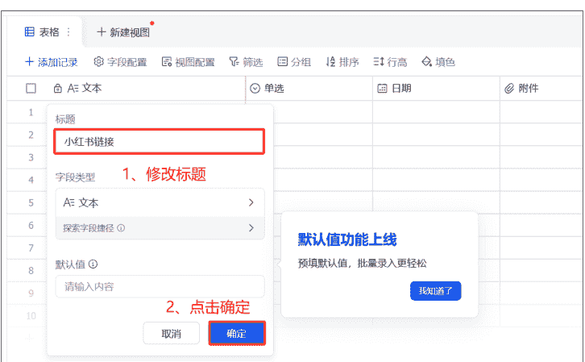

那么第二列的作用就是读取第一列的小红书链接，把小红书链接的标题和正文提取出来。多维表格自身是实现不了这个功能的，我们就要借助扣子的工作流来达到这个目的。

## 第二步：建立工作流（能提取小红书链接标题和正文的工作流）

首先打开扣子：

```
https://www.coze.cn/home
```

下面就是扣子的主页，我们点击资源库。


点击右上角的资源，选择工作流，就进入了创建工作流界面。

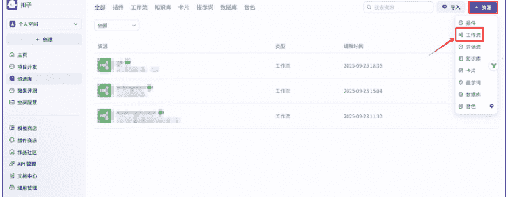

在创建工作流界面，需要先写工作流名称，这个可以自己命名，但需要注意的是，只能写英文、数字、下划线，不能使用中文。工作流描述可以按照自己的想法填写，这个不重要，完成后点击确定即可。

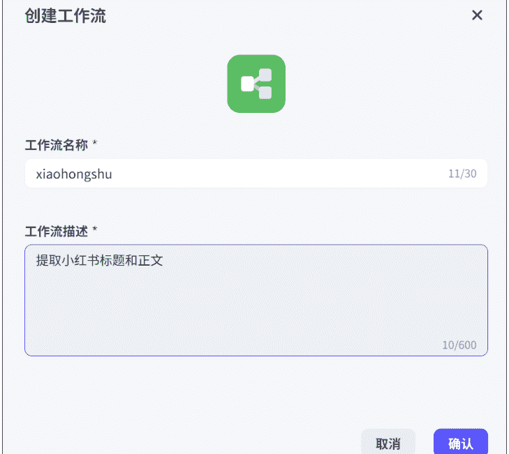

这就正式到了工作流制作界面，看着一脸懵，没关系，一点都不难，像我一点编程基础都没有，都能完成，很简单，你一定也可以。

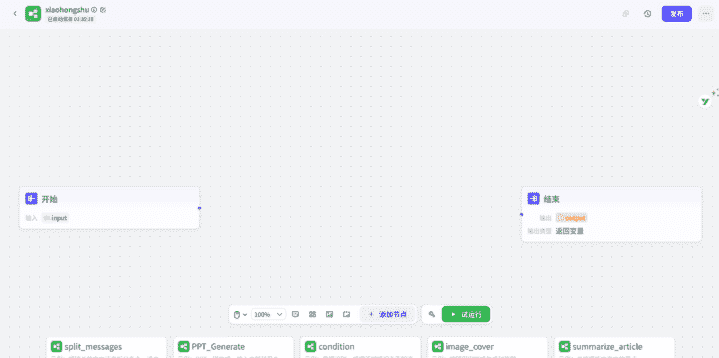

### 这里也普及一下，什么叫工作流

工作流就是一系列按照特定顺序、逻辑连接起来的步骤或任务，简单来说就是“让AI机器人照着我们给他的步骤干活”。

节点就是工作流中的每一个步骤或任务。

连接线，就是流程图里的箭头，它只表达一个意思：“做完这一步，然后呢？下一步该干嘛？”

初始的工作流界面只有输入和输出这两个节点，也就是起点和终点，我们要做的就是中间再加入一些步骤，来实现我们想要的功能。

我们这里想要实现的是能提取小红书链接的标题和正文，这个时候我们在添加节点这里，选择点击插件，去找直接现成可用的工具。

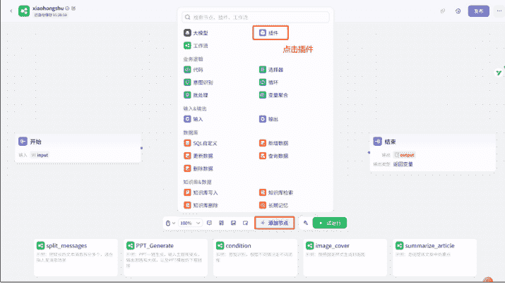

在搜索框里搜索“小红书提取”，在右侧就能找到对应的插件，这个插件的主要作用会清楚地描述出来。核实确实是我们想要的功能，点击添加。

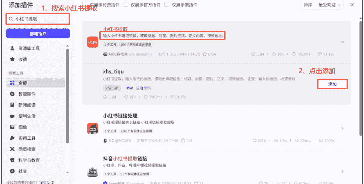

这样我们的节点就找完了，我们想要这几个节点联系起来，就要把连接线加上，整体的任务才能流动运转。节点的位置是可以任意调整的，只要连接线连上，不管多远都能运转。

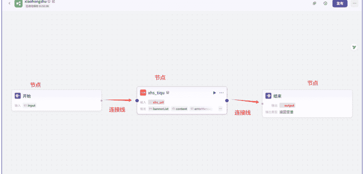

节点之间的连接线搭上之后，点击小红书提取节点，变量名选择开始 input。

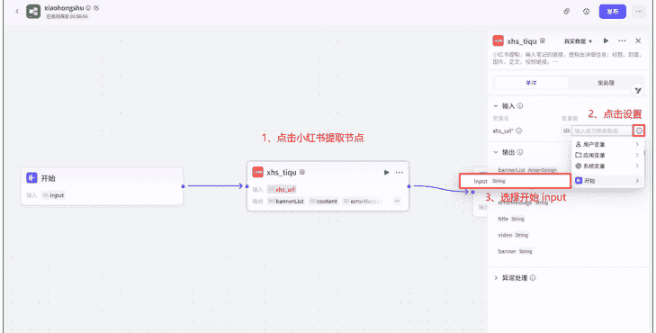

接着点击结束节点，默认只有一个输出变量，右上角可以点击添加。输出变量分别选择 title 和 content，对应的也就是标题和正文（如果选中之后，变量名称还是 output，建议改为对应的 title 和 content 名称）。

全部完成之后，点击试运行，测试是否能成功。我们选择一个小红书链接复制过来。

注意：小红书链接选择浏览器的链接，带有 xsec_token 的，不要选择右下角的分享链接。

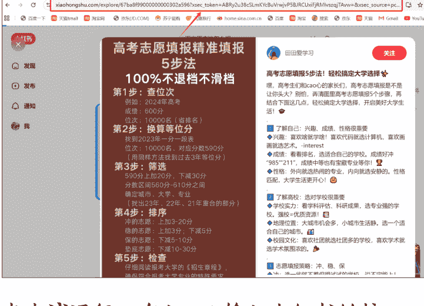

点击试运行，在 input 输入小红书链接，运行之后大概 2s 后就输出了结果，说明是正常的。

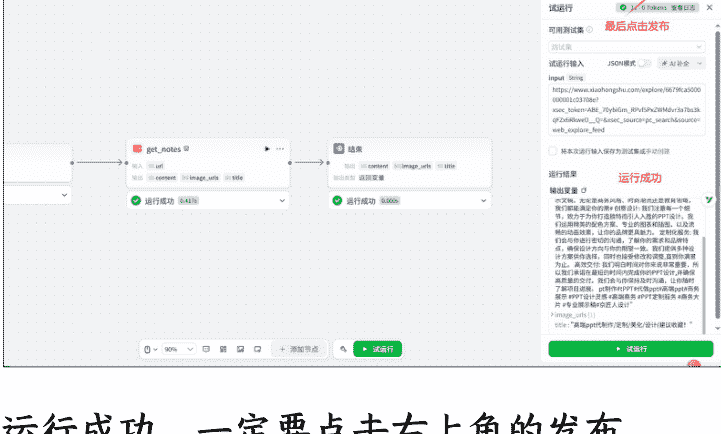

运行成功，一定要点击右上角的发布。

至此一个简单的工作流就搭建好了，下面是完整的视频操作流程。

## 第三步：多维表格配置扣子工作流

回到多维表格，我们创建第二列的内容，选择修改字段/列，这里我修改标题为“提取小红书链接”，字段类型选择探索字段捷径，搜索“扣子”，选中扣子工作流调用。

在扣子工作流的配置界面，我们需要填写以下信息，我们一个一个来填写。

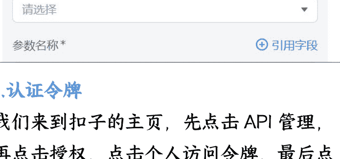

### 1. 认证令牌

我们来到扣子的主页，先点击 API 管理，再点击授权，点击个人访问令牌，最后点击添加。

或者点击链接: https://www.coze.cn/open/oauth/pats，直接跳转到个人访问令牌这里，点击添加。

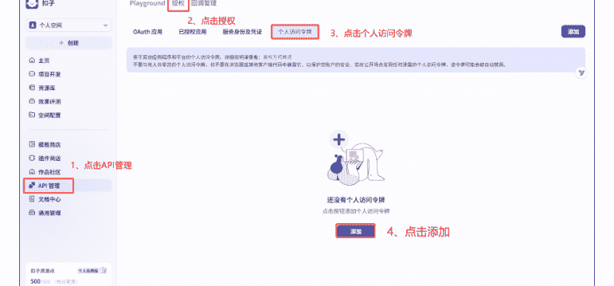

按照下面视频的操作，权限选择 run，选择指定工作空间和工作流的空间一致就行，最后点击确定，就会出现个人令牌，复制个人令牌到飞书表格扣子工作流配置中即可。

注意：令牌只会显示一次，记得收藏。

### 2. 工作流 ID

每一个工作流网址都会显示工作流 ID，要注意的是有两个 ID 号，我们一定要复制 workflow_id 后面的数字，粘贴到多维表格上即可。

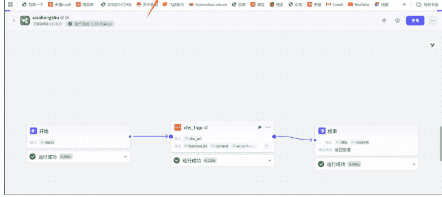

配置认证令牌,配置文档(鼠标移到图标上)* 引用字段
pat_CLIDugejmSfP7MlvJo
API区域
工作流ID* 引用字段
7554080455

### 3. 参数字段

- 参数字段选择第一列的小红书链接
- 参数名称填写 input
- 请求模板有两种填法：
  - 第一种是 `{"input":"引用的字段"}`，引用字段选择第一列的小红书链接
  - 第二种直接复制粘贴下面这段内容：
  ```json
  {
  "input":"$$input$$"
  }
  ```
- 输出结果 1 对应的工作流的输出变量1: title, 输出结果 2 对应工作流的输出变量 2: content
- 获取更多信息，把输出结果 1 和输出结果 2 勾选上
- 生成范围，可选择全列，或者自定义行数，这里我选择的默认，可根据自身情况自己调整，选择全列，就是一次性直接把全列生成
- 打开自动更新，打开自动更新的作用就是，我们在第一列输入链接，就会全自动运行接下来操作，不打开就要手动操作
- 点击确定，会跳转出来是否生成自定义，如果第一列有内容，点击生成，他就会自动生成出来全列结果，目前还没有，所以这里我选择了仅保存配置

到这里多维表格配置工作流就完成了，我们复制1个小红书链接，测试一下。

能看到输出结果很快就自动更新出来了，我们把输出结果列的标题改一下对应的名称，这里我分别改成了小红书正文和小红书标题，会更直观一些。

## 第四步：小红书正文二创

接下来我们的需求是要对小红书正文进行二创，我们选择最新一列执行这一操作。

在最新一列，标题改为：小红书正文二创。

探索字段捷径，搜索豆包，选择豆包1.6模型（想选择deepseek模型，可以直接搜索deepseek）。

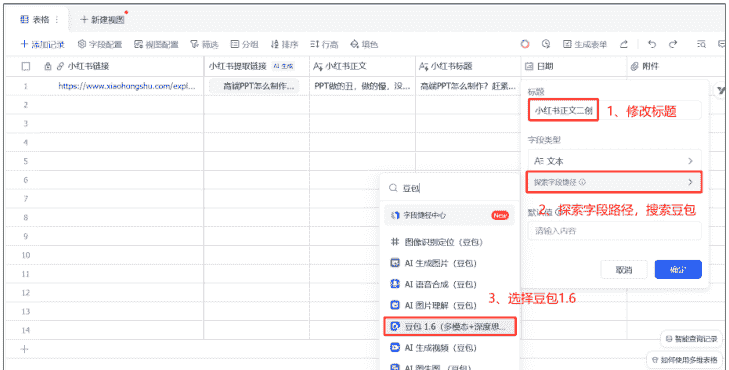

输入指令，引用小红书正文这个字段，指令也就是提示词，你想对这段内容进行处理，这里我的提示词很简单：“这是小红书的正文，请帮我写个类似的小红书文案，意思不变，字数差不多，标签直接照抄，输出结果能直接发布到小红书”。

大家也可以根据自己想要的输出结果调整提示词。

是否进行深度思考，这里我选择的是不进行深度思考，也可以选择 AI 自行判断。

获取更多信息，选择输出结果，打开自动更新，最后点击自动更新即可。

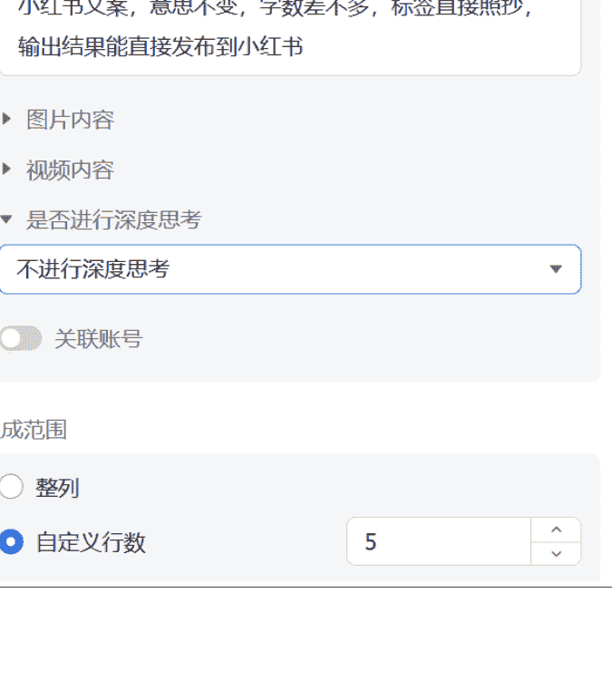

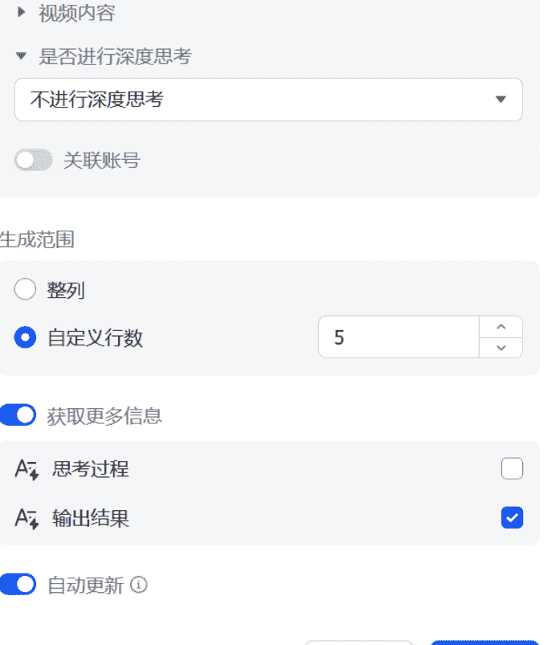

整体的操作和最后的效果大家可以看视频，输出的质量还是不错的。

如果生成的效果不满意，可以调整提示词或者点击更新，就会重新生成。

如果想对小红书标题二创，也是同样的操作。

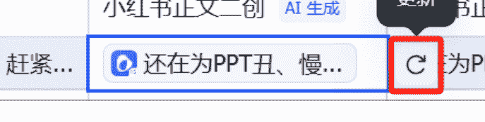

## 第五步：提取小红书主图

文章已经二创完成，接下来要做的是对小红书的爆款笔记主图进行二创，在二创之前，我们需要先把小红书主图图片提取出来，这个操作和小红书标题正文的提取步骤差不多。

回到扣子空间，新建工作流：https://www.coze.cn/home，路径是：资源库→点击资源→创建工作流→完善名称和描述→点击确定。

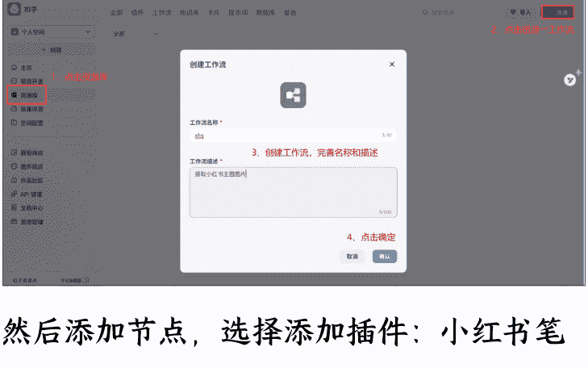

然后添加节点，选择添加插件：小红书笔记提取。

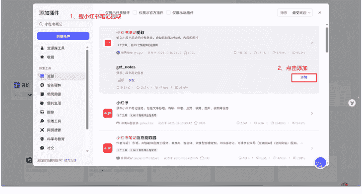

连上节点之间的连接线，点击小红书笔记提取节点，输入变量选择 input。

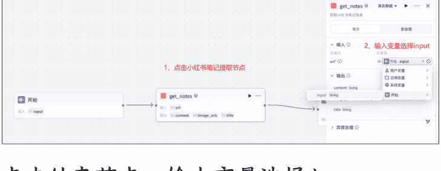

点击结束节点，输出变量选择 image。

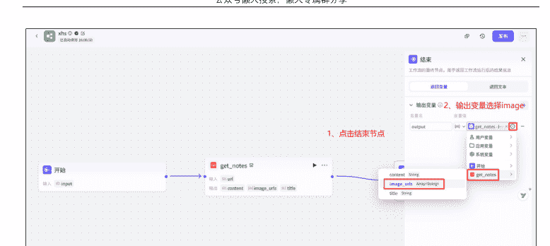

复制一个小红书链接，试运行，成功后点击右上角的发布即可。

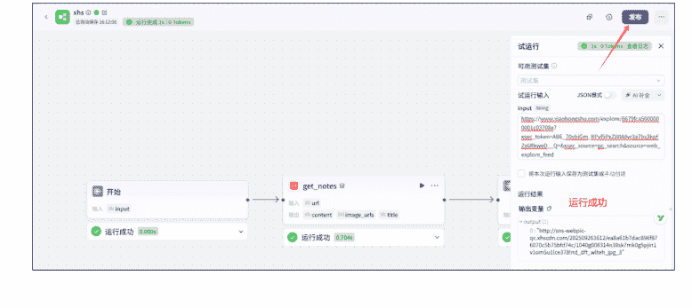

下面是整个过程视频操作，很简单。

## 第六步：多维表格再次配置扣子工作流

回到多维表格，选中最新一列，修改字段/列。

### 先修改标题名称

### 探索字段路径选择扣子工作流调用

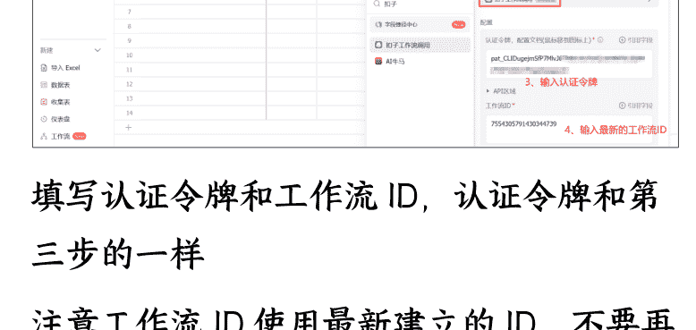

填写认证令牌和工作流 ID，认证令牌和第三步的一样。

注意工作流 ID 使用最新建立的 ID，不要再用第三步的了。

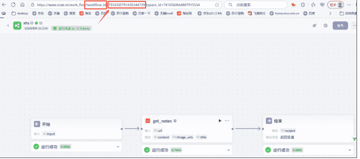

- 参数字段选择小红书链接
- 参数名称：input
- 请求模板同样是两种填法，都可以：
  - 第一种是 `{"input":"引用的字段"}`，引用字段选择第一列的小红书链接
  - 第二种直接复制粘贴下面这段内容：
  ```json
  {
  "input":"$$input$$"
  }
  ```
- 输出结果 1: output（这里要和工作流的输出变量名称一致，如果你的输出变量名称是 image，这里就填 image，我工作流里填的是 output，这里我填的就是 output）
- 输出结果 2：随便填
- 获取更多信息这里勾选输出结果 1
- 打开自动更新，最后点击确定

公众号懒人搜索，懒人专属群分享

参数字段 *
- 小红书链接
参数名称 * 引用字段
- input
超链接提取方式
附件提取方式
附件索引选择
请求模板 * 引用字段
- `{ "input":" 小红书链接  "}`
输出结果1 * 引用字段
- output
取消
确定
输出结果2 * 引用字段
- 1
生成范围
- 整列
自定义行数
- 5
获取更多信息
- 输出结果1
- 输出结果2
- 完整响应数据
自动更新
- 取消 / 确定

点击更新，小红书主图链接就生成出来了。

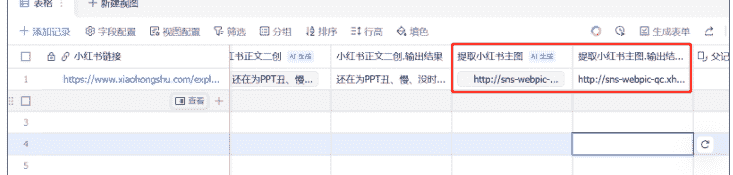

### 整个操作的视频流程可以查看视频

## 第七步：图片链接转成图片

上面的提取操作，我们只能提取图片的链接，并不能直接生成图片，所以我们要把链接转成图片。

多维表格再新建一列，标题改为小红书封面图。

探索字段捷径选择：链接转附件。

选择包含链接的字段，我们选中对应的小红书链接那一列就行。

打开自动更新，最后点击确定。

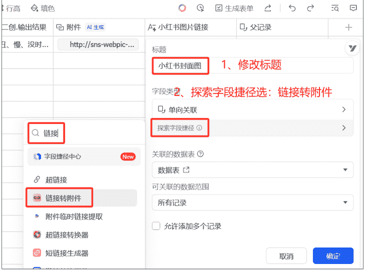

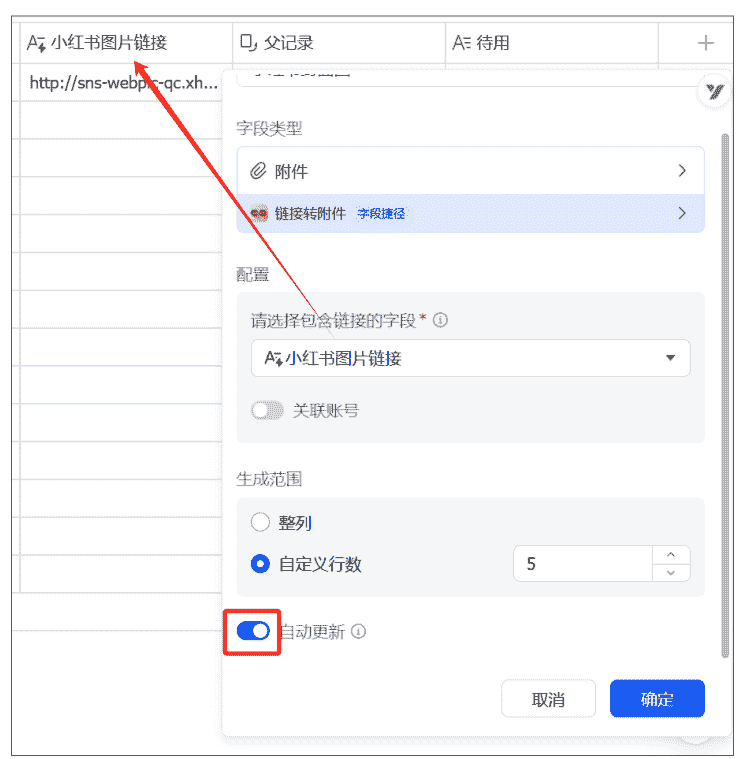

配置完成后，点击更新，小红书笔记里的所有图片就生成出来了，包含主图和次图。

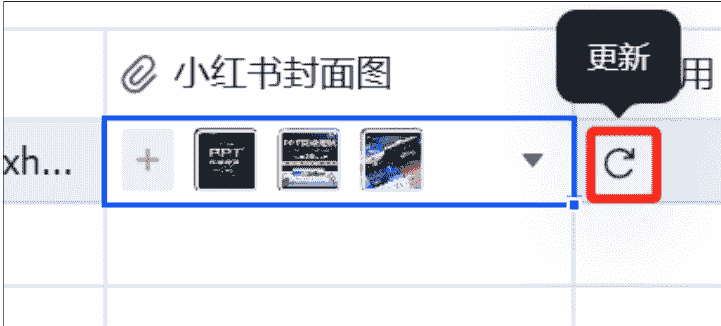

## 第八步：二创图片

这里二创图片的逻辑是我们先让 AI 反推原图图片提示词，再让 AI 根据提示词去生成新的图片。

### 1. 新建 AI 反推提示词列

这里先进行 AI 反推提示词，我们多维表格再新建一列，名称改为 AI 图片理解。

探索字段捷径选择：AI 图片理解（豆包）。

配置原图选择小红书封面图那一列。

打开自动更新，最后点击确定。

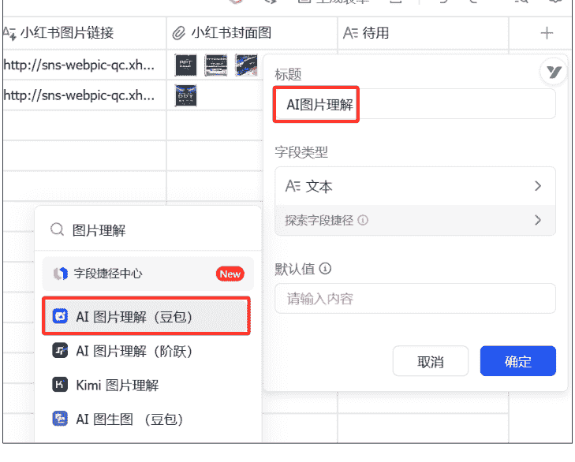

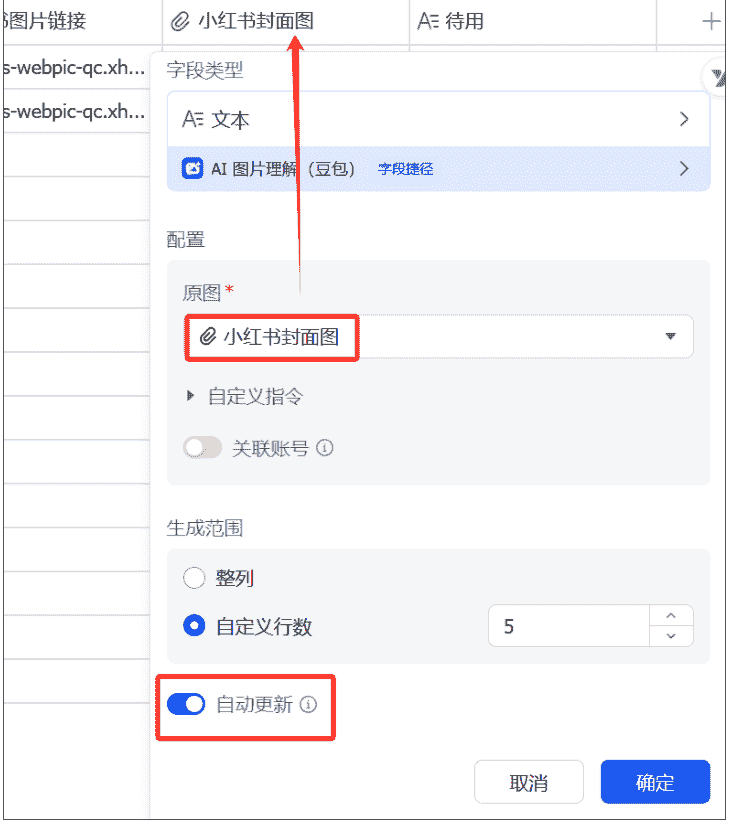

配置完成后，点击更新，图片提示词就生成出来了。


-拒绝平庸 只做高端-
PPT
专业设计
低至30/页

| 小红书封面图 | AI图片理解 AI 生成 | 待用 |
| :--- | :--- | :--- |
| (图片) | 这是三张PPT定制服务的... | 更新 |
| (图片) | 这是一张宣传PPT专业设计服务的广告图片。图片的背景是一片广阔的海洋，海面上有一艘小船，船上站着一个人，似乎在眺望远方。天空中有一些云朵，整体色调为深蓝色， | (刷新图标) 图片提示词 |

### 2. 新建 AI 二创图片列

接着我们根据提示词，再创作图片，再新建一列。

标题改为：AI 二创图片，探索字段捷径选择即梦 4.0。

配置指令内容，我们直接引用字段，选择 AI 图片理解那一列的内容，提示词再加上一句，图片比例为 3:4。

### 分辨率选择 2K，声明内容由 AI 生成选择否

### 打开自动更新，点击确定

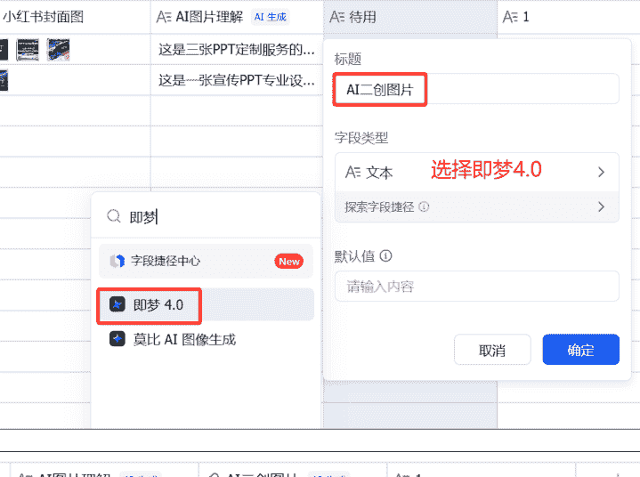

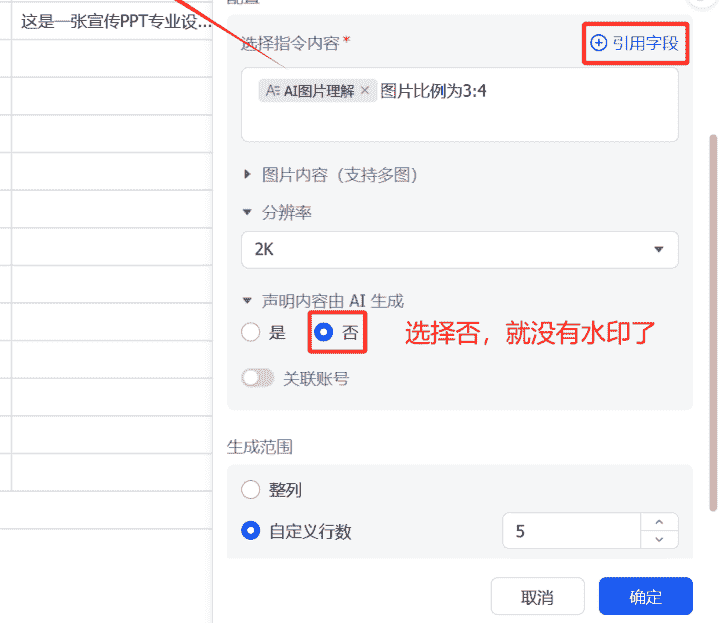

点击更新，二创后的图片就生成出来了，整体效果还是不错的，即梦 4.0 文字很少出现崩的情况了，如果不满意，还可以点击更新，就会重新生成新的图片。


经我们测试，大多数的图片 AI 二创后是可以直接使用的，但是像右面这张图，本身是带有店铺水印的，还有根据提示词出现了 3:4，这些都是我们不想要的元素，我们可以借助百度 AI 图片助手调整细节：

百度 AI 图片助手工具链接：百度 AI 图片助手

可以点击 AI 去水印或者涂抹消除，选中消除区域，点击生成，右边就是消除后的效果，没问题后最后下载，最终图片就完成了。


## 注意事项

即梦 4.0 每个账号只有 5 次免费生图的机会，超出免费额度后就会出现下面的提示信息。

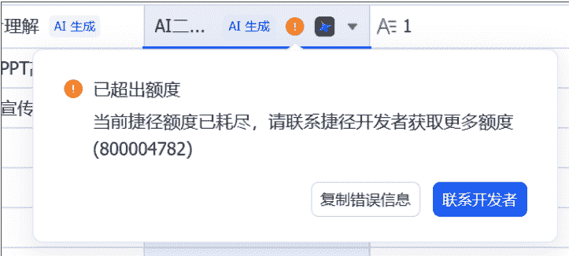

这个时候必须要填写关联账号才能继续使用，关联账号需要填写密钥和接入点。

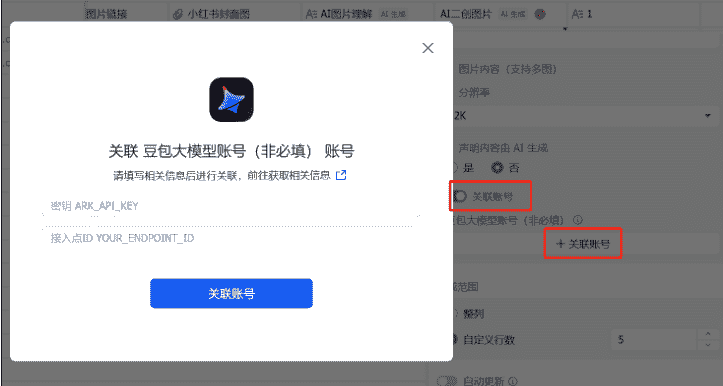

首先我们要先去登录火山引擎，找到并接入 Seedance 图片生成模型。

1. 点击火山引擎的 Seedance - 4.0 模型页面：点击进入火山引擎，如未注册先注册登录。
2. 点击模型对比。

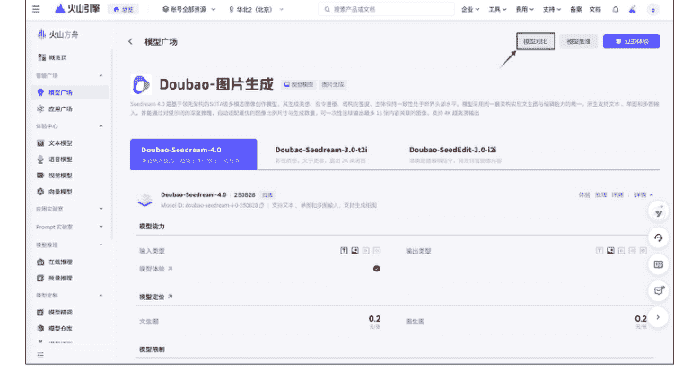

### 点击 API 接入

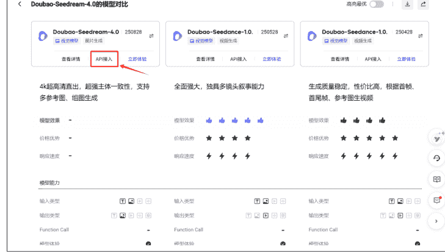

### 点击创建

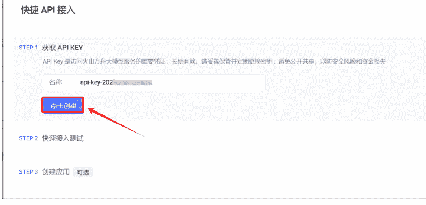

### 填写实名认证信息，扫脸认证

## STEP 1 获取 API KEY

## STEP 2 快速接入测试

选择开通的模型后将为您自动填充信息到代码示例中，您可一键复制进行调用，快捷接入预置推理服务

- 实名认证（已实名）
  - 模型开通前需要实名信息，请先前往实名认证，完成后点击“我已实名”，再进行模型选择与开通
  - 请输入姓名
  - 请输入身份证号码
  - 我已阅读并同意《火山引擎实名认证服务协议》《火山引擎人脸信息处理规则》
  - 开始扫描
  - 更多认证方式 >
  - 填写信息，认证
- 选择模型并开通
  - Doubao-Seedream-4.0 250828
  - 付费类型：按Token付费
  - 费用预估：输入价格 - | 输出价格 -
  - 开通协议：我已阅读并同意《机器学习平台专用条款》《免责声明》《豆包模型服务协议》
  - 开通模型
  - 一键开通所有模型
- 复制示例代码
- 管理接入详情

## STEP 3 创建应用 可选

### (5) 点击开通模型

### (6) 点击进入火山方舟，创建推理接入点
火山方舟
在线推理
创建推理接入点

### (7) 接入点名称可自行修改，点击添加模型

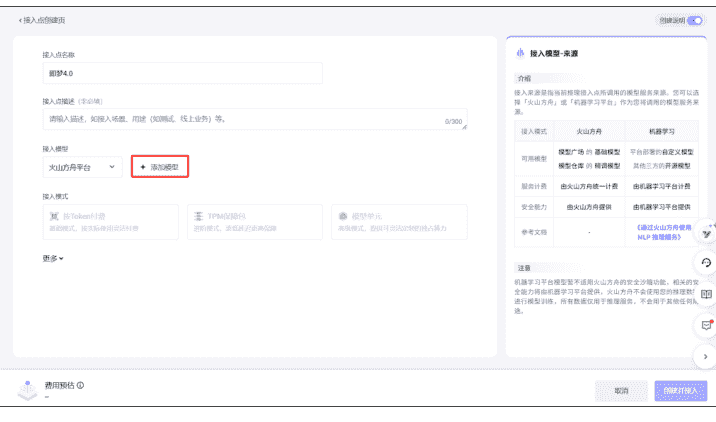

### (8) 选择 Doubao-Seedream-4.0 模型

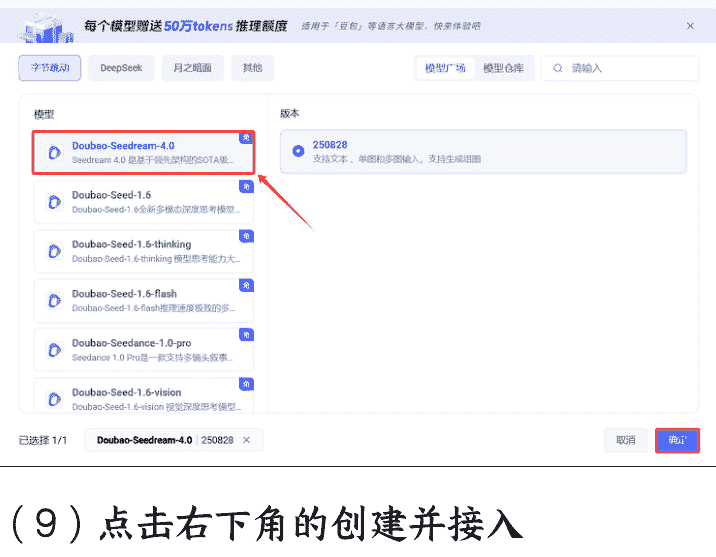

### (9) 点击右下角的创建并接入

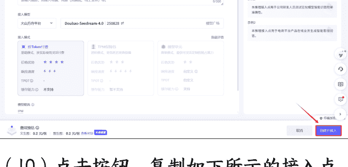

### (10) 点击按钮，复制如下所示的接入点（以 “ep-” 开头），请务必点击按钮复制，粘贴到多维表格填写多维表格账号的接入点信息框里

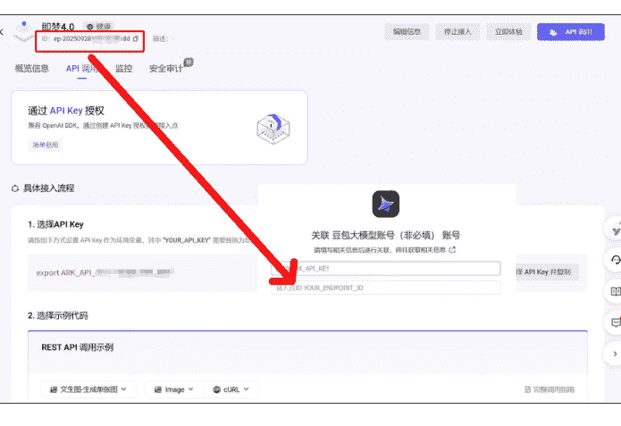

28 / 31

### (11) 接下来点击 API Key 并复制

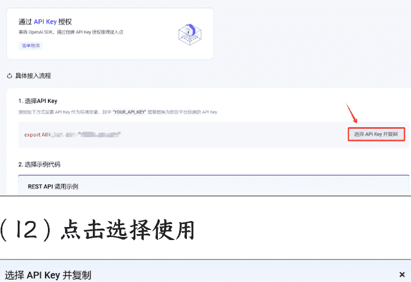

### (12) 点击选择使用

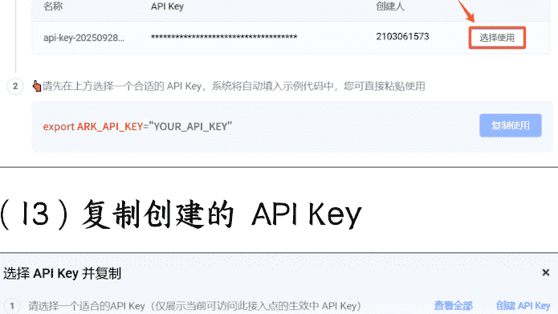

### (13) 复制创建的 API Key


### (14) 最后搭配多维表格，创建并使用关联账号，填入密钥和接入点即可

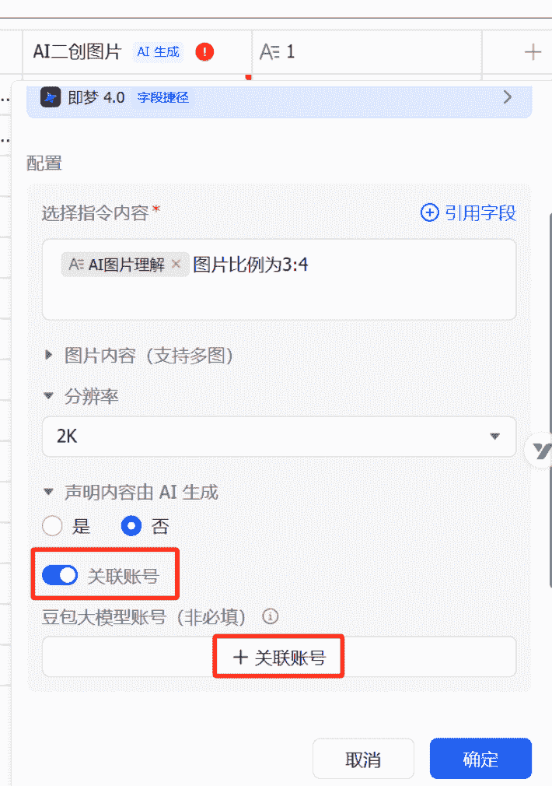

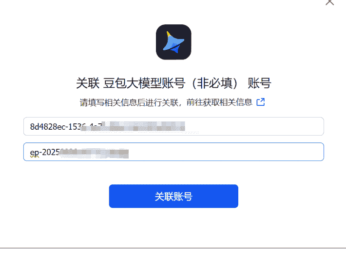

至此一个根据小红书链接二创笔记和封面的多维表格，就完成了，如果你看到了最后，一定要试着做一下，效率非常高，希望大家都能借助AI省时省力，赚更多的钱！

最后，安利小懒的付费群：

## 懒人专属群（介绍）


懒人专属群持续更新中，已持续运营 6 年，整理超 3000 份各类精选付费文章 & 年费社群干货，全部开放下载。

> 本资料为付费群内部分享，仅供真实有需要的朋友查阅

## 懒人专属群更新记录：

https://lazy2025.top/blog/record2

## 懒人专属群更新记录（需梯子，备用）：

https://lazybook.fun/blog/record2