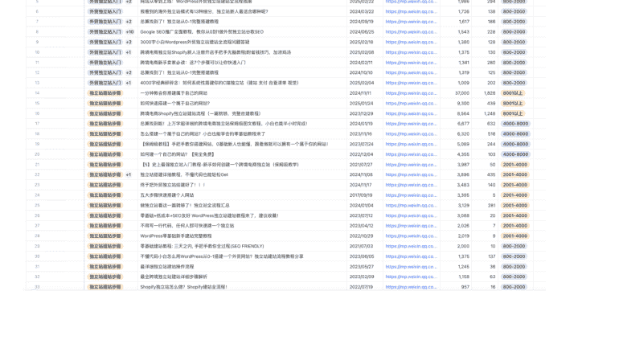
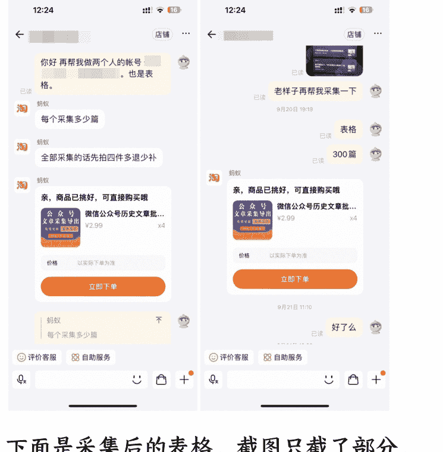
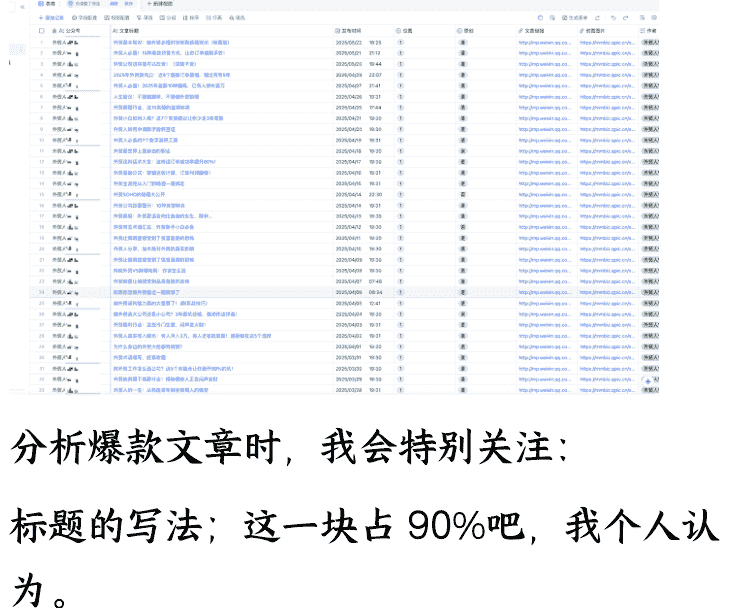
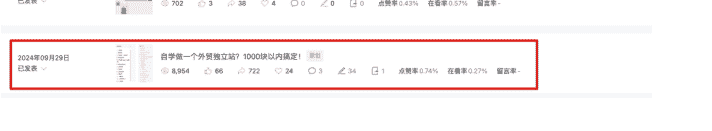
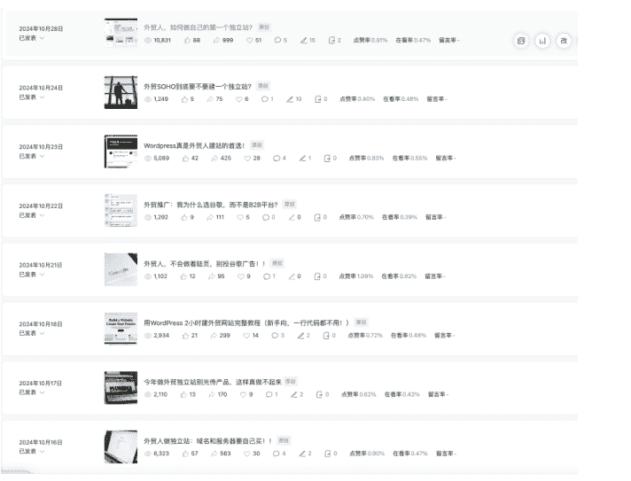
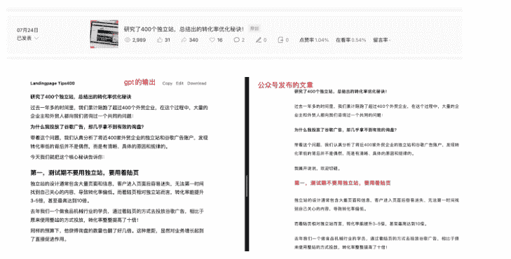
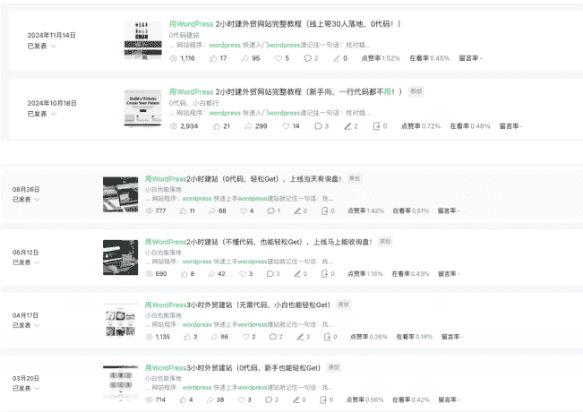
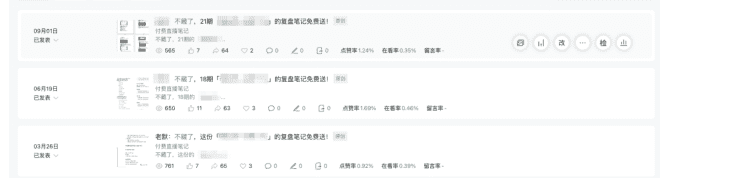
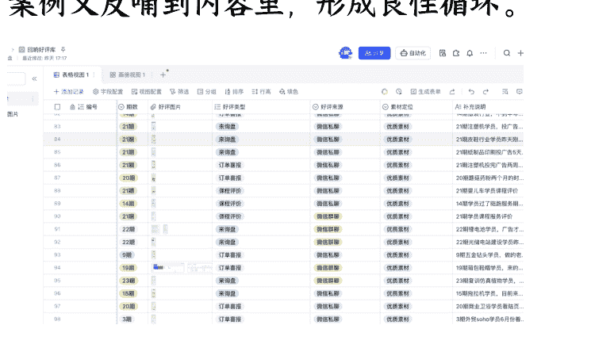

# 《知识 IP 如何跑通公众号垂直小号？从内容输出到私域变现的实操复盘》

250929 生财精华

公众号懒人搜索，懒人专属群独享

懒人微信：lazyhelper

前段时间当亦仁老师发布垂直小号的时候，我有一种被击中的感觉。跟我过去一年做的事情高度一致。

朋友也截图给我，说这不就是在写你么？让我一定要参加这次的垂直小号大航海。谢谢教练老师的邀请。

本篇文章我来复盘一下，过去一年做垂直小号的一点点心得。

我现在正在做的项目形式是知识服务+陪跑。客单价 5000 元+。月销 30-46 单。目前 70%左右的客户成交来源于公众号。

## 一、 为什么做公众号

其实在去年 6 月开始出来创业的时候并没有想很多。

出来创业最先要解决的问题很简单——流量。

没有流量，就没有客户；没有客户，所有的想法都白搭。

那个时候我们视频号，小红书，公众号都在做。

有些视频也跑得不错，算得上在这个品类里数据非常不错的短视频了。

### 可最后为什么选择在公众号持续深耕？

一方面是自己从业务中得到的反馈。

去年6月，我们的公众号粉丝还不到1000，但有一篇文章爆了，直接跑出两万多的阅读量。

| 2024年06月20日 | 做谷歌SEO，这6个工具你一定要先用好 | 266 | 3 | 34 | 3 | 0 | 0 | 点赞率1.13% | 在看率1.13% | 留言率- |
| --- | --- | --- | --- | --- | --- | --- | --- | --- | --- | --- |
| **2024年06月19日** | **为什么选择做独立站，而不是亚马逊？** | **20,524** | **52** | **914** | **28** | **17** | **1** | **点赞率0.29%** | **在看率0.14%** | **留言率-** |
| 2024年06月18日 | 谷歌广告拿精准询盘有多快？ | 273 | 1 | 18 | 2 | 0 | 0 | 点赞率0.37% | 在看率0.73% | 留言率- |

那篇文章几天加了上百人。

同等播放的情况，这个相对于视频的引流效率是更高的。

当时也有不少商单找过来要合作的。

后面也陆续有一些客户加过来直接告诉我们，你们的文章写得很专业，然后这类的客户转化的速度也相对其他人更快。

我当时经常也看公众号的后台数据，公众号后台你其实能看到最近【阅读最多】的一些读者。

我就发现在常读客户的列表里面，是有4-6人当月会选择报名我们的课程的，他们自己看了文章之后，自己就把说服了。

这是我当时分享给我的一位朋友，阅读前十名的人中2个是我们自己人，剩下的8个人中有 4 个成为了我们当月的付费客户，1 个说报名下一期。

另一方面是其他机构的数据。

那时候我在群响的会员群里看到一条分享。

群响的合伙人 Toby 在会员群里抛了一个数据，他们当时几个月将近 70%以上的私域新增来源于刘思毅和群响的公众号。

## 总部[欢天喜地群响年](145)

### 3月流量目标:8000

- 3月新进流量合计:14194
- 刘老板公众号:8508
- 群响公众号:832
- 发疯号公众号:268
- 视频号:628
- 抖音流量:441
- 自然流量:523
- 资料流量:426
- 活动流量:2568
- 流量进度:177%

- 周末新进流量合计:750
- 刘老板公众号:612
- 群响公众号:70
- 发疯号公众号:12
- 刘老板视频号:26
- 群响视频号:9
- 抖音大号:21
- 抖音小号:0

群响算是在流量圈里面很知名的公司了。如果他们的私域大盘主要依赖公众号，那说明公众号绝对不是没人看的“过时的平台”，而是极具价值的。

所以，我当时就算是确定了，公众号是机会。要好好做。

开始的目标也很简单，先在工作日日更100篇文章，因为我坚信肯定会有效果。

那时候，无论白天多忙，晚上还是要坐下来码字，把第二天早晨8点半要发布的文章写完。

有一次晚上11点才从外地学习赶回来，也是把第二天的文章写完发布。

为什么印象那么深，因为那天晚上写的文章第2天爆了，爆了1万的阅读，900+的转发。

直接新增了将近100个精准私域客户。

那一刻，就觉得自己坚持做的事情，是真的有效果的。

## 二、赛道选择：客户有需求，市场缺专业解决方案

做内容之前，必须先想清楚一个问题：你要在什么赛道里深耕？

在前公司，我是外贸独立站培训项目的负责人，也是做外贸网站建站&推广相关的培训，接触了大量客户案例。

我自己也会在线下课里，去采访客户，和客户聊。

那时我就发现，虽然大家都在谈独立站，SEO，但在公司里很多客户真正的好评、真正的成果，其实来自于谷歌广告。

这里解释一下，SEO就是通过搜索引擎优化内容优化这些方式，让网站获得自然的排名和流量。而谷歌广告就是做付费流量简单粗暴。

SEO 的价值毋庸置疑，但它见效慢、周期长，而谷歌广告配合落地页，却能在短期内帮助客户拿到实实在在的询盘(客户询价)。

但市面上呢？

我发现几乎没有知名机构专门做“谷歌广告+落地页”的培训。

大多数机构都是外贸独立站，谷歌广告，SEO 一揽子都放一起讲。

我当时就想，网站真的是外贸人的需求么？外贸人搞网站的需求应该是获客吧。那为什么不直接给一个专注解决快速获客的解决方案呢？

于是我们在原本的培训类目里进一步细分，做了一个专门的产品——落地页搭配谷歌广告推广。

里面其实还有几层考量：

第一，客户能快速出结果。

对于做知识服务来说，客户能真正出结果比什么都重要。

如果花了几个月还没有效果，他们很难有耐心。

但我们选择的「谷歌广告+落地页」的模式不同，简单、直接，只要跟着做，就能把页面搭建好(就一个页面本身就降低了执行的难度)，把广告投放出去，马上看到询盘。

第二，线上交付成本更低，易于起步。

刚开始创业，我们也不敢一上来就干线下课。

搞线下价格要更高，另外也需要更强的组织、交付履约能力。

那样风险太大，成本也高。

于是我们从线上开始，价格可以设定得相对低些，同时保证交付质量。

先跑起来。

第三，产品形态足够简单。

带着客户做一个页面，带他们设置广告后台，就能完成交付。

交付简单，客户就能落地，满意度高，后续自然能沉淀案例。

事实证明，这个选择是正确的。

一个能快速见效的细分市场，帮助客户拿到结果的同时，也让我们自己迅速拿到了案例。

## 三、实操路径：日更+对标拆解+方法沉淀

### 日更：前100篇就是练兵场

开始就想一个事：先干100篇再说。

我想着毕竟我也在行业里干过，写100篇不可能没有出圈的文章。

每天早晨8点半准时发文，不管前一天多晚写完。

日更的过程中，我逐渐摸索出一些小方法：

每天和客户沟通时，随时记录他们遇到的坑和问题，整合聊天的内容成文章。

去找微信搜一搜里找爆过的行业文章，结合我们的案例和业务去重写。

内容分为“干货型”和“成交型”两类，既吸引新客户了解，也要打消意向客户的疑虑。

这种方法让内容输出源于客户真实的需求/痛点。

### 对标：学习别人的爆款逻辑

刚开始写的时候，我做了很多“对标”动作。

我会在微信搜一搜里搜索行业关键词，看相关的爆款文章，然后把它们整理到一个选题库里。逐渐形成了一个爆款素材库。

这个表格最初是我手搓的。后面1~2个月左右会更新一次。这一块也交给小助理去做了。

目的是让自己对于最近1~2个月你这个类目里面跑出来的一些文章有一定的感知，到底是什么选题火的，以及他是怎么去写标题的，他传达了什么样的观点，这个要常常去更新。

这里再分享一个方法去构建你的选题库。如果你找到了对标的账号和博主，也可以把他们过往的文章全部采集下来做成表格。

两个方面，一个方面你可以调研它的爆款文章，另外一个方面你也可以看到他整个公众号的运营历程，他是先做了什么样的内容，然后怎么样找到自己方向的，其实可以从他的标题选题变化去看到。

这个部分我是直接淘宝上找人做的。你可以直接在淘宝搜索框里搜索【公众号文章采集】找到相关的商家询价就可以了。

具体我做的是哪一家这里就不做推荐了，大家可以自己去找一找。

找到相关商家之后就把你要采集的账号，做成什么类型的文档告诉他就行。基本PDF、Word、Excel都能做。而且价格真的相当便宜，不到 10 块钱就能采集一个账号几百篇文章帮你做成表格。

之前我也找过那种自动采集的工具，但也需要自己操作，后面就直接花钱弄了，对方做好发给我。10 块不到还要什么自行车啊。

下面是采集后的表格。截图只截了部分。包含文章内容，文章链接，封面图片各项数据，发布时间等等都有。对方给的是一个 Excel 表格，我会上传到飞书多维表格里。

- 分析爆款文章时，我会特别关注：
- 标题的写法：这一块占 90%吧，我个人认为。
- 开头的吸引点；
- 文中是否有打动人的金句；
- 以及整篇文章的节奏。

但我不会照抄。光靠模仿，文章变不了现。

我的做法是：在文章里，加入我们自己的模式的说明。

不是硬以广告的方式加入，而是一种软营销。

分析客户的问题，提出我们的方案。

这样文章才能真正带来变现。

### 文章连续2个月被推荐

去年9月底和10月初，爆了两篇文章。

一次是国庆节前，我发的一篇文章爆了。

假期在家，每天手机上几十个红点不停跳动，源源不断有人加我咨询。

后面我以同样的选题再写了一篇，又爆了，而且流量数据是之前的2倍还不止。

2w+的阅读，2133的转发。

然后10月的文章持续被推荐。

流量的爆发不仅让私域增量增长，也让我们有底气去提价。

随着选择报名我们陪跑的人越来越多，去年 11 月我们客单价也从 3980 涨到 4980。仍然每月人数稳定。

### 低谷与调整

当然，做号也并不总是顺风顺水。

去年 12 月到今年 3 月，公众号的推荐流量突然下降。

文章从几千、上万的阅读跌到几百，私域新增也从每天几十人降到个位数。

那段时间，确实会焦虑。

合伙人会关心数据，我也敏感，觉得是不是别人也认为我不行了。呃，可能刚开始创业都有这样的感觉吧，一边害怕，一边勇敢。一边怀疑，一边继续。

还好调整了心态。

首先保持更新不能断。

哪怕只有几百阅读，也要让私域里的客户看到我们在持续输出。

其次，我不断去测试新的素材，找新的写作切口。

我记住了一句话：“按时出摊。”

这里感谢下润宇老师，这是刷润宇老师的视频看到的。这句话对我帮助很大。

把做垂直号也当做是开一家餐饮店，今天下雨，可能路过的人少，但你不能因为没人来就不开门。

每天出摊，才是生意的常态。

## 四、AI 加持：AI 如何放大内容效率

如果说“日更”锻炼了我的执行力，积累了大量的语料，那么 AI 彻底改变了我的效率和写作方式。

其实我在 2022 年就开始使用 AI 了，但感觉是：写出来的东西“机器的味道太大”，用处不大，所以一直没深入。

直到 25 年春节期间，我蹲了龙共火火老师的一场直播。

他说，AI 会是未来一波很大的机会，必须把它用起来。

咱也是主打一个听劝。开始尝试让 AI 深度参与到我的业务中。

也是从那时候，我开始用 ChatGPT 来辅助写作。

最初我只是用来帮助我润色、逐一修改文字稿，用着用着我发现，它能做的远不止这些。

我现在主要用的 AI 还是以 GPT 为主。

主要原因是：GPT 有一个非常强大的功能，叫做长期记忆。

我现在建立了一种“AI 共生创作”的模式，主要是 3 步：

把自己过去写过的大量文章喂给它，让熟悉的写作风格。

每天和它聊天。我把日常和客户的对话、我的灵感、业务思考、案例输入给它。

然后通过“语音聊天”的方式，帮助我生成一篇文章。

用 GPT 来写作的过程中，我只做两件事：给他一个我要写作的标题；直接语音输入，告诉他我要传达的信息，我想表达的内容。剩下的，它会完成。

### 下面贴上一个案例：

过去写一篇文章，我要花1~2小时。

现在呢？两个小时，基本能完成一周的内容。

### 这两小时如何分配：

其中，高专注的一个半小时用来确定选题和标题，剩下半小时和 AI 聊天，文章就成型了。

然后交给助理做案例，配图排版，这个部分我 SOP 标准化了。

其实和 AI 共生这大半年，价值远不止于此。

AI 给我带来的真正价值是：它给我带来了陪伴者和思考镜像。

我每天都会和它对话，把自己的灵感、困惑、客户反馈输入进去。

久而久之，它比任何人都了解我的业务和我自己。

业务上来看，不仅能帮我输出文字，还能帮我梳理产品逻辑、优化私域 SOP，甚至参与招聘和培训文档。

我之前是很不喜欢做流程的，但是我现在只需要把我流程里的几个大纲告诉他，他会帮我生成框架，我再往里面填对应的内容就轻松很多。

其实包括这一次的分享，开始我也没有什么写作思路。

是我和 AI 来共创完成的。

我让他以采访的形式向我提问，它汇总了 20 个问题一个个问我，然后我回答了这 20 个问题。

这篇文章的整体框架就完成了。

说回我用 AI 共创的文章拿到的结果：

从今年 4 月到 8 月，我的公众号所有的文章都是在这种“AI 共生”的方式创作的。

这四个月里的文章，也不断在获得推荐流。

通知(86)

你的创作周报已生成(05.19-05.25)
推荐带来3339阅读量，点击查看你的「一周创作总结」。
2025/5/26 14:27

你的创作周报已生成(05.12-05.18)
推荐带来2720阅读量，点击查看你的「一周创作总结」。
2025/5/19 14:28

你的创作周报已生成(05.05-05.11)
推荐带来5527阅读量，点击查看你的「一周创作总结」。
2025/5/12 14:26

你的创作周报已生成(04.28-05.04)
推荐带来8449阅读量，点击查看你的「一周创作总结」。
2025/5/6 14:27

你的创作周报已生成(04.21-04.27)
推荐带来1.0万阅读量，点击查看你的「一周创作总结」。
2025/4/28 14:29

通知 (86)

你的创作周报已生成 (06.09-06.15)
推荐带来1321阅读量，点击查看你的「一周创作总结」。
2025/6/16 14:28

你的创作周报已生成 (06.02-06.08)
推荐带来1.0万阅读量，点击查看你的「一周创作总结」。
2025/6/9 14:27

邀请你使用「问一问主持人」功能

你可以作为主持人在问一问发起专属讨论，邀请朋友共创内容，获得更多关注。了解详情
2025/6/6 12:40

你的创作周报已生成 (05.26-06.01)
推荐带来9069阅读量，点击查看你的「一周创作总结」。
2025/6/2 14:27

你的创作周报已生成 (05.19-05.25)
推荐带来3339阅读量，点击查看你的「一周创作总结」。
2025/5/26 14:27

你的创作周报已生成(08.04-08.10)
推荐带来1.0万阅读量，点击查看你的「一周创作总结」。
2025/8/11 14:35

你的创作周报已生成(07.28-08.03)
推荐带来7040阅读量，点击查看你的「一周创作总结」。
2025/8/4 14:33

你的创作周报已生成(07.21-07.27)
推荐带来1.2万阅读量，点击查看你的「一周创作总结」。
2025/7/28 14:32

你的创作周报已生成(07.14-07.20)
推荐带来3252阅读量，点击查看你的「一周创作总结」。
2025/7/21 14:31

你的创作周报已生成(07.07-07.13)
推荐带来2375阅读量，点击查看你的「一周创作总结」。
2025/7/14 14:31

也直接支撑了我们每月 30 人以上的稳定招生。

## 五、IP 小号变现系统：内容+私域+交付

当然光有内容还不够。要真正实现高变现，必须有系统。

我们现在运行的是三套系统：内容系统、私域转化系统、产品交付系统。

### 内容系统：不仅是获客，更要促成交。

内容的作用不仅是获客，更是促进成交。

分享有几个关键做法：

### 交付内容化

在课程交付过程中，我会专门记录一些学员的落地细节，真实的操作步骤、接收的反馈写成文章。

不仅展示我们交付的细节，还能让客户清楚“这门课到底是怎么上的”。

很多时候，仅仅靠文字很难讲清楚交付内容，但通过一篇图文并茂的文章，客户能够了解到产品到底包含了哪些价值。

这种试过非常有效，每次发完类似的文章底下不光有问价格多少钱的评论，也有文章转发过来问我们价格的。

### 裂变触达

我们还有一个固定动作：因为每次陪跑结束后都会做一次数据复盘，我会把学员的数据和成果整理成笔记，然后开放给大家领取。

这些复盘笔记是一个非常好的裂变素材，平时关注你产品的客户就会想拿，既可以看到我们真实的交付成果，还可以转发朋友圈或者社群，帮助我们进一步扩大触达人数。

基本每次会有 60 人左右转发到朋友圈/群。

### 为私域销售积累“弹药库”

我把这些交付记录、复盘文章、案例，全部称为“弹药库”。

一个意向客户问你具体产品服务时，不用长篇大论，只需要甩出一篇现有的文章，就能解决他 90%的疑问。文章搭配配图、视频，一个完整的说明组合，远比文字解释多了更多说服力。

内容本身就是销售话术的延伸。

引流是一个功能，打消疑虑、推动成交是另一个功能。

做垂直小号不能只写“干货”，还要写能让客户完成最后成交的内容。

### 私域转化系统：客户动线标准化

朋友圈是最基础的动作，每天都要发。

高客单的客户成交都有一个周期。

我们在私域里做了很多分层：哪些客户是高意向的，哪些是低意向的；不同层次的客户打不同的标签，用不同的跟进方式。

这一块我专门去研究了“客户的动线”。

#### 做成了标准化的私域跟进流程交给了私域助理同事。

#### 客户常见的三种类型

私域的客户不做用户教育，只跟进认可模式的精准客户。

| 客户类型 | 特征描述 | 建议跟进方式 |
|---|---|---|
| A类 - 高意向精准客户 | 认同“零经营 + Google广告”模式；有实际数据，主动提出想用新资料优化 | 优先跟进，快速签单 |
| B类 - 模糊兴趣客户 | 认同方向但不了解细节，有一些兴趣，但没资格 | 不交数据，直发资料 + 看结果 → 再次定是否深入 |
| C类 - 不匹配客户 | 不认同模式，外部自媒体方向问题 | 不花精力跟进，直接发资料 |

#### 跟进问题四步法

精准客户识别 → 高意向优先跟进 → 模糊兴趣提交资料 → 不认同理念直接结束

#### 记录典型客户

只做方便复盘，有用的记录。

| 类型 | 判定标准 | 必问关键词 | 记录目的 |
|---|---|---|---|
| 意向型 | 对赋能模式有点兴趣 | 问题细节，如问价格、问课时、问资质等。若问题直接落地，简单说明后不记录 | 后续继续跟进优化，逐个跟进 |
| 流失客群 | 其他平台通过独立站固定广告效果来测试 | 你自己“花了几十块钱”，“感觉是不行”“线下推，平台难做”等经历 | 积累素材 |
| 填空型 | 用户填表未成功的 | 平台背景、付费意图 | 总部希望空白填补的作为参考，按页面 |

她通过跟进的表格需要给我反馈的是：高意向度的客户现在卡在哪里？

我再根据这些具体的问题去调整我们跟进的策略以及内容素材。

### 产品交付系统：稳定履约交付

最后一环是交付。

我们做的是陪跑模式，这种模式有一个好处：结果很容易看得见。

客户跟着做，可以把页面搭建出来，把广告投放出去，立刻拿到询盘。

“快速见效”的体验不仅让客户满意，还能积累大量案例。

案例又反哺到内容里，形成良性循环。

目前我们的私域总人数约7500，付费用户接近500。

公众号粉丝1.1万，但已经跑了超过200万的变现。

产品价格段主要集中在 4980~7980，没有走低客单的路线。

没有特别大的流量池，有完整的系统，变现一样可观。

## 六、总结与反思

回顾这一年多的公众号小号实战，我自己也总结了三点：

- 关于执行力：持续更新是硬功夫，按时出摊是根本。
- 关于系统：内容是入口，私域和交付同样重要。
- 关于流量：推荐流会来来去去，案例和口碑能积累，能沉淀，能带来长期回报。

### 如果让我重来一次，我会做得更好：

“双账号，多平台”策略，分散风险。

现在流量太过于依赖于一个公众号，导致私域的进量会随着推荐流量而波动。

8月开始跑第二个业务公众号，包括其他渠道的自然流、付费方式都在尝试做。

不沉迷流量带来的短期正反馈，早点把重复的动作标准化。

因为之前一直是在公司做业务的，在业务一线里希望把所有东西都抓握在自己手上，也能第一时间感受到业务带来的反馈。但是这种在创业里面，就局限了，很多重复性的事情，吃掉了自己的时间，反而就会忽略更重要的事情。

多思考未来 3~6 个月可能会出现的问题。

垂直小号不是流量游戏，而是系统经营。

推荐流是对你持续产出价值的奖励，但它不是根本。

真正的根本，是你有没有给客户创造价值，是你有没有沉淀口碑和案例。

就像“亦仁超级标签”里面的几个关键词：专业、深耕、细分领域、价值密度高。

拿这些标准对齐，哪怕粉丝只有一万、私域只有几千，你同样能跑出几百万的变现。

而我也会继续在这条路上，继续“按时出摊”。

最后，安利小懒的付费群：

### 懒人专属群（介绍）

📖 懒人专属群持续更新中，已持续运营6年，整理超3000份各类精选付费文章&年费社群干货，全部开放下载。

本资料为付费群内部分享，仅供真实有需要的朋友查阅

### 懒人专属群更新记录：

https://lazy2025.top/blog/record2

### 懒人专属群更新记录（需梯子，备用）：

https://lazybook.fun/blog/record2