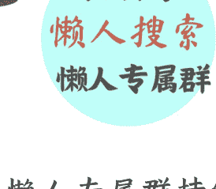

# 男人女人，从今往后，没人领导客户能拒绝你

240323 记忆承载付费

公众号：懒人搜索，懒人专属群独享
懒人微信：lazyhelper
公众号懒人搜索懒人专属群
微信：lazyhelper

最近有很多读者问我，2024年，简直是，简直了。

即便是通过个税同期相比下降了十几个点的数据，也能窥得现状。

现在的问题很实际，我能力就是不如同事强，我家境就是不如同事好，甚至，我的年龄都不如同事小，时不我待，优势真的不在我。

可是，问题已经出现在我面前了，今日降五薪，明日降十薪，未得一夕安寝，起视四境，然，新兵又至矣。

我已经无路可退。

背后就是家人，面前就是压力，怎么才能先摆脱眼下的困境？

这类问题，看得我一声叹息。

好，今天只讲术，咱也顾不得手法，顾不得道德了。

事儿逼人，到这份上了，总得先帮你们过了难关再说。

文章很长，一万八千字。为了便于理解，分拆成了五个部分。

而且文中每个部分都夹杂多处链接，俗称“画中画”、“文中文”。阅读时请留意不要错过。阅读后有疑问，在这篇文章的底下点“写留言”按钮，我都能看到。

下面，让我们开启这段旅程。

这个问题的实质就一件事，你得赢，在大环境不利的情况下依然有饭吃。而在这件事上绝大多数人犯了错误，什么错误？目标错误。

你的目标从来不是跑过森林里那头熊，而是跑过你身边的人。

有人说，我跑了，我跑不过呀。你跑不过就已经错了，我让你跑过，谁让你用腿去跑的？

方向不对，努力白费。这就叫听都没听清，就开始执行，只顾着埋头拉车，从来不抬头看天。

这是个商业游戏，说到底，各行各业，无论打工、创业，还是投资，本质上都遵循交换法则。

只要你能够让所有人都无法拒绝你，那无论你在做什么，你都注定是铜锣湾里最靓的那个仔。

怎么才能做到呢？很简单，两个方向。

第一个方向，你就是最牛的，你就是才华最高的。这不是我们今天讨论的内容，因为没价值。你就是才大气粗嘛，这没法子比，我能力就是不如你，这是客观条件。

现在问题回来了，我不如你，我还要赢你，这才是我们今天要聊的内容。怎么办？

第二个方向，我并不是用腿去跑的。我没有你的先天才华，我没有你的家庭条件，可我也不想就此出局，我甚至还想更进一步，倒过来反而做你的上司。如之奈何？

怎么才能成为那个又菜又爱玩，且无法被拒绝的存在？

我们有很多读者，有上岸的，有在外企的，有在民企的，参加工作以来，各种碰壁，常常跟我讲述他们在工作中的困扰。

有些人是有能力，但就是发挥不出来；有些人是能力平平，但他态度是好的，他真的有上进心，可是没有结果。

那我今天就专门来研究这个话题。

我当年在职场经历里面，待过外企，待过国企，待过甲方，待过民企，我个人做过员工，做过高管，创过业，做过老板。综合所有我看到的、经历过的各种企业类型，以及各种员工类型和他们的前途命运，总结下来就一句话。

商业社会的本质就是搞定人，把人拿下了，什么事儿你都能拿下。

那在我的硬实力不能形成绝对碾压效应的时候，我怎么通过软实力来把人拿下呢？俗称我怎么才能让别人、让男人、让女人、让领导、让客户、让同事，让一切的一切都不会拒绝我呢？

我有这么几条基本功要拿给读者们分享。

这些要点的门槛很低，一般来说，只要你能入职，你就能做到，所以我把它们叫做职场基本功。

为了方便起见，我们选一个最重要的人作为模拟客户，不然的话这篇文章我们再扩展五倍也讲不完。我们就选择一个角色：领导。咱们把领导当客户、当目标对象，来演练一遍这五条职场基本功。

## 基本功第一条：精通数据，回话明白。

精通数据的意思就是把自己活成百科全书。你看《雍正王朝》，大秘张廷玉，无论是康熙还是后来的四爷，都很倚重他。因为他就是个活字典。

咱们集团有多少人，每个人的履历是什么，性格是什么，优缺点是什么，一共做过多少事，某年某月某日曾经做某件事的起因是什么，过程是什么，结果是什么？他不用查的，张口就来，而且你去复查，回话十分清楚明白。

这就是我当年进甲方之后，第一次照面就被领导看重的地方。

在甲方企业里面，这一点尤为重要。其实所有企业里都重要，无论民企外企，你仔细观察，被提升管理层的那个，通常都不是技术最好的，而是思路清晰、表达明白的。

为什么？

因为你要做管理层，最重要的是汇报。武功比李连杰高的人多了，问题是，并非每个人都适合上镜。

光练不说，傻把式。

你说不清楚，就意味着你没有办法向上级汇报；你说不清楚，就意味着你没有办法安排下属工作。

而说清楚不是玄幻的口才问题，是什么？是背数据。

许三多的口吃，够不清楚了吧？人够笨了吧？他在背数据上下了大功夫，硬功夫，最后怎么样？被团长看到了。

那一瞬间，不给你回去查的时间，你口才好讲不出干货有什么用？

随时随地讲出干货不是天生的，是后天在工作中默默熟悉数据、练出来的。

尤其是甲方，这个尤为重要。为什么？因为你只能拼这个了。

乙方无论外企、民企，作为供应商，人家还可以秀肌肉；甲方你是安排工作出去的，你能秀什么？除了秀你那张嘴，你还有什么呢？

所以在乙方，精通数据、回话明白只是你升管理层的必要条件；那么在甲方，这就是跃迁的机会。也许一次，你就被大领导看上了，直接就有了一个被集团高层带着玩的机会了。

你来想一个场景。

甲方集团大领导问话的时候，下面的负责人讲不清楚，他要回去查数据，这时候领导急不急？乙方的老板兴许还会看在业绩的份上，让负责人回头汇报。但甲方，这种非常强调形式的地方，领导大概率会又急又怒，因为说白了，下面的负责人这个岗，谁都能做，无非给不给你做。

这时候，领导的目光扫向诸位，谁能？

都低下头默不作声，只有你能。

所谓回话明白的意思是说，问什么数据，都能讲到具体数字；是不是你负责的，都能讲得清楚明白；是不是你们部门的，都能讲得清楚明白。那你说领导看你什么感觉？

就像晚年的乾隆看到侍卫和珅的感觉，几次之后，他就看明白了，你是下了大功夫的。就像许三多在部队里，团长问什么，他都能背出来。

他不是预测你会问什么，像高士奇买通康熙身边的太监，问康熙昨天看什么书，自己回家突击。而是他真的啥都背了。

说明什么？说明他就是自带大饼呀。

在领导眼里，大家都是工具，现在你就是那个最好使唤的、最主动配合的，还自带PUA的工具。驱动别人还需要给他升官，让他当个负责人，还需要给他画饼，还需要给他许诺休假，你啥都不需要。你是自带画笔，自己给自己画大饼，自己PUA自己。都轮不到你负责，你一个小兵篓子，把那些负责人该做的，都做好了。谁会不喜欢你？难道你自己做了领导，会不喜欢这样的自己吗？

而且你要注意，我这只是站在正面的角度去解读，实际上你一旦精通数据之后，就会形成碾压效应。从此之后，职场游戏就会对你解锁各种骚操作。

你想想看，一个不精通数据的人，面对一个精通数据的人，他的第一反应是什么？很简单，是被打懵了。

开会的时候，那么多人在，没有人有时间现场一个个去查你说的数据对不对。也就是说，只要人家当场找不到漏洞，只要没有你背了一个数据正好别人也看过，而且你是错的，那么他就是被你压着打。

一旦落入下风，就很难不被你牵着鼻子走。这时候所有人都会卡壳，都会停下来，被你的引经据典、被你的振振有词、被你的援引数据打动。大家都会跟着你走，跟着你的思路走。

那么这个时候，你在分析事情的过程中夹带私货，就会变得很容易。

我们想想看，那些金融机构的从业者，为什么习惯于张口就是术语？他们是没有说人话的能力么？不是。他们其实能够说清楚的，他们能够讲清楚一个金融产品的实际风险、一个金融产品扣除风险之后的无风险回报率，他能讲清的。但是他们绝对不会讲。讲清楚了还怎么做销售呢？是不是这么简单的道理？

所以他们要用一堆的术语干什么？把这两个核心点隐藏起来，然后才能把包装好的金融产品卖给客户。

职场也是一样的。大家都掌握了术语，都满嘴互联网黑话，那还能拼什么？只能拼数据，拼看谁对底层数据的掌握颗粒度够细。谁够细，谁就能掌握话语权，因为现场根本没有时间去给任何人去查数据。

就像作为客户，你遇到两个中介，一个人问什么楼盘的历史成交数据他都能答上来，另一个非得回去查了才知道。你会信谁？

领导也是一样的，领导就像来买房的客户，他面对一堆的下属，他怎么知道谁更牛？也许真到了做事的时候，那个答不出数据的人，其实比你更牛，问题是，他还有机会么？

在领导面前展现自己能力的机会已经被你拿走了，项目负责人的机会已经被你拿走了。他再有本事，能做什么？无非是作为你的手下，贡献他的能力，为你的业绩添砖加瓦，成为你事业上的助力，不就这点事儿么？

就像一家装修公司，你觉得墙是谁砌的？泥工。问题是，泥工与设计师相比，谁更有职业潜力？当然是后者。因为后者有在客户面前露脸的机会，后者把握住了客户，就把握住了资源，就有可能某一天自己当老板，开装修公司。而那个泥工，只能哼哧哼哧，撅着屁股砌墙。

所以大部分时候，最重要的不是你牛，而是你显得牛。你让领导觉得你牛，你让客户觉得你牛。

做到这一点，最关键的地方就是精通数据，回话明白。不给其他同事以思考的时间，以查询的时间，稳准狠地抓住领导的需求，迅速成为他的心腹。

我讲这一条，举的例子是领导，但实际上，对付任何人都管用。领导是什么？领导就是客户。你能对付领导你就能对付客户，你能对付客户你就能对付一切人。

# 商业社会的人际关系的实质是什么？

就是交易。

作为一个让所有买家都无法拒绝的卖家，你不就搞定所有人了？

所有人都搞得定，你会在职场里混不下去？除非没有职场了，只要还有，你就是留下来的那个。

## 基本功第二条：过程管理。

当年我在工作中的时候，发现大多数人都有个毛病，就是线条太粗了。

细节决定成败这句话不完整，但这句话是真的。完整的讲叫做：方向决定成败的方向，细节决定成败的结局。

方向错了，努力白费，但是方向对了，细节错了，一样是失败的结局。

举个昔日在甲方的例子，那时候我发现很多同事的管理风格都很粗放。大领导交代一件事，同事们会怎么做呢？直接召集供应商开会，然后把这件事像二传手一样布置下去，从此就只盯着供应商的负责人。

我还是用装修的比方，你把领导想象成客户，装修的客户。那上面这种人在甲方里起的作用相当于什么？相当于设计师。

每当客户问设计师的时候，设计师都只能回答：“我要去问问项目经理。”然后把项目经理汇报的内容再二传手一样汇报给客户。你觉得这样的设计师，客户会满意么？

我不是这样的设计师。我是那种真的会和项目经理手底下的泥工、电工、木工、油漆工打成一片，我很清楚每一个环节的物料、每一个环节的具体这个人的水平、现场的实际情况，以及具体卡哪儿了。明白这里面的区别么？

人家的管理模式是全包，我的管理模式是包清工。我当年在甲方的时候，就是这么指挥供应商的。硬件设备的调试，我全都参与；软件程序的调试，我全都参与，我甚至能够告诉某个供应商下面的软件工程师，你哪个软件里面哪一行代码写错了。

但是你要知道，其他的、和我一样的甲方的系统架构师们，是绝对不会管到这种颗粒度的。他们只负责画框，对他来讲，某一个框框里面的整套设备，都是一个供应商负责的。有问题，他只会对接到那个供应商的架构师，或者那个供应商的产品经理这一级。他不会再往下管了。

这就使得很多时候，他的判断是错的，至少也是不及时的。因为那些供应商的架构师们、产品经理们，就像装修公司的项目经理，人家也是会偷懒的。你不亲自管到最细的颗粒度，那么报上来的数据，当然有可能是假的。而你基于假的基础上做的判断，当然不准，而且时常找不出系统问题的关键点。

于是你的领导就会对你不满，他觉得项目受阻，你又讲不出问题到底在哪儿。

但我不一样，因为我够细，我的过程管理抓得很严格。我不可能一个人去干一百个人的活，但是这一百个人脑子里的东西，我都要知道，然后装进我脑子里，并整理清楚，随时供我的领导提调。

那我的领导就很爽，因为他只需要对接我一个人。而我会把所有细节统统搞清楚，并且随口能回答。他有我这号的下属，起码随时知道目前战场上哪个局部需要添兵，哪个局部需要运输兵器，哪个局部缺乏粮草了。

这样他就很安心，他只要放权给我，就可以休假，可以放松，因为他知道，我办事，他放心。那我的权柄自然越来越大，说到底是领导需要我权力大。你细品这句话。

翻开历史书，所有的权臣、干政的太监头子，本质上都是这么做到的。只有上面希望你权力大，你才真的能够权力大。

如果说上一条基本功是掌握你们公司、你们市场的历史数据，那么这一条是什么？就是掌握工作中随时随地产生的新数据。

每天产生多少个BUG，重要的是什么，进度卡在哪里了，你要第一个知道，你要准确地知道。你去看，上到一个金融交易员，下到一个小房产中介，只要是优秀的，这都是基本功。他们肯定是对历史数据了如指掌的同时，还对当下正在发生的事情十分敏感。

这个小区有一套房子，以很低的价格挂出来，他第一时间就知道，业主前脚挂，后脚他就知道，当天就联系自己的客户，等第二天其他中介知道，人家都成交了。如果你连这个都不知道，你就不要干这行了，交易机会就被人家抓走了。你的客户发现一次两次三次，永远从你这里拿不到最新的市场变化，人家就改投别的中介的怀抱了。给你机会，你不中用呀。

领导是什么？领导就是你的客户。领导什么时候来找你？难道是他想要了解国际局势的时候来找你？不，他只有想要了解项目细节的时候，才会来找你。

你比如《雍正王朝》里面，康熙把胤礽叫来，问他说：“四阿哥的儿子病了，你知不知道？”胤礽赶忙回答：“我这就去传太医。”康熙不满地说：“等这会儿再传，不就迟了吗？他昨天夜里，已经派太医去看过了。”言外之意就是说，你这个太子当得不合格。你的下属四阿哥在外面办差，他家里发生的重大事情，你都不清楚，那你这个项目经理，是怎么当的呢？你的泥工，水泥不够了，客户给送过去的，你这个项目经理还不知道，你说你干得如何？

这个道理说白了就是那四个字：过程管理。

胤礽的过程管理等同虚设，那他的领导，怎么可能对他满意呢？

不要觉得这是为难谁，一个人如果不能处理各种复杂事件，就说明他不适合升职。就像我以前聊过那本被撒切尔夫人称赞的英剧，聊过《是，大臣》（哈克与汉弗莱）。

而且，过程管理最重要的价值还不在于上面说的这些。

我打个比方，比如医生，你觉得作为一个医生，事关他职业生涯最重要的点是什么？是医术还是医德？答案都不是，最关键的一点，是写病历。

大数据会告诉你，那些平稳熬到老、成为有资历的主任医师，他们在当年同样的一批医学毕业生里面，未必是医术最好的，也未必是医德最好的，但基本都是病历写最好的。

病历的本质是什么？就是过程管理。你看十个病人、百个病人可以讲医术医德，你看一万个病人、十万个病人，这里面靠什么？只能靠病历，只能靠过程管理。因为在足够长的时间段内，在足够多的工作样本下，一定会有医疗事故，一定会有医闹，一定会有说不清的时候，这时，拼的就是病历。

我的过程管理做到极致了，你随便追溯工作中的任何一个环节，我都是OK的。这就是在长期的工作中，最终把大家甩开、脱颖而出的必备要素。

很多时候，你并不是在某一次工作中打败了职场上的竞争对手，而是在持续的工作中，他因为失误，因为这一次没有做好过程管理，而失去了进一步的可能。

我们比的不是某一晚，是每一晚。竞争对手们从来都不是被你干掉的，是被他们自己的失误干掉的。大家都失误，你像“石佛”李昌镐一样乏味，我不下任何妙手，我也不出错，我就等着你犯错，我就不信你不犯错。

投资也是一样的道理，从来不是你要赢多少次，而是你要等着别人犯错，他犯错，你收尸，你踩着他上位，就这么简单。

## 基本功第三条：默默守护。

我发现员工里面起码有9成的人，都很喜欢在领导做事之前，乱议论。

比如说，“咱的领导又不知道哪根筋搭错了，上次明明证明过是胡搞瞎搞，他这次又来。”这种话，也许在你自己看来，是一种职业判断，但是让领导听了去，他觉得你要么是偷懒、躲事，要么就是对他的权威没有敬畏心。就这么看你嘛，还能有什么可能。

另外一成就是纯粹的拍马屁，领导说什么，他都说好，但是安排下去的时候，他又不作声了。领导能混成领导，都是打你这个位置过来的，他又不是看不懂你在想什么。你拍马屁，无非两种可能：一种是规避决策风险，反正都是领导做的决定，不关我事；另一种是口惠而实不至。拍马屁你很积极，加班你怎么不积极？

那么在这一点上，我和昔日的那些同事们是不一样的。

首先，在决策形成之前，我会私下给领导以我个人的观点。你注意，是私下。而且你注意，这个观点不能是结论的形式，只能是分析。

这一点很重要，因为从身份的角度，我是下属，我没有决策权，我不配下结论，我无权告诉你“能”或者“不能”。我只能给你分析具体情况。哪怕你现在告诉我你要发射卫星，我也会一本正经地列计划，需要多少工程师，需要什么样的资源，我会清清楚楚、明明白白地做准备工作。

回头领导一看，我靠，没这么多资源，放弃吧。但是这种暗示形式的劝谏，他有可能听进去。第一，我真的有在干活，否则这么详细的计划表，是谁给他整理的？第二，我真的很听话，而且对领导有发自内心的敬畏心。如果不是这样，我为什么要费这么大劲给你整理什么卫星发射计划表？我一句话，您也不照照镜子，不就怼回去了？

明白这意思么？要做什么，轮不到我操心。领导就是我心目中的拿破仑，您的手指向俄罗斯，我就会在莫斯科的冰天雪地里匍匐前进。

我让你感受到我对你的这种无条件的物理服从与精神崇拜的同时，也让你看到我的能力。

那领导看了之后有没有可能还一意孤行？有可能。记住这句话，当他的位置比你高时，他总有些什么事儿是不想让你知道的。站在你的位置上看起来不划算的事情，站在他的位置上，也许有别的原因。领导的目标、公司的目标，不一定是一致的。

既然他不告诉我，那就是我没资格知道。我没资格知道的情况下，我只需要做一件事，就是我在职场里曾经当众说过的一句话：“军人以服从命令为天职。”

我语惊四座，大家都觉得自己是来打工的，只有我觉得，自己是领导的一个兵。

然后在执行的过程中，我要做好充分的准备。什么准备？给领导擦屁股的准备。

因为这个决策我本身是不认可的，我分析过毫无可能，就像刘备要伐吴。作为他的下属诸葛亮，你除了准时供应粮草兵器，还要干嘛？还要做好擦屁股的准备。你要默默地把后续工作提前安排好，万一打着打着领导后悔了，万一过程中领导出糗了。这个时候，你安排的那些预备，就发挥用处了。

因为领导情急之下，他是没有办法的。这个时候下属们看笑话的看笑话，准备开溜的在投简历，只有你，远远地带着救兵赶到，高呼一声：“休伤我家主公！”就问你，领导什么感觉？感动不感动？服气不服气？不扶墙你都得服我。

你好好想想看，田丰与诸葛亮的结局为什么不同？袁绍不听谏阻，田丰各种嘲笑辱骂之能事，就等着袁绍打了败仗回来看他笑话。那袁绍还不得战败后把田丰给杀了，以免自己出糗么？刘备不听谏阻，诸葛亮默默地支持，回头任劳任怨擦屁股，那不托孤给他，还能托给谁？还有谁比他更可信？

你救不救得下领导，根本不重要，重要的是，当你把这套拳法打完，你已经步步高升了。

我曾经讲过一个当年的合作伙伴，最初认识他的时候，他只是某外企在国内某城市的分公司的总经理。后来那家分公司连年亏损，被卖给另一家外企，然后又亏损，转卖给第三家。他也作为总经理被卖来卖去，结果，他本人非但没有降职，反而步步高升，等到了第三个东家，他已经成为那家跨国企业的亚太区一把手了。

很简单的道理，你救不救得下你的东家根本不重要，职场就是一场秀，秀完你自己，被更大的东家看重，你的个人秀，就成功了。好好品。

## 基本功第四条：面对领导，必带笔记本

我们很多人都有一个习惯，就是王阳明说的知行合一。

人的行为其实反映了他的内心，他心里怎么想，就会怎么行动。这就叫心即理。

所以很多时候，我们在面对领导谈话时，无论是公开场合，比如集体会议，还是私底下，他一对一给你布置任务。我们通常会表现出两种情绪。

第一种就是说，也许你讲的在理，但你是给我加活儿来的，我内心是抗拒的。不懂这种情绪的，你去看自家孩子，你让他做作业，他脸拉得比驴都长，就这点事儿。不是你不在理，而是你让他不爽，他的内心表现到了脸上。

第二种就是说，相比于领导，其实你才是专家，你比他对实际情况的掌握要深入多了。他也许就是在瞎指挥，或者，就是在废话连篇。这个时候，你脸上表现得实际上是不耐烦。不是因为他给你加工作量了不耐烦，而是因为看不起他而不耐烦。

我知道，作为成年人，我们可以伪装，你不会像小孩子那样把自己的不情愿，或者瞧不上摆在脸上，甚至，你可能会为了迎合，为了拍马屁，而故作认真。但这么做没有用，知道为什么没有用？因为彼此不同频。

你想象一个场景，假如孟获是领导，诸葛亮是下属，孟获在那里布置工作，诸葛亮再怎么伪装，实际上他的思维都会超越孟获的，也就是说，孟获还没张嘴，诸葛亮就知道他要说什么了。即便诸葛亮再努力展现自己的耐心，也会因为在对话时，自己智力上的、经验上的优势，而无意识“抢戏”。明白这个词么？抢戏。领导还没有想到的地方，你给抢先说了出来，而且是无意识的。

如果是大家一起开会，实际上你的行为已经让领导变成了笑柄，也就是说，大家都知道领导的水平就是个孟获，大家都知道你才是诸葛亮。领导会觉得他在你面前很糗，就像小孩子不愿意和大人玩。

等领导感受到这一点，这时候他再仔细品你前面的恭敬，就会怎么样？就会十分反感。他会意识到你比他强太多了，他会意识到你只是为了拍马屁而哄孩子玩。于是他就会恼羞成怒。当场不会发作的，日后等着穿小鞋，如果他是个气量狭窄的人的话。

所以我说，装是装不来的。马屁一定要让人家觉察不出来，才叫拍了，否则那是拍马蹄子上了。诸葛亮比孟获脑子快那么多，你怎么伪装，时间一长，孟获都会看出来，你是在哄孩子玩。这时候就需要什么？需要笔记本。

我们的潜意识里，只有听到重要的内容，听不懂的内容，才要拿出笔记本，记下来，回去慢慢研读。实际上我告诉你，你要反过来做。真遇到了听不懂的内容，不用记，专心听，因为你本来就听不懂，你还分心去记，更不懂，吸收更差。但是遇到了明显让自己不耐烦的内容时，这时候笔记本就发挥作用了。

孟获作为领导在讲话，诸葛亮作为下属，他要做什么？拿出笔记本，认真记，记下领导的每个字，不要漏。你不要管他说的对不对，不要管他说的是不是废话，那根本不重要，重要的就是记，记下来。人写字的速度是很慢的，领导说话你笔录，会耗尽自己绝大部分的精力。换句话说，你想跟上节奏都很难。

这个好处是什么？是你的智力暂时下降了，你埋头苦记、挥汗如雨的记笔记的那一刻，哪怕你是诸葛亮，你也和孟获一个智力水平了。因为绝大部分脑细胞都被拉去速写了。这个时候，领导看着你，他就会非常有感觉，什么感觉？优越感。

那么多下属，一个个的，都懒得听他讲什么废话，就你，在下面拿个小本子，明明是个大专家，此时此刻像个小学生一样，认真记笔记。我当年在甲方就是这样。我一个名校出身的硕士，在供应商里面正经做到架构师的人，然后才去的甲方。

甲方的领导，虽然号称业内第一专家，但实际上源自历史原因，他是纯粹的外行出身，而且年纪也大了，早已不接触一线。他的那个知识结构是怎么来的？其实就是被全球的各种供应商的老板们、产品经理们、架构师们洗脑，人家洗给他什么，他就认为什么。实际上就这回事。

如果他讲话，我不记笔记，我们俩都正常发挥，那他的感觉就会非常差，即便他认可我的才华，也会觉得我锋芒毕露，和他说不到一起去。但如果我拿个小本子去记他讲的话，我这人写字又慢，动作又笨拙，手速是跟不上脑速的呀。他什么感觉？

就像《雍正王朝》里面四爷主持殿试，遇到王文昭的感觉。刘墨林的才华还在王文昭之上，但是这小伙儿霸气，殿试第一个交卷。王文昭就不一样，他故意拖到最后，刚上位的雍正，此时此刻为了展现自己的胸怀，亲自给他点灯，嘱咐他，不要急，慢慢写。他含着热泪写完文章，最后他就是状元。你想都不用想，肯定点他当状元嘛，你说为啥？你自己品。

我当年在甲方的时候，就有这样的好习惯。甭管对着供应商里面的专家们我是怎么一个眉飞色舞、侃侃而谈，当我的领导在的时候，我永远都像小学生。就是很笨拙的、很努力地在记录他说的每个字。这不是演出来的，这就是真的呀。你换个小孩子来讲话，让我去手写去记，我也跟不上呀，但是这种跟不上的效果就非常好。

在他看来，我就是他的学生嘛，我就是他的弟子，我就是挥汗如雨、含着热泪的王文昭，他就是四爷。这不是演的，这就是真相呀。于是乎双方关系就非常亲密嘛。常凯申校长为啥喜欢黄埔嫡系呢？因为都是自家弟子。亲的呀，你相当于看着他成长起来的。那我现在已经成长起来了，我怎么办呢？我只能重新成长一回，明白这意思么？我要让你觉得，我在你手里，重新成长了一回。

而且你成天拿个小本子在领导旁边记，他也会对你形成依赖。他哪天忽然想起什么，又记不清楚，就会看向你，因为他知道只有你有这个习惯。这时候，你就拿出本子，说，领导，某年某月某日，您说了某某某。看到了么？完美配合。配合的次数多了，他就离不开你了，就像老人离不开拐杖，乾隆离不开和珅。所以我说，这个习惯的好处有很多的。

首先，记的时候，你把自己降智了，降到和他一个水平了。你想想看，小孩为啥不喜欢和大人玩？因为双方不在一个水平上，玩不下去。你用记笔记的方式把自己降智，降到和领导一个水平，他就像小玄子看见了小桂子。他觉得他是你师父，你的才华都是他教的。明白我的意思么？其实你一旦离开他身边，你出去工作，面对那些供应商的时候，你的真实武功是陈近南。但是你回到领导身边的时候，他觉得你就是小桂子，武功稀松平常，都是他教的。于是乎就会产生《鹿鼎记》里的那种效应。

康熙为什么喜欢小宝？因为小宝立了功，康熙就觉得是自己立的。小宝打败了什么高手，康熙就觉得是自己打败的。在康熙眼里，小宝是自己的徒弟，是自己亲手调教的，小宝赢，等于自己赢。你实际上带给你的领导一种非常强的养成感。他就像在玩游戏，那个游戏人物就是你，你让他觉得他在你身上耗尽了培养的心血，那他就越发舍不得你。

他其实也许在培养自己亲儿子的过程中屡屡受挫，但是，你这样一号陈近南式的高手，给了他一种，人才是他培养出来的成就感。他拿你当半个儿子了。这只是一方面，另一方面，通过这个习惯，你实际上成了他身边的和珅，他忘了什么，第一时间都会想到你，因为他知道，你留心着呢，你记着呢。于是乎，他就和你有非常强的配合感。乾隆为什么离不开和珅，就是因为丢个眼色，对方就知道。和你配合太舒服了。

所以我告诉你的一个好方法，诸葛亮有没有可能和孟获成为好搭档，诸葛亮有没有可能成为孟获的好弟子兼好下属，有可能。通过这种方式。

## 基本功第五条：真正理解什么是工具人。

我们经常调侃一句话，自己在职场里面不是人，只是个工具人。通常对这句话的理解就是我们像鼠标键盘一样，是耗材，等到35岁，就会被输送到社会上去当人才。从耗材到人才之路，就是我们的职场生涯。但实际上，我告诉你，职场里面所有人都是工具人。

作为一个底层的员工，你是工具人，你的主管，那些管理层，他们难道就不是工具人？他们情商再高，本质上也是工具人。这个游戏里面实际上所有人都是工具人，包括私企的董事长，你看着已经是老板了，也是工具人。

俗称谁能让资本增值，谁才是资本家，不能，你就不是了。换句话说，这个游戏里面没有人不是工具人。这就意味着，想当人，这个想法从根子上就是错的，没有人能当人，董事长也不行。当我们深刻地意识到这一点，我们才真的学会交流。

你小时候上学的语言汉字，那不是交流，那只是交流的工具。一个婴儿三岁就可以开口说话，学说话三年，但真正要学会说话，三十年都不够。后面这个说话，就是说对话。我们很多人，尤其是职场新兵，最大的问题就在于一张口，主语是我。我要干嘛。这就是什么？这就是把自己当人了。

你看那些老兵，他们不会把自己当人的，实际上，他们也不会把别人当人，不会把老板当人。在他们看来，自己是工具人，老板也是工具人，只是处在不同的生态位上。于是正确的交流是围绕什么？是围绕利益，而不是意愿。

领导让你加班，你不能一张口说我不想加班，这种话没意义的。因为我不想，其实就是把自己当人了，但职场里没有人，只有工具。你想象一下，如果我是一个键盘，别人希望我什么样？很简单，按下 N，弹出 N，总不能按下 N 弹出 M 吧？这就是别人对我的期待。

那么有的时候这与我的个人意愿违背，或者与我的个人利益违背，怎么办？很简单，论事不论人。不是我不想弹出 N，而是如果我弹出 N，会对领导的利益产生不利因素。明白么？这才是正确地沟通方式。

你就像我当年在执行团队里的时候，每次给下属提加薪，理由从来都不是他拿的太少了，他太可怜了，也不会是他立了什么功劳，或者加班太多有什么苦劳。我从来不会去讲这些。你真的去讲这些，是没用的，没人会听进去。

他拿的太少了，他可以走呀，他既然没有离职，那就说明他拿的不少嘛，或者说，他拿的钱就是当下市场给到他的最高值。他太可怜了，他家境困难，这和公司有什么相干？公司又不是福利院。他立过功劳，那已经立过了呀，他又不可能收回去，所谓一个人的价值不体现在他做过什么，而体现在他还能做什么。他有苦劳，谁没苦劳？谁没加班？不都在加班么？如果这是加薪的理由，那其他人呢？

看到了么？这些看似合理的理由，看似符合人情的理由，实际上递上去之后，根本不会被采纳。不会被采纳的原因很简单，因为审核者不会把你当人，也不会把自己当人。大家本质上都是工具人，都是生态位。

所以你要学会生态位与生态位之间的语言艺术。换句话说，我不能讲我的下属需要加薪，我要讲，这个系统需要什么。比如在甲方，我会讲我这个下属需要提拔一下了，为什么？是他太想进步了？不是，是工作需要。如果他不被提拔一下，工作是没法完成的，回头大家都得吃瓜落。

咱们所有的人，所有对他的前途有审批权的人，要不要为自己的责任考虑？俗称我们到底是想要再集体进步一下，还是想要出点篓子，以后都别进步了？如果是前者，那么咱们都选同意，这不是为了他个人的进步，而是为了我们所有相关人员的实际利益。那这个请求，就能通过了。我找到了一个符合大家利益的点，去做的申请。等他位置上去了，他的薪资自然上去，因为甲方是很机械的，什么位置就是什么钱。

如果是在乙方，那更简单了，我就拿项目说事儿。我讲的不是要给某个人加薪，而是要让公司明白，加薪能赚更多，不加薪，会有损失。乙方里面大家都是经济动物，上班就是为了赚钱，你只有拿钱说事儿，才能站住脚。

**这就是我说的那句重点，关键就在于他还能干什么。**

你给他加钱，他还能干的这件事带来的利益远远覆盖了给他加的钱，而你不给他加，他不干，他是挣不着，可咱也挣不着。那你说加不加呢？

看到了么？无论是在甲方，还是在乙方，我从头到尾都不讲人情，也不讲道理，那些没有用，统统没有用。

**有用的是什么？是利害。**

在甲方，我讲进步，大家还要不要进步了？要，听取我的建议。在乙方，我讲利益，大家还要不要好处了？要，听取我的建议。当我把这些讲清楚的时候，事情就办成了，因为我用了职场里的正确语言。这比你一哭二闹三上吊，成天背后嘀咕咕有用多了。

当我把我的下属们一个个的薪水加上去的时候，当我有了更多下属的时候，我自己的薪水也会水涨船高。明白这意思么？我不需要刻意为了自己争取什么。当我还是个小兵的时候，就是爬上去，我只要爬到管理层，哪怕是最低一级，游戏就进入良性循环了。

从此之后，团队的业绩，才是我的业绩，那我只要让我的团队越来越大，我个人的利益自然会越来越大。每个部门从建立之初起，甭管为了什么目的，随后都一定是倾向于让自己扩大的。那么这是申请利益，如果说是抵触工作呢？

好比领导让你做件事，根本就是不靠谱的，比如他发神经，让你给太平洋加个盖子。这个很简单，首先你记住第一条，积极拥护。甭管他说什么，甭管你怎么想，第一时间一定要表现得踊跃。这很重要，不要问为什么，领导即便让我证明 1+1=3，我第一时间也会表现得如同醍醐灌顶，恍然大悟。

然后兴奋的面红耳赤，急不可耐，跃跃欲试，忍不住现在就想加班证明了。这是第一步，也是在这件事上你留给领导的第一印象，这很重要。接下来，就分两种情况了。如果你是在甲方，你能够调动足够多的外部资源，调动供应商的资源，你要怎么做？要加速推进。

他说要一年内给太平洋加个盖子，你要告诉供应商们，我们努把力，争取 8 个月就完成。供应商当然做不到，他们也有两种可能，一种是硬怼，那你就站在领导的视角，和他们硬杠。杠起来之后，矛盾升级，升级到领导面前，现在是供应商集体表示做不到，你是坚决站位领导的。明白这意思？

就像你是设计师，客户有奇葩要求，你不能驳斥，但你可以通过传导的方式，让泥工木工们闹起来，然后让客户看到现实困难。这时候你来维护客户，和他们吵，让客户始终觉得你是贴心的小棉袄。于是本不靠谱的事情没做成，但是反对者不是你，是供应商，你收获了一波领导的好感。

因为此时此刻，他觉得，你果然是心腹，果然只有你懂他，你支持他。那么还有第二种情况，供应商消极抵抗，他们也不出头，他们想要混过去。怎么办？很简单，去激化，不能让他们混过去，那样责任就在你了。

你明知不可能，但就是要装作不知道，严厉追责进度，让供应商们不得不跳起来，最后让领导看见。这时候千万不能手软，手一软，供应商们过了关，你完蛋了。因为领导最后会误以为其实不靠谱的事情能做成，只是因为你监工不利，才导致的延期。明白不？你一定要让矛盾激化，让别人去反映问题，然后自己始终站位领导，做他的小棉袄。

这是有供应商的局面，如果是在乙方，没有供应商呢，比如老板下达的完全不靠谱的任务，就是你们部门负责。如之奈何？很简单，拖，因为此时此刻，执行的兵，可都是你的亲兵。你要是用鞭子抽他们，那以后还怎么带队伍？那么拖的过程中的重点是什么？把矛盾转向外部。

你要我在太平洋上加个盖子，那得多少盖子？全国的锅盖厂一起生产只怕都不够，咱们公司的预算够么？资源不够，那可不是你不努力了。明白我这意思么？现有的炮弹我第一时间已经打光了，接下来全看后勤。我的兵可都是在战场上嗷嗷叫，积极性很高的，他们就等你们的锅盖了。

然后你就从一个被催的，变成催别人的。你就去催财务，催其他部门，去领导那里告状，说盖子怎么还没运来，我的兵在太平洋都等了好多天了。然后又是心痛时间，又是心痛节奏，一副为了领导的项目鞠躬尽瘁的模样。那最后做不成，是谁的问题？友军不给力呀。

就算到时候财务部门，其他部门跳出来，指出问题的根源是老板乱指挥，太平洋上加盖子本身是胡扯。关你什么事呢？这话又不是从你嘴里说出来的。你始终留给领导的印象都是那个又忠又能积极踊跃的样子。

但是这里要注意，包括前面供应商闹起来时，都要注意同一个问题。当供应商，当其他部门因为无法完成，而不得不直面领导，告诉他，这事儿根本不靠谱的时候，你一定要做一件事，就是把所有责任都揽过来，把锅都背过来。当着领导的面，私底下，你要这么说，你说，责任在我，不是项目的问题，不是决策的问题，是我的问题。

如果我再尽力一些，说不定，事情就做成了，说到底，都是我执行不到位。这种时候承认错误不要紧的，因为领导已经心知肚明了，他现在完全知道是自己的瞎指挥，供应商，隔壁部门已经被迫跟他说实话了。你此时此刻这么说，是在极力挽回他的面子，让他承你的情。

而且，更重要的是，职场之中，不允许存在一个没责任的人。你仔细品我这句话。有人看到这里，可能不明白，前面做那么多铺设，不就是为了此时此刻的免责么？是的，这是你追求的事实，但不是形式。形式上，一个完全没有责任的人，也就意味着毫无价值，你想想是不是这个理儿？

领导现在在落难，他刚刚受到严重打击，就像那个战败归来的袁绍，他最不想看到的就是得意洋洋的田丰。领导需要什么？需要同是天涯沦落人。乾隆的母亲去世了，自己很难过，三天三夜吃不下饭，所有大臣都劝慰，只有和珅，一言不发，跪在旁边陪了三天三夜，他也不合眼，他也不吃饭。

三天之后，乾隆从悲伤中回过神来，他扭头看到消瘦了一圈的和珅，什么感觉？三个字：自己人。这就是自己人呀，别人都是耍嘴的，而只有你，是陪着领导落难的。

注意，这个伏笔，一定要埋下去，接着，关于这个不靠谱的项目，肯定还有两个公开的会议，一个是对内的，一个是对外的。事情做了一半没成，总得有个交代。

对内的时候，领导在，你也在，内部人员都在，你要做什么？要主动把决策错误揽过来，你要睁着眼睛说瞎话，说，这件事，领导也是被你误导了，才如何如何。这种时候，领导会怎么做？会就着你的坡走下台阶。因为你们之前实际上等于私下沟通过了，他通过你前面的暗示，已经知道你主动准备替他背锅。

现在在内部会议上公开讲出来，无非是为了维护他的权威。毕竟领导还要做领导，他不能错，能错的只有你，他懂你的好意。所以他会欣然接受，然后假模假式的温和批评你几句，回头，过一段时间后，你就会收到好处。你看，项目没成，结果你升职了。

因为于私，你和他交心了，你和他共患难了，于公，你替他背锅，你维护了他的权威。只要他还需要你这号的下属，他就会给你好处，而不会真给你惩罚。因为你就是标杆，让其他下属学习的标杆。别人看到你通过这种方式拿到了好处，人家才会有样学样，领导也才能怎么样？才能坐稳，才能收获大量的支持者与上赶着来当亲信的后续效仿者。

双赢，明白不？双赢。赢麻了，项目没成，但大家都赢麻了。那么还有一次对外的公开的会议，你要怎么做？要替供应商们背锅。你要当着供应商和领导的面，主动讲，问题在我，是我没有掌握好工作的方式方法。

因为前面，你鞭打供应商，他们一定是有怨言的。而且事实上，你也确实是利用了人家，又鞭打，又迫使他们不得不去得罪领导。所以此时此刻，这就是你唯一的修复关系的机会。你可以有一千个不好，但这种时候，千万要挺身而出，要表现自己的不畏利害，甚至是哥们义气。

那你想想，此时此刻供应商们什么感觉？这哥们做事是急了点，平常和我们工作中也有磨擦，但仔细想想，他也是无辜的，他也是执行者，而且人家关键时候肯跳出来为我们挡枪，仗义，值得交。看懂了么？

看似所有的责任都你背了，实际上，什么责任都不会有。而且，两边的人，你都围了，人人说你好。明明一个荒唐的项目，明明一个注定失败的工作，最后反而成了你的青云之阶。这就叫掌握工具人沟通原则。

你不要直接提任何合理的要求，你也不要直接反驳任何不合理的要求。你要充分利用职场这套系统，用系统的方式来传达意思，达到相当于让自己满意的最终结果。你当然可以不听老人言，但必然吃亏在眼前。

如果你说人话，说自己劳苦功高要加薪，结果就是被认定为不安分；如果你说人话，说领导要在太平洋上加盖子的行为是典型的外行领导内行，结果就是你从此去坐冷板凳。就这样，不会有啥结果的。

因为如果你遇到的领导是像我这号的内行，根本不会让事情走到这一步。你不用提我都知道怎么加薪调动你的积极性，我比你还懂，我不会让你去在太平洋上加盖子。问题是，你很难遇到我这样的上司。换言之，上面说的这一条在绝大多数情况下，都很管用。

你要用系统的姿势去达成目的，而不是动用人类语言。我讲的这几条基本功，是什么？实际上全是态度问题。不是你能不能做，而是你愿不愿做。只要你能入职，你都过了做这几条基本功的门槛。

现在唯一的问题在于，你有没有这颗心？

你能力出众的同时有这颗心，你就是1566里的外相，内阁首辅，领导的臂膀。

你没有能力但是有这颗心，那就是1566里的内相，司礼监掌印太监，领导的心腹。

而拥有这颗心其实不难，说到底始终是那句话，大家都想拿50换100，而我真的做到101了呀。

那100最后可不就被我换走了么？

我当年还没有做老板之前，待过各种类型企业，经历过不同领导，没有人不喜欢我，没有。

你让我重来一千次一万次，结局都是一样的，我必然被火速提拔。

因为我开了一个根本无人能够拒绝的价格。

我用101换100，谁会拒绝我？谁？

所以我说这几条都是基本功，但我相信，对某些人来说，白搭。

因为有些人和领导一样，都想当大爷，都想躺着被人伺候，只有我，愿意把别人的脚捧在手心，认真地洗，用心地捏。

这才是关键，明白不？你愿意才是关键。

活下来没啥神奇的，所谓生存空间就是这两条线之间的空间，能人所不能为，忍人所不能忍。

既然你告诉我你能力有限，能人所不能为，你走不通，那么你就要压低自己下面这根线，忍人所不能忍。

我这人最大的优点就是两条线之间的距离很大，能人所不能为，特别高，忍人所不能忍，特别低。

有人会问我，如果我抱的领导倒下了呢？

答案很简单：绝大多数现实中的问题，都是动态解决的。

并不是说你抱了谁的大粗腿，然后就可以躺平，享受红利，而是我疯狂抱，明白这句话么？

我曾经抱过的领导，一个个倒下，我曾经待过的公司，一个个倒下。但是我，步步高升。

因为我抱的快呀，我又不是只抱一个领导，还没等我抱过的上一个倒下，我早就抱到新的了。

这个游戏的本质是在拼速度。就像一家饭店，你拼的是翻台率。

所以我才说，五条基本功掌握了之后，没人能拒绝你，男人，女人，领导，客户，你要随时随地积极踊跃地循环这套拳法。

天下武功，唯快不破，说穿了就这点事儿。

我只是把这套东西疯狂地用在每一个领导，每一个客户，每一个下属，每一个行业，……

这个游戏就像盖房子，你一边盖一边塌，只要盖的比塌的快，你就还没被淘汰。

最后，安利小懒的付费群：

## 懒人专属群（介绍）

微信：lazyhelper

懒人专属群持续更新中，已持续运营6年，整理超3000份各类精选付费文章&年费社群干货，全部开放下载。

本资料为付费群内部分享，仅供真实有需要的朋友查阅。

## 懒人专属群更新记录
https://lazy2025.top/blog/record2

## 懒人专属群更新记录（需梯子，备用）
https://lazybook.fun/blog/record2