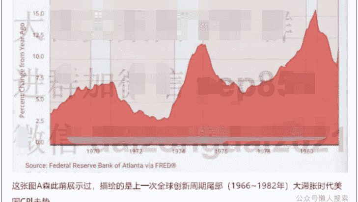

# 合集《十五五规划前瞻》之——1、十五五规划前瞻分析：未来5年最大的投资蓝图

251005 A 视野

整理：公众号懒人搜索，懒人专属群独享
懒人微信：lazyhelper

需要提前布局应对了

中国经济最重要的事情，要来了！

中国长期按照 5 年规划来运作，因此，每一个 5 年规划，都是一次财富洗牌的窗口期。另一方面，眼下中美博弈，处于历史性的时刻。

如果未来十五五规划期间，中国获得领先优势，则中美大国博弈的形态必将是“攻守易形”。

此外，重大的政策，尤其是救市政策，势必是以配合 5 年规划去出台的。

因此，前瞻性的了解十五五规划的核心内容，以及它的影响，对于大家做好提前布局，意义重大！

为了抢占先机，【A 视野】特此发布深度调研思考内容。本系列围绕十五五规划，将前后分三篇文章。

第一篇《十五五规划前瞻分析：未来 5 年最大的投资蓝图》（即今天的这篇文章）
第二篇《终极一割的前夜》（将于 10/6 日发布）
第三篇《十五五规划，国运抉择的超级分水岭》（将于 10/8 日发布）

A森将分别从三个维度，系统性、一次性、独家原创性的给大家讲清楚底层逻辑：

- 1、十五五关键内容、指向与财富逻辑
- 2、十五五全球影响和战略目标，套利与风险深度剖析
- 3、十五五规划能不能成？影响几何？我们需要做些什么？

本合集总共 3 篇文章，共 880 微信豆。购买后，可阅读本合集的所有 3 篇文章。下面开始今天的正文。

各位多多支持！

本次十五五规划的发布，是在一个错综复杂的国际国内环境下。

因此，它回应的不仅是当前国内的偏通缩，也不仅是中美博弈，而是有着更加深远的利益诉求。

长期关注【A 视野】的老铁都知道，A森反复强调过：

村里现在以长期可持续发展为原则，不再以应对短期风险为主要优先事务。不过，从实践角度，这天然导致，当前一段时间，国内政策面的真空。

真正熟悉村里运作的人都清楚，上上下下，都在围绕十四五规划的考核和收官。这毕竟是直接影响所有相关人员的前途、绩效和奖惩的大事。

如果这次考核有个三长两短，很多人就仕途彻底结束，谁知道 5 年后的考核会不会又有更多新人替代自己？

由于这是村里自上而下的体系性的制度安排，因此，即使是财爸和央妈，都不可能选择在十五五规划落地前拼命出大招。

但是，反过来，这也意味着：

一旦十五五规划落地，则很多大招就会加速落地。

这种独特的有形之手主导的经济周期，与我们看到的西方经济学完全不同，却是长期主导我们国民经济的真正脉搏律动。

那么，这次十五五规划的核心主旨，到底有哪些？

- 全面押注 AI+革命
- 加速补齐短板
- 夯实军工自卫能力，做好“随时可能要打”的系统性准备
- 给对手制造短板

大家思考一下，既然一切的假定剧本是“中美必有一次终极摊牌”，那么，如果你是村里，你会现在做什么？

## AI+革命

放眼全球，现在还能够算是真正意义上的前沿产业（新质生产力），就是围绕 AI+革命。坦率说，暂时还真的看不到其它的创新机会。

关键是，AI+是把电力、算力（芯片）、数据等很多重要的科技产业全部串联起来。

美国人在“碳美元”收割阳谋溃败后，现在就指望 AI+革命来收割全球了。

所以，对于中国而言，破除美国的这一经济图谋，甚至反向收割，也就是立国之本。

目前，我们在调研的过程中，已经耳闻：

中国或将公布自己的 AI “星际之门”项目。

如果届时真的公布，那么，对于这个庞大的产业链上下游所有的企业，都将是超级重大利好。

可以说，这是本次 5 年规划中，最值得关注的超级亮点。

那么，这个时候，我们拼命夯实芯片等短板产业，就不再是避免被卡脖子了，反而也是成了创新追赶的一部分。

从这个维度，今天中国所有的前沿产业国产替代，不是简单的避免产业链风险，而是全部服务于自己的创新需要，是通向未来高科技发展的准备。

## 军工超级周期

我们很清楚，美国是长期靠“科技寻租红利”混饭吃的。

一旦没有“科技寻租红利”，他们整个经济、制度、福利、金融市场都会出现严重的问题。

因此，逼急了，美国后续主动找我们麻烦的可能性会大增。

这也天然意味着，村里在接下去的 5 年规划中，会持续强化军工的投入，而且规模只会越来越大，甚至会出现井喷的可能。

那么，我们该如何理解军工？

请注意，在印巴空战、沙特与巴基斯坦签署共同防御协议后，中国军武的出口市场前景豁然开朗。

这也意味着，军工产业的逻辑已经变成了类似于“科技概念”，是一个成长的概念，可以对标科技股的逻辑去计价了。

由于未来 5 年内，中美随时有可能擦枪走火，所以，军工产业的基础极为扎实。甚至不排除突发事件对该板块的提振，也是值得期待的。

## 反向卡脖子

从川普 2.0 开始，中国也学会了更加精妙的主动卡美国的脖子。事实证明，这一招极为有用，让川普极为头痛。

那么，这些筹码，村里是不可能轻易松手的。

这其中，稀土永磁等，也就成了红利方。

即使行业在本土早已产能过剩，可是，依旧可以获得战略性产业的直接红利。

这里需要注意，其实，中国可以卡美国脖子的领域，可不只是稀土永磁这一项，而是很多。也就是说，一旦双方博弈进入深水区，后续，中国加码这类卡美国脖子的制裁，会全面增多。

这里，A 森给大家分享一个调研的例子。

近期，中国对美国最牛的造船公司执行制裁。众所周知，此前美国还想要对中国造的船收钱，还要全球港口加入围堵我们。

但是，我们就一个制裁，可以直接让美国的造船业上游关键性的零部件、设备、材料等完全拿不到。

如果拿不到，那么美国的造船业也就被我们锁死，反而我们一家独大的格局还会进一步演绎，相当于是做到了全球垄断。

这件事就在提示我们，未来中国反向卡脖子的产业，会迎来越来越多的红利期。

一个制造业增加值占据全球 1/3 的世界工厂，可以生产各种零部件和设备，要想卡人家的脖子，那可是轻而易举的可以找到各种筹码。

## 强制性再平衡

这个逻辑，是极为关键的！

众所周知，过去 5 年，为了全面赶超，我们在供给侧的投入，近乎是海量资源。甚至，一度严重忽略需求侧，也要力保供给侧的迭代升级。

不过，当前已经到了很多新质生产力都找不到足够的需求去匹配订单。因此，本次十五五规划的一个极为重要的定位，就是：强制性再平衡。

接下去，尤其是从明年开始，村里会开始逐步追加对需求侧的刺激、强化对供给侧的“反内卷”。

整个经济目标，从“防风险优先”，加速切换回“力保经济增长第一”。

这也意味着，后续顺周期的板块，还有大消费板块，甚至是地产链的部分优质资产，会逐步走出一波修复。

毕竟，只有它们修复了，才能看到需求侧的崛起，才能实现新的 5 年计划的目标“力保经济增长第一”。

那么，我们如何观察政策的落地情况呢？

其实，很简单，一般 11 月份是面向次年经济发展的第一波政策披露期。

如果 12 月至明年初，传统顺周期、大消费等板块的权重开始出现明显的修复，那么，说明市场中先知先觉的资金对赌，这波需求侧的刺激力度会有相当力度。

如果没有出现，则说明市场还在等。那么，下一个可以观测的节点，只能是明年的 3 月份北京重磅会议了。请注意，这对于大家的市场参与节奏把握，是直接相关。

## 美元去魅

现在，中国铁了心要加速渐进式去美元。

毕竟，只要美元霸权可以卡住我们，我们也很难逃出人家的五指山。

从近期利用上海黄金交易所的黄金去香港离岸市场构筑黄金新储备玩法，看得出，村里对于美元渐进式脱钩，已经是加速布局。

另一方面，这些年我们对外支付所需的美元，也越来越少了。

国产替代、俄罗斯被制裁、一带一路计划等，都在加速人民币体系的建设根基。因此，我们未来 5 年，所需的美元，只会加速边际递减。

可是，美国人为了洗债，即将启动弱美元周期，全球到处都会是各种美元。

于是，我们真实所需的美元，和全球到处泛滥的美元，两者之间存在严重的背离。

可以想见，中国后续就会把手里越来越多的美元，加速配置黄金，加速配置其它南方国家的核心资产。

这就直接引发 3 个重磅链条：

- 出海逻辑
- 重要的矿产
- 贵金属超级周期

因此，如果投资方向能够同时叠加上述多重逻辑的，往往也就是极为有前景的。

这里我们需要做一个重要的提示。

这张图 A 森此前展示过，描绘的是上一次全球创新周期尾部（1966~1982 年）大滞胀时代美国 CPI 走势。

大家看得出：

- 1、前后三浪滞胀，每一次 CPI 下行的底部，是不停被抬上去的
- 2、每一浪滞胀的高点都是明显高于前一浪的高点
- 3、这是一场长达 10 多年的疯狂
- 4、每一浪大滞胀，前后要延续好几年

目前，我们现在所处的本轮创新周期尾部，2021 年到 2025 年，已经是美国这轮大滞胀的第一浪。

看得到，后面美联储要降息，后面美国的国债规模失控还是趋势性的。因此，美国有着极强的动力，向全球输出滞胀来缓解自身压力。

这件事之所以重要，是因为，我们恰恰是制造业大国。

滞胀意味着，收入停滞，成本飙升。

我们的上游各种能源、农业、矿产的价格会逐步拔高，但是，发达国家的经济停滞带来的是收入端的压力。

这也意味着，我们要守住目前的偏通缩格局，也撑不了多久了。

在美国即将点燃全球大滞胀的第二浪背景下，我们不可能独善其身的。

况且，偏通缩的环境，已经足够长了，也给了国内很多企业必须通过涨价来图存的动力。

那么，一旦进入十五五规划的正式执行阶段，接下去，“国内反内卷+国外大滞胀”的组合拳，会彻底改变我们后续几年的财富格局和底层逻辑。

这个情形，将直接决定后面市场走势的关键方向。

更为棘手的是，这次大滞胀的第二浪，又恰逢美国陷入霸权可能丢失的挣扎，中美两边的产业链断裂还会提速。

产业链断裂，势必带来市场断裂。

不仅如此，相互之间，既要重新划分全球势力版图，又要相互抢夺其它国家的生意。此外，中美产业链战争，是面向未来产业的博弈。

反观我们跟其它发达国家的产业链战争，则是聚焦于当下的产业博弈。至于我们跟欧洲的产业链战争，是两者兼顾。

这个局，天然会将十五五规划按照最坏的情况去做规划部署了。

即，如果美西方国家中所有发达国家都站队美国，一起搞我们，就像俄乌冲突那样，我们怎么办？

请注意，这是深藏在十五五规划中的重要主线，却又是不能公开说的东西。美国等于逼中国把所有产业都做。

既可以拖延中国产业升级的速度和力度，削弱中国创新能力，也放大中国与其他东亚国家、欧洲国家的博弈。

另外，随着中美博弈的影响连带其它国家，势必让全球的总需求也出现增长乏力。

这种增长乏力，会直接带来各地的保护主义，进而将中国的外需放入一种相对危险的境地。于是，这次村里反复提及的“国内统一大市场”，就是为此布局。

也就是说，当外需增速不行了，我们又该如何？

从中我们不难看出，村里在十五五规划中，对于需求侧的发力，大概率会让中央财爸带头把自己资产负债表也押进去支持刺激。

所以，不管是房子还是股票，尤其是房子，真正的关键点，就是这个。

只要出台的政策中包含了、或者暗示了“中央财爸将自己的资产负债表押进去”，那么，人民币资产的价格修复就得到了真正的系统性支持。

大家不妨回忆一下“924行情”。

当时，创造性的同意金融机构，拿它们手里的股票去质押国债，再用国债去银行体系内质押获得流动性，这些流动性只能回流股市。

请注意，这就是第一次真正拿“中央财爸资产负债表押进去”的浅尝辄止。其带来的结果，大家都已经看到了。

那么，如果工具更多、规模更大、允许操作的周期更长呢？

根据 A 森的调研，在不能完全依赖外需的前提下，整个十五五规划期间，需求侧的牌，全部押在这个单一逻辑：

### 中央财爸资产负债表押下去救市

这将是目前核心城市楼市彻底止跌回稳的关键政策信号。

这将是大 A 实现长牛、慢牛的流动性压舱石。

这将是统一大市场成败的决定性举措。这将是走出偏通缩的扛鼎之作。

换个角度，今天我们去关注十五五规划，本质上，就是对赌中央财爸一定会这么做。决定你家庭财富的超级拐点，即将到来！

## 应该思考，提前布局

预计，整个红利期也是好几浪，而不是一波走完。

掌握好节奏和趋势的“并举”，是自己家庭财富回血、甚至创造新高的重大契机。

PS: 以上分析内容，皆为个人学习、思考、调研的成果，仅作为知识分享，不作为直接投资建议。

## 最后，安利小懒的付费群：

### 懒人专属群（介绍）

懒人专属群持续更新中，已持续运营 6 年，整理超 3000 份各类精选付费文章 & 年费社群干货，全部开放下载。

本资料为付费群内分享，仅供真实有需要的朋友查阅

懒人专属群更新记录：
https://lazy2025.top/blog/record2

懒人专属群更新记录（需梯子，备用）：
https://lazybook.fun/blog/record2