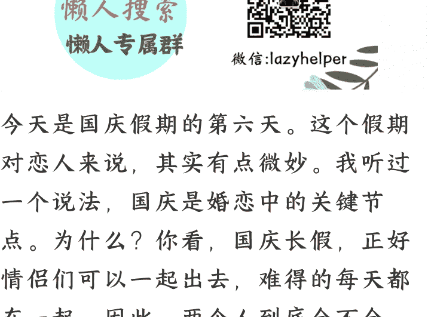

# 国庆长假，特别适合思考爱情

251006

整理：公众号“懒人搜索”，懒人专属群独享
懒人微信：lazyhelper

微信：lazyhelper

今天是国庆假期的第六天。这个假期对恋人来说，其实有点微妙。我听过一个说法，国庆是婚恋中的关键节点。为什么？你看，国庆长假，正好情侣们可以一起出去，难得的每天都在一起。因此，两个人到底合不合拍，当事人心里也许大概能有个判断。据说也有不少情侣，会在国庆假期之后决定，要不要春节见家长。因此，趁着这个长假，我们聊聊爱情这个话题。

当然，这么深奥的话题，我自己是万万没有资格谈论的。索性，咱们有门课，刘擎老师的《爱情哲学30讲》。刘擎老师是华东师范大学政治学系教授，长期研究政治哲学和现代思想史。你可能会问，一个研究政治哲学的教授，为什么要谈论爱情？

刘擎老师认为，最小单位的共同体就是亲密关系，它也是政治哲学领域的微观细胞。而且，爱情作为人类最基本的情感体验，从古希腊的柏拉图到现代的各路哲学家，都有深入的思考。刘擎老师做的，就是把这些哲学智慧整理出来，帮我们思考爱情这个话题。

接下来，我们来看看刘擎老师的观察。

咱们先从这几年流行的几种爱情观说起。

- 第一种：生物主义化约论。简单说，就是把爱情解释成基因、荷尔蒙和繁衍冲动。你在网上经常能看到这样的文章，“爱情的本质就是多巴胺”“男人爱美女是为了优质基因”“女人要安全感是进化的结果”。

  这种解释听起来很科学，但问题是，它也许把人降低成了动物。按照这个逻辑，莎士比亚的《罗密欧与朱丽叶》不过是两个青春期动物的繁衍冲动，徐志摩的“我轻轻的招手，作别西天的云彩”不过是大脑皮层的化学反应。

  > 你看，这就像用显微镜看蒙娜丽莎，你能看到颜料的分子结构，但你看不到那个神秘的微笑。

- 第二种：神秘论。这种观点走向了另一个极端，把爱情归结为无法解释的缘分、命运、前世今生。比如，“假如有来生，我还要遇见你”“我们一定是上辈子有缘分”“这就是命中注定”。

  这种解释很浪漫，但也很危险。因为它让人放弃了理性思考。既然是命运安排，那就不需要努力经营了。既然是缘分，那分手也是缘分尽了。结果就是，很多人把偶然当必然，把激情当爱情，把依赖当深情。

- 第三种：情感博主的武断偏见。现在网上有很多人自称情感专家，他们把自己的个人经历包装成普遍真理。像“男人都是大猪蹄子”“异地恋必分手”“年龄差超过5岁不会幸福”，这些都是他们说过的。

  这些观点的问题在于，用个别经验代替了普遍规律，用情绪化的判断代替了理性分析。结果就是，很多人还没开始恋爱，就已经被各种“攻略”和“避雷指南”搞得头脑混乱。

你看，这三种观点看似不同，但有一个共同点，它们都没有回答一个最基本的问题：什么是爱情？

那么，什么才是真正的爱情呢？

关于这个问题，刘擎老师给出了一个很有趣的定义，叫“精神怀孕”：爱情是人类个体之间发生的“精神怀孕”现象。

什么叫“精神怀孕”？意思是，当两个人深度相遇时，会在彼此的精神世界里，孕育出一个全新的生命。这个生命不是生物学意义上的孩子，而是一种全新的精神存在。

我觉得这个比喻挺巧妙的。首先，这个比喻贴切。你看，当你真正爱上一个人时，你会感觉自己变成了另一个人，有了全新的感受、全新的视角、全新的可能性。这个过程，和母亲孕育孩子很像。

其次，它提供了判断标准。怎么知道是不是真正的爱情？很简单，看看你有没有“精神怀孕”。假如只是觉得对方好看、有钱、有趣，但你还是原来的你，那可能只是好感或者欲望。只有当你感觉自己因为这个人而变成了一个全新的自己时，才是真正的爱情。

最后，它区分了真假爱情和好坏爱情。就像身体怀孕有健康的也有不健康的一样，精神怀孕也有好有坏。有些爱情让人成长，有些爱情让人堕落。有些爱情让人自由，有些爱情让人束缚。关键不是有没有爱情，而是这个爱情是否健康。

当然，这只是一种理解角度，但我觉得挺值得参考的。

明白了什么是爱情，下一个问题就是，如何识别真正的爱情？

这里有三个关键指标。

- 第一个指标：“不依赖血缘的自愿选择”。真正的爱情必须是自由选择的结果，不能是被迫的、功利的，或者基于血缘关系的。这就排除了包办婚姻、利益结合以及那些“为了孩子而在一起”的关系。

- 第二个指标：“深入的身心互动”。注意，这里说的是身心互动，不仅仅是精神交流，也不仅仅是身体接触。真正的爱情需要全方位的深度连接，两个人不仅在思想上有共鸣，在情感上有共振。

  有人可能会问，那些柏拉图式的精神恋爱算不算爱情？当然算，但前提是这种精神连接足够深入，足够强烈，能够产生“精神怀孕”的效果。

- 第三个指标：“独特的身心体验”。这是最关键的一点。真正的爱情会让人体验到在任何其他人类活动中都难以获得的感受。这种感受是什么？很难用语言描述，但你一定知道，那种心跳加速又内心平静的矛盾感，那种觉得全世界都因为这个人而变得不同的神奇感觉。

你看，这三个指标缺一不可。只有自愿选择没有深度互动，那可能只是单相思。只有身心互动没有独特体验，那可能只是好朋友。只有独特体验没有自愿选择，那可能只是一时冲动。

但这里还有一个更深层的问题，为什么现代人即使按照这些标准，还是很难找到真正的爱情？不是因为我们不够理性，也许恰恰是因为我们太理性了。

什么意思？现代社会崇尚效率，我们习惯于用成本效益分析来思考很多事，包括爱情。很多人会计算对方的学历、收入、家庭背景，会分析这段关系的投入产出比，会评估分手的机会成本。

但问题是，爱情本质上是一种非理性的体验。它需要你放下防备，允许另一个人进入你的精神世界。这个过程充满了不确定性和风险，是无法用理性计算的。

你想想，古人谈恋爱是什么样的？他们会花几个小时写一封情书，会为了见一面而跋山涉水，会因为一个眼神而心跳加速。这些看似“低效”的行为，其实是精神怀孕的必要条件。

而现代人呢？我们用微信聊天，用视频通话，用各种App约会。这些工具提高了效率，但也过滤掉了很多微妙的信息，对方的体温、呼吸的节奏、说话时的小动作。这些看似无关紧要的细节，其实是精神怀孕的重要催化剂。

基于这些前提，刘擎老师有这么几个建议。

- 首先，重新训练自己的感官。放下手机，去真实地感受世界。注意身边人说话的语调变化，观察他们的微表情，感受他们的情绪波动。爱情始于细微的感知，你看，假如连身边人的情绪都感受不到，怎么可能产生深度的精神连接？

- 其次，学会接受不确定性。爱情不是一个可以控制的项目，它更像是一场冒险。无法预知结果，无法规避风险，无法保证回报。但正是这种不确定性，让爱情变得珍贵。你要培养脆弱的勇气。真正的亲密来自相互的脆弱。你要敢于在对方面前哭泣，敢于承认自己的恐惧，敢于表达自己的需要。只有当你愿意脱下盔甲时，真正的精神怀孕才可能发生。

- 最后，理解爱情的政治性。这听起来很奇怪，但换个角度看，爱情不仅仅是两个人的私事，它也是一种微观的政治实践。在一段亲密关系中，你们要共同决策，要分配资源，要处理冲突，要建立规则。

法国哲学家阿兰·巴迪欧说过一句话：“爱是最小型的‘共产主义’。”

什么意思？在爱情中，你们不再是两个独立的个体，而是一个共同体。你们共享资源，共担责任，共同创造一个属于你们的世界。

说到这，你应该已经发现，爱情远比很多人想象的复杂和深刻。它不仅仅是一种情感体验，更是一种生命实践，一种哲学探索，一种政治实验。这也是为什么，面对困惑，我们有时需要的不是更多的技巧和攻略，而是更深的思考和理解。

假如你对这些思考感兴趣，推荐你去听听刘擎老师的《爱情哲学 30 讲》。也许这门课不仅能帮你思考爱情，更能为你的亲密关系提供更深刻的指导。

（懒人专属群内正在更新，完结后也会整理成精美电子书分享给群友们~）

最后，安利小懒的付费群：

懒人专属群（介绍）

懒人专属群持续更新中，已持续运营 6 年，整理超 3000 份各类精选付费文章 & 年费社群干货，全部开放下载。

本资料为付费群内部分享，仅供真实有需要的朋友查阅

懒人专属群更新记录：
https://lazy2025.top/blog/record2

懒人专属群更新记录（需梯子，备用）：
https://lazybook.fun/blog/record2