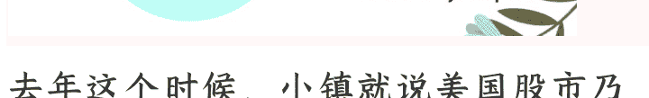

# 美国 AI 故事已形成“蛇头吃蛇尾”的闭环

251009 大树乡谈

整理：公众号懒人搜索，懒人专属群独享

懒人微信：lazyhelper

去年这个时候，小镇就说美国股市乃至资本市场最重要的就是“讲好 AI 故事”，必须不断地创造想象空间，这样才能给投资者一个继续跟随的理由，到底能不能实现是次要的。正因为这个逻辑，所以美国股市的涨幅会越来越集中在少数几个 AI 巨头身上，随着泡沫增大，机会当然是有的。但问题在于泡沫什么时候破裂。

另外还需要提醒，个人购汇依法是不能参与海外投资的，目前数据已经打通了，跨境投资所得必然要补税，这跟 10 月 1 日开始落实的平台经营者税务信息报送是一体的，都是个税体系的进一步完善。

目前看已经临近泡沫的最后时刻，一个标志在于频繁出现“左脚踩右脚”的操作，还是短时间内连续出现。美国时间 9 月 22 日，英伟达和 OpenAI 突然宣布结成战略合作伙伴关系，并由英伟达向 OpenAI 最多投资 1000 亿美元，以支持 OpenAI 建设 AI 数据中心；仅仅半个月后，10月6日，OpenAI就宣布与AMD达成几十亿美元的芯片协议，OpenAI还承诺未来几年将向AMD采购相当于6吉瓦算力的AMD芯片。1吉瓦算力目前建设成本大概是600亿美元，这就相当于3600亿美元，这可是真金白银而不是虚高的市值。

这是左脚踩右脚然后又踩左脚，已经开始螺旋升天了。其背后本质逻辑是，英伟达给OpenAI最多1000亿美元，然后定向购买英伟达芯片，而英伟达借此获得OpenAI公司10%的股份；再然后OpenAI从英伟达借钱买芯片宣称建设数据中心，以数据中心作为资产抵押，继续融资，并以融资向AMD购买更多算力芯片，继续宣称建设数据中心，而AMD作为回赠，向OpenAI授予一份可购买最多1.6亿份普通股的认股权证，这大概是AMD公司10%的股份。

看似这一轮操作不过是左手倒右手，但如果加入资本增值的逻辑就大不一样了。之所以选择AMD，而不是继续从英伟达购买算力，很重要的原因是AMD的市值更低，AMD跳涨前市值不到3千亿美元，而英伟达市值已经高达4.5万亿美元，显然规模更小的更容易跳涨，而且AMD市盈率大大高于英伟达，想要支撑市值继续大增，特别需要营收的大幅增加，OpenAI的大宗采购订单，就是关键。

通过这一轮操作，AMD在账面上就可以获得更高的营收，从而支持AMD股价大增；而OpenAI凭借持有的10%AMD股份，可以获得高额的投资收益，这也可以视为OpenAI的营收，从而有助于提高OpenAI的估值，方便以超万亿美元规模上市，投资人就可以套现离场，而英伟达不仅可以向OpenAI卖出去1000亿美元芯片，弥补自身营收增速下降的问题，未来还可以将持有的10%OpenAI股份变现，获得部分现金回报。

整个链条的所有参与者理论上都获利了，但钱不可能凭空变出来，那么羊毛到底出在谁身上？而且美国这些年电力发展陷入停滞，如果上述宏大的算力中心建设真的成真，并且稳定运营，电力从何而来？又如何在短短几年内完成建设，总不能让建成的算力设施闲置吧，如果闲置，那么算力建设的故事也要破裂了。

在这两次操作之前，9月10日，美媒还爆料称，OpenAI还与甲骨文签署了一项5年3000亿美元的云服务合同，9月11日微软与OpenAI签署一份非约束性谅解备忘录，重构了双方的合作，申明微软与OpenAI之间的云服务独占模式结束，这使得OpenAI重组更进一步。

而甲骨文也正是 TK 美国数据公司的实际运营者。9月22日英伟达与OpenAI达成战略协议的当天，美国白宫称甲骨文公司将负责监管美TK用户数据安全。

在这里需要简单介绍下，目前讨论比较多的一个TK新运营方案是，TK美国业务拆分为经营业务和数据管理两部分，字节继续掌控业务部分的100%股权，这一部分承担各种广告等实际赚钱的业务；而后者类似“云上贵州”，只负责TK美国用户的数据管理，但不同于“云上贵州”没有任何外资股份，字节仍然可以在TK美国数据公司中占有19.9%的股份，是单一最大股东。

以上发生在最近一个月的事件，在某种程度上形成了“蛇头吃蛇尾”的闭环。

美国AI故事已经成为2023年以来美国资本最主要、最核心的逻辑，这个故事如果破灭，美国股市必然迎来新一轮泡沫破裂。虽然科技股可以讲预期，但市盈率终究得在合理范围内，那么提高AI核心公司的营收就特别重要了，关键就是英伟达等造铲子的，以及OpenAI这个尚未上市的核心概念。

但问题在于，目前美国主要推动的生成式AI大模型，严重缺乏商业应用场景，之前美国MIT发布的《生成式AI的鸿沟：2025 年商业 AI 的现状》报告显示，尽管企业在生成式 AI 上已经花费数百亿美元，但超过 95%的企业迄今没有获得商业回报，少数获得回报的，相比投入也堪称微不足道。

就连最新估值高达 5000 亿美元的OpenAI，2025 年上半年营收才只有43 亿美元，但为了实现这一营收，烧掉了 25 亿美元，而 OpenAI 公司 9 月认为全年营收将达到 130 亿美元，并且大幅上调了 2030 年的收入预测，把此前预测的 1740 亿美元上调到突破2000 亿美元。

但就算大幅上调，仍然不足以维持 OpenAI 的超高估值，更难以维持美国数十万亿的 AI 相关概念的泡沫。目前除了要满足必须越来越高的营收目标，更需要想办法筹集庞大合作所需要的数据中心建设费用，至少要在理论上先凑出来 2026 年的，否则泡沫立刻就要破裂，毕竟太多投资人想要套现，也有太多投资人随时准备做空。

仅目前公布的英伟达和 AMD 的合作规划，仅仅 2026 年 OpenAI 就需要近千亿美元的现金支出，这简直就是开玩笑了，虽然美国股市总市值非常高，但要想真金白银的融到大几百亿美元谈何容易？

不仅 OpenAI，甲骨文也面临类似问题，一方面甲骨文宣布要大规模建设数据中心，但甲骨文自身现金流远远无法支撑宏大规划，算力租赁的毛利率也远低于甲骨文擅长的数据库软件业务。

反正都在讲鬼故事，都想着赌一把在泡沫破裂前成功逃顶。当然未来机会肯定有的，毕竟泡沫破裂前一定会有一轮盛大的狂欢，但毕竟风险越来越大了。

而之所以美国资本圈目前采取左脚踩右脚的模式，一个很关键的原因在于中国的变量。

上面大概总结了美国最近一个月围绕 AI 和芯片的故事炒作，同一时期，中国也释放了很多信息。从九三阅兵展现军事能力开始，9月 15 日宣布对英伟达违反反垄断法实施进一步调查，9月 17 日中芯与宇量昇开始国产 DUV 光刻机合作测试，9月 25 日黄仁勋称中国在芯片制造领域仅落后美国几纳秒，并形容中国工程师可望成功且动作迅速。此外还有一些严重过头的炒作，就不一一详述了，还是要务实一点，接下来几年能够把国产 DUV 搞好就很不错了，而且只要掌握 28nm 以上成熟制程，也足够了。

再结合中国拒绝英伟达 H20，这就对英伟达等 AI 造铲子公司的营收带来了严重冲击。

从英伟达 2026 财年第一季度财报来看，中国市场似乎没那么重要，毕竟占比不过 12.5%，相比过去的 20%以上占比大为缩水，相信现在中国市场占比必然更低，可能都不到 10%。

但在黄仁勋看来，中国是未来的关键，一方面当然是因为中国未来在 AI 算力方面的建设规模还要超过美国，另一方面是因为大量与中国的交易，并没有体现在纸面上。

现在已经形成了一个环中国算力建设带。根据英伟达 2026 财年二季度报，新加坡市场竟然占英伟达全球营收的 22%，仅次于美国。英伟达的解释是，来自新加坡的很多营收属于“集中销货”，只是统计在新加坡名下，但并非最终消费地，不过是途径新加坡中转而已，而且还说统计到新加坡的订单最终用户多为美国用户，采购的 AI 芯片并没有流入中国大陆。

这或许是真的，但在马来西亚、沙特、阿联酋、迪拜等地，算力堪称暴增，这些国家有这么多算力需求吗？最终需求来自哪里呢？总不能是美国吧？

一个最简单的道理，美国是资本主义国家，利润是资本主义最高的追求，以美国政府的行政执行能力，真有能力管控住美国的资本巨头吗？这显然是不可能的，实际上，美国的芯片管控远没有炒作的那么严密，只要有钱就能买到，无非就是看通过什么途径绕一下，国内一些公司说买不到芯片所以进展受阻等等，很大程度是为了掩盖资金不足。

在这种情况下，美国 AI 故事，对中国的真实依赖度要大大超过纸面数据，这应该是公开的秘密了。而中国推动芯片自主化这是必然的趋势，中国规划中的 AI 算力建设，已经成为新型基础设施建设、数据基础建设的关键，如此庞大的蛋糕没有让给外资企业的道理，毕竟这些资金相当部分来自于财政，如果给了外资，又有多少能留在中国呢？又如何带动中国自主产业的崛起？如何把更多收益留在中国，造福全民？

正是在美国 AI 芯片远比纸面更依赖中国市场的基本现实下，美国 AI 概念企业未来不仅要面临在中国市场的持续萎缩，还要面对来自中国同行的激烈竞争，于是不得不选择“左脚踩右脚”“蛇头吃蛇尾”。客观上，必然会带来一波泡沫破裂前的狂欢，毕竟至少从逻辑上暂时是完美的，但以后呢？大量风险已经串在了一起，继续这样玩下去，真要有一环断了，整个链条都要崩，泡沫越晚破裂，爆炸的威力就越大。

相比年初，目前越来越多的机构已经开始承认泡沫破裂的危机，这已经成为未来决策的重要因素，国家接下来决策重点之一，就是应对大概率即将到来的美国金融危机。除非美国真的能够神奇地在短期内给庞大的生成式 AI 找到足够的商业应用场景，或者真正实现通用人工智能的突破，但可能性低到几乎可以忽略不计。

近期黄金一直涨，也反映了广大投资者对美元的信心持续下降。

最后强调下，小镇任何分析都不构成投资建议，只是分析趋势和产业变化，毕竟小镇的风格就是稳健理财，只要能够高于 10 年期国债收益率就行了。还是如小镇之前在《工薪阶层，没必要煞费苦心折腾理财投资》反复说的，如果资金体量不够大，也没有专业的积累，还是谨慎为好。

最后，安利小懒的付费群：

懒人专属群（介绍）

懒人专属群持续更新中，已持续运营 6 年，整理超 3000 份各类精选付费文章 & 年费社群干货，全部开放下载。

本资料为付费群内部分享，仅供真实有需要的朋友查阅 🙏

https://lazy2025.top/blog/record2

懒人专属群更新记录（需梯子，备用）：

https://lazybook.fun/blog/record2