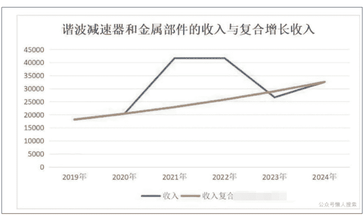
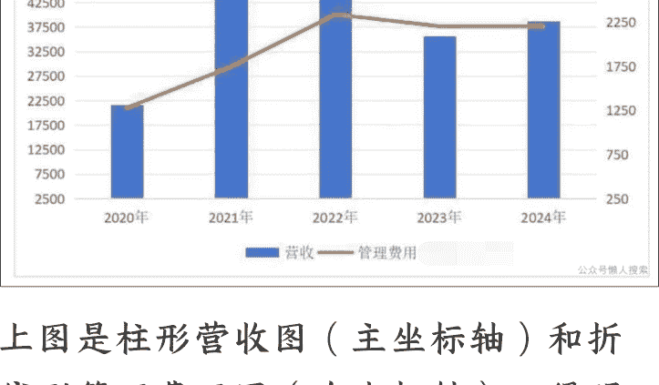
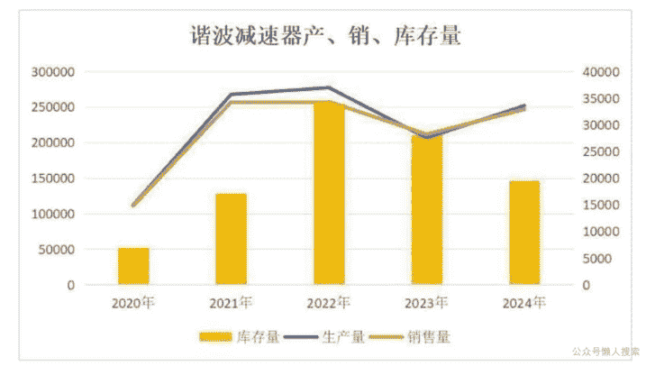
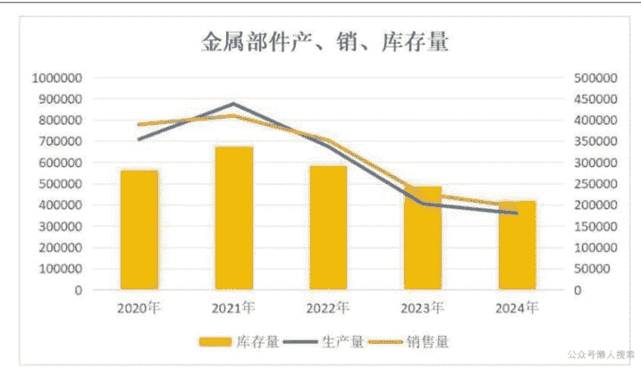
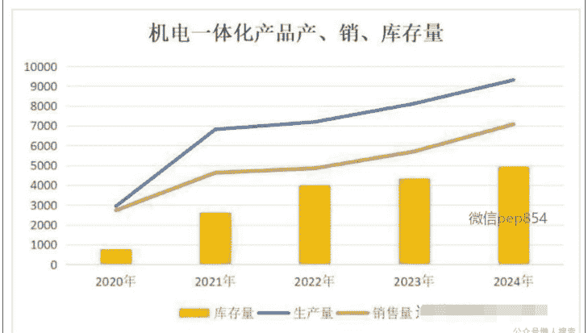
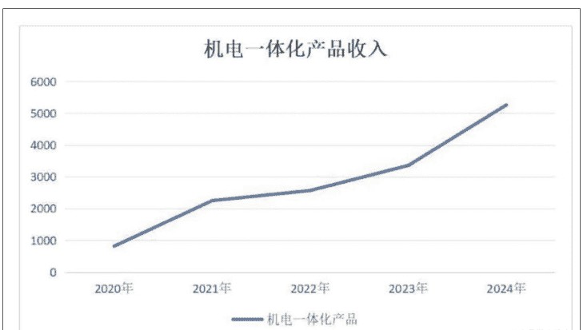
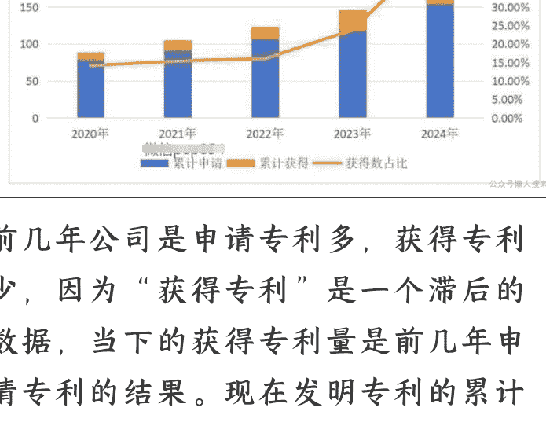
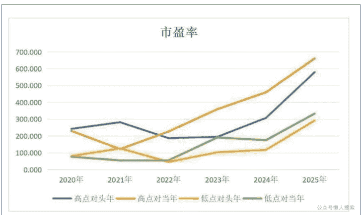
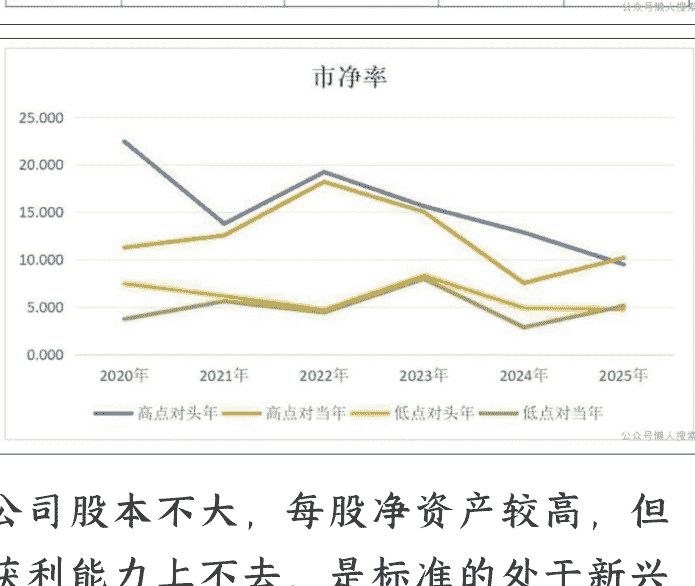

# 公司分析20:从构建核心技术的护城河到抓住机器人的东风
## 251009 安民分享

整理:公众号懒人搜索,懒人专属群独享懒人微信:lazyhelper

今年2月，我们经过深入而全面的研究后发布了旧行业分析2，以我们团队的视角分析行业未来巨大的增长空间。从文章发布当天开盘价算起，板块指数最高涨幅47.52%；从文章发布后的最低点涨到节前的历史最高点，涨幅达82.79%。板块涨幅尚且如此，其中个股表现可想而知。下图，红箭头所指处为文章发布的日子。

行业分析2发布后，不断有读者发来私信，希望我们能更进一步，分析这个行业中具体的公司。我们虽没有直接回复，但也确实在行动。今天分析的这家在科创板上市的机器人行业公司，它就是我们的作业。

这家公司可以说是我们在近几年强调的新质生产力、国产替代、中国制造2025年等等概念的集合体：它在工业机器人、人形机器人的某关键零部件领域做到了世界领先，并且还能全自主供应，凭借着成本和技术优势成功杀入优必选、特斯拉 Optimus 机器人供应链。也使它以不大的体量获得了相当高的关注度。

它应该是机器人领域绕不过去的一家小型科技公司，现在万事俱备，只等行业的东风。

我们将结合公司 2024 年年报和 2025 年半年报，为大家深度分析这家公司。文章分为八个部分，包括跨行业看机器人的必然性、公司业务分析、各财务环节对公司利润的影响、影响公司业绩的因素和排序、公司 2024 年和 2025 上半年基本情况与股本扩张潜力、专利与研发投入情况、您真的理解了“国产替代”吗、公司的市场定位。

图表较多，建议您用平板或电脑端微信阅读。

（声明：本文只为开拓视野、引导思路，并非择时，亦非荐股。股市有风险，入市需谨慎，配方不构成投资建议或意见，我们无力为大家的投资负责，请大家注意投资风险）

## 一、跨行业看机器人的必然性

在分析这家公司之前，我们有个养老院的见闻要和大家分享。大家可以从跨行业角度去感受未来社会的发展趋势。

国内已经有一些保险公司设立了自己的养老机构。8月份，我们工作室有助手搞调研，去了某保险集团在武汉的养老院，向工作人员了解到了一些情况。

该集团在全国多个城市建有统一的高品质养老院，业务国内一流，收费模式是每人收取5万元押金，再每个月支付数额不等的房费（根据住所规格和人数，从6000到一万多不等），另收伙食费，如有身体不适，会送往旁边的自有医院诊治，费用自理。水电费、公共区域和设施的使用、艺术体育等课程则是全免费的。

目前一期工程已经建成并投入使用了约5年，有超过1100个床位，已经住了800多个床位。集团正在附近建设二期工程，规模略小于一期。

我们问了工作人员：“当前的一期项目经营，是否能做到回本？”
答：“不能，目前只能做到现金的流入流出打平，就是那个EBIT什么的，但折旧摊销还不能覆盖。”
问：“那要有多少入住才能做到真正的盈利呢？”
答：“根据其他城市的经验情况，要在1000以上。我们希望今年达成目标。”

问：“成本中哪一项是最高的呢？”
答：“肯定是人工。”

我们解读一下这段问答。

首先工作人员说的“EBIT”并不准确，结合养老院的现金流打平和折旧摊销无法覆盖的现状，应该是“EBITDA”，即息税折旧摊销前利润，这个数字可以保持为正数，表明养老院在日常的人工、水电等方面可以不用集团输血，但加入了资产的折旧和摊销后就不行了，更不用提一定存在的利息支出和未来将会有的所得税，所以这家经营了5年的养老院至今在集团的财务报表上仍然拖后腿。

可能大家对这个还不理解。简单地说，收入是所有老人交给养老院的钱及其他一些零星收入，比如停车费等。成本是养老院开支在每个老人身上的钱。之后是毛利。然后要减去税金及附加、销售费用、管理费用（即最贵的人工），减去研发费用，加上其他收益，投资收益和公允价值变动收益，加上营业外收支，到此为止，为正。但利息支付即财务费用没有考虑，折旧即资产减值损失没有考虑；利润表中，在它之后的所得税费用和少数股东损益也没有考虑。一旦考虑这些，那就是亏损。

也就是还没有达到盈亏平衡。

现在养老院的经营策略是开源，扩大宣传，招徕更多有意向居住的老人，降低床位空置率。1000 张以上才能赚钱，也就是入住率要有 90%左右。

我们认为凭借这家养老院的软硬件水平和在其他城市的成功经营经验，再加上武汉这个特大型城市的体量，一期项目扭亏为盈不是问题，二期项目前景也会相当不错。

但要注意的是“90%入住率”作为盈亏平衡线，留给集团公司的利润空间只有剩下的 1—90%=10%的入住率，而且还得保证床位住满才有这个水平，这还没考虑所得税费用，及以后的人工费的刚性增长。作为以品质著称的国内头部养老院，这个利润空间并不高。

并且该集团建在北京、上海等城市的养老院虽已实现盈利，可河南、广西等地的养老院，入住率相差很远，连现金流打平都做不到，短期扭亏几乎不可能，要贴钱做。所以如果把养老院业务看成一个整体，它仍是捉襟见肘。

原因是什么呢？就是老人家没有那么高的收入，大家交不起那个钱。现在的这个价位，每人每月最低房费+生活费估计不低于 7000 元，高的要到一万大几千，看病的钱还另算。国内退休费能够超过这个数的老人，比例很低，且即使超过了，人家也未必舍得花那个钱。换句话说，想涨费用可能有难度。

再加上国内不止一家保险集团在做养老，而且以后全社会上上下下一定会推出价位、品质不同的各色养老服务，这让该集团的养老院业务迟早会把重心从“开源”转移到“节流”上，怎么节流？那就回到工作人员谈成本的话上了：“肯定是人工。”此时问题就来了，人工会越来越便宜吗？不可能，只会越来越贵。

那要么收费越来越贵，可前面讲了，其他保险公司也会做同类的业务，而且现在的价格有些地方都嫌高了。

所以应该怎么做？答案很明显了，就是在条件成熟时使用机器人，从小批量试点，到大规模投入。

那么，只有我们调研的这家大集团养老业务会用机器人吗？当然不是。

养老需求会越来越大，而有条件享受高级养老资源的老人数量有限，需求摆在这里，就一定会有人来卷价格。但人工价格总体是上升趋势，可以想见未来会出现一系列以省成本、降价格为出发点的“创新养老”业务。在机器人不成熟的前期，也许会用类似团购的方式组织人工，机器人成熟后，大家尽可想象机器人租赁、机器人上门等商业模式。

总之，未来的社会会大变，未来的养老会大变，未来的技术会大变，不变的是降本的需求。只要这个需求存在，机器人的使用就会在合适的时机被提上议事日程。

这一部分只是讲本文介入的视角。大家如果想对机器人行业有全面的了解，可以看我们今年二月中旬的相关文章。

## 二、公司业务分析

回归本公司分析，这家公司是绿的谐波，代码 688017.

公司的主营业务，按产品分类，是谐波减速器及金属件、机电一体化产品、智能自动化装备。按行业分类，则是工业及服务机器人、机械装备及其零部件、数控机床零部件、医疗器械零部件，以及其他。

我们这里按产品分类，不按行业分类，但这次会比较特殊，我们要在讲述“谐波减速器及金属件”的同时，把“按行业分类”的“工业及服务机器人零部件”这一产品业务并列讲清楚，原因在后文的科普中会有说明。

### 1. 谐波减速器及金属部件（单位：万元）

| 谐波减速器及金属部件 | 2023年 | 2024年 | 增速 | 增量 |
|---|---|---|---|---|
| 收入 | 31729.33 | 32541.57 | 2.56% | 812.24 |
| 成本 | 18667.87 | 20783.99 | 11.34% | 2116.12 |
| 毛利 | 13061.46 | 11757.58 | -9.98% | -1303.88 |
| 毛利率 | 41.17% | 36.13% |  | -5.03% |

谐波减速器是公司的最核心业务。金属部件则是谐波减速器的配件，以及公司近期刚刚入局、未来人形机器人会用到的关键部件，比如行星滚柱丝杠等。

2024 年该业务收入小幅增长 2.56%，增量为 812.24 万元；毛利下滑 9.98%，同比减少 1303.88 万元。原因是，成本增速高于收入增速 8.78 个百分点，带动毛利率下滑 5.03 个百分点，负面影响毛利 1638.24 万元。公司参与国内招标，受投标因素制约，投标价格上不去，而成本增长，导致毛利率下滑。

以上业务是按产品类型分类的，我们再看按行业区分的业务，“工业及服务型机器人零部件”，注意这两个业务不是并列的，而是不同分类方法下的不同业务类型（单位：万元）：

| 工业及服务机器人零部件 | 2023 年 | 2024 年 | 增速 | 增量 |
|---|---|---|---|---|
| 收入 | 26641.4 | 27687.33 | 3.93% | 1045.93 |
| 成本 | 15713.18 | 17553 | 11.71% | 1839.82 |
| 毛利 | 10928.22 | 10134.33 | -7.26% | -793.89 |
| 毛利率 | 41.02% | 36.60% | -4.42% | |

2024 年，该项业务小幅增长 3.93%，增量为 1045.93 万元；毛利下滑，同比减少 793.89 万元。一样是成本增速高于收入增速 7.78 个百分点，导致毛利率下滑了 4.42 个百分点，负面影响毛利 1222.93 万元。

无论是按产品类型分的谐波减速器及金属部件业务，还是按行业分类的工业及服务机器人零部件业务，都是各自分类里的最高营收，很明显大部分的谐波减速器都供到“工业及服务机器人”了，那么是供给工业机器人多，还是供给服务机器人多呢？显然是工业机器人。

一是因为公司在历年年报里会重点讨论当前国内国际工业机器人产量、市场的变化情况，但对服务机器人分析不多；二是目前的服务机器人还处于早期萌芽的发展阶段。

这也是为什么我们要从产品分类和行业分类两个角度进行分析，因为我们要科普谐波减速器，一旦明白它的特性，就很清楚它的用途。

先了解一下什么是减速器。

这里需要大家把中学的物理知识捡起来，回忆一个公式：功率=扭矩*角速度，

现实生活中“角速度”这个词不常见，但如果有读者关注过汽车，就一定听说过另一个词，“转速”。比如前段时间比亚迪仰望 U9 Xtreme 以 496.22km/h 的成绩创造了量产汽车最高极速的纪录。这台车所搭载的电机，转速达到了 30000 转/分钟。

角速度和转速虽不相等，但两者直接呈正相关，转速越高，角速度一定越高，所以接下来的科普，我们可能会用转速代替角速度，因为它更好理解。

角速度=弧度/时间，弧度=圈数*2π；转速=圈数/时间。所以角速度和转速是从不同的角度描述转速的。换言之，同一个定子，转速和角速度的关系是：角速度=2π*转速。

如果我们把转速比作做动作的次数，那么扭矩就可以比作运用力气的大小（严格点讲，扭矩=作用力* 力臂 *力与力臂夹角的正弦函数，它是这 3 个变量的函数）。

就好像一个 2 公斤的小哑铃，我一秒能举 2 次，但如果是 20 公斤的大哑铃，我两秒才能举 1 次，为什么大哑铃举得慢？因为它重，而我的体格（功率）是不变的，所以我如果要用更大的力气，速度就一定会降下来。这就类似于：功率=扭矩*角速度，当然，这是最浅近的理解，实际的旋转运动会要复杂一些。

这个例子已经充分说明了同功率下，转速越高，扭矩就必然小，相反，如果扭矩大，转速一定会变低。

同样，一个电机，如果我们想让它多使一把劲，举起更大的重物，依据公式，就要让它的转速慢下来，扭矩就变大了，力气大了。

这样我们很自然地发现了减速器的一大作用：如果一台电机包含举起 20 公斤重物的使用场景，那么理论上只用配备一个具有 2 公斤举重能力的小电机以及一个 10：1 的减速器就行了。不用专门配备 20 公斤举重能力的大电机。这就节省了电机成本。

当然，除了增加扭矩外，还有另一个降低角速度的办法，降低转速就是降低角速度，也就是提高控制精度。

因为当其他条件不变时，电机永远都会按一定的速度疯转，这时候降低速度能提高可控性，就像高速行驶的汽车肯定没有倒车入库时好操控一样。同时，降低转速提升扭矩后，因为力气变大了，可以增加抗干扰能力。

另外，降低转速还可以提升编码器的分辨率，假设原电机转一圈，负载也转一圈，编码器在这一圈里提供 100 个脉冲信号，平均就是 3.6 度一个信号：现在加上一个 10：1 的减速器，电机转 10 圈，负载转 1 圈，就变成了平均 0.36 度一个信号，精度分辨率也就提高了。

所以减速器具有两大功用：提升扭矩、提升精度。根据这两个特点，产生了更注重提升扭矩的传动减速器，和更注重提升精度的精密减速器，这里我们讲的主要是精密减速器。

精密减速器有多种不同机械结构，比如行星减速器、RV 减速器、谐波减速器。而绿的谐波这家公司的核心产品从公司名就能看出来，是谐波减速器。

谐波减速器的核心构成部件只有三个，刚轮、柔轮、波发生器。

波发生器是动力输入源，一般呈椭圆形，有点像电动搅拌器，一开机就不停地转动。

柔轮由可形变的柔性金属制成，可以理解为剪去顶和底的易拉罐，中空，外部有齿，内部插入波发生器，椭圆形的波发生器转动后，撑着柔轮不断地形变和旋转。

刚轮一般是个内部有齿的坚固金属环，套住柔轮，它的齿大小和柔轮一样，但齿数会多1到2个，每当柔轮被波发生器撑得形变时，刚轮内部齿和柔轮外部齿会部分啮合。这种啮合不是一两个齿的啮合，而是占总齿数约30%的啮合，并且是由金属的弹性和波发生器的支撑共同作用完成，背隙小，所以带来了谐波减速器极高的精度。

谐波减速器正是靠这种可控形变和柔轮、刚轮之间的错齿啮合共同实现减速。实际运转起来，如果柔轮和刚轮齿数相差1齿，则是波发生器转动1圈，柔轮只旋转1齿。

相比现在常见的精密减速器，比如行星减速器、RV减速器等，谐波减速器的优势是部件少、体积占用小、总重量轻、减速比非常大、精度极高等。劣势则是柔轮因不停地形变，时间长了会导致精度下降或损坏，所以耐用性不够高，并且因为柔轮材质薄韧，所以无法承载大扭矩，传动效率也会相对低一些。主要用于承载 20 千克以下的场景。

这些特点充分表明了谐波减速器在需要精细、低负载操作场景的应用潜力，比如高端工业制造、精密医疗器械、人形机器人的灵巧手、旋转关节等。

我们再稍微补充一下此业务的另一产品，行星滚柱丝杠。

丝杠是将旋转运动转化为直线运动的机械，当机器人需要直线运动时，丝杠就会将电机的旋转运动转化为直线运动。

行星滚柱丝杠因为是靠圆柱形的滚柱进行线接触，相比靠球形滚珠进行点接触的滚珠丝杠，具有高负载、长寿命、高精度、强耐冲击性的特点。所以行星滚柱丝杠是服务型机器人必备的零部件。

我国国产的行星滚柱丝杠和外国先进企业有一定差距，单件生产时各个指标都不错，但一旦量产，品质就会比较容易有下降，比如精度只有竞品的三分之二、噪音变大、磨损变快等。

绿的谐波经过攻关后，取得喜人效果，经工业机器人、人形机器人及高精度数控机床等装备中的实际应用验证，公司的行星滚柱丝杠，产品性能指标已达到国际领先水平。

但是这只是技术攻关，产品只实现了重点行业的小批量供应，尚未大规模量产。不过公司相关产能扩张项目已经开始实施。

通过讲述谐波减速器和行星滚柱丝杠，我们发现绿的谐波的野心不小，它死死盯住智能机器人执行系统中最核心的两个部件，要把它们都吃下去。

我们回到谐波减速器及金属部件业务上，公司的此业务的历年复合增长率为12.42%，如下图所示：

这个复合增速并不算高，2021和2022年是因为下游的工业机器人需求较旺盛，所以收入格外高一些，公司对此在年报里有说明。

经过我们前文的科普介绍，大家能发现，公司的谐波减速器目前仍然只能以工业机器人为绝对主要的收入来源，而工业机器人受宏观经济和制造业的影响，周期性比较明显，会直接影响到公司这一块的业绩。

现在最常见的所谓服务型机器人，作用是火锅店里从后厨运菜品到餐桌、企业大厅里导览迎宾、家庭中提供语音辅助等。这些机器人要么很傻，要么不会动，完全起不到真正高质量的服务作用。这种水平的服务型机器人，是不可能融入我们日常生活的，也就谈不上大规模应用。

也就是说，服务型机器人当下的发展阶段，远远滞后于谐波减速器的发展阶段，是系统性的落后。这使得因轻便、精密等优势本应在服务型机器人中发挥必不可少作用的谐波减速器，因服务型机器人的整体落后而没能发挥出来。

但对服务型机器人的前景，我们是看好的，具体原因我们在前文的第一部分和之前的旧行业分析2中，分别从不同角度阐释过。而未来人形机器人的爆发是必然。这也是我们团队认真研究这家公司的原因之一。

我们再看一下公司谐波减速器业务的成本构成项目（单位：万元）：

| | 2023年 | 2024年 | 增量 | 增幅 |
|---|---|---|---|---|
| 直接材料 | 7235.59 | 7891.13 | 655.54 | 9.06% |
| 直接人工 | 4866.43 | 5186.53 | 320.1 | 6.58% |
| 制造费用 | 5348.76 | 5991.19 | 642.43 | 12.01% |
| 委外加工费 | 1217.09 | 1715.14 | 498.05 | 40.92% |

成本构成的具体各项目差不多都是几百万的增长，与其认为是成本增长太快，不如说是营收增速没有上去。原因就是招投标对价格有压制。

再来看一下2025年半年报和2024年半年报的情况(单位:万元):

| 谐波减速器及金属部件 | 2024半年报 | 2025半年报 | 增速 | 增量 |
|---|---|---|---|---|
| 收入 | 14649.45 | 19692.78 | 34.43% | 5043.33 |
| 成本 | 8833.47 | 12932.63 | 46.40% | 4099.16 |
| 毛利 | 5815.98 | 6760.15 | 16.23% | 944.17 |
| 毛利率 | 39.70% | 34.33% |  | -5.37% |

2025上半年，该业务营收超高速增长，增量5043.33万元；毛利中速增长，增量944.17万元。成本增速大于收入增速11.97个百分点，带动毛利率下降5.37个百分点，负面影响毛利1058.08万元。

虽然2025上半年该业务的收入同比增速仍低于成本增速，但毕竟收入基数大，配上高增速，一样保证了毛利正增长，与2024全年相反。

### 2. 机电一体化产品(单位:万元)

| 机电一体化产品 | 2023年 | 2024年 | 增速 | 增量 |
|---|---|---|---|---|
| 收入 | 3355.5 | 5259.33 | 56.74% | 1903.83 |
| 成本 | 1978.89 | 3095.78 | 56.44% | 1116.89 |
| 毛利 | 1376.61 | 2163.55 | 57.17% | 786.94 |
| 毛利率 | 41.03% | 41.14% |  | 0.11% |

2024 年，机电一体化产品营收和毛利均超高速增长；营收增量 1903.83 万元，毛利增量 786.94 万元。成本增速低于收入增幅 0.3 个百分点，带动毛利率提高 0.11 个百分点，正面影响毛利 5.88 万元。

2024 年，上述两项业务即谐波减速器及金属部件+机电一体化产品，一共减少毛利 516.94 万元。

机电一体化产品不是谐波减速器这样的固定部件，而是机电传动及电液传动集成模块，是公司为客户提供的更标准化的解决方案，像套餐一样。

但这并不代表所有这些套餐都与谐波减速器无关，相反，谐波减速器仍是相当部分解决方案的重要组成部分，比如 KAH 系列旋转执行器、KAS 系列旋转执行器等。当然，此类业务还包含 KMF 无框力矩电机、线性执行器、KGR 系列数控机床五轴转台等产品，这些产品未必会用到谐波减速器。

这里特别讲一下旋转执行器。我们可以把它想象成人形机器人需要做旋转运动的关节，肩、肘、腕关节等，它需要灵活地转动，更重要的是，它需要“精度”。没有精度的机器人大家应该有印象，看过机械舞的读者也会明白，机械舞的卡顿感就是模仿早年低精度的人形机器人的那种感觉。

在服务机器人尚未全面铺开、世界各机器人厂商争相秀肌肉的当下，大家都在比谁家的产品更像人，能做更多人能做的事。怎么让机器人动作像人？一个重要任务是提升旋转执行器的精度。

我们前文科普中反复讲过了，减速器的重要作用之一是提升精度，而精密减速器中，最擅长精度的就是谐波减速器。所以公司的谐波减速器优势会延续到这项业务中。

回到这项业务本身。

这里我们看看公司历年的机电一体化收入图，其中2018和2019年数据为上市前的招股说明书所公布：

如果从上市前的2018年开始算，该业务的复合增长率达到了惊人的92.93%，如果从上市当年的2020年算，复合增长率也高达59.42%。所以毫无疑问，公司在这块儿的业务经营得相当不错。

2025半年报和2024半年报数据如下（单位：万元）：

| 机电一体化产品 | 2024半年报 | 2025半年报 | 增速 | 增量 |
|---|---|---|---|---|
| 收入 | 2454.3 | 4163.93 | 69.66% | 1709.63 |
| 成本 | 1421.54 | 2516.02 | 76.99% | 1094.48 |
| 毛利 | 1032.76 | 1647.91 | 59.56% | 615.15 |
| 毛利率 | 42.08% | 39.58% | | -2.50% |

2025年上半年，机电一体化业务收入和毛利依然延续了超高速增长；收入增量1700余万，毛利增量615.15万元。成本增速高于收入增速7.33个百分点，带动毛利率下降了2.5%，负面影响毛利104.26万元。

2025年上半年，上述两项业务，共增加毛利1559.32万元。

### 3. 智能自动化装备（单位：万元）

| 智能自动化装备 | 2023年 | 2024年 | 增速 | 增量 |
|---|---|---|---|---|
| 收入 | 234.15 | 463.33 | 97.88% | 229.18 |
| 成本 | 263.56 | 227.68 | -13.61% | -35.88 |
| 毛利 | -29.41 | 235.65 | | 265.06 |
| 毛利率 | -12.56% | 50.86% | | 63.42% |

智能自动化装备业务没开展多久，增速飞快，增量229.18万元。毛利更是增加了265.06万元。成本相比2023年下降了13.61%，带动毛利率上升63.42个百分点，正面影响毛利293.85万元。毛利和毛利率也由负转正。

至此，2024年，公司前三项业务毛利同比减少251.88万元。

本业务没有2024年半年报披露，只有2025年半年报数据可看：（单位：万元）

| 智能自动化装备 | 2025 半年报 |
|---|---|
| 收入 | 814.85 |
| 成本 | 796.65 |
| 毛利 | 18.2 |
| 毛利率 | 2.23% |

2025 上半年，公司前三项业务毛利同比增加 1577.52 万元。

### 4. 主营业务（单位：万元）

| 主营业务 | 2023 年 | 2024 年 | 增速 | 增量 |
|---|---|---|---|---|
| 收入 | 35318.98 | 38264.23 | 8.34% | 2945.25 |
| 成本 | 20910.32 | 24107.45 | 15.29% | 3197.13 |
| 毛利 | 14408.66 | 14156.78 | -1.75% | -251.88 |
| 毛利率 | 40.80% | 37.00% |  | -3.80% |

2024 年主营业务收入低速增长，增量 2945.25 万元；毛利小幅下滑，同比减少 251.86 万元。成本增速高于收入增速 6.95 个百分点，带动毛利率下降 3.8 个百分点，负面影响毛利 1453.42 万元。

我们再结合一下公司的半年报（单位：万元）：

| 主营业务 | 2024 半年报 | 2025 半年报 | 增速 | 增量 |
|---|---|---|---|---|
| 收入 | 17103.75 | 24622.15 | 43.96% | 7518.4 |
| 成本 | 10255.01 | 16215.78 | 58.13% | 5960.77 |
| 毛利 | 6848.74 | 8406.37 | 22.74% | 1557.63 |
| 毛利率 | 40.04% | 34.14% |  | -5.90% |

2025 上半年，主营业务营收超高速增长，增量 7518.4 万元；毛利中高速增长，增量 1557.63 万元。成本增速高于收入增速 14.17 个百分点，带动毛利率下降 5.90 个百分点，负面影响毛利 1452.91 万元。

需要说明一点，这里计算的主营业务，毛利增量数据与前面的半年度毛利累计相加数据相差 19.89 万，我们随即追踪了原因，明确是按产品披露相关信息导致的，就是在按产品统计的时候，把属于其他业务的零部件类产品列进主营业务按产品划分的系列中去了（因为是主要产品的金属部件），这样计算时就有重复。

我们可以清晰地判断是属于谐波减速器及金属部件中的“金属部件”，因为它不是主要产品，属于其他业务。但前面我们按照公司披露的信息进行计算，没有将它单独划出来，这里特别说明一下。所以 2025 年上半年，金属部件的收入为 49.41 万元，成本为 29.52 万元，毛利为 19.89 万元，也即将前面按产品加总的数据分别减去这 3 个数据，就是真实的主营数据。

作为参考，下面是公司历年半年报的数据（单位：万元）：

| 主营业务 | 2021 半年报 | 2022 半年报 | 2023 半年报 | 2024 半年报 | 2025 半年报 |
|---|---|---|---|---|---|
| 收入 | 18178.45 | 24219.11 | 17022.99 | 17103.75 | 24622.15 |
| 成本 | 8833.87 | 11923 | 9893.15 | 10255.01 | 16215.78 |
| 毛利 | 9344.58 | 12296.11 | 7129.84 | 6848.74 | 8406.37 |
| 毛利率 | 51.40% | 50.77% | 41.88% | 40.04% | 34.14% |

2025 年上半年的主营业务收入已达到历史最高。

### 5. 其他业务（单位：万元）

| 其他业务 | 2023年 | 2024年 | 增速 | 增量 |
|---|---|---|---|---|
| 收入 | 297.6 | 476.91 | 60.25% | 179.31 |
| 成本 | 55.11 | 90.24 | 63.75% | 35.13 |
| 毛利 | 242.49 | 386.67 | 59.46% | 144.18 |
| 毛利率 | 81.48% | 81.08% | -0.40% | |

2024年公司其他业务收入和毛利均超高速增长，收入增量179.31万元，毛利增量144.18万元。成本增速高于收入增速3.5个百分点，带动毛利率下降0.4个百分点，负面影响毛利1.93万元。

至此，2024年全部业务毛利下滑107.68万元。

2025上半年和2024上半年的其他业务相比，情况如下（单位：万元）：

| 其他业务 | 2024半年报 | 2025半年报 | 增速 | 增量 |
|---|---|---|---|---|
| 收入 | 136.97 | 519.04 | 278.94% | 382.07 |
| 成本 | 22.61 | 184.15 | 714.46% | 161.54 |
| 毛利 | 114.36 | 334.89 | 192.84% | 220.53 |
| 毛利率 | 83.49% | 64.52% | -18.97% | |

2025上半年公司的其他业务增长非常快，无论是收入还是毛利都已超过2024全年，成本增速高于收入增速435.52%，导致毛利率下降18.97个百分点，负面影响毛利98.47万元。

至此，2025年上半年公司全部业务毛利增量为1778.16万元。

### 6. 全部业务（单位：万元）

| 全部业务 | 2023年 | 2024年 | 增速 | 增量 |
|---|---|---|---|---|
| 收入 | 35616.58 | 38741.13 | 8.77% | 3124.55 |
| 成本 | 20965.43 | 24197.69 | 15.42% | 3232.26 |
| 毛利 | 14651.15 | 14543.44 | -0.74% | -107.71 |
| 毛利率 | 41.14% | 37.54% | -3.60% | |

2024年，公司全部业务收入低速增长，增量3124.55万元；毛利小幅下滑，减少107.71万元。成本增速高于收入增速6.65个百分点，导致毛利率下降3.6个百分点，负面影响毛利1393.02万元。

这里全部业务的毛利增量，和前面各部分业务累计相加的数据相差0.01万元，是四舍五入再累计相加造成的影响，属于正常情况，不是计算错误。

以下是2025年上半年和2024年上半年的全部业务情况（单位：万元）：

| 全部业务 | 2024半年报 | 2025半年报 | 增速 | 增量 |
|---|---|---|---|---|
| 收入 | 17240.72 | 25141.19 | 45.82% | 7900.47 |
| 成本 | 10277.62 | 16399.93 | 59.57% | 6122.31 |
| 毛利 | 6963.1 | 8741.26 | 25.54% | 1778.16 |
| 毛利率 | 40.39% | 34.77% | | -5.62% |

2025上半年，全部业务的营收超高速增长，增量7900.47万元。毛利中高速增长，增量1778.16万元。成本增速高于收入增速13.75个百分点，使得毛利率下降了5.62个百分点，负面影响毛利1412.64万元。

## 三、各财务环节对公司净利润的影响

### 1. 费用环节的影响（单位：万元）

| | 2023年 | 2024年 | 增量 | 影响 |
|---|---|---|---|---|
| 税金及附加 | 345.38 | 390.6 | 45.22 | -45.22 |
| 销售费用 | 1089.44 | 1294.95 | 205.51 | -205.51 |
| 管理费用 | 2202.45 | 2197.57 | -4.88 | 4.88 |
| 研发费用 | 4840.89 | 4959.12 | 118.23 | -118.23 |
| 财务费用 | -2312.03 | -28.17 | 2283.86 | -2283.86 |
| 小计 | | | | -2647.94 |

2024年，费用环节一共减少营业利润2647.94万元。其中最大影响在于财务费用，造成了2283.86万元的负面影响。经查询，是因为2023年有3212.2万元的利息收入，2024年利息收入仅为1284.36万元。

经过这5个环节，公司2024年的营业利润同比下降2755.65万元。

再看看比较有意思的管理费用，相比2023年少了4.88万，虽然不多，但看看过往的公司营收和管理费用（单位：万元）：

上图是柱形营收图（主坐标轴）和折线形管理费用图（次坐标轴），很明显可以看到公司的管理费用高低随着公司营收变化而变化，经过2021和2022两年高收入后，收入一降低，公司就立马控制了管理费用，2024年收入还要高一点，但管理费用依然在下降。降低的这几万块用处不大，但表明公司在体量不大时，就开始有意识地管控费用了。

再看看2025年上半年的表现（单位：万元）：

| | 2024 半年报 | 2025 半年报 | 增量 | 影响 |
|---|---|---|---|---|
| 税金及附加 | 195.48 | 169.75 | -25.73 | 25.73 |
| 销售费用 | 626.49 | 493.33 | -133.16 | 133.16 |
| 管理费用 | 1010.06 | 1342.07 | 332.01 | -332.01 |
| 研发费用 | 2492.31 | 2303.44 | -188.87 | 188.87 |
| 财务费用 | -245.17 | 47.98 | 293.15 | -293.15 |
| 小计 | | | | -277.4 |

2025 上半年，费用方面一共减少了 277.4 万元的营业利润，其中负面影响较大的是管理费用和财务费用。经此 5 个环节，2025 上半年营业利润同比增加了 1500.76 万元。财务费用增加主要因为去年同期货币资金利息收入为 1090.55 万元，2025 上半年只有 178.93 万元；管理费用增加主要因为本期职工薪酬为 683.37 万元，因为有新增员工，上年同期为 336.95 万元。

### 2. 利得和损失的影响（单位：万元）

| | 2023 年 | 2024 年 | 增量 | 影响 |
|---|---|---|---|---|
| 其他收益 | 1367.14 | 1106.08 | -261.06 | -261.06 |
| 投资收益 | 1161.37 | 2765.84 | 1604.47 | 1604.47 |
| 公允价值变动收益 | 118.25 | 388.02 | 269.77 | 269.77 |
| 信用减值损失 | -185.1 | -485.69 | -300.59 | -300.59 |
| 资产减值损失 | -1788.32 | -3425.61 | -1637.29 | -1637.29 |
| 资产处置收益 | | 5.56 | 5.56 | 5.56 |
| 小计 | | | | -319.14 |

2024 年，这 6 个环节共计减少营业利润 319.14 万元。其中影响大的是资产减值损失和投资收益。公司年报说明，资产减值损失的原因在于“存货跌价损失及合同履约成本减值损失”，损失扩大，从 2023 年的 1788.32 万元增大到 2024 年的 3425.61 万元，增加 91.55%。

追踪发现，存货分类中，“合同履约成本”的期初余额、减值准备、计提、转回、转销，期末余额均为 0，所以“资产减值损失”的 -3425.61 万元全部为存货跌价损失，和合同履约成本无关。

再看是哪些存货出现了跌价损失准备（单位：万元）：

| | 2023年 | 2024年 |
|---|---|---|
| 原材料 | 741.19 | 974.44 |
| 在产品 | 16.49 | 16.41 |
| 库存商品 | 560.73 | 1168.69 |
| 半成品 | 469.91 | 1266.07 |
| 合计 | 1788.32 | 3425.61 |

大头的跌价损失在于库存商品和半成品，分别为 1168.69 万元和 1266.07 万元。公司原材料和半成品都计提跌价损失准备，这有些出乎意料。可能是早期购入的原材料成本太高了？

以下是公司各业务产品的生产、销售、库存情况 (单位：台/件/套)：

| | | 2020年 | 2021年 | 2022年 | 2023年 | 2024年 |
|---|---|---|---|---|---|---|
| 谐波减速器 | 生产量 | 112210 | 267442 | 277031 | 206344 | 251736 |
| | 销售量 | 110864 | 256619 | 257402 | 211478 | 246501 |
| | 库存量 | 6957 | 17155 | 33956 | 28156 | 19473 |
| 金属部件 | 生产量 | 708237 | 875191 | 674700 | 404241 | 359220 |
| | 销售量 | 778062 | 818922 | 703639 | 451995 | 392187 |
| | 库存量 | 281489 | 336604 | 291296 | 243384 | 209181 |
| 机电一体化产品 | 生产量 | 2937 | 6814 | 7192 | 8117 | 9309 |
| | 销售量 | 2733 | 4629 | 4852 | 5699 | 7076 |
| | 库存量 | 759 | 2615 | 4005 | 4341 | 4931 |
| 智能自动化装备 | 生产量 | | | 22 | 17 | 320 |
| | 销售量 | | | 22 | 21 | 246 |
| | 库存量 | | | 4 | 0 | 77 |

这里的谐波减速器和金属部件作为存货是分开列示的，但前面列示公司的各项业务时，谐波减速器和金属部件则属于同一项业务，所以它们的产、销、库存量有一定的同步性（下图产、销量为折线图，用主坐标轴；库存量为柱形图，用副坐标轴）：

可以看到谐波减速器和金属部件基本都在随着销量变化而跟着降产量和库存，控制的意图很明显。

机电一体化产品图示如下（产、销量为折线图，用主坐标轴；库存量为柱形图，用副坐标轴）

这里我们结合公司历年的机电一体化收入图：

前文分析机电一体化业务时，我们说过，公司此业务的经营比较优秀，从上市前的2018年开始算，复合增长率达92.93%，如果从上市当年的2020年算，复合增长率也有59.42%，所以机电一体化产品的产、销、库存量是同步增长的。

智能自动化产品就没必要专门画图了，因为它是2022年才有的新业务，基本是产多少就销多少，库存只有个位数。随着2024年的超高增长，产销量才初具规模，库存也才有了77台/套，总体影响仍然很小。

我们追踪公司库存、生产量、销售量的变化，根据存货跌价损失，得出公司2021年以来报废的数据（单位，台/件/套）：

| | 2021年 | 2022年 | 2023年 | 2024年 |
|---|---|---|---|---|
| 谐波减速器 | 625 | 2828 | 666 | 13918 |
| 金属部件 | 1154 | 16369 | 158 | 1236 |
| 机电一体化产品 | 329 | 950 | 2082 | 1643 |

为什么2024年公司资产减值损失扩大了91.55%，您把上面的数据和图看一下就知道了，是报废。特别是谐波减速器，2024年报废了13918个，机电一体化产品报废了1643个。这类产品有升级迭代，产品一升级迭代了，原来的低代产品就销不动，到了年限自动报废，所以原因并不是2024年造成的，而是以前。

公司的谐波减速器，2020年产量比销量多出1346个，2021年多出10823个，2022年多出19629个，2023年少5134个，2024年多出5235个，因此，从数据匹配的角度，2024年报废的产品估计以2021年的为主，2022年的也报废了一部分，而且今年还会是一个报废的高峰年，明年报废情况就会很好。

大家可以根据这个逻辑来追踪一下金属部件和机电一体化产品的报废情况。

投资收益是正面影响最大的项目，为1604.47万元，其中最大影响是理财，从2023年的1348.09万元，提升到2024年的2776.91万元。

经过这6个环节，2024年公司的营业利润同比下降3074.79万元。

下面是公司2025上半年和去年同期的表现（单位：万元）：

| | 2024半年报 | 2025半年报 | 增量 | 影响 |
|---|---|---|---|---|
| 其他收益 | 714.75 | 583.61 | -131.14 | -131.14 |
| 投资收益 | 1084.13 | 1533.32 | 449.19 | 449.19 |
| 公允价值变动收益 | 139.67 | 928.07 | 788.4 | 788.4 |
| 信用减值损失 | -118.52 | -149.45 | -30.93 | -30.93 |
| 资产减值损失 | -619.03 | -1158.82 | -539.79 | -539.79 |
| 资产处置收益 | 5.56 | - | -5.56 | -5.56 |
| 小计 | - | - | - | 530.17 |

这些环节共增加营业利润530.17万元，其中影响较大的是三项，资产减值损失、公允价值变动收益、投资收益，

这里资产减值损失的分析逻辑和前面分析2024全年资产减值损失时一样，2025上半年和去年同期存货跌价损失准备情况如下（单位：万元）：

| | 2024上半年 | 2025上半年 |
|---|---|---|
| 原材料 | 194.53 | 544.56 |
| 在产品 | 7.19 | 15.25 |
| 库存商品 | 111.77 | 304.04 |
| 半成品 | 305.55 | 294.96 |
| 合计 | 619.04 | 1158.82 |

进一步分析，公司原材料就计提跌价损失，表明我们前面分析的两个现象，就是成本增速高于收入增速这个现象和毛利率降低这个现象，还有前面讲的公司招投标时价格难以上去的原因，全部都在这里。估计是公司早年进了一大批高价原材料，现在同类产品价格大降，导致公司的产品生产，原材料就计提不少的跌价损失，半成品也计提。换句话讲，当这批高价原材料消耗得差不多了，那么公司产品的毛利率就能稳住，盈利就能比较快地增长。否则的话，公司就是通过这种手法隐藏利润，而隐藏利润对这类公司来讲，是得不偿失的。当然，我们后面也要即时跟踪公司的现金流，特别是采购等方面的情况。

此外，2025上半年公允价值变动收益带来了788.4万元的正面影响，因为本期交易性金融资产达到了928.07万元，而上年同期是139.67万元。

投资收益带来了449.19万元正面影响，基本为理财产品收益，2025上半年为1548.33万元，去年同期为1092.12万元。

经过这些环节，公司2025上半年与去年同期相比，营业利润增加了2030.93万元。

### 3. 营业外收支、所得税费用和少数股东损益等（单位：万元）

| | 2023年 | 2024年 | 增量 | 影响 |
|---|---|---|---|---|
| 营业外收入 | 0.9 | 0.06 | -0.84 | -0.84 |
| 营业外支出 | 2.11 | 7.22 | 5.11 | -5.11 |
| 所得税费用 | 673.92 | 495.53 | -178.39 | 178.39 |
| 少数股东损益 | 67.69 | -35.94 | -103.63 | 103.63 |
| 小计 | - | - | - | 276.07 |

2024年，这4个环节的影响比较小，总共增加276.07万元的股东净利润。至此，2024年的股东净利润比2023年下降了2798.72万元。

以下是公司2025上半年和去年同期的表现（单位：万元）：

| | 2024半年报 | 2025半年报 | 增量 | 影响 |
|---|---|---|---|---|
| 营业外收入 | 0 | 7.42 | 7.42 | 7.42 |
| 营业外支出 | 0.24 | 1.51 | 1.27 | -1.27 |
| 所得税费用 | 352.43 | 618.73 | 266.3 | -266.3 |
| 少数股东损益 | 75.97 | 166.96 | 90.99 | -90.99 |
| 小计 | - | - | - | -351.14 |

4个环节共计减少了351.14万元的股东净利润。至此2025上半年公司的股东净利润同比增加了1679.79万元。

## 四、影响公司2024业绩和2025上半年业绩的因素及排序

影响公司2024年业绩的因素一共19个，其中正面影响因素9个，负面影响因素10个。小数点后两位可能因为四舍五入而产生少量出入，不影响准确性（单位：万元）：

| 排序 | 正面影响 | 影响额 | 负面影响 | 影响额 | 合计 |
|---|---|---|---|---|---|
| 1 | 投资收益 | 1604.47 | 财务费用 | -2283.86 | |
| 2 | 机电一体化产品 | 786.94 | 资产减值损失 | -1637.29 | |
| 3 | 公允价值变动收益 | 269.77 | 谐波减速器及金属部件 | -1303.88 | |
| 4 | 智能自动化装备 | 265.06 | 信用减值损失 | -300.59 | |
| 5 | 所得税费用 | 178.39 | 其他收益 | -261.06 | |
| 6 | 其他业务 | 144.18 | 销售费用 | -205.51 | |
| 7 | 少数股东损益 | 103.63 | 研发费用 | -118.23 | |
| 8 | 资产处置收益 | 5.56 | 税金及附加 | -45.22 | |
| 9 | 管理费用 | 4.88 | 营业外支出 | -5.11 | |
| 10 | | | 营业外收入 | -0.84 | |
| 小计 | | 3362.88 | | -6161.59 | -2798.71 |

公司有4项业务，三主一副。2024年，谐波减速器及金属部件这一核心业务毛利下降1303.88万，尽管降幅只有9.98%，但因为块头大，导致其他3项业务都是超高速增长，也无济于事。全部业务毛利下降107.71万。费用一块减少营业利润2647.94万，利得和损失减少营业利润319.14万，营业外收支、所得税费用及少数股东损益增加股东净利润276.07，终至全年股东净利润减少了2798.72万，

那么2025上半年表现如何？为了客观，我们分别做出2025上半年同比2024上半年，2025上半年跟2024下半年环比的影响因素排序。

影响公司2025上半年业绩的因素有19个，其中正面影响因素10个，负面影响因素9个，排序和影响如下（单位：万元）：

| 排序 | 正面影响 | 影响额 | 负面影响 | 影响额 | 合计 |
|---|---|---|---|---|---|
| 1 | 谐波减速器 | 924.28 | 资产减值损失 | -539.79 | |
| 2 | 公允价值变动收益 | 788.4 | 管理费用 | -332.01 | |
| 3 | 机电一体化产品 | 615.15 | 财务费用 | -293.15 | |
| 4 | 投资收益 | 449.19 | 所得税费用 | -266.3 | |
| 5 | 其他业务 | 220.53 | 其他收益 | -131.14 | |
| 6 | 研发费用 | 188.87 | 少数股东损益 | -90.99 | |
| 7 | 研发费用 | 133.16 | 信用减值损失 | -30.93 | |
| 8 | 税金及附加 | 25.73 | 资产处置收益 | -5.56 | |
| 9 | 智能自动化装备 | 18.2 | 营业外支出 | -1.27 | |
| 10 | 营业外收入 | 7.42 | | | |
| 小计 | | 3370.93 | | -1691.14 | 1679.79 |

2025上半年，公司三项主营业务产品的毛利增量为1557.63万元，全部业务增加毛利1778.16万元。费用减少营业利润277.4万元，利得与损失增加营业利润530.17万元，营业外收支、所得税费用及少数股东损益减少股东净利润-351.14万元，终至股东净利润增加1679.79万，又回归到超高速增长。

我们可以再看2025上半年环比2024下半年的因素排名，有12项正面影响因素，4项负面影响因素（单位：万元）：

| 排序 | 正面影响 | 影响额 | 负面影响 | 影响额 | 合计 |
|---|---|---|---|---|---|
| 1 | 资产减值损失 | 1647.76 | 所得税费用 | -475.63 | |
| 2 | 主营业务 | 1098.33 | 少数股东损益 | -278.87 | |
| 3 | 公允价值变动收益 | 679.72 | 管理费用 | -154.56 | |
| 4 | 信用减值损失 | 217.72 | 投资收益 | -148.39 | |
| 5 | 其他收益 | 192.28 | | | |
| 6 | 销售费用 | 175.13 | | | |
| 7 | 财务费用 | 169.02 | | | |
| 8 | 研发费用 | 163.37 | | | |
| 9 | 其他业务 | 62.58 | | | |
| 10 | 税金及附加 | 25.37 | | | |
| 11 | 营业外收入 | 7.36 | | | |
| 12 | 营业外支出 | 5.47 | | | |
| 小计 | | 4444.11 | | -1057.45 | 3386.66 |

按环比算，2025年上半年，主营业务增加毛利1098.33万元，全部业务增加毛利1160.91万元；费用增加营业利润378.33万元，利得和损失增加营业利润2589.09万；营业外收支、所得税费用及少数股东损益减少股东净利润741.67万元，终至股东净利润增加3386.66万，超高速增长。

也就是，从业务的角度，2025年上半年，同比2024年上半年，主营业务的毛利增量为1557.63万，全部业务的毛利增量为1778.16万元。2025上半年环比2024下半年，主营业务毛利增量为1098.33万元，全部业务毛利增量为1160.91万元。同比环比皆为正。我们从同比和环比两个角度，都论证了公司2025上半年的主营业务相比2024年上半年和下半年，都有明显的回升。

而且前面的影响因素排序表已经表明，2025年上半年，公司股东净利润同比2024年上半年增加了1679.79万元，环比2024年下半年增加了3386.66万元。

## 五、公司 2024 年和 2025 上半年基本情况与股本扩张潜力

接下来我们看看公司在2024和2025上半年的总体经营情况，以下是公司2024年报表的数据（单位：万元）：

| | 2023年 | 2024年 | 增速 | 增量 |
|---|---|---|---|---|
| 营收 | 35616.58 | 38741.13 | 8.77% | 3124.55 |
| 股东净利润 | 8415.53 | 5616.81 | -33.26% | -2798.72 |
| 扣非净利润 | 7463.03 | 4620.49 | -38.09% | -2842.54 |
| 经营现金流净额 | 14928.85 | 2798.15 | -81.26% | -12130.7 |
| 加权平均净资产收益率 | 4.27% | 2.79% | - | -1.48% |
| 总资产 | 281207.26 | 375531.73 | 33.54% | 94324.47 |
| 净资产 | 201252.72 | 342533.23 | 70.20% | 141280.51 |
| 非经常性损益 | 952.5 | 996.32 | 4.60% | 43.82 |

以下是公司2025上半年经营情况（单位：万元）：

| | 2024上半年 | 2025上半年 | 增速 | 增量 |
|---|---|---|---|---|
| 营收 | 17240.72 | 25141.19 | 45.82% | 7900.47 |
| 股东净利润 | 3661.85 | 5341.64 | 45.87% | 1679.79 |
| 扣非净利润 | 3396.07 | 4248.27 | 25.09% | 852.2 |
| 经营现金流净额 | 35.65 | 4679.61 | 13026.54% | 4643.96 |
| 加权平均净资产收益率 | 1.82% | 1.55% | - | -0.27% |
| 总资产 | 270482.76 | 397939.49 | 47.12% | 127456.73 |
| 净资产 | 199947 | 346125.17 | 73.11% | 146178.17 |
| 非经常性损益 | 265.78 | 1093.37 | 311.38% | 827.59 |

很明显，公司现在的体量比较小，最直观的体现是各个指标数额不大的同时，波动还很大。

营收、股东净利润、扣非净利润这三项，2024年经过相对比较挣扎的一年后，2025上半年迎来不错的复苏，下表为公司历年的上半年营收和全年营收额的对比（单位：万元）：

| | 2021年 | 2022年 | 2023年 | 2024年 | 2025年 |
|---|---|---|---|---|---|
| 上半年营收 | 18400.56 | 24340.57 | 17156.20 | 17240.72 | 25141.19 |
| 全年营收 | 44335.14 | 44574.54 | 35616.58 | 38741.13 | - |

2025上半年营收表现出色，创历史新高，根据以往经验，2025全年公司营收也有望创历史新高。

下表是历年来的全年，半年净利润与扣非净利润（单位：万元）：

| | 2021年 | 2022年 | 2023年 | 2024年 | 2025年 |
|---|---|---|---|---|---|
| 上半年净利润 | 8340.45 | 9164.05 | 5064.11 | 3661.85 | 5341.64 |
| 全年净利润 | 18918.36 | 15530.25 | 8415.53 | 5616.81 | - |
| 上半年扣非净利润 | 6416.69 | 7755.49 | 4574.58 | 3396.07 | 4248.27 |
| 全年扣非净利润 | 14690.83 | 12752.25 | 7463.03 | 4620.49 | - |

2025上半年的净利润和扣非净利润只略低于2024全年，所以2025全年的数据一定是远好于2024年的。

经营现金流量净额是最能体现公司小体量的一栏，因为它的波动太大了，2024年经营现金流出的变化不大，所以我们追踪一下经营现金流入的情况（单位：万元）：

| | 2023年 | 2024年 |
|---|---|---|
| 销售商品、提供劳务收到的现金 | 29034.63 | 23761.02 |
| 收到的税费返还 | 141.96 | 75.93 |
| 收到其他与经营活动有关的现金 | 11859.08 | 2192 |
| 现金流入总和 | 41035.66 | 26028.95 |

销售商品收到的现金减少了5273.61万元，是因为2024年有更多收入以承兑汇票形式体现。

更大的差别在于收到其他与经营活动有关的现金，2024年比上年少了9667.08万元，具体变动如下（单位：万元）：

| | 2023年 | 2024年 |
|---|---|---|
| 保证金、押金 | 4732.24 | 184.14 |
| 备用金 | 23.07 | 8.63 |
| 收到的利息收入 | 3872.3 | 1284.36 |
| 收到的政府补助 | 3065.22 | 561.85 |
| 租金收入 | 57.12 | 94.66 |
| 其他 | 109.12 | 58.37 |

最大影响是保证金和押金的变化，少了4548.10万元，因为2023年货币资金解除质押。利息收入也减少了2587.94万元；政府补助减少了2503.37万元。

再看看历年上半年的经营活动现金流净额（单位：万元）：

| | 2021半年报 | 2022半年报 | 2023半年报 | 2024半年报 | 2025半年报 |
|---|---|---|---|---|---|
| 经营现金流净额 | 5382.71 | 2838.18 | 3164.89 | 35.65 | 4679.61 |

2025上半年已经到了历史第二的位置，2021年是得益于工业机器人的发展，2025上半年则是额外加上了服务型（人形）机器人的助力。

下面表格为2025上半年和2024上半年同比的经营活动现金流入（单位：万元）：

| | 2024半年报 | 2025半年报 |
|---|---|---|
| 销售商品、提供劳务收到的现金 | 10214.43 | 17050.84 |
| 收到的税费返还 | 42.56 | 165.17 |
| 收到其他与经营活动有关的现金 | 1963.21 | 2080.18 |

销售商品，提供劳务收到的现金，主要是业务带来的现金，它的增长不错，因此今年的情况还是比较健康的。

公司的总体情况表中，非常显眼的是总资产和净资产的增长速度，历年的情况如下（单位：万元）：

| | 2020年 | 2021年 | 2022年 | 2023年 | 2024年 |
|---|---|---|---|---|---|
| 总资产 | 179906.27 | 208446.11 | 241519.82 | 281207.26 | 375531.73 |
| 净资产 | 167618.08 | 183696.40 | 193615.06 | 201252.72 | 342533.23 |

公司在 2020 年上市前的资产数据就不放进来了。上市后公司的资产在平稳上升，但在 2024 年大幅上涨，总资产上涨了 9.43 亿，净资产上升 14.13 亿。

我们看一下净资产的变动情况（单位：万元）：

| | 2023年 | 2024年 | 增幅 |
|---|---|---|---|
| 实收资本 | 16867.22 | 16876.39 | 0.05% |
| 资本公积 | 134011.09 | 274731.77 | 105.01% |
| 其他综合收益 | 1344 | 1338 | -0.45% |
| 盈余公积 | 5899.62 | 6490.10 | 10.01% |
| 未分配利润 | 43130.80 | 43096.97 | -0.08% |

变动基本来自于资本公积，而资本公积则来源于定向增发。本次定向增发始于 2022 年，于 2024 年底敲定，向 19 个投资机构或投资人定向增发 14,448,867 股，平均 97.8 元一股，扣除发行费用后净募集 1,402,038,253.77 元，这就是资本公积暴涨的原因，也是总资产和净资产暴涨的原因。

资本公积的一大作用是转增股本，目前公司只有 2022 年 10 转 4 这一次。也就是说，公司有较好的转增股本的潜力，影响它转增力度的原因，就是盈利能力暂时还没有上来，盈利能力还没那么强的情况下高强度转增，有炒作嫌疑。当然这只是猜测，但转增潜力是毋庸置疑的，这些潜在的扩张因素，需要行业高增长才能实现。大家如果不清楚当前和未来的行业情况的话，可以参看我们对行业二的分析报告。

2024 年公司的总资产只有 37.55 亿元，净资产只有 34.25 亿元，资本公积却高达 27.47 亿元。这不仅代表很好的转增潜力，还代表公司的超强融资能力，以及市场对公司极高的期望和认可，愿意用超高溢价拿股权。

相比之下，2024 年资产负债率只有 8.79%，非常低了，公司的债务问题可以说完全不用担心，现在凭借切入人形机器人行业的占位，仅靠股权融资就能获得相当不错的成果。未来如果需要扩产、研发、投资并购，都有很大的融资空间。

最大的阻力是盈利能力，2024 年公司的权益净利率只有 1.64%，放在传统行业里是没有竞争力的。但人形机器人不是传统行业，我们前文的跨行业分析和后文会写的国产替代理解，讲的就是非传统行业的增长潜力。

## 六、公司专利、研发投入和产能建设情况

公司作为国内谐波减速器的领军企业，承担了 7 项国家标准的编制，这点非常关键，因为能编制国家标准，行业技术占位就在高处。

公司围绕 34 项核心技术构筑起技术和产品的护城河，做到谐波减速器全零部件自主供应，在业内知名的 P 型齿、Y 型柔性轴承等技术加持下，在部分指标对行业龙头哈默纳科实现了反超，并且据了解价格只有对方的六到七成。

以下是公司历年的专利情况（单位：件/项）：

| 年份 | 专利类型 | 本年新增申请 | 本年新增已获得 | 累计申请 | 累计已获得 |
|---|---|---|---|---|---|
| 2020年 | 发明 | 16 | 3 | 78 | 11 |
| 2020年 | 实用新型 | 16 | 19 | 99 | 85 |
| 2020年 | 外观设计 | 1 | 0 | 1 | 0 |
| 2021年 | 发明 | 12 | 3 | 91 | 14 |
| 2021年 | 实用新型 | 7 | 17 | 108 | 102 |
| 2021年 | 外观设计 | 0 | 3 | 3 | 3 |
| 2022年 | 发明 | 11 | 3 | 106 | 17 |
| 2022年 | 实用新型 | 4 | 8 | 112 | 110 |
| 2022年 | 外观 | 1 | 1 | 4 | 4 |
| 2022年 | 软件著作权 | 2 | 2 | 2 | 2 |
| 2023年 | 发明 | 12 | 11 | 118 | 28 |
| 2023年 | 实用新型 | 11 | 13 | 123 | 123 |
| 2023年 | 外观 | 1 | 1 | 4 | 4 |
| 2023年 | 软件著作权 | 3 | 3 | 5 | 5 |
| 2024年 | 发明 | 5 | 19 | 154 | 72 |
| 2024年 | 实用新型 | 6 | 8 | 141 | 128 |
| 2024年 | 外观 | 0 | 0 | 4 | 4 |
| 2024年 | 软件著作权 | 0 | 0 | 5 | 5 |

专利里最重要的就是发明专利，公司累计申请、获批通过的发明专利如下图所示：

前几年公司是申请专利多，获得专利少，因为“获得专利”是一个滞后的数据，当下的获得专利量是前几年申请专利的结果。现在发明专利的累计获得量已接近发明专利累计申请量的一半，可见公司正在进入专利收获期，专利护城河的构筑成效不错。

再看看研发投入（单位：万元）：

| | 研发费用 | 研发投入占比 | 费用化占比 |
|---|---|---|---|
| 2020年 | 2402.55 | 11.10% | 100% |
| 2021年 | 4116.00 | 9.28% | 100% |
| 2022年 | 4586.73 | 10.29% | 100% |
| 2023年 | 4840.89 | 13.59% | 100% |
| 2024年 | 4959.12 | 12.80% | 100% |

公司长期保持超过 10% 的高研发投入，而且这些投入全部费用化，没有粉饰报表利润的嫌疑。换句话说，公司在研发这一块的水分很低。

根据 2025 半年报，在研的几个项目中，谐波减速器高强度柔轮优化方法及制造工艺研究已经在 2025 年完成，为国际领先水平；超小阻尼谐波减速器研发及产业化在 2025 年进入中试，为国际先进水平。公司还有超过 10 个处于不同研发阶段的国内国际领先或国际国内先进的研发项目。

在产能方面，公司过去数年一直在建设的“年产 50 万台精密谐波减速器项目”在 2024 年已完成了建设调试和达产工作，实现了 4129.2 万元效益，产能在 2025 年持续爬坡。

而前文提到的定向增发，有一项是建设新一代精密传动装置智能制造项目，规模相当大，计划投入超过 20.3 亿元（作为对比，2024 年刚完工的年产 50 万台精密谐波减速器项目总投资额 2.92 亿元，规划预算 4.43 亿元），项目重点围绕精密谐波减速器及行星滚柱丝杠扩张产能，这两类产品都是服务型机器人、人形机器人或具身智能机器人必用的零部件。项目在 2025 年开始实施，计划 2026 年底完工，根据 2025 半年报，建设进度为 3.7%。

如此大的建设投资和如此急迫的建设周期，可见人形机器人业内真的是暗流涌动。

换句话讲，公司管理层为行业大扩张下公司产能大扩张做好了资金准备和项目扩建准备。融资完成的时间是 2024 年 12 月 20 日，这也反映了他们对行业未来的判断，只是他们没有明说而已。您能明白吗？

## 七、您真的理解了“国产替代”吗？

我们在过去无数次强调国产替代的必要性，说选股时要注意考虑国产替代的方向。而一旦涉及到真金白银的投资，重点就在于您是真的理解国产替代，还是只把“国产替代”当成一个口号或炒作的概念。

把战略当口号的有没有呢？有，比如美国，它现在就把“制造业回流”当口号、当政治正确，但它能做的只有威胁仆从国在美国建厂，这是“回流”，不是“制造业回流”。

随着 2025 步入下半年，越来越多的人在网上讨论，中国制造 2025 的计划到底完成了没有，完成了多少。每当谈及这个时，网上就一定会吵起来。

我们有时会看到一些短视频，题目大概是“国内没有人告诉你，我们与国外在 xx 领域的实际差距”，痛诉我们的机床、轴承、工业机器人等产品或关键零部件如何不堪。下面的评论也是一票自称业内人士随声附和，现身说法，说什么老板都不想买中国造的设备，自己作为工程师看到中国设备头都大了，天天坏，不想修等等。

如果您是国产替代战略的支持者，对这些言论的态度就能体现您对国产替代的真实理解。这段文字是我们对国产替代的分析，有助于您从纷繁的杂音中坚定信念。

您且跟着我们的思路走。

成本有很多种划分方式，如果以“成本是否随着产量提高而提高”为标准，企业的成本可以分为固定成本和变动成本。

固定成本有厂房、设备、行政人员工资、人力资源管理人员工资等等，不管您企业的产品卖不卖得动，这些钱您都是要照出不误的，只要企业还存在，一分钱都不能少出。

变动成本则是随着产量提高，逐步提高的成本，比如更大的产量就一定会花费更多的人工（流水线上工人的）、水电燃料、原材料、销售费用等等，如果企业一件货都卖不出去，理论上这些成本也可以是零，甚至都是零。

我们把固定成本和变动成本中，和“国产替代”最紧密相关的要素拎出来，是什么？固定成本中，是“设备”；变动成本中，是“原材料”和零部件。

好，设备、原材料及零部件，哪一块最容易先被国产替代？毫无疑问是原材料和零部件。

为什么呢？因为企业对设备、原材料及零部件这两块成本的需求，对设备而言，第一要求不是它能比外国设备便宜多少，而是设备能否保持 50 天、3 个月或 6 个月连续稳定地运行，能持续生产转个不停，质量还要好。如果运行 48 小时就有可能停机检修，这对企业主而言是不可接受的，因为设备停机就是损失。检修是损失，停机时落下的产能更是损失，还有折旧的间接损失，所以相比用国产设备省钱，企业往往愿意为低风险的设备付出溢价。

当然，也有例外，比如芯片，这个太重要了，一般的商业逻辑在芯片领域不管用，它运行的是政治逻辑。所以我们之前在数家芯片公司的每日分析文章中就多次强调过设备的国产替代，原因就在这里。它是真能替代。现在我们在网上看到各种“圈内人”说国产设备这不好那不好，本质是资本不愿意拿生产稳定性冒险。而之所以会出现这样的生产稳定性问题，一方面是因为国外的先发优势，这点我们要承认要尊重事实；另一方面是因为进口设备在过去几十年是深植于我国制造业体系的，我们的工艺开发、工程师培养、保养维修经验等等都与这些设备高度相关，还不能排除隐藏的利益相关，所以国产替代在这一块确实会稍微慢一点，而且往往业内人是阻力。再就是一旦国外设备长期垄断我国市场，我们的国货产品应用和迭代的机会就少了，这就容易拉下差距。

但并不是国产设备就不可能超过外国设备，固定成本的国产替代也是大有可为的。除了成本优势，要么像芯片这样的极重要的产业，要么是某些设备和部件的硬指标直接超越国外竞品（比如早年的数字排版、现在的盾构机），或者作为本土企业更愿意参与客户的定制化研发等等，都是超车之道。

变动成本则天然是国产替代的重要阵地。因为理论上任何企业都想尽量提高产量降低成本，而原材料和零部件作为变动成本，每生产一件产品，就要多算一份原材料的成本，此时企业的需求就从“保持长期生产稳定”变成“价格优先”了，而且需求量越大，价格越便宜。生产环节也是，产量越大，成本越低。

然而欧美日企已经反复证明了，它们不愿意在我们没有备选方案时为我们以合理价格供货，它们甚至不愿为自己国家的企业压压价格，这么做的结果就是层层加码，把所有成本压力都加到终端产品价格上。

总之，当我们在聊国产替代时，要分清楚替代的是固定成本还是变动成本，如果是变动成本，在企业提高产量的内在驱动下，只要能保证质量，谁能提供更低成本的原材料（或零部件），谁就一定能脱颖而出，而欧美日企业几乎不可能满足我们的要求，所以真正想成事的企业，不仅是中国企业，甚至是特斯拉，最终往往是和中国企业合作。因为中国企业真的能降成本和价格。电动汽车、无人机、智能手机等产业已经证明，虽然暂时做不到全部来自于中国供应链，但零部件的高度国产化率是必然。而且在中美国贸易战科技战背景下，中国科技产品供应链的高度国产化也是必然。

这次的人形机器人，除了零部件有些优势外，欧美没有先发优势、没有品牌优势、没有标准订立优势、没有从业者成长影响优势，竞争相对公平很多。

而绿的谐波，它在更难走的工业机器人即设备的固定成本国产替代方面做得相当不错，在国内厂商中占有率稳居第一，仅次于老牌日企哈默纳科。未来它的产品应用于人形机器人，很多会成为变动成本的国产替代。就是一旦人形机器人进入家庭，它不是固定资产，而是消费品。

所以，针对服务型机器人的谐波减速器、行星滚柱丝杠、旋转执行器整体解决方案，这些产品，是变动成本的国产替代，它现在已经进了特斯拉机器人和优必选机器人的供应链。以特斯拉的 Optimus 机器人为例，据分析需要 14 到 40 个谐波减速器，所以不仅是特斯拉，全球所有机器人公司都对谐波减速器的产能和成本有很高的要求，这都是国产替代的机会。

换句话讲，一旦人形机器人行业爆发，谐波减速器、行星滚柱丝杠、旋转执行器整体解决方案这些产品绕不过去，公司因为国内市场占有率高，也因为技术壁垒，还因为品牌影响，因此肯定受益较大，也是极早受益的。

对了，我们虽然在这一节反复强调成本，但这不代表我们支持内卷，读我们文章的读者都知道，我们是旗帜鲜明反内卷的。成本优势是保留合理利润，驱逐欧美日那些躺着赚钱的老爷企业，内卷则是打着造福消费者的旗号，不仅与竞争对手争利，还要和整条产业链争利，极力压榨上游企业。这一点是一定要反对的。

## 八、公司的市场定位

我们依然用市盈率、市净率和市销率来看市场给公司的定位，但注意，这次会有一些不同。因为市场对行业的爆发有预期，因此愿意给出高溢价。

### 1. 市盈率（单位：倍）

| 市盈率 | 高点对头年 | 高点对当年 | 低点对头年 | 低点对当年 |
|---|---|---|---|---|
| 2020年 | 242.436 | 230.377 | 80.647 | 76.636 |
| 2021年 | 281.551 | 121.955 | 126.210 | 54.580 |
| 2022年 | 186.656 | 226.873 | 45.905 | 55.416 |
| 2023年 | 194.774 | 359.430 | 103.580 | 191.049 |
| 2024年 | 307.419 | 459.947 | 117.291 | 174.929 |
| 2025年 | 579.290 | 660.941 | 292.049 | 333.043 |

我们选择每年的高点价格、低点价格、对头年的每股收益、对当年的每股收益计算市盈率，参考送红股与转增的情况，结果如表格所示。

数值非常高，而且越来越高的趋势很明显。市盈率这种数据，从不同角度看，结论不一样，要么是市场高估，要么是公司有潜力。不管是哪一种，表明当前市场非常愿意为绿的谐波未来的盈利能力支付极高的溢价。

一般情况下，市盈率这么高的公司，我们会直接 PASS 掉，但绿的谐波能持续在我们视野中的一个因素在于行业因素，也可以看看它的市净率。

### 2. 市净率（单位：倍）

| 市净率 | 高点对头年 | 高点对当年 | 低点对头年 | 低点对当年 |
|---|---|---|---|---|
| 2020年 | 22.438 | 11.277 | 7.464 | 3.751 |
| 2021年 | 13.782 | 12.560 | 6.178 | 5.621 |
| 2022年 | 19.223 | 18.198 | 4.728 | 4.445 |
| 2023年 | 15.623 | 15.030 | 8.308 | 7.989 |
| 2024年 | 12.855 | 7.542 | 4.905 | 2.868 |
| 2025年 | 9.499 | 10.200 | 4.789 | 5.140 |

公司股本不大，每股净资产较高，但获利能力上不去，是标准的处于新兴行业且是行业爆发前的企业。也就是说，因为行业整体规模不够，大家又看好这个行业，导致进入者不少，也即当前的机器人行业还不足以很好地让公司利用现有的资产，把盈利能力做上去。这一点还是要等行业的爆发。因此，后面两年重点是看行业如何爆发，当然，特别要注意的是，行业如果不爆发，那么公司定位就有可能大变。行业如果持续爆发，公司的市盈率市净率就会走低，股价会大涨。

### 3. 市销率

| 市销率 | 高点对头年 | 高点对当年 | 低点对头年 | 低点对当年 |
|---|---|---|---|---|
| 2020年 | 76.262 | 87.307 | 25.369 | 29.043 |
| 2021年 | 106.700 | 52.040 | 47.830 | 23.290 |
| 2022年 | 79.648 | 79.045 | 19.588 | 19.307 |
| 2023年 | 67.861 | 84.927 | 36.088 | 45.141 |
| 2024年 | 72.637 | 66.685 | 27.714 | 25.362 |
| 2025年 | 83.987 | 140.427 | 42.342 | 70.760 |

原理跟前面一样，不多讲。

### 4. 公司股价走势图

我们给出公司上市以来的股价走势图，为周 K 线图。从图中可以看出，公司股价在走大的 ABC 或一二三浪。而 A 浪、B 浪内，都是小的 3 个浪。C 浪或三浪，内部至少也会是小的 3 个浪，但弄不好也会是 5 个浪。内部的小浪就不画了，免得影响大家的判断。

需要特别说明一点的是，本次牛市运行完毕，一旦行业指数或者大盘指数见顶，这家公司的股票最好要卖出。原因是什么？就在于公司的市场定位太高了。即使是行业大爆发期间，定位太高的公司，在大势调整期间，一样会腰斩，甚至跌更多。极端情况下，跌 80% 或更多，也都很正常。像我们前面研究的某新能源设备公司，公司业绩年年高增长，但一样从 208.02 元跌到最低 41.24 元。这一点一定要注意。

(声明：本文只为开拓视野、引导思路，并非择时，亦非荐股。股市有风险，入市需谨慎，本文不构成投资建议。)

（建议或意见，我们无力为大家的投资负责，请大家注意投资风险）

最后，安利小懒的付费群：

### 懒人专属群（介绍）

- 懒人专属群持续更新中，已持续运营 6 年，整理超 3000 份各类精选付费文章 & 年费社群干货，全部开放下载。

本资料为付费群内部分享，仅供真正有需要的朋友查阅 🤫

懒人专属群更新记录：
https://lazy2025.top/blog/record2

懒人专属群更新记录（需梯子，备用）：
https://lazybook.fun/blog/record2