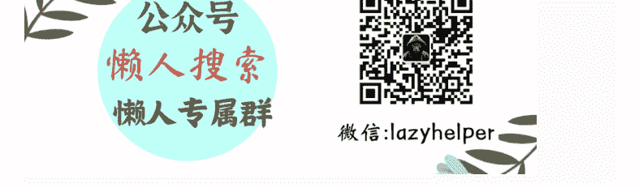
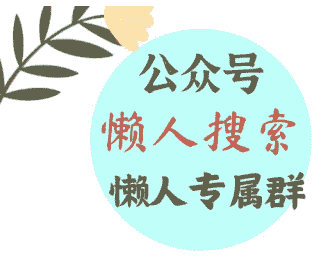

## 24 资本与收益：爱情成功学为什么失败？

251009
整理：公众号懒人搜索，懒人专属群独享
懒人微信：lazyhelper



欢迎来到《爱情哲学 30 讲》，我是刘擎。

从这一讲开始，我们进入一个新的单元，探讨亲密关系实践中的一些问题。讨论的宗旨是培养我们面对具体问题的审慎思考与判断的能力，接近于亚里士多德所说的“实践智慧”。但需要说明的是，这部分课程并不会为你提供应对现实问题的具体技巧和攻略，因为这并不是我擅长的领域。“得到 App”里陈海贤老师的课程和著作，在这方面会提供更有针对性的引导，感兴趣的话，你可以去移步学习。

回到爱情的实践问题。

在我看来，爱是一种依赖实践的认知与能力，就像你必须在游泳中才能学会游泳一样，我们也只能在爱的亲身实践中，提升爱的能力。所以，即便是专业的心理学家，也不会给你一套“爱情宝典”，承诺教会你万能的应对攻略。然而，在一些自媒体平台上，有许多所谓的“情感博主”，专门讲解爱情和婚姻的技巧与攻略，不少博主声称，参透了男女关系的底层逻辑，并传授一套“让你成为爱情赢家”的秘笈。

这类“爱情成功学”有用吗？这一讲，我们就针对当下流行的“爱情成功学”，做出反思性的探讨，揭示其中可能的谬误和误导性影响。

### 爱情成功学的本质和错误

当今社会，爱情关系越来越被置入一种“供需匹配”的框架中，人们被诱导和鼓励以条件和标签来展示自己，以数据和概率来计算配对的可能性。这让爱情不再是相遇、交往和探索，而是进入了一个巨大的“情感市场”。

在这种背景下，“爱情成功学”应运而生，它借助心理学的术语、市场学的隐喻以及战术性的建议，塑造出一种爱情知识体系。例如，它强调“提升自身价值”“学会吊起对方的胃口”“及时止损，避免沉没成本”，等等。这些建议并非全然没有道理，但它们的共同特点是，把爱情看作一种竞争性的资源配置，把亲密关系简化为可预测、可控制的结果。

#### 对爱情的简化

在我看来，爱情成功学的核心，就是对爱情的简化，它们把美好的爱情简化为成功的爱情，成功的本质就是要赢，重点是要“让你赢”。那么，赢的标准是什么呢？主要有两点：

第一，在整个婚恋市场上，让你的条件获得最优的配置，找到你本来可能高攀不上的伴侣，实现成本收益最大化。

第二，在亲密关系中，让你处于支配和主导的地位，实现最高的自主性，让自己始终处于舒服的状态，称心如意才能幸福。

为什么这种爱情成功学，在当下能够大行其道呢？原因也很简单：

首先，它目标精准地击中了婚恋关系中的两个痛点：一个是找不到自己理想的伴侣，也就是“我喜欢的看不上我，喜欢我的我看不上”。另一个痛点是，许多人在亲密关系中感到被压制，失去了自主性。

其次，这套成功学听上去具有很强的可操作性，它将爱情这种复杂的生命实践，简化为一场目标明确的输赢博弈，一种可规划、可计算的交易。这是当今这个时代，人们最熟悉、也最能理解的语言。

那么，在这种预设下，如何才能成为爱情赢家呢？成功学的专家认为，最重要的是要学会理性计算，杜绝恋爱脑。我听到过最令人惊讶和反讽的一句劝导是：“谈恋爱千万不能感情用事！这样你才能处在精算师一样的高位，从而能降维打击，成为赢家。否则你就会上当受骗，输得很惨。”

#### 成功学错在哪里？

有人会问，“爱情成功学”错在哪里呢？谁不想找一个外貌更吸引人、学历更高、经济条件更好、社会地位更高的恋人？寻求尽可能理想的伴侣，这不是人之常情吗？而且在亲密关系中，摆脱支配和压制，让自己感到自主和自在，这难道有错吗？

的确，这两种需求不仅真实，而且正当。实际上，爱情成功学的错误，并不在于它所针对的需求。有一些真正具有专业资质和伦理的咨询师，一直在启发和引导来访者正确地应对这些问题，但正确的方式往往是缓慢和困难的。所以，爱情成功学真正的误导性在于，声称能用简单明确的秘诀，来解决真实而复杂的问题，但这些方法往往是错误的。

具体来说，许多方法通常背离了爱情要求的真诚、尊重、关怀与生命的成长。

比如，我们都想尽可能呈现更好的自己，提升自己在婚恋市场中的吸引力，但前提是要保持基本的真实和真诚。这有点像出门社交时的梳妆打扮一样，通过适度美化，来呈现真实自己的最佳状态，这完全无可非议。但错误的方式是，教你用计谋和策略虚构一套“人设”，虽然更有魅力，却等于在伪造自己，涉嫌欺骗。制造这种人设，不仅难以长久维持，而且从根本上违背了爱情所要求的真诚。

还有，为了避免在亲密关系中被操控、被压制，有些方法声称，应该通过操纵来获得掌控权。这可能会让自己“舒服”，却不是自我的成长。正确的方式，是追求相互的平等与尊重，而不是反过来去用精心设计的话术操控对方。

### 爱情成功学的两种失败

让我们看看现实，爱情成功学已经流行了十多年了，它促进了人们去寻求更好的亲密关系吗？

并没有。实际上，它催生和助长了更多的焦虑、迷茫和挫败感。这可能让爱情成功学获得更大的市场需求，使它作为产品本身获得了成功，但它大概率不会让你在爱情中获得真正的成功。

为什么呢？下面，我们来揭示爱情成功学对于个人而言的两种失败。

#### 策略上的失败

首先，是策略上的失败。爱情成功学几乎无法实现它承诺的目标：让你成为竞争的赢家。

为什么呢？因为它依赖于一种“秘密策略”的假设。所谓“秘密策略”，就是让你在博弈中，获得对方不具有的技巧和策略，通过“信息不对称”来获得博弈中的竞争优势。

可是，这些技巧和策略一旦被广泛传播，而且公开化之后，所有人都在同一规则下行事，结果只能是集体性的失效。

举例来说，某些博主反复强调“谁先表白，谁就输了”，于是年轻人纷纷学习如何压抑自己的感情，等待对方先迈出一步。结果呢？双方都在等待，彼此都害怕“输掉”，于是关系陷入僵局，谁都没有赢。由此可见，这个“策略”一旦成为人所皆知的规则，它不仅失效，还可能彻底阻碍了关系的自然发展。

再比如，还有些博主主张“要制造神秘感，不要过度暴露自己”。这在个别情境下或许能短期奏效，但当每个人都学会“保持神秘”“不回消息”“故意冷淡”，人与人之间的交往就不再是真诚的互相了解，而是都在猜测，对方是否在故作姿态，双方的交往也就变成了一场心理战。久而久之，这种普遍化的策略只会导致信任的稀缺，甚至让真诚的表达也被误认为是伪装。

所以，爱情成功学在某种意义上，有点像是家长想通过“课外辅导”让自己的孩子获得额外的竞争优势，但是当所有孩子都参加了课外补习，他们通过非对称性获得的额外的优势，就大面积地相互抵消了。最终，他们在成绩的竞争中，基本保持了原来的位置，但都付出了过度内卷的代价。

总之，爱情成功学如果要成功，它有一个前提，就是个体获得“私售”的独家秘籍。但现代社会就是一个“泄密的时代”，从教育到理财投资，再到婚恋市场的博弈，没有任何简单明确又容易操作的独家秘诀。

#### 本质的失败

有人会质疑说：我确实知道，有人就是通过爱情成功学的训练，掌握了比别人更高超的博弈技巧，结果成为了爱情的赢家，哪怕只有少数人，这至少也是一种成功吧？

可能是的，通过精心制造的人设，得到了你原本可能高攀不起的伴侣，甚至通过熟练的话术，在亲密关系中占据了掌控权。但是这样的赢家，赢得了什么？真的是赢得了美好的爱情吗？

只有把爱情理解为一场零和博弈时，谁赢得了主动权，才算成功；谁在互动中付出了真情实感，谁就算失败。但这种简化与预设是错误的。我们反复强调过，爱情不能被化约为投资回报的活动，也从来不是零和游戏，而是共同创造一种融合共生的精神生命。这种生命既不是单个个体所独有的，也不是彼此对立的博弈，而是两个生命相互交融所产生的新的意义世界。

因此，如果说生存是对物质需求的满足，那么爱情则关乎生命的成长与绽放。

从更深的意义上说，策略化的“胜利”可能反而是爱情的失败，这也是爱情成功学在本质上的失败。它让爱情蜕变为控制与操纵的游戏，哪怕双方表面上结合在一起。但这种彼此之间只有利益的交易、缺乏深度联结的关系，早已背离了爱情的本质。

依靠算计能获得的，不会是和另一个心灵的融合共生，而是伴侣对你操纵的顺从。这种关系不仅难以承受共同生活的风雨，更重要的是，它丧失了爱情最为美好而独特的那些价值，比如：“被看见”和“被懂得”的承认，深刻的归属感和亲密的依恋，以及超越得失计算的更好的自己。

不过，爱情必须排除理性计算和策略吗？并不是。我们说过，爱情关系也有交易互惠的功能模式，这需要计算。

但我希望你铭记的是：如果完全没有计算，任何关系都不可能存活，包括爱情；但仅仅依靠计算，你可以建立和维持任何关系，但唯独不是爱情。

### 总结一下：

所谓“爱情成功学”，既是现代社会市场逻辑侵入亲密关系的症状，也是面对爱情不确定性时寻求的应急对策。然而，这种对策并不能导向爱情的美好，反而会导致爱的贫瘠与荒芜，误导人们陷入“爱失能”的状况。

爱情成功学失败的原因，并不只是技术层面上的失效，更在于它在违背了爱情的本质。它误把爱情当作一种博弈，但爱情根本不是零和游戏，而是一种融合共生的生命实践；它误导人们以为可以用策略掌控爱情，但爱情的真实价值恰恰在于超越掌控，在于让我们向另一个生命敞开，并与之共同创造一个新的精神生命。

### 思考题

最后，给你留一道思考题：

从你个人的经验看，哪些爱情的技巧和策略是有效且有益于爱情发展的？哪些不是？欢迎在留言区分享你的看法。

### 下节预告

下一讲，我们将探讨：爱情中是否存在那个对的人。我是刘擎，我们下节课再见。

最后，安利小懒的付费群：

懒人专属群（介绍）




微信:lazyhelper

懒人专属群持续更新中，已持续运营 6 年，整理超 3000 份各类精选付费文章 & 年费社群干货，全部开放下载。

本资料为付费群内部分享，仅供真实有需要的朋友查阅 🕵️

懒人专属群更新记录：
```
https://lazy2025.top/blog/record2
```

懒人专属群更新记录（需梯子，备用）：
```
https://lazybook.fun/blog/record2
```