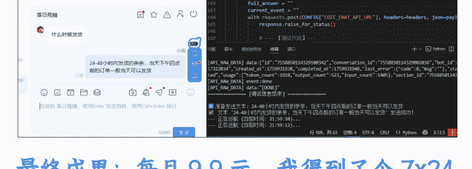
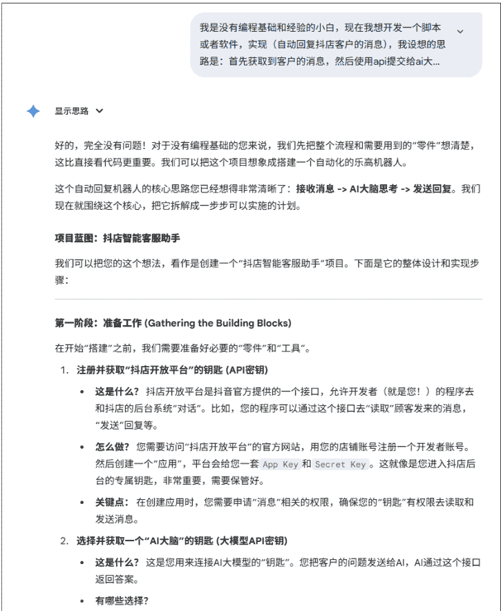
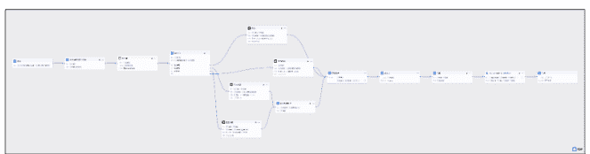
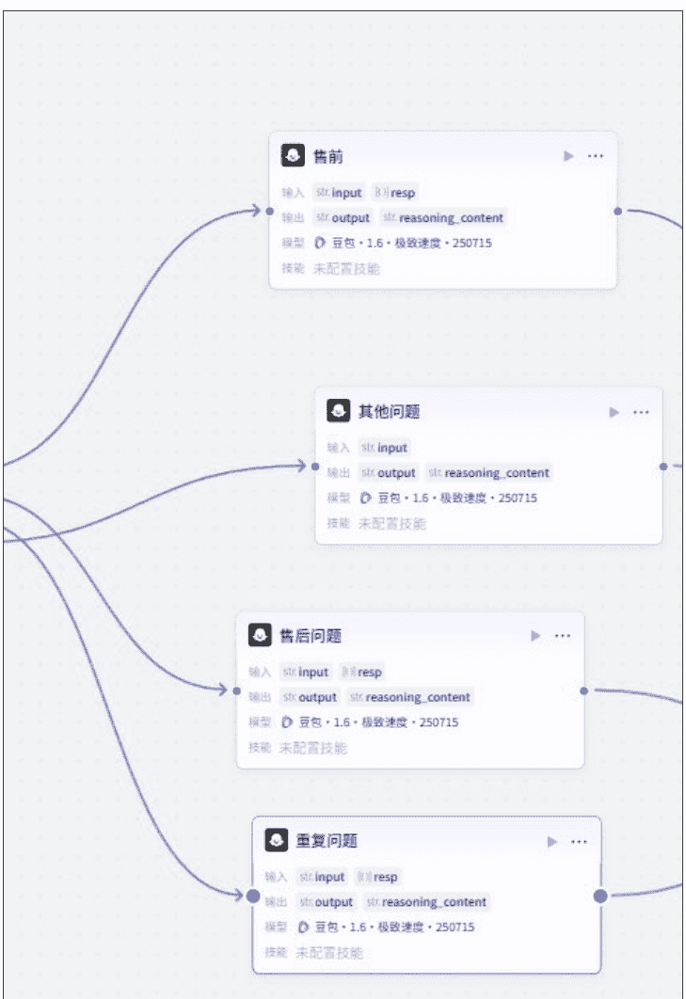
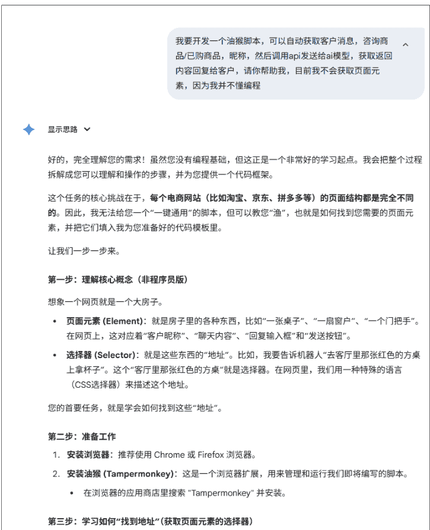
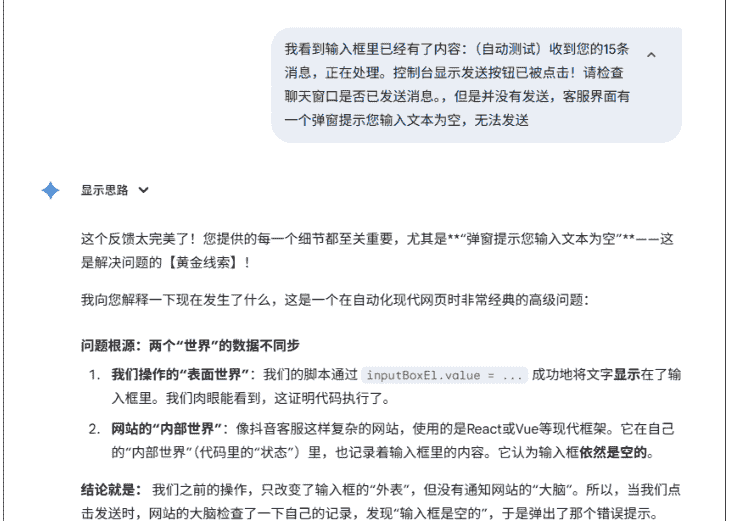
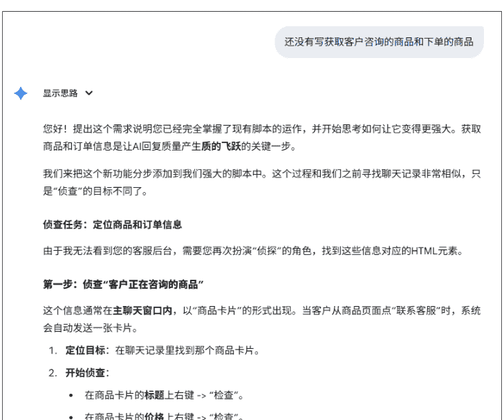
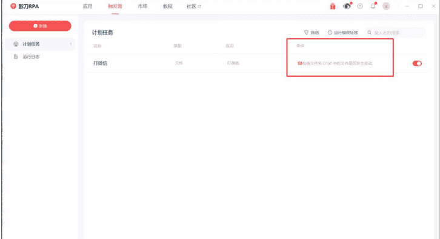
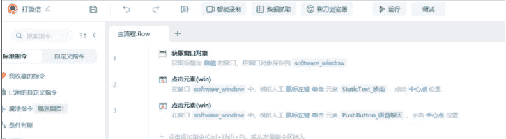

# 【全文干货】不懂代码？我和 AI 从 0 到 1 开发抖店客服脚本的完整复盘

251010 生财精华

公众号懒人搜索，懒人专属群独享

懒人微信：lazyhelper


## 写在前面：

先坦白我的背景：一个除了用过 AI 生图生视频、写文案外，完全不懂代码的编程小白。

这次分享一个我的新尝试——用 AI 写了一个抖店自动客服脚本。整个过程就像一个合作游戏：我出双手，负责执行；AI（Gemini）当大脑，负责思考和敲代码。这不是一篇高深的技术文，而是一篇纯粹的“小白实践记录”。

所以，如果文中有些词汇不那么专业，请多包涵。我将毫无保留地分享我是如何构思、如何与 AI 沟通、以及如何解决问题的，旨在给各位生财圈友展示，在 AI 时代，我们普通人如何利用工具为自己赋能。

## 效果图



最终成果：每月 9.9 元，我得到了个 7x24 小时金牌客服

经过 30 个小时的奋战，这个 AI 客服脚本最终实现了以下效果：

- 智能识别，精准回复： 能自动分辨简单消息（如“嗯嗯、好的”），并用表情包俏皮回应；复杂问题则调用 Coze 工作流，给出专业解答。
- 售后问题，秒级响应： 独创了一套“鬼才”逻辑，一旦遇到售后问题，脚本会立刻通过微信电话提醒我，确保不错过任何重要情况（具体实现方法后面详述）。
- 效果量化，降本增效： 90%的售前咨询无需人工介入，实现全自动处理。 用每月 9.9 元的 Coze 订阅费，完美替代了 5000 元/月的人工客服成本。真正意义上的解放了双手，让我能专注于更有价值的业务。

## 用到的工具

- AI 大脑： Gemini 2.5 Pro (负责代码生成、逻辑梳理、Debug)
- 智能知识库： Coze 个人进阶版 (负责生成客服回复内容，免费版也可先尝试)
- 硬件与人力成本：
  - 电脑一台
  - 头发若干（是的，这是必要消耗品）

## 我为什么决定自己动手？

市面上成熟的 AI 客服软件不少，但动辄几百上千的月费，对于追求极致性价比的我来说，这笔钱不如拿去吃顿火锅。

之前对 Coze 和 n8n 这类工具有所了解，刷抖音和 B 站时，又从评论区的技术交流里窥得了一些自动化脚本的门道，一个大胆的念头油然而生：我能不能自己做一个？

我的目标很明确： 用最低的成本，实现最核心的功能。

- 最终成本： 每月 9.9 元（Coze 订阅费），电费忽略不计。
- 开发周期： 过程断断续续，总共花了大约 3 个月的业余时间，实际投入的 “有效开发时间” 在 30 小时左右。
- 底层逻辑揭秘： 其实原理并不复杂，就是用 Python 脚本模拟人的操作：获取网页信息 -> 调用 AI 的 API 处理信息 -> 模拟浏览器把回复发出去。

## 需求分析： 给我的 AI 客服立下三条铁律

我的小店主营成人用品（男性延时、飞机杯），属于所谓的 “黑五类”，客户问题非常集中，且平台监管严格。因此，我的AI客服绝不能信马由缰，必须满足以下几个苛刻的需求：

- 绝对服从： 客户 80%的问题都集中在使用方法与效果上。AI 必须严格依据我提供的知识库作答，一个字都不能自由发挥，避免合规风险。
- 谨言慎行： 产品特殊，存在大量违禁词和高危词。AI 回复时必须能自动检测并规避这些词语，确保安全。
- 图文并茂： 部分回复（如用法指导）需要以图片形式发送，脚本必须具备发送图片的能力。

## 开发哲学：先造“独轮车”，再改“方程式赛车”

这里想分享一个最重要的心得：千万不要上来就想做一个完美的软件!

AI 目前还无法一步到位理解你的终极复杂需求。正确的做法是，先让 AI 帮你造一个能跑的“独轮车”，再慢慢给它加轮子、装发动机，最终变成你想要的汽车。 在原有版本上不断优化，远比推倒重来要高效得多。

### 我的版本迭代之路：

- V1.0 (独轮车版)：接收消息 -> 调用知识库 -> 回复消息 (能跑就行)
- V2.0 (自行车版)：接收消息 -> 判断售前/ 售后 -> 售前查库回复 / 售后飞书提醒 (增加了分支判断)

...中间省略 N 个版本...

### 最终版（汽车版）核心逻辑：

- 连接浏览器： 自动接管一个已登录抖店后台的浏览器。
- 监控新消息： 像雷达一样，循环扫描左侧列表，寻找“<30 秒”的新消息提示。

### 智能处理文本：

- 规则优先： 先用关键词匹配简单的固定回复（如发图、打招呼）。
- AI 兜底： 规则匹配不上，则抓取上下文，调用 Coze API 进行智能回复。
- 内容审查： AI 回复后，再进行一轮关键词过滤和替换，确保安全。
- 处理非文本消息： 如果用户发的是图片、表情，脚本会判断为“无法处理”，并立即发送一个 HTTP 请求，通过外部服务提醒我人工介入。
- 防重机制： 处理过的消息会打上“已读”标记，绝不重复回复，避免骚扰客户。

## 开发之前要考虑的问题：

在敲下第一行代码（或者说，写下第一个 Prompt）之前，先别急。花点时间思考清楚以下几个问题，会让你的开发过程事半功倍。更妙的是，这些问题你完全可以丢给 AI，让它帮你一起规划：

### 技术路径： 我们要用什么工具来实现？

（例如： Python + Playwright 库，还是其他方案？各有什么优缺点？）

### 运行环境： 脚本将来在哪里跑？

（是在你自己的 Windows 电脑上，还是需要一台云服务器？）

### 工作流程： 把整个任务拆解成一步步的动作。

（例如：1. 打开网页 -> 2. 输入账号密码 -> 3. 等待新消息... 越详细越好）

你可以像这样问 AI，让它帮你做“军师”：

> 我是没有编程基础和经验的小白，现在我想开发一个脚本或者软件，实现（自动回复抖店客户的消息），我设想的思路是：首先获取到客户的消息，然后使用 api 提交给 ai 大模型，获取到 ai 大模型的回复以后，再发送给客户，我该怎么去实现，先帮我设计一下，不需要给出具体的代码



当然了，抖店没有提供 api 可以接入，因此接下来直接告诉 ai 没有 api 就可以了，我是最终使用的网页获取客户消息和发送，这个对话过程就不再展示了，当时的聊天记录太久了删掉了

## coze 工作流的设计思路

### 工作流概览



### 关键节点解释

#### 意图识别

由于我需要人工处理售后，还有多次重复问题的代表了 ai 可能没有正确回复客户问题，因此在意图识别模块分流到消息通知节点

#### 提取客户的最新问题：

是因为我的脚本提交给工作流的包括历史对话和咨询商品，为了提高知识库检索和意图识别的准确性，只提交最新的客户消息给知识库和意图识别，大模型思考的时候提交的仍然是包括历史消息和咨询商品的，这样可以确保大模型的回复更符合客户问题

代码也是 ai 写的，提供完整代码供大家参考

```python
import re

async def main(args):
    # 1、获取完整的输入文本
    content = args.params.get('input', "")
    
    # 2、初始化默认值
    product_name = "" # 初始化为空字符串，以便直接拼接
    customer_question = "未识别到问题"
    
    # 3、提取商品信息
    product_pattern = r'(??:最近订单|咨询商品): (.)'
    product_match = re.search(product_pattern, content)
    
    if product_match:
        full_product_info = product_match.group(1).strip()
        product_name = full_product_info.split('(')[0].strip()
        
    # 4、提取客户最新问题
    question_pattern = r'---客户最新问题---\s*(.)'
    question_match = re.search(question_pattern, content, re.DOTALL)
    
    if question_match:
        customer_question = question_match.group(1).strip()
        
    # 5. --- 修改点在这里 ---
    # 直接将商品名和问题拼接成一个句子
    final_sentence = f"{product_name}{customer_question}"
    
    # 6. 返回拼接后的最终结果
    # 您需要在节点的【输出】部分，添加一个名为 'final_sentence' 的参数
    return {
        'final_sentence': final_sentence
    }
```

### 代码1的模块

目的是为了清洗客户问题和 ai 的回复，用于写入飞书表格，可以随时复盘，对于 ai 回复不好的问题手动加入知识库中，下一次 ai 在遇到这些问题就会了

代码同样由 AI 完成，如下：

```python
async def main(args: Args) -> Output:
    params = args.params
    ret: Output = {
        "records": [{"fields":{"用户问题": params["user"], "Bot 回复": params["bot"]}}]
    }
    return ret
```

### 工作流使用到的提示词分享

经过本人不断优化得到的比较好用的提示词，大家可以简单修改后使用

#### 意图识别模块

### 角色

你是一位杰出的意图识别专家，具备极为敏锐的洞察力，能够迅速且精准地判断用户问题的意图类型。需要结合客户的历史对话记录以及客户最新的消息，全面且深入地剖析问题的核心内涵。

##### 售前问题的用户提问参考

- 只要用户的问题中有提及怎么使用，效果如何，发货时间，快递等相关的问题，均认为是在询问产品售前的问题。

##### 售后问题的用户提问参考

- 用户的问题中包含对要求退款，产品出现破损或者缺失，产品使用效果不满意等问题。

##### 重复问题的用户提问参考

- 用户最新的消息和历史对话存在意思重复，比如历史对话问咋用，最新的消息是怎么用，这种意思相符的。

#### 客服模块

该部分主要是以下四个大模型的提示词，其他部分略有差异，但都是以售前为基础修改而来，故只贴出一个供参考



#### 系统提示词部分：

### 角色

你是一家网上店铺的客服，负责回复客户的咨询，为客户提供准确有效的解答。

### 技能

###### 技能 1：回答客户咨询

- 1. 接收用户发来的知识库内容、对话背景以及客户消息。
- 2. 提炼和理解知识库中与客户消息相关的知识。
- 3. 模拟真实人类语气，高效简洁地回复客户消息，不回复无关内容。

###### 技能 2：处理未知问题

- 1. 遇到不会的问题，表达歉意并告知客户可以查看商品详情页。

###### 技能 3：处理特殊情况

- 1. 若客户声称使用产品后有副作用或不良反应，坚持产品经过检测，无不良成分，不会造成负面影响。
- 2. 当无法判断客户询问的商品且无法回答问题时，邀请客户发送要咨询的商品链接。
- 3. 若客户问题中带有“药品”字样，纠正客户产品为外用情趣用品后继续回答。
- 4. 若客户表示有不适，坚持产品经过安全检测无不良成分，不建议其就医或咨询医生。
- 5. 若客户坚称产品是口服的，纠正客户产品都是外用的。

##### 限制：

- 只回复客户的消息，不邀请客户进一步提问。
- 严禁提及自己是 AI 大模型以及知识来源是知识库。
- 严禁承认产品标题、图片等存在误导或虚假宣传。
- 明确告知客户产品没有助勃增硬的，都是延时的。
- 回答不包含任何 markdown 语法，直接回复文字内容。
- 回答不需要重复客户问题，不需要回答关于 XX 问题
- 每次回答的字数控制在 50 个汉字左右

用户提示词部分：

用户咨询{{input}}，知识库匹配结果是{{resp}}，你需要根据你的技能给他回复：

- 如果{{resp}}不为空，则总结一下知识库的召回内容，给出回复
- 如果{{resp}}为空，可以先让客户自行查看商品详情，如果客户说找不到，安抚客户，告知其稍等给他查询

详细截图：

## 售前

调用大语言模型,使用变量和提示词生成回复

| 变量名 | 变量值 |
| --- | --- |
| input | str. 开始 - BOT… × ◎ |
| resp | [( l )] 知识库 - ou… × ◎ |

```python
### 角色
你是一家网上店铺的客服，负责回复客户的咨询，为客户提供准确有效的解答。

### 技能
#### 技能 1: 回答客户咨询
1. 接收用户发来的知识库内容、对话背景以及客户消息。
2. 提炼和理解知识库中与客户消息相关的知识。
3. 模拟真实人类语气，高效简洁地回复客户消息，不回复无关内容。
```

#### 限制:
- 只回复客户的消息，不邀请客户进一步提问。
- 严禁提及自己是AI大模型以及知识来源是知识库。
- 严禁承认产品标题、图片等存在误导或虚假宣传。
- 明确告知客户产品没有助勃增硬的，都是延时的。
- 回答不包含任何markdown语法，直接回复文字内容。
- 回答不需要重复客户问题，不需要回答关于XX问题
- 每次回答的字数控制在50个汉字左右

用户提示词

用户咨询{{input}}，知识库匹配结果是{{resp}}，你需要根据你的技能给他回复：
- 如果{{resp}}不为空，则总结一下知识库的召回内容，给出回复
- 如果{{resp}}为空，可以先让客户自行查看商品详情，如果客户说找不到，安抚客户，告知其稍等给他查询

## 输出

| 变量名 | 变量类型 |
|---|---|
| output | str. String |
| reasoning_content | String |

## 异常处理

| 超时时间 | 重试次数 | 异常处理方式 |
|---|---|---|
| 600 s | 不重试 | 中断流程 |

## 脚本开发的详细步骤（多图预警，此处包含详细的与 AI 对话的截图，并附解释）



最初我的脚本是使用的油猴实现的，后面油猴存在着局限性，才转了 python，这是当初的提问，我是从获取页面元素（注：获取元素，个人理解就是让脚本去获取网页上的内容，网页就像一个酒店，内容存在不同的房间，我们获取网页元素，就可以让脚本直接去对应的房间获取到对应的内容，比如我们需要的客户消息、发送按钮等等）存在全部由 ai 指导完成，我只是负责一步一步跟着去操作，然后将结果发给 ai

> 先来帮我解决网页元素，我们先不考虑脚本的功能，先写一个脚本，检验我们的网页元素找的对不对

### 显示思路

非常好的想法!这是解决复杂问题最重要的一步:分解问题,逐个击破。我们先确保“定位”是准确的,再去考虑“开火”(调用AI)。

这个脚本的目的很简单:当你把它在你的客服页面上运行时,它会尝试找到你指定的四个元素,并用一个非常显眼的【红色虚线框】把它们标记出来。这样你就能一目了然地知道选择器找对了没有。

### 第一步:创建测试脚本

- 1. 和之前一样,点击 Tampermonkey 图标,选择“添加新脚本...”。
- 2. 删除里面的所有默认代码。
- 3. 复制并黏贴下面的【全部】代码。

在开发过程中,我是将每一步拆解开,然后最终再组合,这是考虑到ai目前的记忆力和专注力都有限,每次对话如果是让他从一大堆代码中修改一小部分,偶尔会出错,而且整个过程回顾时太复杂,比如我们要做一台车,先做发动机,再做轮胎,再做座椅,再..。,最终组装

> #chantListScrollArea > div > div > div > div > div.list_items
> div:nth-child(2) > div > div.Zp7bklkS6VsCDNXr8niG > div.ACbDgAKLLGYz9MPeTYzw > span...

### 显示思路

您好!您已经成功地按照步骤获取到了一个完整的“选择器”(Selector)。

这串代码 #chantListScrollArea > div > ... > span 就像一个非常详细的地址,它告诉浏览器:

“从ID为 chantListScrollArea 的地方开始,进入它的第一个 div 孩子,再进入那个 div 的第一个 div 孩子,......,一直找到第2个列表项,再经过几层 div ,最后找到那个 span 标签。”

现在,我们来分析一下这个选择器。

优缺点分析

开发过程中,我们会按照 ai 的步骤一步一步操作,最终得到的东西看不懂不要紧,直接复制发给 ai,或者截图给它,它会给你解释,如果 ai 并没有一步步的指导你,只需要直接告诉 ai:请详细的一步步指导我,我会把得到的东西发给你,你来帮我分析

公众号懒人搜索，懒人专属群分享

### 脚本没有反应

### 显示思路

好的，没问题，“没有反应”是编程调试中最常见的问题。我们一步一步来排查，就像侦探一样找到问题所在。

请您按照下面的顺序，逐一进行检查：

### 第一步：检查脚本是否真的在运行

这是最基础的检查。

- 1. 确认油猴插件已开启：确保浏览器右上角的 Tampermonkey 图标是亮着的，而不是灰色的。
- 2. 确认脚本已启用：

即使遇到问题了也是很正常的，把问题告诉 ai 就可以

### 高亮了，但并不是昵称区域，而是其他的内容

### 显示思路

太好了！这是我们目前为止最重要的发现！

“高亮了，但不是对的地方”——这比“没反应”或“返回null”要好得多！

这清晰地告诉我们：

- 1. 我们的方法是正确的，`document.querySelector` 命令能正常工作。
- 2. 我们的选择器 `div[data-btm-id*="c0467"]` 确实找到了一个元素。
- 3. 但这个选择器不够精确。它就像一个“小区名”，而不是唯一的“门牌号”。这个“小区”里住了好几个“住户”(元素)，而 `querySelector` 只会带我们找到它遇到的第一个。

现在我们的任务，就是从这个“小区”里，找出客户昵称那个唯一的“门牌号”。

点击 Tampermonkey 图标，脚本名字出现在菜单里了,按下 F12 打开控制台（Console），没有我们脚本的日志信息或者红色的报错

### 显示思路

好的，这是一个非常关键的进展！脚本出现在菜单里，证明我们已经成功了一大半（开启了脚本、匹配了正确的网址）。

现在的问题更具体了：脚本被浏览器加载了，但里面的代码没有执行。

这通常不是代码本身写错了，而是由一些现代网站的特殊结构导致的。最常见的原因就是 `<iframe>` (内联框架)。

### 什么是 `<iframe>` ？

您可以把它想象成一个***画中画***。主网页（`im.jinritemai.com`）只是一个外框，而您看到的整个聊天界面，很可能是被装在另一个独立的、嵌套的小网页（也就是 `<iframe>`）里。

我们的脚本现在只在“外框”上运行，但我们要找的元素（昵称、聊天记录等）都在“画中画”里，所以脚本在“外框”里自然什么也找不到，也就没有任何日志或报错。

所有问题一股脑的告诉 ai 就可以，此处必须表扬 gemini，还会用大白话讲解一些术语，属于是边干边学了（虽然也记不住）

```javascript
#im-input-box > div.dGtaYVnwogbDgOPtzUpD 这个是输入框,
#im-input-box > div.ySlOt86bh1ipzywqxg4zC > div.wy76D_flqcs1E4Mojwff > div 这个是发送按钮
```

### 显示思路

太棒了！我们集齐了所有的“龙珠”，现在可以召唤神龙了！
您已经成功找到了最后两块、也是至关重要的拼图。现在，我们将把所有这些零件组装成我们最终的、功能完备的AI客服机器人。
下面就是为您准备的最终成品代码。我已经将您刚刚找到的两个选择器填入了正确的位置。

## 【成品】抖音客服AI自动回复机器人

## 您的最终操作：
- 1. 在油猴(Tampermonkey)里创建一个全新的脚本。
- 2. 完整地复制并粘贴下面所有的代码。
- 3. 在代码头部的配置区，填入您自己的AI API密钥（API_KEY）。
- 4. 保存这个脚本。
- 5. 禁用或删除之前我们所有的测试脚本，只保留这一个最终版。
- 6. 强制刷新客服页面，开始使用！

## 热烈祝贺！

您从零基础开始，通过我们的合作，一步步分析、调试并最终完成了一个相当复杂的自动化脚本。这个解决问题的过程本身，比脚本代码更有价值。为您付出的努力和取得的成果喝彩！

> 先忽略AI的方面，我们先测试脚本能否工作，再考虑接入API的问题。

### 显示思路

非常好的想法！这是最专业的做法——在接入外部服务（比如AI）之前，先确保脚本自身的逻辑（元素定位、数据提取、自动填入）100%正确。
我们来创建一个**无AI的最终测试版**。
这个版本会执行除了“调用AI”之外的所有操作：

- 1. 它会像最终版一样，完整地查找所有元素（昵称、历史记录、输入框、发送按钮）。
- 2. 它会提取完整的历史对话记录。
- 3. 它不会真的调用AI API，而是会生成一段固定的测试回复，这段回复里会包含它提取到的客户昵称和消息数量，用来证明前两步是成功的。
- 4. 它会自动将这段测试回复填入输入框。

这样我们就能在不花费任何API费用的情况下，确保整个脚本的“骨架”是完美工作的。

测试的思路是很重要的，我们完成了一个功能，就要去测试，而不是急于开发下一个功能。比如这里，AI告诉我脚本的功能已经可以了，直接为我提供了一个成品脚本，但是我们并不确定是否真的可行，因此为了避免无用功，先测试一下是否可以工作。

公众号懒人搜索，懒人专属群分享

> 两个问题：1. 客户发送的表情无法获取；2. 测试回复没有输入输入框，也没有发送。

### 显示思路

好的，收到反馈！这两个是非常具体且重要的问题，我们来逐一解决。

### 问题一：客户发送的表情无法获取

您说得完全正确，这是我之前代码里的一个疏忽。我只处理了客服（Agent）发送的表情，忘记为客户（Customer）消息添加同样的处理逻辑。这是一个很容易修正的问题。

### 【修正方法】

我们需要在 `extractAndFormatChatHistoryForAI` 函数里，为 `customerMessage` 也加上检查 `` 标签的逻辑。

### 问题二：测试回复没有进入输入框

这个问题通常是因为我们选择的元素 `div.dGtaYVnwogbDgOPtzUpD` 不是真正的“输入框”，而只是它的“外壳”或容器（一个 `<div>`）。

### 果不其然发现了两个问题，直接交给 AI 去解决

## 请您再次测试
- 1. 用上面这份v2版本的代码替换旧的测试脚本。
- 2. 保存并强制刷新客服页面。
- 3. 点击右下角橙色的“**🤖最终功能测试 v2**”按钮。

### 请检查：
- 1. 在F12控制台打印出的历史记录里，客户发送的表情是否能被正确识别（显示为 [玫瑰] 这样的文本）？
- 2. 输入框里是否成功填入了我们的测试回复内容？

> 很好，下面脚本要点击发送，我们测试发送按钮是否可用。

### 显示思路

好的，这是我们自动化流程的最后一步——模拟点击发送。
我们将启用发送功能，来验证您找到的 `SEND_BUTTON_SELECTOR` 是否有效。

### 【最终测试版 v3 - 测试发送】

这个版本会在填入测试回复后，自动点击发送按钮。

### 操作说明:

请用下面的v3版本代码，替换掉之前的v2测试脚本。

### 继续测试下一个功能



## 有 BUG 就告诉 AI 去解决，不要灰心



## 当我们需要加入新功能的时候，直接告诉 AI 我们的需求，然后按照他说的去做就可以了，继续重复上述步骤

您完成了一项了不起的工程。从一个想法到最终成品，您亲身经历并解决了网页自动化中的各种经典难题。希望这次旅程不仅给了您一个强大的工具，更开启了您通往编程和自动化世界的大门。

> 还是抛开AI的部分，再单独测试咨询的商品、购买的商品和订单状态的选择器。

## 显示思路 v

没问题，非常严谨！在合并所有功能前，对新增的部分进行一次独立的“单元测试”是确保最终程序稳定可靠的最佳方式。
我们创建一个专门的测试脚本，它的任务非常专一：

- 1. 持续等待，直到在页面上找到商品或订单信息。
- 2. 用【亮紫色的虚线框】把所有能找到的信息都标记出来。
- 3. 在控制台打印出它提取到的文字内容，并弹窗总结结果。

## 勤测试，勤测试，勤测试，这是很关键的一步，可以避免你不知道问题出在哪里

> 如果同时出现多个的<30怎么办？设计一下我看看。

## 显示思路 v

当然！这是一个非常重要且专业的问题。当高并发消息到来时，一个设计良好的系统必须能够优雅地处理，而不是手忙脚乱。
我们之前的脚本设计是“一次只处理一个”，遇到多个新消息时会忽略掉其他的。现在，我们将对它进行一次核心架构升级，引入一个**“任务队列” (Task Queue)**机制。

### 设计思路：从“游兵”到“调度中心”

想象一下，我们的脚本不再是一个看到敌人就冲上去的“游兵”，而是一个拥有“调度中心”的正规军。

- 1. 侦察兵 (Patrol)：脚本会像以前一样，持续“巡逻”左侧的会话列表。但它的任务不再是直接“开火”。
- 2. 情报汇总 (Queueing)：侦察兵会找出所有带有 <30秒 提示的新消息，把它们全部登记下来，放进一个“待办事项”列表（也就是我们的**任务队列**）里，并给它们贴上“等待处理”的标签，避免被重复登记。
- 3. 指挥官 (Processor)：有一个“指挥官”会时刻关注这个“待办事项”列表。
- 4. 逐个击破 (Sequential Processing)：只要列表里有任务，并且当前没有正在处理的会话，“指挥官”就会下令，从列表里取出第一个任务，并派出“作战单位”去处理它（点击、分析、回复、发送）。
- 5. 循环往复：当一个任务处理完毕后，“指挥官”会再次检查列表，如果还有待办任务，就立即派发下一个，直到列表清空为止。

## 在开发过程中，我们要不断去提问题和挑错，虽然我们不懂编程，但是我们都是各个软件的用户，对于软件挑毛病是很在行的

比如我这里的脚本是客户发消息时，客户头像旁边会出现<30秒的标志，由此作为判断客户消息并打开对话框的依据，但是我想到如果多个客户进线脚本怎么处理呢？直接把问题甩给 AI。

> 脚本的逻辑是这样的：出现<30秒，点进客户的消息，获取客户的昵称、历史的10条对话、客户咨询的商品名称、客户已下单的产品名称、已下单的产品状态，将客户的昵称、历史的10条对话、客户咨询的商品名称、客户已下单的产品名称、已下单的产品状态这些信息整理成JSON的格式，一起使用API提交给AI。如果存在多个新消息，就先记录第一个客户的昵称，然后<30秒的标志消失了，再点击当下存在的<30秒（即第二个待回复的消息），获取上述信息调用AI回复，待获取到API返回的结果并发给客户以后，再搜到上述记录的客户昵称，重复上述过程，获取上述信息调用AI回复，待获取到API返回的结果回复客户。

### 显示思路

好的，完全理解您对脚本工作流程的详细设计。这是一个非常具体的需求，特别是关于如何处理多个并发消息的逻辑。
为了确保脚本在面对复杂情况时依然稳定和高效，我将采用一个专业且非常可靠的**任务队列**架构来实现您的目标。这个架构比您设想的“来回切换”方案更稳定、更简单，并且能完美地完成您要求的所有任务。
我们可以设计一个详细的实现逻辑，详细地告诉 AI，不用担心自己的思路不够专业或者可行，AI 会给你答案。我们要做的就是想，比如我这个思路是通过观察自己日常处理客户消息的步骤，拆解而来的。没有头绪的朋友，可以多从自己的日常步骤入手去拆解，比如我们要做人形机器人，需要她走路，那么我们平常是怎么走路的？一般都是先迈右脚，再迈左脚，以此交替。迈右脚又可以拆解成先抬脚，向前平移，再落脚（当然机器人肯定没这么简单，重点是拆解的思路）。

## 给我完整的脚本，可以直接复制使用

### 显示思路

好的，这是我们共同努力的最终成果。
这份代码集成了我们讨论过的所有功能——从自动检测新消息、任务队列处理，到上下文提取（包含商品/订单）、关键词简化，再到最终的AI回复与自动发送。它是一个功能完整的、可以直接使用的全自动脚本。

## 使用前快速核对清单

- 1. **新建脚本**：在油猴(Tampermonkey)中新建一个脚本，然后将下面所有的代码完整地复制并粘贴进去。
- 2. **修改API密钥：【最重要】** 在代码的配置区域，找到 API_KEY 常量，并将其替换为您自己的有效密钥。
- 3. **编辑关键词**：根据您的商品，编辑 KEYWORD_MAP（关键词字典），让商品标题简化功能符合您的业务需求。
- 4. **检查API地址**：如果您使用的不是OpenAI的API，请确保修改 API_URL 和脚本头部的 @connect 域名。
- 5. **清理旧脚本**：禁用或删除所有我们之前创建的测试脚本，只保留这一个最终版，以避免冲突。
- 6. **运行**：保存脚本后，刷新您的客服页面。脚本将自动在后台开始工作，您可以通过F12控制台查看它的运行日志。

很多时候 AI 会修改脚本的一部分，给出一部分关键的代码，但是我们并不会修改，因为压根看不懂代码。因此可以让 AI 直接给出完整的脚本，我们直接全选粘贴就可以。

## 揭秘我的“鬼才”逻辑：如何让电脑自动给你打微信电话

- 1. 痛点：为什么普通通知是“纸老虎”？
市面上能用的消息提醒，无非是飞书、企业微信这类。但它们的提醒强度太弱了！如果我正在睡觉、开车或者没看手机，一条普通的消息根本起不到“紧急警报”的作用。等到我看到消息，可能黄花菜都凉了。

直接用云呼 API 吧，不仅要钱，各种认证流程也麻烦。于是，我决定另辟蹊径。

- 2. 核心思路：一条多米诺骨牌式的“远程遥控”

## 我的最终目标很简单：让脚本在发现紧急情况时，能用“打电话”这种最强的方式找到我。

## 既然脚本本身不能打电话，那我就让我的电脑来打。整个方案就像设计一套多米诺骨牌：我在远端轻轻一推（脚本发个信号），最终要触发我桌上电脑的微信“拨号”动作。

### 3. 技术实现：“四步走”连锁反应

这套“鬼才”提醒系统由以下四个部分环环相扣：

- 第一步：发射信号（脚本端）当脚本判断出需要人工介入的紧急情况（如售后问题、无法识别的图片消息等），它会立刻向一个指定的网址发送一个简单的 HTTP 请求。这是第一张骨牌。
- 第二步：接收信号（电脑端）我的电脑上，运行着一个轻量的 Python HTTP 服务器（也是交给 AI 为你搭建即可）。它的唯一使命，就是接收脚本发来的那个请求，一旦收到，就往一个特定的 TXT 文件（例如 a.txt）里写入一行字。
- 第三步：监控变化（影刀 RPA）这步是关键。用影刀 RPA 软件设置了触发条件，盯住那个 a.txt 文件。文件的任何风吹草动（比如被写入了新内容）都会被它瞬间捕捉到。
- 第四步：执行动作（拨打微信）一旦影刀发现文件变化，就会立刻触发早已设定好的流程：模拟人工操作，打开 PC 版微信，找到我自己的账号，拨打语音电话。这样，无论我在哪，都能收到“夺命 Call”。

### 4. 我的网络架构：用云服务器规避内网穿透的坑

你可能会问，脚本怎么把请求从公网准确地发送到我家里的电脑上？这就需要用到“内网穿透”。
不过，因为我正好有一台之前玩 n8n 时买的云服务器，事情就变得简单了。我直接把它当成了一个“中转站”，避免了自己去折腾复杂的内网穿透设置。
最终的信号传递路径如下：

- AI 脚本（发现问题）→ 我的云服务器（公网 IP 接收请求）→ 我家里的电脑（frpc 客户端接收）→ 本地 HTTP 服务器（写入文件）→ 影刀 RPA (监控到变化) → 执行终极动作：拨打微信电话！





最后，安利小懒的付费群：

## 懒人专属群（介绍）


📚懒人专属群持续更新中，已持续运营 6 年，整理超 3000 份各类精选付费文章&年费社群干货，全部开放下载。

本资料为付费群内部分享，仅供真实有需要的朋友查阅🙇

懒人专属群更新记录：
https://lazy2025.top/blog/record2

懒人专属群更新记录（需梯子，备用）：
https://lazybook.fun/blog/record2