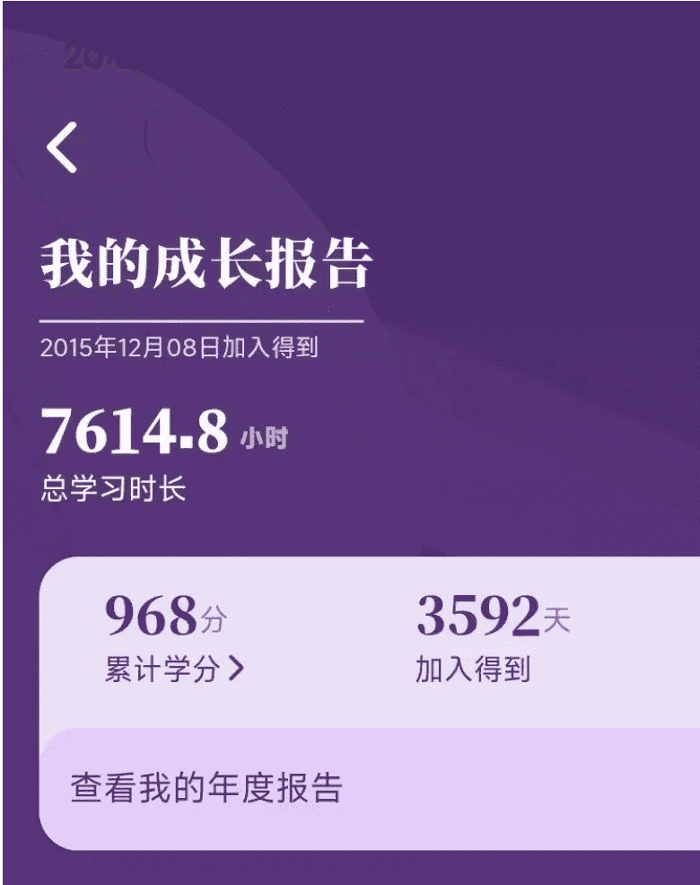

# 习惯，就是一个人的命运

251010 生财精华 刘小排

整理：公众号懒人搜索，懒人专属群独享

懒人微信：lazyhelper

公众号懒人搜索懒人专属群微信:lazyhelper

我很尊敬的华杉老师，曾经讲过一段小故事。

我家里阿姨曾经问我：“华先生，我看你好厉害，你能不能指导一下我儿子，做什么才能赚钱快？”我说：“我每天做什么你都看见了，每天早上七点钟，我都在写作，就是勤奋而已。一切都是积累来的。因为无论你最终想做成什么事，都得别人帮你，社会帮你。别人凭什么帮你，给你机会呢？就是看过去你分内的事情有没有做好。这就是为什么有人在办公室抹桌子、扫地、倒开水也能发迹，因为如果你做不了别的，就勤快点，做点服务工作，这就是好品质。”不知道我当时那段话，有没有帮到阿姨的儿子。

当时我觉得很不可思议，为什么会有人能做到每天早上七点起来写作，日日不断？华杉老师是个变态吗？

我不相信有人能这么变态。直到很久以后，我遇到了一个类似的故事：

你相信吗，有人在过去10年内，平均每天看书至少两小时。甚至在过去1717天内，每天都看，1天都没断过。10年，一共看了1077本书。

很难相信吧？我也不信。直到发现，这个人就是我自己。

其实，1077本书，根本没用到10年。因为「得到电子书」是一款2019年才上线的产品。

突然我也懂了华杉老师。坚持每天早上7点起来写作，和坚持每天看书2小时一样不可思议。这根本无法靠毅力做到！只能靠习惯。

习惯，就是一个人的命运。

- 同样是使用 AI 写代码，当 AI 写出屎山的时候，大柱子习惯怪 AI，二拴子习惯想办法去适应 AI，两年后，他们的命运会有很大的不同。大柱子两年前认为 GPT-4 写代码不靠谱、一年前认为 Cursor 写代码不靠谱、现在认为 Codex/Claude Code 全都不靠谱。
- 同样是 Vibe Coding，大柱子习惯随性口喷，不行就回滚；二拴子习惯精进自己，搞明白代码不工作的原理、认真写需求，两年后，他们的命运会有很大的不同。好像不需要两年，半年就能看出来很大的差距。我身边有挺多大柱子的，在这个伟大的时代，我对他们的命运抱有同情。
- 同样是每天地铁通勤 1 小时，大柱子习惯在地铁上刷抖音，二拴子习惯在地铁上看书，两年后，他们的命运会有很大的不同。
- 同样是看书，大柱子习惯只看自己熟悉的领域，二拴子习惯专挑自己不熟的领域，两年后，他们的命运会有很大的不同。
- 同样是创业找需求，大柱子习惯用奇技淫巧或拍脑门，二拴子习惯收集生活中的抱怨，两年后，他们的命运会有很大的不同。不同之处是，大柱子永远在问怎么找需求、二拴子永远有做不完的真需求。
- 同样是做产品，大柱子习惯先做出产品再去找用户，二拴子习惯先找到用户再做产品，两年后，他们的命运会有很大的不同。
- 同样是搞流量，大柱子习惯和平台对抗、薅平台羊毛，二拴子习惯尊重平台规则，两年后，他们的命运会有很大的不同。
- 同样是刷公众号，大柱子习惯收藏、稍后阅读，二拴子从不收藏、直接阅读，两年后，他们的命运会有很大的不同。大柱子可能自己都没意识到，他实际上只收藏，从来不读。
- 同样是写流水账，大柱子习惯写的是叫“日报”、写给领导看，二拴子习惯写的叫“复盘”、写给自己看，两年后，他们的命运会有很大的不同。
- 同样是投资，大柱子习惯低买高卖；二拴子十年前就习惯了定投标普指数、特斯拉、英伟达，从来不卖；十年后，他们的命运会有很大的不同。

这种人存在吗？嗯，存在的。我的恩师傅盛，就是在 2016 年之前就重仓特斯拉和英伟达、从来不卖出的神人。最近得知，亦仁也持续每日定投特斯拉很长一段时间了。很遗憾，这次，我是大柱子。

......

习惯最大的作用，是免于自我说服。大柱子难道不知道收藏后的文章根本不会阅读吗？他当然知道。

大柱子难道不知道在看书比刷抖音更好吗？他当然知道。

大柱子难道不知道定投比天天看盘更好吗？他当然知道。

但是，如果没养成习惯的话，每天他都需要重新自我说服，大部分时候会说服失败。

我为什么会写这篇文章？因为我最近又坏了一颗牙齿，第二颗了。很遗憾，很惭愧，我还没养成每天刷牙两次的习惯😩 每次刷牙都需要靠自我说服。相比起从小养成每天刷牙两次的你，我牙齿的命运似乎不怎么样。

我还有很多的坏习惯，如果你发现了，请你一定要告诉我。如果不介意的话，当我发现你的坏习惯，我也告诉你。

与君共勉。

最后，安利小懒的付费群：

懒人专属群（介绍）

📚 懒人专属群持续更新中，已持续运营 6 年，整理超 3000 份各类精选付费文章 & 年费社群干货，全部开放下载。

本资料为付费群内部分享，仅供真实有需要的朋友查阅 🙇

懒人专属群更新记录：
https://lazy2025.top/blog/record2

懒人专属群更新记录（需梯子，备用）：
https://lazybook.fun/blog/record2