## 海外流量快速变现：2小时上线，3小时出单，72小时突破100刀！

251010 生财精华

公众号懒人搜索，懒人专属群独享
懒人微信：lazyhelper


大家好，我是林悦己。很久没写内容了，9月一直在准备航海家大会的事儿，结束以后偶遇台风滞留大湾区养伤（在酒店从楼梯上摔下去），一晃就到国庆了。

国庆8天，没闲着，正经全身心投入到我的海外自媒体当中，正反馈比预期来的更快，第一周就拿到了tiktok的第一个100K（现在是545K）。第二个100K拿到以后的第二天，意识到要借助流量，于是做了一个页面给这些外国人卖sora2的邀请码。

- 10/5 19:28 开始做，21:20 网站上线（不到2小时上线）
- 10/6 00:05 出第一单 5刀（2个小时45分钟出单）
- 10/8日 17:20 完成100刀（不到72小时）

## 项目回顾和拆解分 3 个部分
- 一、热点跟进
- 二、信息串起来，idea 来了
- 三、说干就干，快速 MVP

### 一、热点跟进
在 sora2 发布当天（10月1日）我也快速发了视频，虽然一直没有蹭到什么大的流量（不到10K的播放），但是已经开始有人陆续 dm 我说希望要邀请码，我一直没处理。

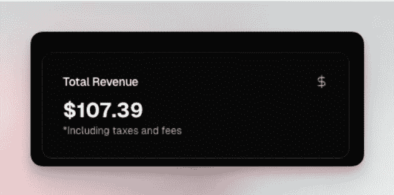

| 用户 | 评论内容 |
|---|---|
| WMSI.ae | Can i get a code ? |
| wacays_khalifa | Can i get a code |
| R | Can i get a code |
| JJTrainSpotter | can i get a code |
| universal | code |
| pixelated | Code |

Add comment...

10月4日的中午，临时想发一条，就快速拍了一条，如何用 ChatGPT 找 invite code，没想到 100K 了，而且超多人要邀请码，我还是没什么反应，但是 DM（私信）的人越来越多。

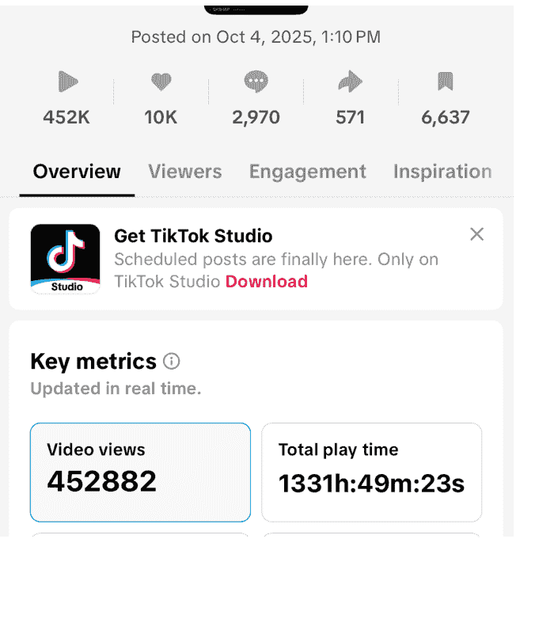

### 二、信息串联起来，idea 出现
10 月 1 日看到亦仁哥发了 invite code 的互助贴。

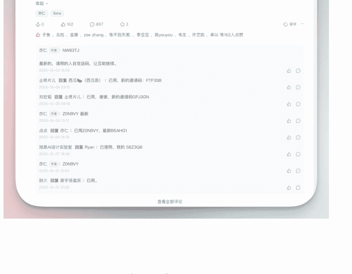

在 X 上也看到有人都在拉群，一开始不懂这个运营，专门问了问 GPT，GPT 给了一个新的名词叫做“流量套利型运营”。

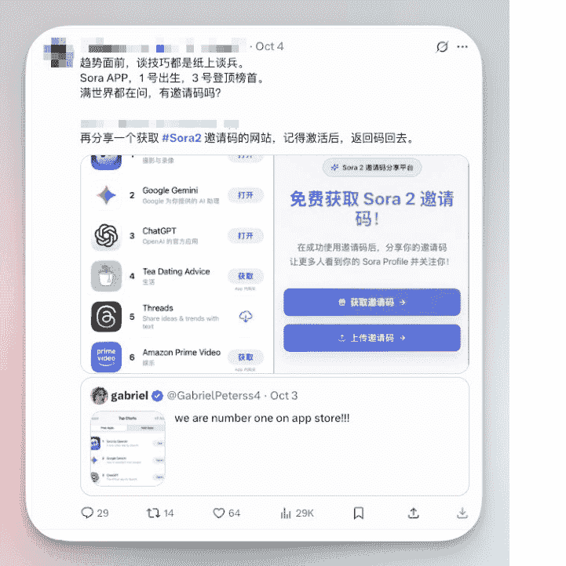

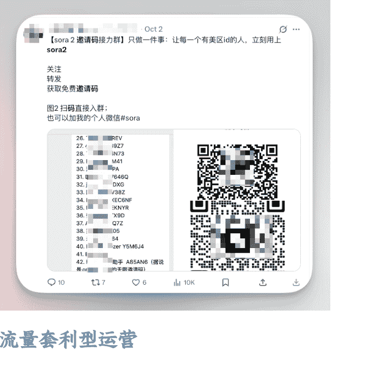

#### 流量套利型运营

**1. 需求聚合（Aggregation）**
单个用户手里只有少量邀请码，需求和供给都很分散。你把他们拉到一个群，就把分散的资源集中，降低了“找邀请码”的成本。这是“撮合”的逻辑，本质上类似小型的信息中介平台。

**2. 供需撮合 (Matchmaking)**
群里有人急需邀请码，有人正好多余。你相当于搭建了一个“市场”，让双方在里面交换。这和二手交易平台、共享资源社区的逻辑一样，满足了匹配效率。

**3. 社交货币 (Social Currency)**
“我有邀请码”是一种稀缺身份符号。在群里，用户会因为能提供邀请码而获得认可。这种社交奖励让群保持活跃，同时吸引更多人加入。

**4. 网络效应 (Network Effect)**
群越大，邀请码总量越多，满足需求的效率越高。新人越想进来，群的价值越高，形成正反馈。这就是典型的双边网络效应。

**5. 运营角色：占位 + 控节奏**
你作为群主，实际上是占据了一个“流量入口”。通过控制群规则（例如谁能发码、如何分享），你能进一步积累信任和影响力。这背后的方法论就是“先提供价值 → 再沉淀关系 → 再转化”。

你说的玩法背后是“需求聚合 + 撮合 + 社交货币 + 网络效应”这一套增长学逻辑，本质就是非官方的中介运营。你没有创造邀请码，但通过建群，把分散的资源集中，放大了效率，从而获得影响力。

心里有了一个概念，但是 1 号和 2 号都无任何行动和想法，只想着下一次再有这种邀请码，我也可以提前准备（拉群）！

#### Idea 交流碰撞中闪现
10 月 5 日跟 scai 的兄弟们吃饭我突然提到这事儿，一个想法冒出来：“这么多人要 code，我为什么不能卖给他们呢？现在是他们求着要啊！我必须做些什么！！”

本来想跟程序员兄弟们合作的，饭桌上的兄弟们都看不上我的短期小项目，没办法我只能自己开始干！这时候自己会 AI 编程的优势就体现出来了！

### 三、说干就干，快速 MVP
一开始就给自己定了个时间节点 1 个半小时搞定，搞不定就算了！ 10 月 5 号 19:28 开始动手整，21:20 网站上线：
- 45 分钟写完代码
- 30 分钟部署上线
- 20 分钟处理交付发邮件的问题

#### 所以我到底怎么做的？

#### 别急着写代码，咨询 GPT 整个 idea
我想做一个页面，用户需要 sora2 的邀请码，支付 5u 或者 5 美元，留下邮箱，我会发邮件给他。如果验证码不成功则全额退款。我要做一个 MVP 可以怎么做？GPT 给了我很多东西。我反问“一定要数据库嘛？”“暂时不会上自动化”。因为心里一直记得 MVP，所以不断砍东西。

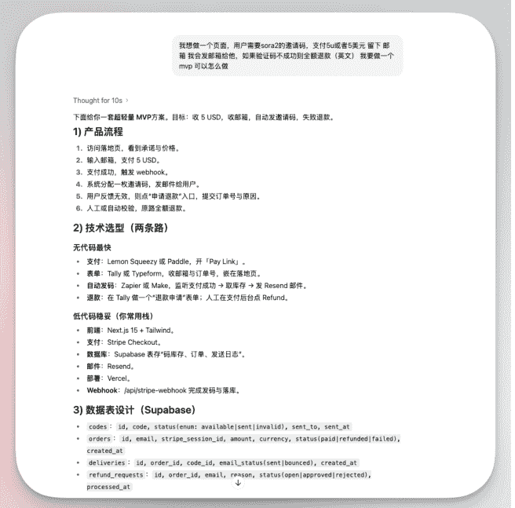

继续让他给我出一个 HTML 的页面，方便我的 augment code 直接上内容，文案啥的也都写好了：“现在就是需要落地页，你用 HTML 出一个 MVP 落地页给我吧。”下面是一开始给我的 HTML 渲染页面，我觉得还挺不错，搞定一切，进入下一环节，开始写代码。

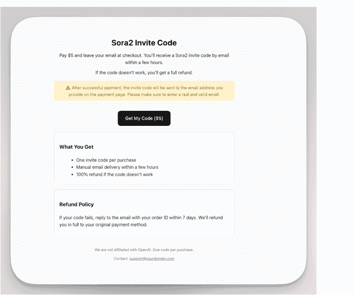

#### HTML 在出 demo 的时候非常好用！因为最快！

#### 建立项目开始 coding，但只做 MVP
这里的 MVP 是真的最小可行性产品，多一步都不要，因为会影响上线速度，目前时间就是金钱。所以 MVP 是几个点：
- 信息页面，告诉用户多少钱，如何交付，失败会退款（GPT 给的 HTML 已经搞定了）

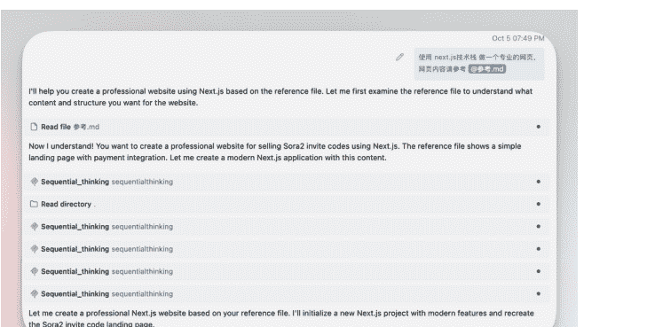

#### 支付通道 ok，用户点击能正常支付（我接的是 creem，5 分钟完成支付，这道坎我真的跨过去了）
creem 不熟悉的朋友可以看这条《creem 支付配置：小白视角和路径，手把手教学》，我在接 API 的时候也回去看了！

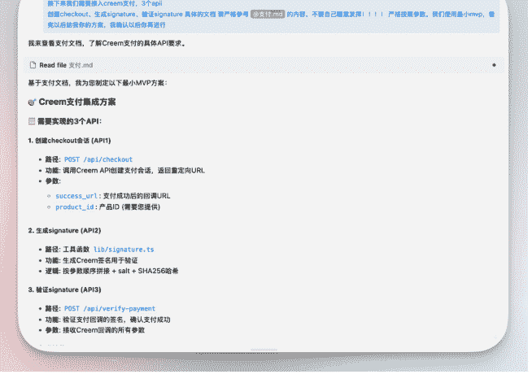

交付结果，我用的是 resend，这个工具，好在之前研究过发送邮件的东西，这次就直接用上了。

#### resend 介绍
我是在学习 mk saas 的模板的时候接触到这个工具的 resend。帮助你自动发邮件的一个工具，我其实也没有很熟悉，但是那天正好已经用上了 comet，perplexity 的 AI 浏览器，我是直接让他给我操作的，还比较丝滑。

#### 我该如何做一个 support@uimg.pro 的域名邮箱，用 resend 这个工具呢？
你只需按照如下步骤，就能用 Resend 工具创建并使用 support@uimg.pro 域名邮箱：
1. **确认域名已验证**
   你的域名 uimg.pro 已在 Resend 完成所有 DNS (SPF、DKIM) 验证，状态为"Verified"，已具备发信能力，无需单独创建邮箱账号。
2. **API Key 已创建**
   只需用 Resend 控制台中已生成的 API Key（如 nano），无需单独配置邮箱，所有同域名邮箱（如 support@uimg.pro）都可直接用。
3. **发送邮件：直接用 support@uimg.pro 作为发件人地址**
   Resend 的邮件 API 支持任意在 DNS 已验证的域名下的邮箱，直接在 API 里填写 `from: "support@uimg.pro"` 即可。例如用 Node.js SDK：

   ```javascript
   import { Resend } from 'resend'

   const resend = new Resend('你的_API_KEY')

   await resend.emails.send({
     from: 'support@uimg.pro',
     to: ['收件人邮箱'],
     subject: '邮件标题',
     html: '<p>邮件内容</p>',
   })
   ```

- 你可在控制台查看发送记录，也可编程批量发送。
4. **（可选）收信设置/转发**
   如果需要让 support@uimg.pro 接收外部邮件，请到域名 DNS 服务商（如 Cloudflare）设置 MX 指向你的实际收件服务（如 Gmail），Resend 只负责发信。

补充说明：
- Resend 控制台不会帮你单独“开设” support@uimg.pro 邮箱，只要 DNS 验证 OK，API 即可用之发送邮件。

#### 如何使用 API 进行发信息？
你可以这样用 Resend 的 API 进行发邮件：
1. 获取 API Key
   在 Resend 后台（API Keys 页面）复制你的密钥，例如：re_xxxxxxxxxxx。
2. 用 Node.js 发送邮件（推荐 SDK 方式）
   安装库：

   ```bash
   npm install resend
   ```

   代码示例：

   ```javascript
   import { Resend } from 'resend'

   const resend = new Resend('你的_API_KEY')

   await resend.emails.send({
     from: 'support@uimg.pro',      // 发件人（你的域名邮箱）
     to: ['收件人邮箱'],             // 支持多个收件地址
     subject: '你好',                 // 邮件主题
     html: '<p>这里是正文内容</p>',   // 邮件内容（HTML格式）
   })
   ```

- 上述每个参数都可根据实际场景、邮件内容自定义。
3. Python/HTTP 接口示例
   如果用 Python 或直接 HTTP 请求：

   ```python
   import requests

   headers = {
       # 原文此处截断
   }
   ```

   因为 comet 可以直接在浏览器上操作，所以我就直接给他说了我的需求，他把 support@yourdomain 的邮箱给我整好了，不会发送邮件，我就继续问，他给了一个 API 发送邮件的方法给我。一开始我觉得甚至还在 terminal 里面尝试，失败了几次以后，我觉得不行，不能这么麻烦，我得有一个前端可视化页面来操作。

   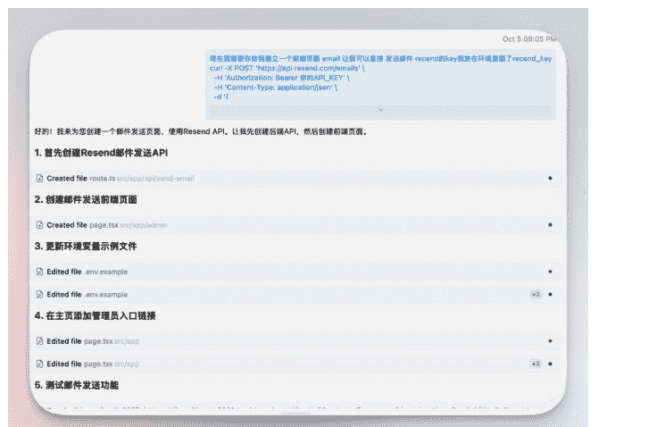

   于是把这个 API 的内容给到 augment code，让他给我做一个前端页面，我只需要填写邮箱，和 invite code，其他的都是固定的，很快他就给我写好了！

   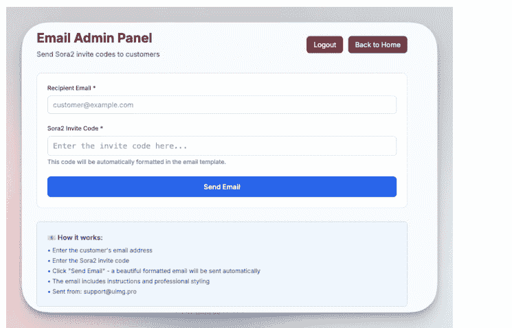

   被黑客攻击 2 次的我，这次竟然让 AI 还继续给我写了一个身份验证，简单的密码就行。验证身份以后，就是下面这个可视化页面，很好操作。我用手机也能快速发邮件交付！

   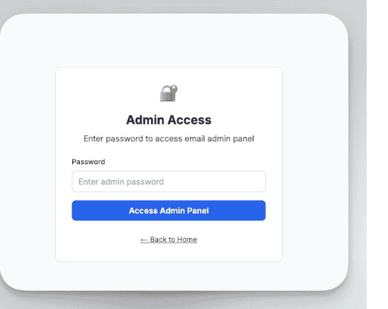

#### 上线后开始疯狂“推广”

##### 3.1 回复私信的内容
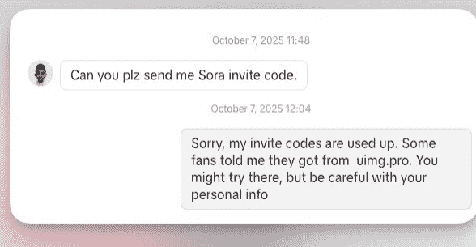
人家都已经主动私信了，说明需求程度非常高，目标用户的目标用户！

我的想法是，我不能告诉大家这事儿我做的，所以我的说法是：（用的英文，给大家中文体会精神）
“我的邀请码用完了，但是我的粉丝告诉我他在 XXX 买到了，你可以去试试，注意个人财产安全！”

这样发出去，就能不被骂（bushi），不容易塌房。可惜因为很多私信是几天前给我发的，我给他们回复的是一些已经跟我说找到了，但咱们不气馁！

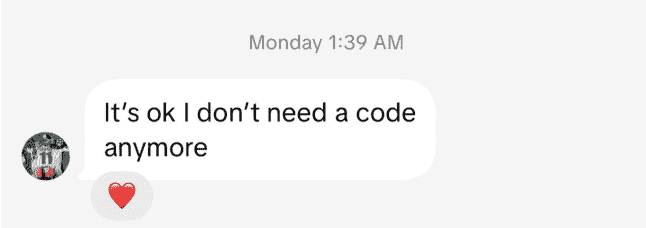
流量还在进行中，也有人持续在私信，想出了再拍一条视频宣传的想法。

##### 3.2 拍摄视频，假装发现一个新方法
整个脚本是：
“我自己的 code 用完了，但是有粉丝说了一个地方，我去看了，竟然有人卖这个 code，太神奇了，有朋友成功买到过吗？可以分享经验啥的！”

Idea 产生以后，10 分钟以后我就快速拍了一条视频，这条也 11K 了，一直等着没睡觉，逐渐开始越来越多的人私信，逐个回复，还是没出单。

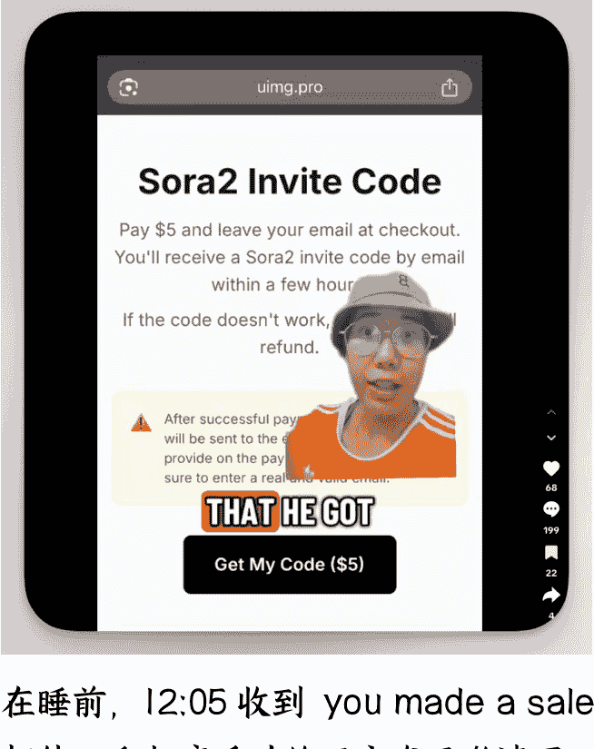
在睡前，12:05 收到 "you made a sale" 的邮件，爬起床手动给用户发了邀请码。

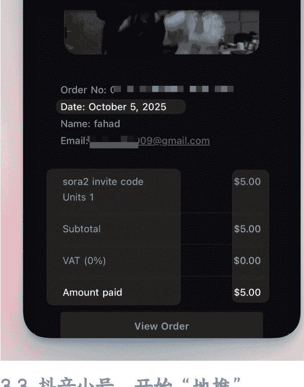

##### 3.3 抖音小号，开始“地推”
5号晚上虽然我的SCAI兄弟们都没有跟我一起合作，但是我强迫吴必得做我的供应商，事实证明他也是一个很好的合作伙伴，邮箱非常多，invite code 量大管饱！

我开始传授吴必得，如何包装 tiktok 账号，帮助那些需要邀请码的人：
- 改名字和头像 sora2invitecode，直接告诉大家这号儿干啥的
- 帖子下面回复那些求邀请码的人（这一条私信过多被禁言了）
- 在帖子下方回复，"i have 10 codes left, plz DM"（然后等待人私信，再回复，毕竟被动是最高级的主动）
- 到后来我们改成了只回复私信内容

迭代过程：
**V1.0**
5 块钱在 XX 购买
**V2.0**
在 XX 购买
**V3.0**
XXX
（XXX 是我的网站）

整个过程，也挺难过的，因为会被骂，也会被禁言，但我俩坚持下来了！

## 复盘总结
便利性原则（Convenience）。
人们愿意为“确定性”和“便利性”支付溢价。
我的第三个“产品”提供的不是邀请码本身，而是“立刻、马上、毫不费力地得到邀请码”这个服务。

邀请码类型的项目，大家需要邀请码，找不到渠道，会搜索，会留言，会私信。

我火的内容是：
- 1、教大家如何找邀请码（非常切合大家的需求）
- 2、第三方视角告诉大家，哪里可以买到（继续分享渠道，而不是售卖，卖钱的话粉丝可能抵触）

## 快速执行+合作共赢
这一次能这么快，有几个原因是：
- **未雨绸缪**：支付通道和域名是提前准备好的（之前准备给 nanobanana 的生图聚合站的，后来决定专心流量就放下了，这次直接用上了）
- **小号**：收割和运营，这个行为存在封号的风险，所以必须得有几个“能评论的小号”，重新注册新号也是来不及的，可能很快会触发警报
- **充足的邀请码货源**

2 和 3 都非常感谢我本次的合作伙伴吴必得兄弟。吴必得对于 2 和 3 真的是太合适了，几十个邮箱和账号，四五台电脑和手机，简直就是完美的合作伙伴啊！

## 复用 SOP
下一次的邀请码项目：
- 第一时间就应该拍视频教大家如何找邀请码！
- 同时快速上线网站（模版完全复用！）
- 用小号去促进事情的发生

## 碎碎念
**壁垒是流量不是“网站”**
这一次可以这么快的跟所有人分享项目不怕被人抄，也不介意被人抄的人在于，这个事儿的壁垒是流量，而不是那个网站！

流量没那么简单，也没那么难。如果是先流量再产品，就是水到渠成；如果是先产品，再流量，就会很痛苦。我的第一个产品私信了一两百个人，几乎无人回复。

希望这个国庆假期项目能给大家打开思路，准备开工啦！

如果你觉得内容有用，欢迎回去给我点个赞，投个锚啥的！

最后，安利小懒的付费群：

**懒人专属群（介绍）**


懒人专属群持续更新中，已持续运营 6 年，整理超 3000 份各类精选付费文章 & 年费社群干货，全部开放下载。

本资料为付费群内部分享，仅供真实有需要的朋友查阅。

懒人专属群更新记录：
https://lazy2025.top/blog/record2

懒人专属群更新记录（需梯子，备用）：
https://lazybook.fun/blog/record2