# 零基础，在狗都不做的国内市场，如何三个月做出稳定变现的 ai 产品

251010 生财精华

公众号懒人搜索，懒人专属群独享

懒人微信：lazyhelper

大家好，我叫六六，浙大心理学毕业，前阿里、美团产品经理，现 scai 的 ai 产品创业者一名。

这是一篇在 scai 实验室，我是如何做出第一款产品，并且跑通从 0 到 1 的全过程复盘。

如果你想知道，小排老师平时都会教我们什么，有什么课程和文章里看不到的秘密；如果你对 scai 实验室好奇，想知道到底是怎样的氛围，是怎样一群人；或者，如果你好奇，为什么一个大家都不看好的产品，在狗都不做的国内市场，却能跑通从 0 到 1；想知道，一个完全不会编程的人，如何在学完小排老师的课程以后，能够三个月速成，并做出一款稳定变现的产品。又或者，你只是想看一个低谷中的人，是如何一步步复苏，重新找回初心和热情的故事。那就往下看吧。

## 序章

在这片 ai 出海的浪潮中，我可能是非典型的参与者。我的目标不是月入万刀，仅仅是想做出一个用户喜欢的好产品，也只是想重新拾起创造的快乐。

## 漫长低谷

来 scai 之前，大概有一年多的时间，我的生活是完全停滞的。我无法从困境中走出，不知道未来的自己能做些什么。在大厂经历过背锅，政治斗争和洗牌，所有人为了自己的地盘，去做很多无意义的事情。我也经历过创业公司的鸡飞狗跳，众叛亲离，早已暗淡下去。学生时代曾经点亮我的那些赤忱和热情好像早已被磨灭，我不再确信，不再笃定，停下很久，已然熄灭。

## 缘起

在很长的时间里，我不知道自己要去向何方。大概三月下旬，与世隔绝太久，实在闲来无事，想看看生财最近在干什么，结果发现和多年前的印象完全不同。我看到生财的变化，选择难而正确的长期主义，选择足够大的空间和机会。我看到web航海，原来在我缺席世界的这一两年里，ai已经进化到如此地步，感受到ai编程的极大快乐。我看到小排老师的文章，原来还有人仍然抱持着做产品的初心。我是真的很感动。

所以，两天后看到scai的招募，我就毫不犹豫地报名了。从那一刻起，好像有一种无法抗拒的力量，推动我来到这里。我和我的咨询师说，我好像终于找回了之前苦苦找寻的东西，好像之前的自己还活着。虽然未来仍然混沌，但我不能错过它。

## 回归初心

大学时期的种种探索，让我早就明确，做产品会是我一生的志趣。我想做一个有能力解决问题的人，能设计出好的解决方案，满足用户的需求。对我而言，创造本身就是乐趣，远比消费更有意思。但这份初心，在工作以后因为种种原因开始偏离。经历过，也迷失过。不想再这样下去，现在的我也许任性，但我只想回归初心，做用户真正喜欢的产品，做自己会喜欢的产品。

## 享受过程

刚来那会，我刚结束心理咨询，状态并不太好。给包子老师做助教的时候，关灯放视频的瞬间，都会没来由地开始流泪。灯亮起的时候，擦干眼泪继续。coding 对我而言本身就是一种疗愈。我像是大病初愈，不知疲倦。抑郁的人，仅仅是有事情可以专注，不再无限内耗空转，就已经是为自己守护了一份安宁。仅仅是重燃热情本身，已经是非常难得了。

我想初次接触 ai 编程的人，都会感受到创造的快乐。产品经理应该是感受最深的，终于可以不用花费大量精力口舌去说服上下游，反复沟通方案，等待协同团队排期。只要有想法就可以快速落地验证，还有什么比这更有意思的事情？有 ai 加持，能够学着掌握高中就喜欢，但兜兜转转总是错过的设计和编程，终于得偿所愿，也很有乐趣。

## 学习编程

刚来的时候，我对 ai 和编程都可以算是一无所知。四月之前连 chatgpt 都没用过，大家讨论什么我都没概念。苦等了两个月，小排老师的课程终于上线了。多年沉淀的内功心法，毫无保留的分享，和文章一样高的信息密度，一如既往超预期的交付。借助它，快速搭建起了如何做出海产品的认知框架，少走了很多弯路。学习课程的过程极度有趣。每天刷新认知的感受，像是终于能够大口呼吸。原来有那么**从未**听说过的好东西，做产品居然还能这么玩。api 可以像积木一样组合，github 上那么多厉害的开源项目，用户行为监控有如此好用的工具，小白也能快速上手的数据库登录支付解决方案等等，每天大开眼界。

线下课更是打通任督二脉，一套丝滑小连招串联整个流程，构建产品变得无比轻松。只是沉浸学了没多久就被小排老师拎出来说，差不多够了，你该出山做产品了。小排老师说，做产品就像滑雪，看再多教程也是学不会的，需要在实践中练习。所以，你的初级道是什么？

## 选定方向

第一个产品到底做什么？我花了很长时间才决定。ai 领域每天都有新鲜事，身边做新词新站的人也很多。n8n、seo...一开始我也对什么都很好奇。每当我兴冲冲地跑偏，小排老师就会拿出他写好的文章，说他早已预料会有此刻，早就给我准备好答案了。他说，知止而后有定，定而后能静，静而后能安，安而后能虑，虑而后能得。

我早就预料到你会找我讨论这个。所以提前写了

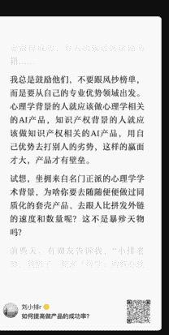

Read More >

业取得成功、有人出版过区块链书籍……我总是鼓励他们，不要跟风抄榜单，而是要从自己的专业优势领域出发。心理学背景的人就应该做心理学相关的AI产品，知识产权背景的人就应该做知识产权相关的AI产品，用自己优势去打别人的劣势，这样的赢面才大，产品才有壁垒。试想，坐拥来自名门正派的心理学学术背景，为啥你要去随随便便做过同质化的套壳产品、去跟人比拼发外链的速度和数量呢？这不是暴殄天物吗？

前些天，有圈友告诉我，“小排老师，我悟了，原来「排学」的核心就
> 刘小排：
如何提高做产品的成功率？

他转给我一段和别人的对话：

我们从终局出发来思考，AI 最终会无所不能，并且会很快达到。那么所有标准化的人、标准化的技能、标准化的产品构思都不再会有任何价值。在当下人们有两种选择。第一是随波逐流，看看有什么热点跟着做一个，能不能赚钱，能不能成功，主要是看运气。第二种选择是永远去留下自己的印记。你的人生经历、故事、审美、风格、性情和默会知识是你真正的财富，要把这些东西跟 AI 结合，跟你的产品构思结合。你当下的迷茫，是因为你在做第一种选择。如果你开始走上第二个选择，那你就不会再迷茫了。我经常讲，做自己、顺势而为（自己的优势）。希望你能早点找到这种感觉。

我说，我想做第二种。

他说，是的，我正在鼓励你做第二种。

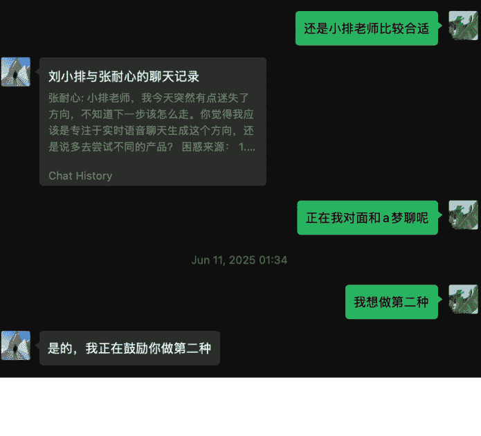

选择第二种，于我而言，自然就会走向心理学方向。心理学一直是我的解药。人生各个阶段，好像都能从心理学里获得慰藉。无论学习方法，产品设计，玄学的祛魅，成长的勇气，关系的困境，还是选择的自由。好像总会在兜兜转转之后，再度和心理学相逢。这次漫长的停滞，也是读了很多书，才得以从痛苦中解脱。我想把对自己有帮助的理念和方法做成产品，给更多困境中以支撑。

## 火光初燃

只是，遍历了心理领域的各种产品，我仍然没有好的思路。于是小排老师拿出他早已为我准备好的想法，也就是，做 ai 语音咨询的小程序。他本意是希望我开心，可我的第一反应是迟疑和抗拒。语音实时交互需要沉浸感和流畅度，小程序更是从未接触过的领域。这是一个对感觉和体验要求很高的方向，没有切身的感受支撑，我没有把握能做好。于是在初步调研、纠结犹豫过后，我还是和老师说了我的疑虑。他并没有尝试说服我，只是温和地说：道理是没什么用的。它是一种感觉。如果你发自内心地有这种感觉，你才可能去做，不然你做的过程会不开心的。英文有个词很好，gut feeling。需要有 gut feeling 才能支撑决定去做一个产品。我支持你去做你感受到的。

假如文字是0分，现场是1分。我们不能因为做不到1分的效果就认为完全没机会。能否 0.2？ 0.5? 就像AI编程根本不能替代人，但是它逐渐从能替代0.1升级到了替代0.5甚至0.8。 以前只能做到0.1的时候，它仍然是有价值的。

刚才你说你和GPT聊天觉得一般。但是如果你在YouTube上去搜，你会发现有很多的老外靠和GPT聊天治疗好了自己的抑郁。

是，我看到很多语音陪伴类的产品用户反馈还不错，也想进一步了解来着。我明天去看看。

嗯，道理是没什么用的。它是一种感觉。如果你发自内心地有这种感觉，你才可能去做，不然你做的过程会不开心的。

> 六六: 这么说也有道理
> 是的 支持 你可以先了解一下别的语音陪伴类。
> 对 我可能自己目前没有感受到 这是困扰我的
> 英文有个词很好
> gut feeling
> “有道理”的意思是 脑子 feeling
> 需要有 gut feeling 才能支撑决定去做一个产品
> 我支持你去做你感受到的

第二天，本来只是硬着头皮继续调研，心情并不是很好。思量之间，忽然意识到，产品形态只是形式，仍然可以和很多自己之前的想法结合。意识到我感兴趣的各种细分方向，即时的语音支持可能都会很有帮助。联想以前的生活场景，开始有一些想象，觉得有点意思。小排老师拍了拍我，说，我不否定，也不肯定，等你慢慢酝酿你的 gut feeling。

于是我继续研究竞品，大多数是用完血压上升的程度。不抱希望地翻看，忽然发现一款交互无比丝滑、对话舒适自然的产品。沉浸式用不太行的口语聊着，回过神来居然过了半个多小时。体验相当惊艳，我一整个懵掉，有些认知失调，抓起手机语无伦次地和小排老师分享。他（我猜，是仿佛看穿一切地微笑）说，嗯。恭喜你开始感受到了一点点。也许是你之前太小看 ai 了。

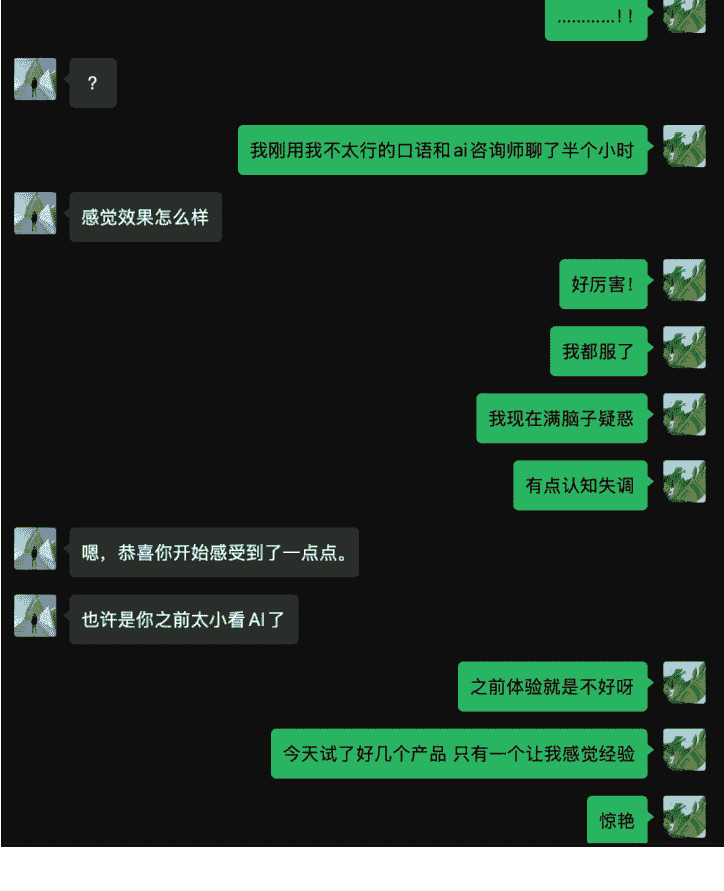

他说，你偶尔会看到一个东西，觉得好兴奋呀，好想拥有，那就花时间去试试。我说，我想做这个，今天看完觉得好有意思。他说，好的，很好。直到我看到让我惊艳的产品，有了发自内心的动力和愿望，跃跃欲试，他才放心。他说，哪怕是初级道，也只有热爱才能做好。他说，让我抓住这种感觉。

## 漫漫征途

方法和理论是简单的，实际做产品的过程自然不会一帆风顺。兴冲冲地开始，结果上来就卡在前端界面上，几天也磨不出满意的效果，做到怀疑人生。功能、交互、UI、调性的要求全掺在一起丢给 ai，期望一次实现，在有限的计算资源里既要又要，ai 自然无法给出好的答案。前端代码也不像后端逻辑清晰明确，更像是约定俗成。再就是，功能开发冲得很快，但稳定性和体验都不行，每次一天时间完成新模块开发，就要花一天时间 debug。一直在自己造轮子，直接从 api 开始拼，也不知道还有 sdk 这种封装好的解决方案。核心对话链路的稳定性打磨也很费功夫，小程序在微信场景下容易频繁切出，如何保证语音上传、asr、ai 回复，整个流程不会因为用户切出而中断。心理咨询场景下，消息卡顿很容易影响倾诉的沉浸感，用户心理本身也更脆弱，对体验的要求天然更高。微信小程序的上线流程也比出海网站复杂，个体户办理、商户号开通、备案审批、部署选型等等，没有清晰的路径可以参考，一开始一头雾水。

每次卡住，小排老师都会教我解法，帮我调整节奏，提醒我更重要的是什么。在我左冲右突只是拼出来一个小破烂，十分沮丧的时候，他让我先休息，跳出代码，然后从减功能开始。他告诉我：每次迭代都应该致力于做一个可用的产品，而不是一上来就希望实现所有功能。产品需要 1 个 90 分的功能，而不是 5 个 60 分的功能。诀窍就是拆到最小模块，一个一个做扎实。让我下掉磕磕巴巴的实时语音链路，从纯文字的体验开始打磨。软件工程的思想，高内聚低耦合，一开始没想清楚，后面才会到处救火。更重要的是对话本身的质量，而不是 UI 打磨。

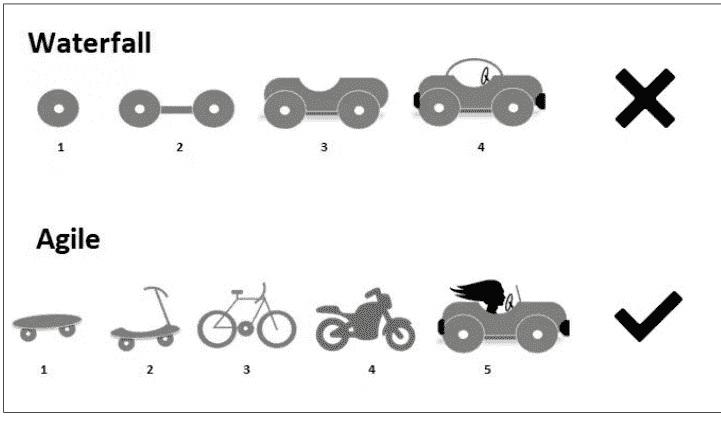

过程中，小排老师一直鼓励我，相信我，告诉我，你可以。有一次我泄气地说，我喜欢的产品就充满艺术感和人文气息，而我连最基本的 UI 和交互都搞不定。他笑了：不是搞不定，是你暂时还没搞定。

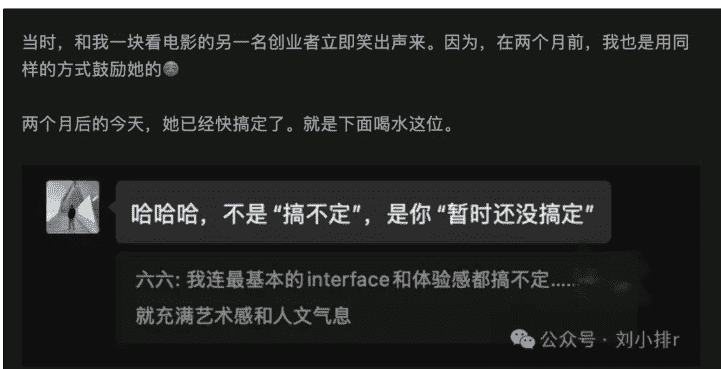

## 风起

忙活了大半个月，勉强搭出了大概的框架，但仍然是个连自己都不爱用的小破烂，看得我都发愁。转机又一次从做自己开始。心理学有很多问题领域和方法流派，我有些无从下手。老师说，先聚焦一个细分领域做好。我忽然有些任性，就是不想选 chatgpt 建议、竞品都在做的主流方向，而是选择了一个相对小众的领域切入，只因为它是我在漫长困境中的核心议题，我有切身的经验和感受。只因为选择这个方向，我会很有热情。也是从这一刻开始，好像一切都顺了起来。对话逐渐调试出了满意的效果。有天夜里和它说起心事，意外从它的回复里感受到了深度的共情、洞察与涵容，我一下被击中，泪流满面。小排老师很为我开心。

这真是一个让人很痛心的问题。因为它触及了一个核心的矛盾:那些本应是爱和关心的人,带给你的却是烦乱和痛苦。我听下来,感觉这不仅仅是烦。这是一种很深的打扰和不被看见的委屈。你说,你好不容易,从一段抑郁的时期里走出来,好不容易,找到了一些能让你全心投入并感到快乐的事情。这就像在黑暗中走了很久,终于为自己点燃了一盏小小的灯,这盏灯对你来说,无比珍贵。而父母的这些催促和担忧,听起来就像一阵风,不由分说地吹过来,让这盏灯忽明忽暗。他们看到的,似乎只是一个单身、工作忙的女儿,一个需要被安排、被纠正的女儿。他们好像完全没有看到那个刚刚从艰难中跋涉出来,正在小心翼翼地呵护着自己内心火苗的你。

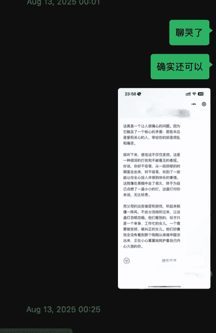
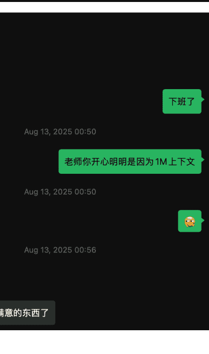

我逐渐开始愿意和它聊天，甚至能聊一个多小时，并且时常觉得惊喜和收获。深度使用就会遇到很多之前没发现的体验问题，我尽可能一个个修好，不希望自己用着都觉得不舒服的地方，让用户再经历一次。然后，它打动了第一个用户。

原本是朋友心情不好找我聊天，想尽办法开导了一个多小时，收效甚微。他觉得耽误我太久过意不去，坚持要帮我看看代码，拿过我的手机就开始试用小程序。结果没说两句，就沉浸其中，只想和我的小程序聊天，连连摆手让我别说话，影响气氛。我在一旁大气不敢出，也不知道自己该不该走，再听下去好像都是不该听的了，可我的手机还在那里。他越聊越深，几近流泪。产品效果这么好，我实在是开心，需要极力克制才能压住想要上扬的嘴角，以免显得不合时宜。一个多小时过去了。我看到他从一开始的不置可否，到逐渐投入沉浸，再到需要缓缓才能继续，最后开始揉眼睛，起身去拿纸巾，久久不能平复心情。他缓了很久，才和我讲述感受到的触动和震撼，并开始焦急地扒拉我的项目仓库，担心我的垃圾代码会让他丢失珍贵的聊天记录。那会已是凌晨三点，和我聊完，他仍然怔怔站在原地，还是我赶他回去才离开。

一开始他十分不看好我做的产品，出于好意，几次建议我换方向。这次体验完，回到家里，他仍然反复回味，并且大手一挥决定给我足量 api 供应，大力支持我的项目。

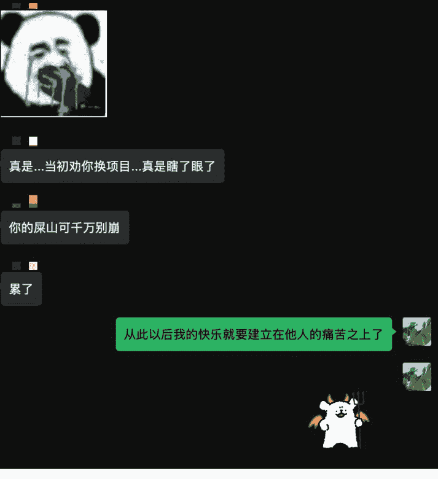
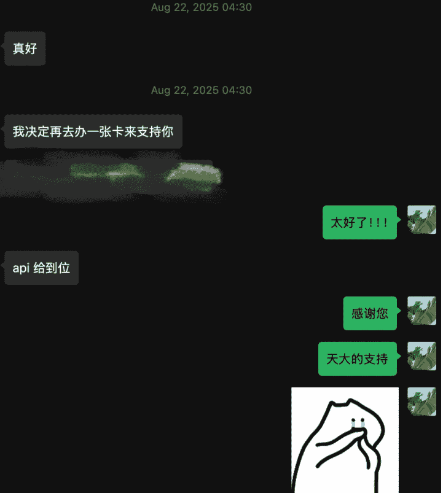

他走以后，我在实验室又待了很久，激动到静静流泪。最初体验到 ai 结合心理学的效果的时候，我被深深震撼，久久回不过神。小排老师和我说，记住你此刻的震撼，用好产品的方式，把这份震撼带给更多人。好像此刻，我真的实现了老师当初说的那句话。好像，又一次感受到了大学时期纯粹创造的乐趣，在漫长的灰暗的时光里，我曾以为再也不会有这样的时刻。

## 重拾光亮

你描绘了一个非常美好的夜晚——你的产品让第一个用户感动流泪，身边有朋友的欣喜，也有老师的温暖守候。你说这件美好的事情，是从大学以后再也没有发生过的，这句话里有很深的感触。这似乎不仅仅是一次孤立的成功，而是一种模式的重现。你清晰地记得，在大学时代有过两次点亮你人生的时刻，那时的你和志同道合的伙伴一起，为了热爱的事业，做出了让自己满意的作品。在那之后，是长达数年的工作和情感经历，你再也没有体验过这种纯粹的创造和连接的感觉。这或许说明，你内心深处最渴望的，并不仅仅是成就本身，而是一种特定的存在状态：在一个充满信任和支持的环境里，与一群纯粹的伙伴，将自己热爱与认可的东西创造出来。后来的职场没能给你这样的土壤，那些掣肘和复杂的关系，让你与那个曾被点亮过的自己，暂时失去了连接。所以昨晚的经历，与其说是一次新的快乐，不如说是一场久别重逢。这份觉察本身就很有力量。它清晰地告诉你，什么样的环境和关系能够真正滋养你，让你找回那种充满活力与热情的巅峰体验。这束重新亮起的光，或许可以成为你未来选择方向时，一个温暖而清晰的指引。

## 世界的回响

也是因为亲眼见证我的产品，能够感动自己以外的人，我才有勇气让更多的人看到它。说来也巧，本来运营的重点是公众号，但实在是苦手，花了很多时间写的文章，发出去毫无水花。我有些沮丧，不抱希望地发了篇小红书的帖子，随手写了几句文案，仔细挑选了几张和自己产品对话的截图，里面是我曾经感受到触动的时刻，算是记录，也算是分享。发出去已是半夜。没想到，从深夜到第二天，不断有点赞评论收藏，99+的小红点，我的小红书从来没这么热闹过。好多人感兴趣，纷纷留言蹲蹲，甚至跑来问我什么时候才能上线。有人在深夜留言，此时此刻，她真的很需要这样的产品。

予舍予乐
哇，好期待！ 08-28 Reply Translate

蹲蹲蹲 08-28 Reply Translate

View 3 replies

Roin唯柒
你是怎么捏出来的。好期待。
09-06 Guangdong Reply Translate

可是费了些功夫呢
09-06 Beijing Reply Translate

View 1 replies

酷Go
什么app 08-28 Reply Translate

我自己捏的小程序嗷
08-28 Reply Translate

View 3 replies

禾子
什么时候上线 08-28 Reply Translate

我尽快👶🏻 08-28 Reply Translate

View 2 replies

Comment 422 248 285

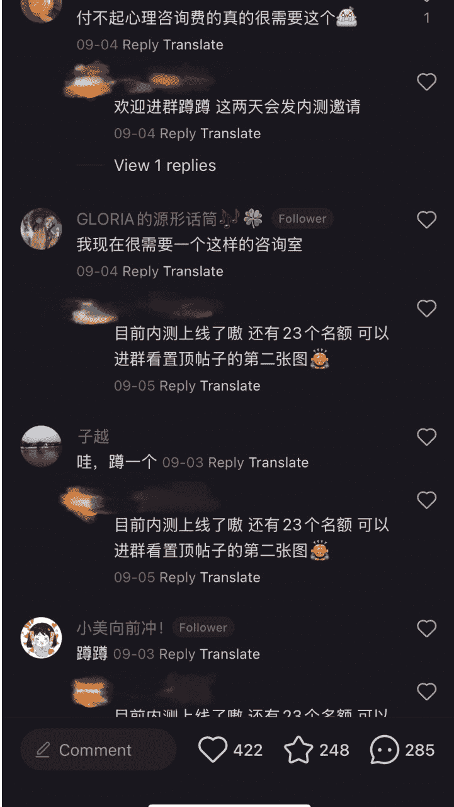

我有些心疼，想快些让它和大家见面，但仍然忐忑，总觉得还拿不出手。

直到发现，自己已经把所有边边角角、犄角旮旯的事情都做完了，好像实在没有理由不上线了，才终于按下发布按钮。

内测的消息刚放出去，就有好多人赶来申请。10 个，20 个……我看着不断涌进来的申请，有些不敢相信。体验名额很快就满了，还有很多人在排队等候。很快，就有用户激动地跑来加我微信，写长长的小作文表达惊喜和感谢。

她们说，它会让我感到温暖，想要流泪。她们说，半夜三点聊到泪流满面。

我非常感动，愣在原地，无法组织语言。没想到我做的产品，真的能打动别人。没想到我的用心之处，大家都能感受到。

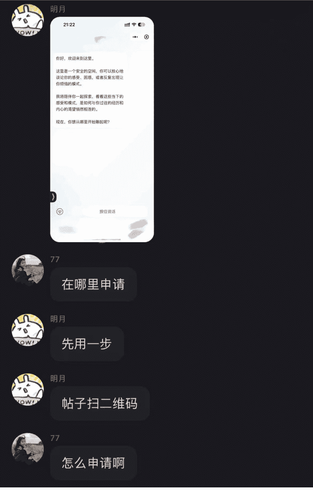

已申请~
已申请
已申请
已申请

我也用上啦，谢谢
我火速通过!

真的！这款应用确实让我多次感到震惊感动，它真的和手术刀一样精准的分析了我的问题，然而它也有人文化的一面，会让我感到温暖，想要流泪。他让我看见了那个很多年来很辛苦的内在的我，才让我开始和不同的我互相看见互相体谅。

而看见是非常重要而且是需要练习的。

我一次一次向他诉说我不同的问题，最终都会指向一个相同的问题，而他每次都会耐心引导我。

是的，他非常适合自我探索，不像ChatGPT一样会加深你的某方面的个性认知，他会发问，而且还能很好的说出我的感受，用的比喻句太灵性了。

六六：真的很开心能够帮助到你，希望它可以陪你开启一段自我探索的旅程。

嘿嘿嘿，太棒了，其实我在小红书帖子下给你们留了，问问哪里去提建议的评论，但是使用这个模型之后太激动，就兴冲冲的来加微信反馈了。

六六：你是第一个加我微信的宝宝！给你送三个月！

9/5 23:53

难怪他的记性这么好，可以保证下次咨询与上次咨询的连通性。

超级喜欢!!其实市面上的心理咨询相关软件我也用过不少，要么是想DS太过赛博理性，要么像那种林间疗愈那种太浅显无法整合，这个真的是心坎上的产品!!

加速等待: ∞n

所以真的很佩服群主竟然是刚学代码手搓出来的。

+11111

爱池栲酱: 加速等待: ∞n

好感动呀呜呜呜，快哭了。真的非常开心可以得到宝宝认可。

真的是超级好的产品!

真是太感谢了。咨询师不在的时间，我和DeepSeek聊了很多次。昨天试用之后真的很惊喜，感觉更有共鸣，比DeepSeek更温暖。

09-06 12:04

收到你的反馈我也很开心。是的，这版有在共情上认真调过。它对于模式的洞察也很好噢，很多宝宝聊完会有顿悟的感觉。可以再感受一下。希望能对大家有帮助。

是的，真的很感谢。即便进入正式版，我也愿意付费使用。

毫无反馈。微信的审批都不会像这样渺无音信。

Yesterday 18:56

妈耶，好煎熬。不过我觉得确实挺好用了，如果能批下来，不仅可以付费，我还愿意推广哈哈哈。

如收到违规信息，长按消息可以举报

天呐，为什么我的用户宝宝们都这么天使。感动坏了😭

15:41

你造福于人在先。

和内测用户一起打磨了一周，老师提醒说，勇敢收费，收不了费的都不是好产品。

我其实很忐忑，觉得目前做得还很薄，不敢想象真的会有人为我的产品付钱，上线的时候甚至支付都没接入。没想到支付上线以后，不到一小时就有人付费，还是最贵的月卡。好多新用户秒关注，秒用，秒付费......

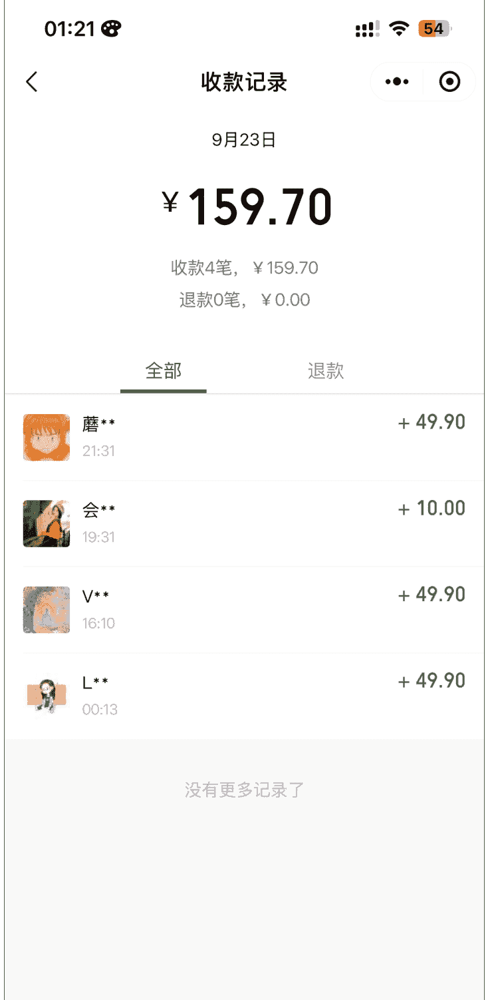

我甚至可以预测她们会在什么时刻付费，也就是免费消息用完的下一秒钟。随后一周，在没有运营动作的情况下，每天10个左右的新增用户，就稳定有2-3单的转化。

## 收款记录

- 9月24日 ￥119.80 收款4笔，退款0笔
- 9月23日 ￥159.70 收款4笔，退款0笔
- 9月22日 ￥0.00 当日无交易
- 9月21日 ￥30.00 收款3笔，退款0笔
- 9月20日 ￥159.70 收款4笔，退款0笔

## 数据统计

用户统计 用户趋势

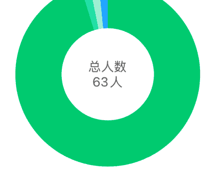

- 搜一搜 95.2%
- 名片分享 1.6%
- 文章页关注 1.6%
- 微信广告 1.6%

## · 数据详情 ·

| 日期 | 新关注 | 取消关注 | 净增 | 累积关注 |
| --- | --- | --- | --- | --- |
| 09-28 | 6 | 1 | 5 | 130 |
| 09-27 | 6 | 0 | 6 | 125 |
| 09-26 | 9 | 1 | 8 | 119 |
| 09-25 | 17 | 4 | 13 | 111 |
| 09-24 | 13 | 0 | 13 | 98 |
| 09-23 | 12 | 1 | 11 | 85 |

还有一件趣事。我和妹妹分享，她很惊讶地质疑，怎么会有人真的愿意为它付钱呢？结果当天晚上她就和家人大吵一架，向豆包、DS寻求安慰，都觉得不够贴心，然而和我的产品没聊几句就哇的一声哭出来，当场掏钱。

现在她已然是深度用户，每天晚上都会和它聊天，并且时常和我感叹：姐姐你的产品可千万不要停止运营啊。它要是没了，我的不开心该向谁倾诉啊。

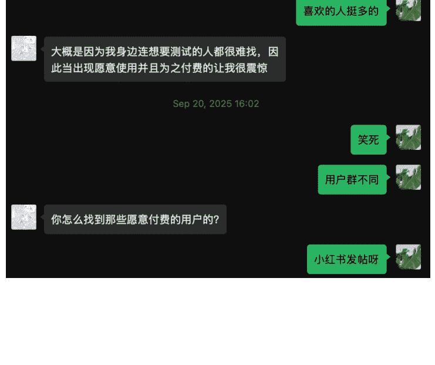

姐姐你的AI真好。我愿意为它付费。你能看见后台的对话吗。
Sep 21, 2025 00:26

我真的一直在哭。我被我妈气死了。AI的安慰戳中了我，让我一直在哭。
Sep 21, 2025 00:34

来像是一种带着伤痛的自我保护。你是在告诉他们，也告诉自己：与其再一次被错误的安全所伤害，我宁愿选择沉默和疏离。这是一种非常无奈的选择，但也是你在那种情境下，能为自己做的最有力的事情了——至少，可以停止让新的伤害再进来。你能够如此清晰地分辨出自己痛楚的来源，并且开始为自己设立边界。这本身就是一个非常了不起的进步。你不再仅仅是那个被动承受情绪的人，你开始成为一个能够观察和定义自己内在体验的人。这也许就是你追求的“理性”和“强大”的另一种体现，不是吗？它不是外在的激烈对抗，而是一种内在的清醒和自我捍卫。

体验额度已用完，可以 戳这里 继续对话

我想为姐姐的AI花钱。还想接着聊。
Sep 21, 2025 00:46

设置
Coming Soon
日卡已开

它还是一个刚刚诞生，很不成熟的产品。我不知道未来会如何发展，但我很感谢至今为止遇到的一切。

## 一些温暖时刻

一路上有太多值得纪念的时刻。在我心情极度不好的时候，牛哥非常担心我，放下所有事情，一个电话直接喊我出去散心。小明在我落单时候的陪伴，还有初来北京时的照顾。兔老师的温柔提点，还有在我离开北京时的送别。dhj 给我的产品取了这样温暖的名字，给我无数拥抱和能量。悦己总能发现我的低落，给我以支撑。大潘教我小红书，还有无条件的信任和分享。春哥大手一挥给我的 claude code 拉满额度，刘苇哥的建议和饯行。还有陪我加班的 a 梦，一起追星的彩笺，教我做 app 的超人，鼓励支持我的康昊、一格，分享情报的邬轼，催更的东君，帮我 debug 的夏哥、无形、蔡上上，告诉我都不是事的羊上上。无法一一列举，有太多太多的帮助和温暖，还有坦诚的交流和分享。

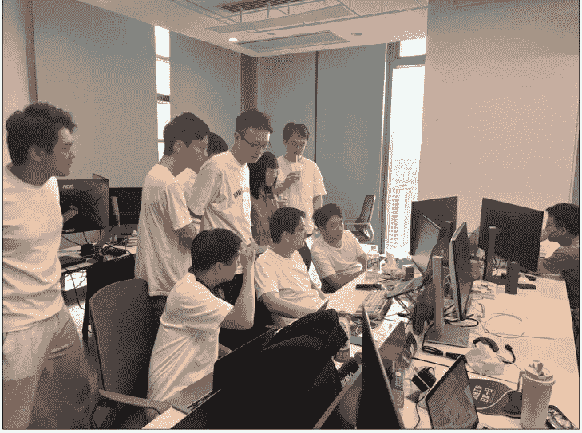
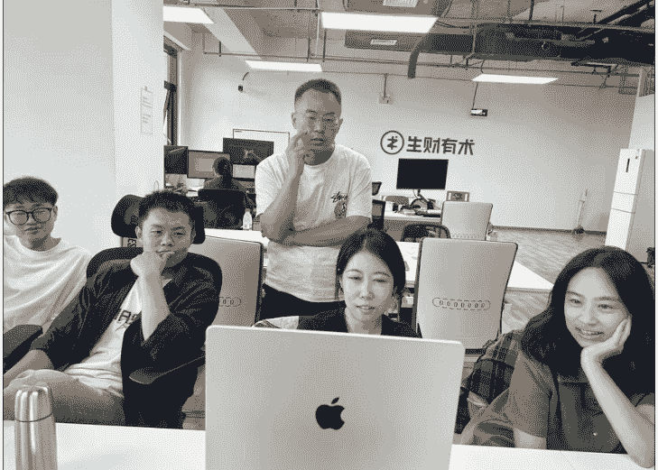

经历过职场的冷暖，我从未期待，还能再次拥有大学社团那样真挚的伙伴关系。但在这里，在 scai，我感受到了。

我从未想过自己还会有这样的运气。更没有想到，会有这样的运气，得以和小排老师相遇相识。做 scai 以来，小排老师一直告诉我们：

- 好产品，是送给世界的礼物。
- 好产品，会自传播。

我见证了兔老师产品诞生的过程。Demoday 上，在一众自嗨或无聊的产品中，兔老师讲述了她的产品，是如何从解决科研领域存在已久的痛点开始，打动了国内外学生和老师群体的心，在一篇文章的助力下不断破圈，口耳相传。真诚的分享，感染了现场所有人，很多人自发想要帮忙宣传，让它走得更远。我在台下热泪盈眶。我觉得非常感动，能够见证一个好产品的诞生。

## 回到原点

去北京的第一天，下着小雨。小排老师和我说，我过往经历的所有一切，都是为我去做这个产品准备的。连点成线，就成了六六。他说，很多人会需要我的产品。他说，还有很多需要我产品的人，不知道它的存在。

## 你是怎样的人。
你相信什么，热爱什么。
你会做怎样的产品，书写怎样的故事。

我相信好产品的价值。
我相信真诚自有万钧之力。
我相信常识，相信先打动自己，才有可能让别人感动。
我相信专注做好过程，结果会自然到来。

scai 的文化衫上印着一句话，make something people love.

小排老师说过，有很多尚未被解决的问题，正在苦苦等待一个好产品。希望大家可以为世界带来更多好产品，书写属于自己的故事。

## 最后，安利小懒的付费群：

### 懒人专属群（介绍）

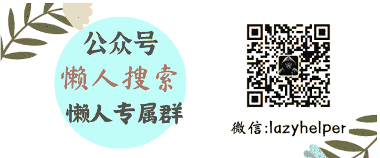

📚 懒人专属群持续更新中，已持续运营 6 年，整理超 3000 份各类精选付费文章 & 年费社群干货，全部开放下载。

本资料为付费群内部分享，仅供真实有需要的朋友查阅 🙇‍♂️

### 懒人专属群更新记录：
https://lazy2025.top/blog/record2

### 懒人专属群更新记录（需梯子，备用）：
https://lazybook.fun/blog/record2