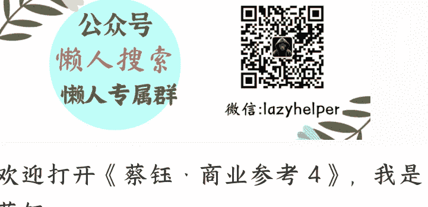

# 137 | 《亚马逊逆向工作法》抬杠者招聘流程

251010
整理：公众号懒人搜索，懒人专属群独享
懒人微信：lazyhelper

欢迎打开《蔡钰 · 商业参考 4》，我是蔡钰。

我们继续从《亚马逊逆向工作法》里，挖掘亚马逊的独到工作方法。这一讲，我们来看它的一种特殊招聘机制——抬杠者招聘流程。

在从外部招聘员工时，亚马逊希望招到的人才是“传教士”，而不是“雇佣军”。两者有什么区别？

雇佣军就像外卖小哥，图的是多赚配送费，不会关心一家川菜馆子能不能做大做强，更没想过跟老板同舟共济。

而传教士像川菜馆里的冰粉主理人，他也热心川菜馆子的生意，因为吃饭的人多，冰粉也能卖得多。对亚马逊来说，这样的人，有可能真正认同亚马逊的使命和文化，安心工作 5 年以上。这才值得亚马逊花精力培养，也期待他为公司创造价值。

怎么提高招到这种人的命中率呢？

也是从机制入手。亚马逊 1999 年开始研究怎么优化招聘流程，摸出来了一个答案叫“守杠者”，后来又把名字改成了“抬杠者”。亚马逊认为，这是自己最成功、可扩展、可复制、可传授的管理方法之一。

## 抬杠者职责

抬杠者，Bar Raiser，既指亚马逊招聘流程，也指在招聘流程中起到核心作用的人物。“抬杠者”这个名字的意思是，这类招聘者应当遵守的职责是，确保每个团队新招来的人，在至少一个方面要比原来的团队成员优秀。长此以往，团队越来越强，绩效能力也就越来越高。抬杠者抬的杆，就是团队的平均门槛。

谁来担任抬杠者呢？不是要招人的团队管理者，也不是 HR 的招聘经理，甚至也没有一个专职的抬杠者职位。他是亚马逊从公司各个团队里选出来的志愿者。要干这个活儿，还得拿出额外时间参加公司的多次培训和考核，直到成为亚马逊认可的面试专家。

这之后，他们在工作中要帮着面试把关、培训新的抬杠者，同时还得完成本职工作，而且不会因为当抬杠者而得到额外的工资或奖金。

他们能得到的唯一荣誉就是在公司网站的员工名录上，自己名字旁边打上一个特殊标志，就跟社交网络的大 V 似的。

没有实质性奖励，为什么还有人愿意干？

- 一个原因是，当抬杠者有更多的晋升机会，也更容易在股权奖励时加分；
- 另一原因是，抬杠者工作干得好，公司股价上涨，也等于在为自己的利益保驾护航。

> ——你看亚马逊这机制设计的，环环相扣。

还有第三个原因，抬杠者在亚马逊里相当有声望和地位。在别人看来，这是一群可以直接影响亚马逊人才引进的特殊人物。谁会拒绝在社群里成为意见领袖呢？

## 抬杠者流程

抬杠者在招聘流程里怎么工作呢？

- 第一步，一个招聘需求出来，他们要负责审查用人部门管理者撰写的职位描述，确保它讲清楚了想要什么能力的人、招来做什么。销售是要企业型销售还是交易型销售？谈判能力是对买方还是卖方的谈判能力？越清晰具体越好。

职位描述写得足够清楚，后续招人面试的时候才能问出正确的问题，获得对录用决策有帮助的参考信息。

写清楚了职位描述，管理者就可以让 HR 到各个渠道撒网收简历了。收完之后筛一轮，管理者自己做电话面试，再给看好的人选发现场面试的邀请。这几个环节，抬杠者都不用参与，所以我们都把它们算到第一步里。

- 第二步，现场面试环节，抬杠者又出现了。

亚马逊对每位员工的正式现场面试，都要花 5 到 7 个小时。——你没听错，接近一整个工作日。如果是高管还可能更久，要分成两天。面试团队通常有 5 到 7 个人，抬杠者作为“独立评审”也会受邀参加。

聊什么要聊这么久呢？我们说两个细节你就能想象了：

一个细节是，5 到 7 名面试官在面试时，除了专业沟通，还背着一条暗线任务：大家要做好分工，每人分配几条亚马逊领导力原则，在面试里要不着痕迹地考察候选人对这些领导力原则的认同和奉行程度。

比如，要考察“坚持最高标准”这条原则，面试官可能会问：“在你过往经历里，你有没有过觉得一个新产品新项目不够好，力排众议反对它的发布？能不能讲讲怎么回事？”

你想啊，亚马逊领导力原则足足 16 条，一条条对照着跟候选者聊人生故事，可不得好几个小时么。

另一个细节就更有意思了。亚马逊在为一场面试选面试官的时候，会专门选一部分比目标岗位职级低一级的面试官，但不能是目标职位的直接下属。

这个设置奇怪吧？你想想为什么。

亚马逊的逻辑是，员工们都希望对未来上司人选有发言权，这样日后才好相处。但如果让直接下属面试未来上司，既容易导致候选人的回应变形，也容易让面试官不敢给真实的面试反馈。所以干脆迂回一下，让员工们互相替别人面试未来的老板。

你还别说，这个设置，是自上而下地贯彻了“主人翁意识”这条价值观，真把挑选上级的主导权给了员工们。这样一来，面试官们潜移默化地带上了值得信赖、值得跟随这类预期，也得往深了聊不少时间。

这个过程中，抬杠者不但也要参与直接面试，还要给其他面试官做面试技巧的辅导，确保他们尽量问出好问题。

## 面试反馈与汇报会

等这场 5 到 7 小时的现场面试结束，抬杠者活跃起来了。他要推着所有面试官趁热写面试反馈，并投票表态，对候选人是强烈建议录用、建议录用、建议不录用，还是强烈建议不录用。

等到把所有面试官的面试反馈收集齐，抬杠者还会快速发起一个会议，要求所有面试官都通读其他人写的面试反馈，在信息量扩大了 5 倍之后，再做一次投票。抬杠者还会引导大家讨论，这位候选人的能力经验怎么样、符不符合那 16 条领导力原则，推动大家达成共识。

这次汇报会的最后，用人部门的管理者会最后做出决定，录用还是不录用。而如果经过讨论结果是录用，还需要抬杠者的批准，才能发出录用通知。

也就是说，抬杠者不能劝管理者发出 offer，但有权否决管理者发出 offer，即便管理者和其他所有面试官都同意。

不过在汇报会上，抬杠者更重要的工作，不是动用否决权直接干预招聘，而是借助他的抬杠经验来提出追问，引导讨论往更高的标准走，让面试官们不光考虑候选人适不适合团队，也去考虑他适不适合整个公司。

这是保证亚马逊的文化门槛不被稀释的关键机制。

到了这里，我们再回头看抬杠者的杆，就会意识到，它其实不是职场惯常理解的专业能力和市场经验的杆，而是文化认同的杆。

## 总结

以上，我们了解了全球电商巨头、也是云服务巨头亚马逊公司的抬杠者招聘流程。这个机制的精妙之处在于，通过机制，绕开一线管理者的短期用人冲动，把“文化认同”变成了招聘中的坚固标准，保证亚马逊在经历团队扩张的同时，很大程度上躲开了雇佣军带来的“大公司病”。

这个思路，当然也被“猛学亚马逊”的美团学过去了。

美团招聘，也借鉴了抬杠者流程里的三个关键点：高标准选人、文化守门和结构化面试。不过，它也做了更加适应中国市场的“汉化补丁”。美团并不单独设立抬杠者人群，而是又借鉴了阿里的“政委文化”，由 HRBP 在招聘过程中充当“提醒者”和“平衡器”。

抬杠者思维，其实就是“提高均值的意识”。它提醒我们，无论是团队建设，还是个人成长，都要关注系统的平均值，并且有意识地把它不断抬高。但问题是，平均值靠什么来改变？靠的是一个个具体的选择和行动。

在组织里，除了招聘，还有各种项目、会议、决策、文件。如何保证一次次的选择能守住平均值，真正沉淀为理性、可执行的共识？

亚马逊也有答案。它的答案是：按标准写下来的东西，才算数。于是，它设计了一套几乎传奇的工作习惯——6 页纸备忘录。

这又是一种把文化落地的机制，能逼迫所有人把想法说清楚、写透彻。飞书开发有一个名叫“飞阅”的会议工具，就是受到亚马逊这个机制的启发。

所以下一讲，我们就来看看 6 页纸备忘录这个机制，是如何改变亚马逊的决策质量的。
拜了个拜。

最后，安利小懒的付费群：
懒人专属群（介绍）

微信:lazyhelper

懒人专属群持续更新中，已持续运营 6 年，整理超 3000 份各类精选付费文章 & 年费社群干货，全部开放下载。

本资料为付费群内部分享，仅供真实有需要的朋友查阅

懒人专属群更新记录：
https://lazy2025.top/blog/record2
懒人专属群更新记录 (需梯子, 备用): 
https://lazybook.fun/blog/record2

公众号懒人搜索，懒人专属群分享

8 / 8