# 从近期小红书 KOC 账号大量限流，以及一篇医疗类“爆款真实种草营销文”展开，聊聊小红书【高客单私域产品】的素人种草，到底怎么种？怎么引流

## 251011 生财精华

公众号懒人搜索，懒人专属群独享
懒人微信：lazyhelper

## 背景

最近两月，各行各业，大量种草矩阵账号被封、大量种草笔记被限流、甚至在搜索页无法被展示，据说有很多之前投过聚光的笔记都未能幸免。

并且，这一两年种草内容太多，用户越来越聪明了，没有水平的种草文，用户都能识别出来，达不到想要的效果。还不进行内容迭代，很难有好的效果。

尤其是高客单私域成交的产品，用户的防备心态会时刻紧绷，种草每种好，哪怕引流到微信，转化也非常困难。

作为自媒体平台风控最为严厉的医疗内容和引流，最近我这里却出现了一篇“爆款种草笔记”，平台推流好、无风控，且引流至私域后，成交转化率也非常高。

## 下面详细道来：

我是中医行业的，结石是我核心的病种之一。最近有一个用户在我们这里治愈后，纯粹是抱着分享的目的，自发地写了两篇自己结石治愈的过程。因为本来就不是为了引流的原因，纯粹站在分享者的角度分享经验，我认为她写出了一篇“真正”的优质种草内容。

直到很多用户在私信咨询她是怎么治好的，这位用户才和我们说起了这个事情，“征询我们同意后”，被动的“把我们的微信推销了出去”。目前，这篇内容，为我们加了 10 个微信，最终成交 8 个转介绍用户，首单和复购成交接近 2.5w，首单转化率高达 80%。

而以往我们所做的素人种草，带来的流量虽多，但是由于流量泛、信任度低，导致转化差，连 10%都做不到。

所以，为什么我会把这篇内容同时加上“真实种草”和“营销文”，这两个明显对立矛盾的标签。

在了解完这位用户自发的内容后，我有一些启发，接下来我将结合自身的经验和理解，并直接给大家展示这篇真实的种草文，拆解剖析为什么这篇文章：没被系统风控、系统推流不错、用户毫无质疑、引流顺畅、转化极高。

虽然由于行业政策因素和方向调整，我已经取消了素人种草这个方式的流量了。但其他高客单的行业，仍然可以套用，完成引流。应该能帮到大家。

如果你本身就有很多小红书素人种草经验，可以跳过第一、第二、第三章的初级内容，直接看第四章内容。

## 一、一个真实的素人主页，要长什么样子？

用户已经被各种防诈内容教育得非常聪明了，涉及到高客单服务，用户本就十分敏感。一旦你的内容哪怕有非常隐秘的营销暴露，他们大多能识别出来。一旦用户心理被种下这很可能是一篇营销软文的种子，哪怕成功引流到私域，用户带着的都是“是广告，我去了解看看”这种心态，了解完后肯定会把你和同行的服务作对比，抠细节比服务、比价格给你压价……这样，后端要做的转化工作，是非常高繁琐的，需要大量工作，以及一些运气，才能说服用户选择我们。

真正顶级的种草文，润物细无声，让用户读完被种草了，还没认识到被种草了的结果。后端的付费会流畅非常多。

做内容的思路是互通的，我相信你读懂了我这个医疗行业的素人种草案例后，也可以运用到你们自己的类目中。

### **大家先看看一个真实的素人账号，主页应该是长什么样子的？**

这就是给我们主动转介绍的用户，自己的账号主页。这就是没有第三方运营痕迹、最真实的一个用户运营账号的表现。

第一张、第二张，是长期的日常分享。

第三张的红框，就是分享自己治疗的经验。也正是这里会完成曝光引流的效果。这个我在第四个章节，会详细展开分析。

现在我们先明确一下，怎么才能让系统、让用户，觉得你是一个真实用户？几个关键的因素：

#### 公众号懒人搜索，懒人专属群分享

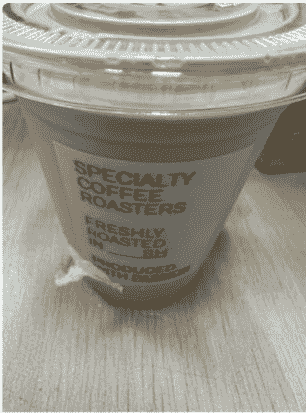

#### 免费咖啡一周

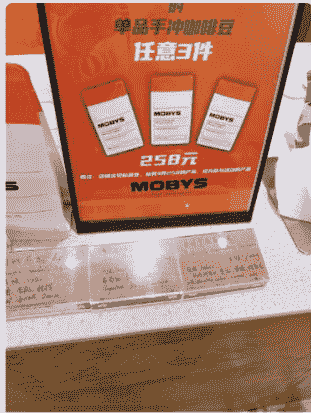

#佳洁士请你白喝咖啡
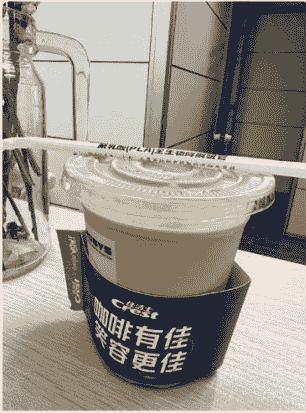

#佳洁士请你白喝咖啡 小姐姐的店太棒了

#佳洁士请你白喝咖啡

#### 用户真实的生活记录

15:12 微信 关注 笔记 收藏 1049 2
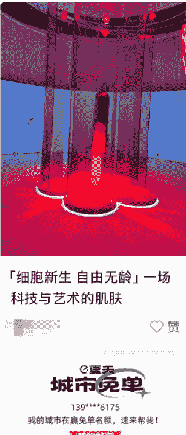
「细胞新生 自由无龄」一场科技与艺术的肌肤
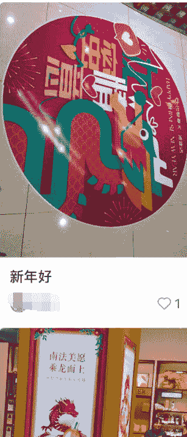
新年好 1
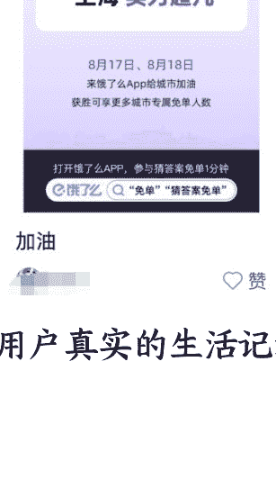
加油
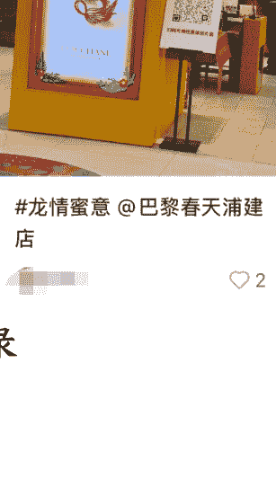
#龙情蜜意 @巴黎春天浦建店 2
用户真实的生活记录 6 / 32

##### 用户关于“结石消失”的真实分享
- 1. 真实的、日常的个人生活记录——这个很好理解，就是你的笔记，得有烟火气；你的图片或视频，得和你的文字相符。

##### 点评：
这个内容很容易做到，把一个人的日常点滴，当成笔记记录就行。平日里多拍图片，多分享你真实的感受即可。对浏览用户而言，你像一个真实分享生活的素人；对系统而言，你也像一个真人。

### 注意点：
- a. 用你发笔记的手机直接拍照、直接发图，不要随便从网上找图，然后传到账号手机发布。一方面，网上找的图，容易被系统识别非原创、已被其他平台使用；另一方面，很多手机拍摄的图片本身就带有定位标签，如果你拍摄的图片的定位标签，和上传到平台进行内容发布的 IP 相符，平台对账号的真实性判定会更佳（这一点，我没有技术和理论支撑，但是我们都是这么要求的。大家自行考虑。我只要求将能把控的风险性因素降到最低；将能把控的真实性因素增长到最大）
- b. 不要发文不对图、牛头不对马嘴的内容

#### 2. 长期的账号活跃记录，越长期的账号，效果越好。

点评：这个也很好理解。对浏览笔记的用户来说，看到你的账号，是持续发布内容的，而且以前的内容可以追溯到一两年甚至更早之前，用户对你这个“素人”的认可度才会高。对系统而言，同理。说白了，就是老号要比新号要好。

以上，是种草账号提高存活率和爆款率的基础。

## 二、批量素人种草怎么做？

很多人会问，我的营销需求是近期产生的，我不可能几年前就开始储备这种老号，怎么办？几个解决思路：

- a. 找你的员工
你的员工大多有自己的小红书号，用他们的号来发营销内容，效果肯定比普通账号好；当然，这个无法彻底解决问题。实在不行，只能让员工办理一些手机卡，养个一两个月，也能种草。关于如何养号，市面上有非常多养号工具，如影刀rpa和比特浏览器的rpa就能开发出一些养号工具，通过这种工具，提高自己账号的养号效率，是不错的选择。

- b. 找素人代发
顾名思义，就是找一些别人长期运营的小红书号，给钱或者cpa的方式，让帮忙代发你的营销内容。我推荐，你们自己去找当地的大学生、高中生，一篇多少元这种方式，让他们帮忙发。怎么找这些人群？线上可以尝试自媒体，如抖音发一条图文：×××学校，高一的校花是谁？评论的人大多就是你要的人，你去私聊。又或者，用本地兼职粉的思路，找到想做兼职的人群。让兼职给你发。需要全国范围推广的业务，用兼职粉的思路就能帮忙找到大量的全国素人资源。线下，可以进行地推。只要你有心，找到一堆当地想要的素人资源，很简单。

- c. 找素人分发团队
有非常多的团队在做这个事情，但是分发账号的质量，直接影响你的营销效果。这里面非常多坑，大多分发账号都是已经发布过无数垃圾内容的垃圾账号。我们分发需求不大，所以很少找分发团队干活。我也不太推荐，效果极难把控。如果你一定要找，那我的建议就是验号。验号的标准，就是我上面说的两条：有真实的、日常的个人生活记录和长期的账号活跃记录。并且，少量发布测试，确认效果。

## 三、有哪些素人种草的内容形式？

小红书素人种草内容太多了，各种各样的形式都有，既然开写了，那我干脆也花点篇幅，给大家罗列下素人种草的形式。以我所在的医疗行业为例（同其他行业大差不差），介绍下内容形式和营销目的，其他行业大差不差：

| 对比维度 | 平台广告 | 官方素人种草(软广) | 游击素人种草(代发/擦边) | 纯个人经历分享(顶级素人) |
| :--- | :--- | :--- | :--- | :--- |
| **目的** | 引流电商平台促成购买 | 引流电商平台促成购买 | 引流私域促成成交 | 引流私域促成成交 |
| **案例** | (图文/视频广告) | (图文/视频软广) | 肾结石改善的有效途径/玉米须茶等偏方 | 结石治愈过程分享/胆结石消失记 |
| **内容特点** | 带有明显的广告痕迹，由商家通过官方平台，选定达人后进行投放。内容以优质软文为主，但还是能看出来非常明显的广告痕迹。 | 优点是平台允许，且直接曝光商品品牌，用户不会买错品。还可以投放、不会删文不会封号。有广告痕迹。以当前消费者的聪明程度，我相信很多人能看出来是软广。 | 这种内容，会删文会封号。这是我们的当年做过的爆款之一，引流到京东抓特定的方子，一条笔记促成近3万销售额。虽然有点过时，但还有不错的效果，服饰、包包，甚至是高仿，还有很多人在这边导流至平台或私信引流私域。做这种内容，你的号得多、而且有随时会死号的觉悟。 | 这种内容，纯个人经历分享，不在笔记、不在评论区留任何明显的广告勾子。但是，还是能让你的产品得到曝光，进而促使用户主动前往电商平台搜索你的产品名，得到曝光。客单价低的，可以去做。 |
| **转化效果** | 一般 | 一般+ | 一般 | 好 |
| **内容难度** | 中上 | 中上 | 中 | 高 |

### 🍒🍒🍒肾结石改善的有效途径

被肾结石困扰的这些年，腰部隐痛、排尿不畅的难受劲儿只有自己知道。尤其喝水少或吃了高草酸食物后，没多久就感觉腰沉胀，偶尔还会被突然的绞痛折腾得坐立难安，试过不少调理方法都没见好。后来听医生说玉米须水对促进尿液排泄、辅助冲刷结石有帮助，便开始坚持喝，还搭配着石康宝，没想到慢慢看到了效果。

下面分享几款玉米须调理水的做法：

**玉米须蒲公英白茅根茶**
- 材料：玉米须 5g、蒲公英干 4g、白茅根干 3g
- 做法：将所有材料洗净，放入锅中加 500ml 水，煮沸后转小火煮 10 分钟，滤渣取汁饮用
- 关键：三者搭配能促进尿液顺畅排泄，辅助冲刷肾脏及输尿管，缓解腰部沉胀、排尿不畅的情况，搭配石康宝能更好地调节肾脏代谢环境，减少结石成分沉积

**玉米须冬瓜皮茶**
- 材料：玉米须 5g、干冬瓜皮 5g(鲜冬瓜皮 10g)
- 做法：干材料直接用沸水冲泡焖 10 分钟；鲜冬瓜皮需与玉米须一同煮水 5 分钟，放温后饮用
- 关键：利水效果突出，能帮助增加尿量，喝完能感觉肾脏“负担减轻”，尤其适合吃了高草酸食物后喝，辅助稀释尿液、降低结石增大风险

**玉米须马蹄茶**
- 材料：玉米须 4g、马蹄 3 颗(去皮切块)、无花果 1 颗(掰开)
- 做法：将所有材料放入锅中，加 500ml 水煮沸，转小火煮 15 分钟，放温后饮用
- 关键：适合体质偏燥的人，马蹄和无花果能清热

品名：苍术 剂量： 日期：
品名：苦参 剂量： 日期：
对付脱发
品名：侧柏叶 剂量： 日期：
品名：大黄 剂量： 日期：
用过米诺，然而根本不...
说点什么...

528 299 14 / 32

见第四章详述。

## 三、什么样的内容，才是好的素人种草内容？

针对私域高客单领域，真正顶级的种草文案，我认为要满足四大目标：

- 1. 流量好。平台主动推流，内容有曝光。
- 2. 欲望强。指的是，能刺激用户，让他有很强的欲望，从而主动找你私聊，从而达到引流的目的。
- 3. 营销弱。润物细无声，让平台和用户完全感知不到你是在营销。平台不风控、用户不怀疑。用户不怀疑这点，非常重要。现在有太多流量团队做内容，为了流量而做流量，导致用户带着“怀疑、聊聊看”这种态度，加到后端的微信。这种用户加多了，导致“进粉数”这个虚荣指标很高，乍看很厉害。但是质量差、浪费后端时间，未必是最优的加粉选择（再次强调，如果你是低客单用户决策成本低、或者进粉成本极低，倒是可以猛搞进粉）。
- 4. 转化高。好的内容，流量精准，为后端做好足够铺垫，用户引流到私域后：不会对你笔记进行投诉（这个很重要）、不会对推销反感、转化率足够高。

具体以这篇爆款为例，我们一一拆解，用户一共发了两篇内容：

**第一篇——笔记内容**，其实是想真实分享治愈过程的，主要内容是以穴位按摩为主（我们是名医开方治疗，看似不直接相关联），但是在内容中，提及了我们的产品，也就是下图第二列红色底（中药汤药）。

为什么能带来优质流量供给后端高转化：
- a. 经验分享贴，而且过程描述极为具体、专业，并非空谈范谈；
- b. 变现产品插入非常弱（红底线：中药汤剂），一笔带过。核心内容还是以描述个人经历为主，没有刻意强调我们的产品中药汤剂。
- c. 作者评论区互动积极，且均以经验指导为主，未有任何引流暗示

我的启示：如果你想通过素人种草，推广某个产品/服务，你要做的不是直接长篇介绍你的产品/服务，而是将你的产品/服务融入到另一个有关联的高频高需、但不敏感的场景中。你要做的是重点介绍关联场景，通过关联场景的内容获取大量的曝光，从关联场景中轻描淡写（但绝不会让人一眼略过）插入你的产品。关联场景的流量，本质上也是你的目标流量。你的产品一样能得到曝光，但用户没那么容易察觉“广告”的痕迹。

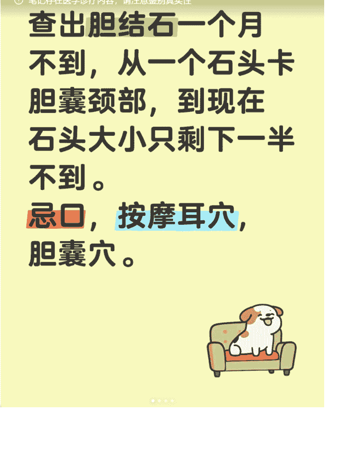

### 胆结石消失记

查出胆结石一个月不到，从一个石头卡胆囊颈部，到现在石头大小只剩下一半不到。
忌口，按摩耳穴，自己扎了胆囊穴。
一开始是胃痛，吃胃药没用。去医院查了ct，查出了个胆结石。过了2天去查了b超，说石头大小是0.73cm。胆囊壁水肿，胆囊壁增厚4.3mm。之后挂水3次。吃消炎头孢一周多。发作的第9天汤药到了，开始吃中药汤药，每天一颗熊胆粉（国产），扎针一周一次。
严格忌口，每天做一个蔬菜汤：玉米，彩椒，包菜（可以换成小青菜，卷心菜），冬瓜，胡萝卜，加一点点盐和一点点菜油。清蒸河鱼或者清蒸河虾。喝大米粥小米粥。偶尔吃点西瓜什么的。
一个月不到去查，只有0.3*0.3cm。
另外自己加了耳穴，脚底消化系统每天刮一遍。耳穴是自己摸到位置，（图3上所有穴位，左右耳都要）。用手指或者火柴棒或者棉签按摩一个穴位2-3分钟。不会耳穴的直接去小破站搜“耳穴内分泌”“耳穴交感”，也可以让家里人帮忙找。胆囊穴如果不会扎针，自己查一下阳陵泉大筋在哪里，自己每天拨5分钟，拨最痛那个地方。这几个合计花费一天应该一小时不到。
每天10点前睡觉。少吃多餐。
我这个ct能查出来的结石应该是小红书上说的胆色素结石，但是也速度这么快变小了。
希望有同样问题的病友，如果没在发作期，可以试试看这个方法。
当时报告说在胆囊颈部，整个人都傻掉了，问了几个专家都说马上开刀。我搜了小红书被科普了一大堆，马上就弄清楚了到底胆结石怎么回事。
另外如果在发作期，那要听医生的，该开刀开刀，该挂水挂水。就算去看中医，医生也会让先挂消炎水，解痉挛。
另外补充一下，我问过一个三甲医生，是不是ct显示都是胆色素（小红书这么说的，当然我不敢说这句话），他说人的胆结石85%都是胆固醇，是开刀开出来后化验的结果概率。

说点什么... 1049 1697 184

**评论区互动：**
- 我的也是一个在胆颈口🥲 (07-25) ❤ 赞 💬 26
- 其实如果不堵上，不疼，那没关系的。过几天可能就滚回胆囊底了。 (07-25) ❤ 1 💬 回复
- 回复 ：问了医生说让我手术，把我吓得 (07-25) ❤ 赞 💬 回复
- 回复 ：我是近胆囊颈侧的结石，不知道能不能回到胆囊里 (07-26) ❤ 赞 💬 回复
- 回复 红红yanyan：多大了？如果不疼，吃完饭也不打嗝，那应该没啥问题。疼的话要去立刻医院的。毕竟胆囊其实很小，石头在哪里都有可能。 (07-26) ❤ 赞 💬 回复
- 时间长了按还有用吗😭 (07-24) ♡ 1 8
- 耳穴有用的，我看的火柴棒医生里面，有个小伙子好多年的胆囊炎了，按了3个月，天天按，人家也好了。后续胃口好的不行，从瘦干的青年变成了个大胖子。 (07-24) ♡ 5 回复 展开 7 条回复
- 我胆结石卡在了胆囊颈 卡死了 胆囊憋的水肿了很大 还有炎症 医生说离胆总管太近了 手术风险也很高 就是消炎保守治疗 三个月后再评估做手术 我真的不想切 可是这次好像没有办法了 现在还在医院输消炎的药 (09-10 北京) ♡ 赞 7
- 大部分胆囊穴就是这个问题，不要怕。输普通头孢马上能缓解的。缓解了之后，自己每天按脚和耳穴。试试看。 (09-11 上海) ♡ 赞 回复 展开 6 条回复

**第二篇——笔记内容**，完全没有提及我们的产品。但也是高关联的场景内容，且在评论区回复时，间接提及了我们的变现产品。这篇笔记，其实更加“软”，软到没有提过我们的产品。但如我上面第一篇所说，是一篇高关联场景的内容。这篇内容，是在正常回复用户的评论时，提到了治疗的方向：中医专家、中药。而且你能明显看到，回复评论暴露产品，也是非常地间接暴露（我下面图中红圈的内容，文字难以描述清楚，自己意会领悟）并且，态度比较高冷（见最后一张图的回复），并未给人一种“讨好的销售倾向”。

启示：顶级种草，顶级到连系统和用户都无法辨别的种草内容，能做到笔记全文不提及你的产品/服务。但作为高关联的场景内容，总能通过其他用户的主动评论/提问，从而能带出你的产品/服务。哪怕没有带出来你想要的问题，你用自己的小号评论主号回复，带出来就行。

提醒一点：最好通过评论区盖楼式的多条回复，更让人容易产生信任。如果简单的一问一答，还是容易被识破为广告。很难描述，看具体内容截图，懂的应该都懂。

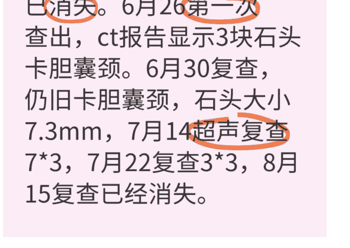

### 胆结石从查出到消失历时一个半月消失

8月15去复查，胆结石已消失。6月26第一次查出，CT报告显示3块石头卡胆囊颈。6月30复查，仍旧卡胆囊颈，石头大小7.3mm；7月14超声复查7*3，7月22复查3*3，8月15复查已经消失。

顺便说下症状，复查前，后腰和前面肚子一圈的酸疼已经消失7天。吃东西堵住和喘不过气的感觉也较之前好一大半。

我前一篇帖子说过，吃东西后胃难受这个症状已经有一年半到两年。查胃查不出什么。

其实胆结石消失这个，我已经不惊讶了，因为自从自己操作后（如何操作看上一篇，大致就是喝汤药+针灸一周一次30分钟+按摩耳穴每天+按摩脚底每天。按摩脚底的是小破站找的视频，每天跟着做一次就行，也就十几分钟，我会贴在评论区）。身体感觉越来越好。胆结石症状也在好转，中间有反复过，但是都是通过耳穴+扎针胆囊穴最多半小时就解除了。

胆囊穴不会扎针的，自己去搜阳陵泉大筋，自己找大筋上最痛的那个点，按压就行。5分钟、10分钟不等，可以用三角雀点按。

说下为什么不想开刀：其实症状挺危险的，结石卡颈，问了几家医院都要求立刻住进去。胆汁出不去所以痛。胆囊切除手术是将上方连着心脏那个管子切了，在陈玉琴循指理论中，胆是连着心包经和肺和肝。肺可以按压尺泽判断，尺泽不痛，就不是肺。肝可以按大腿肝经部位判断，痛压到不痛。刚查出来一段时间，我小红书查了下，说胆囊切除其实并不好。胆汁是肝生产的，生产后就存在胆囊，吃肉吃饭的时候会喷出来，如果切了胆，那吃饭的时候不够胆汁，但是不吃饭的时候胆汁又在源源不断流向小肠，可能会造成肠道问题。

熊去氧一直在吃，就是医院开的能进医保的国产。

最后说下治好了之后的医嘱：早饭9点前吃。午饭晚饭吃了后，需要散步，实在不能散步，人也要站个5-10分钟，左右走走。

我也是在颈部，最近被医生吓得了解保胆取石了
08-18
赞 6

这个没有用。我去扎针的地方，有个女病人年纪很小，最多30多，她就是保胆取石了，半年了，现在又2cm了。
08-18
4 回复

：唉，那我怎么办
08-18
赞 回复

：做手术了吗？不管做没做，每天脚底和耳朵都按起来。
08-18
赞 回复

：没有
08-18
赞 回复

去医院开药吗，我的比花生米大点。我也打算喝点中药看看啥样
08-18
赞 5

你最好是找你们当地比较有名的肝胆科的中医医生帮你开。普通的中医医生，估计没用。
08-18
赞 回复

：中药和熊去氧同时吃吗
08-18
赞 回复

我那个中医是这么要求的，但是我还看了其他中医，说不用。所以要看你吃谁的药，是谁的就听谁的。相信医生，相信自己的身体，肯定会康复的。
08-18
赞 回复

：我去看了医生说拍不出来，只能控制

你在上海哪里看的[表情][表情]
08-18

扎针找了当地。汤药找的外地的。
08-18

回复：你是怎么治疗的？
08-18

回复：都在帖子里面了，共2篇，看不懂吗？[表情]
08-18

## 强调一点，种草高客单如何通过私信进行导流

这里不是强调怎么规避平台监控，通过各种方式把你的微信传递出去或者把用户微信要过来。

这里的意思，是强调：你应该怎么做，才能避免在最后引流的一步暴露你的引流倾向。

非常简单：不用主动，不要主动提及服务，不要主动，不要主动引导用户留下微信。你要冷淡、你要高冷，对方不主动提起，你绝不主动提。

一旦犯错，虽然能成功导流到私域，但私域转化过程中，一旦话术轻微犯错、或者服务价格超出他的心理预期，用户一旦心中有疑惑，就会回溯和你的聊天记录，很容易就能察觉出来你的营销性质。

以下是大多打粉引流团队的操作，我不好置评是对是错，因为有些后端交付，决策成本低的，的确可以想办法先把用户加到私域。

但这么聊，的确，容易暴露引流倾向。高客单的项目，我不太建议这么搞。

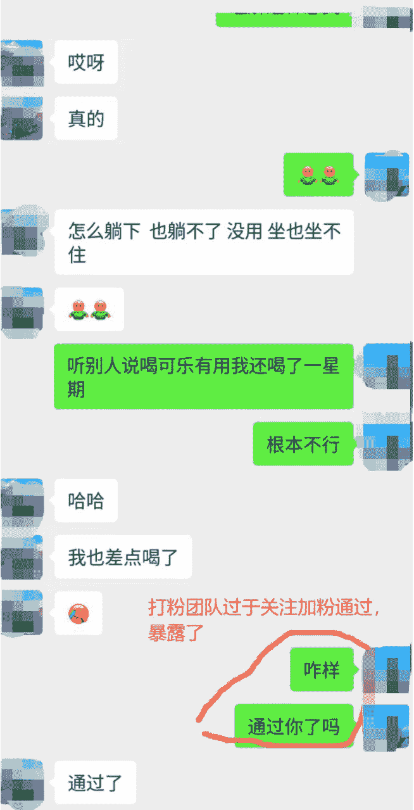

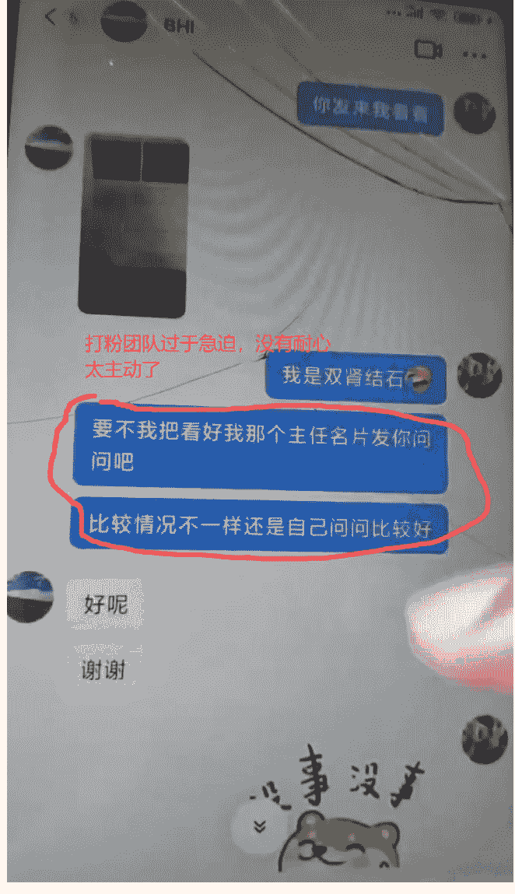

很多团队将流量外包给第三方，通过加粉数结算；或者自有的流量团队只考核加粉数，不考核最终成交量。那么流量团队就为了流量而做流量，简化自己的引流动作，犯类似的这些“主动错误”。

但对于产品客单高的产品，流量团队最好要把好流量质量关（同时流量团队考核成交额，而非进粉数），不要犯类似的错误。纵然会有一部分意向用户因为我们的“不主动”而流失，但最终引流到私域的，都是较高质量用户。

一方面，能减少提及引流关键词进而提高系统风控概率；另一方面，这样导流的粉丝质量高、数量较少，我能减少后端转化团队人力配置，但能维持高产出效果。

## 写在最后

好了，内容就这么多了。希望能给大家一些做高客单产品的朋友，一些内容营销的启发。

有很多内容，可能和大家平常接触的常规打粉、常规引流完全背道而驰。但是，我要强调的是，咱们是否更应关注最终成交收入以及公司利润，而非过程中的虚荣指标，如播放量、加粉量。

这是我个人的一些粗浅的高客单引流到成交的见解，不一定对，但希望能抛砖引玉。不足之处，多多包涵指正。

最后，安利小懒的付费群：

## 懒人专属群（介绍）

🏷 懒人专属群持续更新中，已持续运营 6 年，整理超 3000 份各类精选付费文章 & 年费社群干货，全部开放下载。

本资料为付费群内部分享，仅供真实有需要的朋友查阅 🤫

懒人专属群更新记录：
https://lazy2025.top/blog/record2

懒人专属群更新记录（需梯子，备用）：
https://lazybook.fun/blog/record2