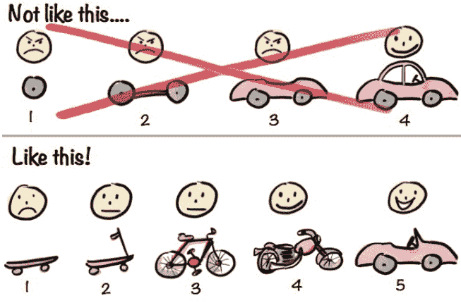

# 普通人如何靠成长型思维实现跃迁：一张过期名片，带我点亮三大洲

251011  生财精华

公众号懒人搜索，懒人专属群独享

懒人微信：lazyhelper

你重生了，系统只给你一张“过期名片”。

你，会解锁怎样的世界地图？

## 开篇 | 不是做不动，是被“做对”困住了

上一篇《两个搞钱真相，带你重启100%执行力和源源不断心力》里，我分享了一个看似反常识的观点：

这个世界上不存在"没有执行力的人"。

每个人都有100%的行动力，只是这股原生能量，被潜意识里的抗拒、恐惧、怀疑一点点消耗掉了。

大脑（理性）认同 ≠ 身体（潜意识）认同。

像@亦仁老师提到的，把情绪当作重要战略资源。当理性与潜意识达成"双重认同"，行动力自然就回来了。

那篇帖子发出后，收到了特别多圈友的反馈：

有些人第一次看清了"为什么总是动不起来"；有些人化解了内耗，找回了心力；还有人照着做，真的跑起来了，接上了久违的节奏感。

### 摘录圈友留言一二，如下：

- 花生黄油：很受启发，我列了一下我想过的那种生活，丢给ai帮我计算预计收入，瞬间原动力满满🌹🌹🌹
- 偶尔的时光：这篇文章激发了我对自身心力的好奇，看完大呼卧槽！
- 哈哈瓜：感觉解释了最近遇到的心理障碍🌸感谢老师
- 小运：感谢石神马老师的分享。说实话，平常的那些帖子我都看不下去，我都拿ai去阅读。但这次我认真的看完了完整的一篇帖
- 拾壹贰：很落地，治好了我当下的内耗，有方法，有原理

这些反馈让我特别感动。

同样幸运的是，生财官方邀请我把这套方法，打磨成更具实操性的 mini 航海，让更多人不只是获得短暂的充电和启发，而是拥有一套可复制、可实操、可落地的思维清晰化路径。

因为我始终相信：真正有价值的认知，不只是看见、共鸣，更重要的是能够践行和带来改变。

说回我观察到的现象：很多人跑起来之后，很快又卡在了第二个阶段。

不是动不了，而是当执行力变成基操之后：“怎么感觉还是在原地打转？”

过去半年，我和 100+位生财圈友线下交流，发现一个特别有意思的现象：

大家在搞钱创业过程中遇到的大部分"问题"，其实从提问方式本身，就暴露出了提问者的思维局限性。

比如这些问题：

+   “我现在到底该先搞 A 项目，还是先搞 B 项目？”

+   “最近做的项目没出结果，是不是说明我不适合？”

+   “时间真的挤不出来了，不知道怎么平衡工作和副业。”

听起来像在理性分析，实际上，问题本身就把自己困住了。

这些提问背后，都藏着一个共性思维逻辑：世界上有一个标准答案，只要找对了，就能一劳永逸。

这就是典型的固定型思维。

他们更关心“做得对不对”，而不是“在做中不断变对”；

他们执着于找“确定性”，而不是拥抱“变化性”。

举个例子：

> “我该先做 A 还是做 B？”

固定思维的潜台词：这个世界上一定有一个标准正确答案，只要顺序对了、选项对了，就不会失败；

成长思维的关注点：围绕我当前的状态，什么才是更适合且我能承担的选项？

> “项目没结果，是不是说明我不行？”

固定思维的视角：结果 = 结论

成长思维的新知：结果 = 反馈（反馈可以是正面的，也可以是负面的，所有反馈都让我更清楚我擅长什么、不擅长什么，从而提高下一次行动的胜算）

> “不知道怎么平衡工作与副业”

固定思维的前提：我只能是现在的自己，资源也只有这些；

成长思维的目标：我能不能提升实力，用实力换取更多资源、时间、人力，从而解决现在的选择问题？

说白了：

固定型思维的人，把当下当终点；成长型思维的人，把当下当起点。

而这两种思维最大的分水岭在于：

你是“先看见，再相信”；还是“先相信，再创造看得见的结果”？

有趣的是，固定型思维的人，不是因为没看见确定性，而错失了绝大多数机会。

反倒是明明看见了确定性，却“视若罔闻”，因为思维里压根不相信它的存在。

反观成长型思维的人，愿意在行动中创造确定性，也自然看得到更多可能。

这不是鸡汤，这就是这几年我亲眼目睹所有实现跃迁的人、项目、结果背后的真实路径。

我为什么要强调这一点？

因为很多人以为，认知转变得靠天赋、靠顿悟、靠运气——但其实不是。

和上一篇一样，我还是想给你一个特别务实的希望（勺子）：

只要你愿意练习，你也可以像那100+位参加过我线下分享的圈友一样，从模糊走向清晰，从固定型思维走向成长型思维。

而这一切的转折点，往往就从一个极小的行动开始。

比如我自己——就是从一张“过期的旧名片”开始的。

## 故事|一张过期名片，点亮世界地图

十几年前，我在美国北卡罗来纳州读本科，没有人脉、没有背景、没有资源，就是一个普普通通、靠图书馆打零工挣生活费的留学生。

周围的同学都在卷投行、金融实习，我却对葡萄酒品鉴着了迷——这在美国东部，简直是个冷门到不能再冷门的选择，因为美国西部（加州）才是葡萄酒的大州，地域决定这压根称不上一个职业选择。

一次校内的就业咨询快结束时（美国大学有一个专门辅导学生就业的部门），老师突然想起来什么，从抽屉深处翻出一张皱巴巴的名片。

“这个人三年前在商学院做过讲座，你可以试试。不过，”她耸耸肩，“别抱太大希望。”

我盯着这张过期名片，上面的邮箱地址甚至都褪色了。

理性告诉我：三年前的联系方式，大概率已经失效；就算没失效，对方凭什么理一个素不相识的中国留学生？

但有个声音在说：来都来了，要不要试试看。

当晚，我写了第一封邮件。

没有花哨的自我包装，就是直白地说：

“我来自中国，对葡萄酒行业很感兴趣，

但几乎是从零开始，想多向您请教交流。”

在邮件末尾，我加了一个看似不起眼的问题：

> “如果您不介意的话，能否推荐 1-2 位您觉得值得我去聊聊的业内人士？”

48 小时后，我收到了回复。

不仅回答了我的问题，还真的给了两个联系人。

接下来发生的一切，从未在我的预期里。我没有设定“必须要如何”的目标，也不执着于“一定要获得谁的认可”。

我只是不设定结果，只持续行动——然后，信息开始涌现了。

滚雪球式的链接就此开启：

从那两个人开始，我持续写信（当时还主要靠邮件）、链接、交流、请教，再次请求转介绍。我给自己的唯一规则是：不预设结果，专注把过程做好。

接下来几个月里，我发出 300+ 封邮件，收到 50+ 封真诚的回复；每得到一个积极回应，就从对方那里再“抠”出几位新的联系人。像个贪婪的探险家，沿着模糊线索不断深入——信息、人脉与机会，以我从未想象的方式向我涌来。

第三个月，第一个让我心跳加速的“涌现”发生了！

我收到了一封邮件，作为中美青年领袖代表之一受邀参观白宫，并参加了相关的行业活动。

美国首都——华盛顿特区的地图，就这样被意外点亮了。

第五个月，更大的“涌现”接踵而至：

我从美国东部横跨到西部，拿到了美国最大行业协会——加州葡萄酒协会（ California Wine Institute ）的暑假实习机会。从那时起，几乎所有美国葡萄酒行业的重要活动上，都有我的身影。

第二年，我成为了该协会年度会刊的编辑。一个曾经连行业门槛都够不着的普通留学生，开始用自己的视角，记录并参与这个行业的叙事。

那段时间，我从东到西，用脚步和行动，把北美地图一块块拼起。

但这也只是开始。

更大的平台主动向我敞开：我收到来自美国农业部（ USDA ）的机会，被派驻回到上海，负责葡萄酒相关的市场推广——中国版图被重新点亮。

次年，我申请了 3 所全球 TOP 葡萄酒商学院的研究生，并全部拿下 offer。在法国勃艮第完成了葡萄酒商科硕士——至此，欧洲版图，也被点亮。

### 回到开篇那个设问：

如果这是一本“重生爽文”，开局只有一张别人不要的过期名片，你的世界地图能开拓到多远？

我的答案是：三大洲。

如果当时我因为“过期”而把名片塞进口袋，如果我认定“普通留学生不可能链接到行业核心”，这一切都会归零。

这段亲身经历，后来也成了那位就业辅导老师最愿意分享的案例之一。用她的话说，她在我身上看到了 Tenacity（韧性）。

而对我来说，真正支撑这一切的，是成长型思维：在不确定中持续行动，在行动中创造确定性。

我没给自己加限制性的设定，也不把自己锁进“必须的结果”。我选择做那个最小可行的动作，不给自己设定任何“必达”的确定目标。

把每一个“看似不可能的终点”，都当作“先试一试的起点”。

不是“先看见，再相信”，而是“先相信，再创造看得见的结果”。

## 思维 | 成长型思维：我是谁 → 我在成为谁

从那张过期名片开始，我的人生像按下了加速键。

但这并非什么玄学，背后是一套人人都可以习得（是的，每个人都可以）的思维“操作系统”——成长型思维。

它由内而外，分为三个层次：内在信念、行动方式、外层语言。

### 一、内在信念：当下不是终点，是起点

你相信自己一年后、三年后，会和现在一样吗？

如果你的答案是“不会”，恭喜你，你已经拥有了成长型思维的种子。

如果你的答案是“应该差不多吧”，那接下来的内容，可能会彻底改变你对“自我”的看法。

成长型思维的内核，只有一句话：世界在流动，我也在“成为”的过程中。

这和创业的本质如出一辙。

你看，商业世界里有永恒不变的“风口”或“模式”吗？所有成功的模式，都是在与市场的动态博弈中，不断迭代、不断“成为”的样子。

既然商业每天都在剧烈变化，我们凭什么把自己框定在“我就是这样的人”的设定里？

固定型思维的人会说：“我就是不擅长销售”、“我天生不是做生意的料”；成长型思维的人会说：“我还不擅长销售”、“我正在学习做项目”。一个“还”字，就是固定与成长的分水岭——把终点重新变成起点，把结论改写为过程，把“我是谁”变成“我在成为谁”。

这不只是哲学概念，它有更坚实的生理学背书。

神经科学早已证明“大脑可塑性”：经典的“抛球训练”研究发现，仅仅经过几周的杂耍训练，就能让与运动相关的灰质区域出现肉眼可见的增长。

当你开始改变时，你的大脑，真的在字面意义上的、物理层面的“在变”。

而点燃这一切的终极燃料，是“自我效能感”——那种“我相信我能把事情搞定”的内在确定性。

它不是盲目自信，而是这样一种信念：即便我现在不会、不懂、不行，我相信我可以通过努力、学习和链接，最终解决任何问题。

2018年我在上海做TEDx策展时，引用过日本建筑大师山本耀司的一句话：

‘自己’这个东西是看不见的，撞上一些别的什么，反弹回来，才会了解‘自己’。

你不是在安静的房间里“想”明白自己是谁的；

你是在与世界一次次的碰撞—反馈—修正中，“塑造”出你正在成为谁的。

### 二、行动方式：反馈替代评判，迭代替代纠结

如果说内在信念层是“我怎么看待世界”，那么行动层就是“我怎么与世界互动”。一旦底层信念从“我是谁”切换到“我在成为谁”，整个行动逻辑都会被重构。

- 固定型行动路径：先下结论 → 证明我对 → 自我验证（封闭回路）
- 成长型行动路径：提出假设 → 获取反馈 → 持续迭代（开放回路）

差别在于：

固定型思维在找“一个标准答案”，然后确认自己是对的；从自己出发，又回到自身上，是一个封闭的自证循环；

成长型思维在找真实世界的反馈信号，并据此不断调整；从自己出发，持续向外探索，是一个开放的结果验证循环。

在创业中，这就是精益创业（Lean Startup）的灵魂：与其闭门造车追求“完美亮相”，不如先推一个最小可行性产品（MVP）去测试市场，快速进入“构建—度量—学习”的反馈循环。

不是先造一个完美的轮子、再造第二个...最后组装成车；而是先从滑板车开始，到自行车，再到摩托车，最后才是汽车 → 飞机 → 火箭......每一个版本都能运行，都能换回真实世界的反馈。

再比如项目日常：

固定型思维会说：“我不会，所以我做不了”，轻易给自己下判决；

成长型思维会说：“我不会，但我可以学；学不会，我可以找会的人；找不到人，我还可以换个方式…”——永远有方法把问题拆开。

看到行动差别了吗？

方式和路径从来不是核心。核心是：我相信问题可以被解决，于是我能看见千百条路径中的一条。

而固定型思维的人，因为“不相信自己能行”，即便解决方案就在眼前，也常常“选择看不见”。

一句话总结：

固定式行动，执着地证明“我是对的”；
成长式行动，敏捷地探索“什么更对”。

### 三、外层语言：你的语言，就是你思维的边界

如果说内在信念是“操作系统”，行动方式是“应用程序”，那么语言就是你与世界交互的界面，也是你重塑内在系统的最强工具。

语言不是被动描述现实，它在主动创造现实。 一个人开口，你几乎就能触到他的思维轮廓。

想从固定迈向成长，最简单、最直接的切入点，就是刻意练习你的语言——改变语言，就能改变思维。

### 三个立竿见影的“语言改写”：

- 名词句 → 动词句
  别说：“我是一个拖延的人。”
  要说：“我正在/还在练习更高效地启动任务。”
  前者是不可撕的标签（名词），后者是可改变的动作（动词）。别做自己的“下定义者”，要做自己的“塑造者”。

- 二元对立 → 连续谱系
  别问：“我到底该选 A 还是 B？”（在找唯一正确的封闭答案）
  要问：“在我此刻的状态里，哪个更合适、更有能力承担？哪个能更快获得反馈？有没有第三种组合？”（在探索开放的可能性）
  世界不是非黑即白，而是一条可连续调整的谱系。

- 评判句 → 反馈句
  别说：“这次项目没出结果，说明我不适合创业。”
  要说：“这次没出结果，我得到三个关键信息：1）低估了冷启动；2）定价过于保守；3）需要一个懂运营的搭档。”
  语言变了，信念与行动会一起跟着变。

你说的话，就是你的思维边界。

语言变了，看待问题的视角就变了；视角变了，情绪和信念会跟着变；信念变了，行动自然就变了。

到这里，我们完成了成长型思维的“理论拆解”：信念层、行动层、语言层。

我也听见了那个常见问题：“道理我都懂，可我就是做不到，怎么办？”

别急。接下来，我会给你一套具体、可操作、能带回家立刻上手的标准动作。

## 方法｜从觉察到练习：成长思维语言重写

在上一篇《两个搞钱真相，带你重启 100% 执行力和源源不断心力》里，我们聊的是“行动卡顿”——怎么让系统重新运转。

那时我说：执行力的问题，根在潜意识与理性的冲突。

现在，我要补上更关键的后半句：

如果不持续练习觉察，你的内在思维系统会自动回滚到旧版本。

成长从来不是一次性的顿悟。成长，是肌肉记忆。

就像健身，你不可能靠一次硬拉就练出背肌。一旦停练，身体会立刻反弹。

成长型思维也是一样，它需要刻意、持续地练习，才能内化为你的本能。

好消息是：这套“肌肉”，可以通过刻意练习来养成。

坏消息是：光看不练，等于零。

今天，我想分享两个初步的落地工具——它们源自我的亲身经历、线下分享和训练营经验，能让你从“知道”转向“做到”。（改变执行力的“思维清晰化”工具方法，看👍）

这些工具不是万能药，但它们是起点：帮你觉察内在的“保护性假设”，并用语言重塑行动模式。

### 日常练习步骤

- 记录：把一天中最常说的句子写下来（对自己说的、对他人说的）
- 觉察：标记出所有“固定型思维（语言）”
  - 含有“就是/不是/永远/从来”的绝对化表达；
  - 含有“我不行/我不会/我做不到”的自我设限；
  - 含有“应该/必须/一定要”的完美主义要求；
  - 其他限制性的思维语言；
- 重写：逐句改写成“成长型思维（语言）”

“我不行” → “我还没找到方法。”

“我怕做错” → “我能从这次试错中学到什么？”

“别人都比我强” → “我今天向他学一件具体的小事。”

“我就是拖延症” → “我在某些任务上会拖延，让我试试把任务切小 10 倍。”

“这太难了” → “这很有挑战，我需要什么资源来攻克它？”

持续练习：连续写 5-7 天，每天 10 分钟

你发现了吗？不需要 7 天，甚至不需要顿悟——3-5 次专注在单点问题上的深度洞察，就足以戳穿问题的底层逻辑，换上新的思维方式。

这里也有个关键：找到那个“最小可改变单元”。

很多人练习了，也有改变，但总感觉“差一点”，没有达到那个“啊哈”瞬间。

差在哪？

差在没有找到那个，能够撬动整个系统的支点。

就像多米诺骨牌，你需要找到第一张牌在哪；

就像解绳结，你需要找到那个关键的线头。

这就是为什么同样的方法，有人用了突飞猛进，有人用了缓慢改变。

但即使没有极强的洞察力，只要你愿意开始练习，改变依然会发生——可能慢一点，可能绕一点，但一定会发生。

## 邀请｜让思维带你进入更大的世界

当我收尾这篇帖子时，脑海中浮现的，依然是那张泛黄的旧名片。

其实这个故事远没有我写得这么轻巧。

那张名片确实过期了。

第一封邮件是在 12 小时后发出的，因为我花了将近一个白天，用各种搜索方法，摸到了名片主人的有效邮箱。如果我不相信自己找得到，故事就到这里了。

探索的 3 个月里，我几乎每天 3 - 5 次被拒绝或被忽视。向世界发出的信号，回音率不到 20%，大多数还是礼貌性的寒暄。如果我只盯着负面和失败，故事也早就结束了。

拿到美国农业部（驻北京办事处）的 offer 后，我飞了 13 个小时落地北京，当晚被告知无法自由出入大使馆，也就无法正常入职。我纠结了三天：回去读书，还是躺平一学期？

最后我选择冷电话（Cold call），联系到在外地参加活动的美国农业部（驻上海办事处）领事。一番电梯游说（Elevator pitch），把自己从“北京”转卖进了“上海”。如果我因为外界的一次波动就泄气，故事也走不到今天。

这些有血有肉的“非顺利时刻”，才是真正的成长发生处。

因为成长型思维，不是顺风顺水的产物，而是你在被世界拒绝、误解、打回原点时——仍然选择相信，仍然选择行动。

而这，也让我想到了「生财有术」。

生财也是这样一张“名片”。

很多人以为，生财是一个信息星球。他们来这里找风向、找案例、找资源。这没错，但这只是第一层。

他们没意识到，自己手中握着的，其实是一张带来涌现和跃迁的邀请函。

生财不仅是一个信息集散地，更是一个能让你验证思维、练习行动、持续跃迁的真实实验场。

你可以在这里：

- 发帖分享，练习你的思考与表达；
- 报名航海，在集体场域中刻意练习；
- 成为传术师，将输入转化为有价值的输出；
- 参与项目共创，与真实的世界碰撞，获得真实的市场反馈...

我见过太多圈友，在这片土壤里不断获得涌现和跃迁。

他们不是“突然变厉害了”，而是在这个生态系统里，一次又一次地练习成长。

区别只在于，是在等待确定性，还是已经开始创造确定性。

我总在线下分享的最后，说这句话：

> “大家听了有启发、有感触，出了这个门，如果什么也没有行动和改变——那叫情绪价值，这也很好。但只有发生了改变和行动，哪怕只改变一点点，才是真的不同。”

情绪价值，让你短暂地感觉良好；

行动改变，让你持续地变得更好。

不练习，这篇文章就只是 10 分钟的多巴胺；

练习了，它也许能让你的人生地图，打开新的篇章。

有趣的是，如果这是一本“重生爽文”，生财刚好就是你手中的那张“新名片”——

你的地图能开多远，不在于生财的资源有多少，而在于你如何用成长型思维看待自己与这个真实世界。

我们无法预测航线的终点，但可以决定出发的方向。

当你愿意用成长型思维去看世界，你就会发现——

所有的限制，都是信念制造的幻觉。

每天 10 分钟，连续 5-7 天。

就从今天，就从现在，就从写下那句最常困住你的话开始。比如：

“我不行。”

然后，把它改成：

“我还不行，但我可以先
___________。”

这个空，你填进去的内容，就是你成长的起点。

最后的最后，如果这篇文章让你有所触动，也欢迎你在生财原链接点赞+锚点，或者留言，开启你今天的行动。

## 最后，安利小懒的付费群：

### 懒人专属群（介绍）

懒人专属群持续更新中，已持续运营6年，整理超3000份各类精选付费文章&年费社群干货，全部开放下载。

本资料为付费群内部分享，仅供真实有需要的朋友查阅🤫

### 懒人专属群更新记录：

https://lazy2025.top/blog/record2

### 懒人专属群更新记录（需梯子，备用）：

https://lazybook.fun/blog/record2