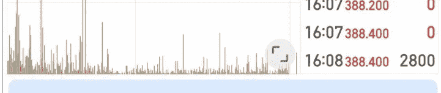
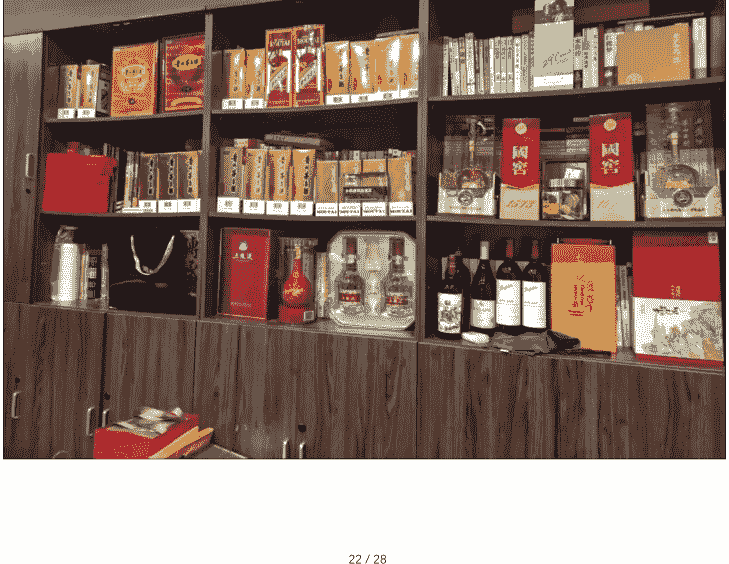
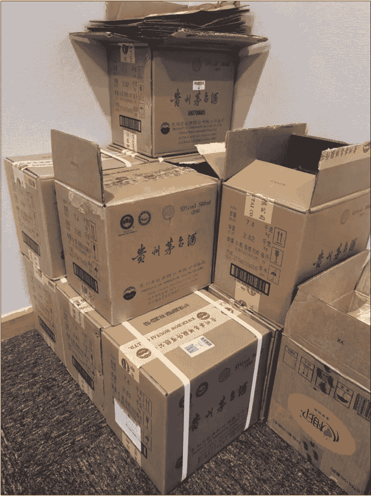

# 赢在红利，强在壁垒

251011 生财精华 盗坤

整理：公众号懒人搜索，懒人专属群独享

懒人微信：lazyhelper


坚持还是放弃，专注还是拓展，这是曾经困扰我的一个问题，想必也是困扰大家的一个问题。

我做淘宝、抖音、小红书带货的时候都有一个观点，好产品是测出来的，不是选出来的。

今天我也想告诉大家，每个人能力值不一样，擅长点不一样，入场时间点不一样，适合做什么项目也不一样。

接下来我将结合自己十年的创业经验以及一些商业案例，给大家来剖析一下如何选项目、测项目，如何处理专注和拓展的关系。

不知道各位有没有这种感觉：如果认真去复盘一下你的来时路，会发现那些真正赚到钱的项目，其实都显得顺风顺水，没怎么费劲就把项目做起来了。

而另一方面，那些你做得异常艰辛的项目，大概率最后赚不了啥钱甚至亏钱。

就好像二十几年前，有些人租个铺子，把广州的衣服倒手回自己的小县城，不需要什么引流促销、线上获客，就可以门庭若市，赚得盆满钵满。

但现在有人砸了几十上百万去开一家女装店，即使有精致的装修，高颜值的导购，各种折扣福利，也依然很难把它做起来。

又好像十几年前，有些人只是把1688的商品库库往淘宝上传，就开始出单赚钱。但现在你要做一家淘宝店，几万推广费砸下去都没什么水花。

就是你会发现，这些赢了的人，并不是因为多么有能力，甚至有些可能都算不上勤奋和努力。

他们的胜利有很多原因，但最重要的原因只有一个，踩在时代红利的风口上！

这也是为什么一些有一定社会阅历的人经常会提到，“运气”比“努力”重要。

包括我自己的经历也是如此，能打赢的仗基本上都是靠“红利”。

16年的时候做淘宝蓝海，包括此后的淘宝店群、天猫店群。22年的时候做抖音混剪，22年年底抖音搬快手，23年年初抖音搬视频号以及无人直播...

> 雷军曾说过：“创业，就是要做站在风口上的一头猪，风口选对了，猪也能飞起来！”

而这也是我今天想给大家分享的一个主题：对大部分普通人、中小企业而言，要想赚到钱，最核心的命题有且仅有一个，探索红利、收割红利。

当然，我并不是要给大家鼓吹机会主义，而是希望大家可以明白一个道理，一个个企业的发展是有规律的，而在企业发展的不同阶段需要有不同的运营策略。

一个企业在 1-10 的阶段，核心目标是规模化，关键动作是构建组织、规模壁垒。在 10-100 的阶段，核心目标则是守江山+拓疆土，关键动作也成了强化品牌和生态。

而当一个企业还处在 0-1 的婴儿期、初创期时，它的目标只有一个，那就是活下来。而对于一个力量弱小的“婴儿”，要想在丛林中生存下来，这个时候的关键动作就是寻找信息差、渠道差，找到敌人力量薄弱点，然后集中兵力击破。

| 阶段 | 核心目标 | 关键动作 |
|---|---|---|
| 初创期 (0-1) | 活下来 | 抓渠道/信息差红利 |
| 成长期 (1-10) | 规模化 | 建组织/规模壁垒 |
| 成熟期 (10+) | 守江山+拓边界 | 强化品牌/生态壁垒 |

许多人容易犯的错误是在需要建立组织和规模壁垒时，仍然沉迷寻找红利，追逐各种风口，目标短浅。这也是那些享受过专注的价值喜欢给你说的，不要沉迷于机会主义，要坚持长期主义。

可我也看到了另外一种错误，那就是在需要寻找弱小对手的时候，盲目建壁垒。

## 这个世界从来都没有以弱胜强，胜利的本质原因从来都是以强击弱，无非是胜利的一方是表面强还是实质强，整体强还是局部强。

不是说建立壁垒不重要，而是在创业初期，寻找红利比建立壁垒更为重要。

为什么我说在需要寻找弱小对手的时候，盲目建壁垒是一种错误？正是因为强弱状态在短期内是不以人的主观意志为改变的。

淘宝的竞争，就是产品、视觉、运营、推广。当你还是一个初创团队的时候，产品同质化，视觉同质化，运营手段也同质化的时候，资金实力还不如对手，你凭什么认为你可以以弱胜强？

这个时候，你整个工作的重心根本就不是把ROI再提高1%，视觉效果再优化2%，评论文案再编辑得更好。

你的重点工作只有一个：找到淘宝平台那些更弱的对手，也就是寻找品类红利。

2012 年 3 月，张一鸣在北京知春路的锦秋家园租用了一套民居，成立了字节跳动。创立之初，条件简陋，团队也很小，半年过去了也不过三十人左右。

而在半年之内，他们就上线了十几款不同主题和方向的应用，并最终测试出了第一个核心产品“今日头条”，此后开始倾注大量资源在今日头条这个 APP 上，拉开了字节帝国的序章。不过即使有了今日头条这个 app，相较于百度、阿里、腾讯这些巨头而言，字节的实力也是不够看的。

于是他们继续寻找第二曲线，同样是群狼战术，同时测试 N 个 APP，最终由几个实习生开发的抖音引起了公司的重视，由此揭开字节帝国的正式篇章...

为什么第五次反围剿战役我们会失败？那是因为罔顾敌我双方的实力差距事实，同敌人打阵地战，硬碰硬，所以我们会失败。

为什么前四次反围剿战役我们会成功？就是因为我们通过运动战的方式，化被动为主动，打乱敌人部署，把敌人切割成很多小块，从而让敌人整体的强转化为局部的弱，进而集中优势兵力，以数倍兵力围攻一处，实现以强击弱的效果。

所以，如果你真的是足够勤奋和努力了，已倾注了足够多的资源，这场仗依然打得十分艰辛。

你可能需要停下来思考一下，自己的战略是否出现了问题？是否需要一次万里长征，完成公司战略的转移？

那么，在明白了战争的本质是以强击弱的道理以后，我们又应该具体如何实现以强击弱呢？

那就是我前文所说的，在 0-1 的阶段，工作重心是寻找红利，寻找弱的对手，实现我们的相对强。在 1-10、10-100 的过程中，工作重心是建立壁垒，打造绝对强的实力。

## 一、赢在红利

在一个信息自由流动的市场里，每一个市场主体一定都是逐利的，且希望实现自己利益最大化。

所以当某个市场出现了高于市场平均利润率的信息时，其他市场主体在逐利的本能下也会加入这个市场，这个市场也会从竞争不充分市场变成充分竞争市场。

对手变多，对手变强，获胜的难度越来越大，并且要打赢这些对手也需要付出惨痛的代价，也就是我们俗称的内卷市场。

而我们要做的，就是在大家发现这个超出市场平均利润率的市场时，提前入局，抢占先机，获得先发优势。

也就是：探索红利，最后赢在红利。那么具体来说，我们在探索红利的时候，又有以下几个方向：

- 渠道红利
- 品类红利
- 制度/政策红利

### 1、渠道红利

如下图所示，是一家经营数码产品的跨境电商公司“安克创新”2025年上半年的财报，这家公司同时也是A股上市公司，市值650多亿。

通过财务报表，我们可以发现这家公司境外营收占比达到了96.5%，其中境外营收124.16亿元，境内营收4.5亿元。

不光是海外营收占比更高，海外营收的毛利率、业绩增长也完胜境内。

在25年上半年的财报中，海外营收的毛利率达到了45.54%，营收收入同比增长33.92%，营业成本同期递减33.56%，毛利率同期递增0.15%。

而同时，境内营收的毛利率达只有22.51%，营收收入同比增长19.5%，营业成本同期递减54.37%的情况下，毛利率同期递增居然是负的17.5%。

#### 占10%以上的产品或服务情况
单位：元

| 项目 | 营业收入 | 营业成本 | 毛利率 | 营业收入比上年同期增减 | 营业成本比上年同期增减 | 毛利率比上年同期增减 |
|---|---|---|---|---|---|---|
| 消费电子业 | 12,866,762,779.48 | 7,111,435,099.23 | 44.73% | 33.36% | 34.45% | -0.45% |
| 充电储能类 | 6,815,668,504.73 | 4,047,965,567.49 | 40.61% | 37.00% | 42.71% | -2.37% |
| 智能创新类 | 3,250,927,641.51 | 1,637,488,236.09 | 49.63% | 37.77% | 34.23% | 1.33% |
| 智能影音类 | 2,798,241,488.98 | 1,425,375,697.68 | 49.06% | 21.20% | 15.65% | 2.44% |
| 其他 | 1,925,144.26 | 605,597.97 | 68.54% | -61.88% | 34.97% | -22.58% |
| 境外 | 12,416,447,901.30 | 6,762,476,310.36 | 45.54% | 33.92% | 33.56% | 0.15% |
| 境内 | 450,314,878.18 | 348,958,788.87 | 22.51% | 19.50% | 54.37% | -17.50% |
| 线上 | 8,675,180,882.53 | 4,342,536,563.70 | 49.94% | 28.90% | 25.53% | 1.34% |
| 线下 | 4,191,581,896.95 | 2,768,898,535.53 | 33.94% | 43.64% | 51.30% | -3.35% |

其实道理也很简单，安克创新的产品成本是以人民币计价，而在销售的时候，却是以美元计算收入，这个毛利率自然而然就高了。

这也是为什么我让大家做海外项目尽量做欧美区，不要去做什么亚洲国家，就是要赚这个汇率差。

我一个做电商的朋友，年销售额三个亿。其实我身边做几个亿营收的电商朋友很多，但人家的三亿营收是美刀，而我们的三亿是人民币，营收差距一下就有了七倍。

即使你觉得他的成本可能会高一些，那你觉得他的人力和成本、产品成本会比我们高七倍吗？

不光是成本、汇率差的优势，更重要的是产品的优势。

做过电商的朋友，想必对安克创新这家公司应该都不陌生，以充电宝产品起家。

背靠中国强大的供应链体系，安克创新以充电快、充电量大的优势，很快击败了国外平台的一些对手。

可大家自己试想一下，要是安克创新的主战场是国内，它能打得过小米、华为、绿联这些品牌吗？即使打得过，能有这么高的毛利吗？

不要给我说什么安克有技术优势。在中国这块地盘上，只要不是什么芯片、光刻机这种科技含量过高的产品，凭借中国产业链成熟的程度，要复刻安克的技术真没那么难。

用罗永浩的话说：“都是硬件整合商，装什么孙子呢。” 毕竟，在中国这个地方，大家对新能源汽车的底限是南极人汽车。

大家可以自己想想，背靠中国成熟的产业链，再依靠小米的品牌影响力，安克真要做国内，我还真替它担心。

君不见淘宝平台净化器、电插排、充电宝这些品类，只要小米及其生态企业入场以后，那是怎么样的腥风血雨。

这就是什么？这就是渠道红利。

我经常讲，最后悔的事就是做电商的时候，一开始没有选择出海。付出的努力其实是差不多的，但是取得的结果却差距很大。

我认识的做跨境电商的，一个人年入几百万，一对夫妻年入上千万，十几个人年利润几千万的太多太多了，但是国内做电商的想达到这样的人效水平，真的是凤毛麟角。

其实类似的案例还有很多，比如传音控股是一家卖手机的企业。对，就是之前卖手机中的战斗机，也就是波导手机的那家企业。

他主动放弃国内和北美市场，专供非洲市场，也取得了不错的成绩。也是在手机大战的厮杀中苟活下来的唯一。

当然，我要强调这和前面说的做欧美市场不冲突。我前面说的是尽量做欧美市场，但也要看你打不打得过。如果打不过，那还是首先要考虑你能形成绝对优势的渠道，哪怕毛利更低一些。

传音不做欧美市场是因为这些地盘苹果三星华为小米都盯着，他没办法只能去非洲。也因为做非洲，所以他的毛利率也只有20.09%。

而且就算是大佬都看不上的非洲，那也只是暂时的。去年开始，OPPO、VIVO 已经开始在非洲登陆，想必此时的传音高层也是瑟瑟发抖啊！

#### 传音控股

| 市盈率(TTM)① | 27.48 | 市净率(最新)① | 5.42 |
| :--- | :--- | :--- | :--- |
| 每股收益(计算)① | 1.064元 | 每股净资产 | 17.38元 |
| 营业总收入 | 290.8亿 | 总营收同比 | -15.86% |
| 归母净利润 | 12.13亿 | 归母净利同比 | -57.48% |
| 扣非净利润 | 8.973亿 | 扣非净利同比 | -63.04% |
| 毛利率 | 20.09% | 净利率 | 4.27% |
| 净资产收益率① | 5.89% | 资产负债率 | 54.64% |
| 商誉净资产比 | -- | 质押总股本比 | 0.070% |
| 股息率 | 3.18% | 股利支付率(静) | 61.65% |

- 2025年6月专利数量:申请专利(累计值,个) 567.0
- 2025年6月专利数量:授权专利(累计值,个) 401.0

和传音不同的是，安克做的充电宝，那是属于人家巨头看不上的品类，人家雷军手机都不想管，铺汽车上去了，华为更是星辰大海的梦想。

这些巨头真要是往充电宝品类干，动动手指头，安克都得吐大血（参考国内安克的营收和毛利率）。所以，这也是我待会要说的第二点，安克抓住了第二个红利，那就是品类红利。

用安克创始人阳萌自己的话说专注“浅海品类”，即放弃手机、汽车市场规模超千亿、万亿的深海品类，专注在市场规模一百亿左右，花两三亿就可以形成绝对优势的浅海品类。

当然，你可能会说我举的例子太大了，其实无论案例大小，底层逻辑都是一样的。

做过电商的人应该都知道抖音的投放ROI相比较前几年越来越低，这就是内卷的结果。但是在同时期的时候，相较于抖音平台，视频号、小红书都有过渠道红利。

就比如 23 年的时候，你如果在抖音ROI可以做到 2，那么在视频号大概率可以做到 3，在小红书大概率可以做到 4。

又比如十年前的时候淘宝很卷，但那时候你去拓展唯品会可能是个不错的选择，五年去你去拓展得物又会有一个更高投产的渠道。

### 2、品类红利

上世纪 30 年的中国，当大家都还在学习苏俄大城市革命理论的时候，教员第一个提出了“农村包围城市”的战略，这其实就是一个品类红利。

彼时的苏俄是一个工业化国家，工人人口占比超过50%，工人阶级力量强大。所以十月革命一下子就成功了，接下来便以燎原之势瓦解了沙皇俄国。

但是我们不一样啊，四万万人口当中，工人阶级不过两百多万，相较于帝国主义、传统军阀，可以说是相当孱弱。

所以咱的南昌、广州、秋收起义均以失败告终…

而教员提出的农村包围城市，就是放弃敌人力量强大的城市，转而发展敌人力量薄弱的农村，依靠中国人群基数最大的农民。

最终的结果嘛，想必大家也清楚，要不是第五次反围剿的失败，说不一定咱的中华苏维埃共和国都成了。

放弃城市，选择农村，这其实就是教员观察到了品类红利。农村就是“类目”，井冈山等具体的农村地区就是具体的“品”。

2016年，我开始做淘宝蓝海，最开始卖的是袜子。19.9元五双的价格我可以挣五块钱，销量前排的对手是19.9元10双或者9.9元五双。

产品性价比不如别人就算了，前排都是天猫旗舰店，销量高，评论多，视觉优秀。你就说我拿啥和人家干？

后面去做实体娃娃，销量第一不过200，干预201单就可以成为“实体娃娃”这个关键下排名第一，销量前20还全是淘宝C店，视觉也就是美图秀秀水平。

是不是似曾相识？咱这不就是农村包围城市嘛。

2023年，我带着一群学员做抖音短视频带货。做的第一个类目是运动男装，内容很粗糙，基本上就是图片和动图，可基本上都能出单，出单速度也很快，后面也有好些个学员做到月销百万，几百万，甚至有人组织团队做到月销千万。

那时候以为抖音都这么好做，直到做了女装、彩妆等品类之后才发现，原来是只有运动男装那么好做。

### 3、政策/制度红利

大概在十年前，商场一楼、万达广场步行街、大学广场到处都是那种New Balance、Nike、Converse 摆的摊。

那时候这些品牌多俏啊，货肯定都是假货，但他们摊位弄得挺大，logo 弄得贼明显，卖得照样很好。

听那些老板说，也有被举报过，可工商那时候不咋管，也可能是基层执法人员法律意识淡薄，自己都不咋懂，批评教育罚点款就完事。

你现在再去这样做，踩缝纫机的概率越来越大了。

同样的道理，还有类似以前在淘宝卖 A 货的。我记得我大四的时候接触淘宝就是从莆田鞋开始的，店铺存活周期老长了。后面平台稽查以后，你弄个全球购也管用，存活一个月没问题。

你现在再去做，且不说踩缝纫机的事，链接上没多久就被干掉了。另外一方面现在的法律法规已经今时不同往日了，违法成本很高的，卖 labubu 假货的，现在是判无期。

前面说这些卖 A 货的案例是违法了，但是还有的人并不违法，他只是研究规则，然后好利用规则的漏洞。

平台规则是根据点击率、转化率、营业额来给商品排名，有人就专门利用这个规则来实现人为干预。

从人工干预到聚划算、淘宝客 AB 单。犹记得十年前做淘宝的时候，三天干预完排名第一的销量，虽然也有被抓的概率，但是靠着这个打法起了 N 多链接。

现在的干预，你干预十单，可能就被干掉了。但是，现在的小红书退款单改销量完全没影响，且不掉销量，笔记干预单几百单也有不被抓的可能。

又比如两年前的视频号，搬运、混剪、无人直播，各种违规话术、马扁话术…

当然，相较于违反平台规则钻漏洞的操作，我更建议大家利用符合平台规则和政策的红利。

比如2022年的时候，邀请站外达人入驻视频号就可以有流量券奖励。

其实，渠道红利、品类红利、政策/制度红利，我们也可以称之为信息差红利、认知差红利或者时间/周期红利。

因为正如我前文所说，只要一个市场或者品类市场利润率超出市场平均水平，最终就一定会吸引更多的对手涌入，而我们靠的就是别人不知道时，我们提前涌入的信息差和时间差。

关于这一点，大家可以读完此文以后，参考前文：时机一过，再等十年

而对于大部分没有资源的普通个人和中小企业而言，找到这些红利，或许是取胜的唯一路径。

因为战争的胜利从来都是以强击弱。

## 二、强在壁垒

红利是我们能进入赌场坐上牌桌的入场券，而壁垒则是把短暂红利转化为长期优势的转换器，没有壁垒的红利，终将是过眼云烟。

所有的红利都是市场不对称，而这种不对称一定会逐渐消失，最终进入充分竞争状态。

所以，我们要机会主义到长期主义，靠红利起家，凭壁垒长青。

而关于壁垒，我觉得又有以下几个方向：

- 组织壁垒
- 规模壁垒
- 品牌壁垒
- 产品/技术壁垒
- 生态壁垒
- 资质/政策壁垒

### 1、组织壁垒

2023 年你进入视频号平台，会有渠道红利、品类红利，不过随着更多的对手加入以后，要想胜出你就需要搭建自己的组织壁垒。

具体来说，就是你要搭建一个招选育用留的人才体系，提高你的人才密度，然后设计合理的组织架构、业务流程、可视化的数字系统来提高你的运营效率。

即用更低的成本，更高的效率来提高你的人效比和投产比。

尤其是类似抖音、小红书、视频号等内容平台，大家卖的产品都是一样的，内容同质化也很严重，大家运营、推广手段也都高度一致，很难发挥差异化的创新。

这个时候，拼的就是组织管理能力，谁的人才密度更高，谁的组织能力更强，谁的业务流程更先进，谁的数字化程度更高。

### 2、规模壁垒

相较于组织壁垒，壁垒更强的就是规模壁垒了。组织管理其实都可以学习，但是规模效应却不是学习可以实现的。

我朋友是抖音短视频带货某个赛道的头部，他也只和头部商家合作，佣金率12%，然后商家还需要投流，商家自己承担投流费用，并且是预充值五万，然后将千川账户交由朋友公司自己投放。

作为对比，我一个在做这个类目的学员，平均佣金只有10%，并且还需要自己投流，自己承担投流费用。

为什么我朋友，可以拿到更好的商家政策？因为规模效应。

他自己租了一整层楼，打造了多个精致的拍摄间，经营上百个账号。因为规模大，所以可以和头部商家合作，拿到更好的政策，又因为有更好的政策，所以销量更高，可以吸引更多的商家拿到更好的政策，如此形成一个良性循环。

这也是规模效应衍生出的另一种效应，即虹吸效应，随着规模的扩大以后，整个行业的人才、资金、资源都会被虹吸过去，最终实现差得越差，强得越强。

反观我的学员，单兵作战，场景、设备、内容生产质量和效率以及商家政策均不如我朋友公司，那么销量就自然不如我朋友公司，销量不好又更难拿到更好的商家政策以及对场景、设备这些的投入。

我最后给学员的建议是要不然换渠道，要不然换品类，否则很难有质的突破和改变。

当然，其实我学员也还有一条路，那就是打造出有差异化的内容，即个人形象、变现力远超行业平均水平，且其他人无法模仿。

比如李子柒、李佳琦这些个人 IP，都是一种内容壁垒。但这条路的难度并不比我朋友做一个公司简单。

规模壁垒的强度是高于组织壁垒的，规模壁垒的本质就是边际成本递减，总成本领先。

我多次提到的蜜雪冰城就是典型的代表，这是一家披着茶饮企业外衣的供应链企业和物流企业。

数万家的门店，背后是极致的供应链体系和运输体系，自建全国最大的柠檬生产基地，全国主要城市的仓储中心建设。

最终的效果就是几块钱的饮料，在扣完加盟商 60%多的毛利之后，蜜雪冰城自己还有 31.64%的毛利率。

#### 蜜雪集团
388.400 0.36%



尊敬的东北证券用户，您有一份专属投资策略

分析 轮证 资金 社区 简况(F10) 财务

人民币元 公告值 汇率(对港元) 1:1.0967

#### 最新指标 更多 >

| 市盈率(TTM) | 26.14 | 市净率 | 6.33 |
| 每股收益 | 7.230 | 每股净资产 | 55.98 |
| 营业收入 | 148.7亿 | 营业收入同比 | 39.32% |
| 归母净利润 | 26.93亿 | 归母净利同比 | 42.90% |
| 毛利率 | 31.64% | 净利率 | 18.27% |
| 净资产收益率 | 14.88% | 资产负债率 | 21.66% |
| 股息率 | 0.00% | 股利支付率 | 0.00% |
| 总股本 | 3.796亿股 | 每手股数 | -- |

注：财务数据更新至2025财年中报(2025-01-01至2025-06-30)
查看指标说明

#### 公司资料 更多 >

蜜雪冰城股份有限公司

中国河南省郑州市金水区北三环南、文化路...

非酒精饮料
恒生指数
26855.56
下单
删自选
功能

什么概念？七块钱的产品，加盟商赚四块多，剩下的两块多，蜜雪冰城还有31%的毛利。

奈雪的茶的装修，雪王可以复制。你倒是可以复制蜜雪低价的定位，但是你无法复制他在低价还能做好产品，还能盈利的能力。

### 3、品牌壁垒

家里最近在装修房子，考虑在家里买一个大的手办放在客厅，发现labubu的要几万块，但同时也有一些几百块，一两千的手办。

这些更便宜的手办，只有更低的毛利，却要面临着更为激烈的竞争。因为他们没有品牌效应，享受不了品牌溢价。

同样的道理还存在星巴克、茅台、香奈儿等众多品牌之中。

有的产品是需要通过渠道、平台获得流量，有的则是为渠道和平台带来流量。有的产品需要通过低价竞争，功能竞争，有的产品则可以享受品牌溢价。

我喝白酒只能喝酱香和清香，喝不了浓香。可我今年喝了至少五六十瓶茅台，其他白酒加在一起不超过几瓶。





诚然，茅台的品质是没得说的，喝完以后第二天不头疼，不影响工作。不过其实有一定知名度的白酒品牌，品质都不会太差，比如习酒、汾酒等等，但他们不具有茅台的溢价能力。

一箱多少瓶
都有
要哪个
389
389你拿500
你看可以不
包运费
你喝我的一款 真的好喝
不用醒酒 即开即喝
我自己也有好喝的，这不是牌子嘛


要喝牌子就奔富。同样的道理还存在红酒，我其实对红酒了解很少，唯一知道的就是奔富。其实论品质而言，性价比而言，有更多优于奔富的选择，但是在一些必要的社交场合里，我们还是会选择奔富。

当然，品牌效应是用户心智的占领，这是需要品牌故事、品牌视觉、投放渠道等等一系列组合拳的持续坚持。品牌的建设已经超出大部分个人和中小企业的范畴了，我们这里就不过多讨论。

当然，我之前的文章也提到过品牌的载体有产品（奔驰）、渠道（京东）还有个人（董宇辉）。

我说离我们比较远的是产品和渠道的品牌，但是个人品牌还是属于我们普通人能够够得着的地步，只是个人品牌的生命力也是弱于前两者的。

除了品牌壁垒离我们普通个人和中小企业很远之外，除此之外的技术壁垒（AI 芯片、生物制药）、生态壁垒（苹果 IOS、谷歌安卓）、资质壁垒（烟草、银行），我们这里也一笔带过。

总而言之，壁垒就是难以复制的优势。

在市场中，模仿是最常见的市场经营手段，而一旦开始模仿，就会陷入同质化的恶性竞争。

所以企业经营的核心任务就是构建自己的壁垒，不断加深和加宽自己的护城河，延缓竞争对手的跟进速度。

可是我们要看到，壁垒是结果。

壁垒是通过找到弱的对手（抓红利），达到局部优势，实现以强击弱，然后强化护城河（强壁垒），并且持续不断重复这一过程的结果。

而这，也是我不厌其烦，长篇大论，给你们解释红利和壁垒的原因。

即战争是以强胜弱，而以强胜弱的这个强就强在建立了壁垒，弱就弱在找到了红利，选对了战场。

建立壁垒是需要人才、资金、资源以及时间的，但这恰恰不是我们初创者所具备的。所以，只有懂得了这个道理，你才更明白，初创期的核心是找红利，测方向，而不是硬碰硬（建立壁垒）。

我并不是宣扬机会主义，更不是反对专注，而是让大家清楚在对的时候做对的事情，在找到了正确方向之后的专注。

> 盗坤
坚持还是放弃，专注还是拓展，激进还是保守。无论哪个动作，本身都是没有意义的。知道什么该坚持，什么该放弃，什么时候该坚持，什么时候该放弃的决策才有意义。
没有放之皆准的XX说，只有实事求是，具体问题具体分析的准则，只有唯物辩证的科学求证过程。唯XX说是教条主义，凭个人感觉是唯心主义，都要不得！

今年我们公司开始了很多个项目，正是因为想明白了本文的道理。

我们虽然开始了很多项目，但都是基于自媒体这个出发点而展开的。就好像字节跳动最开始的一年也上架了很多 APP，但都是基于算法推荐内容这个底层而设计的产品。

因为张一鸣能判断清楚基于算法推荐内容这个大方向，但是以什么样的产品形式来设计产品，他也不清楚。

同理，我们深知自己具备自媒体的能力，但是真正哪个项目适合我们，我也无法做出准确判断。

记住，如果你现在在付出必要的努力和坚持之后，你的项目还是进行的异常艰辛，那么大概率可能不是在一个好的赛道上。

因为文章开头我就说了，那些真正赚到钱的项目，其实都显得顺风顺水，没怎么费劲就把项目做起来了。

最后，Q一下大家，为什么文章封面图要用赵长鹏？币安的今天是不是又符合赢在红利，强在壁垒这句话？

## 最后，安利小懒的付费群：

#### 懒人专属群（介绍）


懒人专属群持续更新中，已持续运营 6 年，整理超 3000 份各类精选付费文章 & 年费社群干货，全部开放下载。

本资料为付费群内部分享，仅供真实有需要的朋友查阅

#### 懒人专属群更新记录：

```
https://lazy2025.top/blog/record2
```

#### 懒人专属群更新记录（需梯子，备用）：

```
https://lazybook.fun/blog/record2
```