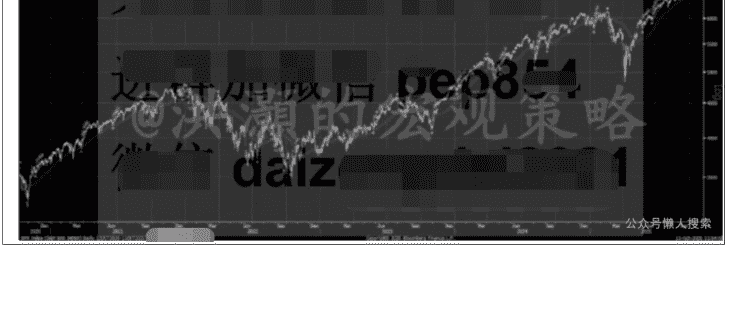

# 特朗普重挫美股万亿美元

251013  洪灝

整理：公众号懒人搜索，懒人专属群独享

懒人微信：lazyhelper

特朗普重挫美股。

隔夜，特朗普对中国出口宣布增收100%的关税，并进一步加强软件科技出口禁运。如是，美国对中国出口关税将高达130%，略低于四月时的145%的关税。特朗普还在自己的社交媒体上发了两篇措辞激烈的博文来抒发自己的挫败感。

由于特朗普的反应出人意料，美股应声而落，标普暴跌了近200点，而纳指更是暴跌了近900点，约3.6%。这是四月以来美股最大的单天暴跌。同时，这次美股的暴跌是从历史高位一口气跌到了近四个交易周以来的最低点，这是非常罕见的。

这次也是美股在连续119个交易日后第一次出现3%以上的单天回调，为历史第七长的纪录。在昨晚的避险交易中，就连传统的避险资产美元都从100附近跌到了98，再次显示了特朗普肆无忌惮地对于国际贸易系统的干扰进一步地损害了美元信用。

昨晚的大规模暴跌也从侧面反映了市场之前对于特朗普发起的贸易战已经麻木不仁，并认为贸易战的大部分风险已经计入了市场价格。同时，美联储以及各西方国家央行对于财政政策的放任自流、对于通胀压力的熟视无睹也导致了市场流动性异常的充沛，助力了风险资产的价格上涨。然而，尽管市场持续上涨，其实很多市场的情绪指标也并未达到“过度贪婪”的程度。这些现象都表明了，许多常规的量化模型指标并未明确发出卖出的信号，而这次美股的回调更多的是一次“事件驱动”的回调。

中国市场还在国庆长假中缓缓地苏醒过来。虽然长假归来的第一天，中国市场表现强劲，但是鉴于美股昨晚如此大的波动，全球市场下周也难免不被波及。那么，投资者在未来几周应该如何应对？

以下内容仅 V+会员可见

昨晚特朗普的激烈加收关税的反应，很可能是针对我方日前对于稀土出口控制的升级而定。日前，我方规定，出口产品的价值中含有超过0.1%的稀土，无论产地何处，都需要获得我方的批示才能出口。这是我方第一次对于我方的战略性出口产品进行“长臂管辖”。国庆期间，我方还就美国船舶或者在美国注册的船舶进出中国港口开始征收港口费，以回应对方对于我方船舶、甚至是我方制造的船舶征收港口费用的举措。

我方征收船舶费用是一种对等的手段，而对于稀土出口的管控，则是一种非对称的制裁。2025年9月29日，BIS公布了一则关联公司规则，将重大许可限制扩大到受美国出口管制和制裁清单实体的外国子公司。这个关联公司规则效仿了美国财政部外国资产管制办公室（OFAC）的50%规则。

具体来说，BIS规则对任何由已确定名单上的外国实体公司、或这些公司的子公司、关联公司控股超过50%的公司施加与其母公司相同的出口许可证要求。BIS认为，在新的关联公司规则下，出口合规义务将增加，但鉴于公司根据OFAC的50%规则的现有合规程序，合规义务应该是可控的。

然而，这种“长臂规定”基本上把很多获得关键技术的缺口都堵上了。毕竟，许多公司的所有权结构错综复杂，很难界定在OFAC限制名单上的公司是否间接持有其它公司多少的股权。可以参考一下，最近美国科技股巨头互相下单的场景，很难界定谁是客户，谁是供应商，谁是股东——基本上都混为一谈了。有理由相信，对方的这种举措、以及对于我方船舶收费的措施，是违反了上个月的日内瓦谈判的精神的。

我方对于战略性稀土产品出口的管控升级，是对于对方这种“关联公司”规则的非对称应对。而这种升级应对，也将迫使对方在11月峰会前回到谈判桌上来，放下身段、认真谈判。

在特朗普的博文中，有三处重要的地方是值得投资者注意的：
- 他认为他增加关税的做法是他的回应，“只代表美国，而不代表其它国家”；
- 他认为“无论我方有什么垄断的卡点，美方有两倍的卡点可以回应”；
- 他还说，“作为美国总统，需要从金融上反击(financially counter)”。

简言之，特朗普认为这是一场单挑，而不像以前那样煽动其它国家也对于我方采取措施。同时，特朗普其实也只有关税这一招。然而，在经历了四月解放日之后，关税这个大棒，就有点儿像是程咬金的三板斧了。或者说，“狼来了”喊多了，市场也就麻木了。其次，我们还是要提防对方所谓的“金融反击”的风险，虽然这是一种终极的报复但也是一种两败俱伤的武器，就像三年前制裁俄罗斯一样。当时，美国没收了俄罗斯的外储，但是美元从那时候起也逐步失去了信用，美债的国际买家转而囤积黄金。

昨夜美股在特朗普的激烈回应下经历了四月“解放日”以来最大的单天暴跌。这对于一位痴迷于资本市场表现的总统来说，应是一记警钟。果然，临收市之前，特朗普又宣称其实“并没有取消峰会”，还称“还是不妨见一下(might as well meet up)”。这些都是经典的“TACO”举动。在经历了近120个交易日没有超过“3%”单天暴跌之后，美股昨夜在历史高点附近暴跌到了近四个交易周的最低点。一夜功夫，摧毁了一个月的收获。鉴于对方近日的一系列举措，我方的反制是必须的，也是正义合理的。在距离峰会还有几周的时间窗口里，双方如此极限的较量，像是为一个雄伟的讨价还价（grand bargain）做铺垫。双方都明牌了，因此最终的讨价还价的结果很难是130%关税的落地——尤其是对于对方的经济实力将会是难以承受之重。

近日，外媒报道，称我方意欲在美投资一万亿美元来换取对方对于我方所有限制的解除。无论真假，我方对于这次较量和其结果都是有充分准备的。市场在四月的时候已经经历了一次严峻的考验。彼时，尽管美股经历了史诗级的暴跌，但是中国市场的下跌远比美股幅度要小，同时修复的幅度和速度都远胜于美国。值得注意的是，特朗普的新增关税的实施日期是11月一日，而我方的稀土管制升级有效日期是十二月一日，峰会则是在十月底。

如图，标普已经在一夜之间回到了 50 天线。一般来说，模型显示红点为阶段性高点（图一）。红点出现之后，市场往往开启回调。

第一目标应该在略低于 6300 左右。如失手，第二目标则在略低于 6000 左右，然后再观察。我们相信，这次较量暂时不能改变市场上行的轨迹。当然，短期的扰动无法避免。

最后，安利小懒的付费群：
- 懒人专属群（介绍）

懒人专属群持续更新中，已持续运营 6 年，整理超 3000 份各类精选付费文章 & 年费社群干货，全部开放下载。

## 公众号懒人搜索，懒人专属群分享

本资料为付费群内部分享，仅供真实有需要的朋友查阅 🤔

懒人专属群更新记录：
https://lazy2025.top/blog/record2

懒人专属群更新记录（需梯子，备用）：
https://lazybook.fun/blog/record2